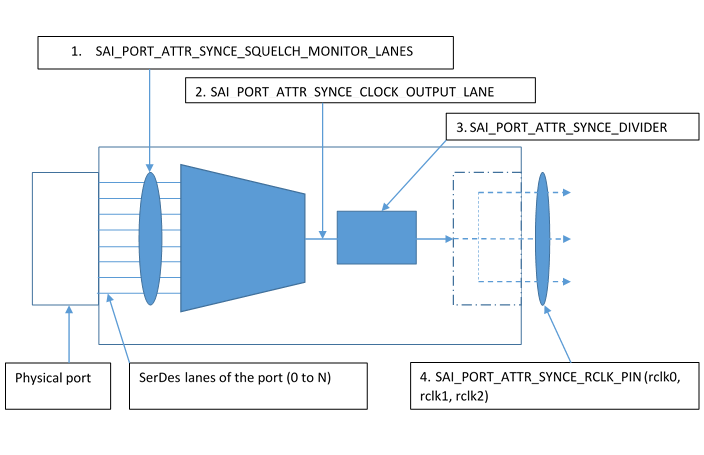

# External PHY Recovered Clock

# Proposal

| **Title** | **External PHY Recovered Clock** |
| --- | --- |
| **Authors** | **Broadcom** |
| **Status** | **Draft** |
| **Type** |
 |
| **Created** | **07/29/2021** |
| **SAI-Version** | **0.1** |

# **Contents**

[List of Changes](#_Toc68201129)

[1 Overview](#_Toc68201130)

[1.1 Recovered Clock (SyncE) Block Diagram ](#_Toc68201131)

[1.2 Recovered Clock (SyncE) Port Attributes ](#_Toc68201132)

[1.3 Recovered Clock (SyncE) Configuration on PHY ](#_Toc68201133)

[2 Configuration Example ](#_Toc68201134)

# List of Changes

| **Version** | **Changes** | **Name** | **Date** |
| --- | --- | --- | --- |
| 0.1 | Proposal for PAI Recovered Clock | | 07/29/2021 |

# Overview

The purpose of this document is to describe Recovered Clock (SyncE) functionality and interface to manage Recovered Clock functionality of the PHY. PHY is the connector between MAC (SerDes) and physical medium such as optical fiber or copper transceivers. Recovered Clock derived from the line, locked to the incoming data rate. SyncE, short for Synchronous Ethernet, is a method to transfer frequency over the Ethernet physical layer across a network traceable to a reference clock.

## Recovered Clock (SyncE) Block Diagram

## Recovered Clock (SyncE) Port Attributes

1.	SAI_PORT_ATTR_SYNCE_SQUELCH_MONITOR_LANES – This attribute configures the global lane number(s) which will be used to generate recovered clock. These lanes are also monitored for any link events to squelch the recovered clock output. If the physical port has N number of lanes, then any lanes from lanes 0 to N can be used for this attribute.

2.	SAI_PORT_ATTR_SYNCE_DIVIDER – This attribute is to configure the divider value. Divider value is used to control the output frequency of the recovered clock.
a.	Output Frequency = Lane Data rate / Divider
E.g. A 1000 divider and 25G lane data rate, outputs 25MHz recovered clock. Divider can be changed to achieve required recovered clock output frequency. 

3.	SAI_PORT_ATTR_SYNCE_CLOCK_OUTPUT_LANE – A global lane number that will be used for outputting the recovered clock. Any lanes from lanes 0 to N can be selected to output the recovered clock.

4.	SAI_PORT_ATTR_SYNCE_RCLK_PIN – Output the recovered clock coming from the lane configured in SAI_PORT_ATTR_SYNCE_CLOCK_OUTPUT_LANE attribute.  A PHY chip can support multiple output pins to output the clock from the selected output lanes. These pins can be probed to observe the clock on the oscilloscope. The output pin information will be available in the board schematic. The output pin(s) can be shared across other ports or die’s SyncE configurations, depending on the board design.

5.	SAI_PORT_ATTR_SYNCE_GEN_SQUELCH_CONFIG – This attribute allows user to enable or disable recovered clock output generation and configure squelch mechanism whether to squelch the output clock based on loss of lock or loss of signal or both.

Note: Support of SyncE attributes, divider values, output clock pin configurations, and squelch mechanisms may vary depending on the chip capability and board design.

## Recovered Clock (SyncE) Configuration on PHY

Recovered Clock (SyncE) can be configured on the PHY.

# Additions to saiport.h
/**
 * @brief Attribute data for #SAI_PORT_ATTR_SYNCE_GEN_SQUELCH_CONFIG
 * Used for Recovered Clock Generation and Squelch Mode Configuration
 */

typedef enum _sai_port_synce_gen_squelch_config_t
{

    /** Disable clock Gen and Squelch */
    SAI_PORT_SYNCE_GEN_SQUELCH_CONFIG_DISABLE,

    /** Enable clock Gen only, no squelch needed (Clock is always sent out) */
    SAI_PORT_SYNCE_GEN_SQUELCH_CONFIG_NONE,

    /** Squelch clock on Loss of Signal (LOS) */
    SAI_PORT_SYNCE_GEN_SQUELCH_CONFIG_LOS,

    /** Squelch clock on Loss of Lock (LOL) */
    SAI_PORT_SYNCE_GEN_SQUELCH_CONFIG_LOL,

    /** Squelch clock on Loss of Signal(LOS) or Loss of Lock(LOL) */
    SAI_PORT_SYNCE_GEN_SQUELCH_CONFIG_LOS_OR_LOL,

    /** Force Squelch */
    SAI_PORT_SYNCE_GEN_SQUELCH_CONFIG_FORCE
} sai_port_synce_gen_squelch_config_t;
 

/**
 * @brief Attribute data for #SAI_PORT_ATTR_SYNCE_DIVIDER
 * Divider selection to apply on Line/Lane rate before outputting clock
 */
 
typedef enum _sai_port_synce_divider_t
{

    /** Divide by 20 */
    SAI_PORT_SYNCE_DIVIDER_20,

    /** Divide by 40 */
    SAI_PORT_SYNCE_DIVIDER_40,

    /** Divide by 80 */
    SAI_PORT_SYNCE_DIVIDER_80,

    /** Divide by 160 */
    SAI_PORT_SYNCE_DIVIDER_160,

    /** Divide by 400 */
    SAI_PORT_SYNCE_DIVIDER_400,

    /** Divide by 1000 */
    SAI_PORT_SYNCE_DIVIDER_1000,

    /** Divide by 64 */
    SAI_PORT_SYNCE_DIVIDER_64,

    /** Divide by 128 */
    SAI_PORT_SYNCE_DIVIDER_128,

    /** Divide by 256 */
    SAI_PORT_SYNCE_DIVIDER_256,

    /** Divide by 512 */
    SAI_PORT_SYNCE_DIVIDER_512,

    /** Divide by 1024 */
    SAI_PORT_SYNCE_DIVIDER_1024,

    /** Divide by 2048 */
    SAI_PORT_SYNCE_DIVIDER_2048,

    /** Divide by 4096 */
    SAI_PORT_SYNCE_DIVIDER_4096,

    /** Divide by 8192 */
    SAI_PORT_SYNCE_DIVIDER_8192,

    /** Divide by 32 */
    SAI_PORT_SYNCE_DIVIDER_32,

    /** Divide by 120 */
    SAI_PORT_SYNCE_DIVIDER_120,

    /** Divide by 240 */
    SAI_PORT_SYNCE_DIVIDER_240,

    /** Divide by 520 */
    SAI_PORT_SYNCE_DIVIDER_520,

    /** Divide by 2040 */
    SAI_PORT_SYNCE_DIVIDER_2040,

    /** Divide by 4080 */
    SAI_PORT_SYNCE_DIVIDER_4080,

    /** Divide by 1. */
    SAI_PORT_SYNCE_DIVIDER_1,

    /** Divide by 2. */
    SAI_PORT_SYNCE_DIVIDER_2,

    /** Divide by 4. */
    SAI_PORT_SYNCE_DIVIDER_4,

    /** Divide by 8. */
    SAI_PORT_SYNCE_DIVIDER_8,

    /** Divide by 16. */
    SAI_PORT_SYNCE_DIVIDER_16,

    /** Divide by 66. */
    SAI_PORT_SYNCE_DIVIDER_66,

    /** Divide by 82.5. */
    SAI_PORT_SYNCE_DIVIDER_82P5,

    /** Divide by 528. */
    SAI_PORT_SYNCE_DIVIDER_528
} sai_port_synce_divider_t;    

    /**
     * @brief Recovered Clock Generation enable/disable and Squelch Mode Configuration
     *
     * @type sai_port_synce_gen_squelch_config_t
     * @flags CREATE_AND_SET
     * @default SAI_PORT_SYNCE_GEN_SQUELCH_CONFIG_DISABLE
     */
    SAI_PORT_ATTR_SYNCE_GEN_SQUELCH_CONFIG,

    /**
     * @brief Recovered Clock Lane selection from global lane of phy_id
     *
     * @type sai_uint32_t
     * @flags CREATE_AND_SET
     * @default 0
     */
    SAI_PORT_ATTR_SYNCE_CLOCK_OUTPUT_LANE,

    /**
     * @brief Package Lanes that need to be monitored for Loss of Signal or Loss of Line
     *
     * @type sai_uint32_t
     * @flags CREATE_AND_SET
     * @default 0
     */
    SAI_PORT_ATTR_SYNCE_SQUELCH_MONITOR_LANES,

    /**
     * @brief Divider selection to apply on Line/Lane rate before outputting clock
     *
     * @type sai_port_synce_divider_t
     * @flags CREATE_AND_SET
     * @default SAI_PORT_SYNCE_DIVIDER_20
     */
    SAI_PORT_ATTR_SYNCE_DIVIDER,

    /**
     * @brief Recovered clock output pins are rclk0 - 0, rclk1 - 1 and rclk2 - 2
     *
     * @type sai_uint32_t
     * @flags CREATE_AND_SET
     * @default 0
     */
    SAI_PORT_ATTR_SYNCE_RCLK_PIN,

# Configuration Example

Following example shows how to setup Recovered Clock configuration on a port. In this example a 16 lane PHY is used.

    /* Create System side, Line side, and System Side Failover ports */
    sys_attr[0].value.u32list.list = sys_lane_list;
    line_attr[0].value.u32list.list = line_lane_list;
    failover_attr[0].value.u32list.list = failover_lane_list;
    line_attr[1].id = sys_attr[1].id = SAI_PORT_ATTR_SPEED;
    line_attr[1].value.u32= sys_attr[1].value.u32 = 100000;
    line_attr[2].id = sys_attr[2].id = SAI_PORT_ATTR_INTERFACE_TYPE;
    line_attr[2].value.u32 = sys_attr[2].value.u32 = SAI_PORT_INTERFACE_TYPE_KR;
    line_attr[3].id = sys_attr[3].id = SAI_PORT_ATTR_FEC_MODE;
    line_attr[3].value.u32 = sys_attr[3].value.u32 = SAI_PORT_FEC_MODE_RS;
    line_attr[4].id = sys_attr[4].id = SAI_PORT_ATTR_LINK_TRAINING_ENABLE;
    line_attr[4].value.booldata = sys_attr[4].value.booldata = 1;
    line_attr[5].id = sys_attr[5].id = SAI_PORT_ATTR_ADMIN_STATE;
    line_attr[5].value.booldata = sys_attr[5].value.booldata = 1;

    line_attr[6].id = SAI_PORT_ATTR_SYNCE_GEN_SQUELCH_CONFIG;
    line_attr[6].value.u32 = 1;
    line_attr[7].id = SAI_PORT_ATTR_SYNCE_CLOCK_OUTPUT_LANE;
    line_attr[7].value.u32 = 21;
    line_attr[8].id = SAI_PORT_ATTR_SYNCE_DIVIDER;
    line_attr[8].value.u32 = SAI_PORT_SYNCE_DIVIDER_1024;
    line_attr[9].id = SAI_PORT_ATTR_SYNCE_RCLK_PIN;
    line_attr[9].value.u32 = 0;

    for (port_index = 0; port_index < 1; port_index ++) {
        for (phy_index = 0; phy_index < PAI_MAX_PHY; phy_index ++) {
            attr_count = 1;
            memset(&port_attr_get, 0, sizeof(port_attr_get));
            port_attr_get[0].id = SAI_PORT_ATTR_SYNCE_GEN_SQUELCH_CONFIG;
            rv = pai_port_apis_ptr->get_port_attribute(line_port_id[phy_index][port_index], attr_count, port_attr_get);
            if (SAI_STATUS_SUCCESS != rv)  {
                printf("get Port Attribute failed return:%d\n", rv);
                return rv;
            }
            printf("PAI Port synce config get attribute values port_attr_get[%d].id:%d\n", phy_index, port_attr_get[0].value.u32);
        }
    }
    
    for (port_index = 0; port_index < 1; port_index ++) {
        for (phy_index = 0; phy_index < PAI_MAX_PHY; phy_index ++) {
            attr_count = 1;
            memset(&port_attr_get, 0, sizeof(port_attr_get));
            port_attr_get[0].id = SAI_PORT_ATTR_SYNCE_CLOCK_OUTPUT_LANE;
            rv = pai_port_apis_ptr->get_port_attribute(line_port_id[phy_index][port_index], attr_count, port_attr_get);
            if (SAI_STATUS_SUCCESS != rv)  {
                printf("get Port Attribute failed return:%d\n", rv);
                return rv;
            }
            printf("PAI Port synce config get attribute values port_attr_get[%d].id:%d\n", phy_index, port_attr_get[0].value.u32);
        }
    }

    for (port_index = 0; port_index < 1; port_index ++) {
        for (phy_index = 0; phy_index < PAI_MAX_PHY; phy_index ++) {
            port_attr_set.id = SAI_PORT_ATTR_SYNCE_GEN_SQUELCH_CONFIG;
            port_attr_set.value.u32 = 0;
            printf("PAI Port synce mode attribute values :%d\n", port_attr_set.value.u32);
            rv = pai_port_apis_ptr->set_port_attribute(line_port_id[phy_index][port_index], &port_attr_set);
            if (SAI_STATUS_SUCCESS != rv)  {
                printf("Set Port Attribute failed return:%d\n", rv);
                return rv;
            }

            port_attr_set.id = SAI_PORT_ATTR_SYNCE_RCLK_PIN;
            port_attr_set.value.u32 = 2;
            printf("PAI Port synce mode attribute values :%d\n", port_attr_set.value.u32);
            rv = pai_port_apis_ptr->set_port_attribute(line_port_id[phy_index][port_index], &port_attr_set);
            if (SAI_STATUS_SUCCESS != rv)  {
                printf("Set Port Attribute failed return:%d\n", rv);
                return rv;
            }
            port_attr_set.id = SAI_PORT_ATTR_SYNCE_CLOCK_OUTPUT_LANE;
            port_attr_set.value.u32 = 3;
            printf("PAI Port synce mode attribute values :%d\n", port_attr_set.value.u32);
            rv = pai_port_apis_ptr->set_port_attribute(line_port_id[phy_index][port_index], &port_attr_set);
            if (SAI_STATUS_SUCCESS != rv)  {
                printf("Set Port Attribute failed return:%d\n", rv);
                return rv;
            }
        }
    }
