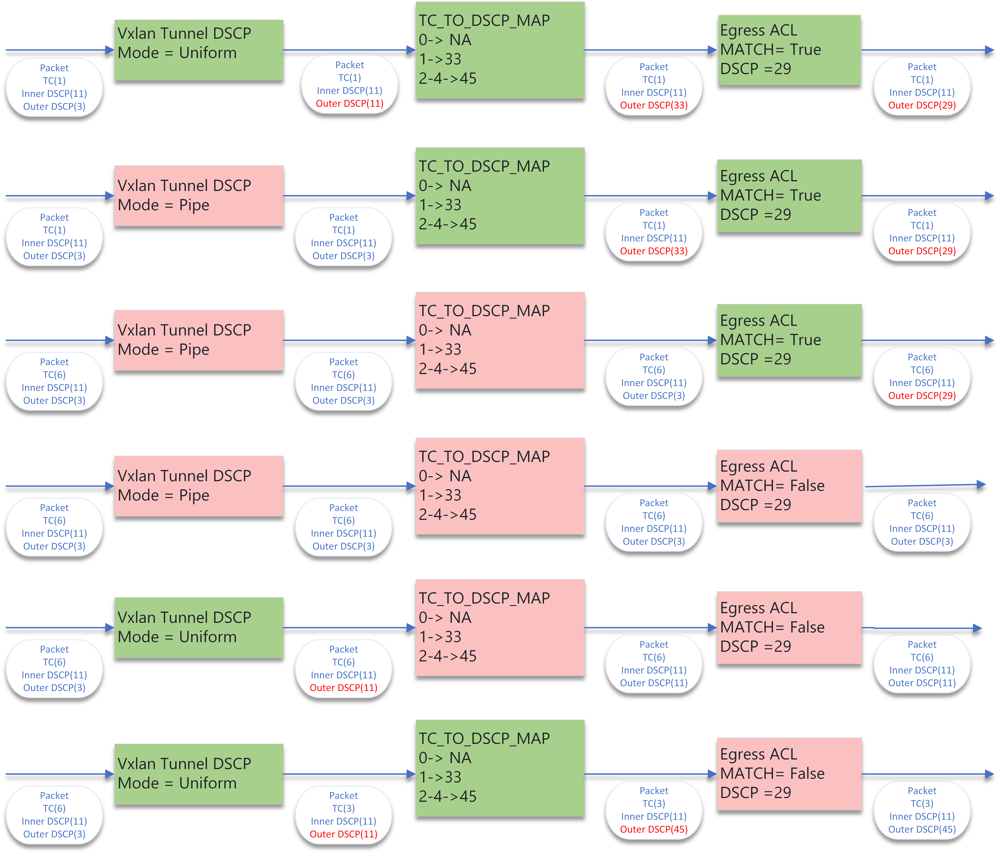
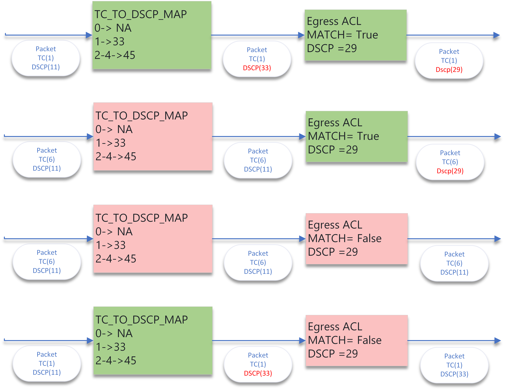

SAI ACL DSCP action behavior
-------------------------------------------------------------------------------
 Title       | SAI ACL DSCP action behavior
-------------|-----------------------------------------------------------------
 Authors     | Shahzad Iqbal, Microsoft Corp.
 Status      | In review
 Type        | Standards track
 Created     | 05/31/2024: Initial Draft
 SAI-Version | 1.14
-------------------------------------------------------------------------------

This spec talks about defining the behavior of various components which set DSCP value in the Egress packet pipeline.

# Overview #

ACL has the capability to change the DSCP value of an L3 packet based on a match criteria. There are other components in a router environment
which can change this attribute. A clear order of precedence is needed for predictable behavior if multiple subsystems in the packet pipeline change this value. 

## SAI functions capable of changing DSCP. ##

There are currently 5 components in SAI which have the ability of change directly or indirectly the DSCP value of a given packet in a packet pipeline. 

-------------------------------------------------------------------------------
 Function                             | SAI attribute 
--------------------------------------|----------------------------------------
 Ingress DSCP to TC mapping           | SAI_PORT_ATTR_QOS_DSCP_TO_TC_MAP 
 Ingress ACL DSCP, TC change action   | SAI_ACL_ENTRY_ATTR_ACTION_SET_DSCP, SAI_ACL_ENTRY_ATTR_ACTION_SET_TC 
 Vxlan Tunnel DSCP mode               | SAI_TUNNEL_DSCP_MODE_PIPE_MODEL, SAI_TUNNEL_DSCP_MODE_UNIFORM_MODEL 
 Egress TC to DSCP mapping            | SAI_TUNNEL_ATTR_ENCAP_QOS_TC_AND_COLOR_TO_DSCP_MAP 
 Ingress ACL DSCP, change action      | ACL SAI_ACL_ENTRY_ATTR_ACTION_SET_DSCP 
-------------------------------------------------------------------------------

Since these components operate in different positions in a switch ASIC pipeline, a possibility exists that DSCP value change performed by one component may be undone by the subsequent component. 

The overall behavior can be segregated into three sections of the pipeline. Ingress, post-Ingress and Egress. This proposal focuses on the Egress section of the pipeline. 

# Proposal for Egress Behavior #

The DSCP value set by various components on the egress side of the ASIC pipeline shall have the following precedence in descending order. This precedence shall apply to the outermost Header of an L3 encapsulated packet. 

1. Egress ACL. 

2. Egress TC to DSCP mapping. 

3. Vxlan Tunnel DSCP mode 

This means that the Egress TC to DSCP mapping shall be able to overwrite the outer header DSCP value of an L3 encapsulated packet and Egress ACL shall be able to overwrite the value set by Egress TC to DSCP mapping. 

## Examples Encapsulated packets. ##

These following flows depict how the DSCP value shall be changed by different components in the order of precedence for encapsulated packets. Here the Outer DSCP field change is depicted in red and the stage performance change is marked in Green.

## Examples Unencapsulated packets. ## 

These following flows depict how the DSCP value shall be changed by different components in the order of precedence.  

