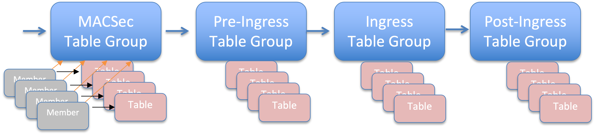
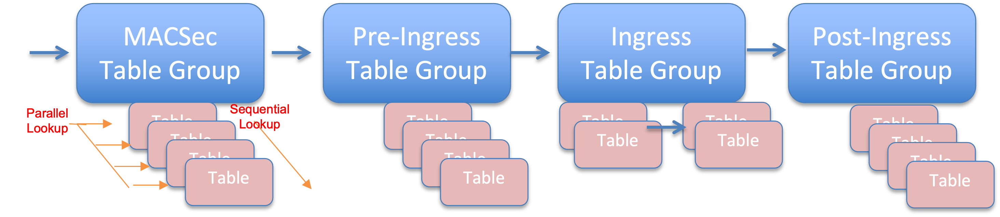
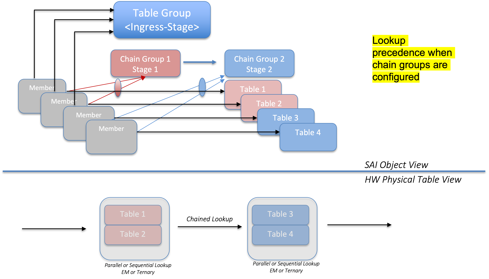

#  Chained ACL Table Groups
-------------------------------------------------------------------------------
 Title       | SAI support for Chained ACL Groups
-------------|-----------------------------------------------------------------
 Authors     | Jai Kumar, Broadcom Inc.
 Status      | In review
 Type        | Standards track
 Created     | 04/08/2023: Initial Draft
 SAI-Version | 1.13
-------------------------------------------------------------------------------

# Table of contents
1. [Introduction](#introduction)
2. [Motivation](#introduction1)
3. [Chained Table Groups](#introduction2)
4. [SAI Spec Changes](#introduction3)
    1. [Chain Table Group Object and Binding](#introduction3.1)
    2. [Chain Table Group Attributes](#introduction3.2)
5. [Capability Query](#introduction4)
    1. [Query for Chain Group support](#introduction4.1)
    2. [Query for Chain Group stages](#introduction4.2)
6. [Warmboot Implications](#introduction5)
7. [Sample Workflow](#introduction6)

&nbsp;
## 1. Introduction <a name="introduction"></a>
SAI pipeline has the concept of ACL stages. There are total 4 stages defined in SAI logical pipeline
```
    /**
     * @brief Attribute data for SAI_ACL_TABLE_ATTR_STAGE
     */
    typedef enum _sai_acl_stage_t
    {
        /** Ingress Stage */
        SAI_ACL_STAGE_INGRESS,
    
        /** Egress Stage */
        SAI_ACL_STAGE_EGRESS,
    
        /** Ingress Stage */
        SAI_ACL_STAGE_INGRESS_MACSEC,
    
        /** Egress Stage */
        SAI_ACL_STAGE_EGRESS_MACSEC,
    
        /** Pre-ingress Stage */
        SAI_ACL_STAGE_PRE_INGRESS,
    
        /** Post Ingress Stage */
        SAI_ACL_STAGE_POST_INGRESS,
    
    } sai_acl_stage_t;
```
Each stage is cascaded aka chained. There are two implications of it
1. Stage earlier has a higher priority in case of conflicting actions with later stage (unless stated otherwise)
2. Stages appear as chained i.e. output from one stage can be used in a the following stage as a match criteria


__Figure 1: ACL Stages in SAI Pipeline__

Some more key points are:
- Each stage allows only a single ACL Table Group. Table Group can have one or more member tables.
- Each stage allows Parallel or Sequential lookup within its member tables. Sequential means that lookup amongst tables in a Table Group stops after the first match.
- ACL Table Group members can be an arbitrary combination of tables types Exact Match or Ternary.
&nbsp;
## 2. Motivation <a name="introduction1"></a>
New advancements in chip design have introduced the concept of dividing up the TCAM used for ACLs into hash tables and TCAMs. Hash tables use considerably less power and are cost optimized. Exact match entries use the hash table and maskable entries use TCAM. 
Given that each ACL stage in the SAI pipeline can be a combination of EM and TCAM in the chip, there is a need to expose this concept in SAI. One option is to introduce another ACL stage representing the EM table. This approach is not scalable as different chip vendors may have different combinations of EM and TCAM in various order.

So instead of introducing more ACL stages, this proposal introduces a concept of chain table groups at each ACL stage.


__Figure 2: Chained ACL in SAI Pipeline__

&nbsp;
## 3. Chained Table Groups <a name="introduction2"></a>
What is a chained table group:
- New object that can be referred to by table group members
- Multiple table group members can point to a single chain table group. 
- There can be multiple chain table groups under the table group
- Eventual hierarchy will be: Table Group -> Chain table group(s) -> table(s)
- SAI Object representation of this hierarchy will be table group member pointing to table group as well chain table group
- Chain table group has a concept of order specified by a stage attribute
- HW lookup within a table group is chained aka cascaded across chain table groups
- HW lookup within a chain table group can be sequential or parallel
- Metadata can be passed from one stage chain table group to subsequent stage
- Conflicting action between stages are resolved based on the existing concept of that early stage is higher priority than subsequent stage


__Figure 3: Chained ACL Concept__

&nbsp;
## 4. SAI Spec Changes <a name="introduction3"></a>
This section talks about the SAI spec changes to support the concept of chain table group.
&nbsp;
### 4.1. Chain Table Group Object and Binding <a name="introduction3.1"></a>
**New chain table group object SAI_OBJECT_TYPE_ACL_TABLE_CHAIN_GROUP is introduced.**
```
     . . .
     SAI_OBJECT_TYPE_ACL_TABLE_CHAIN_GROUP    = 105,
     SAI_OBJECT_TYPE_MAX,  /* Must remain in last position */
 } sai_object_type_t;
```
This object is referenced by the table group member object.  Note that SAI_ACL_TABLE_GROUP_MEMBER_ATTR_ACL_TABLE_CHAIN_GROUP_ID is a CREATE_AND_SET attribute. This means that NOS can configure the chain group during run time. API support for the object can be queried using the query API for a given HW.
```
     /**
      * @brief ACL table chain group id
      *
      * This attribute is required to associate or attach a member object (acl_table_id)
      * to a ACL table chain group id allocated during create ACL table chain group API.
      *
      * The ACL Table lookup could be done serially or in parallel within the chain group.
      *
      * @type sai_object_id_t
      * @flags CREATE_AND_SET
      * @objects SAI_OBJECT_TYPE_ACL_TABLE_CHAIN_GROUP
      * @allownull true
      * @default SAI_NULL_OBJECT_ID
      */
     SAI_ACL_TABLE_GROUP_MEMBER_ATTR_ACL_TABLE_CHAIN_GROUP_ID,
```

&nbsp;
### 4.2. Chain Table Group Attributes <a name="introduction3.2"></a>
**Following attributes are added to the chain table group object.**
&nbsp;
> SAI_ACL_TABLE_CHAIN_GROUP_ATTR_TYPE specifies the lookup type of chain group. When a chain group is  configured, the lookup type of the chain group always takes precedence over the table group lookup type.
```
/**
  * @brief Attribute data for SAI_ACL_TABLE_CHAIN_GROUP_ATTR_TYPE
  */
 typedef enum _sai_acl_table_chain_group_type_t
 {
     /** SEQUENTIAL */
     SAI_ACL_TABLE_CHAIN_GROUP_TYPE_SEQUENTIAL,

     /** PARALLEL */
     SAI_ACL_TABLE_CHAIN_GROUP_TYPE_PARALLEL,
 } sai_acl_table_chain_group_type_t;
```

&nbsp;
> SAI_ACL_TABLE_CHAIN_GROUP_ATTR_STAGE specifies the numerical ordering of the chain group for chained aka cascaded lookup. 
```
/**
  * @brief Attribute data for SAI_ACL_TABLE_CHAIN_GROUP_ATTR_STAGE
  */
 typedef enum _sai_acl_table_chain_group_stage_t
 {
     /** Stage 0 */
     SAI_ACL_TABLE_CHAIN_GROUP_STAGE_0,

     /** Stage 0 */
     SAI_ACL_TABLE_CHAIN_GROUP_STAGE_1,

     /** Stage 1 */
     SAI_ACL_TABLE_CHAIN_GROUP_STAGE_2,

     /** Stage 2 */
     SAI_ACL_TABLE_CHAIN_GROUP_STAGE_3,

 } sai_acl_table_chain_group_stage_t;
```
&nbsp;
**Chain table group action pointing to another chain table group in the chain**
> SAI_ACL_ENTRY_ATTR_ACTION_CHAIN_REDIRECT helps to set a redirect action to another chain table group object that is  not the immediate next chain table group in the order. 
> For example: Let's say there are 3 chain table groups: CTG1, CTG2, and CTG3. It's quite possible that some ACL table entry in CTG1 needs to point to CTG3 for a subsequent lookup. This is achieved using the following attribute.
```
    /**
     * @brief Redirect Packet to a next chain table group object for chained lookup
     *
     * @type sai_acl_action_data_t sai_object_id_t
     * @flags CREATE_AND_SET
     * @objects SAI_OBJECT_TYPE_ACL_TABLE_CHAIN_GROUP
     * @default disabled
     */
    SAI_ACL_ENTRY_ATTR_ACTION_CHAIN_REDIRECT = SAI_ACL_ENTRY_ATTR_ACTION_START + 0x38,
```

&nbsp;
**Chain table group attribute enum**
```
 /**
  * @brief Attribute Id for acl_table_chain_group
  */
 typedef enum _sai_acl_table_chain_group_attr_t
 {
     /**
      * @brief Start of attributes
      */
     SAI_ACL_TABLE_CHAIN_GROUP_ATTR_START,

     /**
      * @brief ACL table sub group type
      *
      * ACL table group type represents the way various ACL tables within this
      * ACL table group perform their lookups. There are two optional values:
      * Sequential - All the ACL tables are looked up in a sequential order,
      * which is based on the ACL table priorities and only one ACL entry is matched
      * with its corresponding ACL entry action applied. In case two ACL tables
      * have the same priority they are looked up on a first come basis.
      * Parallel - All the ACL tables within the ACL table groups are looked up
      * in parallel and non-conflicting actions are resolved and applied from
      * multiple matched ACL entries (each from different ACL tables of this group).
      * Conflicting actions are resolved based on the ACL table priorities.
      *
      * @type sai_acl_table_chain_group_type_t
      * @flags CREATE_ONLY
      * @default SAI_ACL_TABLE_CHAIN_GROUP_TYPE_SEQUENTIAL
      */
     SAI_ACL_TABLE_CHAIN_GROUP_ATTR_TYPE = SAI_ACL_TABLE_CHAIN_GROUP_ATTR_START,

     /**
      * @brief ACL table sub group stage
      *
      * ACL table sub group stage represents the cascading stage in the pipeline.
      * Lower numbered stage comes before the higher numbered stage.
      *
      * @type sai_acl_table_chain_group_stage_t
      * @flags CREATE_ONLY
      * @default SAI_ACL_TABLE_CHAIN_GROUP_STAGE_0
      */
     SAI_ACL_TABLE_CHAIN_GROUP_ATTR_STAGE,

     /**
      * @brief End of attributes
      */
     SAI_ACL_TABLE_CHAIN_GROUP_ATTR_END,

     /**
      * @brief Custom range base value start
      */
     SAI_ACL_TABLE_CHAIN_GROUP_ATTR_CUSTOM_RANGE_START = 0x10000000,

     /**
      * @brief End of Custom range base
      */
     SAI_ACL_TABLE_CHAIN_GROUP_ATTR_CUSTOM_RANGE_END

 } sai_acl_table_chain_group_attr_t;
```
&nbsp;
## 5. Capability Query <a name="introduction4"></a>
NOS can  query SAI to find out if hardware supports the concept of chain ACL groups. If yes then NOS can subsequently query how many stages and type of lookup is supported at each stage by the hardware.
&nbsp;
### 5.1. Query for Chain Group support <a name="introduction4.1"></a>
**Hardware can be queried using the following query API. SAI adapter will return the sai_attr_capability_t structure with create/get/set capabilities.**

> sai_query_attribute_capability(switch_id, 
>  &emsp;  &emsp;                           SAI_OBJECT_TYPE_ACL_TABLE_CHAIN_GROUP,
>  &emsp;  &emsp;                           SAI_ACL_TABLE_GROUP_MEMBER_ATTR_ACL_TABLE_CHAIN_GROUP_ID, 
>  &emsp;    &emsp;                         attr_cap)

&nbsp;
### 5.2. Query for Chain Group stages <a name="introduction4.2"></a>
**sai_acl_capability_t is enhanced with following fields**
acl_chain_list will return **count** as the number of stages in the ACL stage and **list** will consist of **chain_group_stage** and **supported_match_type** for each stage.

> sai_query_attribute_capability(switch_id, 
> &emsp;   &emsp;                           SAI_OBJECT_TYPE_SWITCH,
>  &emsp;  &emsp;                           SAI_SWITCH_ATTR_ACL_STAGE_INGRESS, 
>  &emsp;  &emsp;                           attr_cap)
```
/**
  * @brief Structure for ACL chain stage and corresponding table type
  */
 typedef struct _sai_acl_chain_t
 {
     /** ACL table chain stage */
     sai_acl_table_chain_group_stage_t chain_group_stage;

     /** Table type supported for this stage */
     sai_acl_table_supported_match_type_t supported_match_type;
 } sai_acl_chain_t;

 typedef struct _sai_acl_chain_list_t
 {
     /** Number of stages in the chain */
     uint32_t count;

     /** Chain list */
     sai_acl_chain_t *list;

 } sai_acl_chain_list_t;
 
 /**
 * @brief Structure for ACL attributes supported at each stage.
 * action_list alone is added now. Qualifier list can also be added
 * when needed.
 */
typedef struct _sai_acl_capability_t
     . . .
     /**
      * @brief Number of chained stages and types supported for a given ACL stage.
      */
     sai_acl_chain_list_t acl_chain_list;

 } sai_acl_capability_t;
```
&nbsp;
## 6. Warmboot Implications <a name="introduction5"></a>
This change does not impact the warm boot and the system can be upgraded without any impact to the forwarding traffic. This is for the reason that the chain group concept is a logical grouping of tables and does not change the existing binding of table group or table bind points.

Since warm boot retains the binding point, table group object and associated tables with it, there is no change in the HW configuration.

Let's say that after warm boot there is a need to create a chain group for a new table. In this case the existing table, say table 1 will get a logical relationship with a new chain group object 1 and will not cause any impact to the forwarding traffic.
Subsequently a new table and corresponding chain group object is created. This is programmed by the SAI adapter as a new HW table.

&nbsp;
## 7. Sample Workflow <a name="introduction6"></a>

**Bind Point**: Port

**ACL Stage**: Ingress

**Table Group**: acl_grp_id, Lookup:Sequential

**Chain Table Group**: [acl_chain_grp_id1, sequential, stage 0], [acl_chain_grp_id2, parallel, stage 1]

**Table**: acl_table_id1, acl_table_id2

**Table Group Member**:acl_grp_mem1, acl_grp_mem2

**Relationship**
acl_grp_id -> [acl_chain_grp_id1, sequential, stage 0], [acl_chain_grp_id2, parallel, stage 1]

acl_chain_grp_id1 -> [acl_table_id1, exact match]

acl_chain_grp_id2 -> acl_table_id2, ternary]

Step 0:
sai_query_attribute_capability() to check if the device supports ACL chained table groups at ingress stage. If yes, then query using sai_acl_capability_t sai_acl_chain_list_t to check the number of chain stages and lookup type (Sequential or Parallel) at each chain stage.

```
// CREATE AN INGRESS ACL TABLE GROUP
sai_object_id_t acl_grp_id = 0ULL;
acl_grp_attr[0].id = SAI_ACL_TABLE_GROUP_ATTR_ACL_STAGE;
acl_grp_attr[0].value.s32 = SAI_ACL_STAGE_INGRESS;

acl_grp_attr[1].id = SAI_ACL_TABLE_GROUP_ATTR_ACL_BIND_POINT_TYPE_LIST;
acl_grp_attr[1].value.objlist.count = 1;
acl_grp_attr[1].value.objlist.list[0] = SAI_ACL_BIND_POINT_TYPE_PORT;

acl_grp_attr[2].id = SAI_ACL_TABLE_GROUP_ATTR_TYPE;
acl_grp_attr[2].value.s32 = SAI_ACL_TABLE_GROUP_SEQUENTIAL;

saistatus = sai_acl_api->create_acl_table_group(&acl_grp_id, 3, acl_grp_attr);
if (saistatus != SAI_STATUS_SUCCESS) {
    return saistatus;
}

// CREATE AN INGRESS ACL TABLE CHAIN GROUP 1
sai_object_id_t acl_chain_chain_grp_id1 = 0ULL;
acl_chain_grp_attr[0].id = SAI_ACL_TABLE_CHAIN_GROUP_ATTR_STAGE;
acl_chain_grp_attr[0].value.s32 = SAI_ACL_TABLE_CHAIN_GROUP_STAGE_0;

acl_chain_grp_attr[1].id = SAI_ACL_TABLE_GROUP_ATTR_TYPE;
acl_chain_grp_attr[1].value.s32 = SAI_ACL_TABLE_GROUP_SEQUENTIAL;

saistatus = sai_acl_api->create_acl_table_chain_group(&acl_chain_grp_id1, 2, acl_chain_grp_attr);
if (saistatus != SAI_STATUS_SUCCESS) {
    return saistatus;
}

// CREATE AN INGRESS ACL TABLE CHAIN GROUP 2
sai_object_id_t acl_chain_chain_grp_id2 = 0ULL;

acl_chain_grp_attr[0].id = SAI_ACL_TABLE_CHAIN_GROUP_ATTR_STAGE;
acl_chain_grp_attr[0].value.s32 = SAI_ACL_TABLE_CHAIN_GROUP_STAGE_1;

acl_chain_grp_attr[1].id = SAI_ACL_TABLE_GROUP_ATTR_TYPE;
acl_chain_grp_attr[1].value.s32 = SAI_ACL_TABLE_GROUP_PARALLEL;

saistatus = sai_acl_api->create_acl_table_chain_group(&acl_chain_grp_id2, 2, acl_chain_grp_attr);
if (saistatus != SAI_STATUS_SUCCESS) {
    return saistatus;
}
// Create an ACL table *acl_table_id1* , to be part of this group *acl_grp_id* and *acl_chain_grp_id1*
sai_object_id_t acl_table_id1 = 0ULL;

acl_attr_list[0].id = SAI_ACL_TABLE_ATTR_ACL_STAGE;
acl_attr_list[0].value.s32 = SAI_ACL_STAGE_INGRESS;

acl_attr_list[1].id = SAI_ACL_TABLE_GROUP_ATTR_ACL_BIND_POINT_TYPE_LIST;
acl_attr_list[1].value.objlist.count = 1;
acl_attr_list[1].value.objlist.list[0] = SAI_ACL_BIND_POINT_TYPE_PORT;

acl_attr_list[2].id = SAI_ACL_TABLE_ATTR_FIELD_SRC_MAC;
acl_attr_list[2].value.booldata = True;

acl_attr_list[3].id = SAI_ACL_TABLE_ATTR_ACL_TABLE_MATCH_TYPE;
acl_attr_list[3].value.s32 = SAI_ACL_TABLE_MATCH_TYPE_EXACT_MATCH;

saistatus = sai_acl_api->create_acl_table(&acl_table_id1, 4, acl_attr_list);
if (saistatus != SAI_STATUS_SUCCESS) {
    return saistatus;
}

// Create an ACL table *acl_table_id2* , to be part of this group *acl_grp_id* and *acl_chain_grp_id2*
sai_object_id_t acl_table_id2 = 0ULL;

acl_attr_list[0].id = SAI_ACL_TABLE_ATTR_ACL_STAGE;
acl_attr_list[0].value.s32 = SAI_ACL_STAGE_INGRESS;

acl_attr_list[1].id = SAI_ACL_TABLE_GROUP_ATTR_ACL_BIND_POINT_TYPE_LIST;
acl_attr_list[1].value.objlist.count = 1;
acl_attr_list[1].value.objlist.list[0] = SAI_ACL_BIND_POINT_TYPE_PORT;

acl_attr_list[2].id = SAI_ACL_TABLE_ATTR_FIELD_DST_MAC;
acl_attr_list[2].value.booldata = True;

acl_attr_list[3].id = SAI_ACL_TABLE_ATTR_ACL_TABLE_MATCH_TYPE;
acl_attr_list[3].value.s32 = SAI_ACL_TABLE_MATCH_TYPE_TERNARY;

saistatus = sai_acl_api->create_acl_table(&acl_table_id2, 4, acl_attr_list);
if (saistatus != SAI_STATUS_SUCCESS) {
    return saistatus;
}

// Create an ACL table entry to deny *src_mac_to_suppress2* in acl_table_id1
acl_entry_attrs[0].id = SAI_ACL_ENTRY_ATTR_TABLE_ID;
acl_entry_attrs[0].value.oid = acl_table_id1;

acl_entry_attrs[1].id = SAI_ACL_ENTRY_ATTR_PRIORITY;
acl_entry_attrs[1].value.u32 = 1;

acl_entry_attrs[2].id = SAI_ACL_ENTRY_ATTR_FIELD_SRC_MAC;
CONVERT_MAC_TO_SAI_MAC (acl_entry_attrs[2].value.aclfield.data.mac, src_mac_to_suppress2);

saistatus = sai_acl_api->create_acl_entry(&acl_entry, 3, acl_entry_attrs);
if (saistatus != SAI_STATUS_SUCCESS) {
    return saistatus;
}

// Create an ACL table entry to deny *dst_mac_to_suppress2* in acl_table_id2
acl_entry_attrs[0].id = SAI_ACL_ENTRY_ATTR_TABLE_ID;
acl_entry_attrs[0].value.oid = acl_table_id2;

acl_entry_attrs[1].id = SAI_ACL_ENTRY_ATTR_PRIORITY;
acl_entry_attrs[1].value.u32 = 1;

acl_entry_attrs[2].id = SAI_ACL_ENTRY_ATTR_FIELD_DST_MAC;
CONVERT_MAC_TO_SAI_MAC (acl_entry_attrs[2].value.aclfield.data.mac, src_mac_to_suppress2);

saistatus = sai_acl_api->create_acl_entry(&acl_entry, 3, acl_entry_attrs);
if (saistatus != SAI_STATUS_SUCCESS) {
    return saistatus;
}

// Create an acl group member 1 with acl_table_id1, acl_chain_grp_id1, and acl_grp_id
sai_object_id_t acl_grp_mem1 = 0ULL;
acl_mem_attr[0].id = SAI_ACL_TABLE_GROUP_MEMBER_ATTR_ACL_TABLE_GROUP_ID;
acl_mem_attr[0].value.s32 = acl_grp_id;

acl_mem_attr[1].id = SAI_ACL_TABLE_GROUP_MEMBER_ATTR_ACL_TABLE_ID;
acl_mem_attr[1].value.s32 = acl_table_id1;

acl_mem_attr[2].id = SAI_ACL_TABLE_GROUP_MEMBER_ATTR_ACL_TABLE_CHAIN_GROUP_ID;
acl_mem_attr[2].value.s32 = acl_chain_grp_id1;

acl_mem_attr[3].id = SAI_ACL_TABLE_GROUP_MEMBER_ATTR_PRIORITY;
acl_mem_attr[3].value.s32 = 100;

saistatus = sai_acl_api->create_acl_table_group_member(&acl_grp_mem1, 4, acl_grp_attr);
if (saistatus != SAI_STATUS_SUCCESS) {
    return saistatus;
}

// Create an acl group member 2 with acl_table_id2, acl_chain_grp_id2, and acl_grp_id
sai_object_id_t acl_grp_mem2 = 0ULL;
acl_mem_attr[0].id = SAI_ACL_TABLE_GROUP_MEMBER_ATTR_ACL_TABLE_GROUP_ID;
acl_mem_attr[0].value.s32 = acl_grp_id;

acl_mem_attr[1].id = SAI_ACL_TABLE_GROUP_MEMBER_ATTR_ACL_TABLE_ID;
acl_mem_attr[1].value.s32 = acl_table_id2;

acl_mem_attr[2].id = SAI_ACL_TABLE_GROUP_MEMBER_ATTR_ACL_TABLE_CHAIN_GROUP_ID;
acl_mem_attr[2].value.s32 = acl_chain_grp_id2;

acl_mem_attr[3].id = SAI_ACL_TABLE_GROUP_MEMBER_ATTR_PRIORITY;
acl_mem_attr[3].value.s32 = 100;

saistatus = sai_acl_api->create_acl_table_group_member(&acl_grp_mem2, 4, acl_grp_attr);
if (saistatus != SAI_STATUS_SUCCESS) {
    return saistatus;
}

// Bind this ACL group to port1s OID
port_attr_list.count = 1;

port_attr_list.list[0].id = SAI_PORT_ATTR_INGRESS_ACL;
port_attr_list.list[0].value.oid = acl_grp_id1;

sai_port_api->set_port_attribute(port_id, port_attr_list);
if (saistatus != SAI_STATUS_SUCCESS) {
    return saistatus;
}

```


