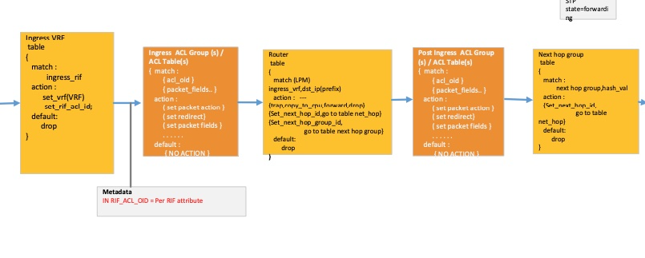

SAI Exact Match API Proposal
============================

Title       | SAI Exact Match Proposal
------------|--------------------------------
Authors     | Midhun Somasundaran, Meta Inc
            | Shrikrishna Khare, Meta Inc
            | Jai Kumar, Broadcom Inc
Status      | Draft
Type        | Standards track
Created     | 02/02/2023
SAI-Version | 1.12
---------------------------------------------

# Overview #
ACLs are generally implemented in hardware using TCAMs which have limited depth. The limited capacity of TCAM tables can become bottleneck for use cases such as ACL based forwarding. Some ASICs have capability to do exact match hash table lookup in the forwarding path. This allows matching packets based on a set of parameters similar to ACL TCAM matching and to set packet parameters or actions similar to ACL actions. This document proposes enhancements to the ACL spec to support exact match.

## Exact Match Use Cases ##
The model proposed solves two use cases

- Increase ACL scale using exact match
- Provide flexibility for EM to work in tandem with TCAM. For example, a TCAM ACL stage can set a metadata as part of its action which can be used as a part of the match key in EM ACL stage or vice versa.

## Exact Match Behavior ##
- There is no concept of entry ordering or priority with exact match. All entries need to have the same priority. The implementation can reject entries if there is a mix of priority values.
- Masking selected bits in an ACL entry is not supported with exact match since the table is generally implemented using hash lookup. Implementation can reject entry add requests if the mask is not all 1s.
- If all bits in a field are not required to be part of the lookup key, the valid bits can be specified at table level. Every ACL entry in the table will use the valid bit specification to determine the lookup key.

# ACL Specification Enhancements #
The proposal includes following changes to the ACL spec.

1. Define a new ACL stage named SAI_ACL_STAGE_POST_INGRESS which is placed after router table lookup in the pipeline. The new ACL stage allows setting of user metadata from SAI_ACL_STAGE_INGRESS and matching the user metadata in SAI_ACL_STAGE_POST_INGRESS.





The post ingress ACL stage packet action will overwrite the action from previous stages if there are conflicting packet actions. For example, a redirect action from post ingress stage will take priority over a redirect action from ACL ingress stage and the next hop id from router table.

2. Define a new table attribute  SAI_ACL_TABLE_ATTR_ACL_MATCH_TYPE of type sai_acl_match_t to identify an ACL table match type.
```
typedef enum _sai_acl_match_type_t
{
    /** ternary matching */
    SAI_ACL_MATCH_TYPE_TERNARY,

    /** exact matching */
    SAI_ACL_MATCH_TYPE_EXACT,

} sai_acl_match_t;
```

3. Add capability enhancments to query SDK to determine the match types that an ACL stage can support.
```
/**
 * @brief Attribute data for SAI_ACL_TABLE_ATTR_SUPPORTED_MATCH_TYPE
 */
typedef enum _sai_acl_supported_match_type_t
{
    /** Ternary */
    SAI_ACL_SUPPORTED_MATCH_TYPE_TERNARY,

    /** Exact */
    SAI_ACL_SUPPORTED_MATCH_TYPE_EXACT,

    /** Ternary and Exact */
    SAI_ACL_SUPPORTED_MATCH_TYPE_TERNARY_AND_EXACT,

} sai_acl_supported_match_type_t;

typedef struct _sai_acl_capability_t
{
    :
    /**
     * @brief Supported match type
     *
     * Indicates the match type supported by ACL stage
     */
    sai_acl_supported_match_type_t supported_match_type;

} sai_acl_capability_t;
```

4. Add new attributes to ACL table to specify valid bits for keys.  If a match field does not have valid bits specified, all bits in the field are valid. For tables implemented using Exact Match, there is no further key masking supported in table entries. The mask for such entries needs to be set to all 1s.
```
    /**
     * @brief Src IPv6 Valid bits
     *
     * @type sai_acl_field_data_mask_t sai_ip6_t
     * @flags CREATE_ONLY
     * @default ffff:ffff:ffff:ffff:ffff:ffff:ffff:ffff
     * @validonly SAI_ACL_TABLE_ATTR_FIELD_SRC_IPV6 == true
     */
    SAI_ACL_TABLE_ATTR_FIELD_VALID_BITS_SRC_IPV6 = SAI_ACL_TABLE_ATTR_FIELD_VALID_BITS_START,
```

# Example Call Sequence #
The following new attributes will be set for creating an exact match ACL entry with a dest ipv6 prefix.
1. Acl Table group  create - create_acl_table_group with attributes.
```
==========================================================================
|  Attribute Name                     |          Attribute Value          |
===========================================================================
| SAI_ACL_TABLE_GROUP_ATTR_ACL_STAGE  | SAI_ACL_STAGE_POST_INGRESS        |
==========================================================================
```
2. Acl Table create - create_acl_table with following attributes.
```
============================================================================================
|  Attribute Name                              |                   Attribute Value          |
============================================================================================
| SAI_ACL_TABLE_ATTR_ACL_STAGE                 | SAI_ACL_STAGE_POST_INGRESS                 |
| SAI_ACL_TABLE_ATTR_ACL_MATCH_TYPE            | SAI_ACL_MATCH_TYPE_EXACT                   |
| SAI_ACL_TABLE_ATTR_FIELD_DST_IPV6            |  true                                      |
| SAI_ACL_TABLE_ATTR_FIELD_DATA_MASK_DST_IPV6  |  sai_acl_field_data_mask_t with valid bits |
=============================================================================================
```
3. Acl Entry create - create_acl_entry with following attributes
```
======================================================================================================
|  Attribute Name                              |                   Attribute Value                    |
======================================================================================================
| SAI_ACL_ENTRY_ATTR_PRIORITY                    |   0 - same priority for all entries                |
| SAI_ACL_ENTRY_ATTR_FIELD_DST_IPV6              |   sai_acl_field_data_t sai_ip6_t with dest         |
|                                                |   address to match. Mask is set as all bits valid  |
======================================================================================================
```
