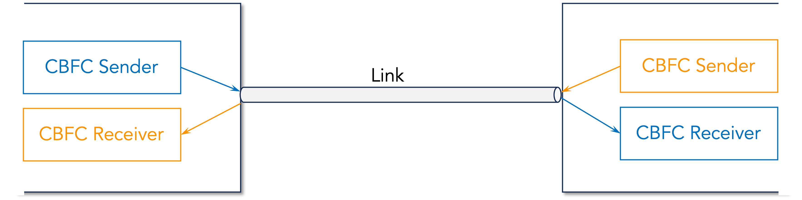
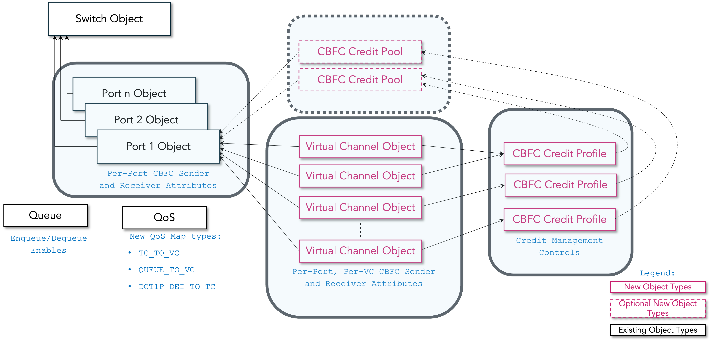
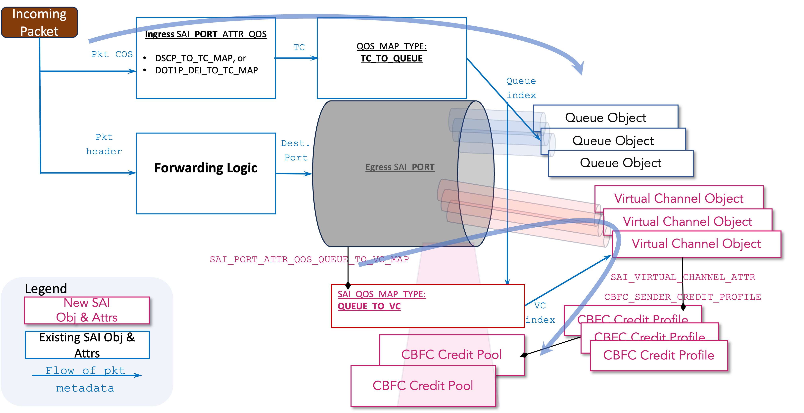
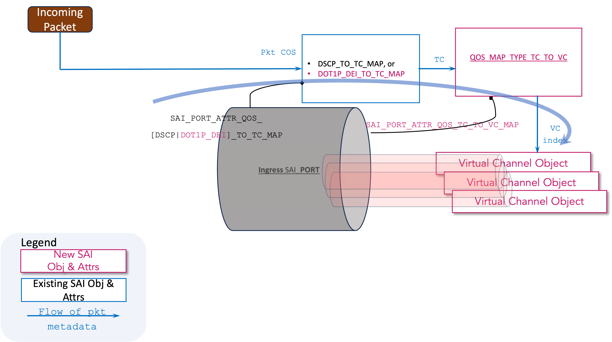

# SAI Proposal: Credit Based Flow Control

-------------------------------------------------------------------------------
 | Title       | Credit Based Flow Control (CBFC)                                                   |
 | ----------- | ---------------------------------------------------------------------------------- |
 | Authors     | UEC Management Working Group (Ravindranath C Kanakarajan and Rupa Budhia, Marvell) |
 | Status      | In review                                                                          |
 | Type        | Standards track                                                                    |
 | Created     | 01/20/2026                                                                         |
 | SAI-Version | 1.18                                                                               |
-------------------------------------------------------------------------------


---

## Introduction
In high-performance Ethernet networks—especially those supporting AI and HPC workloads—network congestion can lead to buffer overflows, causing packet drops. These dropped packets trigger end-to-end retransmissions, which introduce latency and degrade the performance of latency-sensitive applications like distributed training or inference.

CBFC is a __link-layer__ mechanism that ensures **lossless frame delivery** by _preventing frame loss due to buffer congestion at the receiver_.


### Terminology
| Term | Description |
|---|---|
| Credit | Token representing a unit of receiver data storage; consumed at the sender upon transmission and returned as frames drain. |
| Virtual Channel (VC) | Subset of a port’s traffic with dedicated buffering and flow control. |
| Control Ordered Set (CtlOS) | 8-byte link-level message used by CBFC/LLR for periodic updates. |
| Cyclic Counters | Cyclic counters always increment, with “wrap-around.” They are used for resiliency while tracking credits at both the sender and receiver. These cyclic counters wrap around at the modulus of the width of the counter. |
| Credits Consumed (CC) | Cyclic 20b counter of consumed credits. |
| Credits Freed (CF) | Cyclic 20b counter of freed credits. |
| Credit Limit (CL) | Configured credit limit for a VC or port. |
| Credits in Use (CU) | Instantaneous credits in use for a VC/port. |

### Overview

Credit-based Flow Control (CBFC) is described in Section 5.2 of the UEC 1.0 specification ([normative reference](#ref-uec-chapter-5-2)). This section gives a high-level overview of the CBFC specification.

CBFC is a mechanism to prevent frame loss due to buffer congestion at the receiver. The sender transmits frames only if there is buffer space at the receiver.

The receiver indicates buffer availability by providing "credits" to the sender.

Packets are transmitted on the link by the sender only if there are credits available at the receiver.

##### Figure 1: CBFC Sender and Receiver Functions


CBFC is composed of Sender and Receiver functions at each port.
Every port has a CBFC Sender as well as a CBFC Receiver.
Therefore, both Sender and Receiver attributes will be present on both sides of the link.


Sender and Receiver functions at a node are independent of each other. In each direction: parameters are independently negotiated/configured between Sender and Receiver in that direction.

#### Virtual Channel (VC)

 A VC is a per‑link logical separation and/or prioritization of packet traffic, where each VC has some dedicated resources and maintains its own credit accounting (credits consumed, freed, limit, and in-use). 
 
 This separation allows multiple independent, lossless flows to coexist on the same physical Ethernet link, ensures bounded buffering per flow, and prevents head‑of‑line blocking between them.

 Each VC can be configured as either lossless or best-effort, and this configuration can be changed dynamically. The CBFC mechanism applies to lossless VCs.

CBFC supports up to **32** VCs per port.


#### CBFC Counters/State

#### Sender

The following are maintained per port at the sender.

| State | Description |
|---|---|
| Credit Limit (`S_CL_p`) | Configured credit limit for a port. |
| Credits in Use (`S_CU_p`) | Instantaneous credits in use for a port. This counter is incremented by the number of credits used for packets as they are transmitted by the sender, and it is decremented as credits are returned to the sender. |


The following are maintained per VC at the sender.

| State | Description |
|---|---|
| Credits Consumed (`S_CC_vc[i]`) | Cyclic 20b counter of consumed credits for VC `i`. |
| Credits Freed (`S_CF_vc[i]`) | Cyclic 20b counter of freed credits for VC `i`. |
| Credit Limit (`S_CL_vc[i]`) | Configured credit limit for a VC. |
| Credits in Use (`S_CU_vc[i]`) | Instantaneous credits in use for a VC. This counter is equal to `S_CC_vc[i] - S_CF_vc[i]`. |

#### Receiver

The following are maintained per VC at the receiver.

| State | Description |
|---|---|
| Credits Consumed (`R_CC_vc[i]`) | Cyclic 20b counter of consumed credits. |
| Credits Freed (`R_CF_vc[i]`) | Cyclic 20b counter of freed credits. |

#### CBFC Message Types

##### CF_Update CtlOS

Periodically, the receiver sends back to the sender the credits for the frames that have left the buffer using `CF_Update` messages. These messages are sent as 8B `Control Ordered Sets (CtlOS)`. 

##### CC_Update Packets

To handle credit leakage (e.g., corrupted packets, lost CBFC messages), `cyclic counters` are maintained and periodically synchronized using 64B `CC_Update` packets sent from the sender to the receiver. 


#### CBFC high-level operation

The diagram below gives a simplified view of CBFC operation.
For simplicity, the diagram shows one direction from CBFC Sender to CBFC Receiver, and the receiver provides credits per VC.


##### Figure 2: CBFC Operation


##### CBFC Operation

###### Initialization

- **[1a] Receiver → Sender — Credits per VC**
  - Receiver sends (say via LLDP or manual operator) the buffer space available per VC in terms of credits.
  

- **[1b] Sender — Local Initialization**
  - Sender initializes credit limits per port or per virtual channel based on the receiver.

---

###### Data Transmission

- **[2a] Sender — Transmit Credit Check and Counter updates**
  - Sender checks whether sufficient credits are available:
    - `pkt_credits` = `roundup((pktSize + PktOvhd) ÷ CreditSize)` 
    - `S_CU_vc[i] + pkt_credits ≤ S_CL_vc[i]`
  - If the check passes:
    - Increment committed credits `S_CC_vc[i]`
    - Increment credits in use `S_CU_vc[i]`

- **[2b] Sender → Receiver — Data Packet**
  - Sender transmits the packet on the link.

- **[2c] Receiver — Packet Accounting**
  - Upon packet reception and storing in the ingress port's buffer, Receiver updates committed credits:
    - `R_CC_vc[i] += pkt_credits`

---

###### Credit Return

- **[3a] Receiver — Packet Forwarding**
  - Receiver forwards the packet after buffering.

- **[3b] Receiver — Buffer Release**
  - Receiver frees buffer space and updates freed credits:
    - `R_CF_vc[i] += pkt_credits`

- **[3c] Receiver → Sender — CF_Update Message**
  - Receiver sends a `CF_Update` control (CtlOS) message carrying `R_CF_vc[i]`.
  - The receiver port's `CF_min_spacing` (refer SAI_PORT_ATTR_CBFC_CF_MIN_SPACING) parameter enforces a minimum spacing between CF_Update messages so that control traffic uses minimal bandwidth.
  - To handle lost CF_Update messages, the receiver periodically sends CF_Update. The receiver port's `CF_max_spacing` (refer SAI_PORT_ATTR_CBFC_CF_MAX_SPACING) parameter helps tune this period.

- **[3d] Sender — CF_Update Processing**
  - Sender recalculates credits in use:
    - `S_CU_vc[i] -= (R_CF_vc[i] − S_CF_vc[i])`
  - Sender synchronizes freed‑credit state:
    - `S_CF_vc[i] = R_CF_vc[i]`

---

###### Periodic Credit Synchronization

To recover any leaked credits due to packet drops caused by link errors (uncorrectable FEC errors or packet CRC errors), credits consumed are periodically synced between the sender and receiver as follows:

- **[4a] Sender → Receiver — CC_Update Message**
  - Sender periodically sends a `CC_Update` message as ethernet packet(s) with `S_CC_vc[i]` for all the VCs.
  - Period is controlled by sender port's CC message timer (refer SAI_PORT_ATTR_CBFC_CC_MESSAGE_TIMER).

- **[4b] Receiver — CC_Update Processing**
  - Receiver reconciles its state with Sender’s committed credits:
    - `R_CF_vc[i] += (S_CC_vc[i] − R_CC_vc[i])`
    - `R_CC_vc[i] = S_CC_vc[i]`


---

## SAI Specification

Credit-Based Flow Control (CBFC) is a newly introduced feature in the Switch Abstraction Interface (SAI) that enhances link-level flow control without impacting the existing SAI logical pipeline.


### Overview of SAI objects for CBFC

- Three new objects are created:
  - Virtual Channel: Contains per-VC attributes associated with CBFC Sender and CBFC Receiver functions on a port.
  - CBFC Credit Profile: Attributes for management of Receiver credits (i.e. Receiver’s buffer) on a per-VC basis.
  - CBFC Credit Pool: Used to provide isolation of credits (i.e. Receiver’s buffer) between groups of VCs.
- New Attributes for CBFC are added to the existing SAI Port Object.
  - CBFC Sender attributes including negotiated parameters, receiver credit management controls, etc.
  - CBFC Receiver attributes including negotiated parameters.
  - Statistics and QoS mapping controls.
  - Read-only attributes needed for LLDP parameter query.
- New QoS map types are added for VC derivation from TC, Queue, or a packet’s dot1p+DEI.
- New Queue attributes to enable/disable enqueue and dequeue which are needed for lossless VC initialization and deinitialization.


##### Figure 3: Overview of SAI objects for CBFC



### Sender-side lossless operation (roles of Port/VC/Credit Profile/Credit Pool)

1. **TC derivation** — Packet CoS (DSCP or dot1p+DEI) is mapped to TC via QoS maps on the ingress port. *(No change from existing behavior.)*
2. **Egress port derivation** — Forwarding logic selects the egress port. *(No change from existing behavior.)*
3. **Queue derivation** — TC is mapped to queue via the TC-to-Queue QoS map on the switch or egress port. *(No change from existing behavior.)*
4. **VC derivation** — Queue is mapped to VC via the Queue-to-VC QoS map on the egress port.
5. **Packet dequeue** — Packets are dequeued per the queue's scheduling discipline and priority. For lossless VCs, dequeue occurs only when the VC has sufficient credits; Credits Consumed and Credits in Use are updated accordingly.

##### Figure 4: Sender-side lossless operation (roles of Port/VC/Credit Profile/Credit Pool)


### Receiver-side lossless operation (roles of Port/VC)

1. **TC derivation** — Packet CoS (DSCP or dot1p+DEI) is mapped to TC via QoS maps on the ingress port. *(No change from existing behavior.)*
2. **VC derivation** — TC is mapped to VC via the TC-to-VC QoS map on the ingress port.
3. **Enqueue** — On enqueue, the receiver increments the VC's Credits Consumed counter.
4. **Drain** — When the packet is drained from the input buffer, the receiver increments the VC's Credits Freed counter. This state is communicated to the sender via CF_Update messages.
##### Figure 5: Receiver-side lossless operation (roles of Port/VC)


### SAI Logical Pipeline
CBFC requires **no changes** to the SAI logical forwarding pipeline.

---

## Objects and Attributes

### 1) CBFC Credit Pool

- CBFC Credit Pool is used at the Sender to manage Receiver credits.
- Credit Pools are optional. They are created when:
  - Receiver sends Total Credits for the port and Sender manages the credits across VCs, and
  - There is a need to provide isolation of credits between groups of VCs.
- When no credit pools are created at the sender, the total credits given by the receiver (configured via SAI_PORT_ATTR_CBFC_SENDER_CREDIT_LIMIT in _'Table - New Attributes of the existing SAI PORT object type'_) are shared among all the VCs of the port. This sharing is based on the credit profiles attached to the VCs.

Credit Pool attributes are listed in the table below.

**Attributes of `SAI_CBFC_CREDIT_POOL`**

| SAI_CBFC_CREDIT_POOL_ATTR | Type | Flags | Default | Description |
|---|---|---|---|---|
| `PORT` | `sai_object_id_t` | `MANDATORY_ON_CREATE`, `CREATE_ONLY` | N/A | Port to which this pool belongs. |
| `SIZE` | `sai_uint64_t` | `MANDATORY_ON_CREATE`, `CREATE_AND_SET` | N/A | Total pool size in **credits**. |
| `SHARED_SIZE` | `sai_uint64_t` | `READ_ONLY` | N/A | Shared portion in credits (= `SIZE` minus reserved credits of all VCs attached to this pool). |

---

### 2) CBFC Credit Profile
•	CBFC Credit Profile is used at the Sender to manage Receiver credits per-VC.

Credit Profile attributes are listed in the table below.

**Attributes of `SAI_CBFC_CREDIT_PROFILE_ATTR`**

| SAI_CBFC_CREDIT_PROFILE_ATTR| Type | Flags | Default | Description |
|---|---|---|---|---|
| `POOL_ID` | `sai_object_id_t` | `MANDATORY_ON_CREATE`, `CREATE_ONLY` (allow NULL) | `SAI_NULL_OBJECT_ID` | Pointer to credit pool. May be **NULL** when pools are not used (e.g., per-VC credit limit). |
| `RESERVED_CREDIT_SIZE` | `sai_uint64_t` | `MANDATORY_ON_CREATE`, `CREATE_AND_SET` | N/A | Dedicated credits reserved for this VC. |
| `THRESHOLD_MODE` | `sai_cbfc_credit_ profile_threshold_mode_t` | `CREATE_ONLY` | `SAI_CBFC_CREDIT_ PROFILE_THRESHOLD_MODE_NONE` | Governs access to **shared** credits. |
| `SHARED_DYNAMIC_TH` | `sai_int8_t` | `MANDATORY_ON_CREATE`, `CREATE_AND_SET` (valid **only** if `THRESHOLD_MODE=DYNAMIC`) | N/A | Dynamic shared threshold = 2^n of pool available credits. |
| `SHARED_STATIC_TH` | `sai_uint64_t` | `MANDATORY_ON_CREATE`, `CREATE_AND_SET` (valid **only** if `THRESHOLD_MODE=STATIC`) | `0` | Static shared threshold in credits; `0` means *no limit*. |

**Threshold Mode — `sai_cbfc_credit_profile_threshold_mode_t`**

| Enum | Description |
|---|---|
| `SAI_CBFC_CREDIT_PROFILE_THRESHOLD_MODE_NONE` | No access to shared credits. |
| `SAI_CBFC_CREDIT_PROFILE_THRESHOLD_MODE_STATIC` | Static maximum. |
| `SAI_CBFC_CREDIT_PROFILE_THRESHOLD_MODE_DYNAMIC` | Dynamic maximum (relative). |

---

### 3) Virtual Channel

- CBFC Virtual Channel is a per-port object to enable/disable CBFC per VC, configure credit management using credit profiles, and provide CBFC statistics.

Virtual Channel attributes are listed in the table below.

**Attributes of `SAI_VIRTUAL_CHANNEL`**

| SAI_VIRTUAL_CHANNEL_ATTR | Type | Flags | Default | Description |
|---|---|---|---|---|
| `PORT` | `sai_object_id_t` | `MANDATORY_ON_CREATE`, `CREATE_ONLY`, `KEY` | N/A | Port owning this VC. |
| `INDEX` | `sai_uint8_t` | `MANDATORY_ON_CREATE`, `CREATE_ONLY`, `KEY` | N/A | VC index, range **0–31**. |
| `CBFC_RECEIVER_NATIVE_CREDIT_LIMIT` | `sai_uint32_t` | `READ_ONLY` | N/A | Receiver-advertised VC credit limit (0 ⇒ receiver uses a **port** credit limit). Max `2^20 - 1`. |
| `CBFC_SENDER_CREDIT_PROFILE` | `sai_object_id_t` | `CREATE_AND_SET` | `SAI_NULL_OBJECT_ID` | Credit profile pointer; **NULL** means best-effort VC. |
| `CBFC_RECEIVER_ENABLE` | `bool` | `CREATE_AND_SET` | `false` | Enable **lossless receiver** on this VC. |
| `CBFC_SENDER_ENABLE` | `bool` | `CREATE_AND_SET` | `false` | Enable **lossless sender** on this VC. |

**VC Statistics: `sai_virtual_channel_stat_t`**

The following new Virtual Channel statistics are added.

| Statistic | Description |
|---|---|
| `SENDER_CREDITS_USED` | Sender credits currently used. |
| `SENDER_CREDITS_CONSUMED` | Total credits consumed. |
| `SENDER_CREDITS_FREED` | Total credits freed. |
| `SENDER_CREDITS_USED_WATERMARK` | High-water mark of sender credits used. |
| `RECEIVER_CREDITS_CONSUMED` | Receiver credits consumed. |
| `RECEIVER_CREDITS_FREED` | Receiver credits freed. |


---

## QoS Map Updates

- Mappings from {VLAN.PCP, VLAN.DEI} → TC, TC→VC, and Queue→VC are added as described below.

- Three new QoS map types are added to `sai_qos_map_type_t` in saiqosmap.h.


**New QoS map types — `sai_qos_map_type_t`**


- `SAI_QOS_MAP_TYPE_DOT1P_DEI_TO_TC` — map packet `{dot1p+DEI}` → `TC`.
- `SAI_QOS_MAP_TYPE_TC_TO_VC` — map traffic class `TC` → `VC`.
- `SAI_QOS_MAP_TYPE_QUEUE_TO_VC` — map egress queue → `VC`.

**Extended QoS map params — `sai_qos_map_params_t`**


The existing QoS map params struct `sai_qos_map_params_t` in saitypes.h is extended with the fields below to support the new QoS map types above.

```c
 /** DEI used in SAI_QOS_MAP_TYPE_DOT1P_DEI_TO_TC */
 sai_uint8_t dei;

/** Virtual Channel */
 sai_uint8_t vc;
```

For `SAI_QOS_MAP_TYPE_DOT1P_DEI_TO_TC`, map keys use the existing `dot1p` field in `sai_qos_map_params_t` together with `dei`.

---

## SAI Port Updates

New attributes on the existing **SAI Port** object to negotiate and control CBFC sender/receiver behavior and mappings.

**New Attributes of `SAI_PORT`**

| SAI_PORT_ATTR | Type | Flags | Default | Description |
|---|---|---|---|---|
| `CBFC_RECEIVER_NATIVE_CREDIT_SIZE` | `sai_uint16_t` | `READ_ONLY` | N/A | Receiver’s native credit size in **bytes** (cell size). |
| `CBFC_RECEIVER_NATIVE_PACKET_OVERHEAD` | `sai_int16_t` | `READ_ONLY` | N/A | Receiver’s native packet overhead in **bytes**. |
| `CBFC_RECEIVER_NATIVE_TOTAL_CREDITS` | `sai_uint16_t` | `READ_ONLY` | N/A | Receiver’s **total port credits** (0 ⇒ receiver sets per-VC limits). |
| `CBFC_RECEIVER_CREDIT_SIZE` | `sai_uint16_t` | `CREATE_AND_SET` | `0` | Receiver credit size in bytes (`0` ⇒ use native credit size). |
| `CBFC_RECEIVER_PACKET_OVERHEAD` | `sai_int16_t` | `CREATE_AND_SET` | `128` | Receiver packet overhead, range **[-16,127]**; `128` ⇒ use native overhead. |
| `CBFC_SENDER_SUPPORTED_CREDIT_SIZE` | `sai_u16_list_t` | `READ_ONLY` | N/A | Sender-supported credit sizes in **bytes**. |
| `CBFC_SENDER_CREDIT_SIZE` | `sai_uint16_t` | `CREATE_AND_SET` | `128` | Sender credit size in bytes (choose largest ≤ receiver native credit size). |
| `CBFC_SENDER_PACKET_OVERHEAD` | `sai_int16_t` | `CREATE_AND_SET` | `0` | Sender packet overhead, range **[-16,127]**. |
| `CBFC_SENDER_CREDIT_LIMIT` | `sai_uint64_t` | `CREATE_AND_SET` | `0` | Sender **port** credit limit, range `0..(2^20 - 1)`. |
| `CBFC_CC_MESSAGE_TIMER` | `sai_uint32_t` | `CREATE_AND_SET` | `256` | CC_Update message timer in **µs**; range `1..250000`. |
| `CBFC_CF_MIN_SPACING` | `sai_uint32_t` | `CREATE_AND_SET` | `6400` | Minimum bytes between CF_Update messages; **≥ 800 B**. |
| `CTLOS_MIN_SPACING` | `sai_uint32_t` | `CREATE_AND_SET` | `6400` | Minimum bytes between CtlOS messages (e.g., CF_Update, LLR ACK); **≥ 800 B**. |
| `CBFC_CF_MAX_SPACING` | `sai_uint32_t` | `CREATE_AND_SET` | `262144` | Maximum bytes between CF_Update messages; range **16 KB–1 MB** in **16 KB** steps. |
| `QOS_QUEUE_TO_VC_MAP` | `sai_object_id_t` | `CREATE_AND_SET` | `SAI_NULL_OBJECT_ID` | Enable Queue→VC map on port; object type `SAI_OBJECT_TYPE_QOS_MAP`. |
| `QOS_TC_TO_VC_MAP` | `sai_object_id_t` | `CREATE_AND_SET` | `SAI_NULL_OBJECT_ID` | Enable TC→VC map on port; object type `SAI_OBJECT_TYPE_QOS_MAP`. |
| `QOS_DOT1P_DEI_TO_TC_MAP` | `sai_object_id_t` | `CREATE_AND_SET` | `SAI_NULL_OBJECT_ID` | Enable {DOT1P,DEI}→TC map; object type `SAI_OBJECT_TYPE_QOS_MAP`. |
| `QOS_VIRTUAL_CHANNEL_LIST` | `sai_object_list_t` | `READ_ONLY` | N/A | List of VCs for the port; object type `SAI_OBJECT_TYPE_VIRTUAL_CHANNEL`. |
| `CBFC_CREDIT_POOL_LIST` | `sai_object_list_t` | `READ_ONLY` | N/A | List of CBFC credit pools for the port; object type `SAI_OBJECT_TYPE_CBFC_CREDIT_POOL`. |

---

## New CBFC Port Statistics

The following new port statistics are added for CBFC.

**New port statistics — `sai_port_stat_t`**

| Statistic | Description |
|---|---|
| `CBFC_SENDER_CREDITS_USED` | Sender credits used. |
| `CBFC_SENDER_CREDITS_USED_WATERMARK` | High-water mark of sender credits used. |
| `CBFC_NUM_CC_UPDATE_MESSAGES_TX` | CC_Update messages transmitted. |
| `CBFC_NUM_CF_UPDATE_MESSAGES_TX` | CF_Update messages transmitted. |
| `CBFC_NUM_CC_UPDATE_MESSAGES_RX` | CC_Update messages received. |
| `CBFC_NUM_CF_UPDATE_MESSAGES_RX` | CF_Update messages received. |

---

## SAI Queue Updates
**New Attributes of `SAI_QUEUE`**

| SAI_QUEUE_ATTR | Type | Flags | Default | Description |
|---|---|---|---|---|
| `PKT_DEQUEUE_ENABLE` | `bool` | `CREATE_AND_SET` | `true` | Enable/disable **packet transmission** from a queue; ingress/egress admission still applies when disabled. |
| `PKT_ENQUEUE_ENABLE` | `bool` | `CREATE_AND_SET` | `true` | Enable/disable **enqueue** into a queue. |

---


---

### Sample Workflow

#### Capability Queries

##### Feature Capability
Use the existing attribute capability query to determine CBFC support. Example:
```c
sai_attr_capability_t cap;
// VC create support ⇒ CBFC present
sai_query_attribute_capability(switch_id,
    SAI_OBJECT_TYPE_VIRTUAL_CHANNEL,
    SAI_VIRTUAL_CHANNEL_ATTR_PORT,
    &cap);
if (!cap.create_implemented) {
    return -1; // CBFC not supported on this platform
}
```

##### Statistics Capability
Use the existing statistics capability query on **PORT** and **VIRTUAL_CHANNEL** objects to discover supported counters. Example (port):
```c
sai_port_stat_t wanted[] = {
    SAI_PORT_STAT_CBFC_SENDER_CREDITS_USED,
    SAI_PORT_STAT_CBFC_NUM_CF_UPDATE_MESSAGES_RX,
};
sai_stat_capability_list_t caps = { .count = 2, .list = wanted };
sai_query_stats_capability(switch_id, SAI_OBJECT_TYPE_PORT, &caps);

```

#### CBFC Initialization


1) [Receiver] Read native attributes.

```c
/* [Receiver] Read native credit parameters from port (or from VC) */
sai_attribute_t rcvr_attrs[] = {
    { .id = SAI_PORT_ATTR_CBFC_RECEIVER_NATIVE_CREDIT_SIZE },
    { .id = SAI_PORT_ATTR_CBFC_RECEIVER_NATIVE_PACKET_OVERHEAD },
    { .id = SAI_PORT_ATTR_CBFC_RECEIVER_NATIVE_TOTAL_CREDITS },
};
sai_port_api->get_port_attribute(port_id, 3, rcvr_attrs);
```

2) [Sender] Read native attributes.

```c
/* [Sender] Read supported credit size */
sai_attribute_t sndr_attr = { .id = SAI_PORT_ATTR_CBFC_SENDER_SUPPORTED_CREDIT_SIZE };
sai_port_api->get_port_attribute(port_id, 1, &sndr_attr);
```

3) [Sender] Set packet overhead (must be >= SAI_PORT_ATTR_CBFC_RECEIVER_NATIVE_PACKET_OVERHEAD of partner).

```c
sai_attribute_t overhead = { .id = SAI_PORT_ATTR_CBFC_SENDER_PACKET_OVERHEAD, .value.u32 = 64 };
sai_port_api->set_port_attribute(port_id, &overhead);   /* sender */
```

4) [Receiver] Set packet overhead.

```c
sai_attribute_t overhead = { .id = SAI_PORT_ATTR_CBFC_RECEIVER_PACKET_OVERHEAD, .value.u32 = 64 };
sai_port_api->set_port_attribute(port_id, &overhead);   /* receiver */
```

5) [Sender] Set credit size (must be <= and as close as possible to `SAI_PORT_ATTR_CBFC_RECEIVER_NATIVE_CREDIT_SIZE` of the partner).

```c
sai_attribute_t creditSize = { .id = SAI_PORT_ATTR_CBFC_SENDER_CREDIT_SIZE, .value.u16 = 256 };
sai_port_api->set_port_attribute(port_id, &creditSize);   /* sender */
```

6) [Receiver] Set credit size (may adjust to `SAI_PORT_ATTR_CBFC_SENDER_CREDIT_SIZE` of the partner).

```c
sai_attribute_t creditSize = { .id = SAI_PORT_ATTR_CBFC_RECEIVER_CREDIT_SIZE, .value.u16 = 256 };
sai_port_api->set_port_attribute(port_id, &creditSize);   /* receiver */
```

7) [Sender] Set port sender credit limit.

    Note: This step is applicable when the receiver lets the sender manage the port's credits among its VCs.

```c
/* SAI_PORT_ATTR_CBFC_SENDER_CREDIT_LIMIT must be <= the value obtained from the peer's
   SAI_PORT_ATTR_CBFC_RECEIVER_NATIVE_TOTAL_CREDITS. */
sai_attribute_t limit = { .id = SAI_PORT_ATTR_CBFC_SENDER_CREDIT_LIMIT,
                          .value.u32 = rcvr_native_total_credits };
sai_port_api->set_port_attribute(port_id, &limit);
```

The following steps (VC creation and QoS maps) must be consistent across the network including the sender and receiver.

8) [Sender and Receiver] Create VC(s) and enable CBFC.

```c
sai_attribute_t vc_attrs[4];
vc_attrs[0].id = SAI_VIRTUAL_CHANNEL_ATTR_PORT;
vc_attrs[0].value.oid = port_id;
vc_attrs[1].id = SAI_VIRTUAL_CHANNEL_ATTR_INDEX;
vc_attrs[1].value.u8 = 3; // VC3 — must match peer
vc_attrs[2].id = SAI_VIRTUAL_CHANNEL_ATTR_CBFC_SENDER_CREDIT_PROFILE;
vc_attrs[2].value.oid =  SAI_NULL_OBJECT_ID; // for best-effort
vc_attrs[3].id = SAI_VIRTUAL_CHANNEL_ATTR_CBFC_SENDER_ENABLE;
vc_attrs[3].value.booldata = false;
sai_object_id_t vc3;
create_virtual_channel(&vc3, switch_id, 4, vc_attrs);

// create other VCs
...
```

9) [Sender] Set QoS maps: dot1p/dei→TC, TC-to-Queue (existing), Queue-to-VC.

```c
// {dot1p+DEI} → TC map (e.g. PCP=1,DEI=0 → TC2; PCP=2,DEI=0 → TC3)
sai_qos_map_t dot1p_dei_to_tc_entries[2] = {
    { .key = { .dot1p = 1, .dei = 0 }, .value = { .tc = 2 } },
    { .key = { .dot1p = 2, .dei = 0 }, .value = { .tc = 3 } },
};
sai_attribute_t dot1p_attrs[2];
dot1p_attrs[0].id = SAI_QOS_MAP_ATTR_TYPE;
dot1p_attrs[0].value.s32 = SAI_QOS_MAP_TYPE_DOT1P_DEI_TO_TC;
dot1p_attrs[1].id = SAI_QOS_MAP_ATTR_MAP_TO_VALUE_LIST;
dot1p_attrs[1].value.qosmap.count = 2;
dot1p_attrs[1].value.qosmap.list = dot1p_dei_to_tc_entries;
sai_object_id_t dot1p_to_tc_map_id;
sai_create_qos_map(&dot1p_to_tc_map_id, switch_id, 2, dot1p_attrs);

// Queue → VC map (e.g. queue 2→VC2, queue 3→VC3)
sai_qos_map_t queue_to_vc_entries[2] = {
    { .key = { .queue_index = 2 }, .value = { .vc = 2 } },
    { .key = { .queue_index = 3 }, .value = { .vc = 3 } },
};
sai_attribute_t q_vc_attrs[2];
q_vc_attrs[0].id = SAI_QOS_MAP_ATTR_TYPE;
q_vc_attrs[0].value.s32 = SAI_QOS_MAP_TYPE_QUEUE_TO_VC;
q_vc_attrs[1].id = SAI_QOS_MAP_ATTR_MAP_TO_VALUE_LIST;
q_vc_attrs[1].value.qosmap.count = 2;
q_vc_attrs[1].value.qosmap.list = queue_to_vc_entries;
sai_object_id_t queue_to_vc_map_id;
sai_create_qos_map(&queue_to_vc_map_id, switch_id, 2, q_vc_attrs);

// Attach the maps to the egress port
sai_attribute_t a = { .id = SAI_PORT_ATTR_QOS_DOT1P_DEI_TO_TC_MAP, .value.oid = dot1p_to_tc_map_id };
sai_port_api->set_port_attribute(port_id, &a);
a.id = SAI_PORT_ATTR_QOS_QUEUE_TO_VC_MAP;
a.value.oid = queue_to_vc_map_id;
sai_port_api->set_port_attribute(port_id, &a);
```

10) [Receiver] Set QoS maps: dot1p/dei→TC, TC-to-VC.

```c
// TC → VC map (e.g. TC2→VC2, TC3→VC3 for lossless)
sai_qos_map_t tc_to_vc_entries[2] = {
    { .key = { .tc = 2 }, .value = { .vc = 2 } },
    { .key = { .tc = 3 }, .value = { .vc = 3 } },
};
sai_attribute_t tc_vc_attrs[2];
tc_vc_attrs[0].id = SAI_QOS_MAP_ATTR_TYPE;
tc_vc_attrs[0].value.s32 = SAI_QOS_MAP_TYPE_TC_TO_VC;
tc_vc_attrs[1].id = SAI_QOS_MAP_ATTR_MAP_TO_VALUE_LIST;
tc_vc_attrs[1].value.qosmap.count = 2;
tc_vc_attrs[1].value.qosmap.list = tc_to_vc_entries;
sai_object_id_t tc_to_vc_map_id;
sai_create_qos_map(&tc_to_vc_map_id, switch_id, 2, tc_vc_attrs);

// Apply TC→VC and dot1p/DEI→TC to ingress port (dot1p_to_tc_map_id from step 9 or create similarly)
sai_attribute_t a = { .id = SAI_PORT_ATTR_QOS_TC_TO_VC_MAP, .value.oid = tc_to_vc_map_id };
sai_port_api->set_port_attribute(port_id, &a);
a.id = SAI_PORT_ATTR_QOS_DOT1P_DEI_TO_TC_MAP;
a.value.oid = dot1p_to_tc_map_id;
sai_port_api->set_port_attribute(port_id, &a);
```

#### Lossless VC Initialization

1) [Receiver] Disable CBFC on VC.

```c
sai_attribute_t vc_attr = { .id = SAI_VIRTUAL_CHANNEL_ATTR_CBFC_RECEIVER_ENABLE, .value.booldata = false };
sai_virtual_channel_api->set_virtual_channel_attribute(vc_id, &vc_attr);
```

2) [Receiver] Clear Virtual Channel statistics: `RECEIVER_CREDITS_CONSUMED` and `RECEIVER_CREDITS_FREED`.

```c
sai_stat_id_t rcvr_stats[] = {
    SAI_VIRTUAL_CHANNEL_STAT_RECEIVER_CREDITS_CONSUMED,
    SAI_VIRTUAL_CHANNEL_STAT_RECEIVER_CREDITS_FREED,
};
sai_virtual_channel_api->clear_virtual_channel_stats(vc_id, 2, rcvr_stats);
```

3) [Sender] Stop dequeue on queue.

```c
sai_attribute_t q_attr = { .id = SAI_QUEUE_ATTR_PKT_DEQUEUE_ENABLE, .value.booldata = false };
sai_queue_api->set_queue_attribute(queue_id, &q_attr);
```

4) [Sender] Clear Virtual Channel statistics: `SENDER_CREDITS_USED`, `SENDER_CREDITS_CONSUMED`, and `SENDER_CREDITS_FREED`.

```c
sai_stat_id_t sndr_stats[] = {
    SAI_VIRTUAL_CHANNEL_STAT_SENDER_CREDITS_USED,
    SAI_VIRTUAL_CHANNEL_STAT_SENDER_CREDITS_CONSUMED,
    SAI_VIRTUAL_CHANNEL_STAT_SENDER_CREDITS_FREED,
};
sai_virtual_channel_api->clear_virtual_channel_stats(vc_id, 3, sndr_stats);
```

5) [Sender] Attach credit profile to VC.

    Note: This step is applicable when the receiver lets the sender manage the port's credits among its VCs.

```c
// Credit Pool (optional)
sai_attribute_t pool_attrs[2];
pool_attrs[0].id = SAI_CBFC_CREDIT_POOL_ATTR_PORT; 
pool_attrs[0].value.oid = port_id;
pool_attrs[1].id = SAI_CBFC_CREDIT_POOL_ATTR_SIZE;
pool_attrs[1].value.u64 = 32768; // credits (subset of SAI_PORT_ATTR_CBFC_SENDER_CREDIT_LIMIT )
sai_object_id_t pool_id; 
create_cbfc_credit_pool(&pool_id, switch_id, 2, pool_attrs);

// profile
sai_attribute_t prof_attrs[3];
prof_attrs[0].id = SAI_CBFC_CREDIT_PROFILE_ATTR_POOL_ID;
prof_attrs[0].value.oid = pool_id; // or SAI_NULL_OBJECT_ID when no isolation of shared credits between groups of VCs
prof_attrs[1].id = SAI_CBFC_CREDIT_PROFILE_ATTR_RESERVED_CREDIT_SIZE;
prof_attrs[1].value.u64 = 2048; // dedicated credits
prof_attrs[2].id = SAI_CBFC_CREDIT_PROFILE_ATTR_THRESHOLD_MODE;
prof_attrs[2].value.s32 = SAI_CBFC_CREDIT_PROFILE_THRESHOLD_MODE_DYNAMIC;
sai_object_id_t vc_credit_profile_id;
create_cbfc_credit_profile(&vc_credit_profile_id, switch_id, 3, prof_attrs);


vc_attr.id = SAI_VIRTUAL_CHANNEL_ATTR_CBFC_SENDER_CREDIT_PROFILE;
vc_attr.value.oid = vc_credit_profile_id;
sai_virtual_channel_api->set_virtual_channel_attribute(vc_id, &vc_attr);
```

6) [Receiver] Enable CBFC on VC.

```c
vc_attr.id = SAI_VIRTUAL_CHANNEL_ATTR_CBFC_RECEIVER_ENABLE;
vc_attr.value.booldata = true;
sai_virtual_channel_api->set_virtual_channel_attribute(vc_id, &vc_attr);
```

7) [Sender] Enable CBFC on VC.

```c
vc_attr.id = SAI_VIRTUAL_CHANNEL_ATTR_CBFC_SENDER_ENABLE;
vc_attr.value.booldata = true;
sai_virtual_channel_api->set_virtual_channel_attribute(vc_id, &vc_attr);
```

8) [Sender] Resume dequeue.

```c
q_attr.id = SAI_QUEUE_ATTR_PKT_DEQUEUE_ENABLE;
q_attr.value.booldata = true;
sai_queue_api->set_queue_attribute(queue_id, &q_attr);
```

#### Lossless VC Removal

1) [Sender] Stop enqueue.

```c
sai_attribute_t q_attr = { .id = SAI_QUEUE_ATTR_PKT_ENQUEUE_ENABLE, .value.booldata = false };
sai_queue_api->set_queue_attribute(queue_id, &q_attr);
```

2) [Sender] Wait until queue is drained.

```c
// Example
while (1) {
    sai_attribute_t stat = { .id = SAI_QUEUE_STAT_CURR_OCCUPANCY_BYTES };
    sai_queue_api->get_queue_stats(queue_id, &stat.id, 1, &stat.value.u64);
    if (stat.value.u64 == 0) break;
    /* sleep or yield */
}
```

3) [Sender] Disable CBFC on VC.

```c
vc_attr.id = SAI_VIRTUAL_CHANNEL_ATTR_CBFC_SENDER_ENABLE;
vc_attr.value.booldata = false;
sai_virtual_channel_api->set_virtual_channel_attribute(vc_id, &vc_attr);
```

4) [Sender] Detach credit profile from VC and set credit limit = 0.

```c
vc_attr.id = SAI_VIRTUAL_CHANNEL_ATTR_CBFC_SENDER_CREDIT_PROFILE;
vc_attr.value.oid = SAI_NULL_OBJECT_ID;
sai_virtual_channel_api->set_virtual_channel_attribute(vc_id, &vc_attr);
sai_attribute_t limit = { .id = SAI_PORT_ATTR_CBFC_SENDER_CREDIT_LIMIT, .value.u32 = 0 };
sai_port_api->set_port_attribute(port_id, &limit);
```

5) [Receiver] Disable CBFC on VC.

```c
vc_attr.id = SAI_VIRTUAL_CHANNEL_ATTR_CBFC_RECEIVER_ENABLE;
vc_attr.value.booldata = false;
sai_virtual_channel_api->set_virtual_channel_attribute(vc_id, &vc_attr);
```

6) [Sender] Re-enable enqueue.

```c
q_attr.id = SAI_QUEUE_ATTR_PKT_ENQUEUE_ENABLE;
q_attr.value.booldata = true;
sai_queue_api->set_queue_attribute(queue_id, &q_attr);
```

---

## Normative References
- <a id="ref-uec-chapter-5-2"></a>Ultra Ethernet Specification, **Chapter 5.2** — Link: `https://ultraethernet.org/wp-content/uploads/sites/20/2025/06/UE-Specification-6.11.25.pdf`.

---
