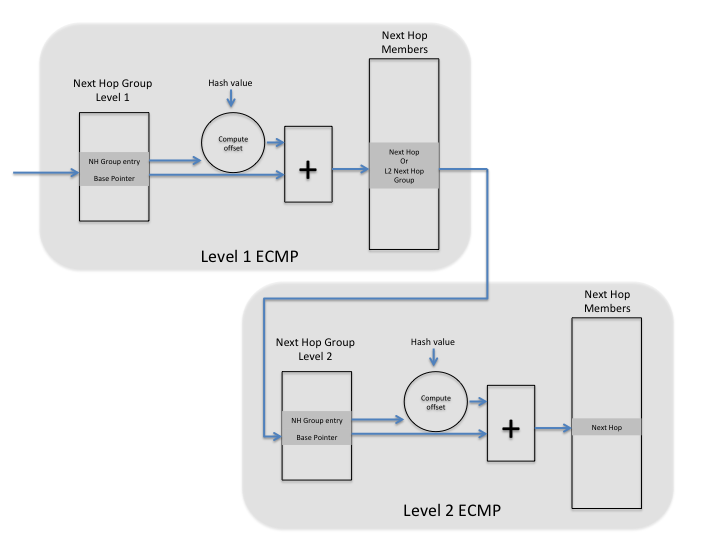

# CRM Availability Workflow
## _This document describes workflow for available resources for various attributes using CRM get_availability API_

API Signature
```
    /**
     * @brief Get SAI object type resource availability.
     *
     * @param[in] switch_id SAI Switch object id
     * @param[in] object_type SAI object type
     * @param[in] attr_count Number of attributes
     * @param[in] attr_list List of attributes that to distinguish resource
     * @param[out] count Available objects left
     *
     * @return #SAI_STATUS_NOT_SUPPORTED if the given object type does not support resource accounting.
     * Otherwise, return #SAI_STATUS_SUCCESS.
     */
    sai_status_t sai_object_type_get_availability(
            _In_ sai_object_id_t switch_id,
            _In_ sai_object_type_t object_type,
            _In_ uint32_t attr_count,
            _In_ const sai_attribute_t *attr_list,
            _Out_ uint64_t *count);
```
__sai_object_type_get_availability()__ API can be used using single a parameter object_type or a combination of attributes to create a granular query.

One of the challenges with this API is when the HW resource is shared between more then one such granular query for e.g. Nexthop Group HW table is shared for different types of next hop groups, v4/v6/mpls table and so on, there is no clean way to get available resources as shared. One of the ways can be that NOS makes a query for each resource and if it observes a decremented value not just for the queried resource attribute but others as well then should interpret it as a shared resource for multiple attributes. 

For e.g. Let's say NHG is a shared HW resource for ordered and unordered groups. In such cases after allocating 1 NHG for ordered groups, there will be reduction in query for unordered groups as well.

This document is not trying to address shared HW resources issue but is mainly trying to create a well known workflow for generic CRM query.

Currently SAI spec also have legacy read only attributes and can be queried using object specific GET API or can also use the get_availability() API. Recommendation is to migrate NOS to use get_availability() API for consistency reasons. Till then SAI Adapter must support both methods.

# Table of contents
1. [Query Available System Ports](#introduction)
2. [Query Available Fabric Ports](#introduction1)
3. [NextHopGroup and Member Query](#introduction2)
   1. [Query Available Nexthopgroups](#sub-introduction1)
   2. [Query Available Nexthopgroups Members](#sub-introduction2)
4. [Query Available VoQs](#introduction3)

## Query Available System Ports <a name="introduction"></a>
Query the system port object to get the available system ports. No additional attribute are needed for this query.

>> sai_object_type_get_availability(<switch_id>, SAI_OBJECT_TYPE_SYSTEM_PORT, 0, NULL, &count)

## Query Available Fabric Ports <a name="introduction1"></a>
Specific port can be queried using the port type attribute. Only one attribure is neded for this query. To query different port types, NOS must invoke the API again with a different port type.

>> sai_attribute_t attr[1];
>> attr[0].id = SAI_PORT_ATTR_TYPE;
>> attr[0].value = SAI_PORT_TYPE_FABRIC; // SAI_PORT_TYPE_CPU or SAI_PORT_TYPE_LOOPBACK
>> sai_object_type_get_availability(<switch_id>, SAI_OBJECT_TYPE_PORT, 1, attr, &count)

## NextHopGroup and Member Query <a name="introduction2"></a>
SAI supports default as NHG that contains tunnel and IP nexthop members. In this case usually there is a single HW table for NHG. This HW architecture is defined using SAI_NEXT_HOP_GROUP_ATTR_HIERARCHICAL_NEXTHOP with default value as true.

For cases where HW has two different physical tables, one to host Tunnel+IP overlay nexthops and other to host IP only underlay nexthops; SAI_NEXT_HOP_GROUP_ATTR_HIERARCHICAL_NEXTHOP can be quried using capability query API.

Once NOS has determined the HW architecture it can make following queries to determine the available NHG and NHG member entries.


__Figure 1: Hierarchihcal ECMP__


### Query Available Overlay (IP+Tunnel) Nexthopgroups <a name="sub-introduction1"></a>
Following workflow makes query for object type SAI_OBJECT_TYPE_NEXTHOPGROUP and attributes NGH type unordered ECMP and HECMP bool set as true. If capability query supports HECMP then this query will return available entries for overlay nexthops else it will return available entries for overlay+underlay nexthops.

>> sai_attribute_t attr[1];
>> attr[0].id = SAI_NEXT_HOP_GROUP_ATTR_TYPE;
>> attr[0].value = SAI_NEXT_HOP_GROUP_TYPE_DYNAMIC_UNORDERED_ECMP;
>> attr[1].id = SAI_NEXT_HOP_GROUP_ATTR_HIERARCHICAL_NEXTHOP;
>> ttr[1].value = true;
>> sai_object_type_get_availability(<switch_id>, SAI_OBJECT_TYPE_NEXTHOPGROUP, 2, attr, &count)

## Query Available Underlay (IP only) Nexthopgroups
Following workflow makes query for object type SAI_OBJECT_TYPE_NEXTHOPGROUP and attributes NGH type unordered ECMP and HECMP bool set as true. If capability query supports HECMP then this query will return available entries for underlay nexthops. If query is made for HW not supporting HECMP, SAI_STATUS_NOT_SUPPORTED is returned.

>> sai_attribute_t attr[1];
>> attr[0].id = SAI_NEXT_HOP_GROUP_ATTR_TYPE;
>> attr[0].value = SAI_NEXT_HOP_GROUP_TYPE_DYNAMIC_UNORDERED_ECMP;
>> attr[1].id = SAI_NEXT_HOP_GROUP_ATTR_HIERARCHICAL_NEXTHOP;
>> ttr[1].value = true;
>> sai_object_type_get_availability(<switch_id>, SAI_OBJECT_TYPE_NEXTHOPGROUP, 2, attr, &count)

## Query Available Overlay (IP+Tunnel) Nexthopgroup Members <a name="sub-introduction2"></a>
Single pool for both IP and Tunnel nexthopgroup members can be queried using following workflow.

>> sai_object_type_get_availability(<switch_id>, SAI_SWITCH_ATTR_AVAILABLE_NEXT_HOP_GROUP_MEMBER_ENTRY, 0, NULL, &count)

## Query Available Underlay (IP only) Nexthopgroup Members
Pool dedicated for IP nexthopgroup members can be queried using following workflow. If query is made for HW not supporting HECMP, SAI_STATUS_NOT_SUPPORTED is returned.
New attribute **SAI_SWITCH_ATTR_AVAILABLE_IP_NEXT_HOP_GROUP_MEMBER_ENTRY**  is introduced to query underlay nexthopgroup members.

>> sai_object_type_get_availability(<switch_id>, SAI_SWITCH_ATTR_AVAILABLE_IP_NEXT_HOP_GROUP_MEMBER_ENTRY, 0, NULL, &count)


## Query Available VoQs <a name="introduction3"></a>
There are systems where VoQ pool can be dynamically allocated for unicast or multicast voqs. This workflow is for  querying available VoQs. Allocation of VoQ to unicast or multicast traffic out of this available VoQ pool is a run time configuration. 

Fact that this query is for available VoQ is guarded by the SAI_SWITCH_TYPE_VOQ attribute. NOS must use following query for switch type VOQ to get the available number of VoQs.

>> sai_attribute_t attr[1];
>> attr[0].id = SAI_QUEUE_ATTR_TYPE;
>> attr[0].value = SAI_QUEUE_TYPE_ALL
>> sai_object_type_get_availability(<switch_id>, SAI_OBJECT_TYPE_QUEUE, 1, attr, &count)

## Query Available VoQs Using New Attribute 
New attribute **SAI_SWITCH_ATTR_AVAILABLE_SYSTEM_VOQS** is introduced to query total number of avaiable VoQs. These queues can be dynamically allocated for unicast or multicast traffic.
>> sai_object_type_get_availability(<switch_id>, SAI_SWITCH_ATTR_AVAILABLE_SYSTEM_VOQS, 0, NULL, &count)

## Query Available Dedicated Unicast/Multicast VoQs
Following workflow is for systems with dedicated unicast and multicast VoQs.
>> sai_attribute_t attr[1];
>> attr[0].id = SAI_QUEUE_ATTR_TYPE;
>> attr[0].value = SAI_QUEUE_TYPE_UNICAST_VOQ; // or SAI_QUEUE_TYPE_MULTICAST_VOQ
>> sai_object_type_get_availability(<switch_id>, SAI_OBJECT_TYPE_QUEUE, 1, attr, &count)
