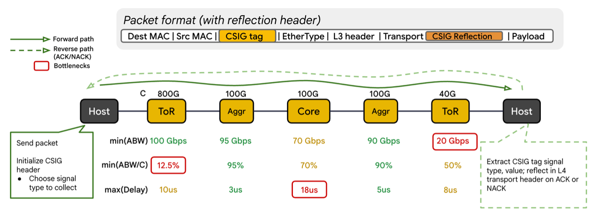
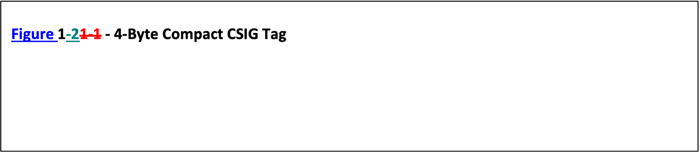
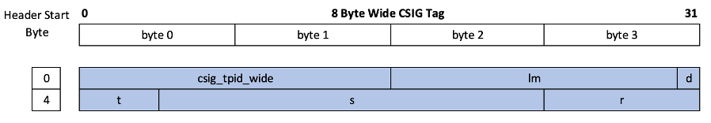
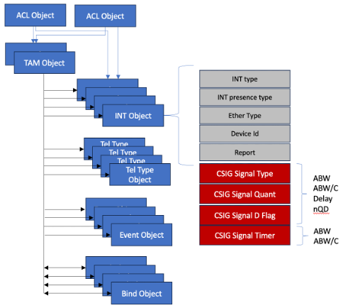

# Congestion Signaling SAI Specification
-------------------------------------------------------------------------------
 Title       | SAI support for Congestion Signaling
:-------------|:-----------------------------------------------------------------
 Authors     | UEC Management Working Group (Jai Kumar, Broadcom Inc.)
 Status      | In review
 Type        | Standards track
 Created     | 05/12/2025: Initial Draft
 SAI-Version | 1.18
-------------------------------------------------------------------------------


## 1.0  Introduction
Congestion Signaling (CSIG) is a simple and efficient network telemetry method that collects fine-grained signals that describe the network fabric’s congestion state. 
The core principle of CSIG's design is the aggregation of congestion state information collected at switches along a packet's path. For many useful telemetry signals employed in congestion control and performance analysis, the key metric is the result of a simple aggregation function applied to the congestion state values.

For instance, with several signal types, we are primarily interested in the congestion state at only one specific switch along the path. This "switch of interest" is defined as the one where the signal's value represents an extremum (either the maximum or minimum) among all switches along that path.



Following logical functions can be performed by the fabric element in a CSIG domain:
- **CSIG init:** Only the Fabric Edge Processor (FEP) executes the initialization function, which involves inserting the CSIG tag into the packet
- **CSIG transit:** UE Fabric switch element performs the transit function, which may include ‘compare and update’ or ‘strip and forward’ of the CSIG tag
- **CSIG term:** While the FEP typically terminates the CSIG tag, the switch also has the capability to perform this termination.
- **CSIG strip and forward:** The switch handles the strip and forward when the peering switch does not support CSIG
- **CSIG Reflection:** The FEP performs the reflection, where the CSIG tag is reflected in the UET Reflection Header for sender-based congestion control


## 2.0 Terms and Acronyms

| Term| Description | 
|:---|:---|
| CSIG | Congestion Signaling |
| Locator Metadata | Contextual information stored in a CSIG tag to identify where in the network that tag was updated |
| Monitoring Entity | Entity responsible for collecting telemetry captured via CSIG and/or other methods, provisioned to scale to report arrival rates |
| Probe | CSIG-tagged packet created for the express purpose of in-network telemetry collection (in contrast with CSIG-tagged packets sent by non-telemetry applications) |
| Signal Type and Value | In-network telemetry information of interest |
| SOP | Start of Packet |
| VLAN tag | An IEEE 802.1Q-2022 clause 9-compliant VLAN tag [802.1Q-2022] |
| FEP | Fabric End Point typically a NIC |
| TAM | Telemetry And Monitoring. A SAI object for anything telemetry |
| INT | In-band Network Telemetry |
| UEC | Ultra Ethernet Consortium|


## 3.0 Overview
Congestion Signaling (CSIG) is a UEC specification for collecting telemetry data from the fabric elements. CSIG specification defines a new protocol header with encoding to indicate what type of signal data to collect. 
This CSIG tag data can be used for
- Congestion Control Algorithms like NSCC, RCCC and PCM
- Telemetry purposes (Out of Scope for UE 1.1 spec)
- There are two types of CSIG tags defined 
	- 4 Byte Compact tag
	- 8 Byte Wide tag
- CSIG tag is identified using ether type code point
	- 4 Byte compact tag is identified using its own ether type code point
	- 8 Byte wide tag is identified using its own ether type code point
- CSIG tag defines following fields
	- t: Signal Type, this field indicates what kind of telemetry or signal data to collect
	- s: Signal Value, this is the quantized signal value
	- lm: Locator Metadata, this is the field updated by the switch giving hints about the hop that modified the signal value
	- d: Do not update Bit, this is the bit set by switch for the packet that got trimmed
	- r: Reserved







Following signals are support for compact and wide tag formats

| t | Signal | Profile | Aggregation Function | Comments |
|:--|:--|:--|:--|:--|
| 0 | ABW| base | min | Available bandwidth per port |
| 1 | ABW/C | base | min | Relative available bandwidth per port |
| 2 | Delay | base | max | Per-hop delay |
| 3 | nQD | extended | max | Queue depth normalized by port speed |


### 3.1 d bit processing
The d bit is set by the switch that performs the trimming operation on the ingress packet. Trimming typically occurs when a queue experiences congestion, leading to a packet drop. Switches further down the path MAY or MAY NOT update the signal value.
The ability to update the d bit is controlled by an associated policy configuration.
The switch may not natively support the ability to set the d bit. This capability (or lack thereof) must be explicitly exposed via a capability query mechanism.
Default behavior for packets with the 'd' bit set is not to update the CSIG tag, unless a specific policy is configured to override the default behavior.


### 3.2 Quantization
Compact and Wide tag specify different method of quantization.
The Compact tag supports 32 fully configurable range buckets. In contrast, the Wide tag supports one million buckets, which must be configured algorithmically for minimum and maximum ranges.

While the specific quantization algorithm is outside the scope of this specification, it utilizes a base value and a step value. The base value defines the starting point for observing a signal value, and the step value defines the width of the bucket. For the Wide tag, the width of the bucket remains constant.

Note that for ease of hardware implementation, both the base value and the step value MUST be powers of two.


### 3.3 Time interval for ABW and ABW/C signal value computation

The CSIG specification requires a consistent time interval, 't', to be configured across all switches within the fabric. This interval is specifically used to measure the amount of traffic in bytes. The resulting observed value is then used in the subsequent computation of both the Available Bandwidth (ABW) and the ABW/C signal value.


## 4.0 SAI Specification 
CSIG packets are designed not to alter a packet's forwarding behavior. Forwarding continues to rely on the standard mechanisms, such as the IP address. Consequently, no changes are required within the SAI logical pipeline to support CSIG packets.

We will leverage the existing SAI infrastructure that utilizes the TAM object. The TAM framework currently supports features such as in-band network telemetry, streaming telemetry, events, transport for reporting, and various reporting formats. This specification proposes enhancing the existing TAM framework to include support for CSIG.


### 4.1 SAI TAM Object Hierarchy




### 4.2 TAM INT Presence Type
The sai_tam_int_presence_type_t enum indicates how a given INT packet is identified.
CSIG tag is identified using a new EtherType value. To accommodate this change, the TAM INT presence enumeration has been updated with a new enum value for EtherType.
```
    /**
     * @brief INT presence type Ether Type Code Point
     */
    SAI_TAM_INT_PRESENCE_TYPE_ETH_TYPE,
```


### 4.3 TAM INT Type
The sai_tam_int_type_t enum specifies types of INT technologies supported by the SAI specification. This enum has been enhanced with two new enum values, one for compact tag and other for wide tag.
```
    /**
     * @brief INT type Congestion Signaling compact tag
     */
    SAI_TAM_INT_TYPE_CSIG_COMPACT,

    /**
     * @brief INT type Congestion Signaling wide tag
     */
    SAI_TAM_INT_TYPE_CSIG_WIDE,
```


### 4.4 TAM INT BW Interval
The time interval is configured for both the available bandwidth and normalized available bandwidth computations. To support this, new enum has been defined for the configurable time interval values. Additionally, a vendor defined enum has been added to ensure support for vendor-specific time iterval implementations.

```
/**
 * @brief Bandwidth time interval units
 */
typedef enum _sai_tam_int_bw_time_interval_unit_t
{
    /**
     * @brief Time interval unit nanosecond
     */
    SAI_TAM_INT_BW_TIME_INTERVAL_UNIT_NANOSEC,

    /**
     * @brief Time interval unit microsecond
     */
    SAI_TAM_INT_BW_TIME_INTERVAL_UNIT_USEC,

    /**
     * @brief Time interval unit millisecond
     */
    SAI_TAM_INT_BW_TIME_INTERVAL_UNIT_MSEC,

} sai_tam_int_bw_time_interval_unit_t;

/**
 * @brief BW time intervals
 */
typedef enum _sai_tam_int_bw_time_interval_t
{
    /**
     * @brief Time window 128
     */
    SAI_TAM_INT_BW_TIME_INTERVAL_128,

    /**
     * @brief Time window 256
     */
    SAI_TAM_INT_BW_TIME_INTERVAL_256,

    /**
     * @brief Time window 384
     */
    SAI_TAM_INT_BW_TIME_INTERVAL_384,

    /**
     * @brief Time window 512
     */
    SAI_TAM_INT_BW_TIME_INTERVAL_512,

    /**
     * @brief Time window 640
     */
    SAI_TAM_INT_BW_TIME_INTERVAL_640,

    /**
     * @brief Time window 768
     */
    SAI_TAM_INT_BW_TIME_INTERVAL_768,

    /**
     * @brief Time window 896
     */
    SAI_TAM_INT_BW_TIME_INTERVAL_896,

    /**
     * @brief Time window 1024
     */
    SAI_TAM_INT_BW_TIME_INTERVAL_1024,

    /**
     * @brief Vendor defined time window
     */
    SAI_TAM_INT_BW_TIME_INTERVAL_VENDOR_DEFINED,
} sai_tam_int_bw_time_interval_t;
```

### 4.5 TAM INT Object
The TAM INT object serves as the primary container for various in-band network telemetry (INT) technologies, including P4-INT, IFA, and IOAM. It is responsible for enumerating all supported INT types and defining their respective identification methods. Furthermore, this object specifies all necessary attributes that are applicable across all or specific INT types.
This object has recently been enhanced to support the new CSIG INT type, along with its associated identification method. New attributes have also been integrated to specify the signals, quantization method, and time intervals required for signal value computation.

```
    /**
     * @brief Ethernet code point value that indicates presence of CSIG compact tag in a packet
     *
     * @type sai_uint16_t
     * @flags MANDATORY_ON_CREATE | CREATE_ONLY
     * @isvlan false
     * @condition SAI_TAM_INT_ATTR_INT_PRESENCE_TYPE == SAI_TAM_INT_PRESENCE_TYPE_ETH_TYPE
     */
    SAI_TAM_INT_ATTR_ETH_TYPE_CODE_POINT,

    /**
     * @brief CSIG signal type
     *
     * @type sai_csig_signal_type_t
     * @flags CREATE_AND_SET
     * @default SAI_CSIG_SIGNAL_TYPE_ABW
     */
    SAI_TAM_INT_ATTR_CSIG_SIGNAL_TYPE,

    /**
     * @brief Time interval for bandwidth computation
     *
     * @type sai_tam_int_bw_time_interval_t
     * @flags CREATE_AND_SET
     * @default SAI_TAM_INT_BW_TIME_INTERVAL_256
     * @validonly SAI_TAM_INT_ATTR_CSIG_SIGNAL_TYPE == SAI_CSIG_SIGNAL_TYPE_ABW or SAI_TAM_INT_ATTR_CSIG_SIGNAL_TYPE == SAI_CSIG_SIGNAL_TYPE_ABWC
     */
    SAI_TAM_INT_ATTR_BW_TIME_INTERVAL,

    /**
     * @brief Bandwidth time Interval Units
     *
     * @type sai_tam_int_bw_time_interval_unit_t
     * @flags CREATE_AND_SET
     * @default SAI_TAM_INT_BW_TIME_INTERVAL_UNIT_USEC
     * @validonly SAI_TAM_INT_ATTR_CSIG_SIGNAL_TYPE == SAI_CSIG_SIGNAL_TYPE_ABW or SAI_TAM_INT_ATTR_CSIG_SIGNAL_TYPE == SAI_CSIG_SIGNAL_TYPE_ABWC
     */
    SAI_TAM_INT_ATTR_BW_TIME_INTERVAL_UNIT,

    /**
     * @brief Number of quantization bands
     * Compact tag supports maximum of 32 bands and wide tag supports maximum of 1048576 bands
     *
     * @type sai_uint32_t
     * @flags CREATE_AND_SET
     * @default 32
     * @validonly SAI_TAM_INT_ATTR_TYPE == SAI_TAM_INT_TYPE_CSIG_COMPACT or SAI_TAM_INT_ATTR_TYPE == SAI_TAM_INT_TYPE_CSIG_WIDE
     */
    SAI_TAM_INT_ATTR_QUANT_BANDS,

    /**
     * @brief Quantization band range values for compact tag
     *
     * @type sai_u32_range_list_t
     * @flags CREATE_AND_SET
     * @default empty
     * @validonly SAI_TAM_INT_ATTR_TYPE == SAI_TAM_INT_TYPE_CSIG_COMPACT
     */
    SAI_TAM_INT_ATTR_QUANT_BAND_UINT32_RANGE_LIST,

    /**
     * @brief Base value for wide tag quantization. Must be power of 2
     *
     * @type sai_uint32_t
     * @flags CREATE_AND_SET
     * @default 0
     * @validonly SAI_TAM_INT_ATTR_TYPE == SAI_TAM_INT_TYPE_CSIG_WIDE
     */
    SAI_TAM_INT_ATTR_WIDE_QUANT_BASE_VALUE,

    /**
     * @brief Step value for wide tag quantization. Must be power of 2
     *
     * @type sai_uint32_t
     * @flags CREATE_AND_SET
     * @default 0
     * @validonly SAI_TAM_INT_ATTR_TYPE == SAI_TAM_INT_TYPE_CSIG_WIDE
     */
    SAI_TAM_INT_ATTR_WIDE_QUANT_STEP_VALUE,

    /**
     * @brief Update the D bit indicating the packet is trimmed
     * DSCP value configured for TRIM packets comes from the TRIM configuration
     *
     * @type bool
     * @flags CREATE_AND_SET
     * @default false
     * @validonly SAI_TAM_INT_ATTR_TYPE == SAI_TAM_INT_TYPE_CSIG_COMPACT or SAI_TAM_INT_ATTR_TYPE == SAI_TAM_INT_TYPE_CSIG_WIDE
     */
    SAI_TAM_INT_ATTR_CSIG_D_BIT,
```

**New Data Type for u32 list**
```
typedef struct _sai_u32_range_list_t
{
    uint32_t count;
    sai_u32_range_t *list;
} sai_u32_range_list_t;
```

### 4.6 ACL Match Fields
The ACL infrastructure supports matching specific fields within a packet and is enhanced to include CSIG tag fields. This functionality is crucial for developing policies based on CSIG tags with flags set, as explained further in the workflow section.
New match for compact and wide tag EtherType and Signal type is introduced. 

**New Data Type for CSIG Signal Types**
```
/**
 * @brief CSIG Signal Type
 * Value of signal in the specification is maintained in the enum order.
 */
typedef enum _sai_csig_signal_type_t
{
    /** Available Bandwidth */
    SAI_CSIG_SIGNAL_TYPE_ABW = 0,

    /** Normalized Available Bandwidth */
    SAI_CSIG_SIGNAL_TYPE_ABWC = 1,

    /** Delay */
    SAI_CSIG_SIGNAL_TYPE_DELAY = 2,

    /** Normalized Queue Depth */
    SAI_CSIG_SIGNAL_TYPE_NQD = 3,

} sai_csig_signal_type_t;
```

**Table Fields**
```

    /**
     * @brief CSIG Compact Tag Ether Type
     *
     * @type bool
     * @flags CREATE_ONLY
     * @default false
     */
    SAI_ACL_TABLE_ATTR_FIELD_CSIG_COMPACT_TAG_ETHER_TYPE = SAI_ACL_TABLE_ATTR_FIELD_START + 0x163,

    /**
     * @brief CSIG Wide Tag Ether Type
     *
     * @type bool
     * @flags CREATE_ONLY
     * @default false
     */
    SAI_ACL_TABLE_ATTR_FIELD_CSIG_WIDE_TAG_ETHER_TYPE = SAI_ACL_TABLE_ATTR_FIELD_START + 0x164,

    /**
     * @brief CSIG Signal Type
     *
     * @type bool
     * @flags CREATE_ONLY
     * @default false
     */
    SAI_ACL_TABLE_ATTR_FIELD_CSIG_SIGNAL_TYPE = SAI_ACL_TABLE_ATTR_FIELD_START + 0x165,
```

**Entry Fields**

```
    /**
     * @brief CSIG Compact Tag Ether Type
     *
     * @type sai_acl_field_data_t sai_uint16_t
     * @flags CREATE_AND_SET
     * @isvlan false
     * @default disabled
     */
    SAI_ACL_ENTRY_ATTR_FIELD_CSIG_COMPACT_TAG_ETHER_TYPE = SAI_ACL_ENTRY_ATTR_FIELD_START + 0x163,

    /**
     * @brief CSIG Wide Tag Ether Type
     *
     * @type sai_acl_field_data_t sai_uint16_t
     * @flags CREATE_AND_SET
     * @isvlan false
     * @default disabled
     */
    SAI_ACL_ENTRY_ATTR_FIELD_CSIG_WIDE_TAG_ETHER_TYPE = SAI_ACL_ENTRY_ATTR_FIELD_START + 0x164,

    /**
     * @brief CSIG Signal Type
     *
     * @type sai_acl_field_data_t sai_csig_signal_type_t
     * @flags CREATE_AND_SET
     * @default disabled
     */
    SAI_ACL_ENTRY_ATTR_FIELD_CSIG_SIGNAL_TYPE = SAI_ACL_ENTRY_ATTR_FIELD_START + 0x165,

```


### 4.7 ACL Actions
This specification does not introduce any new ACL actions. However, there is a scenario where a CSIG tag with the d bit ‘set’ might necessitate suppressing the compare and update operations. This can be accomplished by implementing a high-priority rule with a NULL action.

### 4.8 Switch and Port Object Attributes
New attribute is introduced at port level for CSIG tag delete. Setting this flag will instruct the switch pipeline to delete all the CSIG tags in the CSIG tagged packets egressing this port. Additionally, metadata attribute is introduced to set the locator metadata for the CSIG tagged packets egressing on this port.
Switch attribute specifies number of bandwidth timers a given implementation supports.  

**Port Attributes**
```
    /**
     * @brief Enable INT metadata deletion
     *
     * @type bool
     * @flags CREATE_AND_SET
     * @default false
     */
    SAI_PORT_ATTR_INT_DELETE,

    /**
     * @brief INT metadata
     *
     * @type sai_uint16_t
     * @flags CREATE_AND_SET
     * @isvlan false
     * @default 0
     */
    SAI_PORT_ATTR_INT_METADATA,

```

**Switch Attributes**
```
    /**
     * @brief Maximum number of timers supported for CSIG bandwidth signal
     *
     * @type sai_uint8_t
     * @flags READ_ONLY
     */
    SAI_SWITCH_ATTR_MAX_CSIG_TIMERS,
```


## 5.0 Sample Workflow

This section talks about enabling CSIG and controlling its behavior for different deployment considerations.

### 5.1 Enable CSIG Tag Processing

Each signal type processing requires creation of a corresponding TAM INT obejct.
This means that maximum of 8 TAM INT object needs need to be create to handle 4 signals for compact tag and 4 signals for wide tag.
Since each TAM INT object can specify a single time interval for ABW or ABW/C, this means that if deployment requires configuring more than one time interval values then user need to create additional TAM INT object for a given time interval value for ABW or ABW/C signal.

#### 5.1.1 Enable CSIG Compact Tag Processing

```
/*
 * Configure CSIG Compact Tag for ABW signal processing and time interval of 256 micro seconds
 */

// Specify the INT presence type
sai_attr_list[0].id = SAI_TAM_INT_ATTR_INT_PRESENCE_TYPE;
sai_attr_list[0].value.s32 = SAI_TAM_INT_PRESENCE_TYPE_ETH_TYPE;

// Specify CSIG Tag Type Compact
sai_attr_list[1].id = SAI_TAM_INT_ATTR_TYPE;
sai_attr_list[1].value.s32 = SAI_TAM_INT_TYPE_CSIG_COMPACT;

// Configure TPID for CSIG Tag Type
sai_attr_list[1].id = SAI_TAM_INT_ATTR_ETH_TYPE_CODE_POINT;
sai_attr_list[1].value.u16 = 0xccdd;

// Configure Signal Type
sai_attr_list[2].id = SAI_TAM_INT_ATTR_CSIG_SIGNAL_TYPE;
sai_attr_list[2].value.s32 = SAI_CSIG_SIGNAL_TYPE_ABW;

// Configure Time Interval
sai_attr_list[3].id = SAI_TAM_INT_ATTR_BW_TIME_INTERVAL;
sai_attr_list[3].value.s32 = SAI_TAM_INT_BW_TIME_INTERVAL_256;

// Configure Time Interval Unit
sai_attr_list[4].id = SAI_TAM_INT_ATTR_BW_TIME_INTERVAL_UNIT;
sai_attr_list[4].value.s32 = SAI_TAM_INT_BW_TIME_INTERVAL_UNIT_USEC;

// Configure Range List for each band
sai_attr_list[5].id = SSAI_TAM_INT_ATTR_QUANT_BANDS;
sai_attr_list[5].value.u32 = 8;

// Configure quantization band
sai_attr_list[6].id = SAI_TAM_INT_ATTR_QUANT_BAND_UINT32_RANGE_LIST;
sai_attr_list[6].value.u32rangelist.count = 8;
sai_attr_list[6].value.u32rangelist.list[0].min = 1; sai_attr_list[6].value.u32rangelist.list[0].max = 100;. . .
. . .
sai_attr_list[6].value.u32rangelist.list[7].min = 3101; sai_attr_list[6].value.u32rangelist.list[7].max = 3200;

// Enable setting of d bit if packet gets trimmed
sai_attr_list[7].id = SAI_TAM_INT_ATTR_CSIG_D_BIT;
sai_attr_list[7].value.booldata = true;

// Create tam int object for compact tag
attr_count = 8;
create_tam_int(
	&sai_tam_int_csig_compact_tag_object, 
	switch_id, 
	attr_count, 
	sai_attr_list);
```

#### 5.1.2 Enable CSIG Wide Tag Processing

Main difference between compact and wide tag processing is the quantization configuration.
Following steps are different from the section 5.1.1 for configuring CSIG wide tag processing.

```
// Specify CSIG Tag Type Wide
sai_attr_list[1].id = SAI_TAM_INT_ATTR_TYPE;
sai_attr_list[1].value.s32 = SAI_TAM_INT_TYPE_CSIG_WIDE;

...
...

// Configure number of quantization bands
sai_attr_list[5].id = SAI_TAM_INT_ATTR_QUANT_BANDS;
sai_attr_list[5].value.u32 = 1048576;

// Configure base value for ABW signal
sai_attr_list[6].id = SAI_TAM_INT_ATTR_WIDE_QUANT_BASE_VALUE;
sai_attr_list[6].value.u32 = 1024;

// Configure step value for ABW signal
sai_attr_list[7].id = SAI_TAM_INT_ATTR_WIDE_QUANT_STEP_VALUE;
sai_attr_list[7].value.u32 = 32;

// Create tam int object for compact tag
attr_count = 8;
create_tam_int(
	&sai_tam_int_csig_wide_tag_object, 
	switch_id, 
	attr_count, 
	sai_attr_list);

```

#### 5.1.3 Enable CSIG for the entire Switch

Step 1:
Create TAM objects as described in section 5.1.1 and 5.1.2
- sai_tam_int_csig_compact_tag_object
- sai_tam_int_csig_wide_tag_object

Step 2:
Install an ACL rule to match CSIG ethtype and set the action as insert and bind the ACL Table to the switch
- match <SAI_ACL_ENTRY_ATTR_FIELD_CSIG_COMPACT_ETHER_TYPE> action <SAI_ACL_ENTRY_ATTR_ACTION_INT_INSERT,  sai_tam_int_csig_compact_tag_object>
- match <SAI_ACL_ENTRY_ATTR_FIELD_CSIG_WIDE_ETHER_TYPE> action <SAI_ACL_ENTRY_ATTR_ACTION_INT_INSERT,  sai_tam_int_csig_wide_tag_object>

#### 5.1.4 Enable CSIG for subset of ingress ports
Step 1:
Create TAM objects as described in section 5.1.1 and 5.1.2
- sai_tam_int_csig_compact_tag_object
- sai_tam_int_csig_wide_tag_object

Step 2:
Install an ACL rule to match on CSIG ether type and bind the ACL table to multiple ports

- match <SAI_ACL_ENTRY_ATTR_FIELD_CSIG_COMPACT_ETHER_TYPE> action <sai_tam_int_csig_compact_tag_object>
- match <SAI_ACL_ENTRY_ATTR_FIELD_CSIG_WIDE_ETHER_TYPE> action <sai_tam_int_csig_wide_tag_object>

or

ACL table with IN ports qualifier can be bound to switch object

### 5.2 Enable strip and forward for an egress port

Set the newly introduced flag SAI_PORT_ATTR_INT_DELETE to true for a given egress port.

```
// Enable strip and forward for all CSIG traffic egressing on this port
sai_attr_list[x].id = SAI_PORT_ATTR_INT_DELETE;
sai_attr_list[x].value.booldata = true;
```

Or, ACL can be used to enable INT delete for a given egress port

Step 1:
Create ACL Table and bind it to the switch as explained in sections 5.1.3. This will enable CSIG processing for all the ports

Step 2:
Install an ACL rule to match on egress port peering with link not supporting CSIG and set the action as delete. Following rules will enable strip and forward for both compact and wider CSIG traffic egressing on the qualified egress port.

- match <SAI_ACL_ENTRY_ATTR_FIELD_OUT_PORT | SAI_ACL_ENTRY_ATTR_FIELD_CSIG_COMPACT_ETHER_TYPE> action <SAI_ACL_ENTRY_ATTR_ACTION_INT_DELETE>
- match <SAI_ACL_ENTRY_ATTR_FIELD_OUT_PORT | SAI_ACL_ENTRY_ATTR_FIELD_CSIG_WIDE_ETHER_TYPE> action <SAI_ACL_ENTRY_ATTR_ACTION_INT_DELETE>

### 5.2 Disable CSIG tag update for CSIG packets with d bit set
Install a high priority ACL rule to match on d bit for CSIG ETHER_TYPE and without any action. Individual signal type can be used as a qualifier for suppressing CSIG tag update.

- match <SAI_ACL_ENTRY_ATTR_FIELD_CSIG_D_BIT |
SAI_ACL_ENTRY_ATTR_FIELD_CSIG_SIGNAL_TYPE  | SAI_ACL_ENTRY_ATTR_FIELD_CSIG_COMPACT_ETHER_TYPE> action <NULL>

- match <SAI_ACL_ENTRY_ATTR_FIELD_CSIG_D_BIT |
SAI_ACL_ENTRY_ATTR_FIELD_CSIG_SIGNAL_TYPE  | SAI_ACL_ENTRY_ATTR_FIELD_CSIG_WIDE_ETHER_TYPE> action <NULL>

### 5.3 Supporting CSIG Stats
There is no new stats counters are introduced in the SAI spec.
ACL counters are used to count specific CSIG signal type packets, or d bit processing or invalid signal type if present in the CSIG tag.

match <SAI_ACL_ENTRY_ATTR_FIELD_CSIG_D_BIT |
SAI_ACL_ENTRY_ATTR_FIELD_CSIG_SIGNAL_TYPE | SAI_ACL_ENTRY_ATTR_FIELD_CSIG_COMPACT_ETHER_TYPE> action <SAI_ACL_ENTRY_ATTR_ACTION_COUNTER>

This rule will count all the compact CSIG tag packets with 'a' signal that got trimmed (‘D’ bit set)


match <SAI_ACL_ENTRY_ATTR_FIELD_CSIG_SIGNAL_TYPE | SAI_ACL_ENTRY_ATTR_FIELD_CSIG_COMPACT_ETHER_TYPE> action <SAI_ACL_ENTRY_ATTR_ACTION_COUNTER>

This rule will count all compact CSIG tag packets for a given signal type.


### 5.4 Capability Query
NOS must query the switch to find out if following is supported or not
- Support for Compact and/or Wide tag
- Support for specific signal type
- Support for d bit processing
- Support for strip and forward
- Number s and valueof BW interval timers supported 

```
sai_attr_capability_t csig_tag_capability={0};

// Query CSIG tag support for compact and/or wide tag
sai_query_attribute_capability(switch_id, SAI_OBJECT_TYPE_TAM_INT,  
SAI_TAM_INT_ATTR_INT_TYPE,  &csig_tag_capability);


// Query CSIG signals supported
sai_query_attribute_capability(switch_id, SAI_OBJECT_TYPE_TAM_INT,  
SAI_TAM_INT_ATTR_CSIG_SIGNAL_TYPE,  &csig_tag_capability)

// Query CSIG D bit support
sai_query_attribute_capability(switch_id, SAI_OBJECT_TYPE_TAM_INT,  
SAI_TAM_INT_ATTR_CSIG_D_BIT,  &csig_tag_capability)

// Query if strip and forward is supporrted
sai_query_attribute_capability(switch_id, SAI_OBJECT_TYPE_PORT,  
 SAI_PORT_ATTR_INT_DELETE,  &csig_tag_capability)

// Query inumber of timers supporred
get_port_attribute(switch_id,attr_cnt,  
 attr_list[]=SAI_SWITCH_ATTR_MAX_CSIG_TIMERS)
```

#