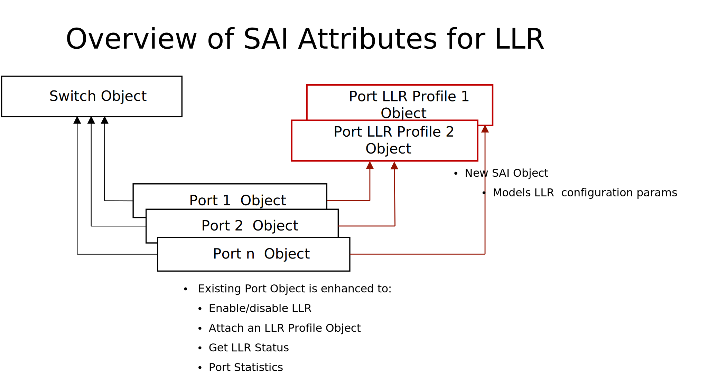

# SAI Proposal: Link Layer Retry (LLR)

-------------------------------------------------------------------------------
 Title       |   Link Layer Retry (LLR)
-------------|-----------------------------------------------------------------
 Authors     | UEC Management WG (Ravindranath C Kanakarajan and Rupa Budhia, Marvell) 
 Status      | In review
 Type        | Standards track
 Created     | November 05, 2025  
 SAI-Version | 1.18
-------------------------------------------------------------------------------


## Introduction

Link Layer Retry (LLR) is a hop-by-hop retransmission mechanism designed to mitigate latency caused by end-to-end retransmissions due to link errors (CRC/FEC). It improves performance for latency-sensitive workloads by enabling local retransmission.

### Overview

###### Figure 1: LLR Overview


- Frames are assigned sequence numbers in the Ethernet preamble.
- Replay buffers store frames for retransmission.
- Acknowledgements (LLR_ACK) are sent via Control Ordered Sets (CtlOS).
- Negative acknowledgements (LLR_NACK) trigger Go-Back-N retransmissions.


### LLR Transmission and Acknowledgement Flow

- At **LLR Tx**:
  - Each frame is assigned a sequence number, which is carried in the frame.
  - UEC LLR sends the sequence number in the frame preamble.
  - The sequence number is incremented by 1 for each subsequent frame.
  - The frame is placed in a **Replay Buffer** for possible retransmission if the link partner does not receive it.

- At **LLR Rx** (link partner):
  - Periodically sends acknowledgements (**LLR_ACKs**) for frames that were successfully received.
  - LLR_ACK is **cumulative**, i.e., it carries the sequence number of the most recent successfully received frame.
  - UEC LLR sends acknowledgements in **Control Ordered Sets (CtlOS)** inserted into the data stream by the PCS.
  - Spacing between CtlOS messages is **configurable**.

- When an **LLR_ACK** is received back at the sender:
  - All frames up to the sequence number in the LLR_ACK are removed from the replay buffer, freeing up space.
  - If an ACK is lost, the next received ACK will free up all frames up to the sequence number in that ACK.

### Error Handling

- LLR_NACK is sent on receiving a corrupted frame (CRC or uncorrectable FEC errors) or lost (out-of-order) frames.
- Replay timer ensures retransmission if the last frame is lost.
- Replay count prevents indefinite retries.
- Data age timeout limits the amount of time a frame resides in the replay buffer.


#### Go-Back-N Scheme

- **At LLR Rx (Receiver):**
  - Detects a missing frame when:
    - A frame is received with an out-of-sequence number, or
    - A frame is received with a CRC error or an uncorrectable FEC error.
  - Sends a **negative acknowledgement (LLR_NACK)** to the sender.
  - The **LLR_NACK** includes the sequence number of the most recent successfully received LLR frame.
  - Discards all subsequent received frames until a frame with the expected sequence number is received.
  - Does **not** send any further ACK or NACK messages during this period.

- **At LLR Tx (Sender):**
  - Upon receiving an **LLR_NACK**:
    - Retransmits those frames from the replay buffer whose sequence number is greater than the sequence number in the LLR_NACK.


### Replay timer

- A **replay timer** is maintained at **LLR Tx** to handle cases where:
  - The last packet is lost, or
  - An **LLR_NACK** is lost, or
  - No **LLR_ACKs** or **LLR_NACKs** are received to indicate progress.

- **Replay is initiated** when the replay timer expires.

- The replay mechanism:
  - Retransmits all frames from the replay buffer.
  - Can be performed **multiple times** (capped by `REPLAY_COUNT_MAX`) if no further **LLR_ACKs** are received.

- The replay timer ensures reliability and prevents indefinite stalling in the absence of acknowledgements.


### 'Flush' State in LLR Tx

The **LLR Tx mechanism** enters a **“FLUSH” state** under any of the following error conditions:

- The number of **replay attempts exceeds** a configured maximum value (`REPLAY_COUNT_MAX`).
- The **PCS status** remains `FALSE` for longer than the configured timeout (`PCS_LOST_TIMEOUT`).
- **Data remains in the replay buffer** for too long without receiving a successful `LLR_ACK` (`DATA_AGE_TIMEOUT`).


In the flush state, depending on configuration, LLR Tx may:

- **Reinitialize LLR** automatically if `RE_INIT_ON_FLUSH` is set to `true`, OR
- **Wait for management plane intervention** to resolve the issue and manually re-enable LLR.
---

## SAI Specification

###### Figure 2: LLR SAI Objects




LLR is a new feature in SAI. To support LLR, new attributes and statistics are added to the SAI Port Object. Additionally, a new object called a Port LLR Profile is introduced to model the LLR parameters of a port. 


### Port LLR Profile

Port LLR Profile contains LLR attributes associated with a port.  These attributes are listed in the table below.

| SAI_PORT_LLR_PROFILE_ATTR | Type | Flags | Default | Description |
|----------|------|-------|---------|-------------|
| OUTSTANDING_FRAMES_MAX | sai_uint32_t | MANDATORY_ON_CREATE, CREATE_ONLY | NA | Max unacknowledged frames |
| OUTSTANDING_BYTES_MAX | sai_uint32_t | MANDATORY_ON_CREATE, CREATE_ONLY | NA | Max unacknowledged bytes |
| REPLAY_TIMER_MAX | sai_uint32_t | CREATE_AND_SET | 0 | Replay timer threshold |
| REPLAY_COUNT_MAX | sai_uint8_t | CREATE_AND_SET | 1 | Max replay attempts |
| PCS_LOST_TIMEOUT | sai_uint32_t | CREATE_AND_SET | 0 | Timeout for PCS loss |
| DATA_AGE_TIMEOUT | sai_uint32_t | CREATE_AND_SET | 0 | Max age of replay buffer data |
| INIT_LLR_FRAME_ACTION | sai_llr_frame_action_t | CREATE_AND_SET | BEST_EFFORT | Action in INIT state |
| FLUSH_LLR_FRAME_ACTION | sai_llr_frame_action_t | CREATE_AND_SET | BEST_EFFORT | Action in FLUSH state |
| RE_INIT_ON_FLUSH | bool | CREATE_AND_SET | false | Auto re-init after flush |
| CTLOS_TARGET_SPACING | sai_uint16_t | CREATE_AND_SET | 2048 | CtlOS spacing in bytes |

#### Frame Action Types

| sai_llr_ frame_action_t | Description |
|------|-------------|
| SAI_LLR_FRAME_ACTION_DISCARD | Drop frames |
| SAI_LLR_FRAME_ACTION_BLOCK | Block transmission |
| SAI_LLR_FRAME_ACTION_BEST_EFFORT | Treat as regular packets |

### SAI Port Updates

New attributes are added to the existing SAI Port object to attach a LLR Profile to the Port, enable LLR, and read LLR status.

| SAI_PORT _ATTR| Type | Flags | Default | Description |
|----------|------|-------|---------|-------------|
| LLR_MODE_LOCAL | bool | CREATE_AND_SET | false | Enable local INIT reception |
| LLR_MODE_REMOTE | bool | CREATE_AND_SET | false | Enable remote INIT transmission |
| LLR_PROFILE | object ID | CREATE_AND_SET | NULL | Associated LLR profile |
| LLR_TX_STATUS | sai_port_llr_tx_status_t | READ_ONLY | NA | TX state |
| LLR_RX_STATUS | sai_port_llr_rx_status_t | READ_ONLY | NA | RX state |

#### Port LLR Tx Status

| 	sai_port_llr_tx_status_t | Description |
|------|-------------|
| SAI_PORT_LLR_TX_STATUS_OFF | TX disabled |
| SAI_PORT_LLR_TX_STATUS_INIT | Sending INIT messages |
| SAI_PORT_LLR_TX_STATUS_ADVANCE | Normal operation |
| SAI_PORT_LLR_TX_STATUS_REPLAY | Replay in progress |
| SAI_PORT_LLR_TX_STATUS_FLUSH | Flush state |

#### Port LLR Rx Status

| 	sai_port_llr_rx_status_t | Description |
|------|-------------|
| SAI_PORT_LLR_RX_STATUS_OFF | RX disabled |
| SAI_PORT_LLR_RX_STATUS_SEND_ACKS | Normal ACK operation |
| SAI_PORT_LLR_RX_STATUS_SEND_NACK | Sending NACK |
| SAI_PORT_LLR_RX_STATUS_NACK_SENT | Awaiting expected frame |

#### Port Error Status


The `sai_port_error_status_t` is an existing enum used by the SAI implementation to convey the **operational status** of a port when a state change is detected. Each enum value represents a **bit flag**, allowing multiple fault conditions to be encoded simultaneously. A new enum value is introduced to indicate that the port Tx mechanism's flush state.


| sai_port_error_status_t  | Description |
|------|-------------|
| SAI_PORT_ERROR_STATUS_LLR_TX_FLUSH | TX entered/exited flush state |

### Port LLR Statistics

Includes counters for:

- INIT/INIT_ECHO/ACK/NACK CtlOS TX/RX
- Frame discards, poisoned frames, replays
- Sequence errors, missing/duplicate sequences

| **SAI_PORT_STAT**                     | **Description**                                                                                                                                                                                                 |
|--------------------------------------|------------------------------------------------------------------------------------------------------------------------------------------------------------------------------------------------------------------|
| LLR_TX_INIT_CTL_OS                   | Number of LLR_INIT control ordered sets transmitted                                                                                                                       |
| LLR_TX_INIT_ECHO_CTL_OS              | Number of LLR_INIT_ECHO control ordered sets transmitted                                                                                                                  |
| LLR_TX_ACK_CTL_OS                    | Number of LLR_ACK control ordered sets transmitted                                                                                                                        |
| LLR_TX_NACK_CTL_OS                   | Number of LLR_NACK control ordered sets transmitted                                                                                                                       |
| LLR_TX_DISCARD                       | Number of LLR-eligible frames discarded by the LLR TX when:<br>• the TX state machine is in the INIT state, and `llr_init_behavior` is set to DISCARD<br>• the TX state machine is in the FLUSH state, and `llr_flush_behavior` is set to DISCARD |
| LLR_TX_OK                            | Number of LLR-eligible frames transmitted with a good FCS                                                                                                                 |
| LLR_TX_POISONED                      | Number of LLR-eligible frames transmitted with a poisoned FCS                                                                                                             |
| LLLR_TX_REPLAY                       | Number of times that LLR Tx completed a replay operation                                                                                                                  |
| LLR_RX_INIT_CTL_OS                   | Number of LLR_INIT control ordered sets received                                                                                                                          |
| LLR_RX_INIT_ECHO_CTL_OS              | Number of LLR_INIT_ECHO control ordered sets received                                                                                                                     |
| LLR_RX_ACK_CTL_OS                    | Number of LLR_ACK control ordered sets received                                                                                                                           |
| LLR_RX_NACK_CTL_OS                   | Number of LLR_NACK control ordered sets received                                                                                                                          |
| LLR_RX_ACK_NACK_SEQ_ERROR           | Number of LLR_ACK/LLR_NACK sequence number errors. Incremented when an ACK/NACK is received with an unexpected sequence number                                           |
| LLR_RX_OK                            | Number of LLR-eligible frames received with a good FCS                                                                                                                    |
| LLR_RX_POISONED                      | Number of LLR-eligible frames received with a poisoned FCS                                                                                                                |
| LLR_RX_BAD                           | Number of LLR-eligible frames received with a bad FCS                                                                                                                     |
| LLR_RX_EXPECTED_SEQ_GOOD            | Number of LLR-eligible frames received with a good FCS and the expected sequence number                                                                                   |
| LLR_RX_EXPECTED_SEQ_POISONED        | Number of LLR-eligible frames received with a poisoned FCS and the expected sequence number                                                                               |
| LLR_RX_EXPECTED_SEQ_BAD             | Number of LLR-eligible frames received with a bad FCS and the expected sequence number                                                                                    |
| LLR_RX_MISSING_SEQ                  | Number of LLR-eligible frames received with a sequence number indicating a missing frame in the sequence, regardless of FCS status                                       |
| LLR_RX_DUPLICATE_SEQ                | Number of LLR-eligible frames received with a duplicate sequence number, regardless of FCS status                                                                         |
| LLR_RX_REPLAY                        | Number of times that LLR Rx detected the start of a replay                                                                                                                |

---

## Workflow


### 1) Create LLR Profile

```c
sai_attr_list[0].id = SAI_PORT_LLR_PROFILE_ATTR_OUTSTANDING_FRAMES_MAX;
sai_attr_list[0].value.u32 = 100;

sai_attr_list[1].id = SAI_PORT_LLR_PROFILE_ATTR_OUTSTANDING_BYTES_MAX;
sai_attr_list[1].value.u32 = 102400;

sai_attr_list[2].id = SAI_PORT_LLR_PROFILE_ATTR_REPLAY_TIMER_MAX;
sai_attr_list[2].value.u32 = 10000;

sai_attr_list[3].id = SAI_PORT_LLR_PROFILE_ATTR_REPLAY_COUNT_MAX;
sai_attr_list[3].value.u32 = 255;

sai_attr_list[4].id = SAI_PORT_LLR_PROFILE_ATTR_PCS_LOST_TIMEOUT;
sai_attr_list[4].value.u32 = 500;

sai_attr_list[5].id = SAI_PORT_LLR_PROFILE_ATTR_DATA_AGE_TIMEOUT;
sai_attr_list[5].value.u32 = 100000;

attr_count = 6;
sai_create_llr_profile_fn(&sai_llr_profile_id, switch_id, attr_count, sai_attr_list);
```


### 2) Enable LLR on a port

```c
sai_attr_list[0].id = SAI_PORT_ATTR_LLR_PROFILE;
sai_attr_list[0].value.oid = sai_llr_profile_id;
sai_set_port_attribute_fn(sai_port_id, switch_id, 1, sai_attr_list);

sai_attr_list[0].id = SAI_PORT_ATTR_LLR_MODE_LOCAL;
sai_attr_list[0].value.booldata = true;
sai_set_port_attribute_fn(sai_port_id, switch_id, 1, sai_attr_list);

sai_attr_list[0].id = SAI_PORT_ATTR_LLR_MODE_REMOTE;
sai_attr_list[0].value.booldata = true;
sai_set_port_attribute_fn(sai_port_id, switch_id, 1, sai_attr_list);
```

### 3) Get LLR Port Status

```c

sai_attr_list[0].id = SAI_PORT_ATTR_LLR_RX_STATUS;
sai_attr_list[1].id = SAI_PORT_ATTR_LLR_TX_STATUS;
sai_get_port_attribute_fn(sai_port_id, switch_id, 2, sai_attr_list);

```
### 4) Get LLR Port Statistics


```c
sai_stat_capability_list_t sai_port_stats_capability;
sai_port_stats_capability.count = SAI_PORT_STAT_END;

sai_stat_capability_t stats[SAI_PORT_STAT_END] = {};
sai_port_stats_capability.list = stats;

sai_query_stats_capability(switch_id, SAI_OBJECT_TYPE_PORT, sai_port_stats_capability);

sai_port_stat_t supported_stat_ids[SAI_PORT_STAT_END] = {0};
int j = 0;

for (int i = 0; i < sai_port_stats_capability.count; i++) {
    switch (sai_port_stats_capability.list[i].stat_enum) {
        case SAI_PORT_STAT_LLR_TX_INIT_CTL_OS:
        case SAI_PORT_STAT_LLR_TX_INIT_ECHO_CTL_OS:
        case SAI_PORT_STAT_LLR_RX_REPLAY:
            if (sai_port_stats_capability.list[i].stat_modes & SAI_STAT_MODE_READ) {
                supported_stat_ids[j++] = sai_port_stats_capability.list[i].stat_enum;
            }
            break;
        default:
            break;
    }
}

sai_get_port_stats_fn(sai_port_id, switch_id, j, supported_stat_ids, counters);
```

## Capability Queries

### Feature Capability

Use existing `sai_query_attribute_capability()` to check support for:

- `SAI_PORT_ATTR_LLR_PROFILE`
- `SAI_PORT_ATTR_LLR_MODE_LOCAL`
- `SAI_PORT_ATTR_LLR_MODE_REMOTE`
- etc.

Example:
```c
sai_query_attribute_capability( 
        switch_id, 
        SAI_OBJECT_TYPE_PORT, 
        SAI_PORT_ATTR_LLR_PROFILE, 
        attr_cap);
```

### Statistics Capability

Use existing `sai_query_stats_capability()` to check support for any of the new LLR port stats `SAI_PORT_STAT_LLR_xxx`.

Example:
```c
sai_stat_capability_list_t    sai_port_stats_capability;
stats_capability.count = SAI_PORT_STAT_END;
stats_capability.list = stats.data();
sai_query_stats_capability(
    switch_id, 
    SAI_OBJECT_TYPE_PORT,
    &sai_port_stats_capability);
```
---

## Normative References

- [UE Specification 1.0 Chapter 5.1](https://ultraethernet.org/wp-content/uploads/sites/20/2025/06/UE-Specification-6.11.25.pdf)

---
