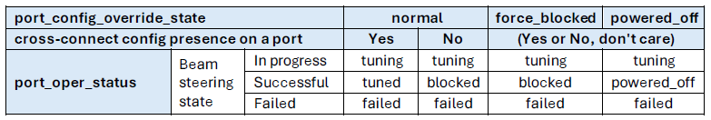

SAI Optical Circuit Switch API Proposal
=====================

Title       | SAI Optical Circuit Switch API Proposal
------------|----------------------
Authors     | Coherent
Status      | Draft
Type        | Standards track
Created     | 11/20/2025
SAI-Version | ?
-------------------------------

# 1. Scope

This document defines the draft technical specifications for the API in Open Compute Project Switch Abstraction Interface (SAI) used to support the configurations of OCS port and OCS cross connect in the OCS device, as well as the retrieval of OCS operational status data from OCS device.

# 2. Overview
As AI clusters reach massive proportions, Optical Circuit Switching (OCS) is becoming essential. It slashes energy overhead, reduces network complexity, and paves the way for revolutionary data center designs and applications. OCS device can have varying capacities from different hardware or module, defined as "number of A side ports" × "number of B side ports" (e.g., 64×64, 320×320, etc.). OCS cross-connect is direct optical transmission channel between different optical links, it is provisioned between port on one side (e.g. A side) and port on the other side (e.g. B side). 

Main functions of the OCS SAI definitions include:
* Support creation and remove of OCS cross-connects, including both individual switching and simultaneous switching with multiple connections.
* Support OCS ports operation, including the ability to set a state to any specified group of ports.
* Support the retrieval of current operational status on OCS port.
* Support the retrieval of hardware-specific OCS module data, such as port physical mapping information and factory insertion loss values etc.

# 3. OCS Port
## 3.1  OCS Port Discovery and Creation
* The capacity of OCS device (number of A side ports and number of B side ports) and corresponding default port configurations are defined in OCS device specific template/profile, example as below:
```cpp
# name             state  
OCS_PORT|1A        normal 
OCS_PORT|1B        normal 
OCS_PORT|2A        normal 
OCS_PORT|2B        normal 
OCS_PORT|3A        normal 
OCS_PORT|3B        normal 
OCS_PORT|4A        normal 
OCS_PORT|4B        normal 
OCS_PORT|5A        normal 
OCS_PORT|5B        normal 
OCS_PORT|6A        normal 
OCS_PORT|6B        normal 
OCS_PORT|7A        normal 
OCS_PORT|7B        normal 
OCS_PORT|8A        normal 
OCS_PORT|8B        normal 
...
```
* OCS ports are created by upstream application using SAI API by parsing OCS device capability specific template/profile.    
* After creation, OCS port is not deletable.       
## 3.2  OCS Port Configuration
* The key configurable parameter is the override state (normal or force-blocked, etc.). 
* Override state configuration can be changed regardless wether there's OCS cross-connect on the port.
## 3.3 OCS Port Operational Status
The OCS port operational status relies on the override state and the presence of an OCS cross-connect configuration on the port.       


# 4. OCS Cross-Connects
OCS cross-connects are dynamically created and removed via SAI APIs.    
## 4.1. Object Relationships
* The SAI object IDs of OCS ports serve as the SAI attributes for both the ingress and egress ports in OCS cross-connect SAI object.
* OCS ports are referenced to OCS cross-connect by their SAI object IDs in cross-connect attributes.
## 4.2. Cross-Connect Configuration 
* To have fast switching performance, SAI bulk create/remove APIs are used for management of OCS cross-connect configurations.
* OCS cross-connect can not be provisioned between two A side ports or two B side ports.
* One OCS port can only involved in one OCS cross-connect; when switching existing OCS cross-connect, e.g. switch from 1A-1B to 1A-2B, the upstream application need to use SAI API to remove 1A-1B and then create 1A-2B. 
# 5. OCS Cross-Connects Factory Data
OCS cross-connect factory data are read-only information about insertion loss measurements of all possible cross-connects. 
* Factory data are measured during the manufacturing calibration phase.
* The measurement is for every possible optical path (cross-connect) with an optical spectrum (central frequency) in specific environment (temperature).

# 6. OCS SAI Object and Attributes
| SAI Object | SAI Attributes | SAI Data Type |
| ---- | ---- | ---- |
|SAI_OBJECT_TYPE_OCS_CROSS_CONNECT  | SAI_OCS_CROSS_CONNECT_ATTR_A_SIDE_PORT_ID | sai_object_id_t
| | SAI_OCS_CROSS_CONNECT_ATTR_B_SIDE_PORT_ID | sai_object_id_t
| SAI_OBJECT_TYPE_OCS_PORT   | SAI_OCS_PORT_ATTR_NAME | sai_u8_list_t
| | SAI_OCS_PORT_ATTR_OVERRIDE_STATE | sai_ocs_port_override_state_t
| | SAI_OCS_PORT_ATTR_OPER_STATUS | sai_ocs_port_status_t
| | SAI_OCS_PORT_ATTR_PHYSICAL_MAPPING | sai_u8_list_t
SAI_OBJECT_TYPE_OCS_CROSS_CONNECT_FACTORY_DATA | SAI_OCS_CROSS_CONNECT_FACTORY_DATA_ATTR_A_SIDE_PORT_NAME | sai_u8_list_t
| | SAI_OCS_CROSS_CONNECT_FACTORY_DATA_ATTR_B_SIDE_PORT_NAME | sai_u8_list_t
| | SAI_OCS_CROSS_CONNECT_FACTORY_DATA_ATTR_FREQUENCY_THZ | sai_s32_list_t
| | SAI_OCS_CROSS_CONNECT_FACTORY_DATA_ATTR_MEASURED_TEMPERATURE | sai_s32_list_t
| | SAI_OCS_CROSS_CONNECT_FACTORY_DATA_ATTR_INSERTION_LOSS_DB | sai_s32_list_t
| | SAI_OCS_CROSS_CONNECT_FACTORY_DATA_ATTR_INSERTION_LOSS_ACCURACY_DB | sai_s32_list_t 

# 7. OCS SAI APIs
```cpp
**
 * @brief OCS methods table retrieved with sai_api_query()
 */
typedef struct _sai_ocs_api_t
{
    sai_create_ocs_port_fn                                     create_ocs_port;
    sai_remove_ocs_port_fn                                     remove_ocs_port;
    sai_set_ocs_port_attribute_fn                              set_ocs_port_attribute;
    sai_get_ocs_port_attribute_fn                              get_ocs_port_attribute;
    sai_bulk_object_create_fn                                  create_ocs_ports;
    sai_bulk_object_remove_fn                                  remove_ocs_ports;
    sai_bulk_object_set_attribute_fn                           set_ocs_ports_attribute;
    sai_bulk_object_get_attribute_fn                           get_ocs_ports_attribute;
    sai_create_ocs_cross_connect_fn                            create_ocs_cross_connect;
    sai_remove_ocs_cross_connect_fn                            remove_ocs_cross_connect;
    sai_set_ocs_cross_connect_attribute_fn                     set_ocs_cross_connect_attribute;
    sai_get_ocs_cross_connect_attribute_fn                     get_ocs_cross_connect_attribute;
    sai_bulk_object_create_fn                                  create_ocs_cross_connects;
    sai_bulk_object_remove_fn                                  remove_ocs_cross_connects;
    sai_bulk_object_set_attribute_fn                           set_ocs_cross_connects_attribute;
    sai_bulk_object_get_attribute_fn                           get_ocs_cross_connects_attribute;
    sai_create_ocs_cross_connect_factory_data_fn               create_ocs_cross_connect_factory_data;
    sai_remove_ocs_cross_connect_factory_data_fn               remove_ocs_cross_connect_factory_data;
    sai_set_ocs_cross_connect_factory_data_attribute_fn        set_ocs_cross_connect_factory_data_attribute;
    sai_get_ocs_cross_connect_factory_data_attribute_fn        get_ocs_cross_connect_factory_data_attribute;
    sai_bulk_object_create_fn                                  create_ocs_cross_connect_factory_datas;
    sai_bulk_object_remove_fn                                  remove_ocs_cross_connect_factory_datas;
    sai_bulk_object_set_attribute_fn                           set_ocs_cross_connect_factory_datas_attribute;
    sai_bulk_object_get_attribute_fn                           get_ocs_cross_connect_factory_datas_attribute;

} sai_ocs_api_t;
```

# 8. OCS SAI API Usage Examples 
## 8.1. Usage Example: Create OCS Ports  
The following example demonstrates how to create OCS ports by specifying port name and port override state. Note: after OCS ports are created, the returned SAI object IDs will be buffered (_port_key_to_saiobjid_map in this example) and they will be used for following-up set/get operations on OCS ports.  
```cpp
    vector<string> keys = {"1A", "1B", "2A", "2B", "3A", "3B"};
    
    vector<std::vector<sai_attribute_t>> attr_data_list;
    vector<std::uint32_t> attr_count_list;
    vector<const sai_attribute_t*> attr_ptr_list;

    for (auto& key : keys)
    {
        sai_attribute_t attr;
        vector<sai_attribute_t> attrs;
        
        attr.id = SAI_OCS_PORT_ATTR_NAME;
        attr.value.u8list.count = (uint32_t)key.size();
        attr.value.u8list.list = (uint8_t*)const_cast<char*>(key.data());
        attrs.push_back(attr);
        
        attr.id = SAI_OCS_PORT_ATTR_OVERRIDE_STATE;
        attr.value.u32 = (uint32_t)SAI_OCS_PORT_OVERRIDE_STATE_NORMAL;
        attrs.push_back(attr);

        attr_data_list.push_back(attrs);
        attr_count_list.push_back(static_cast<std::uint32_t>(attr_data_list.back().size()));
        attr_ptr_list.push_back(attr_data_list.back().data());
    }

    auto cnt = keys.size();
    vector<sai_object_id_t> oid_list(cnt, SAI_NULL_OBJECT_ID);
    vector<sai_status_t> status_list(cnt, SAI_STATUS_SUCCESS);
    
    auto status = sai_ocs_api->create_ocs_ports(
        gSwitchId, (int32_t)cnt, attr_count_list.data(), attr_ptr_list.data(),
        SAI_BULK_OP_ERROR_MODE_STOP_ON_ERROR,
        oid_list.data(), status_list.data()
    );

    if (SAI_STATUS_SUCCESS == status)
    {
        for (size_t i = 0; i < cnt; ++i)
        {
            _port_key_to_saiobjid_map[keys[i]] = oid_list[i];
        }
    }
```

## 8.2. Usage Example: Change OCS Port Configuration
Following is example about how to set override status of OCS port 1A to force-blocked.
```cpp
string port_id = "1A";
auto it = _port_key_to_saiobjid_map.find(port_id);

if (it != _port_key_to_saiobjid_map.end())
{
    sai_attribute_t attr;
    attr.id = SAI_OCS_PORT_ATTR_OVERRIDE_STATE;
    attr.value.u32 = (uint32_t)SAI_OCS_PORT_OVERRIDE_STATE_FORCE_BLOCKED;

    auto status = sai_ocs_api->set_ocs_port_attribute(it->second, &attr);
}
```
## 8.3. Usage Example: Get an OCS Port Operational Status
Following is an example of how to get operational status of OCS port 1A
```cpp
string port = "1A";
auto it = _port_key_to_saiobjid_map.find(port);

if (_port_key_to_saiobjid_map.end() != it) 
{
    sai_attribute_t attr;
    sai_status_t status;
    attr.id = SAI_OCS_PORT_ATTR_OPER_STATUS;

    status = sai_ocs_api->get_ocs_port_attribute(it->second, 1, &attr);
}
```
## 8.4. Usage Example: Get All OCS Port Operational Status
Following is an example of how to get operational status of all OCS ports
```cpp
vector<sai_object_id_t> oid_list;
vector<string> port_keys;

for (auto& p : _port_key_to_saiobjid_map)
{
    port_keys.push_back(p.first);
    oid_list.push_back(p.second);
}

auto portNum = oid_list.size();

std::vector<sai_attribute_t> attrs(portNum);
vector<uint32_t> attr_count_list(portNum, 1);
vector<sai_attribute_t*> attr_ptr_list(portNum);

for (size_t i = 0; i < (uint32_t)portNum; i++)
{
    attrs[i].id = SAI_OCS_PORT_ATTR_OPER_STATUS;
    attr_ptr_list[i] = &attrs[i];
}

vector<sai_status_t> status_list(portNum, SAI_STATUS_SUCCESS);

auto status = sai_ocs_api->get_ocs_ports_attribute(
    (int32_t)portNum,
    oid_list.data(),
    attr_count_list.data(),
    attr_ptr_list.data(),
    SAI_BULK_OP_ERROR_MODE_STOP_ON_ERROR,
    status_list.data()
);
```
## 8.5. Usage Example: Create OCS Cross-Connects 
The following example demonstrates how to create multiple OCS cross-connects: 1A-1B, 2A-2B, 3A-2B and 4A-4B. Bulk creation API is used to have fast OCS cross-connect switching performance. Note: the returned SAI object IDs need to be buffered and they will be used for remove operations.
```cpp
    vector<std::vector<sai_attribute_t>> attr_data_list;
    vector<std::uint32_t> attr_count_list;
    vector<const sai_attribute_t*> attr_ptr_list;

    vector<pair<string, string> > conns = {make_pair("1A", "1B"), make_pair("2A", "2B"), make_pair("3A", "3B"), make_pair("4A", "4B")};

    for (auto& conn : conns)
    {
        sai_attribute_t attr;
        vector<sai_attribute_t> attrs;

        auto it_a = _port_key_to_saiobjid_map.find(conn.first);

        if (it_a == _port_key_to_saiobjid_map.end())
        {
            continue;
        }
        
        attr.id = SAI_OCS_CROSS_CONNECT_ATTR_A_SIDE_PORT_ID;
        attr.value.oid = it_a->second;                                                              
        attrs.push_back(attr);

         auto it_b = _port_key_to_saiobjid_map.find(conn.second);
         
         if (it_b == _port_key_to_saiobjid_map.end())
         {
             continue;
         }

         attr.id = SAI_OCS_CROSS_CONNECT_ATTR_B_SIDE_PORT_ID;
         attr.value.oid = it_b->second;
         attrs.push_back(attr);

        attr_data_list.push_back(attrs);
        attr_count_list.push_back(static_cast<std::uint32_t>(attr_data_list.back().size()));
        attr_ptr_list.push_back(attr_data_list.back().data());
    }

    auto conn_num = attr_data_list.size();
    vector<sai_object_id_t> oid_list(conn_num, SAI_NULL_OBJECT_ID);
    vector<sai_status_t> status_list(conn_num, SAI_STATUS_SUCCESS);
    
    auto status = sai_ocs_api->create_ocs_cross_connects(
        gSwitchId, (int32_t)conn_num, attr_count_list.data(), attr_ptr_list.data(),
        SAI_BULK_OP_ERROR_MODE_STOP_ON_ERROR,
        oid_list.data(), status_list.data()
    );
```
## 8.6. Usage Example: Delete OCS Cross-Connects 
The following example demonstrates how to remove multiple OCS cross-connects.
```cpp
vector<string> keys = {"1A-1B", "2A-2B"};
vector<sai_object_id_t> oid_list;
vector<sai_status_t> status_list(keys.size(), SAI_STATUS_SUCCESS);

for (auto& key : keys)
{
    auto oid = getFromCrsKeyToSaiObjIdMap(key);

    if (0 == oid) continue;

    oid_list.emplace_back(oid);
}

auto status = sai_ocs_api->remove_ocs_cross_connects((int32_t)oid_list.size(), 
                                                        oid_list.data(), 
                                                        SAI_BULK_OP_ERROR_MODE_STOP_ON_ERROR, 
                                                        status_list.data());
```