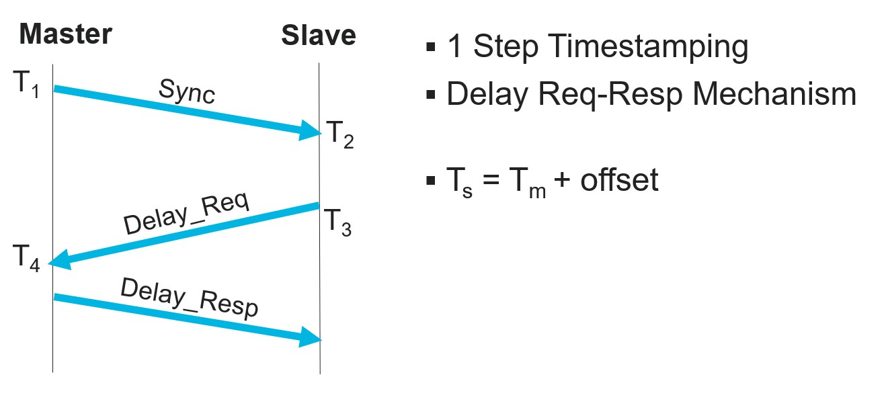
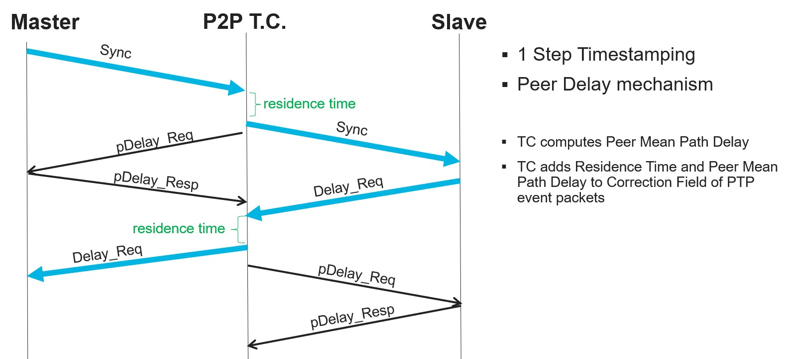

# SAI PTP enhancement
-------------------------------------------------------------------------------
 Title       | SAI PTP Enhancement
-------------|-----------------------------------------------------------------
 Authors     | Archisman Maitra, Sree Shankar S, Ravindranath C K, Rajesh Perumal R (Marvell)
 Status      | In review
 Type        | Standards track
 Created     | 2025-09-11
 SAI-Version | 1.18
-------------------------------------------------------------------------------


## 1.0  Introduction

This proposal enhances the current PTP support in SAI.

## 2.0  Overview

### 2.1 Clocks managed by SAI

PTP enabled devices are organized into a master−slave synchronization hierarchy with the clock at the top of the hierarchy (the grandmaster clock) determining the reference time for the entire system. SAI can configure timestamp mode (one-step/two-step) per port/switch with abstracted clock source. As part of PTP protocol, the slave computes the offset from the master. Today, this offset correction/frequency adjustment is not done via SAI. New SAI attributes are provided to program local clock (e.g. on-chip oscillator driving a PTP Hardware Clock (PHC) within the ASIC) of a PTP slave device when the clock is managed by SAI.

**1. PTP Time Offset Adjustment**: This provides the functionality to apply time offset between master and slave device (PTP device is configured as non transparent clock) and should be applied in the slave device.

**2. PTP Syntonization Adjustment**: This provides the functionality to apply frequency rate adjustments for slave clocks to match the master clock frequency (PTP device is configured as non transparent clock) preventing drift over time. This should be applied in the slave device.

### 2.2 Peer-to-Peer transparent clock support

Today SAI lacks support for Peer-to-Peer transparent clock.

**1. PTP Peer Mean Path Delay**: This attribute allows application to configure one-way link propagation delay (in nanoseconds) from a port. The device uses this attribute value to adjust correction field in PTP event messages (e.g., Sync messages) to account for peer delay along with residence time.

**2: Hostif Trap for PTP Peer Delay Messages**: This trap facilitates handling of Pdelay messages independent of other PTP messages. Non-Pdelay PTP messages should be forwarded, while Pdelay messages should terminate at the Peer-to-Peer Transparent Clock.

## 3.0 SAI Spec Enhancement

**New attributes defined for setting ptp time offset and ptp syntonize adjust**

saiswitch.h
```c
typedef enum _sai_switch_attr_t
{
    /**
     * @brief Time correction offset from epoch applied by NOS on system
     *        clock to sync with master clock
     *
     * @type sai_timespec_t
     * @flags CREATE_AND_SET
     * @default 0
     */
    SAI_SWITCH_ATTR_PTP_TIME_OFFSET,

    /**
     * @brief Used by NOS to program the delta value that needs to be
     *        added to existing clock frequency.
     *        Unit is Parts Per Trillion
     *
     * @type sai_int32_t
     * @flags CREATE_AND_SET
     * @default 0
     */
    SAI_SWITCH_ATTR_PTP_SYNTONIZE_ADJUST,
} sai_switch_attr_t;
```
**New attribute defined for setting ptp peer mean path delay**

saiport.h
```c
typedef enum _sai_port_attr_t
{
    /**
     * @brief One-way (From port to neighbor) link propagation delay in nanoseconds
     *
     * Device adds this value to PTP header correction-field along with residence time
     * in Peer Delay Mechanism in Peer-to-Peer TC.
     *
     * @type sai_uint32_t
     * @flags CREATE_AND_SET
     * @default 0
     */
    SAI_PORT_ATTR_PTP_PEER_MEAN_PATH_DELAY
} sai_port_attr_t;
```
**New attribute defined for trapping ptp peerdelay packets**

saihostif.h
```c
typedef enum _sai_hostif_trap_type_t
{
    /**
     * @brief Peer Delay PTP traffic.
     * ((EtherType == 0x88F7 or UDP dst port == 319 or UDP dst port == 320)
     * and (PTP messageType == 0x2 or PTP messageType == 0x3 or PTP messageType == 0x10))
     * (default packet action is drop)
     */
    SAI_HOSTIF_TRAP_TYPE_PTP_PEER_DELAY = 0x00000015
} sai_hostif_trap_type_t;
```

## 4.0 API Workflow and Example

### 4.1 PTP Time Offset and Syntonization Adjustment


The diagram above shows PTP control message exchanges (one step timestamping) between a master and slave device using the delay request-response mechanism. After the control messages are exchanged, slave NOS can compute the clock offset from master and configure SAI_SWITCH_ATTR_PTP_TIME_OFFSET to synchronize the slave device clock with master.

Example:-
A time offset adjustment of 5 seconds and 80,000 nanoseconds is applied in the slave PTP device.

```c
    attr_count = 0;
    attr_list[attr_count].id                        = SAI_SWITCH_ATTR_PTP_TIME_OFFSET;
    attr_list[attr_count].value.timespec.tv_sec     = 5;
    attr_list[attr_count++].value.timespec.tv_nsec  = 80000;
    sai_set_switch_attribute_fn(switch_id, attr_list);
```
The slave clock may tick at a different rate than the master, resulting in time drift. Slave NOS can compute the frequency factor to align with the frequency of master clock and configure SAI_SWITCH_ATTR_PTP_SYNTONIZE_ADJUST to syntonize the slave clock with master.

Example:-
A syntonization adjustment of 5000 parts per trillion is applied in the slave PTP device.

```c
    attr_count = 0;
    attr_list[attr_count].id                = SAI_SWITCH_ATTR_PTP_SYNTONIZE_ADJUST;
    attr_list[attr_count++].value.value.s32 = 5000;
    sai_set_switch_attribute_fn(switch_id, attr_list);
```

### 4.3 PTP Peer Mean Path Delay



The diagram above illustrates the exchange of PTP control messages (using one-step timestamping) between a master and a slave device, with a Peer-to-Peer Transparent Clock (P2PTC) acting as an intermediary. This setup uses the peer delay mechanism. The P2PTC NOS calculates the peer mean path delay for each port by exchanging peer delay messages with its immediate neighbor. Once computed, this delay is configured on the port using the SAI_PORT_ATTR_PTP_PEER_MEAN_PATH_DELAY attribute.

Subsequently, the NPU adds both the configured peer mean path delay and the residence time to the correction field of the PTP header for event messages (such as Sync and Delay_Req) that are forwarded through the port.

Example:-
PTP peer mean path delay of 14000 nsec is applied to the port for PTP device configured as peer to peer transparent clock. For all PTP event messages received on this port, this peer mean path delay will be added along with the residence time in the correction field of the PTP header.

```c
    attr_count = 0;
    attr_list[attr_count].id          = SAI_PORT_ATTR_PTP_PEER_MEAN_PATH_DELAY;
    attr_list[attr_count++].value.u32 = 14000;
    sai_set_port_attribute_fn(port_id, attr_list);
```

### 4.4 Hostif Trap for PTP Peer Delay Messages

For Peer-to-peer transparent clock, peer delay PTP packets are terminated at the device and non-peer delay PTP packets are forwarded. The P2PTC NOS should configure SAI_HOSTIF_TRAP_TYPE_PTP_PEER_DELAY with the action set to TRAP with higher priority than SAI_HOSTIF_TRAP_TYPE_PTP with the action set as FORWARD to facilitate this behavior.

```c
    ...
    attr_list[attr_count].id          = SAI_HOSTIF_TRAP_ATTR_PACKET_ACTION;
    attr_list[attr_count++].value.u32 = SAI_PACKET_ACTION_FORWARD; // Action for non-pdelay PTP pkts in P2P TC

    attr_list[attr_count].id          = SAI_HOSTIF_TRAP_ATTR_TRAP_TYPE;
    attr_list[attr_count++].value.u32 = SAI_HOSTIF_TRAP_TYPE_PTP;

    attr_list[attr_count].id          = SAI_HOSTIF_TRAP_ATTR_TRAP_PRIORITY;
    attr_list[attr_count++].value.u32 = 1; // Lower priority for non-pdelay PTP packets

    sai_create_hostif_trap_fn(&ptp_trap_id, switch_id, attr_count, attr_list);

    ...
    attr_list[attr_count].id          = SAI_HOSTIF_TRAP_ATTR_PACKET_ACTION;
    attr_list[attr_count++].value.u32 = SAI_PACKET_ACTION_TRAP; // Action for pdelay PTP pkts in P2P TC

    attr_list[attr_count].id          = SAI_HOSTIF_TRAP_ATTR_TRAP_TYPE;
    attr_list[attr_count++].value.u32 = SAI_HOSTIF_TRAP_TYPE_PTP_PEER_DELAY;

    attr_list[attr_count].id          = SAI_HOSTIF_TRAP_ATTR_TRAP_PRIORITY;
    attr_list[attr_count++].value.u32 = 2; // Higher priority for pdelay PTP packets

    sai_create_hostif_trap_fn(&ptp_peer_trap_id, switch_id, attr_count, attr_list);
```

## 5.0 References
IEEE 1588-2008 Standard for a Precision Clock Synchronization Protocol for Networked Measurement and Control Systems

## 6.0 Warmboot Implications
None

