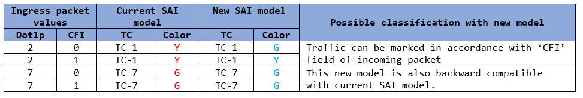
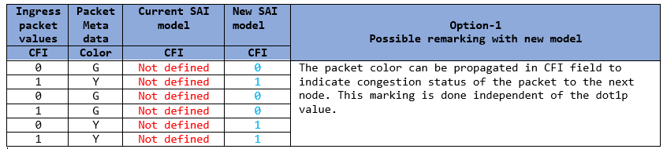
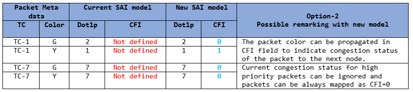

# Color aware Classification and Remarking
-------------------------------------------------------------------------------
 Title       | SAI Support for Color aware Classification and Remarking
-------------|-----------------------------------------------------------------
 Authors     | Anandhi Dhanabalan, Marvell 
 Status      | In review
 Type        | Standards track
 Created     | 2024-Jun-03 - Initial Draft
 SAI-Version | 1.15 
-------------------------------------------------------------------------------

&nbsp;
# Table of Contents
1. [Introduction](#hdr1)
2. [Motivation](#hdr2)
3. [Color Aware Classificiation](#hdr3)
4. [Color Aware Remarking](#hdr4)
5. [Existing SAI Spec Support and Enhancements Proposed](#hdr5)
    * [5.1 QOS MAP Types](#hdr5.1)
    * [5.2 QOS MAP saitypes](#hdr5.2)
    * [5.3 QOS MAP PORT Attributes ](#hdr5.3)
    * [5.4 QOS MAP SWITCH Attributes ](#hdr5.4)


&nbsp;
## 1. Introduction <a name="hdr1"></a>
SAI offers support for qosmaps, which come with a variety of QoS mapping capabilities. This specification is centered around improving the 'Dot1p' based qosmaps to incorporate packet color. 

As defined in IEEE 802.1Q, the Canonical Format Indicator (CFI), also known as the Drop Eligible Indicator (DEI), in the VLAN header identifies the drop priority of packets.
This bit may be used separately or in conjunction with dot1p, to indicate frames eligible to be dropped in the presence of congestion. When congestion occurs, the device first discards the packets with the DEI field value of 1.

**The enhancements include:**
- Categorizing incoming packets based on their Dot1p and CFI fields and assigning both TC and color to the packet (Dot1p + CFI -> TC + Color).
- Modifying packets Dot1p and CFI fields according to TC and color. (TC + Color -> Dot1p + CFI)

&nbsp;
## 2. Motivation <a name="hdr2"></a>
At the ingress, color-aware QoS mapping is essential for identifying the color assigned to incoming traffic streams by a preceding node. 
* The new model introduces the adaptability to identify the color marking of incoming packets.
* This model enables the assignment of distinct colors to packets that have the same Dot1p but different CFI. This feature facilitates the recognition of a packet’s congestion status at the preceding node in the network.
* Furthermore, the new model provides the capability to make policy decisions to disregard the color of incoming packets if they are of higher priority.

Similarly, color-aware remarking at the egress aids in conveying the packet color to the subsequent node in the network. 
* The current SAI model does not provide guidelines on how to propagate the packet color, which reflects the packet’s present congestion state, in the packet header field.
* The newly introduced model addresses this issue and additionally offers various methods to achieve this.

&nbsp;
## 3. Color Aware Classificiation <a name="hdr3"></a>

**SAI currently supports following Dot1p based map types**
* Dot1p -> TC
* Dot1p -> Color

**This propsal add following new map type**
* Dot1p + CFI -> TC + Color

Table below priovides a sample map, and compares the outcome for existing and new model for ingress classification.

**Table 1: Sample Color-aware Ingress classification**



&nbsp;
## 4. Color Aware Remarking <a name="hdr4"></a>

**SAI currently supports the following map types for TC + Color**
* TC + Color -> Dot1p
* TC + Color -> DSCP
* TC + Color -> EXP

**This propsal add the following new map types**
* Color -> CFI
* TC + Color -> Dot1p + CFI

In new SAI model, the color field is propagated in the CFI field of the packet in two different ways.

**Option-1 (Color -> CFI)**
* The first option allows, packet color to be mapped to CFI independent of Dot1p value.
* This option also permits the utilization of the current (TC + DP) maps in conjunction with the newly introduced map type (Color -> CFI).

Table below priovides a sample map, and compares the outcome for existing and new model for egress remarking for option-1.

**Table 2: Sample Color-aware Egress remarking - Option-1**



**Option-2 (TC + Color -> Dot1p + CFI)**
* The second option, allows TC and color to be mapped in a cumulative manner to Dot1p and CFI.

Table below priovides a sample map, and compares the outcome for existing and new model for egress remarking for option-2.

**Table 3: Sample Color-aware Egress remarking - Option-2**




**Other points to consider**

The present SAI is capable of setting the ‘CFI’ bit in the L2 header for BFD, TWAMP, and MIRROR sessions. When QOS remarking and ‘CFI’ marking specific to a session are both enabled simultaneously, the order of priority might differ depending on the ASIC. Therefore, this specification does not establish a defined precedence.


&nbsp;
## 5. Existing SAI Support and Enhancements Proposed <a name="hdr5"></a>

&nbsp;
### 5.1. QOS MAP Types <a name="hdr5.1"></a>
```c
typedef enum _sai_qos_map_type_t
{
    ....
    SAI_QOS_MAP_TYPE_DOT1P_TO_TC = 0x00000000, 
    SAI_QOS_MAP_TYPE_DOT1P_TO_COLOR = 0x00000001,                
    ....
    SAI_QOS_MAP_TYPE_TC_AND_COLOR_TO_DSCP = 0x00000005,         
    SAI_QOS_MAP_TYPE_TC_AND_COLOR_TO_DOT1P = 0x00000006,        
    ....

    /** QOS Map to set DOT1P and CFI to Traffic class and color */ 
    SAI_QOS_MAP_TYPE_DOT1P_AND_CFI_TO_TC_AND_COLOR = 0x0000000f,            // [NEW]
    
    /** QOS Map to set color to CFI */
    SAI_QOS_MAP_TYPE_COLOR_TO_CFI = 0x00000010,                             // [NEW]

    /** QOS Map to set traffic class and color to DOT1P and CFI */
    SAI_QOS_MAP_TYPE_TC_AND_COLOR_TO_DOT1P_AND_CFI = 0x00000011,            // [NEW]    
    ....
} sai_qos_map_type_t;
```

&nbsp;
### 5.2. QOS MAP saitypes <a name="hdr5.2"></a>

```c
/**
 * @brief Defines QOS map types.
 *
 * @par Examples:
 *
 * dot1p/DSCP/MPLS_EXP --> TC
 * dot1p/DSCP/MPLS_EXP --> Color
 * dot1p/DSCP/MPLS_EXP --> TC + Color
 * DSCP/MPLS_EXP --> FC
 * TC --> dot1p/DSCP/MPLS_EXP.
 * TC + color --> dot1p/DSCP/MPLS_EXP.
 * TC --> Egress Queue.
 * dot1p + cfi --> TC + Color       // [NEW]
 * color --> cfi                    // [NEW]
 * TC + color --> dot1p + cfi       // [NEW]
 */
typedef struct _sai_qos_map_params_t
{
    /** Traffic class */
    sai_cos_t tc;

    /** DSCP value */
    sai_uint8_t dscp;

    /** Dot1p value */
    sai_uint8_t dot1p;

    /** PFC priority value */
    sai_uint8_t prio;

    /** Priority group value */
    sai_uint8_t pg;

    /**
     * @brief Egress port queue OID is not known at the time of map creation.
     * Using queue index for maps.
     */
    sai_queue_index_t queue_index;

    /** Color of the packet */
    sai_packet_color_t color;

    /** MPLS exp value */
    sai_uint8_t mpls_exp;

    /** Forwarding class */
    sai_uint8_t fc;

    /** CFI value */
    sai_uint8_t cfi;                    // [NEW]

} sai_qos_map_params_t;

typedef struct _sai_qos_map_type_list_t
{
    /** Number of entries in the list */
    uint32_t count;

    /** Map type list */
    sai_qos_map_type_t *list;
	
} sai_qos_map_type_list_t;
 ```

&nbsp;
### 5.3. QOS MAP PORT Attributes <a name="hdr5.3"></a>
```c
/**
 * @brief Attribute Id in sai_set_port_attribute() and
 * sai_get_port_attribute() calls
 */
typedef enum _sai_port_attr_t
{
    ....
    SAI_PORT_ATTR_QOS_DOT1P_TO_TC_MAP,
    SAI_PORT_ATTR_QOS_DOT1P_TO_COLOR_MAP,
    ...
    SAI_PORT_ATTR_QOS_TC_AND_COLOR_TO_DOT1P_MAP,
    ...

    /**
     * @brief Enable DOT1P and CFI -> TC and COLOR MAP on port.
     *
     * Map id = #SAI_NULL_OBJECT_ID to disable map on port.
     * Default no map.
     *
     * @type sai_object_id_t
     * @flags CREATE_AND_SET
     * @objects SAI_OBJECT_TYPE_QOS_MAP
     * @allownull true
     * @validonly SAI_PORT_ATTR_QOS_DOT1P_TO_TC_MAP == SAI_NULL_OBJECT_ID and SAI_PORT_ATTR_QOS_DOT1P_TO_COLOR_MAP == SAI_NULL_OBJECT_ID
     * @default SAI_NULL_OBJECT_ID
     */
    SAI_PORT_ATTR_QOS_DOT1P_AND_CFI_TO_TC_AND_COLOR_MAP,       // [NEW]

    /**
     * @brief Enable COLOR -> CFI MAP on port
     *
     * Map id = #SAI_NULL_OBJECT_ID to disable map on port.
     * Default no map.
     *
     * @type sai_object_id_t
     * @flags CREATE_AND_SET
     * @objects SAI_OBJECT_TYPE_QOS_MAP
     * @allownull true
     * @validonly SAI_PORT_ATTR_QOS_TC_AND_COLOR_TO_DOT1P_AND_CFI_MAP == SAI_NULL_OBJECT_ID  
     * @default SAI_NULL_OBJECT_ID
     */
    SAI_PORT_ATTR_QOS_COLOR_TO_CFI_MAP,                         // [NEW]

    /**
     * @brief Enable TC and COLOR -> DOT1P and CFI MAP on port.
     *
     * Map id = #SAI_NULL_OBJECT_ID to disable map on port.
     * Default no map.
     *
     * @type sai_object_id_t
     * @flags CREATE_AND_SET
     * @objects SAI_OBJECT_TYPE_QOS_MAP
     * @allownull true
     * @validonly SAI_PORT_ATTR_QOS_TC_AND_COLOR_TO_DOT1P_MAP == SAI_NULL_OBJECT_ID and SAI_PORT_ATTR_QOS_COLOR_TO_CFI_MAP == SAI_NULL_OBJECT_ID
     * @default SAI_NULL_OBJECT_ID
     */
    SAI_PORT_ATTR_QOS_TC_AND_COLOR_TO_DOT1P_AND_CFI_MAP,        // [NEW]    

    /**
     * @brief QOS MAP types supported by the NPU at port level.
     *
     * @type sai_qos_map_type_list_t
     * @flags READ_ONLY
     */
    SAI_PORT_ATTR_SUPPORTED_QOS_MAP_TYPE,                       // [NEW]
    ...
} sai_port_attr_t;
 ```

&nbsp;
### 5.4. QOS MAP SWITCH Attributes <a name="hdr5.4"></a>

```c
/**
 * @brief Attribute Id in sai_set_switch_attribute() and
 * sai_get_switch_attribute() calls.
 */
typedef enum _sai_switch_attr_t
{
    ....
    /* @validonly SAI_SWITCH_ATTR_QOS_DOT1P_AND_CFI_TO_TC_AND_COLOR_MAP == SAI_NULL_OBJECT_ID */
    SAI_SWITCH_ATTR_QOS_DOT1P_TO_TC_MAP,
    /* @validonly SAI_SWITCH_ATTR_QOS_DOT1P_AND_CFI_TO_TC_AND_COLOR_MAP == SAI_NULL_OBJECT_ID */
    SAI_SWITCH_ATTR_QOS_DOT1P_TO_COLOR_MAP,
    ...
    /* @validonly SAI_SWITCH_ATTR_QOS_TC_AND_COLOR_TO_DOT1P_AND_CFI_MAP == SAI_NULL_OBJECT_ID */
    SAI_SWITCH_ATTR_QOS_TC_AND_COLOR_TO_DOT1P_MAP,
    ...

    /**
     * @brief Enable DOT1P and CFI -> TC AND COLOR MAP on switch
     *
     * Map id = #SAI_NULL_OBJECT_ID to disable map on switch.
     * Default no map
     *
     * @type sai_object_id_t
     * @flags CREATE_AND_SET
     * @objects SAI_OBJECT_TYPE_QOS_MAP
     * @allownull true
     * @validonly SAI_SWITCH_ATTR_QOS_DOT1P_TO_TC_MAP == SAI_NULL_OBJECT_ID and SAI_SWITCH_ATTR_QOS_DOT1P_TO_COLOR_MAP == SAI_NULL_OBJECT_ID
     * @default SAI_NULL_OBJECT_ID
     */
    SAI_SWITCH_ATTR_QOS_DOT1P_AND_CFI_TO_TC_AND_COLOR_MAP,          // [NEW]

    /**
     * @brief Enable COLOR -> CFI MAP on switch
     *
     * Map id = #SAI_NULL_OBJECT_ID to disable map on switch.
     * Default no map.
     *
     * @type sai_object_id_t
     * @flags CREATE_AND_SET
     * @objects SAI_OBJECT_TYPE_QOS_MAP
     * @allownull true
     * @validonly SAI_SWITCH_ATTR_QOS_TC_AND_COLOR_TO_DOT1P_AND_CFI_MAP == SAI_NULL_OBJECT_ID
     * @default SAI_NULL_OBJECT_ID
     */
    SAI_SWITCH_ATTR_QOS_COLOR_TO_CFI_MAP,                           // [NEW]    

    /**
     * @brief Enable TC and COLOR -> DOT1P and CFI MAP on switch.
     *
     * Map id = #SAI_NULL_OBJECT_ID to disable map on port.
     * Default no map.
     *
     * @type sai_object_id_t
     * @flags CREATE_AND_SET
     * @objects SAI_OBJECT_TYPE_QOS_MAP
     * @allownull true
     * @validonly SAI_SWITCH_ATTR_QOS_TC_AND_COLOR_TO_DOT1P_MAP == SAI_NULL_OBJECT_ID and SAI_SWITCH_ATTR_QOS_COLOR_TO_CFI_MAP == SAI_NULL_OBJECT_ID
     * @default SAI_NULL_OBJECT_ID
     */
    SAI_SWITCH_ATTR_QOS_TC_AND_COLOR_TO_DOT1P_AND_CFI_MAP,          // [NEW]    

    /**
     * @brief QOS MAP types supported by the NPU
     *
     * @type sai_qos_map_type_list_t
     * @flags READ_ONLY
     */
    SAI_SWITCH_ATTR_SUPPORTED_QOS_MAP_TYPE,                         // [NEW]
    ...
}sai_switch_attr_t;
 ```

