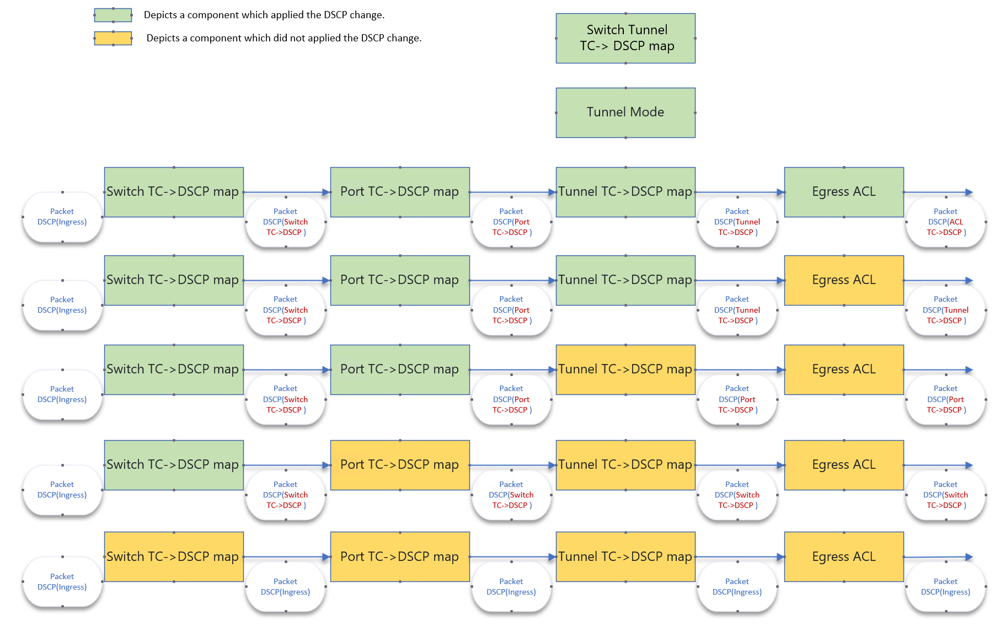

SAI Egress DSCP action behavior
-------------------------------------------------------------------------------
 Title       | SAI Egress DSCP action behavior
-------------|-----------------------------------------------------------------
 Authors     | Shahzad Iqbal, Microsoft Corp.
 Status      | In review
 Type        | Standards track
 Created     | 07/10/2024
 SAI-Version | 1.14
-------------------------------------------------------------------------------

This spec documents the behavior of various components which set DSCP value in the Egress packet pipeline.

# Overview #

There are various components with the capability to change the DSCP value of an L3 packet based on a match criteria. A clear order of precedence is needed for predictable behavior if multiple subsystems in the packet pipeline change this value.

# Scope #

This document only addresses the Egress stage of the packet pipeline. It does not specify any precedence for the ingress stage DSCP value change.
## SAI functions capable of changing DSCP. ##
There are currently 6 components in SAI which have the ability to change the DSCP value directly of a given packet. 'There are indirect ways to change the DSCP value such as ACL -> TC -> DSCP map but those fall out of the scope of this document.'

-------------------------------------------------------------------------------
 Function                             | SAI attribute 
--------------------------------------|----------------------------------------
 Switch Qos TC-COLOR -> DSCP map      | SAI_SWITCH_ATTR_QOS_TC_AND_COLOR_TO_DSCP_MAP
 Switch Tunnel TC-COLOR -> DSCP map   | SAI_SWITCH_TUNNEL_ATTR_ENCAP_QOS_TC_AND_COLOR_TO_DSCP_MAP
 Tunnel DSCP mode                     | SAI_TUNNEL_DSCP_MODE_PIPE_MODEL, SAI_TUNNEL_DSCP_MODE_UNIFORM_MODEL 
 Tunnel TC-COLOR -> DSCP mapping      | SAI_TUNNEL_ATTR_ENCAP_QOS_TC_AND_COLOR_TO_DSCP_MAP 
 Port Qos TC-COLOR -> DSCP map        | SAI_PORT_ATTR_QOS_TC_AND_COLOR_TO_DSCP_MAP,
 Egress ACL DSCP change action        | ACL SAI_ACL_ENTRY_ATTR_ACTION_SET_DSCP 
-------------------------------------------------------------------------------

Since these components operate in different positions in a  ASIC pipeline, a possibility exists that DSCP value change performed by one component may be undone by the subsequent component. 

The overall behavior can be segregated into three sections of the pipeline. Ingress, post-Ingress and Egress. This document focuses solely on the Egress section of the pipeline. 

# Model for Egress Behavior #
The DSCP value set by various components on the egress side of the ASIC pipeline shall have the following precedence in descending order. This precedence shall apply to packets in the egress pipeline and shall override any other DSCP value set by the Ingress stage.

1. Egress ACL.

2. Tunnel DSCP mapping 
    - Tunnel TC-COLOR -> DSCP mapping
    - Tunnel DSCP mode
    - Switch Tunnel TC-COLOR -> DSCP map

3. Port Qos TC-COLOR -> DSCP map

4. Switch Qos TC-COLOR -> DSCP map

## Examples of packet behavior. ##

These following is a logical diagram which shows how the DSCP value of a packet may be changed by different components. This diagram does not represent the actual layout of the pipeline.

