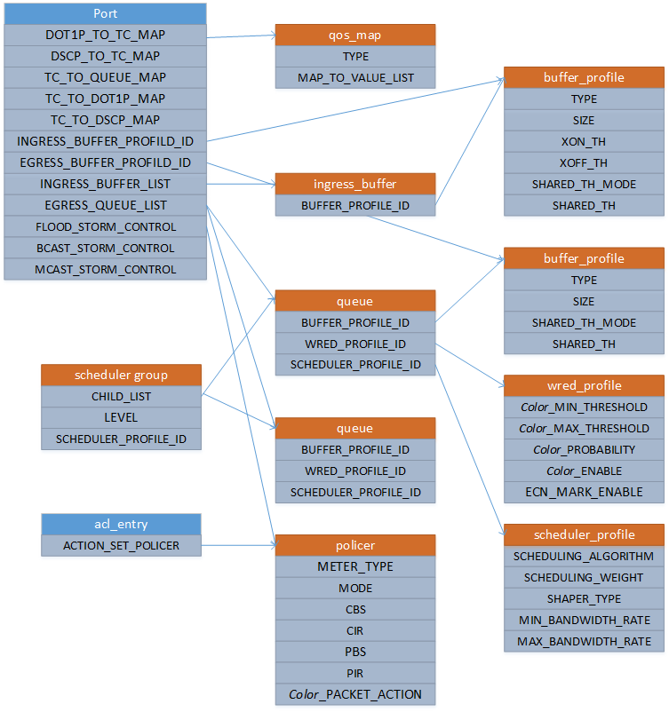

Switch Abstraction Interface Change Proposal
=====================

Title    | QoS Proposal Overview
-------- | ---
Authors  | Dell, Mellanox, Microsoft
Status   | In review
Type     | Standards track
Created  | 04/27/2015
SAI-Version | 0.9.3

----------

## Overview

This document gives an overview of other seven QoS proposals: QoS Maps, Queue, Buffer, Scheduler, Scheduler Groups, WRED and Policer. 

## QoS MAPS

There are three types of QoS Maps. The first type allows user to create QoS mapping to Traffic Class/color based on DSCP/Dot1p fields. These mappings are applied to inbound ports to classify the packets into different traffic classes/colors based on DSCP/Dot1p fields. Different traffic classes/colors can be associated with different SAI QoS objects (e.g., queues, wred) to provides differentiated services. User can also create map between traffic class to egress queue. 

* DCSP -> Traffic Class/Color
* Dot1p -> Traffic Class/Color
* Traffic Class -> egress queue
 
The second type allows user to map Traffic Class to DSCP/Dot1p, which allows user to rewrite the DSCP/Dot1p in the outgoing packets.

* Traffic Class -> DSCP
* Traffic Class -> Dot1p

The third type allows use to map incoming traffic to ingress buffer as well as set the priority field in the PFC frames.

* Traffic Class to ingress buffer: This maps incoming traffic to ingress buffer. 
* TC -> PFC priority: This mapping allows the switch to set PFC priority in xon/xoff frames in order to resume/pause corresponding egress queue at the link peer.  
* PFC priority -> egress queue: This maps the priority in the received PFC frames to a egress queue so that the switch knows which egress to resume/pause.

QOS Map APIs include: create/remove QoS Maps, set/get QoS Maps attributes, and apply map to a port.

## QUEUE

Current proposal only defines egress queue, which is mainly used for configuring egress buffer, TX packet scheduling and packet drop policy. 

The egress queue is associated with egress buffer, scheduler and WRED object. Egress buffer object provides egress buffer configuration, Scheduler provides TX scheduling configuration, and WRED provide random packet drop/marking configuration. 

Queues objects also provide related counters.
 
Queue APIs include: set/get queue attributes, get queue statistics counters.

## BUFFER

Buffer objects provides the buffer configuration. Buffer object has two types, ingress and egress buffer type.

Ingress buffer is mainly used for configuring ingress buffer to provide traffic back-pressure and support lossless Ethernet. It allows user to configure its reserved/shared size, lossless/lossy type, xon/xoff threshold, and etc.

Egress buffer allows user to configure its reserved/shared size.

Buffer APIs include: create/remove for buffer profile and set/get buffer profile attributes.

A Buffer can be applies to a queue or a port.

## SCHEDULER

Schedulers arrange and/or rearrange packets for egress queues or scheduler groups. Scheduling is the mechanism by which packets are arranged (or rearranged) between input and output of a particular queue.

The scheduler object is actually defined as a profile to control several scheduling attributes such as: scheduling algorithms (strict priority SP, DWRR), scheduling weight, shaper type, min/max bandwidth rate.

Scheduler APIs include: create/remove scheduler profiles and set/get scheduler attributes.

A Scheduler can be mapped to a queue, a scheduler group, and a port.
 
## SCHEDULER GROUPS

Scheduler groups gives us hierarchical scheduling and helps with advances and more complex ways to provide QoS for flows.
 
Scheduler group attributes include the child count (number of schedulers/queues), group ID, group level, port (it is mapped to).

Scheduler group APIs include: create/remove scheduler groups, set/get scheduler group attributes, add/remove child to group.

Scheduler group can be applied to a port.

## WRED

The Weighted Random Early Detection (WRED) defines the packet drop policy for an egress queue. It allows user to configure whether the drop type (DropTail v.s. WRED), drop policy profile such as min/max threshold and drop probability, and ECN marking.   

The WRED supports color-aware operations, i.e., allows user to define different drop profile based on the packet color.

WRED API’s include: create/remove WRED objects and set/get for WRED attributes.

A WRED object can be applied to a Queue and a port.

## POLICER

Traffic policers defines Token bucket to allow user to control the traffic rate and burst for a given traffic flow.

The policer is defined as an object with attributes such as: meter type (bytes/packets), color source (blind/aware), rates (CIR, CBS, PBS, PIR), etc.
 
Policer APIs include: create/remove Policer objects and policer counters and set/get for policer attributes and policer counter attributes.

A policer object can be applied to a port or ACL.
