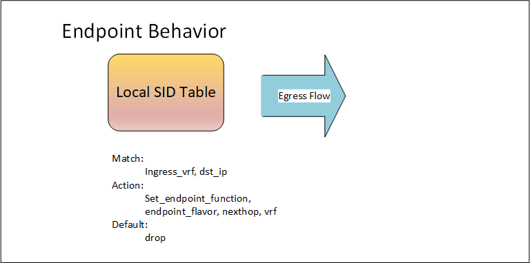
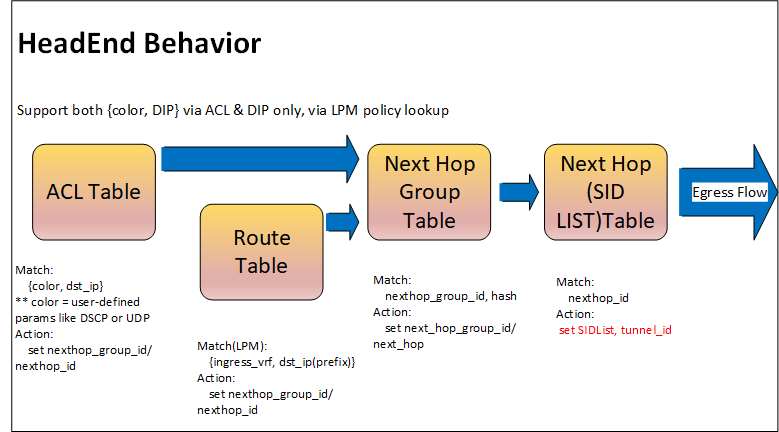

SAI IPv6 Segment Routing Update

## Overview ##

Segment Routing with IPv6(SRv6) support was added in SAI 1.2 about 4 years ago. Since then SAI
pipeline model for tunnels and MPLS fowarding has evolved and there have been several
modifications to SRv6 RFCs. This proposal will bring SRv6 APIs and attributes in-line with the
latest RFCs and SAI MPLS/tunnel pipeline model.

Note that SRv6 features and use cases continue to evolve and this proposal is focused on functions
and behaviors described in the SRv6 Network Programming RFC [
Segment Routing over IPv6 (SRv6) Network Programming]. We will submit additional
PRs in future to add support for other functions and use cases. Also, this PR doesn't explicitly address
the functionality related to Traffic Class, Hop-Limit, ECN marking and load-balancing hash calculation.
It's assumed that existing attributes for other IPv6 tunnels will apply to the SRv6 as well.

Following list of changes are being proposed:

## Behavioral Model Changes ##

### Endpoint Behavior ###
In the earlier proposal, In order to program the hardware for an Endpoint SID, first a route entry is created for the my SID and then a nexthop entry
is created to specify the endpoint behavior and parameters. This will require either the application or the operating system responsible for making the SAI
API calls to create two additional objects for every MySID entry - a route object and a nexthop object. This model is different from the programming model
used for IP tunnels and MPLS. For IP and MPLS tunnel terminations, a separate tunnel_term or Insegment object is created without a need to decompose the tunnel
termination entry into multiple SAI objects.
This proposal will follow the programming model of MPLS segment routing and IP tunnel termination by adding a MySID object for SRv6 similar to InSegment
for MPLS.


__Figure 1: Endpoint Behavior.__

### Source/Headend Behavior ###
- This proposal will remove "Endpoint" from the Nexthop table attributes and leave other attributes like SIDLIST in order to implement the Headend Behavior.


__Figure 1: Headend Behavior.__

## SAI Header changes ##

### sainexthop.h

1. sai_next_hop_endpoint_type_t and sai_nexthop_endpoint_pop_type_t is deprecated.

```
typedef enum _sai_next_hop_type_t
{
    ....
    ....

    /** IPv6 Segment Route SID List */
    SAI_NEXT_HOP_TYPE_SEGMENTROUTE_SIDLIST,

    /** IPv6 Segment Route Endpoint Function. **Deprecated and replaced by SAI_MY_SID_ENTRY_ATTR object ***/
    SAI_NEXT_HOP_TYPE_SEGMENTROUTE_ENDPOINT,
    ...

} sai_next_hop_type_t;


**
 * @brief Enum defining Endpoint Segment Pop types for End, End.X and End.T. **Deprecated
 *        and replaced by sai_my_sid_entry_endpoint_flavor_t**
 */

typedef enum _sai_next_hop_endpoint_pop_type_t
{
    /** Penultimate segment pop */
    SAI_NEXT_HOP_ENDPOINT_POP_TYPE_PSP,

    /** Ultimate Segment pop */
    SAI_NEXT_HOP_ENDPOINT_POP_TYPE_USP,

} sai_next_hop_endpoint_pop_type_t;


/**
 * @brief Attribute id for next hop
 */
typedef enum _sai_next_hop_attr_t
{
...
...

    /**
     * @brief Next hop entry Segment Route SID List
     *
     * @type sai_object_id_t
     * @flags MANDATORY_ON_CREATE | CREATE_ONLY
     * @objects SAI_OBJECT_TYPE_SEGMENTROUTE_SIDLIST
     * @condition SAI_NEXT_HOP_ATTR_TYPE == SAI_NEXT_HOP_TYPE_SEGMENTROUTE_SIDLIST
     */
    SAI_NEXT_HOP_ATTR_SEGMENTROUTE_SIDLIST_ID,

    /**
     * @brief Next hop entry Segment Route Endpoint Function. **Deprecated and replaced
     * with SAI_MY_SID_ENTRY_ATTR_ENDPOINT_TYPE.**
     *
     * @type sai_next_hop_endpoint_type_t
     * @flags MANDATORY_ON_CREATE | CREATE_AND_SET
     * @condition SAI_NEXT_HOP_ATTR_TYPE == SAI_NEXT_HOP_TYPE_SEGMENTROUTE_ENDPOINT
    ** * @deprecated true**
     */
    SAI_NEXT_HOP_ATTR_SEGMENTROUTE_ENDPOINT_TYPE,

    /**
     * @brief Next hop entry Segment Route Endpoint Pop Option. **Deprecated and replaced
     * with SAI_MY_SID_ENTRY_ATTR_ENDPOINT_FLAVOR**
     *
     * @type sai_next_hop_endpoint_pop_type_t
     * @flags MANDATORY_ON_CREATE | CREATE_AND_SET
     * @condition SAI_NEXT_HOP_ATTR_TYPE == SAI_NEXT_HOP_TYPE_SEGMENTROUTE_ENDPOINT
     *** @deprecated true**
     */
    SAI_NEXT_HOP_ATTR_SEGMENTROUTE_ENDPOINT_POP_TYPE,

...
...

} sai_next_hop_attr_t;
```

### saisegmentroute.h ###

1. Added new enums for SR Headend functionality with reduced SRH. These new behaviors reduce the length of
   SRH by excluding the first segment in the pushed IPv6 header. First segment is placed in only the DA of
   the outer IPv6 header.

```
   typedef enum _sai_segmentroute_sidlist_type_t
{
    ...

    /** Insertion of Segment Route Policy with Reduced SRH */
    SAI_SEGMENTROUTE_SIDLIST_TYPE_INSERT_RED,

    ...

    /** Encapsulation in a Segment Route Policy with Reduced SRH */
    SAI_SEGMENTROUTE_SIDLIST_TYPE_ENCAPS_RED,


} sai_segmentroute_sidlist_type_t;
```

2. Added enum sai_my_sid_entry_endpoint_type_t to provide the initial list of endpoint behaviors.

```
/**
 * @brief Enum defining Endpoint Behavior
 */
typedef enum _sai_my_sid_entry_endpoint_behavior_t
{
    /** Basic Endpoint */
    SAI_MY_SID_ENTRY_ENDPOINT_BEHAVIOR_E,

    /** End.X Endpoint with Layer-3 Cross-connect */
    SAI_MY_SID_ENTRY_ENDPOINT_BEHAVIOR_X,

    /** End.T Endpoint with specific IPv6 Table */
    SAI_MY_SID_ENTRY_ENDPOINT_BEHAVIOR_T,

    /** Endpoint with decapsulation and IPv6 Cross-connect */
    SAI_MY_SID_ENTRY_ENDPOINT_BEHAVIOR_DX6,

    /** Endpoint with decapsulation and IPv4 Cross-connect */
    SAI_MY_SID_ENTRY_ENDPOINT_BEHAVIOR_DX4,

    /** Endpoint with decapsulation and specific IPv6 table lookup */
    SAI_MY_SID_ENTRY_ENDPOINT_BEHAVIOR_DT6,

    /** Endpoint with decapsulation and specific IPv6 table lookup */
    SAI_MY_SID_ENTRY_ENDPOINT_BEHAVIOR_DT4,

    /** Endpoint with decapsulation and specific IP table lookup */
    SAI_MY_SID_ENTRY_ENDPOINT_BEHAVIOR_DT46,

    /** Endpoint Bound to a policy with Encapsulation */
    SAI_MY_SID_ENTRY_ENDPOINT_BEHAVIOR_B6_ENCAPS,

    /** End.B6.Encaps function with a reduced SRH */
    SAI_MY_SID_ENTRY_ENDPOINT_BEHAVIOR_B6_ENCAPS_RED,

    /** Endpoint Bound to a policy with Insertion */
    SAI_MY_SID_ENTRY_ENDPOINT_BEHAVIOR_B6_INSERT,

    /** End.B6.Insert function with a reduced SRH */
    SAI_MY_SID_ENTRY_ENDPOINT_BEHAVIOR_B6_INSERT_RED,

    /** Custom range base value */
    SAI_MY_SID_ENTRY_ENDPOINT_BEHAVIOR_CUSTOM_RANGE_START = 0x10000000,

    /** End of Custom range base */
    SAI_MY_SID_ENTRY_ENDPOINT_BEHAVIOR_CUSTOM_RANGE_END

} sai_my_sid_entry_endpoint_behavior_t;

```
3. Added enum sai_my_sid_entry_endpoint_flavor_t to list all the combinations of endpoint flavors
   as defined in RFC-8986

```
/**
 * @brief Enum defining Endpoint Behavior flavors for End, End.X and End.T functions
 */
typedef enum _sai_my_sid_entry_endpoint_behavior_flavor_t
{
    /** None */
    SAI_MY_SID_ENTRY_ENDPOINT_BEHAVIOR_FLAVOR_NONE,

    /** Penultimate segment pop */
    SAI_MY_SID_ENTRY_ENDPOINT_BEHAVIOR_FLAVOR_PSP,

    /** Ultimate Segment pop */
    SAI_MY_SID_ENTRY_ENDPOINT_BEHAVIOR_FLAVOR_USP,

    /** Ultimate Segment decapsulation */
    SAI_MY_SID_ENTRY_ENDPOINT_BEHAVIOR_FLAVOR_USD,

    /** PSP and USP */
    SAI_MY_SID_ENTRY_ENDPOINT_BEHAVIOR_FLAVOR_PSP_AND_USP,

    /** USD and USP */
    SAI_MY_SID_ENTRY_ENDPOINT_BEHAVIOR_FLAVOR_USD_AND_USP,

    /** PSP and USD */
    SAI_MY_SID_ENTRY_ENDPOINT_BEHAVIOR_FLAVOR_PSP_AND_USD,

    /** PSP, USP and USD */
    SAI_MY_SID_ENTRY_ENDPOINT_BEHAVIOR_FLAVOR_PSP_AND_USP_AND_USD

} sai_my_sid_entry_endpoint_behavior_flavor_t;

```

4. Added a new object sai_my_sid_entry_t configure Endpoint behavior.

```
/**
 * @brief Attribute list for My SID
 */
typedef enum _sai_my_sid_entry_attr_t
{
    /**
     * @brief Start of attributes
     */
    SAI_MY_SID_ENTRY_ATTR_START,

    /**
     * @brief Endpoint Function
     *
     * @type sai_my_sid_entry_endpoint_behavior_t
     * @flags MANDATORY_ON_CREATE | CREATE_AND_SET
     */
    SAI_MY_SID_ENTRY_ATTR_ENDPOINT_BEHAVIOR = SAI_MY_SID_ENTRY_ATTR_START,

    /**
     * @brief Flavor for End, End.X and End.T functions
     *
     * @type sai_my_sid_entry_endpoint_behavior_flavor_t
     * @flags CREATE_AND_SET
     * @default SAI_MY_SID_ENTRY_ENDPOINT_BEHAVIOR_FLAVOR_NONE
     * @validonly SAI_MY_SID_ENTRY_ATTR_ENDPOINT_BEHAVIOR == SAI_MY_SID_ENTRY_ENDPOINT_BEHAVIOR_E or SAI_MY_SID_ENTRY_ATTR_ENDPOINT_BEHAVIOR == SAI_MY_SID_ENTRY_ENDPOINT_BEHAVIOR_X or SAI_MY_SID_ENTRY_ATTR_ENDPOINT_BEHAVIOR == SAI_MY_SID_ENTRY_ENDPOINT_BEHAVIOR_T
     */
    SAI_MY_SID_ENTRY_ATTR_ENDPOINT_BEHAVIOR_FLAVOR,

    /**
     * @brief Packet action
     *
     * @type sai_packet_action_t
     * @flags CREATE_AND_SET
     * @default SAI_PACKET_ACTION_FORWARD
     */
    SAI_MY_SID_ENTRY_ATTR_PACKET_ACTION,

    /**
     * @brief Packet priority for trap/log actions
     *
     * @type sai_uint8_t
     * @flags CREATE_AND_SET
     * @default 0
     */
    SAI_MY_SID_ENTRY_ATTR_TRAP_PRIORITY,

    /**
     * @brief Next hop for cross-connect functions
     *
     * @type sai_object_id_t
     * @flags CREATE_AND_SET
     * @objects SAI_OBJECT_TYPE_NEXT_HOP, SAI_OBJECT_TYPE_NEXT_HOP_GROUP, SAI_OBJECT_TYPE_ROUTER_INTERFACE
     * @allownull true
     * @default SAI_NULL_OBJECT_ID
     * @validonly SAI_MY_SID_ENTRY_ATTR_ENDPOINT_BEHAVIOR == SAI_MY_SID_ENTRY_ENDPOINT_BEHAVIOR_X or SAI_MY_SID_ENTRY_ATTR_ENDPOINT_BEHAVIOR == SAI_MY_SID_ENTRY_ENDPOINT_BEHAVIOR_DX4 or SAI_MY_SID_ENTRY_ATTR_ENDPOINT_BEHAVIOR == SAI_MY_SID_ENTRY_ENDPOINT_BEHAVIOR_DX6 or SAI_MY_SID_ENTRY_ATTR_ENDPOINT_BEHAVIOR == SAI_MY_SID_ENTRY_ENDPOINT_BEHAVIOR_B6_ENCAPS or SAI_MY_SID_ENTRY_ATTR_ENDPOINT_BEHAVIOR == SAI_MY_SID_ENTRY_ENDPOINT_BEHAVIOR_B6_ENCAPS_RED or SAI_MY_SID_ENTRY_ATTR_ENDPOINT_BEHAVIOR == SAI_MY_SID_ENTRY_ENDPOINT_BEHAVIOR_B6_INSERT or SAI_MY_SID_ENTRY_ATTR_ENDPOINT_BEHAVIOR == SAI_MY_SID_ENTRY_ENDPOINT_BEHAVIOR_B6_INSERT_RED
     */
    SAI_MY_SID_ENTRY_ATTR_NEXT_HOP_ID,

    /**
     * @brief Tunnel id for decapsulation
     *
     * @type sai_object_id_t
     * @flags CREATE_AND_SET
     * @objects SAI_OBJECT_TYPE_TUNNEL
     * @allownull true
     * @default SAI_NULL_OBJECT_ID
     * @validonly SAI_MY_SID_ENTRY_ATTR_ENDPOINT_BEHAVIOR == SAI_MY_SID_ENTRY_ENDPOINT_BEHAVIOR_DT4 or SAI_MY_SID_ENTRY_ATTR_ENDPOINT_BEHAVIOR == SAI_MY_SID_ENTRY_ENDPOINT_BEHAVIOR_DT6 or SAI_MY_SID_ENTRY_ATTR_ENDPOINT_BEHAVIOR == SAI_MY_SID_ENTRY_ENDPOINT_BEHAVIOR_DT46
     */
    SAI_MY_SID_ENTRY_ATTR_TUNNEL_ID,

    /**
     * @brief VRF for decapsulation and specific table lookup functions
     *
     * @type sai_object_id_t
     * @flags CREATE_AND_SET
     * @objects SAI_OBJECT_TYPE_VIRTUAL_ROUTER
     * @allownull true
     * @default SAI_NULL_OBJECT_ID
     * @validonly SAI_MY_SID_ENTRY_ATTR_ENDPOINT_BEHAVIOR == SAI_MY_SID_ENTRY_ENDPOINT_BEHAVIOR_T or SAI_MY_SID_ENTRY_ATTR_ENDPOINT_BEHAVIOR == SAI_MY_SID_ENTRY_ENDPOINT_BEHAVIOR_DT4 or SAI_MY_SID_ENTRY_ATTR_ENDPOINT_BEHAVIOR == SAI_MY_SID_ENTRY_ENDPOINT_BEHAVIOR_DT6 or SAI_MY_SID_ENTRY_ATTR_ENDPOINT_BEHAVIOR == SAI_MY_SID_ENTRY_ENDPOINT_BEHAVIOR_DT46
     */
    SAI_MY_SID_ENTRY_ATTR_VRF,

    /**
     * @brief Attach a counter
     *
     * When it is empty, then packet hits won't be counted
     *
     * @type sai_object_id_t
     * @flags CREATE_AND_SET
     * @objects SAI_OBJECT_TYPE_COUNTER
     * @allownull true
     * @default SAI_NULL_OBJECT_ID
     */
    SAI_MY_SID_ENTRY_ATTR_COUNTER_ID,

    /**
     * @brief End of attributes
     */
    SAI_MY_SID_ENTRY_ATTR_END,

    /** Custom range base value */
    SAI_MY_SID_ENTRY_ATTR_CUSTOM_RANGE_START = 0x10000000,

    /** End of custom range base */
    SAI_MY_SID_ENTRY_ATTR_CUSTOM_RANGE_END

} sai_my_sid_entry_attr_t;

/**
 * @brief My SID Entry
 */
typedef struct _sai_my_sid_entry_t
{
    /**
     * @brief Switch ID
     *
     * @objects SAI_OBJECT_TYPE_SWITCH
     */
    sai_object_id_t switch_id;

    /**
     * @brief Virtual Router ID
     *
     * @objects SAI_OBJECT_TYPE_VIRTUAL_ROUTER
     */
    sai_object_id_t vr_id;

    /**
     * @brief Length of the Locator Block part of the SID
     */
    sai_uint8_t locator_block_len;

    /**
     * @brief Length of the Locator Node part of the SID
     */
    sai_uint8_t locator_node_len;

    /**
     * @brief Length of the Function part of the SID
     */
    sai_uint8_t function_len;

    /**
     * @brief Length of the Args part of the SID
     */
    sai_uint8_t args_len;

    /**
     * @brief IPv6 prefix for My SID
     */
    sai_ip6_t sid;

} sai_my_sid_entry_t;

```

5. Added apis to create/remove and set/get attributes for my_sid_entry

    - add_my_sid_entry
    - remove_my_sid_entry
    - set_my_sid_entry_attribute
    - get_my_sid_entry_attribute
    - create_my_sid_entries
    - remove_my_sid_entries
    - set_my_sid_entries_attribute
    - get_my_sid_entries_attribute


## Examples ##
- SR Headend
    Example configuration for H.Encaps.Red behavior

        1. Create a SID list object with 3 segments

            sidlist_entry_attrs[0].id = SAI_SEGMENTROUTE_SIDLIST_ATTR_TYPE
            sidlist_entry_attrs01].value.s32 = SAI_SEGMENTROUTE_SIDLIST_TYPE_ENCAPS_RED
            sidlist_entry_attrs[1].id = SAI_SEGMENTROUTE_SIDLIST_ATTR_SEGMENT_LIST
            sidlist_entry_attrs[1].value.objlist.count = 3;
            CONVERT_STR_TO_IPV6(sidlist_entry_attrs[1].value.objlist.list[0], "2001:db8:85a3::8a2e:370:7334");
            CONVERT_STR_TO_IPV6(sidlist_entry_attrs[1].value.objlist.list[1], "2001:db8:85a3::8a2e:370:2345");
            CONVERT_STR_TO_IPV6(sidlist_entry_attrs[1].value.objlist.list[2], "2001:db8:85a3::8a2e:370:3456");
            saistatus = sai_srv6_api->create_segmentroute_sidlist(&sidlist_id, switch_id, 2, sidlist_entry_attrs);

        2. Create a tunnel object with source IP used for tunnel encapsulation

            tunnel_entry_attrs[0].id = SAI_TUNNEL_ATTR_TYPE
            tunnel_entry_attrs[0].value = SAI_TUNNEL_TYPE_SRV6
            tunnel_entry_attrs[1].id = SAI_TUNNEL_ATTR_ENCAP_SRC_IP
            CONVERT_STR_TO_IPV6(tunnel_entry_attrs[1].value, "2001:db8:85a3::8a2e:370:9876");
            tunnel_entry_attrs[2].id = SAI_TUNNEL_ATTR_UNDERLAY_INTERFACE
            tunnel_entry_attrs[2].value.oid = underlay_rif // created elsewhere
            saistatus = sai_tunnel_api->create_tunnel(&tunnel_id, switch_id, 3, tunnel_entry_attrs)

        3. Create a srv6 nexthop object bound to the SID list object and H.Encaps.Red behavior

            nexthop_entry_attrs[0].id = SAI_NEXTHOP_ATTR_TYPE
            nexthop_entry_attrs[0].value = SAI_NEXT_HOP_TYPE_SEGMENTROUTE_SIDLIST
            nexthop_entry_attrs[1].id = SAI_NEXTHOP_ATTR_TUNNEL_ID
            nexthop_entry_attrs[1].value.oid = tunnel_id
            nexthop_entry_attrs[2].id = SAI_NEXT_HOP_ATTR_SEGMENTROUTE_SIDLIST_ID
            nexthop_entry_attrs[2].value.oid = sidlist_id
            saistatus = sai_nexthop_api->create_nexthop(&nexthop_id, switch_id, 3, nexthop_entry_attrs)

        4. Create a route entry which points to the srv6 nexthop

            route_entry.switch_id = 0
            route_entry.vr_id = vr_id_1 // created elsewhere
            route_entry.destination.addr_family = SAI_IP_ADDR_FAMILY_IPV4
            route_entry.destination.addr.ip4 = "198.51.100.0"
            route_entry.destination.addr.mask = "255.255.255.0"

            route_entry_attrs[0].id = SAI_ROUTE_ENTRY_ATTR_NEXT_HOP_ID;
            route_entry_attrs[0].value.oid = nexthop_id;
            saisstatus = sai_route_api->create_route(&route_entry, 1, route_entry_attrs)


- SR Endpoint/Transit

        Example configuration for End.DT46 behavior

        my_sid_entry.switch_id = 0
        my_sid_entry.vr_id = vr_id_1 // underlay VRF
        my_sid_entry.locator_len = 64
        my_sid_entry.function_len = 8
        CONVERT_STR_TO_IPV6(my_sid_entry.sid, "2001:db8:0:1::1000:0:0:0");

        my_sid_attr[0].id = SAI_MY_SID_ENTRY_ATTR_ENDPOINT_TYPE
        my_sid_attr[0].value = SAI_MY_SID_ENTRY_ENDPOINT_TYPE_DT46
        my_sid_attr[1].id = SAI_MY_SID_ENTRY_ATTR_VRF
        my_sid_attr[1].value.oid = vr_id_1001 // overlay vrf, created elsewhere
        saistatus = sai_srv6_api->create_my_sid(&my_sid_entry, 2, my_sid_attr)


## References ##
1. [IPv6 Segment Routing Header (SRH)](https://tools.ietf.org/html/rfc8754)
2. [Segment Routing over IPv6 (SRv6) Network Programming](https://tools.ietf.org/html/rfc8986)
3. [Segment Routing Policy Architecture](https://tools.ietf.org/html/draft-ietf-spring-segment-routing-policy-11)
4. [Segment Routing Architecture](https://datatracker.ietf.org/doc/html/rfc8402)
5. [SRv6 NET-PGM extension: Insertion](https://datatracker.ietf.org/doc/html/draft-filsfils-spring-srv6-net-pgm-insertion-04)
6. [Network Programming extension: SRv6 uSID instruction](https://datatracker.ietf.org/doc/html/draft-filsfils-spring-net-pgm-extension-srv6-usid-10)