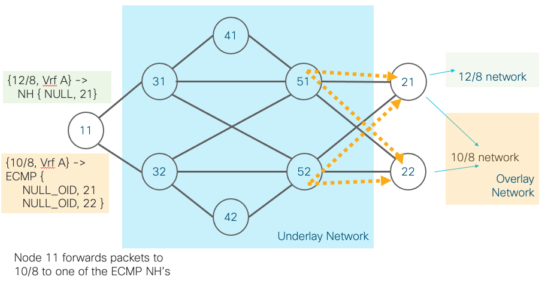
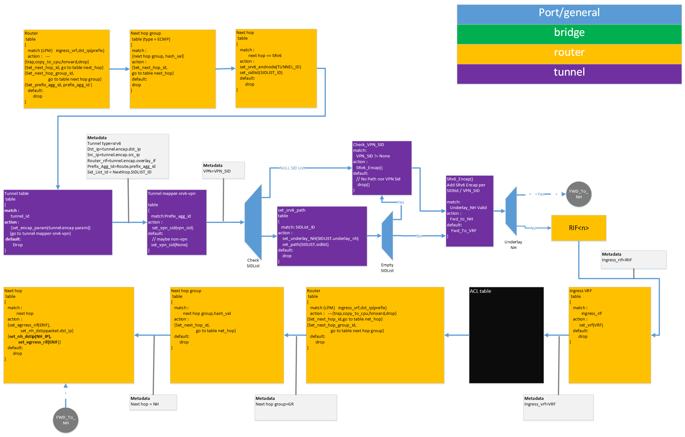
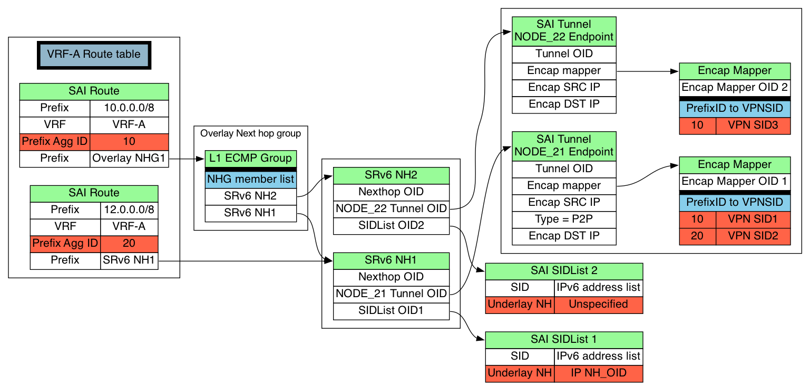

# SAI IPv6 Segment Routing VPN update

## Overview

Segment Routing with IPv6(SRv6) update in Jun 23, 2021 brought in changes that keeps SRv6 APIs inline with MPLS.
This update required SAI to be invoked with a single SIDList for SRv6 Next hop creation.

In a VPN application, the ingress node first identifies a flow to a given
policy. To direct the packet, the ingress node then determines the end node,
the VPN SID (a.k.a Overlay SID) to use and optionally the appropriate path in
the underlay network to use.

The packet after the SR encapsulation combines both an underlay SID List as
well as an overlay SID (that is used to build the VPN service). It is common to
keep these two items disaggregated, as the underlay SID list is shared by many
different flows; whereas the overlay SID is only used by the packets belong to
that VPN service. This helps to scale the hardware, as those two objects are
stored in different databases with different scale. Typically the number of VPN
services is much higher.

The egress node upon receiving the packet identifies the service (VRF) using the destination IP which is the VPN SID (a.k.a overlay SID).


### SRv6 / SAI Terminology
* SAI SID List object represents a path
* SRv6 SAI Tunnel object represents end node

SR Policy is represented by combination of <color, end node>. One or more paths could be created per color.
Therefore a SR Policy is realized by combination of SAI SID List and SAI Tunnel objects.

## SRv6 VPN Enhancements

Following changes are defined in this spec.
1. Disaggregation of VPN SID from underlay SID List by use of tunnel map.
2. Selection of underlay nexthop to use for a given SID list
3. L3VPN only solution, without the need to use SID List.
4. Allow prefix based derivation of VPN SID.
5. Ability for multiple prefixes to same destination but different VPN SID to share same NH/NHG using Prefix aggregation id.
6. Statistics collection on SID List

## SRv6 VPN requirement


__Figure 1: SRv6 VPN Topology.__

In the above topology, Node 11 and Node 21/22 act in a Provider Edge (PE) Role.
Overlay customer traffic is classified into a VRF and sent to a remote over the
underlay core network. A policy is a combination of both color and end node.
The end node on a specific policy can be reached via multiple underlay Segment
Lists (SL) or tunnels. 

There are 2 policies above, Orange and Green.

Remote network 10.0.0.0/8 on VRF A can be reached via two policies:

```
Policy 1 - NODE21, Orange
Policy 2 - NODE22, Orange
```

End node Node 21 and Node 22 are both reachable through two path's, SL1 and SL2.

```
Segment List SL1 - [31, 41, 51]
Segment List SL2 - [32, 42, 52]
```

NOS would need to create hierarchical ECMP groups For the Policy.

Level 1 - ECMP of Endpoints - NODE21, NODE22.<br>
Level 2 - ECMP of Paths - SL1 and SL2.

NOS would flatten the above 2 list into 4 paths as below.
1. NODE21, SL1
2. NODE21, SL2
3. NODE22, SL1
4. NODE22, SL2

Remote network 12/8 on VRF A can be reached via policy 3.
```
Policy 3 - NODE21, Green
```
In this case, the NOS needs only needs to create a SID List(SL3) and create NH with End node 21.

### VPN SID
A VPN SID is added to the SID list to the tenant or VRF. The VPN SID value is
generated by the end node and propagated through IGP/EGP (such as BGP) or via
CLI/management tools by a controller.

When traffic to 10/8 network is transported using the above sidlist, the VPN Sid value would be different for NODE21 and NODE22.

Traffic to NODE21, SL1 would have below header.

```
   Outer IPv6 DA: FD00:201:31:41:51::
   SRH Header:
           FD00:201:XXX:FFF1:A/80 (VPN_SID_NODE21,ORANGE)
```

### Underlay NH selection
SAI IP tunnels specify the underlay VRF table to use to forward the encapsulated packet.
The lookup in the underlay VRF table should result in a next hop to which the encapsulated
packet is forwarded. The same behavior is used in SRv6 encapsulation as well.

In some deployment scenarios (typically brownfield deployment), it is desirable to direct the SRv6 encapsulated traffic to a specific next hop in underlay.

SAI API must provide a way for the NOS/Controller to program the SRv6 aware underlay next hop to use.

### No duplication of SID Lists and SRv6 NHs for every VPN
In current SAI SRv6 specification, the SRv6 NHs are configured using SRv6 Tunnel OID and a SID List OID.
When multiple VPN SID's exist behind an end node, NOS would need to create
several SID Lists, one per VPN SID. SID Lists with VPN SID would be {<v6
address SID List>, VPN SID}. As a result, the number of SRv6 SID Lists (and
NH's) required to support all endpoints with the VPN SID would be **# VPN
SID's** * **underlay SRv6 paths**

Also any change in underlay SRv6 path would require NOS to update **VPN SID's** * SRv6 SID Lists.

### Statistics per policy
Allow statistics collection per SID List (per path). This allows SONiC/NOS to collect statistics per policy.

### L3VPN only

L3VPN only use case is when SRv6 is used to provide SRv6 L3VPN solution while
the underlay forwarding protocol are segregated, and hence the PE would not
impose the entire SRv6 path. This allows deployment of SRv6 solution as the
network is being upgraded to be SRv6 aware.


__Figure 1: SRv6 L3VPN Topology.__

Traffic to 12/8 network/VPN NODE21, would have below header.

```
   Outer IPv6 DA: FD00:201:XXX:FFF1:A/80 (VPN_SID_NODE21,ORANGE)
```

## SAI SRv6 Pipeline

__Figure 1: SRv6 pipeline__

## SAI Changes

### Prefix Aggregation ID
Prefix Aggregation ID is a number that identifies a target on the overlay
network, such as a VPN service. The route can be associated to a single SRv6
Next Hop (Endpoint) or a Next hop group of SRv6 NH's for the VPN. Prefix
Aggregation Id allows SAI to derive VPN SID per SRv6 Endpoint (SRv6 Tunnel)
when muliple SRv6 Endpoints are part of the VPN service.

The tunnel map entry table is programmed with the prefix aggregation id to VPN SID mapping.

### NULL SIDList / SIDList with empty list
L3VPN solution is achieved by allowing SIDLIST OID to be NULL or creating a SIDLIST OID with empty sidlist array.
SIDList with empty sidlist array could be used for cases where the encapsulated packets need to be directed to a specific underlay NH.

### Tunnel
Every SRv6 End node is represented by a SAI P2P Tunnel entry. All the VPN SIDs on this end node are specified using a tunnel map.

### Tunnel Map
Tunnel Map entry table contains mapping of Prefix aggregation ID to VPN SID of the remote end node.

### SAI Object relationship

The diagram below shows the objects and relationship. The diagram only shows relevant fields in the different tables.

NOTE: Below object types have been combined to keep the diagram simple.
* Next hop group and member list
* Tunnel map and Tunnel map entry table

New objects are highlighed in RED.


__Figure 1: SRv6 VPN Encap model.__


### SRv6 VPN Programming steps using Tunnel maps
- Create SAI tunnel for end node.
- Create a tunnel map per end node. A tunnel map entry can be used to map Prefix aggregation id (or VRF) to a VPN SID.
- Create a SAI Tunnel object for each end node (21,22 in above diagram). Attach the relevant tunnel map to it.
- Create underlay SID lists, similiar to existing capabilities. SID Lists are shared between all the VPN traffic that use same policy.
- Create SRv6 NH's, associating the underlay sidlists and the tunnel object.


#### Prefix Aggregation ID to a VPN SID

```
    Tunnel map type = SAI_TUNNEL_MAP_TYPE_PREFIX_AGG_ID_TO_SRV6_VPN_SID
    Tunnel map entries = Database of mappings of prefix aggregation id to VPN SID  

    { SAI_TUNNEL_MAP_ENTRY_ATTR_PREFIX_AGG_ID_KEY : SAI_TUNNEL_MAP_ENTRY_ATTR_SRV6_VPN_SID_VALUE }  
```        

## New SAI objects and attributes

### SAI Route  (sairoute.h)

Prefix Aggregation ID identifies a policy at the remote peer.

#### SAI_ROUTE_ENTRY_ATTR_PREFIX_AGG_ID

```c

typedef enum _sai_route_entry_attr_t
{
    // ...
    // <snip>
    // ...

    /**
     * @brief Prefix Aggregation ID
     *
     * Prefix Aggregation ID identifies specific policy at the remote target.
     * Used in IPv6 Segment Routing VPN forwarding.
     *
     * @type sai_uint32_t
     * @flags CREATE_AND_SET
     * @default 0
     */
    SAI_ROUTE_ENTRY_ATTR_PREFIX_AGG_ID,

} sai_route_entry_attr_t;

```


### SAI Tunnel (saitunnel.h)

Two new types of tunnel map's.
- Virtual Router ID (VRF) to VPN SID
- Prefix Aggregation ID to VPN SID

#### SID List tunnel map type

```c
typedef enum _sai_tunnel_map_type_t
{
    // ...
    // <snip>
    // ...

    /** TUNNEL Map Virtual Router ID to SRv6 VPN SID */
    SAI_TUNNEL_MAP_TYPE_VIRTUAL_ROUTER_ID_TO_VPN_SID = 0x0000000c,

    /** TUNNEL Map Prefix Aggregation ID to SRv6 VPN SID */
    SAI_TUNNEL_MAP_TYPE_PREFIX_AGG_ID_TO_SRV6_VPN_SID = 0x0000000d,

    /** Custom range base value */
    SAI_TUNNEL_MAP_TYPE_CUSTOM_RANGE_BASE = 0x10000000

} sai_tunnel_map_type_t;
```

#### SID List tunnel map entry attribute 

```c
typedef enum _sai_tunnel_map_entry_attr_t
{
    // ...
    // <snip>
    // ...

    /**
     * @brief IP Prefix key
     *
     * @type sai_uint32_t
     * @flags MANDATORY_ON_CREATE | CREATE_ONLY
     * @condition SAI_TUNNEL_MAP_ENTRY_ATTR_TUNNEL_MAP_TYPE == SAI_TUNNEL_MAP_TYPE_PREFIX_AGG_ID_TO_SRV6_VPN_SID
     */
    SAI_TUNNEL_MAP_ENTRY_ATTR_PREFIX_AGG_ID_KEY = 0x00000010,

    /**
     * @brief SRv6 SID List ID value for VPN
     *
     * @type sai_object_id_t
     * @flags MANDATORY_ON_CREATE | CREATE_ONLY
     * @condition SAI_TUNNEL_MAP_ENTRY_ATTR_TUNNEL_MAP_TYPE == SAI_TUNNEL_MAP_TYPE_PREFIX_AGG_ID_TO_SRV6_VPN_SID or SAI_TUNNEL_MAP_ENTRY_ATTR_TUNNEL_MAP_TYPE == SAI_TUNNEL_MAP_TYPE_VIRTUAL_ROUTER_ID_TO_VPN_SID
     */
    SAI_TUNNEL_MAP_ENTRY_ATTR_SRV6_VPN_SID_VALUE = 0x00000011,

    // ...
    // <snip>
    // ...
} sai_tunnel_map_entry_attr_t;

```
### SAI SRv6 (saisrv6.h)

#### SID List Underlay Next Hop

```c
typedef enum _sai_srv6_sidlist_attr_t
{
    // <...>

    /**
     * @brief Underlay Next hop to forward packets to this SID List
     *
     * @type sai_object_id_t
     * @flags CREATE_AND_SET
     * @objects SAI_OBJECT_TYPE_NEXT_HOP 
     * @allownull true
     * @default SAI_NULL_OBJECT_ID
     */
    SAI_SRV6_SIDLIST_ATTR_NEXT_HOP_ID,

    // <...>

} sai_srv6_sidlist_attr_t;
```


#### SID List Statistics IDs

```c
/**
 * @brief SRv6 Sidlist counter IDs
 */
typedef enum _sai_srv6_sidlist_stat_t
{
    /** Egress packet stat count */
    SAI_SRV6_SIDLIST_STAT_OUT_PACKETS,

    /** Egress byte stat count */
    SAI_SRV6_SIDLIST_STAT_OUT_OCTETS,
} sai_srv6_sidlist_stat_t;
```

#### SID List Statistics API's
```c
/**
 * @brief Get SRv6 Sidlist statistics counters. Deprecated for backward compatibility.
 *
 * @param[in] srv6_sidlist_id SRv6 Sidlist id
 * @param[in] number_of_counters Number of counters in the array
 * @param[in] counter_ids Specifies the array of counter ids
 * @param[out] counters Array of resulting counter values.
 *
 * @return #SAI_STATUS_SUCCESS on success, failure status code on error
 */
typedef sai_status_t (*sai_get_srv6_sidlist_stats_fn)(
        _In_ sai_object_id_t srv6_sidlist_id,
        _In_ uint32_t number_of_counters,
        _In_ const sai_stat_id_t *counter_ids,
        _Out_ uint64_t *counters);

/**
 * @brief Get SRv6 Sidlist statistics counters extended.
 *
 * @param[in] srv6_sidlist_id SRv6 Sidlist id
 * @param[in] number_of_counters Number of counters in the array
 * @param[in] counter_ids Specifies the array of counter ids
 * @param[in] mode Statistics mode
 * @param[out] counters Array of resulting counter values.
 *
 * @return #SAI_STATUS_SUCCESS on success, failure status code on error
 */
typedef sai_status_t (*sai_get_srv6_sidlist_stats_ext_fn)(
        _In_ sai_object_id_t srv6_sidlist_id,
        _In_ uint32_t number_of_counters,
        _In_ const sai_stat_id_t *counter_ids,
        _In_ sai_stats_mode_t mode,
        _Out_ uint64_t *counters);

/**
 * @brief Clear SRv6 Sidlist statistics counters.
 *
 * @param[in] srv6_sidlist_id SRv6 Sidlist id
 * @param[in] number_of_counters Number of counters in the array
 * @param[in] counter_ids Specifies the array of counter ids
 *
 * @return #SAI_STATUS_SUCCESS on success, failure status code on error
 */
typedef sai_status_t (*sai_clear_srv6_sidlist_stats_fn)(
        _In_ sai_object_id_t srv6_sidlist_id,
        _In_ uint32_t number_of_counters,
        _In_ const sai_stat_id_t *counter_ids);
```

#### SRv6 methods table

```c
typedef struct _sai_srv6_api_t
{
    // <...>

    sai_get_srv6_sidlist_stats_fn          get_srv6_sidlist_stats;
    sai_get_srv6_sidlist_stats_ext_fn      get_srv6_sidlist_stats_ext;
    sai_clear_srv6_sidlist_stats_fn        clear_srv6_sidlist_stats;

    // <...>

} sai_srv6_api_t;
```

## SRv6 VPN configuration programming sample 

Programming with SRv6 VPN encap matching IP Prefix and VRF criteria

1. Create tunnel with appropriate tunnel map type
   - When the remote end is discovered.
2. Create tunnel map entries
   - When overlay route and VPN SIDs are discovered
3. Create SRv6 NH's (and NH groups)
   - When the underlay path to remote endpoint is discovered
4. Create overlay route with SRv6 NH
   - When overlay routes need to be installed.


```c

    // Node 11: fd00:201:a11::1
    // Node 21: fd00:201:b21::1
    // Create VPN to 10.0.0.0/8 on NODE21
    //    Underlay paths to NODE21:
    //           [31, 41, 51] = FD00:0201:31:E041:51::
    //           [32, 42, 52] = FD00:0201:32:E042:52::
    //    Setup weighted ECMP with the above 2 paths
    //    VPN Configuration
    //         VPN Sid: FD00:0201:b:FFF0:1234::

    // 1. Following are already assumed to be setup.
    //  - Underlay RIF (loopback or whatever)
    //  - Underlay VRF and overlay VRF
    //  - IGP routes to reach 31 with required nexthops/next hop groups

    //////// 2. New remote endpoint discovered [NODE21]
    //    Create a P2P Tunnel with SAI_TUNNEL_MAP_TYPE_PREFIX_AGG_ID_TO_SRV6_VPN_SID or SAI_TUNNEL_MAP_TYPE_VIRTUAL_ROUTER_ID_TO_VPN_SID type tunnel maps.

    // 2.1 Create a tunnel map
    tunnel_map_attrs[0].id = SAI_TUNNEL_MAP_ATTR_TYPE;
    tunnel_map_attrs[0].value = SAI_TUNNEL_MAP_TYPE_PREFIX_AGG_ID_TO_SRV6_VPN_SID;
    saistatus = sai_tunnel_api->create_tunnel_map(&node21_srv6_tunnel_encap_map, switch_id, 1, tunnel_map_attrs);

    // 2.2 Create a SRv6 tunnel object for NODE21
    tunnel_entry_attrs[0].id = SAI_TUNNEL_ATTR_TYPE;
    tunnel_entry_attrs[0].value = SAI_TUNNEL_TYPE_SRV6;
    tunnel_entry_attrs[1].id = SAI_TUNNEL_ATTR_ENCAP_SRC_IP;
    CONVERT_STR_TO_IPV6(tunnel_entry_attrs[1].value, "fd00:201:a11::1");    // SIP
    tunnel_entry_attrs[2].id = SAI_TUNNEL_ATTR_UNDERLAY_INTERFACE;          // Underlay
    tunnel_entry_attrs[2].value.oid = underlay_rif;
    tunnel_entry_attrs[3].id = SAI_TUNNEL_ATTR_ENCAP_MAPPERS;               // Encap mapper
    tunnel_entry_attrs[3].value.objlist.count = 1;
    tunnel_entry_attrs[3].value.objlist.list[0] = node21_srv6_tunnel_encap_map;
    tunnel_entry_attrs[4].id = SAI_TUNNEL_ATTR_PEER_MODE;                   // P2P mode
    tunnel_entry_attrs[4].value = SAI_TUNNEL_PEER_MODE_P2P;
    tunnel_entry_attrs[5].id = SAI_TUNNEL_ATTR_ENCAP_DST_IP;                // Node 22
    CONVERT_STR_TO_IPV6(tunnel_entry_attrs[5].value, "fd00:201:b11::1");
    saistatus = sai_tunnel_api->create_tunnel(&node_21_tunnel_id, switch_id, 6, tunnel_entry_attrs);

    //////// 3. Setup Underlay tunnel to remote endpoint.
    // Here there are 2 paths (sidlist_1 and sidlist_2) to NODE21.
    // This is being setup as an ECMP with different weights

    // 3.1 Create a Underlay SID list object (sidlist1), NODE21-SL1
    sidlist_entry_attrs[0].id = SAI_SRV6_SIDLIST_ATTR_TYPE;
    sidlist_entry_attrs[0].value.s32 = SAI_SRV6_SIDLIST_TYPE_ENCAPS_RED;
    sidlist_entry_attrs[1].id = SAI_SRV6_SIDLIST_ATTR_SEGMENT_LIST;
    sidlist_entry_attrs[1].value.objlist.count = 1;
    CONVERT_STR_TO_IPV6(sidlist_entry_attrs[1].value.objlist.list[0], "FD00:0201:31:E041:51:");
    saistatus = sai_srv6_api->create_srv6_sidlist(&sidlist_1, switch_id, 2, sidlist_entry_attrs);

    // 3.2 Create a SRV6 nexthop object bound to the SID list object, NODE21_TNL_1
    nexthop_entry_attrs[0].id = SAI_NEXTHOP_ATTR_TYPE;
    nexthop_entry_attrs[0].value = SAI_NEXT_HOP_TYPE_SRV6_SIDLIST;
    nexthop_entry_attrs[1].id = SAI_NEXTHOP_ATTR_TUNNEL_ID;
    nexthop_entry_attrs[1].value.oid = node_21_tunnel_id;
    nexthop_entry_attrs[2].id = SAI_NEXT_HOP_ATTR_SRV6_SIDLIST_ID;
    nexthop_entry_attrs[2].value.oid = sidlist_1;
    saistatus = sai_nexthop_api->create_next_hop(&srv6_nh_1, switch_id, 3, nexthop_entry_attrs);

    // Repeat same steps to create srv6_nh_2, NODE21-SL2
    // 3.1 Create a Underlay SID list object (sidlist2)
    sidlist_entry_attrs[0].id = SAI_SRV6_SIDLIST_ATTR_TYPE;
    sidlist_entry_attrs[0].value.s32 = SAI_SRV6_SIDLIST_TYPE_ENCAPS_RED;
    sidlist_entry_attrs[1].id = SAI_SRV6_SIDLIST_ATTR_SEGMENT_LIST;
    sidlist_entry_attrs[1].value.objlist.count = 1;
    CONVERT_STR_TO_IPV6(sidlist_entry_attrs[1].value.objlist.list[0], "FD00:0201:32:E042:52:");
    saistatus = sai_srv6_api->create_srv6_sidlist(&sidlist_2, switch_id, 2, sidlist_entry_attrs);

    // 3.2 Create a SRV6 nexthop object bound to the SID list object, NODE21_TNL_2
    nexthop_entry_attrs[0].id = SAI_NEXTHOP_ATTR_TYPE;
    nexthop_entry_attrs[0].value = SAI_NEXT_HOP_TYPE_SRV6_SIDLIST;
    nexthop_entry_attrs[1].id = SAI_NEXTHOP_ATTR_TUNNEL_ID;
    nexthop_entry_attrs[1].value.oid = node_21_tunnel_id;
    nexthop_entry_attrs[2].id = SAI_NEXT_HOP_ATTR_SRV6_SIDLIST_ID;
    nexthop_entry_attrs[2].value.oid = sidlist_2;
    saistatus = sai_nexthop_api->create_next_hop(&srv6_nh_2, switch_id, 3, nexthop_entry_attrs);

    // 3.3 Create a ecmp group for multiple paths.. End Point ECMP Group -- NODE21-SL1 and NODE21-SL2
    //   NOTE: This is still default level (0) as it doesn't use another ECMP group as member.
    nexthop_group_attrs[0].id = SAI_NEXT_HOP_GROUP_ATTR_TYPE;
    nexthop_group_attrs[0].value.u32 = SAI_NEXT_HOP_GROUP_TYPE_ECMP;
    saistatus = sai_nexthop_group_api->create_next_hop_group(&srv6_nh_grp, switch_id, 1, nexthop_group_attrs);

    // 3.3.1 Create member with weight 3
    nexthop_group_mbr_attrs[0].id = SAI_NEXT_HOP_GROUP_MEMBER_ATTR_NEXT_HOP_GROUP_ID;
    nexthop_group_mbr_attrs[0].value = srv6_nh_grp;
    nexthop_group_mbr_attrs[1].id = SAI_NEXT_HOP_GROUP_MEMBER_ATTR_NEXT_HOP_ID;
    nexthop_group_mbr_attrs[1].value = srv6_nh_1;
    nexthop_group_mbr_attrs[2].id = SAI_NEXT_HOP_GROUP_MEMBER_ATTR_WEIGHT;
    nexthop_group_mbr_attrs[2].value = 3;
    saistatus = sai_nexthop_group_api->create_next_hop_group_member(&node21_nh_grp_mbr1, switch_id, 3, nexthop_group_mbr_attrs);

    // 3.3.2 Create member with weight 1
    nexthop_group_mbr_attrs[0].id = SAI_NEXT_HOP_GROUP_MEMBER_ATTR_NEXT_HOP_GROUP_ID;
    nexthop_group_mbr_attrs[0].value = srv6_nh_grp;
    nexthop_group_mbr_attrs[1].id = SAI_NEXT_HOP_GROUP_MEMBER_ATTR_NEXT_HOP_ID;
    nexthop_group_mbr_attrs[1].value = srv6_nh_2;
    nexthop_group_mbr_attrs[2].id = SAI_NEXT_HOP_GROUP_MEMBER_ATTR_WEIGHT;
    nexthop_group_mbr_attrs[2].value = 1;
    saistatus = sai_nexthop_group_api->create_next_hop_group_member(&node21_nh_grp_mbr2, switch_id, 3, nexthop_group_mbr_attrs);

    // (Omitted) Create additional NHG members to NODE22 via NODE22_TNL_1 and NODE22_TNL_2 to srv6_nh_grp

    /////// 5. VPN SID with for a prefix discovered
    // Create a new tunnel map entry for this SID.

    // 5.1 Create a overlay VRF [overlay_vrf] (if it wasn't created already)
    //         Adding ports to VRF omitted here.
    saistatus = sai_virtual_router_api->create_virtual_router(&overlay_vrf, switch_id, 0, virtual_router_attrs);

    // 5.2 Create a VPN SID list object (vpn_sidlist_id) -- VPN-SID-1
    sidlist_entry_attrs[0].id = SAI_SRV6_SIDLIST_ATTR_TYPE;
    sidlist_entry_attrs[0].value.s32 = SAI_SRV6_SIDLIST_TYPE_ENCAPS_RED;
    sidlist_entry_attrs[1].id = SAI_SRV6_SIDLIST_ATTR_SEGMENT_LIST;
    sidlist_entry_attrs[1].value.objlist.count = 1;
    CONVERT_STR_TO_IPV6(sidlist_entry_attrs[1].value.objlist.list[0], "FD00:0201:A20:FFF0:1234::");
    saistatus = sai_srv6_api->create_srv6_sidlist(&vpn_sidlist_id, switch_id, 2, sidlist_entry_attrs);

    // 5.3 Create a tunnel map entry with prefix aggregation id to SRV6 vpn_sidlist_id (Prefix-Agg-ID-1 : VPN_SID_1)
    prefix_agg_id = 1;

    tunnel_map_entry_attrs[0].id = SAI_TUNNEL_MAP_ENTRY_ATTR_TUNNEL_MAP_TYPE;
    tunnel_map_entry_attrs[0].value.u32 = SAI_TUNNEL_MAP_TYPE_PREFIX_AGG_ID_TO_SRV6_VPN_SID;
    tunnel_map_entry_attrs[1].id = SAI_TUNNEL_MAP_ENTRY_ATTR_TUNNEL_MAP;
    tunnel_map_entry_attrs[1].value.oid = node21_srv6_tunnel_encap_map;
    tunnel_map_entry_attrs[2].id = SAI_TUNNEL_MAP_ENTRY_ATTR_PREFIX_AGG_ID_KEY;
    tunnel_map_entry_attrs[2].value.u32 = prefix_agg_id;  // Prefix Aggregation ID
    tunnel_map_entry_attrs[3].id = SAI_TUNNEL_MAP_ENTRY_ATTR_SRV6_VPN_SID_VALUE;
    tunnel_map_entry_attrs[3].value.oid = vpn_sidlist_id;
    saistatus = sai_tunnel_api->create_tunnel_map_entry(&srv6_tunnel_map_entry, switch_id, 4, tunnel_map_entry_attrs);

    // 6. Finally create (or update existing) overlay route entry using the nexthop
    route_entry.switch_id = 0;
    route_entry.vr_id = overlay_vrf;
    route_entry.destination.addr_family = SAI_IP_ADDR_FAMILY_IPV4;
    route_entry.destination.addr.ip4 = "10.0.0.0";  // {10.0.0.0/8 }
    route_entry.destination.addr.mask = "255.0.0.0";
    route_entry_attrs[0].id = SAI_ROUTE_ENTRY_ATTR_NEXT_HOP_ID;
    route_entry_attrs[0].value.oid = srv6_nh_grp;
    route_entry_attrs[1].id = SAI_ROUTE_ENTRY_ATTR_PREFIX_AGG_ID;
    route_entry_attrs[1].value.u32 = prefix_agg_id;
    saistatus = sai_route_api->create_route(&route_entry, 2, route_entry_attrs);

```
## SRv6 VPN SID-list only example

To address cases where there is no explicit SRv6 path to the remote endpoint,
following programming example can be used.

The method follows similar steps as above, except that the underlay NH created
has a NULL object id for SID-list.

```c

    // Create SRv6 VPN encap to 10.0.0.0/8 on NODE21
    //    Underlay paths to NODE21:
    //       Discovered via routing protocol and updated separately
    //    VPN Configuration
    //         VPN Sid: FD00:0201:A20:FFF0:1234::

    // 1. Following are already assumed to be setup.
    //  - Underlay RIF (loopback or whatever)
    //  - Underlay VRF and overlay VRF
    //  - IGP Route/NH to VPN Sid in underlay

    ////// 2. Create SRv6 tunnel
    // 2.1 Create a tunnel map
    tunnel_map_attrs[0].id = SAI_TUNNEL_MAP_ATTR_TYPE;
    tunnel_map_attrs[0].value = SAI_TUNNEL_MAP_TYPE_PREFIX_AGG_ID_TO_SRV6_VPN_SID;
    saistatus = sai_tunnel_api->create_tunnel_map(&srv6_tunnel_encap_map, switch_id, 1, tunnel_map_attrs);

    // 2.2 Create a P2P tunnel object to NODE21 with source IP used for SRv6 tunnels
    tunnel_entry_attrs[0].id = SAI_TUNNEL_ATTR_TYPE;
    tunnel_entry_attrs[0].value = SAI_TUNNEL_TYPE_SRV6;
    tunnel_entry_attrs[1].id = SAI_TUNNEL_ATTR_ENCAP_SRC_IP;
    CONVERT_STR_TO_IPV6(tunnel_entry_attrs[1].value, "2001:db8:85a3::8a2e:370:9876");
    tunnel_entry_attrs[2].id = SAI_TUNNEL_ATTR_UNDERLAY_INTERFACE;
    tunnel_entry_attrs[2].value.oid = underlay_rif;
    tunnel_entry_attrs[3].id = SAI_TUNNEL_ATTR_ENCAP_MAPPERS;
    tunnel_entry_attrs[3].value.objlist.count = 1;
    tunnel_entry_attrs[3].value.objlist.list[0] = srv6_tunnel_encap_map;
    tunnel_entry_attrs[4].id = SAI_TUNNEL_ATTR_PEER_MODE;
    tunnel_entry_attrs[4].value = SAI_TUNNEL_PEER_MODE_P2P;
    tunnel_entry_attrs[5].id = SAI_TUNNEL_ATTR_ENCAP_DST_IP;
    CONVERT_STR_TO_IPV6(tunnel_entry_attrs[5].value, "2001:db8:85a3::8aff:1111:21");
    saistatus = sai_tunnel_api->create_tunnel(&srv6_tunnel_id, switch_id, 6, tunnel_entry_attrs);

    ////// 3. Create Underlay SRv6 NH with null sidlist, NODE21 NH
    // 3.1 Create a SRV6 nexthop object bound to the SID list object and H.Encaps.Red behavior
    nexthop_entry_attrs[0].id = SAI_NEXTHOP_ATTR_TYPE;
    nexthop_entry_attrs[0].value = SAI_NEXT_HOP_TYPE_SRV6_SIDLIST;
    nexthop_entry_attrs[1].id = SAI_NEXTHOP_ATTR_TUNNEL_ID;
    nexthop_entry_attrs[1].value.oid = srv6_tunnel_id;
    nexthop_entry_attrs[2].id = SAI_NEXT_HOP_ATTR_SRV6_SIDLIST_ID;
    nexthop_entry_attrs[2].value.oid = SAI_NULL_OBJECT_ID; // NULL SID-list
    saistatus = sai_nexthop_api->create_next_hop(&srv6_nh, switch_id, 3, nexthop_entry_attrs);

    // 3.2 Create a ecmp group for multiple paths to reach VPN SID-list, End point ECMP 
    nexthop_group_attrs[0].id = SAI_NEXT_HOP_GROUP_ATTR_TYPE;
    nexthop_group_attrs[0].value.u32 = SAI_NEXT_HOP_GROUP_TYPE_ECMP;
    saistatus = sai_nexthop_group_api->create_next_hop_group(&srv6_nh_grp, switch_id, 1, nexthop_group_attrs);

    // 3.2.1 Create member with weight 1
    nexthop_group_mbr_attrs[0].id = SAI_NEXT_HOP_GROUP_MEMBER_ATTR_NEXT_HOP_GROUP_ID;
    nexthop_group_mbr_attrs[0].value = srv6_nh_grp;
    nexthop_group_mbr_attrs[1].id = SAI_NEXT_HOP_GROUP_MEMBER_ATTR_NEXT_HOP_ID;
    nexthop_group_mbr_attrs[1].value = srv6_nh;
    nexthop_group_mbr_attrs[2].id = SAI_NEXT_HOP_GROUP_MEMBER_ATTR_WEIGHT;
    nexthop_group_mbr_attrs[2].value = 1;
    saistatus = sai_nexthop_group_api->create_next_hop_group_member(&node21_nh_grp_mbr1, switch_id, 3, nexthop_group_mbr_attrs);

    // (Omitted) Create additional NHG members to NODE22 to srv6_nh_grp

    /////// 4. VPN SID with for a prefix discovered
    // Create a new tunnel map entry for this SID.

    // 4.1 Create a overlay VRF [overlay_vrf] (if it wasn't created already)
    //         Adding ports to VRF omitted here.
    saistatus = sai_virtual_router_api->create_virtual_router(&overlay_vrf, switch_id, 0, virtual_router_attrs);

    // 4.2 Create a VPN SID list object (vpn_sidlist_id) -- VPN-SID-1
    sidlist_entry_attrs[0].id = SAI_SRV6_SIDLIST_ATTR_TYPE;
    sidlist_entry_attrs[0].value.s32 = SAI_SRV6_SIDLIST_TYPE_ENCAPS_RED;
    sidlist_entry_attrs[1].id = SAI_SRV6_SIDLIST_ATTR_SEGMENT_LIST;
    sidlist_entry_attrs[1].value.objlist.count = 1;
    CONVERT_STR_TO_IPV6(sidlist_entry_attrs[1].value.objlist.list[0], "FD00:0201:A20:FFF0:1234::");
    saistatus = sai_srv6_api->create_srv6_sidlist(&vpn_sidlist_id, switch_id, 2, sidlist_entry_attrs);

    // 4.3 Create a tunnel map entry with prefix aggregation id to SRV6 vpn_sidlist_id (Prefix-Agg-ID-1 : VPN_SID_1)
    prefix_agg_id = 10;

    tunnel_map_entry_attrs[0].id = SAI_TUNNEL_MAP_ENTRY_ATTR_TUNNEL_MAP_TYPE;
    tunnel_map_entry_attrs[0].value.u32 = SAI_TUNNEL_MAP_TYPE_PREFIX_AGG_ID_TO_SRV6_VPN_SID;
    tunnel_map_entry_attrs[1].id = SAI_TUNNEL_MAP_ENTRY_ATTR_TUNNEL_MAP;
    tunnel_map_entry_attrs[1].value = srv6_tunnel_encap_map;
    tunnel_map_entry_attrs[2].id = SAI_TUNNEL_MAP_ENTRY_ATTR_PREFIX_AGG_ID_KEY;
    tunnel_map_entry_attrs[2].value.u32 = prefix_agg_id;
    tunnel_map_entry_attrs[3].id = SAI_TUNNEL_MAP_ENTRY_ATTR_SRV6_VPN_SID_VALUE;
    tunnel_map_entry_attrs[3].value = vpn_sidlist_id;
    saistatus = sai_tunnel_api->create_tunnel_map_entry(&srv6_tunnel_map_entry, switch_id, 4, tunnel_map_entry_attrs);

    ////// 5. Create (or update existing) a overlay route entry using the nexthop
    route_entry.switch_id = 0;
    route_entry.vr_id = overlay_vrf;
    route_entry.destination.addr_family = SAI_IP_ADDR_FAMILY_IPV4;
    route_entry.destination.addr.ip4 = "10.0.0.0"
    route_entry.destination.addr.mask = "255.0.0.0";
    route_entry_attrs[0].id = SAI_ROUTE_ENTRY_ATTR_NEXT_HOP_ID;
    route_entry_attrs[0].value.oid = srv6_nh_grp;
    route_entry_attrs[1].id = SAI_ROUTE_ENTRY_ATTR_PREFIX_AGG_ID;
    route_entry_attrs[1].value.u32 = prefix_agg_id;
    saistatus = sai_route_api->create_route(&route_entry, 2, route_entry_attrs);
```

## SRv6 SID Marking Feature

This section describes the SID Marking feature for SRv6 VPN, which enables VPN SIDs to carry QoS and policy information derived from packet classification. Two new tunnel map types support SID Marking by allowing VPN SID selection based on forwarding class (which is mapped from DSCP via QoS Maps or ACL classification) and hierarchical policy lookup.

### SAI_TUNNEL_MAP_TYPE_FORWARDING_CLASS_TO_SRV6_VPN_SID - SID Marking

#### Overview

The `SAI_TUNNEL_MAP_TYPE_FORWARDING_CLASS_TO_SRV6_VPN_SID` tunnel map type implements the core SID Marking capability. It enables VPN SIDs to be "marked" with QoS information by selecting different VPN SIDs based on forwarding class. The forwarding class is derived from packet DSCP values through QoS Map classification or ACL-based classification, allowing the ingress node to encode traffic priority directly into the VPN SID itself. This marked VPN SID then carries the QoS information end-to-end through the SRv6 network.

#### API Attributes

**Tunnel Map Type:**
```c
SAI_TUNNEL_MAP_TYPE_FORWARDING_CLASS_TO_SRV6_VPN_SID = 0x0000000f
```

**Tunnel Map Entry Attributes:**
```c
// Key: Forwarding Class
SAI_TUNNEL_MAP_ENTRY_ATTR_FORWARDING_CLASS_KEY = 0x00000013
// Type: sai_uint32_t
// Flags: MANDATORY_ON_CREATE | CREATE_ONLY

// Value: SRv6 VPN SID
SAI_TUNNEL_MAP_ENTRY_ATTR_SRV6_VPN_SID_VALUE = 0x00000011
// Type: sai_ip6_t
// Flags: MANDATORY_ON_CREATE | CREATE_ONLY
```

### SAI_TUNNEL_MAP_TYPE_PREFIX_AGG_ID_TO_TUNNEL_MAP_ID - Hierarchical SID Marking

#### Overview

The `SAI_TUNNEL_MAP_TYPE_PREFIX_AGG_ID_TO_TUNNEL_MAP_ID` tunnel map type enables hierarchical, two-level lookup for VPN SID selection. This indirection allows combining the prefix-based derivation with the forwarding-class-based SID Marking.

#### API Attributes

**Tunnel Map Type:**
```c
SAI_TUNNEL_MAP_TYPE_PREFIX_AGG_ID_TO_TUNNEL_MAP_ID = 0x0000000e
```

**Tunnel Map Entry Attributes:**
```c
// Key: Prefix Aggregation ID
SAI_TUNNEL_MAP_ENTRY_ATTR_PREFIX_AGG_ID_KEY = 0x00000010
// Type: sai_uint32_t
// Flags: MANDATORY_ON_CREATE | CREATE_ONLY

// Value: Tunnel Map Object ID
SAI_TUNNEL_MAP_ENTRY_ATTR_TUNNEL_MAP_ID_VALUE = 0x00000012
// Type: sai_object_id_t
// Flags: MANDATORY_ON_CREATE | CREATE_ONLY
// Objects: SAI_OBJECT_TYPE_TUNNEL_MAP
```

## References
1. [IPv6 Segment Routing Header (SRH)](https://tools.ietf.org/html/rfc8754)
2. [Segment Routing over IPv6 (SRv6) Network Programming](https://tools.ietf.org/html/rfc8986)
3. [Segment Routing Policy Architecture](https://tools.ietf.org/html/draft-ietf-spring-segment-routing-policy-11)
4. [Segment Routing Architecture](https://datatracker.ietf.org/doc/html/rfc8402)
5. [SRv6 NET-PGM extension: Insertion](https://datatracker.ietf.org/doc/html/draft-filsfils-spring-srv6-net-pgm-insertion-04)
6. [Network Programming extension: SRv6 uSID instruction](https://datatracker.ietf.org/doc/html/draft-filsfils-spring-net-pgm-extension-srv6-usid-10)

