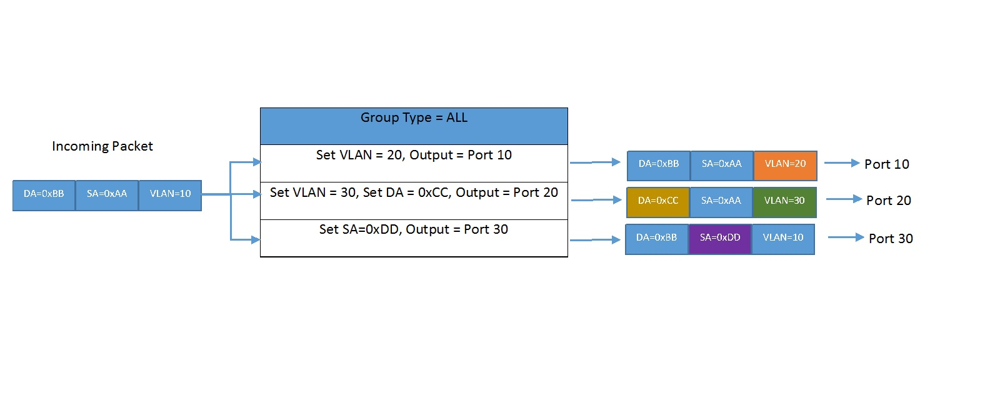
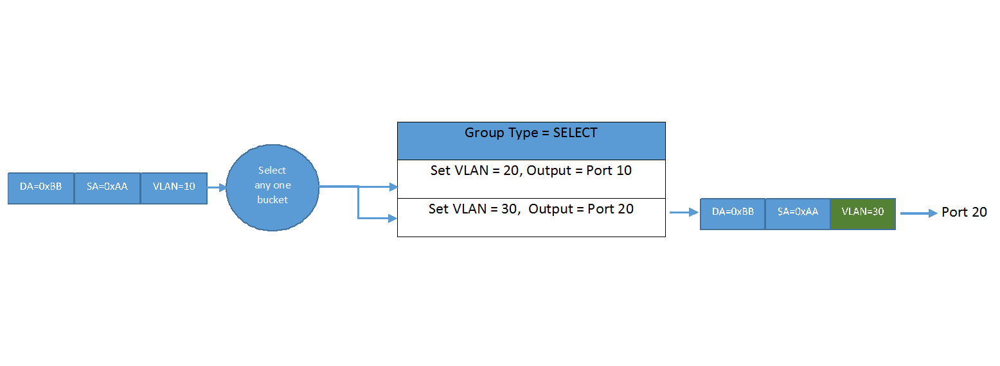
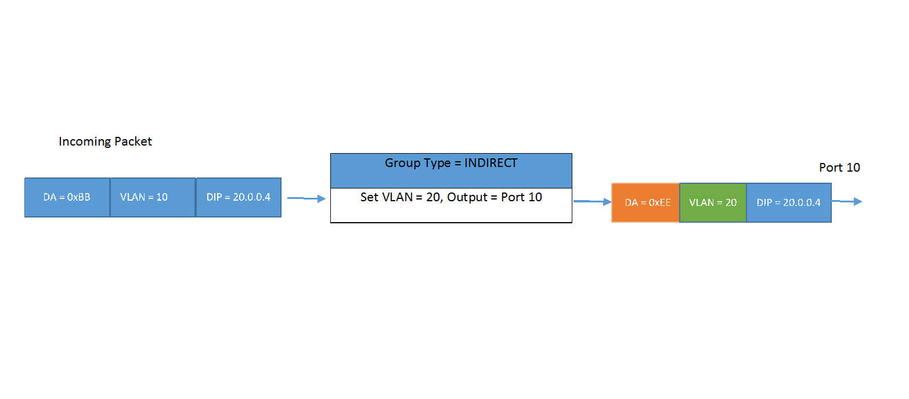
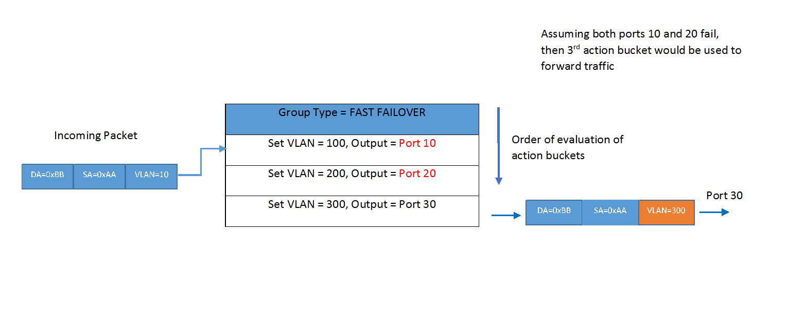
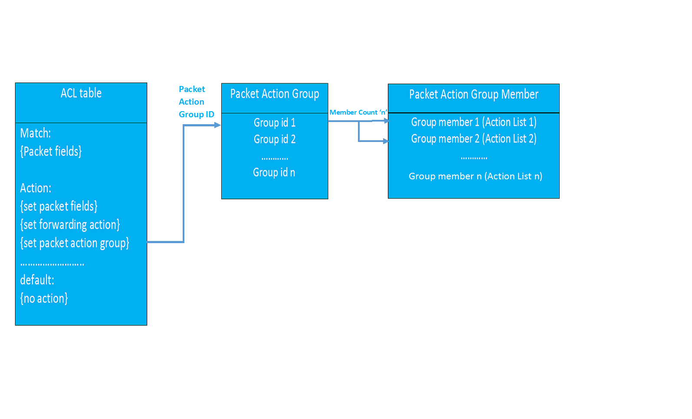

# SAI Packet Action Groups

Title       | Packet Action Groups Proposal 
-------------|-----------------------------------------------------------------
Authors     | Dell Technologies
Status      | In review
Type        | Standards track
Created     | 20/11/2018

-------------------------------------------------------------------------------

## Overview 

### Need for packet action group

In the current SAI model, we do not have mechanism to match on a packet flow and replicate/load-balance packets on different ports with each copy having different packet field modifications.Using the current SAI ACL model we can match on a packet flow and replicate packets on different ports but having unique packet modification on each replicated copy is not possible.  

#### Examples

##### Example 1

Assume the requirement is to match packets with MAC SA=0xaa, MAC DA=0xbb, VLAN=10 and
replicate the packet to three ports say port 10, port 20 and port 30 in the following way:
1. In the copy to port 10, the VLAN should be set 20.
2. In the copy to port 20, the VLAN should be set 30 and the MAC DA should be set as 0xCC.
3. In the copy to port 30, the MAC SA should be set as 0xDD.



##### Example 2

Assume the requirement is to match packets with MAC SA=0xaa, MAC DA=0xbb, VLAN=10 and
load balance the packets onto two ports say port 10 and port 20 in the following way:
1.  Set VLAN 20, Output port 10.
2.  Set VLAN 30, Output port 20.



##### Example 3                                                             
Assume the requirement is to match packets with DIP=20.0.0.0/24 subnet and forward those packets to port 10 by changing the VLAN to 20 and MAC DA to 0xee.


 

##### Example 4
Assume the requirement is to setup 2 backup failover paths for certain traffic patterns say for
IP subnet 30.0.0.0/24 on UDP port 16000 and have packet modifications in the following way:

1. Set VLAN 100, Output port 10   ---> This should act as primary path
2. Set VLAN 200, Output port 20   ---> First backup path 
3. Set VLAN 300, Output port 30   ---> Second backup path




The above requirements cannot be acheived using the current SAI model. 


### SAI Packet action group  

The SAI packet action group provides a mechanism to replicate or load-balance packets with each replicated/load-balanced packet having different packet modifications. The packet action group contains packet group members. The order of execution of actions present in group members depends on the packet action group type.

The packet action group type and the its usecases are given below

1. **All**          - Execute actions inside all the group members. This group type is used for multicast or broadcast kind of usecases.
2. **SELECT**       - Execute actions in any one of the group member  based on a switch computed selection algorithm.    Example: Hash on packet fields or simple round robin, etc. Each bucket can optionally be given preference using weights.
3. **INDIRECT**     - Execute actions in the single group member. This group type is mainly intended for faster and efficient convergence when there is a need to modify a common action across multiple flow entries.
4. **FAST FAILOVER** - Execute actions  of the first active group member. Each group member is associated with a specific port/lag that controls whether that member is active. The port/lag is considered active as long as it is able to forward traffic.The group members are evaluated in the order defined by the group by the switching entity and the first member with an active port/lag is selected.It is preferred that in case the active member fails the switching entity automatically takes next active member. However different NPUs have different capabilities and some NPUs need control plane to select the active member.

The packet group members contain the list of packet modifications which need to performed on the packet. They would have additional optional attributes based on the group to which the member belongs. For example if the member belongs to a group of type SELECT, optionally a weight attribute can be provided to influence the choice of this member. If the member belongs to a group of type FAST_FAILOVER, the port/lag object which needs to be monitored for triggering a failover can be provided.

The details of the group and group member attributes are provided in new proposed header.

The packet action group is envisioned to be in the ingress pipeline and can be specified as an ACL action currently. The following figure represent the packet action group logically

 


### Use-case

The usecase for SAI Packet Action Group comes from the requirement for supporting OpenFlow Groups. OpenFlow specification defines the concept of OpenFlow Groups. An OpenFlow Group consists of list of action buckets. Each action bucket has a set of actions. The action buckets which need to be executed within the OpenFlow Group depends on the type of the OpenFlow Group.

The OpenFlow Groups can be used to achieve different forwarding behaviors like flooding, multicasting, multipathing etc. Even though the OpenFlow Group resembles some of the existing SAI objects like L2MC Group, Next hop Group and Next hop object, some of functionalities/use-cases of what the OpenFlow Controller expects cannot be achieved using the current SAI objects.  


## SAI Header Changes

#### New header file for Packet Action Group Object

The attributes for the Packet Action Group and Packet Action Group member are defined in the new file:
```
/**
 * @brief Packet action group type
 */
typedef enum _sai_packet_action_group_type_t
{
    /** Execute actions present in all the packet action group members. */
    SAI_PACKET_ACTION_GROUP_TYPE_ALL,

    /** Execute actions present in one of the packet action group member.
        The group member can be selected using switch hash algorithm. */
    SAI_PACKET_ACTION_GROUP_TYPE_SELECT,

    /** Execute actions present in the single packet action group member.
        There can be only one packet action group member in this group. */
    SAI_PACKET_ACTION_GROUP_TYPE_INDIRECT,

   /** Execute actions present in the first active packet action group member. */
   SAI_PACKET_ACTION_GROUP_TYPE_FAST_FAILOVER

} sai_packet_action_group_type_t;


/**
 * @brief Packet action group attributes
 */
typedef enum _sai_packet_action_group_attr_t
{
    /**
     * @brief Start of attributes
     */
    SAI_PACKET_ACTION_GROUP_ATTR_START,

    /**
     * @brief Packet action group type
     *
     * @type sai_packet_action_group_type_t
     * @flags MANDATORY_ON_CREATE | CREATE_ONLY
     */
    SAI_PACKET_ACTION_GROUP_ATTR_TYPE,

    /**
     * @brief Number of group members in the Packet action group
     *
     * @type sai_uint32_t
     * @flags READ_ONLY
     */
    SAI_PACKET_ACTION_GROUP_ATTR_PACKET_ACTION_MEMBER_COUNT,

    /**
     * @brief Packet action group member list
     *
     * @type sai_object_list_t
     * @flags READ_ONLY
     * @objects SAI_OBJECT_TYPE_PACKET_ACTION_GROUP_MEMBER
     */
    SAI_PACKET_ACTION_GROUP_ATTR_PACKET_ACTION_GROUP_MEMBER_LIST,

    /**
     * @brief Packet action active group member. 
     *
     * If not specified or is set as SAI_NULL_OBJECT_ID, the first member acts as the active member in 
     * the group. 
     *
     * @type sai_object_id_t
     * @flags CREATE_AND_SET
     * @default SAI_NULL_OBJECT_ID
     * @validonly SAI_PACKET_ACTION_GROUP_ATTR_TYPE ==  SAI_PACKET_ACTION_GROUP_TYPE_FAST_FAILOVER
     */
    SAI_PACKET_ACTION_GROUP_ACTIVE_MEMBER, 

    /**
     * @brief End of attributes
     */
    SAI_PACKET_ACTION_GROUP_ATTR_END,

    /** Custom range base value */
    SAI_PACKET_ACTION_GROUP_ATTR_CUSTOM_RANGE_START = 0x10000000,

    /** End of custom range base */
    SAI_PACKET_ACTION_GROUP_ATTR_CUSTOM_RANGE_END

} sai_packet_action_group_attr_t;

typedef enum _sai_packet_action_group_member_status
{
   /** This member is not forwarding traffic */
   SAI_PACKET_ACTION_GROUP_MEMBER_INACTIVE,

   /** This member is active and is forwarding traffic */
   SAI_PACKET_ACTION_GROUP_MEMBER_ACTIVE

} sai_packet_action_group_member_status;

typedef enum _sai_packet_action_group_member_attr_t
{
    /**
     * @brief Start of attributes
     */
    SAI_PACKET_ACTION_GROUP_MEMBER_ATTR_START,

    /**
     * @brief Packet Action Group ID
     *
     * @type sai_object_id_t
     * @flags MANDATORY_ON_CREATE | CREATE_ONLY
     * @objects SAI_OBJECT_TYPE_PACKET_ACTION_GROUP
     */
    SAI_PACKET_ACTION_GROUP_MEMBER_ATTR_PACKET_ACTION_GROUP_ID = SAI_PACKET_ACTION_GROUP_MEMBER_ATTR_START,

    /**
     * @brief Packet Action Group Member Type
     *
     * @type sai_packet_action_group_type_t
     * @flags MANDATORY_ON_CREATE | CREATE_ONLY
     */
    SAI_PACKET_ACTION_GROUP_MEMBER_ATTR_TYPE,

    /**
     * @brief Packet Action Group Action List
     *    
     * @type sai_packet_action_group_action_list_t pktactionlist
     * @flags CREATE_AND_SET
     * @default empty
     */
    SAI_PACKET_ACTION_GROUP_MEMBER_ATTR_ACTION_LIST,

    /**
     * @brief Packet Action Group Redirect Port/LAG interface
     *
     * This is the egress port/LAG interface out of which the packet needs to be
     * sent out of the member. If this object is set as SAI_NULL_OBJECT_ID or
     * is not specified. Then the packet needs to be dropped.
     *
     * @type sai_object_id_t
     * @flags CREATE_AND_SET
     * @default SAI_NULL_OBJECT_ID
     */
    SAI_PACKET_ACTION_GROUP_MEMBER_ATTR_REDIRECT_INTERFACE,

    /**
     * @brief Packet Action Group Member Weight
     *
     * The member’s share of the traffic processed by the group is defined by
     * the individual member’s weight divided by the sum of the weights
     * of all members in the group.
     *
     * @type sai_uint16_t
     * @flags CREATE_AND_SET
     * @default 1
     * @validonly SAI_PACKET_ACTION_GROUP_MEMBER_ATTR_TYPE == SAI_PACKET_ACTION_GROUP_TYPE_SELECT
     */
    SAI_PACKET_ACTION_GROUP_MEMBER_ATTR_WEIGHT,

    /**
     * @brief The object to be monitored for this member.
     *
     * If the monitored object for the member fails, i.e. when port/lag cannot
     * forward traffic in the data plane, the switching entity
     * marks the failover status of the member as  
     * SAI_PACKET_ACTION_GROUP_MEMBER_STATUS_INACTIVE and does
     * not use it to forward traffic. If a next member exists (if any) whose monitored
     * object in up , then the switching entity marks the failover status
     * of the member as SAI_PACKET_ACTION_GROUP_MEMBER_STATUS_ACTIVE
     * and it is used to forward traffic. Selection of the next active member is
     * evaluated based on the order of creation of members.
     *
     * @type sai_object_id_t
     * @flags CREATE_AND_SET
     * @objects SAI_OBJECT_TYPE_PORT, SAI_OBJECT_TYPE_LAG
     * @allownull true
     * @default SAI_NULL_OBJECT_ID
     * @validonly SAI_PACKET_ACTION_GROUP_MEMBER_ATTR_TYPE == SAI_PACKET_ACTION_GROUP_TYPE_FAST_FAILOVER
     */
     SAI_PACKET_ACTION_GROUP_MEMBER_ATTR_MONITORED_OBJECT,

   /**
    * @brief  The failover status of this member.
    *
    * This status is valid only of member of type SAI_PACKET_ACTION_GROUP_TYPE_FAST_FAILOVER.
    * If this member is active and forwarding traffic in the group then the status should be
    * SAI_PACKET_ACTION_GROUP_MEMBER_STATUS_ACTIVE else it should be
    * SAI_PACKET_ACTION_GROUP_MEMBER_STATUS_INACTIVE.
    * In one fast failover group only one member can be active at a time.
    *
    * @type sai_packet_action_group_member_status
    * @flags READ_ONLY
    * @validonly SAI_PACKET_ACTION_GROUP_MEMBER_ATTR_TYPE == SAI_PACKET_ACTION_GROUP_TYPE_FAST_FAILOVER
    */
    SAI_PACKET_ACTION_GROUP_MEMBER_ATTR_STATUS,

    /**
     * @brief End of attributes
     */
    SAI_PACKET_ACTION_GROUP_MEMBER_ATTR_END,

    /** Custom range base value */
    SAI_PACKET_ACTION_GROUP_MEMBER_ATTR_CUSTOM_RANGE_START = 0x10000000,

    /** End of custom range base */
    SAI_PACKET_ACTION_GROUP_MEMBER_ATTR_CUSTOM_RANGE_END

} sai_packet_action_group_member_attr_t;

/**
 * @brief Create packet action group
 *
 * @param[out] packet_action_group_id Packet action group id
 * @param[in] switch_id Switch id
 * @param[in] attr_count Number of attributes
 * @param[in] attr_list Array of attributes
 *
 * @return #SAI_STATUS_SUCCESS on success, failure status code on error
 */
typedef sai_status_t (*sai_create_packet_action_group_fn)(
        _Out_ sai_object_id_t *packet_action_group_id,
        _In_ sai_object_id_t switch_id,
        _In_ uint32_t attr_count,
        _In_ const sai_attribute_t *attr_list);

/**
 * @brief Remove packet action group
 *
 * @param[in] packet_action_group_id Packet action group id
 *
 * @return #SAI_STATUS_SUCCESS on success, failure status code on error
 */
typedef sai_status_t (*sai_remove_packet_action_group_fn)(
        _In_ sai_object_id_t packet_action_group_id);

/**
 * @brief Set packet action group attribute
 *
 * @param[in] packet_action_group_id  group id
 * @param[in] attr Attribute
 *
 * @return #SAI_STATUS_SUCCESS on success, failure status code on error
 */
typedef sai_status_t (*sai_set_packet_action_group_attribute_fn)(
        _In_ sai_object_id_t packet_action_group_id,
        _In_ const sai_attribute_t *attr);

/**
 * @brief Get packet action group attribute
 *
 * @param[in] packet_action_group_id Packet action group ID
 * @param[in] attr_count Number of attributes
 * @param[inout] attr_list Array of attributes
 *
 * @return #SAI_STATUS_SUCCESS on success, failure status code on error
 */
typedef sai_status_t (*sai_get_packet_action_group_attribute_fn)(
        _In_ sai_object_id_t packet_action_group_id,
        _In_ uint32_t attr_count,
        _Inout_ sai_attribute_t *attr_list);

/**
 * @brief Create packet action group member
 *
 * @param[out] packet_action_group_member_id Packet action group member id
 * @param[in] switch_id Switch ID
 * @param[in] attr_count Number of attributes
 * @param[in] attr_list Array of attributes
 *
 * @return #SAI_STATUS_SUCCESS on success, failure status code on error
 */
typedef sai_status_t (*sai_create_packet_action_group_member_fn)(
        _Out_ sai_object_id_t *packet_action_group_member_id,
        _In_ sai_object_id_t switch_id,
        _In_ uint32_t attr_count,
        _In_ const sai_attribute_t *attr_list);

/**
 * @brief Remove packet action group member
 *
 * @param[in] packet_action_group_member_id Packet action group member ID
 *
 * @return #SAI_STATUS_SUCCESS on success, failure status code on error
 */
typedef sai_status_t (*sai_remove_packet_action_group_member_fn)(
        _In_ sai_object_id_t packet_action_group_member_id);

/**
 * @brief Set packet action group member attribute
 *
 * @param[in] packet_action_group_member_id Packet action group member ID
 * @param[in] attr Attribute
 *
 * @return #SAI_STATUS_SUCCESS on success, failure status code on error
 */
typedef sai_status_t (*sai_set_packet_action_group_member_attribute_fn)(
        _In_ sai_object_id_t packet_action_group_member_id,
        _In_ const sai_attribute_t *attr);

/**
 * @brief Get packet action group member attribute
 *
 * @param[in] packet_action_group_member_id Packet action group member ID
 * @param[in] attr_count Number of attributes
 * @param[inout] attr_list Array of attributes
 *
 * @return #SAI_STATUS_SUCCESS on success, failure status code on error
 */
typedef sai_status_t (*sai_get_packet_action_group_member_attribute_fn)(
        _In_ sai_object_id_t packet_action_group_member_id,
        _In_ uint32_t attr_count,
        _Inout_ sai_attribute_t *attr_list);

/**
 * @brief Packet action group methods table retrieved with sai_api_query()
 */
typedef struct _sai_packet_action_group_api_t
{
    sai_create_packet_action_group_fn               create_packet_action_group;
    sai_remove_packet_action_group_fn               remove_packet_action_group;
    sai_set_packet_action_group_attribute_fn        set_packet_action_group_attribute;
    sai_get_packet_action_group_attribute_fn        get_packet_action_group_attribute;
    sai_create_packet_action_group_member_fn        create_packet_action_group_member;
    sai_remove_packet_action_group_member_fn        remove_packet_action_group_member;
    sai_set_packet_action_group_member_attribute_fn set_packet_action_group_member_attribute;
    sai_get_packet_action_group_member_attribute_fn get_packet_action_group_member_attribute;

} sai_packet_action_group_api_t;

```

##### Changes to existing SAI header file
**In sai.h**
1. New object for SAI Packet Action Group

```
    SAI_API_ISOLATION_GROUP     = 40, /**< sai_isolation_group_api_t */
+   SAI_API_PACKET_ACTION_GROUP = 41, /**< sai_packet_action_group_api_t */
    SAI_API_MAX                 = 42, /**< total number of APIs */
} sai_api_t;

```

**In saitypes.h**
1. Add new structure for packet action group actions
2. Include the new structure in the sai_attribute_value_t structure

```
/**
 * @brief Packet Action Group Action Type
 */
typedef enum _sai_packet_action_group_action_type_t
{
    /** @brief Set Packet Src MAC Address.
      * @type sai_mac_t
     */
    SAI_PACKET_ACTION_GROUP_ACTION_TYPE_SET_SRC_MAC,

    /** @brief Set Packet Dst MAC Address.
     *  @type sai_mac_t
     */
    SAI_PACKET_ACTION_GROUP_ACTION_TYPE_SET_DST_MAC,

    /** @brief Set Packet Outer Vlan Id.
     *  @type sai_uint16_t
     */
    SAI_PACKET_ACTION_GROUP_ACTION_TYPE_SET_OUTER_VLAN_ID,

    /** @brief Set Packet Outer Vlan Priority.
     *  @type sai_uint8_t
     */
    SAI_PACKET_ACTION_GROUP_ACTION_TYPE_SET_OUTER_VLAN_PRI,

    /** @brief Decrement TTL.
     *  @type bool
     */
    SAI_PACKET_ACTION_GROUP_ACTION_TYPE_DECREMENT_TTL,

    /** @brief Set Class-of-Service.
     *  @type sai_uint8_t
     */
    SAI_PACKET_ACTION_GROUP_ACTION_TYPE_SET_TC,

    /** @brief Set Packet Color.
     *  @type sai_uint8_t
     */
     SAI_PACKET_ACTION_GROUP_ACTION_TYPE_SET_COLOR,

    /** @brief Set Packet Inner Vlan Id.
     *  @type sai_uint16_t
     */
    SAI_PACKET_ACTION_GROUP_ACTION_TYPE_SET_INNER_VLAN_ID,

    /** @brief Set Packet Inner Vlan Priority.
     *  @type sai_uint8_t
     */
    SAI_PACKET_ACTION_GROUP_ACTION_TYPE_SET_INNER_VLAN_PRI,

    /** @brief Set Packet DSCP.
     *  @type sai_uint8_t
     */
    SAI_PACKET_ACTION_GROUP_ACTION_TYPE_SET_DSCP,

} sai_packet_action_group_action_type_t;

/**
 * @brief Packet Action Group Action
 */
typedef struct _sai_packet_action_group_action_t
{
  /**
   * @brief Action type
   */
   sai_packet_action_group_action_type_t action_type;

  /**
   * @brief Action Value based on the action type
   */
   union _action_value {
     bool booldata;
     sai_uint8_t u8;
     sai_uint16_t u16;
     sai_uint32_t u32;
     sai_mac_t mac;
   } action_value;

} sai_packet_action_group_action_t;

/**
 * @brief Packet Action Group Action List
 */
typedef _sai_packet_action_group_action_list_t
{
  /** Number of packet action group actions */
  sai_uint32_t count;

  /**Action list */
  sai_packet_action_group_action_t *list;

} sai_packet_action_group_action_list_t;


/**
 * @brief Data Type
 *
 * To use enum values as attribute value is sai_int32_t s32
 *
 * @extraparam const sai_attr_metadata_t *meta
 */
typedef union _sai_attribute_value_t
{

.
.
.

/** @validonly meta->attrvaluetype == SAI_ATTR_VALUE_TYPE_IP_ADDRESS_LIST
 */
sai_ip_address_list_t ipaddrlist;

/** @validonly meta->attrvaluetype ==  SAI_ATTR_VALUE_TYPE_PORT_EYE_VALUES_LIST */
sai_port_eye_values_list_t porteyevalues;

/** @validonly meta->attrvaluetype ==  SAI_ATTR_VALUE_TYPE_TIMESPEC */
sai_timespec_t timespec;

+/** @validonly meta->attrvaluetype == SAI_ATTR_VALUE_TYPE_PACKET_ACTION_GROUP_ACTION_LIST */
+ sai_packet_action_group_action_list_t pktactionlist;

} sai_attribute_value_t;

```
**In saiacl.h**

1. Add new action type
2. Add new action for ACL entry


```

   /** Set isolation group to prevent traffic to members of isolation group */
       SAI_ACL_ACTION_TYPE_SET_ISOLATION_GROUP,

+  /** Set packet action group */
+      SAI_ACL_ACTION_TYPE_SET_PACKET_ACTION_GROUP

   } sai_acl_action_type_t;
```

```
+   /**
+    * @brief Set packet action group (packet action group object id)
+    *
+    * @type sai_acl_action_data_t sai_object_id_t
+    * @flags CREATE_AND_SET
+    * @objects SAI_OBJECT_TYPE_PACKET_ACTION_GROUP
+    * @default disabled
+    */
+   SAI_ACL_ENTRY_ATTR_ACTION_SET_PACKET_ACTION_GROUP,

    /**
     * @brief End of Rule Actions
     */
    SAI_ACL_ENTRY_ATTR_ACTION_END = SAI_ACL_ENTRY_ATTR_ACTION_SET_PACKET_ACTION_GROUP,

    /**
     * @brief End of ACL Entry attributes
     */
    SAI_ACL_ENTRY_ATTR_END,

    /** Custom range base value */
    SAI_ACL_ENTRY_ATTR_CUSTOM_RANGE_START = 0x10000000,

    /** End of custom range base
     */
    SAI_ACL_ENTRY_ATTR_CUSTOM_RANGE_END

    } sai_acl_entry_attr_t;
```

## Example Configuration (Pseudo code)

```
/* Creation of packet action group of type all with 3 group members */

sai_status_t sai_rc;
sai_attribute_t group_attr;
sai_attribute_t group_mem_attrs[4];
sai_object_id_t pkt_action_group_id;
sai_object_id_t pkt_action_group_mem_1_id;
sai_object_id_t pkt_action_group_mem_2_id;
sai_object_id_t pkt_action_group_mem_3_id;
sai_packet_action_group_action_t actions[3];
sai_packet_action_group_action_list_t group_action_list;

group_attr.id                          = SAI_PACKET_ACTION_GROUP_ATTR_TYPE;
group_attr.value.s32                   = SAI_PACKET_ACTION_GROUP_TYPE_ALL;

sai_rc = sai_create_packet_action_group(&pkt_action_group_id, switch_id, 1,&group_attr);


/*First member creation*/

/*Assume first member's actions are to set VLAN 10 and redirect those packets to port 10*/

group_mem_attrs[0].id                  = SAI_PACKET_ACTION_GROUP_MEMBER_ATTR_PACKET_ACTION_GROUP_ID;
group_mem_attrs[0].value.oid           = pkt_action_group_id;

group_mem_attrs[1].id                  = SAI_PACKET_ACTION_GROUP_MEMBER_ATTR_TYPE;
group_mem_attrs[1].value.s32           = SAI_PACKET_ACTION_GROUP_TYPE_ALL;


actions[0].type                        = SAI_PACKET_ACTION_GROUP_ACTION_TYPE_SET_OUTER_VLAN_ID;
actions[0].action_value.u16            = 10;

group_action_list.count                = 1;
group_action_list.list                 = &actions[0];
group_mem_attrs[2].id                  = SAI_PACKET_ACTION_GROUP_MEMBER_ATTR_TYPE;
group_mem_attrs[2].value.pktactionlist = group_action_list;

group_mem_attrs[3].id                  = SAI_PACKET_ACTION_GROUP_MEMBER_ATTR_REDIRECT_INTERFACE;
group_mem_attrs[3].value.oid           = port10_oid;

sai_rc = sai_create_packet_action_group_member(&pkt_action_group_mem_1_id,switch_id, 4, &group_mem_attrs);


/*Second member creation*/

/*Assume second member's actions are to set VLAN 20, set the destination mac
as 0xCC and redirect those packets to port 20*/

actions[0].type                        = SAI_PACKET_ACTION_GROUP_ACTION_TYPE_SET_OUTER_VLAN_ID;
actions[0].action_value.u16            = 10;
actions[1].type                        = SAI_PACKET_ACTION_GROUP_ACTION_TYPE_SET_DST_MAC;
actions[1].action_value.mac[0]         = 0xCC;

group_action_list.count                = 2;
group_action_list.list                 = &actions[0];
group_mem_attrs[2].id                  = SAI_PACKET_ACTION_GROUP_MEMBER_ATTR_TYPE;
group_mem_attrs[2].value.pktactionlist = group_action_list;

group_mem_attrs[3].id                  = SAI_PACKET_ACTION_GROUP_MEMBER_ATTR_REDIRECT_INTERFACE;
group_mem_attrs[3].value.oid           = port20_oid;


sai_rc = sai_create_packet_action_group_member(&pkt_action_group_mem_2_id, switch_id, 4, &group_mem_attrs);


/*Third member creation*/

/*Assume third member's actions are to set the source mac as 0xDD and redirect
those packets to port 30*/

actions[0].type                        = SAI_PACKET_ACTION_GROUP_ACTION_TYPE_SET_SRC_MAC;
actions[0].action_value.mac[0]         = 0xDD;

group_action_list.count                = 1;
group_action_list.list                 = &actions[0];
group_mem_attrs[2].id                  = SAI_PACKET_ACTION_GROUP_MEMBER_ATTR_TYPE;
group_mem_attrs[2].value.pktactionlist = group_action_list;

group_mem_attrs[3].id                  = SAI_PACKET_ACTION_GROUP_MEMBER_ATTR_REDIRECT_INTERFACE;
group_mem_attrs[3].value.oid           = port30_oid;


sai_rc = sai_create_packet_action_group_member(&pkt_action_group_mem_3_id,switch_id, 4, &group_mem_attrs);


/*The packet action group can be used as an action in ACL entry.*/

/* Assume packet action group should be enforced for packets with  src mac=0xaa, dst mac=0xbb 
   and vlan = 10. Here we create an ACL entry for matching those packets and apply the packet
   group action. */

sai_attribute_t acl_attrs[5];
sai_object_id_t sai_acl_entry_id;
sai_mac_t exact_match_mask = {0xff,0xff,0xff,0xff,0xff,0xff};

acl_attrs[0].id                            = SAI_ACL_ENTRY_ATTR_TABLE_ID;
acl_attrs[0].value.oid                     = acl_table_id; /*Asssuming ACL table already created*/

acl_attrs[1].id                            = SAI_ACL_ENTRY_ATTR_FIELD_SRC_MAC;
acl_attrs[1].value.aclfield.enable         = 1;
acl_attrs[1].value.aclfield.data.mac[0]    = 0xAA;
acl_attrs[1].value.aclfield.mask.mac       = exact_match_mask;

acl_attrs[2].id                            = SAI_ACL_ENTRY_ATTR_FIELD_DST_MAC;
acl_attrs[2].value.aclfield.enable         = 1;
acl_attrs[2].value.aclfield.data.mac[0]    = 0xBB;
acl_attrs[2].value.aclfield.mask.mac       = exact_match_mask;

acl_attrs[3].id                            = SAI_ACL_ENTRY_ATTR_FIELD_OUTER_VLAN_ID;
acl_attrs[3].value.aclfield.enable         = 1;
acl_attrs[3].value.aclfield.data.u16       = 10;
acl_attrs[3].value.aclfield.mask.u16       = 0xffff;

acl_attrs[4].id                            = SAI_ACL_ENTRY_ATTR_ACTION_SET_PACKET_ACTION_GROUP;
acl_attrs[4].value.aclaction.enable        = 1;
acl_attrs[4].value.aclaction.parameter.oid = pkt_action_group_id;

sai_rc = sai_create_acl_entry(&sai_acl_entry_id, switch_id, 5, &acl_attrs[0]);

```

