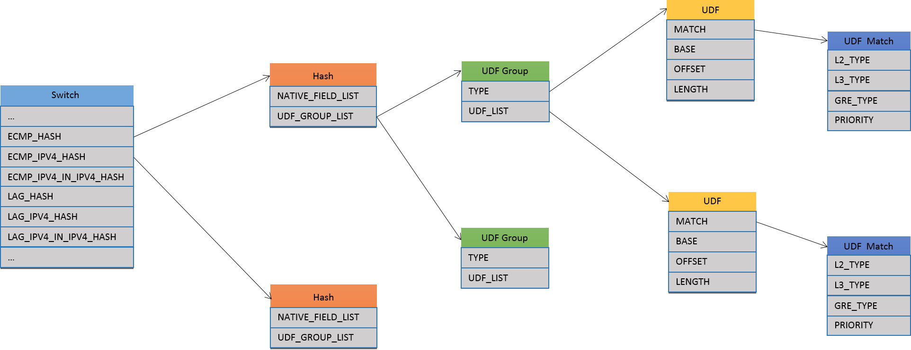

SAI Hash Enhancement with User Defined Field
=====================

 Title       | SAI Hash Enhancement with User Defined Field
-------------|----------------------
 Authors     | Microsoft, Broadcom
 Status      | In review
 Type        | Standards track
 Created     | 04/20/2015
 SAI-Version | 0.9.3

---------

## Overview ##

SAI hash object extract several fields from a packet and use them as well as some meta data to calculate a hash value for that packet. The hash value calculated can be use to spread the packets to a set of objects, e.g., the SAI next hops. Hash can be used on both ECMP and LAG. This proposal enhances existing SAI hash function by allowing different packet types to extract different hash fields, and also allow to use user-defined fields to be used as hash fields.

In this proposal, we propose five major components, switch attributes, hash object, UDF group object, UDF object, UDF match object. Their relationship is shown in the following figure. The overall goal is to compute hash value for different types of packets.

__Figure 1: Relationship among Switch, Hash, UDF objects__

### Switch Attributes ###

We propose a few attribtues for SAI switch to specify the hash object for different types of packets. Since there is only one SAI switch object, these hash objects can be treated as global hash handlers for different types of packets. There are two groups of hash objects, the ECMP group and the LAG group.

For the ECMP group, it has the following attributes. More packet types can be defined in the future.

* `SAI_ECMP_HASH` specifies the hash object to handle all the packets going through ECMP.
* `SAI_ECMP_IPV4_HASH` specifies the hash object to handle all the IPv4 packets going through ECMP.
* `SAI_ECMP_IPV4_IN_IPV4_HASH` specifies the hash object to handle all the IPv4-In-IPv4 packets going through ECMP.

For the LAG group, it has the following attributes. More packet types can be defined in the future.

* `SAI_LAG_HASH` specifies the hash object to handle all the packets going through LAG.
* `SAI_LAG_IPV4_HASH` specifies the hash object to handle all the IPv4 packets going through LAG.
* `SAI_LAG_IPV4_IN_IPV4_HASH` specifies the hash object to handle all the IPv4-In-IPv4 packets going through LAG.

Default hash objects for these attributes must be created when the switch is initialized. Users could override them with their own hash object later.

### Hash ###

SAI hash object is used to extract hash fields for a packet.To extract the fields of the packet, SAI hash object uses the attributes of native fields (`sai_native_hash_field`) and the UDF groups. 

Global hash algorithm and seed are used to calculate the hash value based on the extracted fields, i.e, `SAI_SWITCH_ATTR_ECMP_DEFAULT_HASH_ALGORITHM`, `SAI_SWITCH_ATTR_LAG_DEFAULT_HASH_ALGORITHM`, `SAI_SWITCH_ATTR_ECMP_DEFAULT_HASH_SEED`, `SAI_SWITCH_ATTR_LAG_DEFAULT_HASH_SEED`.

### UDF Group ###

SAI UDF group object is used to extract a single field from a packet. Since incoming packet can be different type, e.g., ipv4, ipv4-in-ipv4. SAI UDF group contains a list of UDFs, each of which is used to extract a field for a certain type of packet. When a packet goes through a UDF group object, one UDF is selected based on its UDF match object.

A UDF group that will be used in hash should be set `SAI_UDF_GROUP_HASH` as the group type.

### UDF ###

UDF object is used to extract a single field for a certain type of packet. UDF object uses UDF match to define the type of packet, and uses base header, offset, length to define the field.

### UDF Match ###

UDF match object contains a set of matching fields to match the packet. The matching fields are simliar to ACL matching fields with limited types. It also defines a matching priority. When a packet matches multiple UDF matches, the match with top priority wins, and corresponding UDFs are selected.

In SAI, UDF match object with the same matching rule can only be created once.

## Specification ##

### Changes To sai.h ###

New types `SAI_API_HASH`, `SAI_API_UDF_GROUP`, `SAI_API_UDF`, `SAI_API_UDF_MATCH` are added.

~~~cpp
/*
*
* Defined API sets have assigned ID's. If specific api method table changes
* in any way (method signature, number of methods), a new ID needs to be
* created (e.g. VLAN2) and old API still may need to be supported for
* compatibility with older adapter hosts.
*
*/
typedef enum _sai_api_t
{
    SAI_API_UNSPECIFIED      =  0,
    SAI_API_SWITCH           =  1,  /* sai_switch_api_t */
    SAI_API_PORT             =  2,  /* sai_port_api_t */
    SAI_API_FDB              =  3,  /* sai_fdb_api_t */
    SAI_API_VLAN             =  4,  /* sai_vlan_api_t */
    SAI_API_VIRTUAL_ROUTER   =  5,  /* sai_virtual_router_api_t */
    SAI_API_ROUTE            =  6,  /* sai_route_api_t */
    SAI_API_NEXT_HOP         =  7,  /* sai_next_hop_api_t */
    SAI_API_NEXT_HOP_GROUP   =  8,  /* sai_next_hop_group_api_t */
    SAI_API_ROUTER_INTERFACE =  9,  /* sai_router_interface_api_t */
    SAI_API_NEIGHBOR         = 10,  /* sai_neighbor_api_t */
    SAI_API_QOS              = 11,  /* sai_qos_api_t */
    SAI_API_ACL              = 12,  /* sai_acl_api_t */
    SAI_API_HOST_INTERFACE   = 13,  /* sai_host_interface_api_t */
    SAI_API_MIRROR           = 14,  /* sai_mirror_api_t */
    SAI_API_SAMPLEPACKET     = 15,  /* sai_samplepacket_api_t */
    SAI_API_STP              = 16,  /* sai_stp_api_t */
    SAI_API_LAG              = 17,  /* sai_lag_api_t */
    SAI_API_HASH             = 18,  /* sai_hash_api_t */
    SAI_API_UDF_GROUP        = 19,  /* sai_udf_group_api_t */
    SAI_API_UDF              = 20,  /* sai_udf_api_t */
    SAI_API_UDF_MATCH        = 21,  /* sai_udf_match_api_t */
} sai_api_t;
~~~

### Changes To saiswitch.h ###

Existing types, `sai_switch_ecmp_hash_type_t` and `sai_switch_ecmp_hash_fields_t`, are deleted.

`sai_hash_algorithm_t` defines the hash algorithms.

~~~cpp
/*
 * The sai hash algorithm
 */
typedef enum _sai_hash_algorithm_t
{
    /* SAI crc-based hash algorithm */
    SAI_HASH_ALGORITHM_CRC,

    /* SAI xor-based hash algorithm */
    SAI_HASH_ALGORITHM_XOR,

    /* SAI random-based hash algorithm */
    SAI_HASH_RANDOM,

} sai_hash_algorithm_t;
~~~

A few hash related attributes are added into `sai_switch_attr_t`.

~~~cpp
/*
*  Attribute Id in sai_set_switch_attribute() and
*  sai_get_switch_attribute() calls
*/
typedef enum _sai_switch_attr_t
{
    /* READ-ONLY */

    /* The number of ports on the switch [uint32_t] */
    SAI_SWITCH_ATTR_PORT_NUMBER,

    ...

    /* SAI ECMP default hash algorithm [sai_hash_algorithm] (default to SAI_HASH_ALGORITHM_CRC) */
    SAI_SWITCH_ATTR_ECMP_DEFAULT_HASH_ALGORITHM,

    /* SAI ECMP default hash seed [uint32_t] (default to 0) */
    SAI_SWITCH_ATTR_ECMP_DEFAULT_HASH_SEED,

    /* The hash object for packets going throught ECMP [sai_object_id_t] */
    SAI_SWITCH_ATTR_ECMP_HASH,

    /* The hash object for IPv4 packets going throught ECMP [sai_object_id_t] */
    SAI_SWITCH_ATTR_ECMP_HASH_IPV4,

    /* The hash object for IPv4 in IPv4 packets going throught ECMP [sai_object_id_t] */
    SAI_SWITCH_ATTR_ECMP_HASH_IPV4_IN_IPV4,

    /* SAI LAG default hash algorithm [sai_hash_algorithm] (default to SAI_HASH_ALGORITHM_CRC) */
    SAI_SWITCH_ATTR_LAG_DEFAULT_HASH_ALGORITHM,

    /* SAI LAG default hash seed [uint32_t] (default to 0) */
    SAI_SWITCH_ATTR_LAG_DEFAULT_HASH_SEED,

    /* The hash object for packets going throught LAG [sai_object_id_t] */
    SAI_SWITCH_ATTR_LAG_HASH,

    /* The hash object for IPv4 packets going throught LAG [sai_object_id_t] */
    SAI_SWITCH_ATTR_LAG_HASH_IPV4,

    /* The hash object for IPv4 in IPv4 packets going throught LAG [sai_object_id_t] */
    SAI_SWITCH_ATTR_LAG_HASH_IPV4_IN_IPV4,

    ...

} sai_switch_attr_t;
~~~

### New Header saihash.h ###

`sai_native_hash_field` defines the native hash fields.

~~~cpp
/*
 * The sai native hash fields
 */
typedef enum _sai_native_hash_field
{
    /* SAI native hash field source IP */
    SAI_NATIVE_HASH_FIELD_SRC_IP,

    /* SAI native hash field destination IP */
    SAI_NATIVE_HASH_FIELD_DST_IP,

    /* SAI native hash field vlan id */
    SAI_NATIVE_HASH_FIELD_VLAN_ID,

    /* SAI native hash field IP protocol */
    SAI_NATIVE_HASH_FIELD_IP_PROTOCOL,

    /* SAI native hash field ethernet type */
    SAI_NATIVE_HASH_FIELD_ETHERTYPE,

    /* SAI native hash field L4 source port */
    SAI_NATIVE_HASH_FIELD_L4_SRC_PORT,

    /* SAI native hash field L4 destination port */
    SAI_NATIVE_HASH_FIELD_L4_DST_PORT,

    /* SAI native hash field source MAC */
    SAI_NATIVE_HASH_FIELD_SRC_MAC,

    /* SAI native hash field destination MAC */
    SAI_NATIVE_HASH_FIELD_DST_MAC,

    /* SAI native hash field source port*/
    SAI_NATIVE_HASH_FIELD_IN_PORT,

} sai_native_hash_field;
~~~

`sai_hash_attr_t` defines the hash attributes.

~~~cpp
/*
 *  Hash attribute IDs
 */
typedef enum _sai_hash_attr_t
{
    /* READ-ONLY */

    /* READ-WRITE */

    /* SAI hash native fields [sai_u32_list_t(sai_native_hash_field)] (CREATE_AND_SET) (default to an empty list) */
    SAI_HASH_NATIVE_FIELD_LIST,

    /* SAI hash UDF group [sai_object_list_t(sai_udf_group_t)] (CREATE_AND_SET) (default to an empty list) */
    SAI_HASH_UDF_GROUP_LIST

} sai_hash_attr_t;
~~~

`sai_create_hash_fn` defines the interface to create hash.

~~~cpp
/*
 * Routine Description:
 *    Create hash
 *
 * Arguments:
 *    [out] hash_id - hash id
 *    [in] attr_count - number of attributes
 *    [in] attr_list - array of attributes
 *
 * Return Values:
 *    SAI_STATUS_SUCCESS on success
 *    Failure status code on error
 */
typedef sai_status_t(*sai_create_hash_fn)(
    _Out_ sai_object_id_t* hash_id,
    _In_ uint32_t attr_count,
    _In_ sai_attribute_t *attr_list
    );
~~~

`sai_remove_hash_fn` defines the interface to remove hash.

~~~cpp
/*
 * Routine Description:
 *    Remove hash
 *
 * Arguments:
 *    [in] hash_id - hash id
 *
 * Return Values:
 *    SAI_STATUS_SUCCESS on success
 *    Failure status code on error
 */
typedef sai_status_t(*sai_remove_hash_fn)(
    _In_ sai_object_id_t hash_id
    );
~~~

`sai_set_hash_attribute_fn` defines the interface to set attribute for the hash.

~~~cpp
/*
 * Routine Description:
 *    Set hash attribute
 *
 * Arguments:
 *    [in] hash_id - hash id
 *    [in] attr - attribute
 *
 * Return Values:
 *    SAI_STATUS_SUCCESS on success
 *    Failure status code on error
 */
typedef sai_status_t (*sai_set_hash_attribute_fn)(
    _In_ sai_object_id_t hash_id,
    _In_ const sai_attribute_t *attr
    );
~~~

`sai_get_hash_attribute_fn` defines the interface to get attributes for the hash.

~~~cpp
/*
 * Routine Description:
 *    Get hash attribute
 *
 * Arguments:
 *    [in] hash_id - hash id
 *    [in] attr_count - number of attributes
 *    [inout] attr_list - array of attributes
 *
 * Return Values:
 *    SAI_STATUS_SUCCESS on success
 *    Failure status code on error
 */
typedef sai_status_t (*sai_get_hash_attribute_fn)(
    _In_ sai_object_id_t hash_id,
    _In_ uint32_t attr_count,
    _Inout_ sai_attribute_t *attr_list
    );
~~~

`sai_hash_api_t` defines the Hash API table.

~~~cpp
/*
 *  Hash methods table retrieved with sai_api_query()
 */
typedef struct _sai_hash_api_t
{
    sai_create_hash_fn          create_hash;
    sai_remove_hash_fn          remove_hash;
    sai_set_hash_attribute_fn   set_hash_attribute;
    sai_get_hash_attribute_fn   get_hash_attribute;

} sai_hash_api_t;
~~~

### New Header saiudf.h ###

`sai_udf_base_t` defines the SAI UDF base type.

~~~cpp
/*
 * Sai UDF base
 */
typedef enum _sai_udf_base_t
{
    /* Sai UDF base L2 */
    SAI_UDF_BASE_L2,

    /* Sai UDF base L3 */
    SAI_UDF_BASE_L3,

    /* Sai UDF base L4 */
    SAI_UDF_BASE_L4,

} sai_udf_base_t;
~~~

`sai_udf_attr_t` defines the SAI UDF attributes.

~~~cpp
/*
 *  Attribute id for UDF
 */
typedef enum _sai_udf_attr_t
{
    /* READ-ONLY */

    /* READ-WRITE */

    /* UDF L2 match ID [sai_object_id_t] (MANDATORY_ON_CREATE|CREATE_ONLY) */
    SAI_UDF_ATTR_MATCH_ID,

    /* UDF group id [sai_object_id_t] (MANDATORY_ON_CREATE|CREATE_AND_SET) */
    SAI_UDF_ATTR_GROUP_ID,

    /* UDF base [sai_udf_base_t] (CREATE_AND_SET) (default to SAI_UDF_BASE_L2) */
    SAI_UDF_ATTR_BASE,

    /* UDF byte offset [uint16_t] (MANDATORY_ON_CREATE|CREATE_AND_SET) */
    SAI_UDF_ATTR_OFFSET,

    /* UDF byte length [uint16_t] (CREATE_AND_SET) (default to 2 bytes)*/
    SAI_UDF_ATTR_LENGTH,

    /* UDF Mask [sai_u8_list_t](CREATE_AND_SET) (default to 2 bytes, value 0xFF, 0xFF)
     * The count in the list must be equal to the UDF byte length.
     * The mask only applies to extracted UDF when it is used for hash,
     * it does not apply to the extracted UDF when it is used for ACL.  */
    SAI_UDF_ATTR_HASH_MASK

} sai_udf_attr_t;
~~~

`sai_create_udf_fn` defines the interface to create UDF.

~~~cpp
/*
 * Routine Description:
 *    Create UDF
 *
 * Arguments:
 *    [out] udf_id - UDF id
 *    [in] attr_count - number of attributes
 *    [in] attr_list - array of attributes
 *
 * Return Values:
 *    SAI_STATUS_SUCCESS on success
 *    Failure status code on error

 */
typedef sai_status_t (*sai_create_udf_fn)(
    _Out_ sai_object_id_t* udf_id,
    _In_ uint32_t attr_count,
    _In_ const sai_attribute_t *attr_list
    );
~~~

`sai_remove_udf_fn` defines the interface to remove UDF.

~~~cpp
/*
 * Routine Description:
 *    Remove UDF
 *
 * Arguments:
 *    [in] udf_id - UDF id
 *
 * Return Values:
 *    SAI_STATUS_SUCCESS on success
 *    Failure status code on error
 */
typedef sai_status_t (*sai_remove_udf_fn)(
    _In_ sai_object_id_t udf_id
    );
~~~

`sai_set_udf_attribute_fn` defines the interface to set attribute for UDF.

~~~cpp
/*
 * Routine Description:
 *    Set UDF attribute
 *
 * Arguments:
 *    [in] sai_object_id_t - udf_id
 *    [in] attr - attribute
 *
 * Return Values:
 *    SAI_STATUS_SUCCESS on success
 *    Failure status code on error
 */
typedef sai_status_t (*sai_set_udf_attribute_fn)(
    _In_ sai_object_id_t udf_id,
    _In_ const sai_attribute_t *attr
    );
~~~

`sai_get_udf_attribute_fn` defines the interface to get attributes for UDF.

~~~cpp
/*
 * Routine Description:
 *    Get UDF attribute
 *
 * Arguments:
 *    [in] sai_object_id_t - udf_id
 *    [in] attr_count - number of attributes
 *    [inout] attr_list - array of attributes
 *
 * Return Values:
 *    SAI_STATUS_SUCCESS on success
 *    Failure status code on error
 */
typedef sai_status_t (*sai_get_udf_attribute_fn)(
    _In_ sai_object_id_t udf_id,
    _In_ uint32_t attr_count,
    _Inout_ sai_attribute_t *attr_list
    );
~~~

`sai_udf_api_t` defines the UDF API table.

~~~cpp
/*
 *  UDF methods table retrieved with sai_api_query()
 */
typedef struct _sai_udf_api_t
{
    sai_create_udf_fn        create_udf;
    sai_remove_udf_fn        remove_udf;
    sai_set_udf_attribute_fn set_udf_attribute;
    sai_get_udf_attribute_fn get_udf_attribute;

} sai_udf_api_t;
~~~

### New Header saiudfgroup.h ###

`sai_udf_type_t` defines the SAI UDF group type.

~~~cpp
/*
 * Sai UDF type.
 */
typedef enum _sai_udf_group_type_t
{
    /* Sai generic UDF group */
    SAI_UDF_GROUP_GENERIC,

    /* Sai UDF group for hash */
    SAI_UDF_GROUP_HASH,

} sai_udf_group_type_t;
~~~

`sai_udf_group_attr_t` defines the SAI UDF group attributes.

~~~cpp
/*
 *  Attribute id for UDF group
 */
typedef enum _sai_udf_group_attr_t
{
    /* READ-ONLY */

    /* UDF list [sai_object_list_t] */
    SAI_UDF_GROUP_ATTR_UDF_LIST,

    /* READ-WRITE */

    /* UDF group type [sai_udf_group_type_t] (CREATE_ONLY) (default to SAI_UDF_GENERIC) */
    SAI_UDF_GROUP_ATTR_TYPE,

} sai_udf_group_attr_t;
~~~

`sai_create_udf_group_fn` defines the interface to create UDF group.

~~~cpp
/*
 * Routine Description:
 *    Create UDF group
 *
 * Arguments:
 *    [out] udf_group_id - UDF group id
 *    [in] attr_count - number of attributes
 *    [in] attr_list - array of attributes
 *
 * Return Values:
 *    SAI_STATUS_SUCCESS on success
 *    Failure status code on error
 */
typedef sai_status_t (*sai_create_udf_group_fn)(
    _Out_ sai_object_id_t* udf_group_id,
    _In_ uint32_t attr_count,
    _In_ const sai_attribute_t *attr_list
    );
~~~

`sai_remove_udf_group_fn` defines the interface to remove UDF group.

~~~cpp
/*
 * Routine Description:
 *    Remove UDF group
 *
 * Arguments:
 *    [in] udf_group_id - UDF group id
 *
 * Return Values:
 *    SAI_STATUS_SUCCESS on success
 *    Failure status code on error
 */
typedef sai_status_t (*sai_remove_udf_group_fn)(
    _In_ sai_object_id_t udf_group_id
    );
~~~

`sai_set_udf_group_attribute_fn` defines the interface to set attribute for the UDF group.

~~~cpp
/*
 * Routine Description:
 *    Set UDF group attribute
 *
 * Arguments:
 *    [in] sai_object_id_t - udf_group_id
 *    [in] attr - attribute
 *
 * Return Values:
 *    SAI_STATUS_SUCCESS on success
 *    Failure status code on error
 */
typedef sai_status_t (*sai_set_udf_group_attribute_fn)(
    _In_ sai_object_id_t udf_group_id,
    _In_ const sai_attribute_t *attr
    );
~~~

`sai_set_udf_group_attribute_fn` defines the interface to get attribute for the UDF group.

~~~cpp
/*
 * Routine Description:
 *    Get UDF group attribute
 *
 * Arguments:
 *    [in] sai_object_id_t - udf_group_id
 *    [in] attr_count - number of attributes
 *    [inout] attr_list - array of attributes
 *
 * Return Values:
 *    SAI_STATUS_SUCCESS on success
 *    Failure status code on error
 */
typedef sai_status_t (*sai_get_udf_group_attribute_fn)(
    _In_ sai_object_id_t udf_group_id,
    _In_ uint32_t attr_count,
    _Inout_ sai_attribute_t *attr_list
    );
~~~

`sai_udf_group_api_t` defines the UDF group API table.

~~~cpp
/*
 *  UDF group methods table retrieved with sai_api_query()
 */
typedef struct _sai_udf_group_api_t
{
    sai_create_udf_group_fn        create_udf_group;
    sai_remove_udf_group_fn        remove_udf_group;
    sai_set_udf_group_attribute_fn set_udf_group_attribute;
    sai_get_udf_group_attribute_fn get_udf_group_attribute;

} sai_udf_group_api_t;
~~~

### New Header saiudfmatch.h ###

`sai_udf_match_attr_t` defines the UDF match attributes.

~~~cpp
/*
 *  Attribute id for UDF match
 */
typedef enum _sai_udf_match_attr_t
{
    /* READ-ONLY */

    /* READ-WRITE */

    /* UDF L2 match rule [sai_acl_field_data_t(uint16_t)] (CREATE_ONLY) (default to None) */
    SAI_UDF_MATCH_ATTR_L2_TYPE,

    /* UDF L3 match rule [sai_acl_field_data_t(uint8_t)] (CREATE_ONLY) (default to None) */
    SAI_UDF_MATCH_ATTR_L3_TYPE,

    /* UDF GRE match rule [sai_acl_field_data_t(uint16_t)] (CREATE_ONLY) (default to None) */
    SAI_UDF_MATCH_ATTR_GRE_TYPE,

    /* UDF match priority [uint8_t] (CREATE_ONLY) (default to 0) */
    SAI_UDF_MATCH_ATTR_PRIORITY

} sai_udf_match_attr_t;
~~~

`sai_create_udf_match_fn` defines the interface to create UDF match.

~~~cpp
/*
 * Routine Description:
 *    Create UDF match
 *
 * Arguments:
 *    [out] udf_match_id - UDF match id
 *    [in] attr_count - number of attributes
 *    [in] attr_list - array of attributes
 *
 * Return Values:
 *    SAI_STATUS_SUCCESS on success
 *    Failure status code on error
 */
typedef sai_status_t (*sai_create_udf_match_fn)(
    _Out_ sai_object_id_t* udf_match_id,
    _In_ uint32_t attr_count,
    _In_ const sai_attribute_t *attr_list
    );
~~~

`sai_remove_udf_match_fn` defines the interface to remove UDF match.

~~~cpp
/*
 * Routine Description:
 *    Remove UDF match
 *
 * Arguments:
 *    [in] udf_match_id - UDF match id
 *
 * Return Values:
 *    SAI_STATUS_SUCCESS on success
 *    Failure status code on error
 */
typedef sai_status_t (*sai_remove_udf_match_fn)(
    _In_ sai_object_id_t udf_match_id
    );
~~~

`sai_set_udf_match_attribute_fn` defines the interface to set attribute for UDF match.

~~~cpp
/*
 * Routine Description:
 *    Set UDF match attribute
 *
 * Arguments:
 *    [in] sai_object_id_t - udf_match_id
 *    [in] attr - attribute
 *
 * Return Values:
 *    SAI_STATUS_SUCCESS on success
 *    Failure status code on error
 */
typedef sai_status_t (*sai_set_udf_match_attribute_fn)(
    _In_ sai_object_id_t udf_match_id,
    _In_ const sai_attribute_t *attr
    );
~~~

`sai_get_udf_match_attribute_fn` defines the interface to get attributes for UDF match.

~~~cpp
/*
 * Routine Description:
 *    Get UDF match attribute
 *
 * Arguments:
 *    [in] sai_object_id_t - udf_match_id
 *    [in] attr_count - number of attributes
 *    [inout] attr_list - array of attributes
 *
 * Return Values:
 *    SAI_STATUS_SUCCESS on success
 *    Failure status code on error
 */
typedef sai_status_t (*sai_get_udf_match_attribute_fn)(
    _In_ sai_object_id_t udf_match_id,
    _In_ uint32_t attr_count,
    _Inout_ sai_attribute_t *attr_list
    );
~~~

`sai_udf_match_api_t` defines the UDF match API table.

~~~cpp
/*
 *  UDF match methods table retrieved with sai_api_query()
 */
typedef struct _sai_udf_match_api_t
{
    sai_create_udf_match_fn        create_udf_match;
    sai_remove_udf_match_fn        remove_udf_match;
    sai_set_udf_match_attribute_fn set_udf_match_attribute;
    sai_get_udf_match_attribute_fn get_udf_match_attribute;

} sai_udf_match_api_t;
~~~

## Example ##

The following example shows how to define UDF hash fields for all IPv4 packets. It first defines one UDF match object to match GRE packet with specific GRE protocol type. It then creates two UDF groups, and creates one UDF object for each UDF group. Finally, it uses these two UDF groups as the hash fields for all IPv4 packets.

~~~cpp
// Set XOR hash algorithm
sai_switch_attr_t switch_attr;
switch_attr.id = (sai_attr_id_t)SAI_SWITCH_ATTR_DEFAULT_HASH_ALGORITHM;
switch_attr.value.s32 = SAI_HASH_ALGORITHM_XOR;
sai_switch_api->set_switch_attribute(&switch_attr);

// Create UDF match 1 to match the GRE packet
sai_object_id_t udf_match1_id;
sai_attribute_t udf_match1_attrs[3];
udf_match1_attrs[0].id = (sai_attr_id_t)SAI_UDF_ATTR_MATCH_L2_TYPE;
udf_match1_attrs[0].value.u16 = 0x0800;
udf_match1_attrs[1].id = (sai_attr_id_t)SAI_UDF_ATTR_MATCH_L3_TYPE;
udf_match1_attrs[1].value.u8 = 0x2f;
udf_match1_attrs[2].id = (sai_attr_id_t)SAI_UDF_MATCH_ATTR_GRE_TYPE;
udf_match1_attrs[2].value.u16 = 0x88be;
sai_udf_match_api->create_udf_match(&udf_match1_id, 3, udf_match1_attrs);

// Create two UDF groups
sai_object_id_t udf_group_ids[2];
sai_attribute_t udf_group_attr;
udf_group_attr.id = (sai_attr_id_t)SAI_UDF_GROUP_ATTR_TYPE;
udf_group_attr.value.s32 = SAI_UDF_HASH;
sai_udf_group_api->create_udf_group(&udf_group_ids[0], 1, udf_group_attr);

udf_group_attr.id = (sai_attr_id_t)SAI_UDF_GROUP_ATTR_TYPE;
udf_group_attr.value.s32 = SAI_UDF_HASH;
sai_udf_group_api->create_udf_group(&udf_group_ids[1], 1, udf_group_attr);

// Create UDF1 to match the inner src IP
sai_object_id_t udf1_id;
sai_attribute_t udf1_attrs[5];
udf1_attrs[0].id = (sai_attr_id_t)SAI_UDF_ATTR_MATCH_ID;
udf1_attrs[0].value.oid = udf_match1_id;
udf1_attrs[1].id = (sai_attr_id_t)SAI_UDF_ATTR_GROUP_ID;
udf1_attrs[1].value.oid = udf_group_ids[0];
udf1_attrs[2].id = (sai_attr_id_t)SAI_UDF_ATTR_BASE;
udf1_attrs[2].value.s32 = SAI_UDF_BASE_L2;
udf1_attrs[3].id = (sai_attr_id_t)SAI_UDF_ATTR_OFFSET;
udf1_attrs[3].value.u16 = 56;
udf1_attrs[4].id = (sai_attr_id_t)SAI_UDF_ATTR_LENGTH;
udf1_attrs[4].value.u16 = 2;
sai_udf_api->create_udf(&udf1_id, 5, udf1_attrs);

// Create UDF2 to match the inner dest IP
sai_object_id_t udf2_id;
sai_attribute_t udf2_attrs[5];
udf2_attrs[0].id = (sai_attr_id_t)SAI_UDF_ATTR_MATCH_ID;
udf2_attrs[0].value.oid = udf_match1_id;
udf2_attrs[1].id = (sai_attr_id_t)SAI_UDF_ATTR_GROUP_ID;
udf1_attrs[1].value.oid = udf_group_ids[1];
udf2_attrs[2].id = (sai_attr_id_t)SAI_UDF_ATTR_BASE;
udf2_attrs[2].value.s32 = SAI_UDF_BASE_L2;
udf2_attrs[3].id = (sai_attr_id_t)SAI_UDF_ATTR_OFFSET;
udf2_attrs[3].value.u16 = 60;
udf2_attrs[4].id = (sai_attr_id_t)SAI_UDF_ATTR_LENGTH;
udf2_attrs[4].value.u16 = 2;
sai_udf_api->create_udf(&udf2_id, 5, udf2_attrs);

// Create a hash object for the two UDFs
sai_object_id_t hash_id;
sai_attribute_t hash_attr;
hash_attr.id = (sai_attr_id_t)SAI_HASH_UDF_GROUP_LIST;
hash_attr.value.objlist.object_count = 2;
hash_attr.value.objlist.object_list = udf_group_ids;
sai_hash_api->create_hash(&hash_id, 1, &hash_attr);

// Set switch attribute to use the hash object for handling all IPv4 packets.
switch_attr.id = (sai_attr_id_t)SAI_SWITCH_ATTR_ECMP_HASH_IPV4;
switch_attr.value.oid = hash_id;
sai_switch_api->set_switch_attribute(&switch_attr);
~~~
