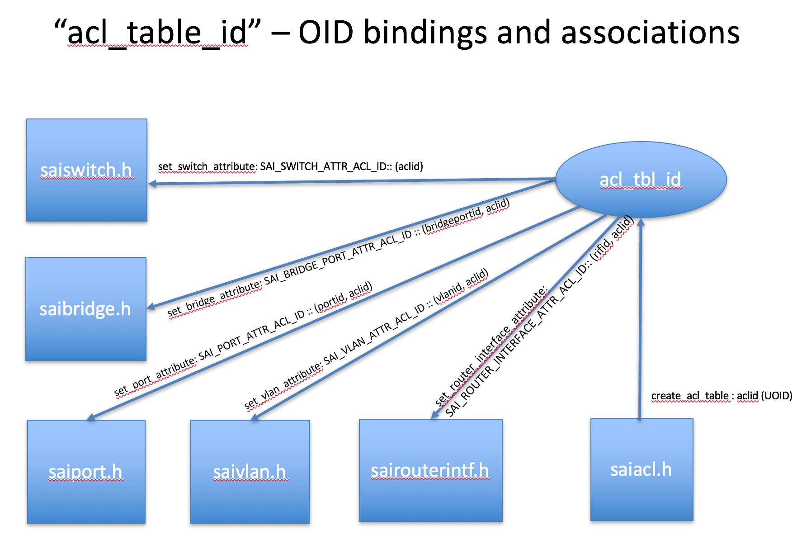
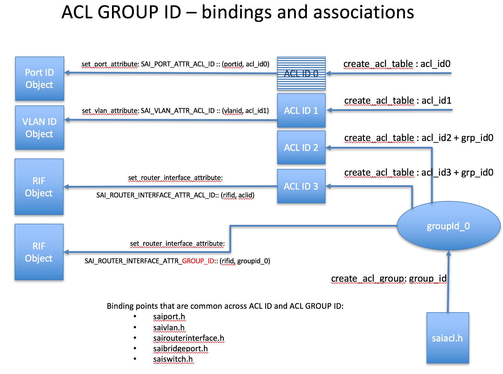

SAI access control lists (ACL) enhancements for SAI 1.0 release
===============================================================================

 Title       | SAI ACL Model - Enhancements
-------------|----------------------
 Authors     | Cavium 
 Status      | In review
 Type        | Standards track
 Created     | 08/09/2016
 SAI-Version | 1.0.0

-------------------------------------------------------------------------------

## Overview ##
SAI Access Control Lists (ACL) object implements ACL management functions. In SAI 0.9.1 through 0.9.3 versions, the ACL contains three types of objects, ACL table, ACL entry and ACL counter. The ACL table contains a number of ACL entries. Each ACL table defines a set of unique matching fields for all its ACL entries. A packet can match rules in different ACL tables and take non-conflicting actions from all the matched rules. However, within an ACL table, if a packet matches multiple rules, only the actions from the rule of highest priority are executed. ACL counters can also be created and attached to an ACL entry in order to counter the number of packets or bytes that match the ACL entry.

The initial version of ACL table object has several ambiguities and limitations, as well as needs the following enhancements. 
1. Well defined binding point for an ACL table
2. Well defined behavior and usage of ACL group ID and metadata fields
3. ACL table stages that were relevant in absense of a binding point
4. Scaling issues in absense of a well defined binding point
5. Missing behavioral model for ACL stage(s)

In this proposal, we propose a model for binding an ACL table, clarify the usage of group IDs and metadata with UOID based ACL ID, mapping of ACL stages relevant to binding points, and tunnel specific ACL behavior. We also introduce the behavioral model for ACLs.

__Figure 1: ACL ID's relationship and binding points with other SAI objects__

### ACL ID Binding Model 
We propose the usage of UOID based ACL Table ID allocated by the create_acl_table function should be uniformly applied to identify the binding point. This bind point is typically identified by various physical and or logical interfaces identified by various objects: 
1. Physical Ports and Lag (saiport.h and sailag.h)
2. VLANs (saivlan.h)
3. Router Interfaces (sairouterintf.h)
4. Bridge Ports (saibridgeintf.h) - includes both .1q and .1d bridge ports
5. Globally apply to all packets (saiswitch.h). Currently the limitation is to be able to bind only one ACL ID per switch. This is to support backward compatibility to pre- SAI 1.0 ACL model.

Considering there are various ACL IDs derived from several binding points, there are use cases where more than one valid ACL ID can be associated for a particular flow. The behavioral expectation is to apply all the valid ACL IDs derived from different binding points, but apply the ACLs tables the order of the ACL Table's priority. 

### Group ID Binding Model
Group ID is an object ID based identifier that is a software only object allocated via saiacl.h APIs. The purpose of the group ID object is to bind several ACL table IDs logically, and then allow the group ID to be bound to a specific binding point. This proposal introduces the group ID management APIs to saiacl.h. Figure 2 conceptually shows the use case of allowing group IDs be configured to various binding points. This also introduces the group ID configuration attribute at various binding points. Naturally group ID attribute once configured should superseed the acl ID configured on any binding point. 

__Figure 2: Group ID and ACL ID's relation with several binding points.__

### Metadata Usage Model
Metadata is a completely user defined field or an identifier that does not need to be allocated within the SAI implementtaions. The Metadata field(s) in the logical pipeline is to allow users to derive a *Metadata* field from any SAI objects (ports, vlans, rifs, bridge ports, Etc.), as well as flow tables (like unicast/multicast FDBs, Neighbor table, acl table entries, route entries). Currently the Metadata field derived at various stages of the pipeline are appended to each other and a specific META_DATA is being used for lookup in the ACL entry. 

### ACLs on Tunnels 
Tunnel interfaces are defined by saitunnel.h. The following tunnel attributes can be configured on the Decap flow as well as Encap flows: 
* SAI_TUNNEL_ATTR_DECAP_INGRESS_ACL_ID [Ingress ACL table bound to inner packets ]
* SAI_TUNNEL_ATTR_DECAP_INGRESS_ACL_GROUP_ID [Ingress ACL group bound to inner packets]
* SAI_TUNNEL_ATTR_ENCAP_EGRESS_ACL_ID [EGRESS ACL bound on encap or originated tunnels]

### ACL Stages 
Based on various binding points, the scope of the ACL stages are restricted to primarily INGRESS and EGRESS. The ingress stage of the ACL table gets applied to various flows right after the determinition of the type of interface. For a bridge flow after the port or the bridge port determination, for the router flow right after the rif determination, and for a tunnelled flow it is after the tunnel decap and tunnel determination stage. Please refer to the ACL changes to the behavioral pipeline model for various ACL stages.

## Example ##
TBD: Examples show how to define ACLs, Group IDs, Metadata, Etc.
TBD: Update pipeline models after incorporating all review feedbacks.

## References ##
1. SAI v0.9.1 specification.

## Next Steps
1. Community Review 
2. Update examples
3. Update pipeline models
