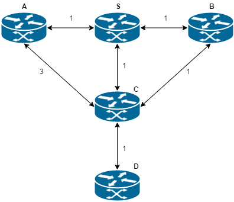
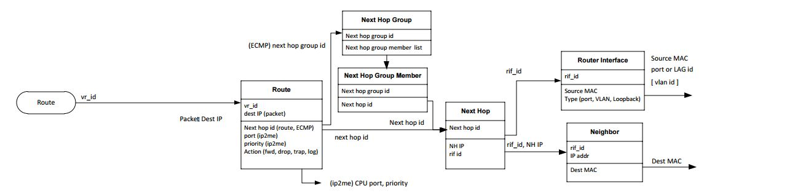
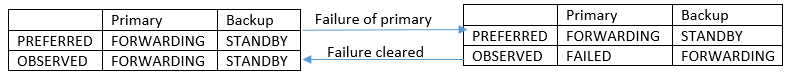
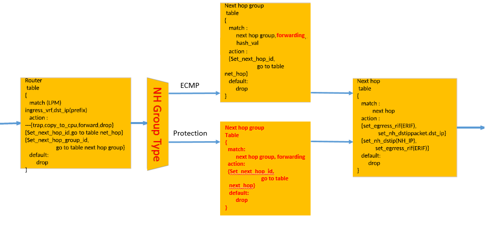

SAI Fast Reroute enhancement for SAI 1.2.0
-------------------------------------------------------------------------------
 Title       | Fast Reroute
-------------|-----------------------------------------------------------------
 Authors     | Metaswitch Networks
 Status      | In review
 Type        | Standards track
 Created     | 13/04/2017
 Updated     | 11/05/2017
 SAI-Version | 1.2.0

-------------------------------------------------------------------------------

# Overview

Many IP/MPLS networks provide services which are very sensitive to
traffic loss, which can occur when a node or link physically fails in
the network (or software running on those nodes fails). For these
networks, it is not acceptable to wait for protocol reconvergence to
complete before reprogramming the Data Plane – applications may be
sensitive to traffic loss greater than 10s of milliseconds. Technologies
like IP FRR, which allow backup routes to be pre-programmed in the
routers’ FIBs can significantly reduce the time it takes for a node to
recover after a failure has been detected. This proposal therefore
extends the SAI to allow pre-programming backup paths which is required
for a device to support IP FRR.

## Overview of IP FRR


When there is a link or a node failure in an IP network, it can take
several seconds for the Control Plane stack to converge the routers'
FIBs to a new, consistent state which avoids the failed resource. During
this time, the routers will still forward some packets along paths that
include the failed resources, and as a result those packets will be
black-holed. For some types of customer traffic (for example, real-time
collaboration applications and pseudowires) this is too long an outage,
and adversely affects the customer experience.

IP Fast Reroute (FRR) is intended to cut the window during which packets
are black-holed down to tens of milliseconds. It works as follows.

-   The routers compute a "safe" alternate next hop for each route in
    advance, to be used in case the primary next hop fails. See the
    example below for explanation what a “safe” alternative is.

-   The alternate next hop is then pre-loaded into the Switching Entity
    so that the time it takes the router to switch over to the alternate
    can be minimized.

This mechanism allows packets to continue to reach their destinations
while the Control Plane converges. Once the Control Plane has converged,
the routers start to forward using the new primary next hops of all
affected routes, and they compute a new set of alternate next hops,
ready for the next failure.

## Example

Let’s consider the following network topology as an example. In this
scenario router S programs its Switching Entity to forward traffic
destined for node D.



As the first step the Control Plane stack on S calculates shortest path
to D, which in this example is via node C. This is programmed to the
Switching Entity.

Then, Control Plane calculates the backup next hop. In this topology
there are two possible alternative paths to reach D – using node A or
node B as next hop. However, routing via node A is not a safe option.
This is because from A’s perspective, shortest path to D is via S.
Therefore if S sends any packets destined for D towards A, A will route
them back to S causing a micro-loop and quickly saturating the bandwidth
on the link between the nodes. The safe next hop alternative in this
topology is towards node B. When node B receives packets to D it will
route it over to C. Therefore Control Plane on node S programs a backup
next hop for destination D over interface towards B into the Switching
Entity.

In steady state, traffic to D is forwarded only via link to C and the
backup next hop is not used. If the link between S and C fails, the
Switching Entity immediately switches to forwarding traffic via the
protecting next hop. Then, after a while the Control Plane stack
converges and new set of next hops is programmed to the Switching
Entity.

## Failure detection and switchover triggers

The switchover from the primary next hop to backup can be triggered by
both Switching Entity and Control Plane stack, depending on the
capabilities of the hardware to detect failures.

If the Switching Entity is not able to run a BFD protocol within the
hardware, then it is the Control Plane stack that is first notified of
failure and who has to initiate the switchover.

If there is a BFD process running within the hardware, then Switching
Entity can perform a switchover without notifying the Control Plane
stack when a failure is detected.

Finally, the Switching Entity should also be able to perform a
switchover when it detects that the port used by the primary next hop
has been brought down.

### Switchover in control plane vs switchover in switching entity

This proposal allows for switchover to be triggered by both control
plane and the switching entity.

Not all of the chipsets support BFD in hardware and therefore it is
required to support switchovers triggered by the control plane.

At the same time, if the hardware supports BFD, then much faster
switchover times can be achieved if the switching entity can trigger
them directly. This has been confirmed by feedback we received from
hardware vendors after we presented the first draft of this proposal

Furthermore, to simplify the operation of the switching entity, it is desired
that the control plane provides the identifiers of the BFD session of port
that is associated with given next hop group.

# Proposal
## Current SAI object model



Current model allows programming multiple next hops for a given
destination. This is achieved by using a Next Hop Group object instead
of a single Next Hop when specifying Next hop id on the Route object.

Next Hop Group then has a list of Next Hop Group Members each of which
points to a single Next Hop.

At the moment this model assumes that the only case when a Next Hop
Group is used is ECMP.

## Proposed extensions

In order to allow Fast Reroute programming in the Switching Entity, we
propose to extend the Next Hop Group and Next Hop Group Member objects.

### Next Hop Group

Firstly, a new type of Next Hop Group is specified –
SAI\_NEXT\_HOP\_GROUP\_TYPE\_PROTECTION. This indicates that the group
does not represent ECMP next hops but a primary-backup pair.

It is expected that the Control Plane stack will never attempt to
program more than two next hops within a single Protection Next Hop
Group. It is outside the scope of this proposal to specify how the
Adapter or Adapter Host should enforce this condition.

Furthermore, two new attributes are added to the Next Hop Group to identify
what kind of events can cause the Switching Entity to initiate a switchover.
The attributes are:
-  SAI\_NEXT\_HOP\_GROUP\_ATTR\_BFD\_SESSION\_ID
-  SAI\_NEXT\_HOP\_GROUP\_ATTR\_PORT\_ID

These attributes allow the switching entity to monitor a specified object
(BFD session or port) and in case of its failure, trigger a switchover.

Finally, new attribute is added to allow the Control Plane stack to
initiate and revert the failover. The new attribute is
SAI\_NEXT\_HOP\_GROUP\_ATTR\_SET\_SWITCHOVER. This is required for
example in the scenario when the BFD process runs in the Control Plane
process rather than in the Switching Entity and the Control Plane stack
has to trigger a switchover “manually”.

### Next Hop Group Member

Two attributes are added to the Next Hop Group Member object. These
indicate what is the configured and actual role of the referred next hop
in a protection group. The attributes are:

-   SAI\_NEXT\_HOP\_GROUP\_MEMBER\_ATTR\_PREFERRED\_ROLE
    -   This attribute is configurable and has to be specified when the
        next hop group member is created.
    -   It can take one of the following values:
        - SAI\_NEXT\_HOP\_GROUP\_MEMBER\_FORWARDING - The next hop group member is configured as primary and will forward traffic if there is no failure.
        - SAI\_NEXT\_HOP\_GROUP\_MEMBER\_STANDBY - The next hop group member is configured as a backup and will not forward traffic unless the primary fails.
-   SAI\_NEXT\_HOP\_GROUP\_MEMBER\_ATTR\_OBSERVED\_ROLE
    -   This is a read-only attribute which represents the actual role
        of the referred next hop.
    -   It can take one of the following values:
        - SAI\_NEXT\_HOP\_GROUP\_MEMBER\_FORWARDING - This next hop group member is currently forwarding traffic. Valid for both primary and backup.
        - SAI\_NEXT\_HOP\_GROUP\_MEMBER\_STANDBY - This next hop is backup and is currently not forwarding any traffic.
        - SAI\_NEXT\_HOP\_GROUP\_MEMBER\_FAILED - This next hop is primary but is currently in failed state and is not forwarding any traffic.

Furthermore, the relationship between next hops and their roles within a
protection group can be in one of two states:



# Specification

## Addition to file sainexthopgroup.h

### Data Structures and Enumerations

#### Changes to Next Hop Group
```
typedef enum _sai_next_hop_group_type_t
{
    /** Next hop group is ECMP */
    SAI_NEXT_HOP_GROUP_TYPE_ECMP,

+     /** Next hop protection group.  Contains primary and backup next hops. */
+     SAI_NEXT_HOP_GROUP_TYPE_PROTECTION,

    /* Other types of next hop group to be defined in the future, e.g., ECMP */

} sai_next_hop_group_type_t;

/**
 * @brief Attribute id for next hop
 */
typedef enum _sai_next_hop_group_attr_t
{
    /**
     * @brief Start of attributes
     */
    SAI_NEXT_HOP_GROUP_ATTR_START,

    /**
     * @brief Number of next hops in the group
     *
     * @type sai_uint32_t
     * @flags READ_ONLY
     */
    SAI_NEXT_HOP_GROUP_ATTR_NEXT_HOP_COUNT = SAI_NEXT_HOP_GROUP_ATTR_START,

    /**
     * @brief Next hop member list
     *
     * @type sai_object_list_t
     * @flags READ_ONLY
     * @objects SAI_OBJECT_TYPE_NEXT_HOP_GROUP_MEMBER
     */
    SAI_NEXT_HOP_GROUP_ATTR_NEXT_HOP_MEMBER_LIST,

    /**
     * @brief Next hop group type
     *
     * @type sai_next_hop_group_type_t
     * @flags MANDATORY_ON_CREATE | CREATE_ONLY
     */
    SAI_NEXT_HOP_GROUP_ATTR_TYPE,

+     /**
+      * @brief Trigger a switchover from primary to backup next hop
+      *
+      * @type bool
+      * @default false
+      * @validonly SAI_NEXT_HOP_GROUP_ATTR_TYPE == SAI_NEXT_HOP_GROUP_TYPE_PROTECTION
+      */
+     SAI_NEXT_HOP_GROUP_ATTR_SET_SWITCHOVER,
+
+     /**
+      * @brief Identifier of the BFD session associated with the primary next hop
+      *
+      * The BFD session is used to detect failure of the primary next hop.
+      * If the specified BFD session detects failure, the switching entity
+      * triggers a switchover to backup next hop.
+      *
+      * @type TODO (Waiting for the BFD proposal to specify the format)
+      * @default 0
+      * @validonly SAI_NEXT_HOP_GROUP_ATTR_TYPE == SAI_NEXT_HOP_GROUP_TYPE_PROTECTION
+      */
+     SAI_NEXT_HOP_GROUP_ATTR_BFD_SESSION_ID,
+
+     /**
+      * @brief Identifier of the port associated with the primary next hop
+      *
+      * If the specified port fails, the switching entity triggers a switchover
+      * from the primary next hop to backup.
+      *
+      * @type sai_object_id_t
+      * @default 0
+      * @validonly SAI_NEXT_HOP_GROUP_ATTR_TYPE == SAI_NEXT_HOP_GROUP_TYPE_PROTECTION
+      */
+     SAI_NEXT_HOP_GROUP_ATTR_PORT_ID,


    /**
     * @brief End of attributes
     */
    SAI_NEXT_HOP_GROUP_ATTR_END,

    /** Custom range base value */
    SAI_NEXT_HOP_GROUP_ATTR_CUSTOM_RANGE_START = 0x10000000,

    /** End of custom range base */
    SAI_NEXT_HOP_GROUP_ATTR_CUSTOM_RANGE_END

} sai_next_hop_group_attr_t;

```

#### Changes to Next Hop Group Member
```
+ /**
+  * @brief No switchover triggers supported
+  */
+ #define SAI_NEXT_HOP_SWITCHOVER_TRIGGER_NULL                         0x00000000
+
+ /**
+  * @brief Supported switchover triggered by BFD
+  */
+ #define SAI_NEXT_HOP_SWITCHOVER_TRIGGER_BFD                          0x00000001
+
+ /**
+  * @brief Supported switchover triggered by port going down
+  */
+ #define SAI_NEXT_HOP_SWITCHOVER_TRIGGER_PORT_DOWN                    0x00000002
+
+ /**
+  * @brief Next hop group member protection role
+  */
+ typedef enum _sai_next_hop_group_member_protection_role_t
+ {
+     /** Next hop group member is forwarding */
+     SAI_NEXT_HOP_GROUP_MEMBER_FORWARDING,
+
+     /** Next hop group member is standby */
+     SAI_NEXT_HOP_GROUP_MEMBER_STANDBY,
+
+     /** Next hop group member failed */
+     SAI_NEXT_HOP_GROUP_MEMBER_FAILED,
+
+ } sai_next_hop_group_member_protection_role_t;

typedef enum _sai_next_hop_group_member_attr_t
{
    /**
     * @brief Start of attributes
     */
    SAI_NEXT_HOP_GROUP_MEMBER_ATTR_START,

    /**
     * @brief Next hop group id
     *
     * @type sai_object_id_t
     * @flags MANDATORY_ON_CREATE | CREATE_ONLY
     * @objects SAI_OBJECT_TYPE_NEXT_HOP_GROUP
     */
    SAI_NEXT_HOP_GROUP_MEMBER_ATTR_NEXT_HOP_GROUP_ID = SAI_NEXT_HOP_GROUP_MEMBER_ATTR_START,

    /**
     * @brief Next hop id
     *
     * @type sai_object_id_t
     * @flags MANDATORY_ON_CREATE | CREATE_ONLY
     * @objects SAI_OBJECT_TYPE_NEXT_HOP
     */
    SAI_NEXT_HOP_GROUP_MEMBER_ATTR_NEXT_HOP_ID,

    /**
     * @brief Member weights
     *
     * @type sai_uint32_t
     * @flags CREATE_AND_SET
     * @default 1
     */
    SAI_NEXT_HOP_GROUP_MEMBER_ATTR_WEIGHT,

+     /**
+      * @brief Preferred role in the protection group
+      *
+      * Should only be used if the type of owning group is SAI_NEXT_HOP_GROUP_TYPE_PROTECTION
+      *
+      * @type sai_next_hop_group_member_protection_role_t
+      * @flags CREATE_ONLY
+      * @default SAI_NEXT_HOP_GROUP_MEMBER_PRIMARY
+      */
+     SAI_NEXT_HOP_GROUP_MEMBER_ATTR_PREFERRED_ROLE,
+
+     /**
+      * @brief The actual role in protection group
+      *
+      * Should only be used if the type of owning group is SAI_NEXT_HOP_GROUP_TYPE_PROTECTION
+      *
+      * @type sai_next_hop_group_member_protection_role_t
+      * @flags READ_ONLY
+      */
+     SAI_NEXT_HOP_GROUP_MEMBER_ATTR_OBSERVED_ROLE,

    /**
     * @brief End of attributes
     */
    SAI_NEXT_HOP_GROUP_MEMBER_ATTR_END,

    /** Custom range base value */
    SAI_NEXT_HOP_GROUP_MEMBER_ATTR_CUSTOM_RANGE_START  = 0x10000000,

    /** End of custom range base */
    SAI_NEXT_HOP_GROUP_MEMBER_ATTR_CUSTOM_RANGE_END

} sai_next_hop_group_member_attr_t;


```

### API

There are no changes to be made to the API.

# Examples

The examples illustrate the following scenario:
- Create a protection Next Hop Group with primary and backup next hops.
- Trigger a switchover.
- Read the status of the Next Hop Group Members.
- Revert the switchover.
- Read the status again.

## Create a protection Next Hop Group
```
nh_1_interface_id = 1
nh_2_interface_id = 2
switch_id = 0;

nhg_entry_attrs[0].id = SAI_NEXT_HOP_GROUP_ATTR_TYPE;
nhg_entry_attrs[0].value.u32 = SAI_NEXT_HOP_GROUP_TYPE_PROTECTION;
nhg_entry_attrs[1].id = SAI_NEXT_HOP_GROUP_ATTR_SET_SWITCHOVER;
nhg_entry_attrs[1].value.u32 = false;
nhg_entry_attrs[2].id = SAI_NEXT_HOP_GROUP_ATTR_BFD_SESSION_ID;
nhg_entry_attrs[2].value.u32 = 1;
saistatus = sai_frr_api->create_next_hop_group(&nhg_id, switch_id, 1, nhg_entry_attrs);
if (saistatus != SAI_STATUS_SUCCESS) {
    return saistatus;
}

nh_entry_attrs[0].id = SAI_NEXT_HOP_ATTR_TYPE;
nh_entry_attrs[0].value.u32 = SAI_NEXT_HOP_TYPE_IP;
nh_entry_attrs[1].id = SAI_NEXT_HOP_ATTR_IP;
CONVERT_STRING_TO_SAI_IPV4(nh_entry_attrs[1].value, "10.1.1.1");
nh_entry_attrs[2].id = SAI_NEXT_HOP_ATTR_ROUTER_INTERFACE_ID;
nh_entry_attrs[2].value.u64 = nh_1_interface_id;
saistatus = sai_frr_api->create_next_hop(&nh_1_id, switch_id, 2, nh_entry_attrs);
if (saistatus != SAI_STATUS_SUCCESS) {
    return saistatus;
}

nh_entry_attrs[0].id = SAI_NEXT_HOP_ATTR_TYPE;
nh_entry_attrs[0].value.u32 = SAI_NEXT_HOP_TYPE_IP;
nh_entry_attrs[1].id = SAI_NEXT_HOP_ATTR_IP;
CONVERT_STRING_TO_SAI_IPV4(nh_entry_attrs[1].value, "10.1.2.1");
nh_entry_attrs[2].id = SAI_NEXT_HOP_ATTR_ROUTER_INTERFACE_ID;
nh_entry_attrs[2].value.u64 = nh_2_interface_id;
saistatus = sai_frr_api->create_next_hop(&nh_2_id, switch_id, 2, nh_entry_attrs);
if (saistatus != SAI_STATUS_SUCCESS) {
    return saistatus;
}

nhgm_entry_attrs[0].id = SAI_NEXT_HOP_GROUP_MEMBER_ATTR_NEXT_HOP_GROUP_ID;
nhgm_entry_attrs[0].value.oid = nhg_id;
nhgm_entry_attrs[1].id = SAI_NEXT_HOP_GROUP_MEMBER_ATTR_NEXT_HOP_ID;
nhgm_entry_attrs[1].value.oid = nh_1_id;
nhgm_entry_attrs[2].id = SAI_NEXT_HOP_GROUP_MEMBER_ATTR_PREFERRED_PROTECTION_ROLE;
nhgm_entry_attrs[2].value.u32 = SAI_NEXT_HOP_GROUP_MEMBER_PRIMARY;
saistatus = sai_frr_api->create_next_hop_group_member(&nhgm_1_id, switch_id, 2, nhgm_entry_attrs);
if (saistatus != SAI_STATUS_SUCCESS) {
    return saistatus;
}

nhgm_entry_attrs[0].id = SAI_NEXT_HOP_GROUP_MEMBER_ATTR_NEXT_HOP_GROUP_ID;
nhgm_entry_attrs[0].value.oid = nhg_id;
nhgm_entry_attrs[1].id = SAI_NEXT_HOP_GROUP_MEMBER_ATTR_NEXT_HOP_ID;
nhgm_entry_attrs[1].value.oid = nh_2_id;
nhgm_entry_attrs[2].id = SAI_NEXT_HOP_GROUP_MEMBER_ATTR_PREFERRED_PROTECTION_ROLE;
nhgm_entry_attrs[2].value.u32 = SAI_NEXT_HOP_GROUP_MEMBER_BACKUP;
saistatus = sai_frr_api->create_next_hop_group_member(&nhgm_2_id, switch_id, 2, nhgm_entry_attrs);
if (saistatus != SAI_STATUS_SUCCESS) {
    return saistatus;
}

```

## Trigger a switchover
```
nhg_entry_attrs[0].id = SAI_NEXT_HOP_GROUP_ATTR_SET_SWITCHOVER;
nhg_entry_attrs[0].value.u32 = true;
saistatus = sai_set_next_hop_group_attribute_fn(nhg_id, nhg_entry_attrs);
if (saistatus != SAI_STATUS_SUCCESS) {
    return saistatus;
}

```

## Query the status of next hop group members.
```

attr_count = 5;

// Get the attributes of the first next hop.
saistatus = sai_frr_api->sai_get_next_hop_group_member_attribute_fn(nhgm_1_id, attr_count, nhgm_entry_attrs);
if (saistatus != SAI_STATUS_SUCCESS) {
    return saistatus;
}

// Find the value of observed protection role.  In the previous step we triggered
// a switchover so the observed role must be "FAILED".
for (attr_id = 0; attr_id < attr_count; attr_id++) {
    if (nhgm_entry_attrs[attr_id].id == SAI_NEXT_HOP_GROUP_MEMBER_ATTR_PREFERRED_OBSERVED_ROLE) {
        assert(nhgm_entry_attrs[attr_id].value.u32 == SAI_NEXT_HOP_GROUP_MEMBER_FAILED);
    }
}

// Now check the other backup next hop.
saistatus = sai_frr_api->sai_get_next_hop_group_member_attribute_fn(nhgm_2_id, attr_count, nhgm_entry_attrs);
if (saistatus != SAI_STATUS_SUCCESS) {
    return saistatus;
}

// This time the observed role will be "FORWARDING".
for (attr_id = 0; attr_id < attr_count; attr_id++) {
    if (nhgm_entry_attrs[attr_id].id == SAI_NEXT_HOP_GROUP_MEMBER_ATTR_PREFERRED_OBSERVED_ROLE) {
        assert(nhgm_entry_attrs[attr_id].value.u32 == SAI_NEXT_HOP_GROUP_MEMBER_FORWARDING);
    }
}

```

## Clear the switchover
```
nhg_entry_attrs[0].id = SAI_NEXT_HOP_GROUP_ATTR_SET_SWITCHOVER;
nhg_entry_attrs[0].value.u32 = false;
saistatus = sai_set_next_hop_group_attribute_fn(nhg_id, nhg_entry_attrs);
if (saistatus != SAI_STATUS_SUCCESS) {
    return saistatus;
}

```
## Query the status of next hop group members again.
```
// The switchover has been cleared so the primary next hop is forwarding again.
saistatus = sai_frr_api->sai_get_next_hop_group_member_attribute_fn(nhgm_1_id, attr_count, nhgm_entry_attrs);
if (saistatus != SAI_STATUS_SUCCESS) {
    return saistatus;
}
for (attr_id = 0; attr_id < attr_count; attr_id++) {
    if (nhgm_entry_attrs[attr_id].id == SAI_NEXT_HOP_GROUP_MEMBER_ATTR_PREFERRED_OBSERVED_ROLE) {
        assert(nhgm_entry_attrs[attr_id].value.u32 == SAI_NEXT_HOP_GROUP_MEMBER_FORWARDING);
    }
}

// And backup is not forwarding anymore.
saistatus = sai_frr_api->sai_get_next_hop_group_member_attribute_fn(nhgm_2_id, attr_count, nhgm_entry_attrs);
if (saistatus != SAI_STATUS_SUCCESS) {
    return saistatus;
}
for (attr_id = 0; attr_id < attr_count; attr_id++) {
    if (nhgm_entry_attrs[attr_id].id == SAI_NEXT_HOP_GROUP_MEMBER_ATTR_PREFERRED_OBSERVED_ROLE) {
        assert(nhgm_entry_attrs[attr_id].value.u32 == SAI_NEXT_HOP_GROUP_MEMBER_BACKUP);
    }
}

```

# Pipeline


