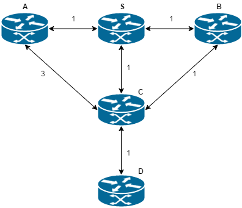
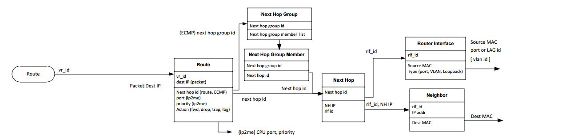

SAI Fast Reroute enhancement for SAI 1.2.0
-------------------------------------------------------------------------------
 Title       | Fast Reroute
-------------|-----------------------------------------------------------------
 Authors     | Metaswitch Networks
 Status      | In review
 Type        | Standards track
 Created     | 13/04/2017
 Updated     | 04/07/2017
 SAI-Version | 1.2.0

-------------------------------------------------------------------------------

# Overview

Many IP/MPLS networks provide services which are very sensitive to
traffic loss, which can occur when a node or link physically fails in
the network (or software running on those nodes fails). For these
networks, it is not acceptable to wait for protocol reconvergence to
complete before reprogramming the Data Plane – applications may be
sensitive to traffic loss greater than 10s of milliseconds. Technologies
like IP FRR, which allow backup routes to be pre-programmed in the
routers’ FIBs can significantly reduce the time it takes for a node to
recover after a failure has been detected. This proposal therefore
extends the SAI to allow pre-programming backup paths which is required
for a device to support IP FRR.

## Overview of IP FRR


When there is a link or a node failure in an IP network, it can take
several seconds for the Control Plane stack to converge the routers'
FIBs to a new, consistent state which avoids the failed resource. During
this time, the routers will still forward some packets along paths that
include the failed resources, and as a result those packets will be
black-holed. For some types of customer traffic (for example, real-time
collaboration applications and pseudowires) this is too long an outage,
and adversely affects the customer experience.

IP Fast Reroute (FRR) is intended to cut the window during which packets
are black-holed down to tens of milliseconds. It works as follows.

-   The routers compute a "safe" alternate next hop for each route in
    advance, to be used in case the primary next hop fails. See the
    example below for explanation what a “safe” alternative is.

-   The alternate next hop is then pre-loaded into the Switching Entity
    so that the time it takes the router to switch over to the alternate
    can be minimized.

This mechanism allows packets to continue to reach their destinations
while the Control Plane converges. Once the Control Plane has converged,
the routers start to forward using the new primary next hops of all
affected routes, and they compute a new set of alternate next hops,
ready for the next failure.

## Example

Let’s consider the following network topology as an example. In this
scenario router S programs its Switching Entity to forward traffic
destined for node D.



As the first step the Control Plane stack on S calculates shortest path
to D, which in this example is via node C. This is programmed to the
Switching Entity.

Then, Control Plane calculates the backup next hop. In this topology
there are two possible alternative paths to reach D – using node A or
node B as next hop. However, routing via node A is not a safe option.
This is because from A’s perspective, shortest path to D is via S.
Therefore if S sends any packets destined for D towards A, A will route
them back to S causing a micro-loop and quickly saturating the bandwidth
on the link between the nodes. The safe next hop alternative in this
topology is towards node B. When node B receives packets to D it will
route it over to C. Therefore Control Plane on node S programs a backup
next hop for destination D over interface towards B into the Switching
Entity.

In steady state, traffic to D is forwarded only via link to C and the
backup next hop is not used. If the link between S and C fails, the
Switching Entity immediately switches to forwarding traffic via the
protecting next hop. Then, after a while the Control Plane stack
converges and new set of next hops is programmed to the Switching
Entity.

## Failure detection and switchover triggers

The switchover from the primary next hop to backup is triggered once a failure
of a particular object is spotted.  This object can be a physical port, a tunnel
interface, BFD session, ICMP ECHO session etc.

It is preferred that the switchover is triggered by the switching entity without
involving control plane in the process.  This way the amount of time it takes to
switch traffic to the backup next hop is significantly smaller.

However, different models of hardware have different capabilities with respect
to the object that they can monitor.  For example, not all chipsets support running
BFD in the switch.  Therefore it is necessary that the control plane is also able
to trigger a switchover.  In the mentioned example, it is the control plane that
runs a BFD process and triggers a switchover when a particular BFD session fails.

Therefore, this proposal has to meet the following requirements:
-   Control plane must be able to learn about monitoring capabilities of the switching entity.
-   If the switching entity supports monitoring of a particular object, control plane
    must be able to inform the switch which instance of this object should be
    monitored for a given next hop.
-   Control plane must be able to trigger a switchover if it decides to handle
    monitoring for failure.

# Proposal
## Current SAI object model



Current model allows programming multiple next hops for a given
destination. This is achieved by using a Next Hop Group object instead
of a single Next Hop when specifying Next hop id on the Route object.

Next Hop Group then has a list of Next Hop Group Members each of which
points to a single Next Hop.

At the moment this model assumes that the only case when a Next Hop
Group is used is ECMP.

## Proposed extensions

In order to allow Fast Reroute programming in the Switching Entity, we
propose to extend the Next Hop Group and Next Hop Group Member and Switch objects.

### Next Hop Group

Firstly, a new type of Next Hop Group is specified –
SAI\_NEXT\_HOP\_GROUP\_TYPE\_PROTECTION. This indicates that the group
does not represent ECMP next hops but a primary-backup pair.

It is expected that the Control Plane stack will never attempt to
program more than two next hops within a single Protection Next Hop
Group. It is outside the scope of this proposal to specify how the
Adapter or Adapter Host should enforce this condition.

- SAI_NEXT_HOP_GROUP_ATTR_ADMIN_ROLE
  - This attribute controls the administrative role of a protection group when the switching entity manages failover automatically.
  - It allows the Control Plane to enforce the desired protection-group role on the switching entity.
  - The Control Plane can set the role to AUTO (default), PRIMARY, or STANDBY.
  - When set to Auto
    - On protection groups with monitored objects, the switching entity determines the active role based on its failover policy and monitored state.
    - On Software switching groups (no MONITORED_OBJECT is configured), AUTO would behave as PRIMARY
  - See SAI_NEXT_HOP_GROUP_MEMBER_ATTR_MONITORED_OBJECT below for details on monitored state.
- SAI_NEXT_HOP_GROUP_ATTR_SET_SWITCHOVER
  - This attribute allows the Control Plane stack to initiate and revert the failover.
  - This is required in the scenarios such as when the BFD process runs in the Control Plane
    rather than in the Switching Entity. The Control Plane stack has to trigger the
    switchover based upon state of the BFD session.


### Next Hop Group Member

Two attributes are added to the Next Hop Group Member object to
indicate what is the configured and actual role of the referred next hop
in a protection group. The attributes are:

-   SAI\_NEXT\_HOP\_GROUP\_MEMBER\_ATTR\_CONFIGURED\_ROLE
    -   This attribute is configurable and has to be specified when the
        next hop group member is created.
    -   It can take one of the following values:
        - SAI\_NEXT\_HOP\_GROUP\_MEMBER\_CONFIGURED\_ROLE\_PRIMARY - The next hop group member is configured as primary and will forward traffic if there is no failure.
        - SAI\_NEXT\_HOP\_GROUP\_MEMBER\_CONFIGURED\_ROLE\_STANDBY - The next hop group member is configured as a backup and will not forward traffic unless the primary fails.
-   SAI\_NEXT\_HOP\_GROUP\_MEMBER\_ATTR\_OBSERVED\_ROLE
    -   This is a read-only attribute which represents the actual role
        of the referred next hop.
    -   It can take one of the following values:
        - SAI\_NEXT\_HOP\_GROUP\_MEMBER\_OBSERVED\_ROLE\_ACTIVE - This next hop group member is currently forwarding traffic.
        - SAI\_NEXT\_HOP\_GROUP\_MEMBER\_OBSERVED\_ROLE\_INACTIVE - This next hop is currently not forwarding any traffic.

Furthermore, an attribute is added to the Next Hop Group Member to identify
the object that needs to be monitored by the switching entity.  The object must
be of one of the types that the hardware is able to monitor.

-  SAI\_NEXT\_HOP\_GROUP\_MEMBER\_ATTR\_MONITORED\_OBJECT
   This attribute allows the switching entity to monitor a specified object
   (BFD session, ICMP ECHO session, physical port, tunnel interface, etc.) and in case of its failure,
   trigger a switchover.
   This attribute is valid only in the Primary member.

   When the monitored object fails, the switch marks the Primary member role as INACTIVE and is not used for forwarding.
   If there is a backup next hop available in the group, then the backup is used to forward traffic and its role is changed to ACTIVE.

### SAI SWITCH

New attribute is added to SAI SWITCH to allow control plane to query the switching entity for the
list of object types that it can monitor.
-  SAI\_SWITCH\_ATTR\_SUPPORTED\_PROTECTED\_OBJECT\_TYPE

# Specification

## Addition to file saiswitch.h
```diff
    /**
     * @brief Egress ACL stage.
     *
     * @type sai_acl_capability_t
     * @flags READ_ONLY
     */
    SAI_SWITCH_ATTR_ACL_STAGE_EGRESS,

+    /**
+     * @brief Get the list of supported protected object types.
+     *        See comment for SAI_NEXT_HOP_GROUP_MEMBER_ATTR_MONITORED_OBJECT for more details.
+     *
+     * @type sai_s32_list_t
+     * @flags READ_ONLY
+     */
+    SAI_SWITCH_ATTR_SUPPORTED_PROTECTED_OBJECT_TYPE,
+
    /**
     * @brief End of attributes
     */
    SAI_SWITCH_ATTR_END,
```

## Addition to file sainexthopgroup.h

### Data Structures and Enumerations

#### Changes to Next Hop Group
```diff
typedef enum _sai_next_hop_group_type_t
{
    /** Next hop group is ECMP */
    SAI_NEXT_HOP_GROUP_TYPE_ECMP,

+     /** Next hop protection group.  Contains primary and backup next hops. */
+     SAI_NEXT_HOP_GROUP_TYPE_PROTECTION,

    /* Other types of next hop group to be defined in the future, e.g., ECMP */

} sai_next_hop_group_type_t;

+/**
+ * @brief Next hop group admin role to manually control switching between primary and backup, overriding hardware switchover
+ */
+typedef enum _sai_next_hop_group_admin_role_t
+{
+    /** Auto mode (default) - hardware controlled switching or Primary for software controlled switching */
+    SAI_NEXT_HOP_GROUP_ADMIN_ROLE_AUTO,
+
+    /** Force primary role - manual override to primary */
+    SAI_NEXT_HOP_GROUP_ADMIN_ROLE_PRIMARY,
+
+    /** Force backup role - manual override to standby */
+    SAI_NEXT_HOP_GROUP_ADMIN_ROLE_STANDBY,
+
+} sai_next_hop_group_admin_role_t;

/**
 * @brief Attribute id for next hop
 */
typedef enum _sai_next_hop_group_attr_t
{
    /**
     * @brief Start of attributes
     */
    SAI_NEXT_HOP_GROUP_ATTR_START,

    /**
     * @brief Number of next hops in the group
     *
     * @type sai_uint32_t
     * @flags READ_ONLY
     */
    SAI_NEXT_HOP_GROUP_ATTR_NEXT_HOP_COUNT = SAI_NEXT_HOP_GROUP_ATTR_START,

    /**
     * @brief Next hop member list
     *
     * @type sai_object_list_t
     * @flags READ_ONLY
     * @objects SAI_OBJECT_TYPE_NEXT_HOP_GROUP_MEMBER
     */
    SAI_NEXT_HOP_GROUP_ATTR_NEXT_HOP_MEMBER_LIST,

    /**
     * @brief Next hop group type
     *
     * @type sai_next_hop_group_type_t
     * @flags MANDATORY_ON_CREATE | CREATE_ONLY
     */
    SAI_NEXT_HOP_GROUP_ATTR_TYPE,

+     /**
+      * @brief Trigger a switchover from primary to backup next hop
+      *
+      * @type bool
+      * @default false
+      * @validonly SAI_NEXT_HOP_GROUP_ATTR_TYPE == SAI_NEXT_HOP_GROUP_TYPE_PROTECTION
+      */
+     SAI_NEXT_HOP_GROUP_ATTR_SET_SWITCHOVER,
+
+     /**
+      * @brief Admin role to manually control switching between primary and backup
+      *
+      * This attribute allows manual switching between primary and standby roles,
+      * overriding hardware-controlled switching when not set to auto mode.
+      * Enables planned operations without any traffic loss.
+      *
+      * @type sai_next_hop_group_admin_role_t
+      * @flags CREATE_AND_SET
+      * @default SAI_NEXT_HOP_GROUP_ADMIN_ROLE_AUTO
+      * @validonly SAI_NEXT_HOP_GROUP_ATTR_TYPE == SAI_NEXT_HOP_GROUP_TYPE_PROTECTION
+      */
+     SAI_NEXT_HOP_GROUP_ATTR_ADMIN_ROLE,
+
+     /**
+      * @brief Revert to the primary member once it recovers
+      *
+      * When false the hardware switchover is one way: hardware still switches
+      * from primary to standby on failure of the monitored object, but never
+      * switches back once the monitored object recovers, so a recovering or
+      * flapping object does not move traffic. The control plane moves it back
+      * through SAI_NEXT_HOP_GROUP_ATTR_ADMIN_ROLE.
+      *
+      * @type bool
+      * @flags CREATE_AND_SET
+      * @default true
+      * @validonly SAI_NEXT_HOP_GROUP_ATTR_TYPE == SAI_NEXT_HOP_GROUP_TYPE_PROTECTION
+      */
+     SAI_NEXT_HOP_GROUP_ATTR_PROTECTION_REVERTIVE,

    /**
     * @brief End of attributes
     */
    SAI_NEXT_HOP_GROUP_ATTR_END,

    /** Custom range base value */
    SAI_NEXT_HOP_GROUP_ATTR_CUSTOM_RANGE_START = 0x10000000,

    /** End of custom range base */
    SAI_NEXT_HOP_GROUP_ATTR_CUSTOM_RANGE_END

} sai_next_hop_group_attr_t;

```

#### Changes to Next Hop Group Member
```diff
+/**
+ * @brief Next hop group member configured protection role
+ */
+typedef enum _sai_next_hop_group_member_configured_role_t
+{
+    /** Next hop group member is primary */
+    SAI_NEXT_HOP_GROUP_MEMBER_CONFIGURED_ROLE_PRIMARY,
+
+    /** Next hop group member is standby */
+    SAI_NEXT_HOP_GROUP_MEMBER_CONFIGURED_ROLE_STANDBY,
+
+} sai_next_hop_group_member_configured_role_t;
+
+/**
+ * @brief Next hop group member observed role
+ */
+typedef enum _sai_next_hop_group_member_observed_role_t
+{
+    /** Next hop group member is active */
+    SAI_NEXT_HOP_GROUP_MEMBER_OBSERVED_ROLE_ACTIVE,
+
+    /** Next hop group member is inactive */
+    SAI_NEXT_HOP_GROUP_MEMBER_OBSERVED_ROLE_INACTIVE,
+
+} sai_next_hop_group_member_observed_role_t;

typedef enum _sai_next_hop_group_member_attr_t
{
    /**
     * @brief Start of attributes
     */
    SAI_NEXT_HOP_GROUP_MEMBER_ATTR_START,

    /**
     * @brief Next hop group id
     *
     * @type sai_object_id_t
     * @flags MANDATORY_ON_CREATE | CREATE_ONLY
     * @objects SAI_OBJECT_TYPE_NEXT_HOP_GROUP
     */
    SAI_NEXT_HOP_GROUP_MEMBER_ATTR_NEXT_HOP_GROUP_ID = SAI_NEXT_HOP_GROUP_MEMBER_ATTR_START,

    /**
     * @brief Next hop id
     *
     * @type sai_object_id_t
     * @flags MANDATORY_ON_CREATE | CREATE_ONLY
     * @objects SAI_OBJECT_TYPE_NEXT_HOP
     */
    SAI_NEXT_HOP_GROUP_MEMBER_ATTR_NEXT_HOP_ID,

    /**
     * @brief Member weights
     *
     * @type sai_uint32_t
     * @flags CREATE_AND_SET
     * @default 1
     */
    SAI_NEXT_HOP_GROUP_MEMBER_ATTR_WEIGHT,

+    /**
+     * @brief Configured role in the protection group
+     *
+     * Should only be used if the type of owning group is SAI_NEXT_HOP_GROUP_TYPE_PROTECTION
+     *
+     * @type sai_next_hop_group_member_configured_role_t
+     * @flags CREATE_ONLY
+     * @default SAI_NEXT_HOP_GROUP_MEMBER_CONFIGURED_ROLE_PRIMARY
+     */
+    SAI_NEXT_HOP_GROUP_MEMBER_ATTR_CONFIGURED_ROLE,
+
+    /**
+     * @brief The actual role in protection group
+     *
+     * Should only be used if the type of owning group is SAI_NEXT_HOP_GROUP_TYPE_PROTECTION
+     *
+     * @type sai_next_hop_group_member_observed_role_t
+     * @flags READ_ONLY
+     */
+    SAI_NEXT_HOP_GROUP_MEMBER_ATTR_OBSERVED_ROLE,
+
+    /**
+     * @brief The object to be monitored for this next hop.
+     *
+     * If the specified object fails, the switching entity marks this
+     * next hop as SAI_NEXT_HOP_GROUP_MEMBER_OBSERVED_ROLE_INACTIVE and does
+     * not use it to forward traffic. If there is a backup next hop available
+     * in this group then the backup's observed role is set to
+     * SAI_NEXT_HOP_GROUP_MEMBER_OBSERVED_ROLE_ACTIVE and is used to
+     * forward traffic.
+     *
+     * @type sai_object_id_t
+     * @flags CREATE_AND_SET
+     * @objects SAI_OBJECT_TYPE_PORT, SAI_OBJECT_TYPE_LAG, SAI_OBJECT_TYPE_ROUTER_INTERFACE, SAI_OBJECT_TYPE_VLAN_MEMBER, SAI_OBJECT_TYPE_TUNNEL, SAI_OBJECT_TYPE_BRIDGE_PORT
+     * @allownull true
+     * @default SAI_NULL_OBJECT_ID
+     * @validonly SAI_NEXT_HOP_GROUP_ATTR_TYPE == SAI_NEXT_HOP_GROUP_TYPE_PROTECTION
+     */
+    SAI_NEXT_HOP_GROUP_MEMBER_ATTR_MONITORED_OBJECT,

    /**
     * @brief End of attributes
     */
    SAI_NEXT_HOP_GROUP_MEMBER_ATTR_END,

    /** Custom range base value */
    SAI_NEXT_HOP_GROUP_MEMBER_ATTR_CUSTOM_RANGE_START  = 0x10000000,

    /** End of custom range base */
    SAI_NEXT_HOP_GROUP_MEMBER_ATTR_CUSTOM_RANGE_END

} sai_next_hop_group_member_attr_t;


```

### API

There are no changes to be made to the API.

# Examples

The examples illustrate the following scenario:
- Create a protection Next Hop Group with primary and backup next hops.
- Trigger a switchover.
- Read the status of the Next Hop Group Members.
- Revert the switchover.
- Read the status again.

## Create a protection Next Hop Group
```c
nh_1_interface_id = 1
nh_2_interface_id = 2
switch_id = 0;

nhg_entry_attrs[0].id = SAI_NEXT_HOP_GROUP_ATTR_TYPE;
nhg_entry_attrs[0].value.u32 = SAI_NEXT_HOP_GROUP_TYPE_PROTECTION;
saistatus = sai_frr_api->create_next_hop_group(&nhg_id, switch_id, 1, nhg_entry_attrs);
if (saistatus != SAI_STATUS_SUCCESS) {
    return saistatus;
}

nh_entry_attrs[0].id = SAI_NEXT_HOP_ATTR_TYPE;
nh_entry_attrs[0].value.u32 = SAI_NEXT_HOP_TYPE_IP;
nh_entry_attrs[1].id = SAI_NEXT_HOP_ATTR_IP;
CONVERT_STRING_TO_SAI_IPV4(nh_entry_attrs[1].value, "10.1.1.1");
nh_entry_attrs[2].id = SAI_NEXT_HOP_ATTR_ROUTER_INTERFACE_ID;
nh_entry_attrs[2].value.u64 = nh_1_interface_id;
saistatus = sai_frr_api->create_next_hop(&nh_1_id, switch_id, 2, nh_entry_attrs);
if (saistatus != SAI_STATUS_SUCCESS) {
    return saistatus;
}

nh_entry_attrs[0].id = SAI_NEXT_HOP_ATTR_TYPE;
nh_entry_attrs[0].value.u32 = SAI_NEXT_HOP_TYPE_IP;
nh_entry_attrs[1].id = SAI_NEXT_HOP_ATTR_IP;
CONVERT_STRING_TO_SAI_IPV4(nh_entry_attrs[1].value, "10.1.2.1");
nh_entry_attrs[2].id = SAI_NEXT_HOP_ATTR_ROUTER_INTERFACE_ID;
nh_entry_attrs[2].value.u64 = nh_2_interface_id;
saistatus = sai_frr_api->create_next_hop(&nh_2_id, switch_id, 2, nh_entry_attrs);
if (saistatus != SAI_STATUS_SUCCESS) {
    return saistatus;
}

// Program the primary NH Group member.
nhgm_entry_attrs[0].id = SAI_NEXT_HOP_GROUP_MEMBER_ATTR_NEXT_HOP_GROUP_ID;
nhgm_entry_attrs[0].value.oid = nhg_id;
nhgm_entry_attrs[1].id = SAI_NEXT_HOP_GROUP_MEMBER_ATTR_NEXT_HOP_ID;
nhgm_entry_attrs[1].value.oid = nh_1_id;
nhgm_entry_attrs[2].id = SAI_NEXT_HOP_GROUP_MEMBER_ATTR_CONFIGURED_ROLE;
nhgm_entry_attrs[2].value.u32 = SAI_NEXT_HOP_GROUP_MEMBER_CONFIGURED_ROLE_PRIMARY;
saistatus = sai_frr_api->create_next_hop_group_member(&nhgm_1_id, switch_id, 2, nhgm_entry_attrs);
if (saistatus != SAI_STATUS_SUCCESS) {
    return saistatus;
}

nhgm_entry_attrs[0].id = SAI_NEXT_HOP_GROUP_MEMBER_ATTR_NEXT_HOP_GROUP_ID;
nhgm_entry_attrs[0].value.oid = nhg_id;
nhgm_entry_attrs[1].id = SAI_NEXT_HOP_GROUP_MEMBER_ATTR_NEXT_HOP_ID;
nhgm_entry_attrs[1].value.oid = nh_2_id;
nhgm_entry_attrs[2].id = SAI_NEXT_HOP_GROUP_MEMBER_ATTR_CONFIGURED_ROLE;
nhgm_entry_attrs[2].value.u32 = SAI_NEXT_HOP_GROUP_MEMBER_CONFIGURED_ROLE_STANDBY;
saistatus = sai_frr_api->create_next_hop_group_member(&nhgm_2_id, switch_id, 2, nhgm_entry_attrs);
if (saistatus != SAI_STATUS_SUCCESS) {
    return saistatus;
}

```

## Trigger a switchover
```
nhg_entry_attrs[1].id = SAI_NEXT_HOP_GROUP_ATTR_SET_SWITCHOVER;
nhg_entry_attrs[1].value.u32 = true;
saistatus = sai_set_next_hop_group_attribute_fn(nhg_id, nhg_entry_attrs);
if (saistatus != SAI_STATUS_SUCCESS) {
    return saistatus;
}

```

## Query the status of next hop group members.
```c

attr_count = 5;

// Get the attributes of the first next hop.
saistatus = sai_frr_api->sai_get_next_hop_group_member_attribute_fn(nhgm_1_id, attr_count, nhgm_entry_attrs);
if (saistatus != SAI_STATUS_SUCCESS) {
    return saistatus;
}

// Find the value of observed protection role.  In the previous step we triggered
// a switchover so the observed role must be "INACTIVE".
for (attr_id = 0; attr_id < attr_count; attr_id++) {
    if (nhgm_entry_attrs[attr_id].id == SAI_NEXT_HOP_GROUP_MEMBER_ATTR_OBSERVED_ROLE) {
        assert(nhgm_entry_attrs[attr_id].value.u32 == SAI_NEXT_HOP_GROUP_MEMBER_OBSERVED_ROLE_INACTIVE);
    }
}

// Now check the other backup next hop.
saistatus = sai_frr_api->sai_get_next_hop_group_member_attribute_fn(nhgm_2_id, attr_count, nhgm_entry_attrs);
if (saistatus != SAI_STATUS_SUCCESS) {
    return saistatus;
}

// This time the observed role will be "ACTIVE".
for (attr_id = 0; attr_id < attr_count; attr_id++) {
    if (nhgm_entry_attrs[attr_id].id == SAI_NEXT_HOP_GROUP_MEMBER_ATTR_OBSERVED_ROLE) {
        assert(nhgm_entry_attrs[attr_id].value.u32 == SAI_NEXT_HOP_GROUP_MEMBER_OBSERVED_ROLE_ACTIVE);
    }
}

```

## Clear the switchover
```c
nhg_entry_attrs[1].id = SAI_NEXT_HOP_GROUP_ATTR_SET_SWITCHOVER;
nhg_entry_attrs[1].value.u32 = false;
saistatus = sai_set_next_hop_group_attribute_fn(nhg_id, nhg_entry_attrs);
if (saistatus != SAI_STATUS_SUCCESS) {
    return saistatus;
}

```
## Query the status of next hop group members again.
```
// The switchover has been cleared so the primary next hop is forwarding again.
saistatus = sai_frr_api->sai_get_next_hop_group_member_attribute_fn(nhgm_1_id, attr_count, nhgm_entry_attrs);
if (saistatus != SAI_STATUS_SUCCESS) {
    return saistatus;
}
for (attr_id = 0; attr_id < attr_count; attr_id++) {
    if (nhgm_entry_attrs[attr_id].id == SAI_NEXT_HOP_GROUP_MEMBER_ATTR_OBSERVED_ROLE) {
        assert(nhgm_entry_attrs[attr_id].value.u32 == SAI_NEXT_HOP_GROUP_MEMBER_OBSERVED_ROLE_ACTIVE);
    }
}

// And backup is not forwarding anymore.
saistatus = sai_frr_api->sai_get_next_hop_group_member_attribute_fn(nhgm_2_id, attr_count, nhgm_entry_attrs);
if (saistatus != SAI_STATUS_SUCCESS) {
    return saistatus;
}
for (attr_id = 0; attr_id < attr_count; attr_id++) {
    if (nhgm_entry_attrs[attr_id].id == SAI_NEXT_HOP_GROUP_MEMBER_ATTR_OBSERVED_ROLE) {
        assert(nhgm_entry_attrs[attr_id].value.u32 == SAI_NEXT_HOP_GROUP_MEMBER_OBSERVED_ROLE_INACTIVE);
    }
}

```

## Manual Admin Role Control

### Force primary role
```c
// Force the next hop group to use primary path regardless of hardware state
nhg_entry_attrs[1].id = SAI_NEXT_HOP_GROUP_ATTR_ADMIN_ROLE;
nhg_entry_attrs[1].value.u32 = SAI_NEXT_HOP_GROUP_ADMIN_ROLE_PRIMARY;
saistatus = sai_set_next_hop_group_attribute_fn(nhg_id, nhg_entry_attrs);
if (saistatus != SAI_STATUS_SUCCESS) {
    return saistatus;
}

```

### Force standby role
```c
// Force the next hop group to use backup path regardless of hardware state
nhg_entry_attrs[1].id = SAI_NEXT_HOP_GROUP_ATTR_ADMIN_ROLE;
nhg_entry_attrs[1].value.u32 = SAI_NEXT_HOP_GROUP_ADMIN_ROLE_STANDBY;
saistatus = sai_set_next_hop_group_attribute_fn(nhg_id, nhg_entry_attrs);
if (saistatus != SAI_STATUS_SUCCESS) {
    return saistatus;
}

```

### Non-revertive mode
This mode is applicable for Next hop group with monitored object where hardware does the switchover.
With `SAI_NEXT_HOP_GROUP_ATTR_PROTECTION_REVERTIVE` set to false the hardware switchover is one way.
Hardware still switches from primary to standby when the monitored object fails, but it never
switches back once the monitored object recovers, so a recovering or flapping object does not move
traffic on its own.

Recovery policy is kept separate from `SAI_NEXT_HOP_GROUP_ATTR_ADMIN_ROLE` because the two are
independent. The admin role says which path is used right now, the revertive flag says what hardware
is allowed to do on recovery while the role is AUTO. Keeping them apart means a forced role does not
disturb the recovery policy, and the NOS can read either one back at any time.

```c
// Let hardware switch to standby on failure, but not back on recovery
nhg_entry_attrs[0].id = SAI_NEXT_HOP_GROUP_ATTR_PROTECTION_REVERTIVE;
nhg_entry_attrs[0].value.booldata = false;
saistatus = sai_set_next_hop_group_attribute_fn(nhg_id, nhg_entry_attrs);
if (saistatus != SAI_STATUS_SUCCESS) {
    return saistatus;
}

```

### Restore to primary in non-revertive mode
Since hardware does not revert on its own, moving back to primary is driven by the NOS. The NOS
decides when the primary is trustworthy again, moves traffic back with a forced role, and then
releases the override. The revertive flag is untouched throughout, so the group stays non-revertive.

```c
// 1. Confirm the monitored object has recovered, for example a monitored port
port_attr.id = SAI_PORT_ATTR_OPER_STATUS;
saistatus = sai_port_api->get_port_attribute(port_id, 1, &port_attr);
if (saistatus != SAI_STATUS_SUCCESS) {
    return saistatus;
}
if (port_attr.value.u32 != SAI_PORT_OPER_STATUS_UP) {
    return SAI_STATUS_FAILURE;
}

// 2. Move traffic back to the primary member
nhg_entry_attrs[0].id = SAI_NEXT_HOP_GROUP_ATTR_ADMIN_ROLE;
nhg_entry_attrs[0].value.u32 = SAI_NEXT_HOP_GROUP_ADMIN_ROLE_PRIMARY;
saistatus = sai_set_next_hop_group_attribute_fn(nhg_id, nhg_entry_attrs);
if (saistatus != SAI_STATUS_SUCCESS) {
    return saistatus;
}

// 3. Release the override so hardware resumes autonomous switching
nhg_entry_attrs[0].id = SAI_NEXT_HOP_GROUP_ATTR_ADMIN_ROLE;
nhg_entry_attrs[0].value.u32 = SAI_NEXT_HOP_GROUP_ADMIN_ROLE_AUTO;
saistatus = sai_set_next_hop_group_attribute_fn(nhg_id, nhg_entry_attrs);
if (saistatus != SAI_STATUS_SUCCESS) {
    return saistatus;
}

// 4. Verify the primary member is forwarding again
nhgm_entry_attrs[0].id = SAI_NEXT_HOP_GROUP_MEMBER_ATTR_OBSERVED_ROLE;
saistatus = sai_get_next_hop_group_member_attribute_fn(nhgm_1_id, 1, nhgm_entry_attrs);
if (saistatus != SAI_STATUS_SUCCESS) {
    return saistatus;
}
assert(nhgm_entry_attrs[0].value.u32 == SAI_NEXT_HOP_GROUP_MEMBER_OBSERVED_ROLE_ACTIVE);

```

Step 2 is what makes the restore deterministic, since it moves traffic at a moment the NOS picks.
Going straight to AUTO would leave the move to whenever hardware next re-evaluates the monitored
object. If the monitored object is down again by step 3, hardware switches to standby immediately.

### Reset to auto mode
```c
// Return control back to hardware-based switching
nhg_entry_attrs[1].id = SAI_NEXT_HOP_GROUP_ATTR_ADMIN_ROLE;
nhg_entry_attrs[1].value.u32 = SAI_NEXT_HOP_GROUP_ADMIN_ROLE_AUTO;
saistatus = sai_set_next_hop_group_attribute_fn(nhg_id, nhg_entry_attrs);
if (saistatus != SAI_STATUS_SUCCESS) {
    return saistatus;
}

```

### Query current admin role
```c
// Get the current admin role setting
nhg_entry_attrs[0].id = SAI_NEXT_HOP_GROUP_ATTR_ADMIN_ROLE;
saistatus = sai_get_next_hop_group_attribute_fn(nhg_id, 1, nhg_entry_attrs);
if (saistatus != SAI_STATUS_SUCCESS) {
    return saistatus;
}

// Check the current admin role
if (nhg_entry_attrs[0].value.u32 == SAI_NEXT_HOP_GROUP_ADMIN_ROLE_AUTO) {
    // Hardware-controlled switching is active
} else if (nhg_entry_attrs[0].value.u32 == SAI_NEXT_HOP_GROUP_ADMIN_ROLE_PRIMARY) {
    // Forced to use primary path
} else if (nhg_entry_attrs[0].value.u32 == SAI_NEXT_HOP_GROUP_ADMIN_ROLE_STANDBY) {
    // Forced to use backup path
}

```

# Pipeline

TBD
