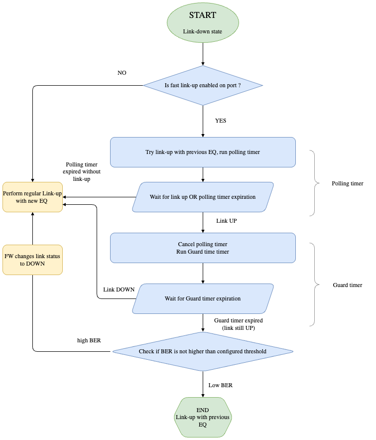

# Fast Link-Up
-------------------------------------------------------------------------------
 Title       | Fast Link-Up
-------------|-----------------------------------------------------------------
 Authors     | Eddy Kvetny, Nvidia
 Status      | In review
 Type        | Standards track
 Created     | 2025-09-09
 SAI-Version | 1.17
-------------------------------------------------------------------------------

# 1. Overview
In some cases the equalization parameters from the previous session can be used for a new link-up process. It can significantly reduce time of the Link-Up process

# 2. Scope
This approach is applicable to devices (switch-to-switch or switch-to-NIC) supporting this process, usually from the same vendor or from different vendors aligned on the process.

Can be applied to cold/fast boot or link recovery flows (vendor decision)

# 3. Architecture
This feature shall be enabled per-port using a new SAI attribute - SAI_PORT_ATTR_FAST_LINKUP_ENABLED (default status - disabled/false)

On ports with the enabled feature the ASIC FW shall try first to bring a link up using the equalization parameter stored from the previous successul session. The time given to ASIC to try to bring a link up with the old EQ parameters is limited by the Fast Link-Up Polling Timer. The time value is configured using a new SAI attribute - SAI_SWITCH_ATTR_FAST_LINKUP_POLLING_TIMEOUT. The supported range for this value (in secs) can be read by NOS using a new SAI attribute  SAI_SWITCH_ATTR_FAST_LINKUP_POLLING_TIMEOUT_RANGE

If the process of brining a link up with the previosly used EQ parameters doesn't succeed the regular link-up process is triggered

If the link succeeds moving to the Operation UP state then the BER level shall be checked to make sure that the establish link has a good quality. To do that another timer called Guard Timer is used. Its value is also configurable using a new SAI attribute (SAI_SWITCH_ATTR_FAST_LINKUP_GUARD_TIMEOUT)

When the Guard Timer expires the BER is measured and compared with the "good" BER value configured using a new SAI attribure SAI_SWITCH_ATTR_FAST_LINKUP_BER_THRESHOLD. Only if the measured BER is equal or better than the configured BER threshold the process is considered completed. Otherwise, the fallback to the regular link-up process is done and link's Oper status changes to DOWN

If the remote side doesn't support the Fast Link-up then the fallback to regular process will happen

Note that the State Machine is implemented by ASIC FW and can vary between vendors. The proposal just defines just high level flow and SAI configuration for this flow

The following State Machine is proposed for the Fast Link-UP process described above

