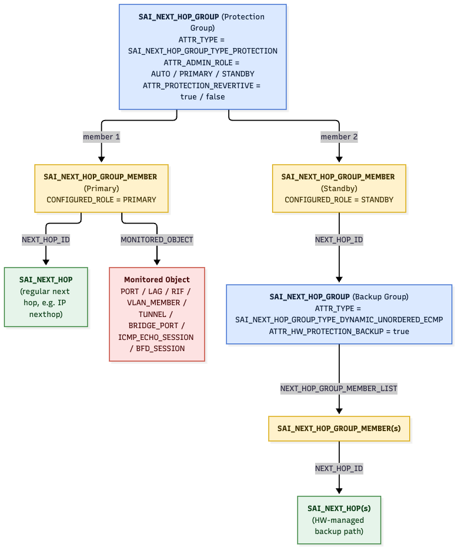
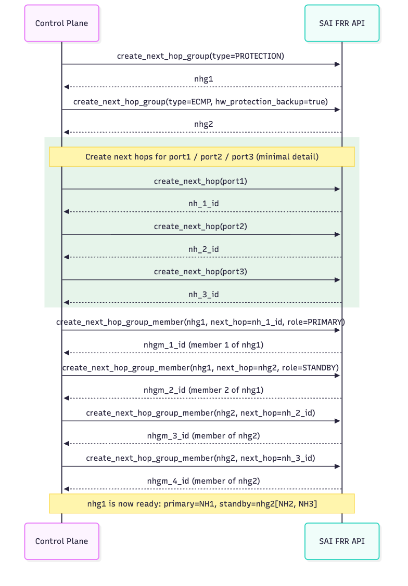

# HW Based FRR
-------------------------------------------------------------------------------
 Title       | HW Based Fast Re-Route
-------------|-----------------------------------------------------------------
 Authors     | Jai Kumar (Broadcom Inc.)
 Status      | In review
 Type        | Standards track
 Created     | 2024-09-19
 SAI-Version | 1.15
-------------------------------------------------------------------------------

## 1.0  Introduction

SAI specification provides a mechanism to configure FRR (Fast Re-Route) for next hop groups with both
- Software based switchover
- Hardware based switchover

Following is the current SAI workflow for SW based FRR.
- Create a protection NH
```c
nhg_entry_attrs[0].id = SAI_NEXT_HOP_GROUP_ATTR_TYPE;
nhg_entry_attrs[0].value.u32 = SAI_NEXT_HOP_GROUP_TYPE_PROTECTION;
```

- Create primary and secondary members (Note members can be NHG as well)
```c
// Primary
nhgm_entry_attrs[2].id = SAI_NEXT_HOP_GROUP_MEMBER_ATTR_CONFIGURED_ROLE;
nhgm_entry_attrs[2].value.u32 = SAI_NEXT_HOP_GROUP_MEMBER_CONFIGURED_ROLE_PRIMARY;
// Standby
nhgm_entry_attrs[2].id = SAI_NEXT_HOP_GROUP_MEMBER_ATTR_CONFIGURED_ROLE;
nhgm_entry_attrs[2].value.u32 = SAI_NEXT_HOP_GROUP_MEMBER_CONFIGURED_ROLE_STANDBY;
```

- Based on the monitoring object, SW sets the following boolean to trigger switchover
```c
nhg_entry_attrs[1].id = SAI_NEXT_HOP_GROUP_ATTR_SET_SWITCHOVER;
nhg_entry_attrs[1].value.u32 = true;
saistatus = sai_set_next_hop_group_attribute_fn(nhg_id, nhg_entry_attrs);
```

## 2.0 HW Based Trigger
HW monitors the configured object and triggers the switch to standby path based on the state of the monitored object.
For example if a port is being monitored and port goes down then all the NH resolving via this port will be switched over to the secondary path.

## 3.0 SAI Enhancements
Hardware needs a hint to identify a next hop group that will be used as the standby member of a protection group in AUTO mode.

What makes the switchover autonomous is the monitored object. Configuring `SAI_NEXT_HOP_GROUP_MEMBER_ATTR_MONITORED_OBJECT` on the primary member is what tells the switching entity to watch that object and move traffic to the standby member on its own. With no monitored object configured the switchover stays with the control plane, so no further attribute is needed to select between the two.

The hint is provided using a new next hop group attribute:
```c
    /**
     * @brief Next hop group is a backup of a protection group
     *
     * Hint to hardware that this group is going to be added as a standby
     * member of a SAI_NEXT_HOP_GROUP_TYPE_PROTECTION group, to be used when
     * AUTO mode is used.
     *
     * This supersedes SAI_NEXT_HOP_GROUP_TYPE_HW_PROTECTION, and allows
     * #SAI_NEXT_HOP_GROUP_ATTR_TYPE to state how traffic is spread across the
     * members of this group.
     *
     * @type bool
     * @flags CREATE_ONLY
     * @default false
     * @isresourcetype true
     */
    SAI_NEXT_HOP_GROUP_ATTR_HW_PROTECTION_BACKUP,
```

This attribute deprecates the NHG type that used to carry the hint
```c
    /** Next hop hardware protection group. This is the group backing up the primary in the protection group type and is managed by hardware */
    SAI_NEXT_HOP_GROUP_TYPE_HW_PROTECTION,
```

A group carries a single type, so spending it on the hint left the backup group with no way to state how traffic is spread across its own members, which is exactly what an ECMP backup group needs to express. The type also could not carry the hint at all when the standby member is a single next hop, since there is no group and therefore no group type to set. As an attribute the hint is independent of both.

Additionally port counters are introduced to capture 
- How many times port has participated in the failover
- Drops observed during failover

```c
    /** SAI port stat if HW protection switchover events */
    SAI_PORT_STAT_IF_IN_HW_PROTECTION_SWITCHOVER_EVENTS,

    /** SAI port stat if HW protection switchover related packet drops */
    SAI_PORT_STAT_IF_IN_HW_PROTECTION_SWITCHOVER_DROP_PKTS,
```

### SAI Object Model



A Next Hop Group of type `SAI_NEXT_HOP_GROUP_TYPE_PROTECTION` has two members: a primary
member pointing to a regular `SAI_NEXT_HOP` with a `MONITORED_OBJECT` configured, and a
standby member pointing to an ECMP Next Hop Group created with
`SAI_NEXT_HOP_GROUP_ATTR_HW_PROTECTION_BACKUP` set to true (the group hardware switches to once the
monitored object fails).

## 4.0 Example Workflow


### Topology Example
There are three uplinks from a switch, one carrying the primary path and the other two making up the secondary group.
For such case we will
- Create a NHG nhg1 of type PROTECTION and configure NH1/port1 as primary member
- Create a NHG nhg2 of type ECMP with HW_PROTECTION_BACKUP set to true and with members as NH2/port2 and NH3/port3
- Set NHG nhg2 as a standby member of NHG nhg1

PROTECTION[nhg1] --> PRIMARY[NH1], SECONDARY[nhg2]
ECMP + HW_PROTECTION_BACKUP[nhg2] --> [NH2, NH3]

### Creation Sequence



```c
nh_1_interface_id = 1;   // port1
nh_2_interface_id = 2;   // port2
nh_3_interface_id = 3;   // port3
port_1_id = <oid of port1>;
switch_id = 0;

// Create the Protection NHG (nhg1)
nhg_entry_attrs[0].id = SAI_NEXT_HOP_GROUP_ATTR_TYPE;
nhg_entry_attrs[0].value.u32 = SAI_NEXT_HOP_GROUP_TYPE_PROTECTION;
saistatus = sai_frr_api->create_next_hop_group(&nhg1, switch_id, 1, nhg_entry_attrs);
if (saistatus != SAI_STATUS_SUCCESS) {
    return saistatus;
}

// Create the backup NHG (nhg2). It keeps an ECMP type to describe how traffic is
// spread across its members, and is marked as the backup of a protection group.
nhg_entry_attrs[0].id = SAI_NEXT_HOP_GROUP_ATTR_TYPE;
nhg_entry_attrs[0].value.u32 = SAI_NEXT_HOP_GROUP_TYPE_DYNAMIC_UNORDERED_ECMP;
nhg_entry_attrs[1].id = SAI_NEXT_HOP_GROUP_ATTR_HW_PROTECTION_BACKUP;
nhg_entry_attrs[1].value.booldata = true;
saistatus = sai_frr_api->create_next_hop_group(&nhg2, switch_id, 2, nhg_entry_attrs);
if (saistatus != SAI_STATUS_SUCCESS) {
    return saistatus;
}

// Create NH1/port1
nh_entry_attrs[0].id = SAI_NEXT_HOP_ATTR_TYPE;
nh_entry_attrs[0].value.u32 = SAI_NEXT_HOP_TYPE_IP;
nh_entry_attrs[1].id = SAI_NEXT_HOP_ATTR_IP;
CONVERT_STRING_TO_SAI_IPV4(nh_entry_attrs[1].value, "10.1.1.1");
nh_entry_attrs[2].id = SAI_NEXT_HOP_ATTR_ROUTER_INTERFACE_ID;
nh_entry_attrs[2].value.u64 = nh_1_interface_id;
saistatus = sai_frr_api->create_next_hop(&nh_1_id, switch_id, 3, nh_entry_attrs);
if (saistatus != SAI_STATUS_SUCCESS) {
    return saistatus;
}

// Create NH2/port2
nh_entry_attrs[0].id = SAI_NEXT_HOP_ATTR_TYPE;
nh_entry_attrs[0].value.u32 = SAI_NEXT_HOP_TYPE_IP;
nh_entry_attrs[1].id = SAI_NEXT_HOP_ATTR_IP;
CONVERT_STRING_TO_SAI_IPV4(nh_entry_attrs[1].value, "10.1.2.1");
nh_entry_attrs[2].id = SAI_NEXT_HOP_ATTR_ROUTER_INTERFACE_ID;
nh_entry_attrs[2].value.u64 = nh_2_interface_id;
saistatus = sai_frr_api->create_next_hop(&nh_2_id, switch_id, 3, nh_entry_attrs);
if (saistatus != SAI_STATUS_SUCCESS) {
    return saistatus;
}

// Create NH3/port3
nh_entry_attrs[0].id = SAI_NEXT_HOP_ATTR_TYPE;
nh_entry_attrs[0].value.u32 = SAI_NEXT_HOP_TYPE_IP;
nh_entry_attrs[1].id = SAI_NEXT_HOP_ATTR_IP;
CONVERT_STRING_TO_SAI_IPV4(nh_entry_attrs[1].value, "10.1.3.1");
nh_entry_attrs[2].id = SAI_NEXT_HOP_ATTR_ROUTER_INTERFACE_ID;
nh_entry_attrs[2].value.u64 = nh_3_interface_id;
saistatus = sai_frr_api->create_next_hop(&nh_3_id, switch_id, 3, nh_entry_attrs);
if (saistatus != SAI_STATUS_SUCCESS) {
    return saistatus;
}

// Program member 1 of nhg1: primary member, NH1/port1. The monitored object is
// what makes hardware switch over to the standby member on its own.
nhgm_entry_attrs[0].id = SAI_NEXT_HOP_GROUP_MEMBER_ATTR_NEXT_HOP_GROUP_ID;
nhgm_entry_attrs[0].value.oid = nhg1;
nhgm_entry_attrs[1].id = SAI_NEXT_HOP_GROUP_MEMBER_ATTR_NEXT_HOP_ID;
nhgm_entry_attrs[1].value.oid = nh_1_id;
nhgm_entry_attrs[2].id = SAI_NEXT_HOP_GROUP_MEMBER_ATTR_CONFIGURED_ROLE;
nhgm_entry_attrs[2].value.u32 = SAI_NEXT_HOP_GROUP_MEMBER_CONFIGURED_ROLE_PRIMARY;
nhgm_entry_attrs[3].id = SAI_NEXT_HOP_GROUP_MEMBER_ATTR_MONITORED_OBJECT;
nhgm_entry_attrs[3].value.oid = port_1_id;
saistatus = sai_frr_api->create_next_hop_group_member(&nhgm_1_id, switch_id, 4, nhgm_entry_attrs);
if (saistatus != SAI_STATUS_SUCCESS) {
    return saistatus;
}

// Program member 2 of nhg1: standby member, nhg2 (backup group)
nhgm_entry_attrs[0].id = SAI_NEXT_HOP_GROUP_MEMBER_ATTR_NEXT_HOP_GROUP_ID;
nhgm_entry_attrs[0].value.oid = nhg1;
nhgm_entry_attrs[1].id = SAI_NEXT_HOP_GROUP_MEMBER_ATTR_NEXT_HOP_ID;
nhgm_entry_attrs[1].value.oid = nhg2;
nhgm_entry_attrs[2].id = SAI_NEXT_HOP_GROUP_MEMBER_ATTR_CONFIGURED_ROLE;
nhgm_entry_attrs[2].value.u32 = SAI_NEXT_HOP_GROUP_MEMBER_CONFIGURED_ROLE_STANDBY;
saistatus = sai_frr_api->create_next_hop_group_member(&nhgm_2_id, switch_id, 3, nhgm_entry_attrs);
if (saistatus != SAI_STATUS_SUCCESS) {
    return saistatus;
}

// Program the members of nhg2 (backup group): NH2/port2 and NH3/port3
nhgm_entry_attrs[0].id = SAI_NEXT_HOP_GROUP_MEMBER_ATTR_NEXT_HOP_GROUP_ID;
nhgm_entry_attrs[0].value.oid = nhg2;
nhgm_entry_attrs[1].id = SAI_NEXT_HOP_GROUP_MEMBER_ATTR_NEXT_HOP_ID;
nhgm_entry_attrs[1].value.oid = nh_2_id;
saistatus = sai_frr_api->create_next_hop_group_member(&nhgm_3_id, switch_id, 2, nhgm_entry_attrs);
if (saistatus != SAI_STATUS_SUCCESS) {
    return saistatus;
}

nhgm_entry_attrs[0].id = SAI_NEXT_HOP_GROUP_MEMBER_ATTR_NEXT_HOP_GROUP_ID;
nhgm_entry_attrs[0].value.oid = nhg2;
nhgm_entry_attrs[1].id = SAI_NEXT_HOP_GROUP_MEMBER_ATTR_NEXT_HOP_ID;
nhgm_entry_attrs[1].value.oid = nh_3_id;
saistatus = sai_frr_api->create_next_hop_group_member(&nhgm_4_id, switch_id, 2, nhgm_entry_attrs);
if (saistatus != SAI_STATUS_SUCCESS) {
    return saistatus;
}
```

## 5.0 Per-Monitored-Object Switchover Notification

To provide NOS visibility for HW-triggered FRR, add a switch-level notification callback.
Notification is generated per monitored object, and one monitored object may point to multiple protection groups.

### Notification

```c
typedef struct _sai_next_hop_group_hw_protection_switchover_notification_data_t
{
    sai_object_id_t monitored_oid;     // monitored object id
    sai_next_hop_group_member_observed_role_t new_role // Current role after the switchover
    uint32_t        switchover_success_count;  // number of protection groups switched successfully
    sai_object_list_t failed_next_hop_groups; // failed protection-group object ids
} sai_next_hop_group_hw_protection_switchover_notification_data_t;

typedef void (*sai_next_hop_group_hw_protection_switchover_notification_fn)(
        _In_ uint32_t count,
        _In_ const sai_next_hop_group_hw_protection_switchover_notification_data_t *data);
```

### Switch attribute for callback registration

```c
SAI_SWITCH_ATTR_NEXT_HOP_GROUP_HW_PROTECTION_SWITCHOVER_NOTIFY
```

### Usage example

```c
switch_attr.id = SAI_SWITCH_ATTR_NEXT_HOP_GROUP_HW_PROTECTION_SWITCHOVER_NOTIFY;
switch_attr.value.ptr = (void*)nhg_hw_protection_switchover_cb;
sai_switch_api->set_switch_attribute(switch_id, &switch_attr);
```

Example callback report:
```c
  monitored_oid = <monitored_object_oid>
  new_role = SAI_NEXT_HOP_GROUP_MEMBER_CONFIGURED_ROLE_STANDBY
  switchover_success_count = 5
  failed_next_hop_groups.count = 2
  failed_next_hop_groups.list[0] = failed_nhg_oid1
  failed_next_hop_groups.list[1] = failed_nhg_oid2
```
In this example, `switchover_success_count = 5` means five protection groups switched over successfully
for the monitored object, while `failed_next_hop_groups.count = 2` means two protection groups failed.
