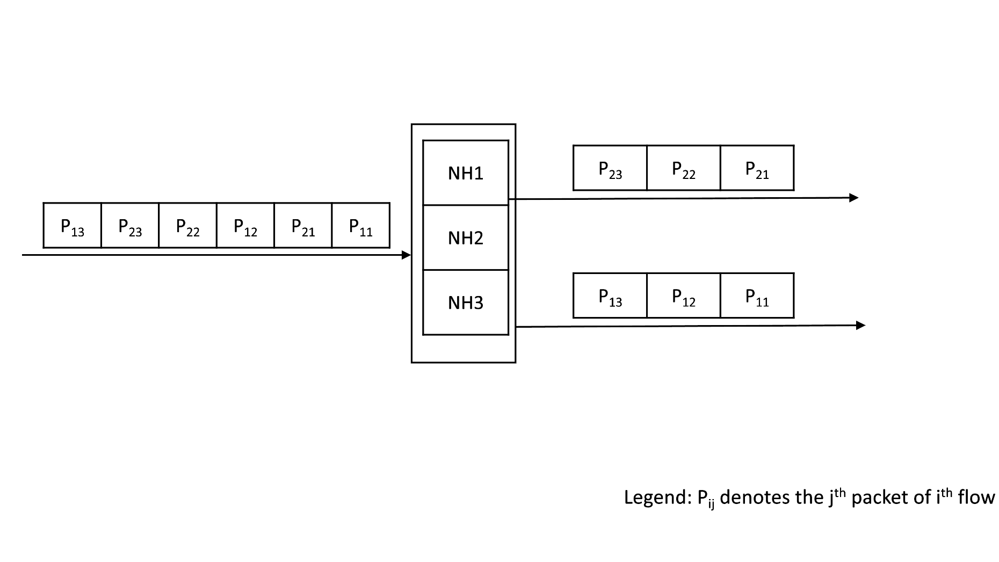
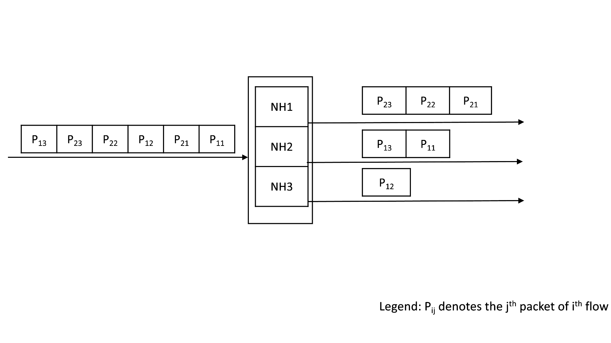
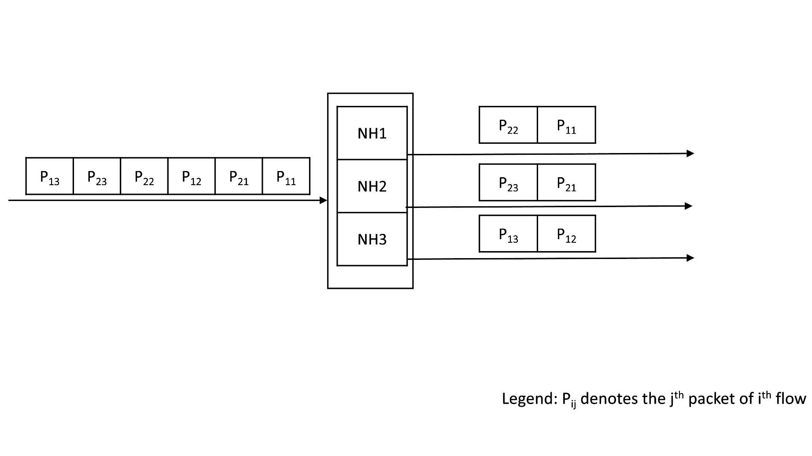
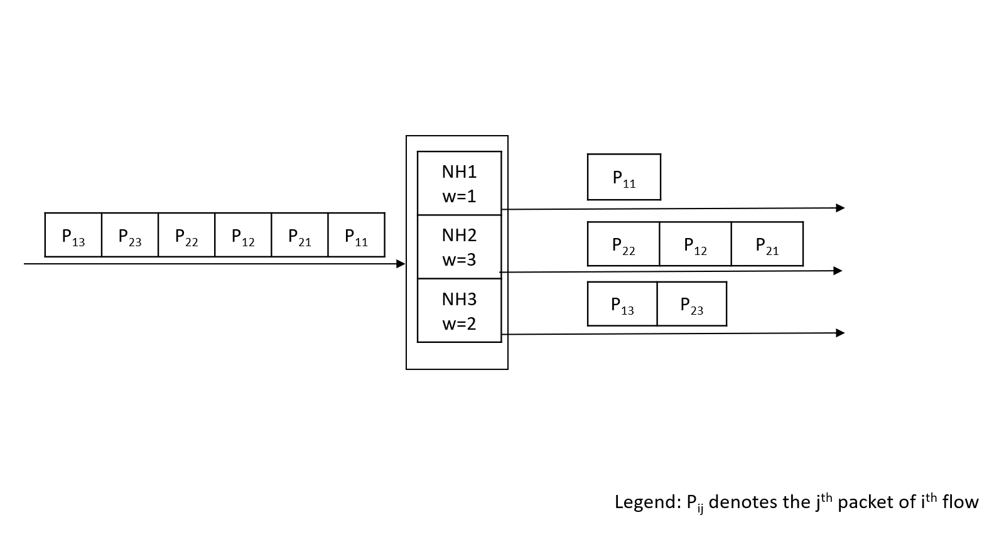

# [SAI] Round-robin Hash Algorithm
-------------------------------------------------------------------------------
 Title       |  Round-robin Hash Algorithm
-------------|-----------------------------------------------------------------
 Authors     | Dhruvkumar Kadia, Ravindranath C K (Marvell)
 Status      | In review
 Type        | Standards track
 Created     | 2024-09-19
 SAI-Version | 1.16
-------------------------------------------------------------------------------

## 1.0  Introduction

ECMP or Next hop groups (NHG) and LAG use load balancing techniques to spread the traffic across the various members. The most common load balancing technique is to use hash-based member selection. In this technique, flows are identified by performing a hash on a set of packet fields like the 5-tuple, and then selecting the group member based on the computed hash value.
This technique has been traditionally used since it:
 1) ensures packet ordering (since packets of a given flow are always sent out on the same member), and 
 2) is stateless.

This proposal introduces the new hash algorithm Round-robin.

## 2.0  Behavior

### Existing hash based member selection
For every packet hitting the ECMP/LAG, the egress member is selected based on the computed hash value.


### Existing random member selection
For every packet hitting the ECMP/LAG, the egress member is randomly selected.


Unlike ARS modes like SAI_ARS_MODE_PER_PACKET_RANDOM, the static member selection modes do not adapt based on the member link status.

### Round-robin member selection
For every packet hitting the ECMP/LAG, the egress member is selected in round robin mode.


#### Interaction with weighted ECMP
For every packet hitting the ECMP/LAG, the egress member is selected in round robin mode considering the weights of member.


## 3.0 SAI Enhancement

A new enums are added to the sai_hash_algorithm_t
New attributes are introduced in the NHG and LAG to allow the user to configure hash algorithm.
Further, an ACL action is introduced to set the hash algorithm.

1) Enum defining the hash algorithm none and round-robin :
   ```c
   /**
   * @brief Attribute data for #SAI_SWITCH_ATTR_ECMP_DEFAULT_HASH_ALGORITHM
   * and #SAI_SWITCH_ATTR_LAG_DEFAULT_HASH_ALGORITHM
   */
   typedef enum _sai_hash_algorithm_t
   {
      ...
      /** Hash algorithm not set */
      SAI_HASH_ALGORITHM_NONE = 7,

      /** Round-robin based hash algorithm (per-packet round-robin spraying) */
      SAI_HASH_ALGORITHM_ROUND_ROBIN = 8,

   } sai_hash_algorithm_t;
   ```
2) Attributes for ECMP and LAG to set the hash algorithm:
   ```c
   /**
   * @brief Attribute id for next hop
   */
   typedef enum _sai_next_hop_group_attr_t
   {
      ...
      /**
      * @brief Next hop group hash algorithm
      * Overrides value of SAI_SWITCH_ATTR_ECMP_DEFAULT_HASH_ALGORITHM if not set to SAI_HASH_ALGORITHM_NONE
      *
      * @type sai_hash_algorithm_t
      * @flags CREATE_ONLY
      * @default SAI_HASH_ALGORITHM_NONE
      * @validonly SAI_NEXT_HOP_GROUP_ATTR_TYPE == SAI_NEXT_HOP_GROUP_TYPE_DYNAMIC_UNORDERED_ECMP or SAI_NEXT_HOP_GROUP_ATTR_TYPE == SAI_NEXT_HOP_GROUP_TYPE_DYNAMIC_ORDERED_ECMP
      */
      SAI_NEXT_HOP_GROUP_ATTR_HASH_ALGORITHM,
      ...
   } sai_next_hop_group_attr_t;
   ```

   ```c
   /**
   * @brief LAG attribute: List of attributes for LAG object
   */
   typedef enum _sai_lag_attr_t
   {
      ...
      /**
      * @brief LAG hash algorithm
      * Overrides value of SAI_SWITCH_ATTR_LAG_DEFAULT_HASH_ALGORITHM if not set to SAI_HASH_ALGORITHM_NONE
      *
      * @type sai_hash_algorithm_t
      * @flags CREATE_ONLY
      * @default SAI_HASH_ALGORITHM_NONE
      */
      SAI_LAG_ATTR_HASH_ALGORITHM,
      ...
   } sai_lag_attr_t;
   ```
3) ACL action:
   ```c
   /**
      * @brief ACL Action Type
      */
      typedef enum _sai_acl_action_type_t
      {
         ...
         /** Set ECMP hash algorithm */
         SAI_ACL_ACTION_TYPE_SET_ECMP_HASH_ALGORITHM = 0x0000003c,

      } sai_acl_action_type_t;
   
   /**
   * @brief Attribute Id for sai_acl_entry
   *
   * @flags ranges
   */
   typedef enum _sai_acl_entry_attr_t
   {
    ...
    /**
     * @brief Set ECMP hash algorithm
     *
     * @type sai_acl_action_data_t  sai_hash_algorithm_t
     * @flags CREATE_AND_SET
     * @default disabled
     */
    SAI_ACL_ENTRY_ATTR_ACTION_SET_ECMP_HASH_ALGORITHM = SAI_ACL_ENTRY_ATTR_ACTION_START + 0x3c,

    /**
     * @brief End of Rule Actions
     */
    SAI_ACL_ENTRY_ATTR_ACTION_END = SAI_ACL_ENTRY_ATTR_ACTION_SET_ECMP_HASH_ALGORITHM,
    ...
   } sai_acl_entry_attr_t;
   ```

## 4.0 API Example

###  Create Switch
```c
...(Existing Attribute)
sai_attr_list[attr_count].id = SAI_SWITCH_ATTR_ECMP_DEFAULT_HASH_ALGORITHM;
sai_attr_list[attr_count++].value.u32 = SAI_HASH_ALGORITHM_RANDOM;
sai_create_switch_fn(
   &switch_id,
   attr_count,
   sai_attr_list);
```

###  Create Next Hop Group

```c
...(Existing Attribute)
sai_attr_list[attr_count].id = SAI_NEXT_HOP_GROUP_ATTR_HASH_ALGORITHM;
sai_attr_list[attr_count++].value.u32 = SAI_HASH_ALGORITHM_ROUND_ROBIN;

sai_create_next_hop_group_fn(
   &nhg_oid,
   switch_id,
   attr_count,
   sai_attr_list);
```

### Create LAG

```c
...(Existing Attribute)
sai_attr_list[attr_count].id = SAI_LAG_ATTR_HASH_ALGORITHM;
sai_attr_list[attr_count++].value.u32 = SAI_HASH_ALGORITHM_ROUND_ROBIN;

sai_create_lag_fn(
   &lag_oid,
   switch_id,
   attr_count,
   sai_attr_list);
```
### Create ACL table
   ```c
   count = 0;
   sai_attr_list[count].id = SAI_ACL_TABLE_ATTR_ACL_STAGE;
   sai_attr_list[count++].value.u32 = SAI_ACL_STAGE_INGRESS;
   sai_attr_list[count].id = SAI_ACL_TABLE_ATTR_FIELD_DST_IP;
   sai_attr_list[count++].value.booldata = 1;
   action_attr_list[0] = SAI_ACL_ACTION_TYPE_SET_ECMP_HASH_ALGORITHM;
   sai_action_attr_list.list = action_attr_list;
   sai_action_attr_list.count = 1;
   sai_attr_list[count].id = SAI_ACL_TABLE_ATTR_ACL_ACTION_TYPE_LIST;
   sai_attr_list[count++].value.s32list = sai_action_attr_list;
   attr_count = count;
   sai_create_acl_table_fn(
      &acl_table_id, 
      switch_id,
      attr_count,
      sai_attr_list);
   ```

### Create ACL entry
   ```c   
   count=0;
   sai_attr_list[count].id = SAI_ACL_ENTRY_ATTR_TABLE_ID;
   sai_attr_list[count++].value.oid = acl_table_id;
   sai_attr_list[count].id = SAI_ACL_ENTRY_ATTR_FIELD_DST_IP;
   sai_attr_list[count++].value.aclfield.data.ip4 = 0x0a000002;
   sai_attr_list[count].id = SAI_ACL_ENTRY_ATTR_ACTION_SET_ECMP_HASH_ALGORITHM;
   sai_attr_list[count++].value.aclfield.data.u32 = SAI_HASH_ALGORITHM_ROUND_ROBIN;
   sai_create_acl_entry_fn(
      &acl_entry_id,
      switch_id,
      attr_count,
      sai_attr_list);
   ```
