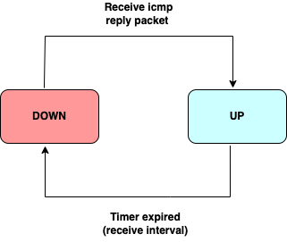

#  ICMP ECHO offload
-------------------------------------------------------------------------------
 Title       | ICMP ECHO offload
-------------|-----------------------------------------------------------------
 Authors     | Chikkegowda Chikkaiah, Cisco
 Status      | In review
 Type        | Standards track
 Created     | 2024-01-1 - Initial Draft
 SAI-Version | 1.12
-------------------------------------------------------------------------------


## 1.0  Introduction

The traditional use of ICMP-based link prober is to identify link failures. This prober sends ICMP echo packets, receives any ICMP echo replies, and reports the detection results.

When control plane application carries out the link probe (software link failure detection), the system operates at a slow, periodic exchange of probe requests and replies since it uses the kernel network stack to send and receive control packets. This may prolong link failure detection. To decrease this detection interval, the application could utilize the HW/ASIC to send and receive link probe packets at a quicker rate.

The objective of this document is to propose a SAI specification to simplify the ICMP-based probe as a basic service. The service primitives offered by ICMP echo include creating, destroying, and modifying a session, considering the destination address and other parameters. In response, ICMP Echo sends a signal to its clients when the ICMP Echo session starts or stops.

This specification suggests:
- The idea of an ICMP echo object or session that can be transferred to HW/ASIC or other modules for faster link detection.
- The introduction of SAI APIs to outline ICMP echo session properties.
- The introduction of a switch-level notification API to monitor changes in ICMP echo session states.


## 1.1.0 Functional requirements of ICMP echo session
- Transmit ICMP echo requests (probes) at regular, configurable intervals.
- Identify and report changes in probe state to the control plane application.
- Enable applications to set customized transmit and receive intervals.
- Allow configuration of IP encapsulation parameters.
- Establish a unique identification for each probing session.
- Determine whether an offloaded session should process ICMP probing packets.
- Offer statistics on ICMP echo probe and reply activities.

## 2.0 Protocol overview and ICMP echo session
ICMP echo is simple network link connectivity test protocol, similar to that most of the L3 routing protocols. ICMP Echo session runs between pair of devices exchanging ICMP echo request and reply packets. This protocol is used in SONiC sofware link prober and described in [linkmgrd](https://github.com/sonic-net/SONiC/blob/master/doc/dualtor/active_active_hld.md#33-linkmgrd)

### 2.1.0 ICMP echo request and reply packet ###

```C
    0                   1                   2                   3
    0 1 2 3 4 5 6 7 8 9 0 1 2 3 4 5 6 7 8 9 0 1 2 3 4 5 6 7 8 9 0 1
   +-+-+-+-+-+-+-+-+-+-+-+-+-+-+-+-+-+-+-+-+-+-+-+-+-+-+-+-+-+-+-+-+
   |     Type      |     Code      |          Checksum             |
   +-+-+-+-+-+-+-+-+-+-+-+-+-+-+-+-+-+-+-+-+-+-+-+-+-+-+-+-+-+-+-+-+
   |           Identifier          |        Sequence Number        |
   +-+-+-+-+-+-+-+-+-+-+-+-+-+-+-+-+-+-+-+-+-+-+-+-+-+-+-+-+-+-+-+-+
   |     Data ...
   +-+-+-+-+-

- Type
    8 echo request message (outgoing)
    0 echo response message (incoming)

```

### 2.2.0 ICMP echo payload packet ###

Besides the ICMP echo request and reply packets, additional information about the ICMP echo session is essential and is transmitted within the payload. The payload format used by the SONiC link prober is outlined below:

```C
    0                   1                   2                   3
   0 1 2 3 4 5 6 7 8 9 0 1 2 3 4 5 6 7 8 9 0 1 2 3 4 5 6 7 8 9 0 1
   +-+-+-+-+-+-+-+-+-+-+-+-+-+-+-+-+-+-+-+-+-+-+-+-+-+-+-+-+-+-+-+-+
   |                           Cookie                              |
   +-+-+-+-+-+-+-+-+-+-+-+-+-+-+-+-+-+-+-+-+-+-+-+-+-+-+-+-+-+-+-+-+
   |                           Version                             |
   +-+-+-+-+-+-+-+-+-+-+-+-+-+-+-+-+-+-+-+-+-+-+-+-+-+-+-+-+-+-+-+-+
   |                           GUID(MSB)                           |
   +-+-+-+-+-+-+-+-+-+-+-+-+-+-+-+-+-+-+-+-+-+-+-+-+-+-+-+-+-+-+-+-+
   |                           GUID(LSB)                           |
   +-+-+-+-+-+-+-+-+-+-+-+-+-+-+-+-+-+-+-+-+-+-+-+-+-+-+-+-+-+-+-+-+
   |                                                               |
   +-+-+-+-+-+-+-+-+-+-+-+-+ Sequence Number +-+-+-+-+-+-+-+-+-+-+-+
   |                                                               |
   +-+-+-+-+-+-+-+-+-+-+-+-+-+-+-+-+-+-+-+-+-+-+-+-+-+-+-+-+-+-+-+-+
   |TLV Type       |   TLV Length (0)                  |           |
   +-+-+-+-+-+-+-+-+-+-+-+-+-+-+-+-+-+-+-+-+-+-+-+-+-+-+-+-+-+-+-+-+:

- Cookie
    4B, processing of this filed is imepplemtation specific.
- Version
    4B, set to 0
- GUID MSB
    4B, The probing session unique identifier
- GUID LSB
    4B, The probing session unique identifier
- Sequence Number
    8B, processing of this filed is implementation specific.
- TLV Type
    1B, SENTINAL: 0xFF
- TLV Length
    2B, set to 0

```
***GUID:*** Global unique identifier for the ICMP echo session to correlate probe and reply packets with a session, especially when the session is offloaded to hardware, a unique identifier is required.

***Session Cookie:*** The offloading engine interprets this value to decide whether the packet should undergo processing by the ICMP echo session or not. Packets not matching the cookie are punted to NOS. This can also be used to differentiate regular icmp response and icmp link monitoring response.

### 2.3.0 ICMP Echo Session State ###

If a targeted device does not respond to an ICMP echo request within the detection time period, the link is marked "DOWN", If an ICMP echo response is subsequently received, the link is marked "UP".


__Figure 1: ICMP echo state machine.__


## 3.0 Specification ##

### sai.h ###
New type SAI_API_ICMP_ECHO is added into sai_api_t

### saiswitch.h ###

New attribute SAI_SWITCH_ATTR_ICMP_ECHO_SESSION_STATE_CHANGE_NOTIFY is added into sai_switch_attr_t


### New Header saiicmpecho.h ###

#### sai_icmp_echo_session_state_t ####
This enumeration is used to represent the possible states of an ICMP echo session

SAI_ICMP_ECHO_SESSION_DOWN: Signifies that the ICMP echo session has not received an ICMP echo reply packet within the designated receive interval period.

SAI_ICMP_ECHO_SESSION_UP: Denotes that the ICMP echo session consistently receives ICMP echo reply packets within the specified receive interval period.

#### sai_icmp_echo_session_state_notification_t ###
This defines state change notification fields

icmp_echo_session_id:  Identifies the ICMP echo session related to the state change notification.

session_state: Reflects the operational state of the ICMP echo session, which can be either SAI_ICMP_ECHO_SESSION_UP or SAI_ICMP_ECHO_SESSION_DOWN.

#### sai_icmp_echo_session_attr_t ####
This defines icmp echo session attributes. These attributes collectively define the configuration and behavior of ICMP echo sessions in the SAI framework.

- SAI_ICMP_ECHO_SESSION_ATTR_HW_LOOKUP_VALID: A boolean value where true indicates that the device routes the generated packet to outgoing port and false indicates that the packet is injected as is to the specified Port.

- SAI_ICMP_ECHO_SESSION_ATTR_VIRTUAL_ROUTER: The virtual router identifier. Only revelant when SAI_ICMP_ECHO_SESSION_ATTR_HW_LOOKUP_VALID is true.

- SAI_ICMP_ECHO_SESSION_ATTR_PORT: Represents the destination port for ICMP echo sessions, with conditions based on hardware lookup validity. The generated packets are sent out on this port.

- SAI_ICMP_ECHO_SESSION_ATTR_RX_PORT: Represents the source port for ICMP echo sessions where the imcoming packets are expected to be received.

- SAI_ICMP_ECHO_SESSION_ATTR_GUID: Global unique identifier for the ICMP echo session, mandatory during creation.

- SAI_ICMP_ECHO_SESSION_ATTR_COOKIE: Cookie value associated with the ICMP echo session, mandatory and settable during creation.

- SAI_ICMP_ECHO_SESSION_ATTR_TOS: Sets the IP header Type of Service (TOS) value, with a default of 0.

- SAI_ICMP_ECHO_SESSION_ATTR_TTL: Configures the IP header Time to Live (TTL), with a default value of 255.

- SAI_ICMP_ECHO_SESSION_ATTR_IPHDR_VERSION: Specifies the IP header version, mandatory during creation.

- SAI_ICMP_ECHO_SESSION_ATTR_SRC_IP_ADDRESS: Defines the source IP address, mandatory and settable during creation.

- SAI_ICMP_ECHO_SESSION_ATTR_DST_IP_ADDRESS: Specifies the destination IP address, mandatory and settable during creation.

- SAI_ICMP_ECHO_SESSION_ATTR_SRC_MAC_ADDRESS: Sets the L2 source MAC address, mandatory and settable during creation, with conditions on hardware lookup validity.

- SAI_ICMP_ECHO_SESSION_ATTR_DST_MAC_ADDRESS: Configures the L2 destination MAC address, mandatory and settable during creation, with conditions on hardware lookup validity.

- SAI_ICMP_ECHO_SESSION_ATTR_TX_INTERVAL: Defines the transmit interval in microseconds for echo request packets, mandatory and settable during creation.

- SAI_ICMP_ECHO_SESSION_ATTR_RX_INTERVAL: Specifies the receive interval in microseconds for echo reply, mandatory and settable during creation.

- SAI_ICMP_ECHO_SESSION_ATTR_SET_NEXT_HOP_GROUP_SWITCHOVER: If enabled, automatically switch from the primary to the backup next hop on a session state change. This requires next hop group of type SAI_NEXT_HOP_GROUP_TYPE_PROTECTION to be configured with the primary-backup pair and icmp echo session object as the monitored object. 

- SAI_ICMP_ECHO_SESSION_ATTR_STATE: Indicates the operational state of the ICMP echo session, read-only.


#### sai_icmp_echo_session_stat_t ####

This enum type represents the counter IDs used in the sai_get_icmp_echo_session_stats() call for ICMP ECHO sessions. it has two members:

- SAI_ICMP_ECHO_SESSION_STAT_IN_PACKETS: Represents the counter for the number of ingress (incoming) packets in the ICMP ECHO session.

- SAI_ICMP_ECHO_SESSION_STAT_OUT_PACKETS: Represents the counter for the number of egress (outgoing) packets in the ICMP ECHO session.


#### sai_create_icmp_echo_session_fn ####
This defines the interfaces to create icmp echo seesion

- icmp_echo_session_id (Out): A pointer to the variable where the created ICMP ECHO session ID will be stored.
- switch_id (In): The ID of the switch on which the ICMP ECHO session is to be created.
- attr_count (In): The number of attributes provided in the attr_list.
- attr_list (In): An array of sai_attribute_t structures containing the attribute key-value pairs to configure the ICMP ECHO session.

The function returns SAI_STATUS_SUCCESS if the operation is successful; otherwise, it returns a different error code indicating the nature of the failure.

#### sai_remove_icmp_echo_session_fn ####
This defines the interfaces to delete icmp echo seesion.
The function takes an ICMP ECHO session ID as a parameter. The function returns SAI_STATUS_SUCCESS if the operation is successful; otherwise, it returns a different error code indicating the nature of the failure.

#### sai_set_icmp_echo_session_attribute_fn ####
This defines the interfaces to update icmp echo seesion attributes. It requires the unique identifier to specify the ICMP ECHO session, and the attr parameter represents the attribute to be set along with its value. The function returns SAI_STATUS_SUCCESS if the operation is successful; otherwise, it returns an error code, indicating the nature of the failure. 

#### sai_get_icmp_echo_session_attribute_fn ####
It takes the unique identifier icmp_echo_session_id to specify the ICMP ECHO session for which attributes are to be retrieved. The attr_count parameter indicates the number of attributes in the attr_list, and the attr_list itself holds the values of the requested attributes.

If the operation is successful, the function returns SAI_STATUS_SUCCESS. Otherwise, it returns a different error code, indicating the nature of the failure. 


#### sai_get_icmp_echo_session_stats_fn #### 
This defines the interface to query session stats. 
 It takes the unique identifier icmp_echo_session_id to specify the ICMP ECHO session for which statistics are to be retrieved. The number_of_counters parameter indicates the count of counters specified in the counter_ids array. The counter_ids array specifies the particular statistics counters to retrieve, and the resulting counter values are stored in the counters array.

If the operation is successful, the function returns SAI_STATUS_SUCCESS. Otherwise, it returns a failure status code, indicating the nature of the error.

#### sai_clear_icmp_echo_session_stats_fn ####
This defines the interface to clear session stats.
It takes the unique identifier icmp_echo_session_id to specify the ICMP ECHO session for which statistics counters are to be cleared. The number_of_counters parameter indicates the count of counters specified in the counter_ids array. The counter_ids array specifies the particular statistics counters to clear.

If the operation is successful, the function returns SAI_STATUS_SUCCESS. Otherwise, it returns a failure status code, indicating the nature of the error.


#### sai_icmp_echo_session_state_change_notification_fn #### 
This is a callback function that is invoked to notify about changes in the state of ICMP ECHO sessions. This callback function is passed as a parameter during the initialization of the switch through the sai_initialize_switch() function.

The callback function takes two parameters:

- count: An integer representing the number of ICMP ECHO session state change notifications in the array.
- data: An array of sai_icmp_echo_session_state_notification_t structures, each containing information about the state change of an ICMP ECHO session.

#### sai_icmp_echo_api_t #### 
This defines the ICMP_ECHO API table
```C
/** 
 * @brief ICMP ECHO method table retrieved with sai_api_query() 
 */ 
typedef struct _sai_icmp_echo_api_t 
{ 
    sai_create_icmp_echo_session_fn            create_icmp_echo_session; 
    sai_remove_icmp_echo_session_fn            remove_icmp_echo_session; 
    sai_set_icmp_echo_session_attribute_fn     set_icmp_echo_session_attribute; 
    sai_get_icmp_echo_session_attribute_fn     get_icmp_echo_session_attribute; 
    sai_get_icmp_echo_session_stats_fn         get_icmp_echo_session_stats; 
    sai_clear_icmp_echo_session_stats_fn       clear_icmp_echo_session_stats; 

} sai_icmp_echo_api_t; 
```

### 4.0 Examples ###

#### 4.0.1 Create session using egress interface: ####
In this case SAI expects the application to tell the attributes related to encapsulation and egress physical interface.
```C
sai_api_query(SAI_API_ICMP_ECHO, &icmp_api);  // Get ICMP echo object API pointer

sai_object_id_t icmp_session = 0;
sai_attribute_t icmp_attr[10] = {0};

icmp_attr[0].id = SAI_ICMP_ECHO_SESSION_ATTR_HW_LOOKUP_VALID;
icmp_attr[0].value.booldata = false;  

icmp_attr[1].id = SAI_ICMP_ECHO_SESSION_ATTR_PORT;  
icmp_attr[1].value.oid = 0x01;

icmp_attr[2].id = SAI_ICMP_ECHO_SESSION_ATTR_GUID;
icmp_attr[2].value.s64 = 0x01;

icmp_attr[3].id = SAI_ICMP_ECHO_SESSION_ATTR_IPHDR_VERSION;
icmp_attr[3].value.u8 = ipv4;

icmp_attr[4].id = SAI_ICMP_ECHO_SESSION_ATTR_MULTIPLIER;
icmp_attr[4].value.s32 = 5;

icmp_attr[5].id = SAI_ICMP_ECHO_SESSION_ATTR_SRC_IP_ADDRESS;
icmp_attr[5].value.ipaddr.addr.ip4 = 0xa0101002;
icmp_attr[5].value.ipaddr.addr_family = SAI_IP_ADDR_FAMILY_IPV4;

icmp_attr[6].id = SAI_ICMP_ECHO_SESSION_ATTR_DST_IP_ADDRESS;
icmp_attr[6].value.ipaddr.addr.ip4 = 0xa0101011;
icmp_attr[6].value.ipaddr.addr_family = SAI_IP_ADDR_FAMILY_IPV4;

icmp_attr[7].id = SAI_ICMP_ECHO_SESSION_ATTR_SRC_MAC_ADDRESS;
sai_mac_t s_mac = {0x00, 0x02, 0x03, 0x04, 0x05};
memcpy(icmp_attr[7].value.mac, s_mac, sizeof(sai_mac_t));

icmp_attr[8].id = SAI_ICMP_ECHO_SESSION_ATTR_DST_MAC_ADDRESS;
sai_mac_t d_mac = {0x00, 0x11, 0x12, 0x13, 0x14, 0x15};
memcpy(icmp_attr[8].value.mac, d_mac, sizeof(sai_mac_t));

icmp_attr[9].id = SAI_ICMP_ECHO_SESSION_ATTR_TX_INTERVAL;
icmp_attr[9].value.s32 = 500;  // in microseconds

icmp_attr[10].id = SAI_ICMP_ECHO_SESSION_ATTR_RX_INTERVAL;
icmp_attr[10].value.s32 = 500;  // in Microseconds

icmp_attr[11].id = SAI_ICMP_ECHO_SESSION_ATTR_COOKIE;
icmp_attr[11].value.s32 = 0xAAEEFFBB;  

uint32_t attr_count = 11;  // Corrected attribute count
sai_status_t status = icmp_api->create_icmp_echo_session(&icmp_session, switch_id, attr_count, icmp_attr);  // Invoke create session API
if (status == SAI_STATUS_SUCCESS) {
    // ICMP ECHO session creation was successful
} else {
    // Handle the error condition
}
```
The other case being running ICMP probe sessions on each lag member link instead of running probe session on the lag interface itself.

#### 4.0.2 Create session using Endpoint ip address: ####

A ICMP echo session between two endpoints can be created by simply specifying the icmp ip packet attributes. In this case, either SAI or NPU can resolve the encap and egress interface.

In this case SAI expects virtual router id and SAI_ICMP_ECHO_SESSION_ATTR_HW_LOOKUP_VALID  set to true
```C
sai_api_query(SAI_API_ICMP_ECHO, &icmp_api);  // get ICMP echo object API pointer

sai_object_id_t icmp_session = 0;
sai_attribute_t icmp_attr[10] = {0};

icmp_attr[0].id = SAI_ICMP_ECHO_SESSION_ATTR_HW_LOOKUP_VALID;
icmp_attr[0].value.booldata = true;

icmp_attr[1].id = SAI_ICMP_ECHO_SESSION_ATTR_VIRTUAL_ROUTER;
icmp_attr[1].value.oid = 0x01;

icmp_attr[2].id = SAI_ICMP_ECHO_SESSION_ATTR_GUID;
icmp_attr[2].value.s32 = 0x01;

icmp_attr[3].id = SAI_ICMP_ECHO_SESSION_ATTR_IPHDR_VERSION;
icmp_attr[3].value.u8 = ipv4;

icmp_attr[4].id = SAI_ICMP_ECHO_SESSION_ATTR_MULTIPLIER;
icmp_attr[4].value.s32 = 5;

icmp_attr[5].id = SAI_ICMP_ECHO_SESSION_ATTR_SRC_IP_ADDRESS;
icmp_attr[5].value.ipaddr.addr.ip4 = 0xa0101002;
icmp_attr[5].value.ipaddr.addr_family = SAI_IP_ADDR_FAMILY_IPV4;

icmp_attr[6].id = SAI_ICMP_ECHO_SESSION_ATTR_DST_IP_ADDRESS;
icmp_attr[6].value.ipaddr.addr.ip4 = 0xa0101011;
icmp_attr[6].value.ipaddr.addr_family = SAI_IP_ADDR_FAMILY_IPV4;

icmp_attr[7].id = SAI_ICMP_ECHO_SESSION_ATTR_TX_INTERVAL;
icmp_attr[7].value.s32 = 500;  // in microseconds

icmp_attr[8].id = SAI_ICMP_ECHO_SESSION_ATTR_RX_INTERVAL;
icmp_attr[8].value.s32 = 500;  // in microseconds

icmp_attr[9].id = SAI_ICMP_ECHO_SESSION_ATTR_COOKIE;
icmp_attr[9].value.u32 = 0xAAEEFFBB;
uint32_t attr_count = 10;  // Corrected attribute count
sai_status_t status = icmp_api->create_icmp_echo_session(&icmp_session, switch_id, attr_count, icmp_attr);  // Invoke create session API
if (status == SAI_STATUS_SUCCESS) {
    // ICMP ECHO session creation was successful
} else {
    // Handle the error condition
}
```

#### 4.0.3 ICMP echo session with protection group ####
```C
icmp_echo_session_id = 1; //create a session as explained section 4.0.1 or 4.0.2.

// set SAI_ICMP_ECHO_SESSION_ATTR_SET_NEXT_HOP_GROUP_SWITCHOVER to true if not already.
sai_attribute_t icmp_attr;
icmp_attr.id = SAI_ICMP_ECHO_SESSION_ATTR_SET_NEXT_HOP_GROUP_SWITCHOVER;
icmp_attr.value.booldata = true;
sai_api_query(SAI_API_ICMP_ECHO, &icmp_api);  // get ICMP echo object API pointer
icmp_api->set_icmp_echo_session_attribute(icmp_echo_session_id, icmp_attr);

// Create protection group by programming icmp echo session id as monitored object
nh_1_id = 1;
nh_2_id = 2;
switch_id = 0;

// Create nexthop group
nhg_attrs[0].id = SAI_NEXT_HOP_GROUP_ATTR_TYPE;
nhg_attrs[0].value.u32 = SAI_NEXT_HOP_GROUP_TYPE_PROTECTION;
saistatus = sai_frr_api->create_next_hop_group(&nhg_id, switch_id, 1, nhg_attrs);
if (saistatus != SAI_STATUS_SUCCESS) {
    return saistatus;
}

// Program the primary NH Group member
nhgm_attrs[0].id = SAI_NEXT_HOP_GROUP_MEMBER_ATTR_NEXT_HOP_GROUP_ID;
nhgm_attrs[0].value.oid = nhg_id;
nhgm_attrs[1].id = SAI_NEXT_HOP_GROUP_MEMBER_ATTR_NEXT_HOP_ID;
nhgm_attrs[1].value.oid = nh_1_id;
nhgm_attrs[2].id = SAI_NEXT_HOP_GROUP_MEMBER_ATTR_CONFIGURED_ROLE;
nhgm_attrs[2].value.u32 = SAI_NEXT_HOP_GROUP_MEMBER_CONFIGURED_ROLE_PRIMARY;
nhgm_attrs[3].id = SAI_NEXT_HOP_GROUP_MEMBER_ATTR_MONITORED_OBJECT;
nhgm_attrs[3].value.oid = icmp_echo_session_id;
saistatus = sai_frr_api->create_next_hop_group_member(&nhgm_1_id, switch_id, 2, nhgm_attrs);
if (saistatus != SAI_STATUS_SUCCESS) {
    return saistatus;
}

// Program the standby NH Group member
nhgm_attrs[0].id = SAI_NEXT_HOP_GROUP_MEMBER_ATTR_NEXT_HOP_GROUP_ID;
nhgm_attrs[0].value.oid = nhg_id;
nhgm_attrs[1].id = SAI_NEXT_HOP_GROUP_MEMBER_ATTR_NEXT_HOP_ID;
nhgm_attrs[1].value.oid = nh_2_id;
nhgm_attrs[2].id = SAI_NEXT_HOP_GROUP_MEMBER_ATTR_CONFIGURED_ROLE;
nhgm_attrs[2].value.u32 = SAI_NEXT_HOP_GROUP_MEMBER_CONFIGURED_ROLE_STANDBY;
nhgm_attrs[3].id = SAI_NEXT_HOP_GROUP_MEMBER_ATTR_MONITORED_OBJECT;
nhgm_attrs[3].value.oid = icmp_echo_session_id;
saistatus = sai_frr_api->create_next_hop_group_member(&nhgm_2_id, switch_id, 2, nhgm_attrs);
if (saistatus != SAI_STATUS_SUCCESS) {
    return saistatus;
}
```
Refer [FRR](https://github.com/opencomputeproject/SAI/blob/master/doc/SAI-Proposal-FRR.md) for further information regarding the attributes associated with the protection group.

#### 4.0.3 Remove session ####
```C
// Example usage of the sai_remove_icmp_echo_session_fn function
sai_object_id_t icmp_echo_session_id = 0x01;
sai_status_t status = sai_remove_icmp_echo_session(icmp_echo_session_id);
if (status == SAI_STATUS_SUCCESS) {
    // ICMP ECHO session removal was successful
} else {
    // Handle the error condition
}
```
#### 4.0.4 Session statistics ####
#### Query received and transmitted packet counts of a session ####
- Obtain the ICMP Echo session ID associated with the session of interest.
- Prepare an array of statistic IDs (counter_ids) indicating the specific statistics to retrieve.
- Call sai_get_icmp_echo_session_stats_fn with the session ID, number of statistics, counter_ids, and an array (counters) to hold the results.
- Check the returned status to verify the success of the operation.
- Access the counters array to retrieve the values of the requested statistics.

```C
sai_object_id_t icmp_session_id = 0x01;
uint32_t number_of_counters = 2; // Example: Retrieving 2 statistics
sai_icmp_echo_session_stat_t counter_ids[2] = {SAI_ICMP_ECHO_SESSION_STAT_IN_PACKETS, SAI_ICMP_ECHO_SESSION_STAT_OUT_PACKETS};
uint64_t counters[2];

sai_status_t status = sai_get_icmp_echo_session_stats_fn(icmp_session_id, number_of_counters, counter_ids, counters);

if (status == SAI_STATUS_SUCCESS) {
    // Access counters[0] for incoming packets and counters[1] for outgoing packets
    printf("Incoming Packets: %lu, Outgoing Packets: %lu\n", counters[0], counters[1]);
} else {
    printf("Failed to retrieve ICMP Echo session statistics.\n");
}
```
#### Clear received and transmitted packet counts of a session ####
- Obtain the ICMP Echo session ID associated with the session of interest.
- Prepare an array of statistic IDs (counter_ids) indicating the specific statistics to clear.
- Call sai_clear_icmp_echo_session_stats_fn with the session ID, number of statistics, and counter_ids.
- Check the returned status to verify the success of the operation.
```C
sai_object_id_t icmp_session_id = 0x01;
uint32_t number_of_counters = 2; // Example: Clearing 2 statistics
sai_icmp_echo_session_stat_t counter_ids[2] = {SAI_ICMP_ECHO_SESSION_STAT_IN_PACKETS, SAI_ICMP_ECHO_SESSION_STAT_OUT_PACKETS};

sai_status_t status = sai_clear_icmp_echo_session_stats_fn(icmp_session_id, number_of_counters, counter_ids);

if (status == SAI_STATUS_SUCCESS) {
    // ICMP Echo session statistics cleared successfully.
} else {
    // Failed to clear ICMP Echo session statistics.
}
```
### State Change Notification ###
The offloaded session is responsible for keeping the device’s session state up to date and notifying the clients on state changes. Whenever the state changes, the device notify’s all clients registered in SAI for the callback with the   _sai_icmp_echo_session_state_notification_t struct where icmp_session_id is session unique id and the session_state with either SAI_ICMP_ECHO_SESSION_STATE_DOWN when state changes to Down or SAI_ICMP_ECHO_SESSION_STATE_UP when state changes to Up. 
```C
// Example usage
void myCallbackFunction(uint32_t count, sai_icmp_echo_session_state_notification_t* data) {
    printf("Received %d" count ICMP ECHO session state change notifications\n", cout);
    for (uint32_t i = 0; i < count; ++i) {
        printf("Session ID: %d State %d", data[i].icmp_echo_session_id, data[i].session_state);
    }
}
```
### ICMP echo session with LAG ###

- Sessions across a LAG bundle: Individual sessions are created on each of the member links. The device creates ICMP echo requests for each configured probing session, which are sent through the port specified by the Session attribute SAI_ICMP_ECHO_SESSION_ATT_PORT.
	- For example, to create a session over a LAG, refer to the section [Create session using egress interface](#4.0.1).

- Session on a logical bundle (LAG interface): A single session is set up on the LAG interface. Given that a LAG interface may have multiple next hops or that a next hop can vary dynamically, the destination for the outbound ICMP echo packets is determined by the router's lookup procedure. The session should be configured with the attributes SAI_ICMP_ECHO_SESSION_ATTR_VIRTUAL_ROUTER and SAI_ICMP_ECHO_SESSION_ATTR_HW_LOOKUP_VALID both set to true.
	- For example, to create a session over a LAG, refer to the section [Create session using Endpoint IP address](#4.0.2).

- Incoming ICMP echo response packets can arrive on any of the member links. If necessary, the Session attribute SAI_ICMP_ECHO_SESSION_ATTR_RX_PORT is provided to verify the incoming packets on a specific member link.
