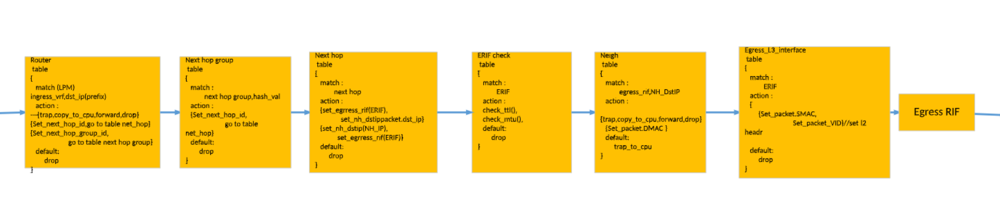

## SAI attributes for disabling L3 rewrites
-------------------------------------------------------------------------------
 Title       | SAI Attributes for disabling L3 rewrites
-------------|-----------------------------------------------------------------
 Authors     | Vivek Ramamoorthy, Google LLC
 Status      | In review
 Type        | Standards track
 Created     | 12/07/2023

-------------------------------------------------------------------------------
**Overview**

This document discusses the requirements and SAI spec proposal for disabling rewriting fields (Source/Dest Mac address, VLAN) as part of L3 routing.

**Background**

The SAI egress pipeline for L3 forwarding performs the following steps:

1. Nexthop sets the egress RIF and NextHop IP.
2. Neighbor table lookup on EgressRiF, NextHop IP to set packet's destination MAC address.
3. Egress RIF lookup to set packet's source MAC address, VLAN and port.

**Requirements**

We require knobs for disabling rewrites to the following fields as part of L3 forwarding for certain LPM flows:

* Src MAC disable
* Dst MAC disable
* Vlan rewrite disable

While we leverage L3 IP-based routing using the LPM tables, we have scenarios where we need knobs for disabling header field rewrites.

* **Case 1:** For certain flows, the switch serves as an L3 passthrough, meaning it relies on IP address-based forwarding but does not want to terminate the L3 packet.
* **Case 2:** For some scenarios, we set the VLAN in the pre-ingress ACL stage based on classifications and would like to preserve this VLAN in the packet when L3 forwarding. For this scenario, we would like to disable L3 VLAN rewrite alone for these scenarios.

In summary, with SDN-based forwarding, the controller treats the L2 fields like any other header field that can be controlled and requires them to be configured flexibly as part of L3 forwarding decisions.

**Proposal**

Since we require the capability to disable the rewrites for "certain" IP flows and not for all flows via neighbor, the best option is to have these as part of the Next Hop object:

* `SAI_NEXT_HOP_ATTR_DISABLE_SRC_MAC_REWRITE`
* `SAI_NEXT_HOP_ATTR_DISABLE_DST_MAC_REWRITE`
* `SAI_NEXT_HOP_ATTR_DISABLE_VLAN_REWRITE`

**Example SAI object creation:**

1. Create a `SAI_OBJECT_TYPE_ROUTER_INTERFACE` with the following attributes:
    * `SAI_ROUTER_INTERFACE_ATTR_VIRTUAL_ROUTER_ID`
    * `SAI_ROUTER_INTERFACE_ATTR_SRC_MAC_ADDRESS`
    * `SAI_ROUTER_INTERFACE_ATTR_TYPE` (either `SAI_ROUTER_INTERFACE_TYPE_PORT` or `SAI_ROUTER_INTERFACE_TYPE_SUB_PORT`)
    * `SAI_ROUTER_INTERFACE_ATTR_PORT_ID`

2. Create a `SAI_OBJECT_TYPE_NEIGHBOR_ENTRY` (1 entry per RIF port) with the following attributes:
    * `“ip”` of neighbor (Link local address)
    * `“rif”`
    * `“switch id”`
    * `SAI_NEIGHBOR_ENTRY_ATTR_DST_MAC_ADDRESS`
    * `SAI_NEIGHBOR_ENTRY_ATTR_NO_HOST_ROUTE` (we will not use up a host entry)

3. Create a `SAI_OBJECT_TYPE_NEXT_HOP` with the following attributes:
    * `SAI_NEXT_HOP_ATTR_TYPE` = `SAI_NEXT_HOP_TYPE_IP`
    * `SAI_NEXT_HOP_ATTR_ROUTER_INTERFACE_ID`
    * `SAI_NEXT_HOP_ATTR_IP` = `“ip”` of the neighbor (as created above)
    * `SAI_NEXT_HOP_ATTR_DISABLE_SRC_MAC_REWRITE` = true
    * `SAI_NEXT_HOP_ATTR_DISABLE_DST_MAC_REWRITE` = true
    * `SAI_NEXT_HOP_ATTR_DISABLE_VLAN_REWRITE` = true

