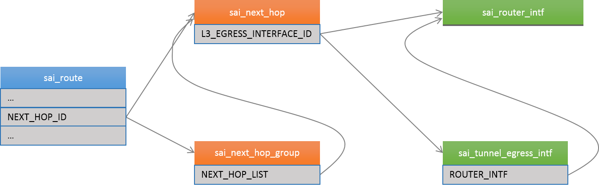

SAI L3 Tunnel Interface API Proposal
=====================

 Title       | SAI L3 Tunnel Interface API Proposal
-------------|----------------------
 Authors     | Broadcom, Microsoft
 Status      | In review
 Type        | Standards track
 Created     | 04/03/2015
 SAI-Version | 0.9.3

---------

# Overview #

L3 tunnels, such as IP-in-IP, GRE, NVGRE, VXLAN, GENEVE, use IP fabrics as a transit network. They use IP encapsulation to deliver packets to the destination in the network through standard switching and routing.

The SAI tunnel API provides separate APIs to manage **L3 tunnel ingress interface** and **L3 tunnel egress interface**. L3 tunnel egress interface is created at the starting endpoint of the tunnel to do the encapsulation, and the L3 tunnel ingress interface is created at the termination endpoint of the tunnel to decapsulate the tunneled packet. (Here egress means it is the outgoing interface of the switch, while ingress means it is the incoming interface of the switch.)

(Current proposal only defines APIs for IP-in-IP tunnel egress interfaces, others are left for the future)

## L3 Tunnel Egress Interface Model ##

There are two types of L3 egress interface defined in the SAI, namely **router interface** and **l3 tunnel egress interface**. To note, the router interface object is used for both ingress and egress interface. As shown in Figure 1, the sai\_next\_hop object can point to either a router interface or a tunnel egress interface. A tunnel egress interface must point to a router interface. In this model, the tunnel egress interface is responsible for adding the tunneling header, e.g., IP, GRE, NVGRE. The router interface is responsible for updating the Ethernet source mac and vlan header. The next hop provides the destination mac information. When multiple tunnel egress interfaces point to a same router interface, all these tunnels will share a same source mac address and vlan id.

As specified in earlier spec, a route object can point to either a next hop object or a next hop group object. In case the route points to a next hop group, and the next hop group object points to multiple next hops, and each next hop points to a tunnel egress interface. This will spread the IP packets over a set of L3 tunnels. 

__Figure 1: Relations between SAI objects for L3 Tunnel egress interface__

## L3 Tunnel Ingress Interface Model ##

A tunnel Ingress Interface is defined to terminate a tunnel. If an incoming packet matches a router interface, i.e., the packet hits one of router interface, then a lookup is done in the L3 Tunnel ingress table to match the packet based on Source, Dest IP Address in the outer IP header. If a match is found then the Tunnel is terminated and outer IP header is removed. Normal L3 processing is performed on the inside packet.

__Figure 2: Relations between SAI objects for L3 Tunnel igress interface__

# Specification #

## Changes To sai.h ##

A new type **SAI_API_L3_TUNNEL** is added.

~~~cpp
/*
*
* Defined API sets have assigned ID's. If specific api method table changes
* in any way (method signature, number of methods), a new ID needs to be
* created (e.g. VLAN2) and old API still may need to be supported for
* compatibility with older adapter hosts.
*
*/
typedef enum _sai_api_t
{
    SAI_API_UNSPECIFIED      =  0,
    SAI_API_SWITCH           =  1,  /* sai_switch_api_t */
    SAI_API_PORT             =  2,  /* sai_port_api_t */
    SAI_API_FDB              =  3,  /* sai_fdb_api_t */
    SAI_API_VLAN             =  4,  /* sai_vlan_api_t */
    SAI_API_VIRTUAL_ROUTER   =  5,  /* sai_virtual_router_api_t */
    SAI_API_ROUTE            =  6,  /* sai_route_api_t */
    SAI_API_NEXT_HOP         =  7,  /* sai_next_hop_api_t */
    SAI_API_NEXT_HOP_GROUP   =  8,  /* sai_next_hop_group_api_t */
    SAI_API_ROUTER_INTERFACE =  9,  /* sai_router_interface_api_t */
    SAI_API_NEIGHBOR         = 10,  /* sai_neighbor_api_t */
    SAI_API_QOS              = 11,  /* sai_qos_api_t */
    SAI_API_ACL              = 12,  /* sai_acl_api_t */
    SAI_API_HOST_INTERFACE   = 13,  /* sai_host_interface_api_t */
    SAI_API_L3_TUNNEL        = 14,  /* sai_l3_tunnel_api_t */
} sai_api_t;
~~~

## Next Hop Attribute ##
SAI\_NEXT\_HOP\_ATTR\_ROUTER\_INTERFACE\_ID is renamed to SAI\_NEXT\_HOP\_ATTR\_L3\_EGRESS\_INTERFACE\_ID.

~~~cpp
/*
*  Attribute id for next hop
*/
typedef enum _sai_next_hop_attr_t
{
    /* READ-ONLY */

    /* READ-WRITE */

    /* Next hop entry ip address [sai_ip_address_t] (MANDATORY_ON_CREATE|CREATE_ONLY) */
    SAI_NEXT_HOP_ATTR_IP,

    /* Next hop entry l3 egress interface id [sai_object_id_t] (MANDATORY_ON_CREATE|CREATE_ONLY) */
    SAI_NEXT_HOP_ATTR_L3_EGRESS_INTERFACE_ID,

    /* -- */

    /* Custom range base value */
    SAI_NEXT_HOP_ATTR_CUSTOM_RANGE_BASE  = 0x10000000

} sai_next_hop_attr_t;
~~~

## New Header sail3tunnelintf.h ##

### L3 Tunnel Egress Interface Type ###

*sai_l3_tunnel_egress_interface_type_t* defines the types of the tunnel. More specifically, it specifies the type of the encapsulated header. Currently, IPv4 and IPv6 are supported.

~~~cpp
/*
 * L3 tunnel egress interface type, i.e., the type of the encapped header
 */
typedef enum _sai_l3_tunnel_egress_interface_type_t
{
    /* Sai l3 tunnel egress interface IPv4 */
    SAI_L3_TUNNEL_EGRESS_INTERFACE_IPV4,

    /* Sai l3 tunnel egress interface IPv6 */
    SAI_L3_TUNNEL_EGRESS_INTERFACE_IPV6,

} sai_l3_tunnel_egress_interface_type_t;
~~~

### L3 Tunnel Egress Interface Attribute ###

*sai_l3_tunnel_egress_interface_attr_t* defines the l3 tunnel egress interface attributes.

* SAI\_L3\_TUNNEL\_EGRESS\_INTERFACE\_ATTR\_ROUTER\_INTF
    * Property: MANDATORY\_ON\_CREATE | CREATE\_ONLY
    * Value Type: sai\_object\_id\_t
    * Comment: L3 tunnel egress interface router interface.
* SAI\_L3\_TUNNEL\_EGRESS\_INTERFACE\_ATTR\_TYPE
    * Property: MANDATORY\_ON\_CREATE | CREATE\_AND\_SET
    * Value Type: sai\_l3\_tunnel\_egress\_interface\_type\_t
    * Comment: L3 tunnel egress interface type
* SAI\_L3\_TUNNEL\_EGRESS\_INTERFACE\_ATTR\_SIP
    * Property: MANDATORY\_ON\_CREATE | CREATE\_AND\_SET
    * Value Type: sai\_ip\_address\_t
    * Comment: L3 tunnel egress interface source IP address. This has to be coherent with the SAI\_L3\_TUNNEL\_EGRESS\_INTERFACE\_ATTR\_TYPE.
* SAI\_L3\_TUNNEL\_EGRESS\_INTERFACE\_ATTR\_DIP
    * Property: MANDATORY\_ON\_CREATE | CREATE\_AND\_SET
    * Value Type: sai\_ip\_address\_t
    * Comment: L3 tunnel egress interface destination IP address. This has to be coherent with the SAI\_L3\_TUNNEL\_EGRESS\_INTERFACE\_ATTR\_TYPE.
* SAI\_L3\_TUNNEL\_EGRESS\_INTERFACE\_ATTR\_TTL
    * Property: CREATE\_AND\_SET
    * Value Type: uint8\_t
    * Comment: L3 tunnel egress interface ttl. The default value is 64.
* SAI\_L3\_TUNNEL\_EGRESS\_INTERFACE\_ATTR\_DSCP
    * Property: CREATE\_AND\_SET
    * Value Type: uint8\_t
    * Comment: L3 tunnel egress interface dscp. The default value is 0.
* SAI\_L3\_TUNNEL\_EGRESS\_INTERFACE\_ATTR\_IPV6\_FLOW\_LABEL
    * Property: CREATE\_AND\_SET
    * Value Type: uint32\_t
    * Comment: L3 tunnel egress interface IPv6 flow label. The default value is 0.

~~~cpp
/*
 *  Attribute id for l3 tunnel egress interface
 */
typedef enum _sai_l3_tunnel_egress_interface_attr_t
{
    /* READ-ONLY */

    /* L3 tunnel egress interface router interface. [sai_object_id_t] (MANDATORY_ON_CREATE|CREATE_ONLY) */
    SAI_L3_TUNNEL_EGRESS_INTERFACE_ATTR_ROUTER_INTF,

    /* READ-WRITE */

    /* L3 tunnel egress interface type [sai_l3_tunnel_egress_interface_type_t] (MANDATORY_ON_CREATE|CREATE_AND_SET) */
    SAI_L3_TUNNEL_EGRESS_INTERFACE_ATTR_TYPE,

    /* L3 tunnel egress interface source IP address. This has to be coherent with the SAI_L3_TUNNEL_EGRESS_INTERFACE_ATTR_TYPE. [sai_ip_address_t] (MANDATORY_ON_CREATE|CREATE_AND_SET) */
    SAI_L3_TUNNEL_EGRESS_INTERFACE_ATTR_SIP,

    /* L3 tunnel egress interface destination IP address. This has to be coherent with the SAI_L3_TUNNEL_EGRESS_INTERFACE_ATTR_TYPE. [sai_ip_address_t] (MANDATORY_ON_CREATE|CREATE_AND_SET) */
    SAI_L3_TUNNEL_EGRESS_INTERFACE_ATTR_DIP,

    /* L3 tunnel egress interface ttl [uint8_t] (CREATE_AND_SET) (default to 64) */
    SAI_L3_TUNNEL_EGRESS_INTERFACE_ATTR_TTL,

    /* L3 tunnel egress interface dscp [uint8_t] (CREATE_AND_SET) (default to 0) */
    SAI_L3_TUNNEL_EGRESS_INTERFACE_ATTR_DSCP,

    /* L3 tunnel egress interface IPv6 flow label [uint32_t] (CREATE_AND_SET) (default to 0) */
    SAI_L3_TUNNEL_EGRESS_INTERFACE_ATTR_IPV6_FLOW_LABEL,

} sai_l3_tunnel_egress_interface_attr_t;
~~~

### L3 Tunnel Ingress Interface Type ###

*sai_l3_tunnel_ingress_interface_type_t* defines the types of the tunnel. More specifically, it specifies the type of the encapsulated header. Currently, IPv4 and IPv6 are supported.

~~~cpp

/*
 * L3 tunnel ingress interface type, i.e., the type of the incoming encapped header
 */
typedef enum _sai_l3_tunnel_ingress_interface_type_t
{
    /* Sai l3 tunnel ingress interface IPv4 */
    SAI_L3_TUNNEL_INGRESS_INTERFACE_IPV4,

    /* Sai l3 tunnel ingress interface IPv6 */
    SAI_L3_TUNNEL_INGRESS_INTERFACE_IPV6,

} sai_l3_tunnel_ingress_interface_type_t;

~~~

### L3 Tunnel Ingress Interface Attribute ###

*sai\_l3\_tunnel\_egress\_interface\_attr\_t* defines the l3 tunnel egress interface attributes.

* SAI\_L3\_TUNNEL\_INGRESS\_INTERFACE\_ATTR\_TYPE
    * Property: MANDATORY\_ON\_CREATE | CREATE\_ONLY
    * Value Type: sai\_l3\_tunnel\_ingress\_interface\_type\_t
    * Comment: L3 tunnel egress interface type
* SAI\_L3\_TUNNEL\_INGRESS\_INTERFACE\_ATTR\_ROUTER\_INTF\_LIST   
    * Property: MANDATORY\_ON\_CREATE | CREATE\_AND\_SET
    * Value Type: sai\_object\_list\_t
    * Comment: L3 interfaces on which the tunnel encapped packet is allowed to ingress into the switch
* SAI\_L3\_TUNNEL\_INGRESS\_INTERFACE\_ATTR\_SIP_PREFIX
    * Property: MANDATORY\_ON\_CREATE | CREATE\_AND\_SET
    * Value Type: sai\_ip\_prefix\_t
    * Comment: L3 tunnel ingress interface source IP address prefix. This has to be coherent with the SAI\_L3\_TUNNEL\_INGRESS\_INTERFACE\_ATTR\_TYPE.
* SAI\_L3\_TUNNEL\_INGRESS\_INTERFACE\_ATTR\_DIP_PREFIX
    * Property: MANDATORY\_ON\_CREATE | CREATE\_AND\_SET
    * Value Type: sai\_ip\_prefix\_t
    * Comment: L3 tunnel ingress interface destination IP address prefix. This has to be coherent with the SAI\_L3\_TUNNEL\_INGRESS\_INTERFACE\_ATTR\_TYPE.
* SAI\_L3\_TUNNEL\_INGRESS\_INTERFACE\_ATTR\_DSCP
    * Property: CREATE\_AND\_SET
    * Value Type: bool
    * Comment: Whether to copy outer DSCP field to inner header DSCP. The default value is false.
* SAI\_L3\_TUNNEL\_INGRESS\_INTERFACE\_ATTR\_VIRTUAL\_ROUTER
    * Property: CREATE\_AND\_SET
    * Value Type: sai\_object\_id\_t
    * Comment: Virtual router associated with this tunnel. Post Decap the L3 address lookup will happen in this VRF. The default value is SAI_NULL_OBJECT_ID which corresponds to the global virtual router.

~~~cpp
/*
 *  Attribute id for l3 tunnel ingress interface
 */
typedef enum _sai_l3_tunnel_ingress_interface_attr_t
{
    /* READ-ONLY */

    /* READ-WRITE */
    /* L3 tunnel ingress interface type [sai_l3_tunnel_ingress_interface_type_t] (MANDATORY_ON_CREATE|CREATE_ONLY) */
    SAI_L3_TUNNEL_INGRESS_INTERFACE_ATTR_TYPE,

	/* L3 tunnel ingress interface router interfaces list. [sai_object_list_t] (MANDATORY_ON_CREATE|CREATE_AND_SET) */
    SAI_L3_TUNNEL_INGRESS_INTERFACE_ATTR_ROUTER_INTF_LIST,

    /* L3 tunnel ingress interface source IP address. This has to be coherent with the SAI_L3_TUNNEL_INGRESS_INTERFACE_ATTR_TYPE. [sai_ip_prefix_t] (MANDATORY_ON_CREATE|CREATE_AND_SET) */
    SAI_L3_TUNNEL_INGRESS_INTERFACE_ATTR_SIP_PREFIX,

    /* L3 tunnel ingress interface destination IP address. This has to be coherent with the SAI_L3_TUNNEL_INGRESS_INTERFACE_ATTR_TYPE. [sai_ip_prefix_t] (MANDATORY_ON_CREATE|CREATE_AND_SET) */
    SAI_L3_TUNNEL_INGRESS_INTERFACE_ATTR_DIP_PREFIX,

    /* L3 tunnel ingress interface dscp, whether to copy outer DSCP field to inner header.
     * [bool] (CREATE_AND_SET) (default to FALSE) */
    SAI_L3_TUNNEL_INGRESS_INTERFACE_ATTR_DSCP,

    /* L3 tunnel ingress interface virtual router [sai_object_id_t] (CREATE_AND_SET) (default to SAI_NULL_OBJECT_ID) */
    SAI_L3_TUNNEL_INGRESS_INTERFACE_ATTR_VIRTUAL_ROUTER,
} sai_l3_tunnel_ingress_interface_attr_t;

~~~

### Create L3 Tunnel Interface ###

*sai_create_l3_tunnel_interface_fn* defines the interface to create l3 tunnel interface.

~~~cpp
/*
 * Routine Description:
 *    Create l3 tunnel interface
 *
 * Arguments:
 *    [out] l3_tunnel_interface_id - l3 tunnel interface id
 *    [in] attr_count - number of attributes
 *    [in] attr_list - array of attributes
 *
 * Return Values:
 *    SAI_STATUS_SUCCESS on success
 *    Failure status code on error
 */
typedef sai_status_t (*sai_create_l3_tunnel_interface_fn)(
    _Out_ sai_object_id_t* l3_tunnel_interface_id,
    _In_ uint32_t attr_count,
    _In_ const sai_attribute_t *attr_list
    );
~~~

### Remove L3 Tunnel Interface ###

*sai_remove_l3_tunnel_interface_fn* defines the interface to remove l3 tunnel interface.

~~~cpp
/*
 * Routine Description:
 *    Remove l3 tunnel interface
 *
 * Arguments:
 *    [in] l3_tunnel_interface_id - l3 tunnel interface id
 *
 * Return Values:
 *    SAI_STATUS_SUCCESS on success
 *    Failure status code on error
 */
typedef sai_status_t (*sai_remove_l3_tunnel_interface_fn)(
    _In_ sai_object_id_t l3_tunnel_interface_id
    );
~~~

### Set L3 Tunnel Interface Attributes ###

*sai_set_l3_tunnel_interface_attribute_fn* defines the interface to set attributes for the l3 tunnel interface.

~~~cpp
/*
 * Routine Description:
 *    Set l3 tunnel interface attribute
 *
 * Arguments:
 *    [in] sai_object_id_t - l3_tunnel_interface_id
 *    [in] attr - attribute
 *
 * Return Values:
 *    SAI_STATUS_SUCCESS on success
 *    Failure status code on error
 */
typedef sai_status_t (*sai_set_l3_tunnel_interface_attribute_fn)(
    _In_ sai_object_id_t l3_tunnel_interface_id,
    _In_ const sai_attribute_t *attr
    );
~~~

### Get L3 Tunnel Interface Attributes ###

*sai_get_l3_tunnel_interface_attribute_fn* defines the interface to get attributes for the l3 tunnel interface.

~~~cpp
/*
 * Routine Description:
 *    Get l3 tunnel interface attribute
 *
 * Arguments:
 *    [in] sai_object_id_t - l3_tunnel_interface_id
 *    [in] attr_count - number of attributes
 *    [inout] attr_list - array of attributes
 *
 * Return Values:
 *    SAI_STATUS_SUCCESS on success
 *    Failure status code on error
 */
typedef sai_status_t (*sai_get_l3_tunnel_interface_attribute_fn)(
    _In_ sai_object_id_t l3_tunnel_interface_id,
    _In_ uint32_t attr_count,
    _Inout_ sai_attribute_t *attr_list
    );
~~~

### Tunnel API Table ###

*sai_tunnel_api_t* defines the tunnel API table.

~~~cpp
/*
 *  L3 tunnel methods table retrieved with sai_api_query()
 */
typedef struct _sai_l3_tunnel_api_t
{
    sai_create_l3_tunnel_interface_fn        create_l3_tunnel_egress_interface;
    sai_remove_l3_tunnel_interface_fn        remove_l3_tunnel_egress_interface;
    sai_set_l3_tunnel_interface_attribute_fn set_l3_tunnel_egress_interface_attribute;
    sai_get_l3_tunnel_interface_attribute_fn get_l3_tunnel_egress_interface_attribute;

    sai_create_l3_tunnel_interface_fn        create_l3_tunnel_ingress_interface;
    sai_remove_l3_tunnel_interface_fn        remove_l3_tunnel_ingress_interface;
    sai_set_l3_tunnel_interface_attribute_fn set_l3_tunnel_ingress_interface_attribute;
    sai_get_l3_tunnel_interface_attribute_fn get_l3_tunnel_ingress_interface_attribute;

} sai_tunnel_api_t;
~~~

# Example #

## Get The Tunnel API Table ##

The following code shows how to get the tunnel API table:

~~~cpp
sai_l3_tunnel_api_t* sai_l3_tunnel_api;
if (sai_api_query(SAI_API_L3_TUNNEL, (void**)&sai_l3_tunnel_api) == SAI_STATUS_SUCCESS)
{
    // Succeeded...
}
else
{
    // Failed...
}
~~~

## Create A L3 Tunnel Egress Interface ##

The following code shows how to create a l3 tunnel egress interface:

~~~cpp
sai_object_id_t l3_tunnel_egress_interface_id;
sai_attribute_t l3_tunnel_egress_interface_attrs[4];
l3_tunnel_egress_interface_attrs[0].id = (sai_attr_id_t)SAI_L3_TUNNEL_EGRESS_INTERFACE_ATTR_INTF;
l3_tunnel_egress_interface_attrs[0].value.intf = router_intf; // The router interface to bind.
l3_tunnel_egress_interface_attrs[1].id = (sai_attr_id_t)SAI_L3_TUNNEL_EGRESS_INTERFACE_ATTR_TYPE;
l3_tunnel_egress_interface_attrs[1].value.u64 = (sai_uint64_t)SAI_L3_TUNNEL_EGRESS_INTERFACE_IPV4; // This is a IPv4 tunnel.
l3_tunnel_egress_interface_attrs[2].id = (sai_attr_id_t)SAI_L3_TUNNEL_EGRESS_INTERFACE_ATTR_SIP;
l3_tunnel_egress_interface_attrs[2].value.ipaddr = ntohl(sip.addr()); // The source IP address of the outer IP header.
l3_tunnel_egress_interface_attrs[3].id = (sai_attr_id_t)SAI_L3_TUNNEL_EGRESS_INTERFACE_ATTR_DIP;
l3_tunnel_egress_interface_attrs[3].value.ipaddr = ntohl(dip.addr()); // The destination IP address of the outer IP header.

if (sai_tunnel_api->create_l3_tunnel_egress_interface(&l3_tunnel_egress_interface_id, 4, l3_tunnel_egress_interface_attrs) == SAI_STATUS_SUCCESS)
{
    // Succeeded...
}
else
{
    // Failed...
}
~~~

## Remove A L3 Tunnel Egress Interface ##

The following code shows how to remove a l3 tunnel egress interface:

~~~cpp
if (sai_tunnel_api->remove_l3_tunnel_egress_interface(l3_tunnel_egress_interface_id) == SAI_STATUS_SUCCESS)
{
    // Succeeded...
}
else
{
    // Failed...
}
~~~

## Set L3 Tunnel Egress Interface Attributes ##

The following code shows how to set attributes to the tunnel interface:

~~~cpp
sai_attribute_t l3_tunnel_egress_interface_attr;
l3_tunnel_egress_interface_attr.id = (sai_attr_id_t)SAI_L3_TUNNEL_EGRESS_INTERFACE_ATTR_TTL;
l3_tunnel_egress_interface_attr.value.u8 = 128;

if (sai_tunnel_api->set_l3_tunnel_egress_interface_attribute(&tunnel_interface_id, &l3_tunnel_egress_interface_attr) == SAI_STATUS_SUCCESS)
{
    // Succeeded...
}
else
{
    // Failed...
}
~~~

## Get L3 Tunnel Egress Interface Attributes ##

The following code shows how to get attributes to the tunnel interface:

~~~cpp
sai_attribute_t l3_tunnel_egress_interface_attrs[2];
l3_tunnel_egress_interface_attrs[0].id = (sai_attr_id_t)SAI_L3_TUNNEL_EGRESS_INTERFACE_ATTR_TTL;
l3_tunnel_egress_interface_attrs[1].id = (sai_attr_id_t)SAI_L3_TUNNEL_EGRESS_INTERFACE_ATTR_DSCP;

if (sai_tunnel_api->get_l3_tunnel_egress_interface_attribute(&tunnel_interface_id, 2, l3_tunnel_egress_interface_attrs) == SAI_STATUS_SUCCESS)
{
    // Succeeded...
}
else
{
    // Failed...
}
~~~

## Set Up A Route To Forward A Prefix's Traffic To A L3 Tunnel ##

The following code shows how to set up a route to forward a prefix to a l3 tunnel:

~~~cpp
// Step 1: create a l3 tunnel egress interface.
sai_object_id_t l3_tunnel_egress_interface_id;
sai_attribute_t l3_tunnel_egress_interface_attrs[4];
l3_tunnel_egress_interface_attrs[0].id = (sai_attr_id_t)SAI_L3_TUNNEL_EGRESS_INTERFACE_ATTR_INTF;
l3_tunnel_egress_interface_attrs[0].value.intf = router_intf; // The router interface to bind.
l3_tunnel_egress_interface_attrs[1].id = (sai_attr_id_t)SAI_L3_TUNNEL_EGRESS_INTERFACE_ATTR_TYPE;
l3_tunnel_egress_interface_attrs[1].value.u64 = (sai_uint64_t)SAI_L3_TUNNEL_EGRESS_INTERFACE_IPV4; // This is a IPv4 tunnel.
l3_tunnel_egress_interface_attrs[2].id = (sai_attr_id_t)SAI_L3_TUNNEL_EGRESS_INTERFACE_ATTR_SIP;
l3_tunnel_egress_interface_attrs[2].value.ipaddr = ntohl(sip.addr()); // The source IP address of the outer IP header.
l3_tunnel_egress_interface_attrs[3].id = (sai_attr_id_t)SAI_L3_TUNNEL_EGRESS_INTERFACE_ATTR_DIP;
l3_tunnel_egress_interface_attrs[3].value.ipaddr = ntohl(dip.addr()); // The destination IP address of the outer IP header.

if (sai_tunnel_api->create_l3_tunnel_egress_interface(&l3_tunnel_egress_interface_id, 4, l3_tunnel_egress_interface_attrs) != SAI_STATUS_SUCCESS)
{
    // Failed...
    return false;
}

// Step 2: create a next hop.
sai_next_hop_id_t next_hop_id;
sai_attribute_t next_hop_attrs[2];
next_hop_attrs[0].id = SAI_NEXT_HOP_ATTR_IP;
next_hop_attrs[0].value.ipaddr.addr_family= SAI_IP_ADDR_FAMILY_IPV4;
next_hop_attrs[0].value.ipaddr.addr.ip4 = next_hop_ip.addr(); // The next hop IP address.
next_hop_attrs[1].id = SAI_NEXT_HOP_ATTR_L3_EGRESS_INTERFACE_ID;
next_hop_attrs[1].value.u64 = l3_tunnel_egress_interface_id; // The l3 tunnel egress interface created in step 1.
if (sai_next_hop_api->create_next_hop(&next_hop_id, 2, next_hop_attrs) != SAI_STATUS_SUCCESS)
{
    // Failed...
    return false;
}

// Step 3: create a route entry.
sai_unicast_route_entry_t unicast_route_entry;
unicast_route_entry.vr_id = virtual_router_id;
unicast_route_entry.destination.addr.ip4 = prefixIp; // The target prefix IP.
unicast_route_entry.destination.mask.ip4 = prefixMask; // The target prefix mask.

sai_attribute_t route_attr;
route_attr.id = SAI_ROUTE_ATTR_NEXT_HOP_ID;
route_attr.value.u64 = next_hop_id; // The next hop id created in step 2.

if (sai_route_api->create_route(&unicast_route_entry, 1, &route_attr) != SAI_STATUS_SUCCESS)
{
    // Failed...
    return false;
}

// Succeeded...
~~~

## Create A L3 Tunnel Ingress Interface ##

The following code shows how to create a l3 tunnel Ingress interface:

~~~cpp
sai_object_id_t l3_tunnel_ingress_interface_id;
sai_attribute_t l3_tunnel_ingress_interface_attrs[5];
l3_tunnel_egress_interface_attrs[0].id = (sai_attr_id_t)SAI_L3_TUNNEL_INGRESS_INTERFACE_ATTR_ROUTER_INTF_LIST;
l3_tunnel_ingress_interface_attrs[0].value.objlist.count = 5; // Number of Router interfaces the L3 tunnel packet can ingress on.

for(cnt =0; cnt < 8; cnt++) {
  l3_tunnel_ingress_interface_attrs[0].value.objlist.list[cnt] = port_obj_ids[cnt]; // Fill in the Router interfaces the L3 tunnel packet can ingress on.

l3_tunnel_ingress_interface_attrs[1].id = (sai_attr_id_t)SAI_L3_TUNNEL_INGRESS_INTERFACE_ATTR_TYPE;
l3_tunnel_ingress_interface_attrs[1].value.u64 = (sai_uint64_t)SAI_L3_TUNNEL_INGRESS_INTERFACE_IPV4; // This is a IPv4 tunnel.
l3_tunnel_ingress_interface_attrs[2].id = (sai_attr_id_t)SAI_L3_TUNNEL_INGRESS_INTERFACE_ATTR_SIP;
l3_tunnel_egress_interface_attrs[2].value.ipaddr = ntohl(sip.addr()); // The source IP address of the outer IP header.
l3_tunnel_ingress_interface_attrs[3].id = (sai_attr_id_t)SAI_L3_TUNNEL_INGRESS_INTERFACE_ATTR_DIP;
l3_tunnel_ingress_interface_attrs[3].value.ipaddr = ntohl(dip.addr()); // The destination IP address of the outer IP header.

if (sai_tunnel_api->create_l3_tunnel_ingress_interface(&l3_tunnel_ingress_interface_id, 5, l3_tunnel_ingress_interface_attrs) == SAI_STATUS_SUCCESS)
{
    // Succeeded...
}
else
{
    // Failed...
}
~~~

## Remove A L3 Tunnel Ingress Interface ##

The following code shows how to remove a l3 tunnel Ingress interface:

~~~cpp
if (sai_tunnel_api->remove_l3_tunnel_ingress_interface(l3_tunnel_ingress_interface_id) == SAI_STATUS_SUCCESS)
{
    // Succeeded...
}
else
{
    // Failed...
}
~~~

## Set L3 Tunnel Ingress Interface Attributes ##

The following code shows how to set attributes to the tunnel interface:

~~~cpp
sai_attribute_t l3_tunnel_ingress_interface_attr;
l3_tunnel_ingress_interface_attr.id = (sai_attr_id_t)SAI_L3_TUNNEL_INGRESS_INTERFACE_ATTR_DSCP;
l3_tunnel_ingress_interface_attr.value.u8 = 1;

if (sai_tunnel_api->set_l3_tunnel_ingress_interface_attribute(&tunnel_interface_id, &l3_tunnel_ingress_interface_attr) == SAI_STATUS_SUCCESS)
{
    // Succeeded...
}
else
{
    // Failed...
}
~~~

## Get L3 Tunnel Ingress Interface Attributes ##

The following code shows how to get attributes to the tunnel interface:

~~~cpp
sai_attribute_t l3_tunnel_ingress_interface_attr;

l3_tunnel_ingress_interface_attr.id = (sai_attr_id_t)SAI_L3_TUNNEL_INGRESS_INTERFACE_ATTR_DSCP;

if (sai_tunnel_api->get_l3_tunnel_ingress_interface_attribute(&tunnel_interface_id, &l3_tunnel_ingress_interface_attr) == SAI_STATUS_SUCCESS)
{
    // Succeeded...
}
else
{
    // Failed...
}
~~~
