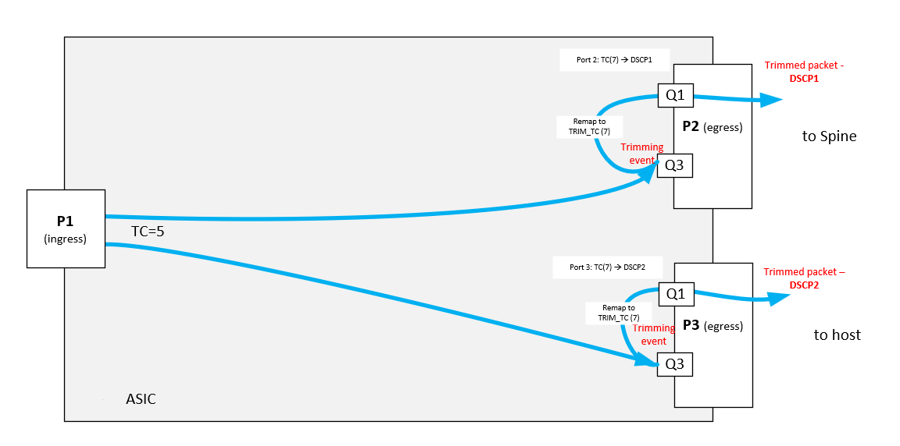

# Switch Abstraction Interface Change Proposal for Packet Trimming

Title       | Packet Trimming
------------|----------------
Authors     | Nvidia
Status      | In review
Type        | Standards track
Created     | 8/28/2024
SAI-Version | 1.14
----------

## Overview
When the lossy queue exceeds a buffer threshold, it drops packets without any notification to the destination host.

When a packet is lost, it can be recovered through fast retransmission (e.g., Go-Back-N in RoCE) or by using timeouts. Retransmission triggered by timeouts typically incurs significant latency. Packet trimming aims to facilitate rapid packet loss notification and, consequently, eliminate slow timeout-based retransmissions.

To help the host recover data more quickly and accurately, we introduce a packet trimming feature, that upon a failed packet admission to a shared buffer,
will trim a packet to a configured size, and try sending it on a different queue to deliver a packet drop notification to an end host.

```
                                                                                                                                        
                                                                                       ┌───────────────┐                                
                                                                                       │               │                                
                                                                                       │Trimmed packet │                                
                                                                                       │               │                                
                                                                                       └───────────────┘                                
                                                                                                                                        
                                                                                                    ┌─┬─┬─┬─┬────────┐                  
                                                                                                    │ │ │ │ │        │                  
                                                                                                    │ │ │ │ │        │                  
                                                                                   ┌────────────────► │ │ │ │        │                  
                                                                                   │                │ │ │ │ │        │    Queue         
                                                                                   │                │ │ │ │ │        │                  
                                                                                   │                │ │ │ │ │        │                  
                                                                                   │                └─┴─┴─┴─┴────────┘                  
     ┌──────────────┐                                                              │                                                    
     │              │  ┌──────────────────────────────────────────────────────┐    │                ┌─┬─┬─┬─┬─┬─┬─┬─┬┐                  
     │              │  │                                                      │    │                │ │ │ │ │ │ │ │ ││                  
     │              │  │                                                      │    │     \   /      │ │ │ │ │ │ │ │ ││                  
     │              │  │                                                      │    │      \ /       │ │ │ │ │ │ │ │ ││                  
     │    Packet    │  │           Pipeline                                   ┼────┼───────\────────► │ │ │ │ │ │ │ ││     Queue        
     │              │  │                                                      │           / \       │ │ │ │ │ │ │ │ ││                  
     │              │  │                                                      │          /   \      │ │ │ │ │ │ │ │ ││                  
     │              │  └──────────────────────────────────────────────────────┘                     └─┴─┴─┴─┴─┴─┴─┴─┴┘                  
     │              │                                                                                                                   
     │              │                                                                                                                   
     │              │                                                                                                                   
     └──────────────┘                                                                                                                   
```

This feature assumes that forwarding tables are configured properly, and the original packet would be delivered to the destination successfully if not for the congestion.

## Spec
There is a tradeoff between trying to configure a higher threshold in a queue buffer profile and trimming the packet.

If the user chooses to configure higher thresholds for queues, the probability of a drop on a particular queue is lower only if other ports are less congested at the moment.

However, if all the ports are equally utilized, it makes sense to create a different buffer profile for these queues, with a stricter threshold to have more fairness in shared buffer.

A static trimming threshold may not be effective with shared buffer switches, where the buffer resources allocated to a queue or port can vary over time. Therefore, we propose adding a new attribute to a buffer profile to allow configuring packet trimming on such stricter profiles:
```
/**
 * @brief Enum defining queue actions in case the packet fails to pass the admission control.
 */
typedef enum _sai_buffer_profile_packet_admission_fail_action_t
{
    /**
     * @brief Drop the packet.
     *
     * Default action. Packet has nowhere to go
     * and will be dropped.
     */
    SAI_BUFFER_PROFILE_PACKET_ADMISSION_FAIL_ACTION_DROP,

    /**
     * @brief Trim the packet.
     *
     * Try sending a shortened packet over a different
     * queue. Original packet will be dropped and trimmed copy of the packet will be send.
     * The IP length and checksum fields will be updated in a trimmed copy.
     * SAI_QUEUE_STAT_DROPPED_PACKETS as well as SAI_QUEUE_STAT_DROPPED_BYTES
     * will count the original discarded frames even if they will be trimmed afterwards.
     * Interface statistics must show dropped packets.
     * Interface statistics may show sent trimmed packets.
     */
    SAI_BUFFER_PROFILE_PACKET_ADMISSION_FAIL_ACTION_DROP_AND_TRIM,
} sai_buffer_profile_packet_admission_fail_action_t;
```
```
    /**
     * @brief Buffer profile discard action
     *
     * Action to be taken upon packet discard due to
     * buffer profile configuration. Applicable only
     * when attached to a queue.
     *
     * @type sai_buffer_profile_packet_admission_fail_action_t
     * @flags CREATE_AND_SET
     * @default SAI_BUFFER_PROFILE_PACKET_ADMISSION_FAIL_ACTION_DROP
     */
    SAI_BUFFER_PROFILE_ATTR_PACKET_ADMISSION_FAIL_ACTION,
```

Trimming engine attributes are configured globally.
```
    /**
     * @brief Trim packets to this size to reduce bandwidth
     *
     * @type sai_uint32_t
     * @flags CREATE_AND_SET
     * @default 128
     */
    SAI_SWITCH_ATTR_PACKET_TRIM_SIZE,

    /**
     * @brief New packet trim DSCP value
     *
     * @type sai_uint8_t
     * @flags CREATE_AND_SET
     * @default 0
     */
    SAI_SWITCH_ATTR_PACKET_TRIM_DSCP_VALUE,

    /**
     * @brief Queue mapping mode for a trimmed packet
     *
     * @type sai_packet_trim_queue_resolution_mode_t
     * @flags CREATE_AND_SET
     * @default SAI_PACKET_TRIM_QUEUE_RESOLUTION_MODE_STATIC
     */
    SAI_SWITCH_ATTR_PACKET_TRIM_QUEUE_RESOLUTION_MODE,

    /**
     * @brief New packet trim queue index
     *
     * @type sai_uint8_t
     * @flags CREATE_AND_SET
     * @default 0
     * @validonly SAI_SWITCH_ATTR_PACKET_TRIM_QUEUE_RESOLUTION_MODE == SAI_PACKET_TRIM_QUEUE_RESOLUTION_MODE_STATIC
     */
    SAI_SWITCH_ATTR_PACKET_TRIM_QUEUE_INDEX,
```

If more granularity is needed (e.g. trim a specific protocol, or packets within protocol), ACL action is added to disable trimming even if the packet is eligible due to a queue with a buffer profile attached that has trimming enabled.
```
    /**
     * @brief Disable packet trim for a given match condition.
     *
     * This rule takes effect only when packet trim is configured on a buffer profile of a queue to which a packet belongs.
     *
     * @type sai_acl_action_data_t bool
     * @flags CREATE_AND_SET
     * @default disabled
     */
    SAI_ACL_ENTRY_ATTR_ACTION_PACKET_TRIM_DISABLE = SAI_ACL_ENTRY_ATTR_ACTION_START + 0x39,
```

Both the queue and the port have the packet counter to reflect the number of trimmed packet.
```
    /** Packets trimmed due to failed shared buffer admission [uint64_t] */
    SAI_PORT_STAT_TRIM_PACKETS,
```
```
    /** Packets trimmed due to failed admission [uint64_t] */
    SAI_QUEUE_STAT_TRIM_PACKETS = 0x00000028,
```

It can also be beneficial to support multiple DSCP values for trimmed packets sent out via different ports. For example, trimmed packets sent to hosts will get DSCP 5 whereas trimmed packets sent to uplink/spine will have DSCP 7. It is to allow to the destination NIC to know where congestion happened - on downlinks to servers or in the fabric. Such information can be used for a better decision making on how to react to the state of network.



The diagram above shows the general concept - instead of setting a trim DSCP, we set a trim TC value, which, by applying a different TC to DSCP map per egres port, will yield a different DSCP value.

```
typedef enum _sai_packet_trim_dscp_resolution_mode_t
{
    /**
     * @brief Static DSCP resolution.
     *
     * In this mode, a new DSCP for the trimmed packet is set directly
     * by the application.
     */
    SAI_PACKET_TRIM_DSCP_RESOLUTION_MODE_DSCP_VALUE,

    /**
     * @brief Dynamic DSCP resolution.
     *
     * In this mode, a new DSCP for the trimmed packet is resolved from the new TRIM_TC
     * set by the application using per-port TC_TO_DSCP mapping
     */
    SAI_PACKET_TRIM_DSCP_RESOLUTION_MODE_FROM_TC
} sai_packet_trim_dscp_resolution_mode_t;
```

```
    /**
     * @brief New packet trim TC value
     *
     * @type sai_uint8_t
     * @flags CREATE_AND_SET
     * @default 0
     * @validonly SAI_SWITCH_ATTR_PACKET_TRIM_DSCP_RESOLUTION_MODE == SAI_PACKET_TRIM_DSCP_RESOLUTION_MODE_FROM_TC
     */
    SAI_SWITCH_ATTR_PACKET_TRIM_TC_VALUE,

    /**
     * @brief DSCP mapping mode for a trimmed packet
     *
     * @type sai_packet_trim_dscp_resolution_mode_t
     * @flags CREATE_AND_SET
     * @default SAI_PACKET_TRIM_DSCP_RESOLUTION_MODE_DSCP_VALUE
     */
    SAI_SWITCH_ATTR_PACKET_TRIM_DSCP_RESOLUTION_MODE,
```

## Counter
|Header file|SAI attribute|Description|
|-----------|-------------|-----------|
|saiswitch.h|SAI_SWITCH_STAT_DROPPED_TRIM_PACKETS|Global counter (aggregated value of all ports) of packets trimmed but dropped due to failed shared buffer admission on a trim queue|
|           |SAI_SWITCH_STAT_TX_TRIM_PACKETS|Global counter (aggregated value of all ports) of packets trimmed and successfully sent via a trim queue|
|saiport.h  |SAI_PORT_STAT_TRIM_PACKETS|Per-port counter of packets trimmed due to failed shared buffer admission|
|           |SAI_PORT_STAT_DROPPED_TRIM_PACKETS|Per-port counter of packets trimmed but dropped due to failed shared buffer admission on a trim queue|
|           |SAI_PORT_STAT_TX_TRIM_PACKETS|Per-port counter of packets trimmed and successfully sent via a trim queue|
|saiqueue.h |SAI_QUEUE_STAT_TRIM_PACKETS|Per-queue counter of packets trimmed on trimming-eligible queue due to failed shared buffer admission|
|           |SAI_QUEUE_STAT_DROPPED_TRIM_PACKETS|Per-queue counter of packets trimmed on trimming-eligible queue but dropped due to failed shared buffer admission on a trim queue|
|           |SAI_QUEUE_STAT_TX_TRIM_PACKETS|Per-queue counter of packets trimmed on trimming-eligible queue and successfully sent via a trim queue|
