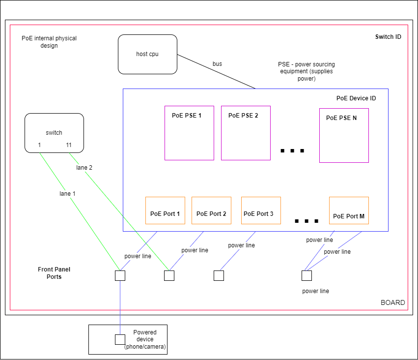

PoE support for SAI

| Title       | PoE                    |
| ----------- | ---------------------- |
| Authors     | Daniela Murin, Marvell |
| Status      | In review              |
| Type        | Standards track        |
| Created     | 02/25/2024             |
| SAI-Version | 1.13                   |

# Overview

Power over Ethernet, or PoE, describes any of the 802.3(AF, AT, BT) standards that deliver electrical power along with data on twisted-pair Ethernet cables. This allows a single cable to provide both data connection and electricity to power the networked devices such as wireless access points (WAPs), IP cameras and VoIP phones etc.

# Proposal

The current SAI does not support PoE. We will implement PoE in a way that any vendor can provide their own PoE hardware and software solution.

## Abbreviations and Information

| **Term** | **Definition**                                                                              |
| -------------- | ------------------------------------------------------------------------------------------------- |
| PoE            | Power over Ethernet                                                                                  |
| PSE            | Power Sourcing Equipment                                                                          |
| PD             | Powered Device, can power the device through an PD-capable Ethernet port                          |
| PoE Port       | Ethernet port that can deliver power and info to devices, located on the front panel of the board |

# Key Ideas behind PoE

1. PoE provides a hardware solution for providing a data connection and electricity to power connected devices
2. The PoE software provides an interface to configure (program) and query the PoE controller and its internal peripherals such as ports etc
3. Users can see PoE information and configure PoE features according to their needs

# PoE Hardware Design Example



# SAI POE Components

## New PoE SAI objects

Three new SAI objects are introduced.

### PoE Device ID

This object is used to hold the global configuration and PoE hardware status. In many cases, one PoE device instance will have access to all the PoE hardware and components.

### PoE PSE ID

This object is used to access data from the Power Sourcing Equipment devices in the board. Such as PSE temperatures, versions, and statuses. There can be multiple PSEs in one board.

### PoE Port ID

This object is used to access data on a port level. PoE ports supply power using an ethernet cable. PoE port object gives access to read data and configure these ports.

## New SAI Switch Type PoE

A new abstraction type for PoE is created which allows multiple vendors to implement their own PoE software and hardware solutions.

```
/**
 * @brief Attribute data for #SAI_SWITCH_ATTR_TYPE
 */
typedef enum _sai_switch_type_t
{
    /** Switch type is Switching Network processing unit */
    SAI_SWITCH_TYPE_NPU,

    /** Switch type is PHY */
    SAI_SWITCH_TYPE_PHY,

    /** Switch type is VOQ based NPU */
    SAI_SWITCH_TYPE_VOQ,

    /** Switch type is Fabric switch device */
    SAI_SWITCH_TYPE_FABRIC,

    /** Switch type is PoE (Power over Ethernet) */
    SAI_SWITCH_TYPE_POE,

} sai_switch_type_t;
```

## Example of how to initialize  PoE

An example of how to initlizate PoE and access its components.

### Create a PoE Device Object

The PoE device object is used to access and configure board-wide system information and operations. Information about the kind of PoE hardware should be provided on the NOS level and used to initalize the driver.

```
    /**
     * @brief Device Information for switch initialization.
     *
     * Hardware information format is based on POE SAI implementations by vendors.
     * Format is vendor specific.
     * Example: Like PCI location, I2C address, UART etc.
     * In case of NULL, use the default PoE associated switch id.
     *
     * @type char
     * @flags CREATE_ONLY
     * @default ""
     */
    SAI_POE_DEVICE_ATTR_HARDWARE_INFO = SAI_POE_DEVICE_ATTR_START,
```

```
/** 
 * Create a PoE device object
 */
  
/* Allows the PoE software to initialize itself based on the PoE hardware */
attr_list[0].id = SAI_POE_DEVICE_ATTR_HARDWARE_INFO;
strncpy(attr.value.chardata, "integrated-mcu", sizeof("integrated-mcu");  /* string is only relevant to the driver, can be anything*/ 

attr_count = 1;
sai_create_poe_device_fn(&poe_device_id, switch_id, attr_count, attr_list);
```

### Get PoE device data

Get the current power consumption, in milliwatts, of the board.

```
    /**
     * @brief total power consumption
     *
     * @type sai_uint32_t
     * @flags READ_ONLY
     */
    SAI_POE_DEVICE_ATTR_POWER_CONSUMPTION,
```

```
/* 
 * Get the current power consumption, in milliwatts, of the board
 */

attr.id = SAI_POE_DEVICE_ATTR_POWER_CONSUMPTION;
attr_count = 1;
sai_get_poe_device_attribute_fn(poe_device_id, attr_count, &attr);
```

## Example of how to initialize  PoE PSE devices

The NOS must provide a list of PSE devices. We use this list to create PoE PSE objects. The PoE device object must be provided to bind the PoE PSE to the PoE device.

```
    /**
     * @brief POE PSE ID (index)
     *
     * @type sai_uint32_t
     * @flags MANDATORY_ON_CREATE | CREATE_ONLY
     */
    SAI_POE_PSE_ATTR_ID = SAI_POE_PSE_ATTR_START,

    /**
     * @brief POE device ID
     *
     * @type sai_object_id_t
     * @flags MANDATORY_ON_CREATE | CREATE_ONLY
     * @objects SAI_OBJECT_TYPE_POE_DEVICE
     */
    SAI_POE_PSE_ATTR_DEVICE_ID,
```

```
/* get poe pse(s) from NOS platform file, every board must have it's own information */
poe_pse_index_list = get_poe_pse_info();

for (uint32_t i = 0; i < poe_pse_index_list .size; i++) 
{
    attr_list[0].id = SAI_POE_PSE_ATTR_ID;
    attr_list[0].value.u32 = poe_pse_index_list.value_list[i]; /* from a platform file */

    attr_list[1].id = SAI_POE_PSE_ATTR_DEVICE_ID;
    attr_list[1].value.oid = poe_device_id;
    attr_count = 2;

    sai_create_poe_pse_fn(
        &poe_pse_id[i],
        switch_id,
        attr_count,
        attr_list);
}
```

### Get PoE PSE Data Example

```
    /**
     * @brief temperature (in Celsius) of the PSE
     *
     * @type sai_int16_t
     * @flags READ_ONLY
     */
    SAI_POE_PSE_ATTR_TEMPERATURE,
```

```
/* 
 * Get the poe pse temperature, in Celsius
 */

attr.id = SAI_POE_PSE_ATTR_TEMPERATURE;
attr_count = 1;
sai_get_poe_device_attribute_fn(poe_pse_id, attr_count, &attr);
```

## Example of how to initialize PoE Ports

The NOS must provide a list of PoE ports. We use this list to create PoE port objects. The PoE device object must be provided to bind the PoE port to the PoE device.

```
    /**
     * @brief POE port front panel ID
     *
     * @type sai_uint32_t
     * @flags MANDATORY_ON_CREATE | CREATE_ONLY
     */
    SAI_POE_PORT_ATTR_FRONT_PANEL_ID = SAI_POE_PORT_ATTR_START,

    /**
     * @brief POE device ID
     *
     * @type sai_object_id_t
     * @flags MANDATORY_ON_CREATE | CREATE_ONLY
     * @objects SAI_OBJECT_TYPE_POE_DEVICE
     */
    SAI_POE_PORT_ATTR_DEVICE_ID,
```

```
/* get poe port from NOS platform file, every board must have it's own information */
poe_front_panel_index_list = get_poe_port_info();

for (uint32_t i = 0; i < poe_front_panel_index_list.size; i++) 
{
    attr_list[0].id = SAI_POE_PORT_ATTR_FRONT_PANEL_ID;
    attr_list[0].value.u32 = poe_front_panel_index_list.value_list[i]; /* from a platform file */

    attr_list[1].id = SAI_POE_ATTR_DEVICE_ID;
    attr_list[1].value.oid = poe_device_id; 
    attr_count = 2;

    sai_create_poe_port_fn(
        &poe_port_id[i],
        switch_id,
        attr_count,
        attr_list);
}
```

### Get PoE Port Data Example

```
/**
     * @brief PoE port enabled/disabled state, as set by the user
     *
     * @type bool
     * @flags CREATE_AND_SET
     * @default false
     */
    SAI_POE_PORT_ATTR_ADMIN_ENABLED_STATE,
```

```
/* 
 * Get the poe port admin enabled state (either enabled or disabled by the user)
 */

attr.id = SAI_POE_PORT_ATTR_ADMIN_ENABLED_STATE;
attr_count = 1;
sai_get_poe_device_attribute_fn(poe_device_id, attr_count, &attr);
```

### Set PoE Port Data Example

```
/**
     * @brief PoE port power limit mode
     *
     * @type sai_uint32_t
     * @flags CREATE_AND_SET
     * @default maximum value that the port can provide
     */
    SAI_POE_PORT_ATTR_POWER_LIMIT,
```

```
i/* 
 * Set the power limit of a port, in milliwatts
 */

attr.id = SAI_POE_PORT_ATTR_POWER_LIMIT;
attr.value.u32 = 10500; /* 10500 milliwatts (10.5 watts) maximum power limit */
attr_count = 1;
sai_set_poe_device_attribute_fn(poe_port_id, &attr);
```

### SAI Attributes

SAI attributes may be queried using the `sai_api_query`() function and the following SAI POE APIs that were added to `sai_api_t`:

```
SAI_API_POE              = 51, /**< sai_poe_api_t */
```

### PoE Device Information

The get_poe_device_attribute() and set_poe_device_attribute() functions can be used to access the following attributes.

- total power
- power consumption
- poe software version (firmware)
- power limit mode

```
/**
     * @brief the total power in the device, in watts
     *
     * @type sai_uint32_t
     * @flags READ_ONLY
     */
    SAI_POE_DEVICE_ATTR_TOTAL_POWER,

    /**
     * @brief total power consumption, in milliwatts
     *
     * @type sai_uint32_t
     * @flags READ_ONLY
     */
    SAI_POE_DEVICE_ATTR_POWER_CONSUMPTION,

    /**
     * @brief poe device version and information (poe firmware version)
     *
     * @type char
     * @flags READ_ONLY
     */
    SAI_POE_DEVICE_ATTR_VERSION,

    /**
     * @brief power limit mode
     *
     * @type sai_poe_device_limit_mode_t
     * @flags CREATE_AND_SET
     * @default SAI_POE_DEVICE_TYPE_LIMIT_MODE_CLASS_LIMIT
     */
    SAI_POE_DEVICE_ATTR_POWER_LIMIT_MODE,
```

```
/** poe device power limit mode
 *  port limit - max power limit per port is configured by the user 
 *  class limit - max power is set automatically according the class of the connected device
 */
typedef enum _sai_poe_device_type_limit_mode_t
{
    SAI_POE_DEVICE_TYPE_LIMIT_MODE_PORT_LIMIT  = 0,
    SAI_POE_DEVICE_TYPE_LIMIT_MODE_CLASS_LIMIT  = 1
} sai_poe_device_limit_mode_t;
```

### PoE PSE Information

The get_poe_pse_attribute() and set_poe_pse_attribute() functions can be used to access the following attributes.

- pse software version
- pse hardware version
- pse temperature
- pse status

```
/**
     * @brief poe pse PSE software version
     *
     * @type char
     * @flags READ_ONLY
     */
    SAI_POE_PSE_ATTR_PSE_SOFTWARE_VERSION,

    /**
     * @brief poe pse PSE hardware version
     *
     * @type char
     * @flags READ_ONLY
     */
    SAI_POE_PSE_ATTR_PSE_HARDWARE_VERSION,

        /**
     * @brief temperature (in Celsius) of the PSE
     *
     * @type sai_int16_t
     * @flags READ_ONLY
     */
    SAI_POE_PSE_ATTR_TEMPERATURE,

    /**
     * @brief statuses for each PSEs
     *
     * @type sai_poe_device_pse_status_id_t
     * @flags READ_ONLY
     */
    SAI_POE_PSE_ATTR_PSE_STATUS,
```

```
/**
 * @brief poe device pse (power sourcing equipment) status
 */
typedef enum _sai_poe_device_pse_status_t
{
    SAI_POE_DEVICE_PSE_STATUS_TYPE_ACTIVE = 0,
    SAI_POE_DEVICE_PSE_STATUS_TYPE_FAIL = 1,
    SAI_POE_DEVICE_PSE_STATUS_TYPE_NOT_PRESENT = 2
} sai_poe_device_pse_status_t;
```

### PoE Port Information

The get_poe_port_attribute() and set_poe_port_attribute() functions can be used to access the following attributes.

- poe port standard
- poe port admin enable/disable
- poe port priority
- poe port consumption
- poe port status

```
/**
     * @brief PoE port standard (af/at/bt...)
     *
     * @type sai_poe_port_standard_t
     * @flags READ_ONLY
     * @default SAI_POE_PORT_STANDARD_TYPE_AT
     */
    SAI_POE_PORT_ATTR_STANDARD,

    /**
     * @brief PoE port enabled/disabled state, as set by the user
     *
     * @type bool
     * @flags CREATE_AND_SET
     * @default false
     */
    SAI_POE_PORT_ATTR_ADMIN_ENABLED_STATE,

    /**
     * @brief PoE port power limit mode
     *
     * @type sai_uint32_t
     * @flags CREATE_AND_SET
     * @default maximum value that the port can provide
     */
    SAI_POE_PORT_ATTR_POWER_LIMIT,

    /**
     * @brief PoE port priority
     *
     * @type sai_poe_port_power_priority_t
     * @flags CREATE_AND_SET
     * @default SAI_POE_PORT_POWER_PRIORITY_TYPE_HIGH
     */
    SAI_POE_PORT_ATTR_POWER_PRIORITY,

    /**
     * @brief PoE port consumption information
     *
     * @type sai_poe_port_power_consumption_t
     * @flags READ_ONLY
     */
    SAI_POE_PORT_ATTR_CONSUMPTION,

    /**
     * @brief PoE port status of the port status 
     *
     * @type sai_poe_port_status_t
     * @flags READ_ONLY
     */

    SAI_POE_PORT_ATTR_STATUS,

    /**
     * @brief PoE port detailed status of the port status (string)
     *
     * @type char
     * @flags READ_ONLY
     */

    SAI_POE_PORT_ATTR_DETAILED_STATUS,
```

```
/**
 * @brief poe port standard
 */
typedef enum _sai_poe_port_standard_t
{
    SAI_POE_PORT_STANDARD_TYPE_AF = 0,
    SAI_POE_PORT_STANDARD_TYPE_AT = 1,
    SAI_POE_PORT_STANDARD_TYPE_60W = 2,
    SAI_POE_PORT_STANDARD_TYPE_BT_TYPE3 = 3,
    SAI_POE_PORT_STANDARD_TYPE_BT_TYPE4 = 4
} sai_poe_port_standard_t;

/**
 * @brief poe port power priority
 */
typedef enum _sai_poe_port_power_priority_t
{
    SAI_POE_PORT_POWER_PRIORITY_TYPE_LOW   = 0,
    SAI_POE_PORT_POWER_PRIORITY_TYPE_HIGH  = 1,
    SAI_POE_PORT_POWER_PRIORITY_TYPE_CRITICAL = 2
} sai_poe_port_power_priority_t;

/**
 * @brief poe port status
 */
typedef enum _sai_poe_port_status_t
{
    SAI_POE_PORT_STATUS_TYPE_OFF = 0, 
    SAI_POE_PORT_STATUS_TYPE_SEARCHING = 1, 
    SAI_POE_PORT_STATUS_TYPE_DELIVERING_POWER = 2, 
    SAI_POE_PORT_STATUS_TYPE_FAULT = 3 
} sai_poe_port_status_t;

```

```
/**
 * @brief Defines a port consumption structure
 * 
 * Data that is needed and available when a port is delivering power
 * 
 */
typedef struct _sai_poe_port_power_consumption_t 
{
    /**
     * @brief active channel: a/b/ab
     */
    sai_poe_port_active_channel_type_t active_channel;

    /**
     * @brief voltage in milliVolts
     */
    uint32_t voltage_in_mv;

    /**
     * @brief current in milliAmpere
     */
    uint32_t current_in_ma;

    /**
     * @brief consumption in milliWatts
     */
    uint32_t consumption_in_mw;

    /**
     * @brief single or dual signature port
     */
    sai_poe_port_signature_type_t signature_type;

    /**
     * @brief bt port class method type regular/auto
     */
    sai_poe_port_class_method_type_t class_method;

    /**
     * @brief measured class for channel a
     */
    uint8_t measured_class_a;

    /**
     * @brief assigned (final) class for channel a
     */
    uint8_t assigned_class_a;

    /**
     * @brief dual signature bt port - measured class for channel b
     */
    uint8_t measured_class_b;

    /**
     * @brief dual signature bt port - assigned (final) class for channel b
     */
    uint8_t assigned_class_b;
  
} sai_poe_port_power_consumption_t;
```
