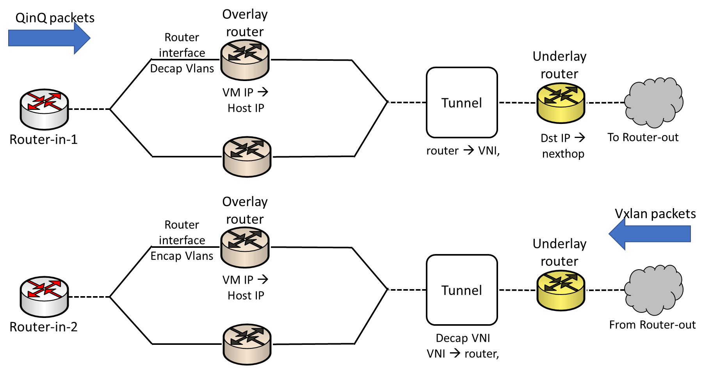
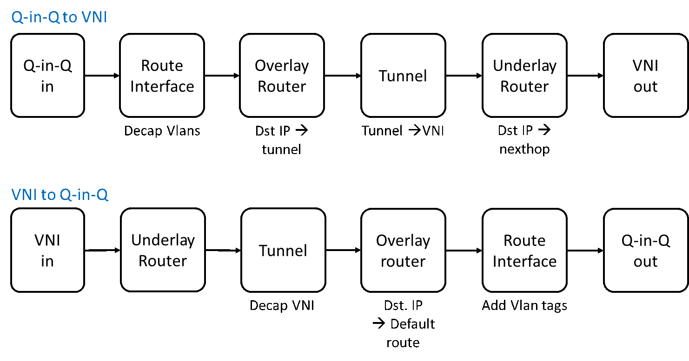
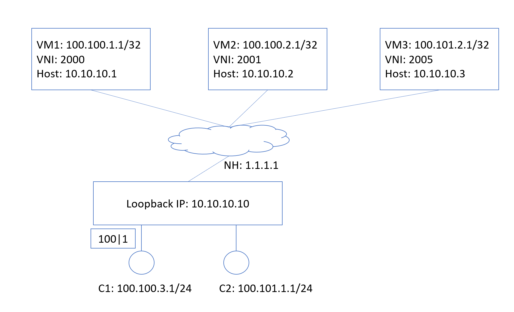

Add support for QinQ router interface and routing-based VxLAN
-------------------------------------------------------------------------------

 Title       | QinQ router interface and routing-based VxLAN
-------------|-----------------------------------------------------------------
 Authors     | Microsoft
 Status      | In review
 Type        | Standards track
 Created     | 05/04/2017
 Updated     | 08/03/2018
 SAI-Version | 1.2

-------------------------------------------------------------------------------

## Overview ##

The SAI representation of the QinQ-VxLAN-translator router is below:


__Figure 1: QinQ to VxLAN usage scenario__

The packet processing pipeline is below:

__Figure 2: QinQ to VxLAN SAI Pipeline__

## Packet Format ##

- QinQ -> vxlan: For the vxlan packet , the inner L2 header is a dummy header without vlan header.

- Vxlan -> QinQ: For the vxlan packet, the inner L2 header is also a dummy header with no vlan header.

## SAI Header changes

- TPID for Outer and Inner VLAN

```
   typedef enum _sai_switch_attr_t
   {
       ...

       /**
        * @brief TPID for Outer vlan id
        *
        * @type sai_uint16_t
        * @flags CREATE_AND_SET
        * @default 0x88a8
        */
       SAI_SWITCH_ATTR_TPID_OUTER_VLAN;

       /**
        * @brief TPID for Inner vlan id
        *
        * @type sai_uint16_t
        * @flags CREATE_AND_SET
        * @default 0x8100
        */
       SAI_SWITCH_ATTR_TPID_INNER_VLAN;

   } sai_switch_attr_t;
```

- QinQ router interface type

```
    typedef enum _sai_router_interface_type_t
    {
        ...

        /** QinQ Router Interface Type */
        SAI_ROUTER_INTERFACE_TYPE_QINQ_PORT;
    } sai_router_interface_type_t;
```

- New router interface attribute:

```
    typedef enum _sai_router_interface_attr_t
    {
        /**
         * @brief Outer Vlan
         *
         * @type sai_uint16_t
         * @flags MANDATORY_ON_CREATE | CREATE_ONLY
         * @condition SAI_ROUTER_INTERFACE_ATTR_TYPE == SAI_ROUTER_INTERFACE_TYPE_QINQ_PORT;
         */
        SAI_ROUTER_INTERFACE_ATTR_OUTER_VLAN_ID

        /**
         * @brief Inner Vlan
         *
         * @type sai_uint16_t
         * @flags MANDATORY_ON_CREATE | CREATE_ONLY
         * @condition SAI_ROUTER_INTERFACE_ATTR_TYPE == SAI_ROUTER_INTERFACE_TYPE_QINQ_PORT;
         */
        SAI_ROUTER_INTERFACE_ATTR_INNER_VLAN_ID
    } sai_router_interface_attr_t;
```

- New tunnel map type between VNI to Virtual Router ID

```
    typedef enum _sai_tunnel_map_type_t
    {
        ...

        /** TUNNEL Map VNI to Virtual Router ID */
        SAI_TUNNEL_MAP_TYPE_VNI_TO_VIRTUAL_ROUTER_ID = 0x00000006,

        /** TUNNEL Map Virtual Router ID to VNI */
        SAI_TUNNEL_MAP_TYPE_VIRTUAL_ROUTER_ID_TO_VNI = 0x00000007,
    } sai_tunnel_map_type_t;
```

- New tunnel map entry for virtual router id

```
    typedef enum _sai_tunnel_map_entry_attr_t
    {
        /**
         * @brief Virtual Router ID key
         *
         * @type sai_object_id_t
         * @flags MANDATORY_ON_CREATE | CREATE_ONLY
         * @objects SAI_OBJECT_TYPE_VIRTUAL_ROUTER
         * @condition SAI_TUNNEL_MAP_ENTRY_ATTR_TUNNEL_MAP_TYPE == SAI_TUNNEL_MAP_TYPE_VNI_TO_VIRTUAL_ROUTER_ID or SAI_TUNNEL_MAP_ENTRY_ATTR_TUNNEL_MAP_TYPE == SAI_TUNNEL_MAP_TYPE_VIRTUAL_ROUTER_ID_TO_VNI
         */
        SAI_TUNNEL_MAP_ENTRY_ATTR_VIRTUAL_ROUTER_ID_KEY = 0x0000000a,

        /**
         * @brief Virtual Router ID value
         *
         * @type sai_object_id_t
         * @flags MANDATORY_ON_CREATE | CREATE_ONLY
         * @objects SAI_OBJECT_TYPE_VIRTUAL_ROUTER
         * @condition SAI_TUNNEL_MAP_ENTRY_ATTR_TUNNEL_MAP_TYPE == SAI_TUNNEL_MAP_TYPE_VNI_TO_VIRTUAL_ROUTER_ID or SAI_TUNNEL_MAP_ENTRY_ATTR_TUNNEL_MAP_TYPE == SAI_TUNNEL_MAP_TYPE_VIRTUAL_ROUTER_ID_TO_VNI
         */
        SAI_TUNNEL_MAP_ENTRY_ATTR_VIRTUAL_ROUTER_ID_VALUE = 0x0000000b,
    } sai_tunnel_map_entry_attr_t;
```
## Examples

### Baremetal example

We have customer 1 (C1) server (100.100.3.1/24) and (C2) (100.100.4.1/24)
talk to VM1 (100.100.1.1/32). VM1 is in host 10.10.10.1 with VXLAN id 2000.

We have customer 3 (C3) server (100.102.1.1/24) talk to VM2 (100.100.2.1/32). 
VM2 is in host 10.10.10.2 with VXLAN id 2001.

We have customer 4 (C4) server (100.101.1.1/24) wants to talk to
VM3 (100.101.2.1/32). VM3 is in host 10.10.10.3 with VXLAN id 2005.

VXLAN 2000 and VXLAN id 2001 are peering with each other, so that C1 and C2 can 
also talk to C3 and VM2, and vice verse.

When we use riot VXLAN tunnel, the default inner destination mac in the
tunnel encap is the ```SAI_SWITCH_ATTR_VXLAN_DEFAULT_ROUTER_MAC```, e.g, "00:11:11:11:11:11"

To reach VM1 from C1, the switch needs to encap the packet with
outer IP 10.10.10.1 and VXLAN id 2000. To reach VM2 for C1, the switch needs to encap the packet with
outer IP 10.10.10.2 with VXLAN id 2001. For VM2, we also need to specify
the inner destination mac "00:12:34:56:78:9a". To reach VM3 from C4, the switch
needs to encap packet with outer IP 10.10.10.3 and VXLAN id 2005.

To reach C1 from VM1 and VM2, VM host will send VXLAN packet
with VXLAN id 2000. The switch will decap the packet, using the VXLAN id 2000
to map to virtual router R1' and then lookup the inner destination IP
(100.100.3.1/24). To reach C3 from VM1 and VM2, VM host will send VXLAN id 2001.
The swithc will decap the packet, using VXLAN id 2001 to map to virtual router R2' and then
lookup the inner destination IP. To reach C4 from VM3, VM host will send VXLAN packet
with VXLAN id 2005.




```
sai_attribute_t switch_attr;
switch_attr.id = SAI_SWITCH_ATTR_VXLAN_DEFAULT_ROUTER_MAC;
switch_attr.value.mac = "00:11:11:11:11:11";
sai_switch_api->set_switch_attribute(switch_id, &switch_attr);

switch_attr.id = SAI_SWITCH_ATTR_VXLAN_DEFAULT_PORT;
switch_attr.value.u16 = 12345;
sai_switch_api->set_switch_attribute(switch_id, &switch_attr);

/*
 * Setup underlay default route, the nexthop is 1.1.1.1
 */
status = create_route("0.0.0.0/0", default_vrid, "1.1.1.1");

/*
 * Setup overlay route
 */

/* create virtual router for C1 */
create_vrid(&vrid_1_ingress);
create_vrid(&vrid_1_egress);

/* create virtual router for C3 */
create_vrid(&vrid_2_ingress);
create_vrid(&vrid_2_egress);

/* create virtual router for C4 */
create_vrid(&vrid_3_ingress);
create_vrid(&vrid_3_egress);

/* create port-based router interface for C1 */
status = create_router_interface_port(vrid_1_ingress, port_id_1, &rif_1);
status = create_neighbor("100.100.3.1", rif_1, "00:00:00:00:00:01");

/* create port-based router interface for C2 */
status = create_router_interface_port(vrid_1_ingress, port_id_2, &rif_2);
status = create_neighbor("100.100.4.1", rif_2, "00:00:00:00:00:02");

/* create port-based router interface for C3 */
status = create_router_interface_port(vrid_2_ingress, port_id_3, &rif_3);
status = create_neighbor("100.102.1.1", rif_3, "00:00:00:00:00:03");

/* create port-based router interface for C4 */
status = create_router_interface_port(vrid_3_ingress, port_id_4, &rif_4);
status = create_neighbor("100.101.1.1", rif_4, "00:00:00:00:00:04");

/* create tunnel with tunnel map for C1 and C2 */
status = create_tunnel(vrid_1_ingress, vrid_1_egress, 2000, &tunnel_id, &tunnel_encap_map_id, &tunnel_decap_map_id);

/* add tunnel map entry for C3 */
status = create_encap_tunnel_map_entry(tunnel_encap_map_id, vrid_2_ingress, 2001);
status = create_decap_tunnel_map_entry(tunnel_decap_map_id, vrid_2_egress, 2001);

/* add tunnel map entry for C4 */
status = create_encap_tunnel_map_entry(tunnel_encap_map_id, vrid_3_ingress, 2005);
status = create_decap_tunnel_map_entry(tunnel_decap_map_id, vrid_3_egress, 2005);

/* create tunnel decap for VM to customer server */
status = create_tunnel_termination(tunnel_id, "10.10.10.10", &term_table_id);

/* create tunnel nexthop for VM1, VM2 and VM3 */
status = create_nexthop_tunnel("10.10.10.1", 0, NULL, tunnel_id, &nexthop_id_1);
status = create_nexthop_tunnel("10.10.10.2", 2001, "00:12:34:56:78:9a", tunnel_id, &nexthop_id_2);
status = create_nexthop_tunnel("10.10.10.3", 0, NULL, tunnel_id, &nexthop_id_3);

/* create routes for vrid 1 ingress */
status = create_route("100.100.1.1/32", vrid_1_ingress, nexthop_id_1);
status = create_route("100.100.2.1/32", vrid_1_ingress, nexthop_id_2);
status = create_route("100.100.3.0/24", vrid_1_ingress, rif_1);
status = create_route("100.100.4.0/24", vrid_1_ingress, rif_2);
status = create_route("100.102.1.0/24", vrid_1_ingress, rif_3);

/* create routes for vrid 1 egress */
status = create_route("100.100.3.0/24", vrid_1_egress, rif_1);
status = create_route("100.100.4.0/24", vrid_1_egress, rif_2);

/* create routes for vrid 2 ingress */
status = create_route("100.100.1.1/32", vrid_2_ingress, nexthop_id_1);
status = create_route("100.100.2.1/32", vrid_2_ingress, nexthop_id_2);
status = create_route("100.100.3.0/24", vrid_2_ingress, rif_1);
status = create_route("100.100.4.0/24", vrid_2_ingress, rif_2);
status = create_route("100.102.1.0/24", vrid_2_ingress, rif_3);

/* create routes for vrid 2 egress */
status = create_route("100.102.1.0/24", vrid_2_egress, rif_3);

/* create routes fro vrid 3 ingress */
status = create_route("100.101.2.1/32", vrid_3_ingress, nexthop_id_3);
status = create_route("100.101.1.0/24", vrid_3_ingress, rif_4);

/* create routes for vrid 3 egress */
status = create_route("100.101.1.0/24", vrid_3_egress, rif_4);
```

Create QinQ router interface

```
sai_status_t create_router_interface_qinq(
    sai_object_id_t overlay_router_id,
    uint32_t out_vlan,
    uint32_t in_vlan,
    sai_object_id_t *router_intf)
{
    sai_status_t status;
    sai_attribute_t intf_attrs[4];

    intf_attrs[0].id = SAI_ROUTER_INTERFACE_ATTR_VIRTUAL_ROUTER_ID;
    intf_attrs[0].value.oid = overlay_router_id;

    intf_attrs[1].id = SAI_ROUTER_INTERFACE_ATTR_TYPE;
    intf_attrs[1].value.s32 = SAI_ROUTER_INTERFACE_TYPE_QINQ_PORT;

    intf_attrs[2].id = SAI_ROUTER_INTERFACE_ATTR_OUTER_VLAN_ID;
    intf_attrs[2].value.u16 = outer_vlan;

    intf_attrs[3].id = SAI_ROUTER_INTERFACE_ATTR_INNER_VLAN_ID;
    intf_attrs[3].value.u16 = inner_vlan;

    status = sai_router_intfs_api->create_router_interface(router_intf, switch_id, 4, intf_attrs);

    return status;
}
```

Create port-based router interface

```
sai_status_t create_router_interface_port(
    sai_object_id_t overlay_router_id,
    sai_object_id_t port_id,
    sai_object_id_t *router_intf)
{
    sai_status_t status;
    sai_attribute_t intf_attrs[3];

    intf_attrs[0].id = SAI_ROUTER_INTERFACE_ATTR_VIRTUAL_ROUTER_ID;
    intf_attrs[0].value.oid = overlay_router_id;

    intf_attrs[1].id = SAI_ROUTER_INTERFACE_ATTR_TYPE;
    intf_attrs[1].value.s32 = SAI_ROUTER_INTERFACE_TYPE_PORT;

    intf_attrs[2].id = SAI_ROUTER_INTERFACE_ATTR_PORT_ID;
    intf_attrs[2].value.oid = port_id;

    status = sai_router_intfs_api->create_router_interface(router_intf, switch_id, 3, intf_attrs);

    return status;
}
```


Create encap/decap mapper

```
sai_object_id_t create_encap_tunnel_map()
{
    sai_status_t status;
    sai_attribute_t attr;
    std::vector<sai_attribute_t> tunnel_map_attrs;

    attr.id = SAI_TUNNEL_MAP_ATTR_TYPE;
    attr.value.s32 = SAI_TUNNEL_MAP_TYPE_VIRTUAL_ROUTER_ID_TO_VNI;
    tunnel_map_attrs.push_back(attr);

    sai_tunnel_api->create_tunnel_map(tunnel_map_id, 1, tunnel_map_attrs);

    return tunnel_map_id;
}

sai_object_id_t create_encap_tunnel_map_entry(
    sai_object_id_t tunnel_map_id,
    sai_object_id_t router_id,
    sai_uint32_t vni)
{
    sai_status_t status;
    sai_attribute_t attr;
    std::vector<sai_attribute_t> tunnel_map_entry_attrs;

    attr.id = SAI_TUNNEL_MAP_ENTRY_ATTR_TUNNEL_MAP_TYPE;
    attr.value.s32 = SAI_TUNNEL_MAP_TYPE_VIRTUAL_ROUTER_ID_TO_VNI;
    tunnel_map_entry_attrs.push_back(attr);

    attr.id = SAI_TUNNEL_MAP_ENTRY_ATTR_TUNNEL_MAP;
    attr.value.oid = tunnel_map_id;
    tunnel_map_entry_attrs.push_back(attr);

    attr.id = SAI_TUNNEL_MAP_ENTRY_ATTR_VIRTUAL_ROUTER_ID_KEY;
    attr.value.oid = router_id;
    tunnel_map_entry_attrs.push_back(attr);

    attr.id = SAI_TUNNEL_MAP_ENTRY_ATTR_VNI_VALUE;
    attr.value.u32 = vni;
    tunnel_map_entry_attrs.push_back(attr);

    sai_tunnel_api->create_tunnel_map(tunnel_map_id, tunnel_map_entry_attrs.size(), tunnel_map_entry_attrs);

    return tunnel_map_entry_id;
}

sai_object_id_t create_decap_tunnel_map()
{
    sai_status_t status;
    sai_attribute_t attr;
    std::vector<sai_attribute_t> tunnel_map_attrs;

    attr.id = SAI_TUNNEL_MAP_ATTR_TYPE;
    attr.value.s32 = SAI_TUNNEL_MAP_TYPE_VNI_TO_VIRTUAL_ROUTER_ID;
    tunnel_map_attrs.push_back(attr);

    sai_tunnel_api->create_tunnel_map(tunnel_map_id, 1, tunnel_map_attrs);

    return tunnel_map_id;
}

sai_object_id_t create_decap_tunnel_map_entry(
    sai_object_id_t tunnel_map_id,
    sai_object_id_t router_id,
    sai_uint32_t vni)
{
    sai_status_t status;
    sai_attribute_t attr;
    std::vector<sai_attribute_t> tunnel_map_entry_attrs;

    attr.id = SAI_TUNNEL_MAP_ENTRY_ATTR_TUNNEL_MAP_TYPE;
    attr.value.s32 = SAI_TUNNEL_MAP_TYPE_VNI_TO_VIRTUAL_ROUTER_ID;
    tunnel_map_entry_attrs.push_back(attr);

    attr.id = SAI_TUNNEL_MAP_ENTRY_ATTR_TUNNEL_MAP;
    attr.value.oid = tunnel_map_id;
    tunnel_map_entry_attrs.push_back(attr);

    attr.id = SAI_TUNNEL_MAP_ENTRY_ATTR_VNI_KEY;
    attr.value.u32 = vni;
    tunnel_map_entry_attrs.push_back(attr);

    attr.id = SAI_TUNNEL_MAP_ENTRY_ATTR_VIRTUAL_ROUTER_VALUE;
    attr.value.oid = router_id;
    tunnel_map_entry_attrs.push_back(attr);

    sai_tunnel_api->create_tunnel_map(tunnel_map_id, tunnel_map_entry_attrs.size(), tunnel_map_entry_attrs);

    return tunnel_map_entry_id;
}
```

Create tunnel

```
sai_status_t create_tunnel(
    sai_object_id_t ingress_router_id,
    sai_object_id_t egress_outer_id,
    sai_uint32_t vni,
    sai_object_id_t *tunnel_id,
    sai_object_id_t *tunnel_encap_map_id,
    sai_object_id_t *tunnel_decap_map_id)
{
  sai_status_t status;
  sai_attribute_t attr;
  std::vector<sai_attribute_t> tunnel_attrs;

  attr.id = SAI_TUNNEL_ATTR_TYPE;
  attr.value.s32 = SAI_TUNNEL_TYPE_VXLAN;
  tunnel_attrs.push_back(attr);

  *tunnel_encap_map_id = create_encap_tunnel_map();

  create_encap_tunnel_map_entry(*tunnel_encap_map_id, ingress_router_id, vni);

  attr.id = SAI_TUNNEL_ATTR_ENCAP_MAPPERS;
  attr.value.tunnelmap = { *tunnel_encap_map_id };
  tunnel_attrs.push_back(attr);

  *tunnel_decap_map_id = create_decap_tunnel_map();

  create_decap_tunnel_map_entry(*tunnel_decap_map_id, vni, egress_router_id);

  attr.id = SAI_TUNNEL_ATTR_DECAP_MAPPERS;
  attr.value.tunnelmap = { *tunnel_decap_map_id };
  tunnel_attrs.push_back(attr);

  // source ip
  attr.id = SAI_TUNNEL_ATTR_ENCAP_SRC_IP;
  attr.value.ip_address = "10.10.10.10";
  tunnel_attrs.push_back(attr);

  // ttl mode (uniform/pipe)
  attr.id = SAI_TUNNEL_ATTR_DECAP_TTL_MODE;
  attr.value.s32 = SAI_TUNNEL_TTL_MODE_UNIFORM_MODEL;
  tunnel_attrs.push_back(attr);

  // dscp mode (uniform/pipe)
  attr.id = SAI_TUNNEL_ATTR_DECAP_DSCP_MODE;
  attr.value.s32 = SAI_TUNNEL_DSCP_MODE_UNIFORM_MODEL;
  tunnel_attrs.push_back(attr);

  status = sai_tunnel_api->create_tunnel(tunnel_id, switch_id, tunnel_attrs.size(), tunnel_attrs.data());

  return status;
}
```

Create nexthop for the tunnel interface

```
sai_status_t create_nexthop_tunnel(
    sai_ip4_t host_ip,
    sai_uint32_t vni, // optional vni
    sai_mac_t mac, // inner destination mac
    sai_object_id_t tunnel_id,
    sai_object_id_t *next_hop_id)
{
  vector<sai_attribute_t> next_hop_attrs;

  sai_attribute_t next_hop_attr;

  next_hop_attr.id = SAI_NEXT_HOP_ATTR_TYPE;
  next_hop_attr.value.s32 = SAI_NEXT_HOP_TYPE_TUNNEL_ENCAP;
  next_hop_attrs.push_back(next_hop_attr);

  next_hop_attr.id = SAI_NEXT_HOP_ATTR_IP;
  next_hop_attr.value.ip4 = host_ip;
  next_hop_attrs.push_back(next_hop_attr);

  next_hop_attr.id = SAI_NEXT_HOP_ATTR_TUNNEL_ID;
  next_hop_attr.value.oid = tunnel_id;
  next_hop_attrs.push_back(next_hop_attr);

  if (vni != 0)
  {
     next_hop_attr.id = SAI_NEXT_HOP_ATTR_TUNNEL_VNI;
     next_hop_attr.value.u32 = vni;
     next_hop_attrs.push_back(next_hop_attr);
  }

  if (mac != null)
  {
     next_hop_attr.id = SAI_NEXT_HOP_ATTR_TUNNEL_MAC;
     next_hop_attr.value.mac = mac;
     next_hop_attrs.push_back(next_hop_attr);
  }


  sai_status_t status = sai_next_hop_api->create_next_hop(next_hop_id, next_hop_attrs.size(), next_hop_attrs.data());
  return status;
}
```

Create route

```
sai_status_t create_route(
    sai_ip4_t ip,
    sai_ip4_t mask,
    sai_object_id_t vrf_id,
    sai_object_id_t nexthop_id)
{
  sai_status_t status;
  sai_route_entry_t route_entry;
  route_entry.switch_id = switch_id;
  route_entry.vr_id = vrf_id;

  sai_ip_prefix_t destination;
  destination.addr.ip4 = ip;
  destination.mask.ip4 = mask;
  route_entry.destination = destination;

  sai_attribute_t attr;
  attr.id = SAI_ROUTE_ENTRY_ATTR_NEXT_HOP_ID;
  attr.value.oid = nexthop_id;

  status = sai_route_api->create_route(&route_entry, 1, &attr);
  return status;
}
```

Create neighbor

```
sai_status_t create_neigbhor(
    sai_ip4_t ip,
    sai_object_id_t rif_id,
    sai_mac_t mac)
{
  sai_status_t status;
  sai_neighbor_entry_t neigh_entry;
  neigh_entry.switch_id = switch_id;
  neigh_entry.rif_id = rif_id;
  neigh_entry.ip_address = ip;

  sai_attribute_t attr;
  attr.id = SAI_NEIGHBOR_ENTRY_ATTR_DST_MAC_ADDRESS;
  attr.value.mac = mac;

  status = sai_neighbor_api->create_neighbor_entry(&route_entry, 1, &attr);
  return status;
}
```


### Vxlan decap


Create tunnel termination

```
sai_status_t create_tunnel_termination(
    sai_object_id_t oid,  // tunnel oid
    sai_ip4_t dstip,      // tunnel dstip ip
    sai_object_id_t *term_table_id)
{
  sai_attribute_t attr;
  std::vector<sai_attribute_t> tunnel_attrs;

  attr.id = SAI_TUNNEL_TERM_TABLE_ENTRY_ATTR_TYPE;
  attr.value.oid = SAI_TUNNEL_TERM_TABLE_ENTRY_TYPE_P2MP;
  tunnel_attrs.push_back(attr);

  attr.id = SAI_TUNNEL_TERM_TABLE_ENTRY_ATTR_DST_IP;
  attr.value.ip4 = dstip;
  tunnel_attrs.push_back(attr);

  attr.id = SAI_TUNNEL_TERM_TABLE_ENTRY_ATTR_TUNNEL_TYPE;
  attr.value.oid = SAI_TUNNEL_TYPE_VXLAN;
  tunnel_attrs.push_back(attr);

  attr.id = SAI_TUNNEL_TERM_TABLE_ENTRY_ATTR_ACTION_TUNNEL_ID;
  attr.value.oid = oid;
  tunnel_attrs.push_back(attr);

  sai_status_t status;
  status = sai_tunnel_api->create_tunnel_term_table_entry(term_table_id, switch_id, tunnel_attrs.size(), tunnel_attrs.data());

  return status;
}
```
