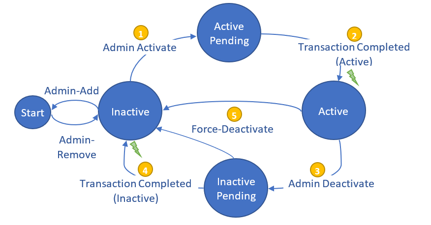
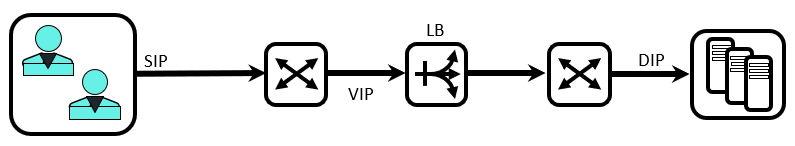
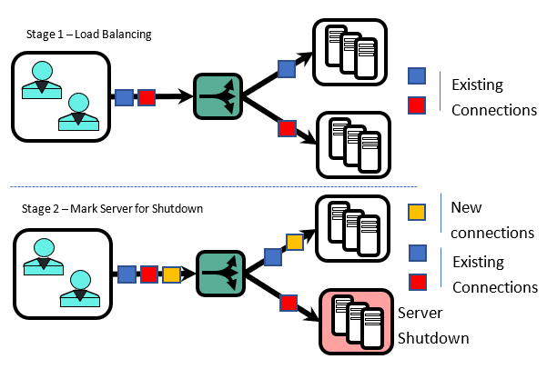

SAI Resilient ECMP Proposal for SAI 1.5.0
-------------------------------------------------------------------------------
 Title       | SAI resilient ECMP
-------------|-----------------------------------------------------------------
 Authors     | InsidePacket Inc.
 Status      | In review
 Type        | Standards track
 Created     | 02/23/2020
 Updated     | 02/23/2020
 SAI-Version | 1.5.0

-------------------------------------------------------------------------------

## Overview

This document introduces a resilient ECMP load balancing, and defines the SAI APIs needed for its configuration and status retrieval.   

This document covers the following aspects:
1. Introduce the concept and [behavioral model](#behavioral-model) of resilient ECMP load balancing.
1. Introduce the [state transition logic](#resilient-state-transition) of resilient ECMP endpoints addition and removal.
1. Present a L4 Load Balancer with session persistence as a use case a resilient ECMP example use case.
1. Introduce SAI APIs to define resilient ECMP properties and monitor its status.

## Behavioral Model

### Resilient Equal Cost Multipath (ECMP)

Equal Cost Multipath (ECMP) is a forwarding strategy where a single destination can be reached via multiple equivalent paths.
ECMP Load Balancing is a mechanism of selecting a specific path among multiple paths to the destination.
Resilient ECMP consistently assigns next hop to the destination based on a designated set of fields. In other words, resilient ECMP consistently maps a flow to an endpoint.

### Resilient State Transition 
Each member of the ECMP group can be either active or inactive. In a steady state, traffic is flowing only towards active endpoints. In order to guarantee fully resilient transition, managed state transition of the ECMP member endpoints between active and inactive states must be supported. Managed transition allows adding and removing active endpoints in a way that does not disrupt existing traffic flows.

||
| :--: |
|  |
| Figure 1: ECMP Members State Transition Logic |


The [State Transition Diagram](#state-transition-diagram) above depicts the set of Administrative and Operational states of the ECMP member endpoints, and all possible transitions between these states.

The following **administrative** actions can be applied to each member endpoint:

1.	Add
1.	Remove
1.	Activate
1.	Deactivate
1.	Force-deactivate

Accordingly, a member endpoint can be in one of the following **administrative** states:

1. Inactive
1. Active

Transitioning between states involves additional intermediate **operational** states. A member endpoint can be in one of the following **operational** states:

1. Inactive
1. Active Pending
1. Active
1. Inactive Pending

#### Admin-Add/Remove an Endpoint
A new member can be added to the resilient ECMP group in either *Active* or *Inactive* state. When adding a member in an *Active* state, the initial operational state will be *Inactive* state and transitioned to an *Active* state as described below.

Existing member can be removed from the group. When removing a member in an *Active* state, it is will go through an *Inactive* operational state as described below, before removal from the group.

#### Admin-Activate an Endpoint
When activated (1), the node enters a transient phase, during which it appears in a *Active Pending* operational state. 
Throughout this phase, traffic is not load balanced towards this endpoint, and the load balancing mechanism is updated in a way that allows adding the new member without disrupting active traffic flows. The exact nature of this phase is implementation specific; it can e.g. implement the following internal stages:
* Identify the members that will be affected by adding a new member
* Identify the corresponding flows, and ensure that they will not be disrupted during the update (add member) transaction
* Update the distribution map in a way that ensures that active flows are not disrupted
* Once the transaction ends (2), the member is transitioned into an *Active* state, and a corresponding notification is issued.

#### Admin-Deactivate an Endpoint
Removing or deactivating an active member endpoint (3) changes its state to “Inactive Pending”. This is a transition phase, during which active flows may still run traffic towards the endpoint. Throughout this phase the load distribution map is updated in a way that allows removing the member without disrupting active traffic flows. The exact nature of this phase is implementation specific; it can e.g. implement the following internal stages:
* Identify active traffic flows and ensure that they will not be disrupted during the transition.
* Update the distribution map so that no new traffic flows are directed towards the deactivated member endpoint
* Allow active flows towards the endpoint to expire, or perform alternative logic that concludes the transition phase
* Once the transaction completes (4), the member operational state is changed from *Inactive Pending* to *Inactive*, and a corresponding notification is issued

#### Force-Deactivating an Endpoint
* In some cases, members can be Force-deactivated without going through the intermediate *Inactive Pending* phase (5). For example, if a member is detected to be unreachable (e.g. by a heartbeat mechanism), there is no need to go through an intermediate phase since the relevant traffic is already dropped regardless of the load balancing action. In such case, removing this member from the distribution map decreases the impact of an inactive member.


## Example use-case: L4 Load Balancer with Session Persistence

Let's consider a L4 Service Load Balancer (L4LB), which serves as a single destination for a service running on multiple functionally equivalent endpoints. L4LB is identified by a {IP Address, TCP Port} pair representing the load balanced service. Traffic that is received on the L4LB is distributed among multiple endpoints - servers, microservices etc. The Load Balancer IP address is often referred to as a Virtual IP (VIP), and the corresponding service – as a Virtual Service (VS). The network connectivity between the Load Balancer and the end services can be direct, or indirect with other switching devices between them. 
Traffic to the end services can be encapsulated using tunneling methods such as VxLAN or IP in IP.
Below is a schematic representation of the Load Balancing function:

||
| :--: |
|  |
| Figure 2: L4 Load Balancer Schematic Representation |

A network topology with L4 Load Balancers provides high resiliency and source-IP affinity even during changes in service endpoints availability. 

For example:
If an end-server is removed, the L4LB will redirect new connections to remaining servers without impacting the existing traffic while preserving connection affinity allowing active connections to expire:

||
| :--: |
|  |
| Figure 3: L4 Load Balancer Schematic Representation |

Resilient ECMP can be used to set up a L4LB with connection persistence. Graceful server shutdown is supported by the following sequence:
* Move all services in the server scheduled for a graceful shutdown to *Inactive* state
* Wait for the notification indicating that the services where shut down
* Optionally, if the notification times out on some services force-deactivate these services
At this point, the server can be gracefully shut down without impacting active connections.


## API Modification

Resilient ECMP SAI definition relies on the existing [sainexthopgroup.h](../inc/sainexthopgroup.h) API, with the additions and modifications described below.

Using this API allows leveraging existing next-hop-group functionality, including:
* Defining route towards the group
* Restricting traffic to a specific port or a set of ports van be done using ACL rules (see [saiacl.h](../inc/saiacl.h))
* Defining next hop destination and format, including tunneling
* Counting per ECMP group and per member
* Performing bulk attribute-set operations, such as modifying a state of multiple members at once, adding/removing multiple members etc., using sai_bulk_object_* APIs

### Changes to [Next Hop Group](../inc/sainexthopgroup.h) API
* Add a new type to the `sai_next_hop_group_type_t` to identify a next hop group that is a resilient ECMP with session persistence

```C
   /**
     * @brief Next hop group is a consistent ECMP with
     * session persistence. 
     */
    SAI_NEXT_HOP_GROUP_TYPE_L4_SESSION_CONSISTENT,
```

* Add a `sai_next_hop_group_member_admin_state_t` enumerator to specify the ECMP member administrative states: 

```C
 /**
 * @brief Attribute data for #SAI_NEXT_HOP_GROUP_MEMBER_ATTR_ADMIN_STATE
 */
typedef enum _sai_next_hop_group_member_admin_state_t
{
    /** Active */
    SAI_NEXT_HOP_GROUP_MEMBER_ADMIN_STATE_ACTIVE,


    /** Inactive. Graceful shutdown */
    SAI_NEXT_HOP_GROUP_MEMBER_ADMIN_STATE_INACTIVE,


    /** Force inactive. Disruptive to the connections */
    SAI_NEXT_HOP_GROUP_MEMBER_ADMIN_STATE_FORCE_INACTIVE,


} sai_next_hop_group_member_admin_state_t;
```

* Add a `sai_next_hop_group_member_oper_state_t` enumerator to specify the ECMP member operational states:

```C
 /**
   * @brief Attribute data for #SAI_NEXT_HOP_GROUP_MEMBER_ATTR_OPER_STATE
   */
   typedef enum _sai_next_hop_group_member_oper_state_t
   {
       /** Inactive. Does not serve any connections and is safe to remove */
       SAI_NEXT_HOP_GROUP_MEMBER_OPER_STATE_INACTIVE,


       /** Pending becoming active. The new connections are not yet
         * distributed to that member */
       SAI_NEXT_HOP_GROUP_MEMBER_OPER_STATE_ACTIVE_PENDING,


       /** Active. Included in the distribution of the new connections */
       SAI_NEXT_HOP_GROUP_MEMBER_OPER_STATE_ACTIVE,


       /** Pending becoming inactive. The new connections are no longer
         * distributed to this member, but it still has some open connections,
         * so it's not yet safe to remove. */
       SAI_NEXT_HOP_GROUP_MEMBER_OPER_STATE_INACTIVE_PENDING,

} sai_next_hop_group_member_oper_state_t;
```

* Add the data structure returned by a notification callback, informing of the updated state of an ECMP member following a state transition:

```C
/** 
  * @brief Defines the operational status of the next hop group member
  */
  typedef struct _sai_next_hop_group_member_oper_state_notification_t
  {
      /**
      * @brief Next hop group member id.
      *
      * @objects SAI_OBJECT_TYPE_NEXT_HOP_GROUP_MEMBER
      */
      sai_object_id_t member_id;


      /** Next hop group member operational status */
      sai_next_hop_group_member_oper_state_t member_status;

  } sai_next_hop_group_member_oper_state_notification_t;
```

* Add an enumerator value to set the size of the ECMP distribution map to the enumerator `sai_next_hop_group_attr_t`:
 
 ```C
   /**
     * @brief Number of hash buckets in the group
     *
     * @type sai_uint32_t
     * @flags MANDATORY_ON_CREATE | CREATE_ONLY
     * @validonly SAI_NEXT_HOP_GROUP_ATTR_TYPE == SAI_NEXT_HOP_GROUP_TYPE_L4_SESSION_CONSISTENT
     */
    SAI_NEXT_HOP_GROUP_ATTR_NUM_OF_BUCKETS,
```

* Add an enumerator value to the next hop group attributes list, `sai_next_hop_group_member_attr_t`:
```C
   /**
     * @brief Member admin state. Allows for disabling a member without removing it.
     *
     * Should only be used if the type of owning group is SAI_NEXT_HOP_GROUP_TYPE_L4_SESSION_CONSISTENT
     *
     * @type sai_next_hop_group_member_admin_state_t
     * @flags MANDATORY_ON_CREATE | CREATE_AND_SET
     */
    SAI_NEXT_HOP_GROUP_MEMBER_ATTR_ADMIN_STATE,


   /**
     * @brief Member operational status.
     *
     * Should only be used if the type of owning group is SAI_NEXT_HOP_GROUP_TYPE_L4_SESSION_CONSISTENT
     *
     * @type sai_next_hop_group_member_oper_state_t
     * @flags READ_ONLY
     */
    SAI_NEXT_HOP_GROUP_MEMBER_ATTR_OPER_STATE,
```

* Add the notification callback informing of the updated state of an ECMP member following a state transition:

```C
/**
  * @brief Next hop group member state change notification
  *
  * @count data[count]
  *
  * @param[in] count Number of notifications
  * @param[in] data Array of next hop group member operational status
  */
   typedef void (*sai_next_hop_group_member_state_change_notification_fn)(
        _In_ uint32_t count,
        _In_ const sai_next_hop_group_member_oper_state_notification_t *data);
```

### Changes to [Switch](../inc/saiswitch.h) API

And the corresponding entry in the switch attributes `sai_switch_attr_t` at [saiswitch.h](../inc/saiswitch.h):
```C
   /**  
     * @brief Next hop group member state change notification callback
     * function passed to the adapter.
     *
     * In case driver does not support this attribute, The Host adapter should poll
     * port status by SAI_NEXT_HOP_GROUP_MEMBER_ATTR_OPER_STATUS.
     *
     * Use sai_next_hop_group_member_state_change_notification_fn
     * as notification function.
     *
     * @type sai_pointer_t sai_next_hop_group_member_state_change_notification_fn
     * @flags CREATE_AND_SET
     * @default NULL
     */
    SAI_SWITCH_ATTR_NEXT_HOP_MEMBER_OPER_STATE_CHANGE_NOTIFY,
```

