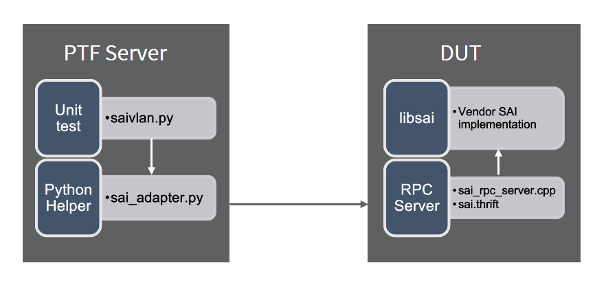
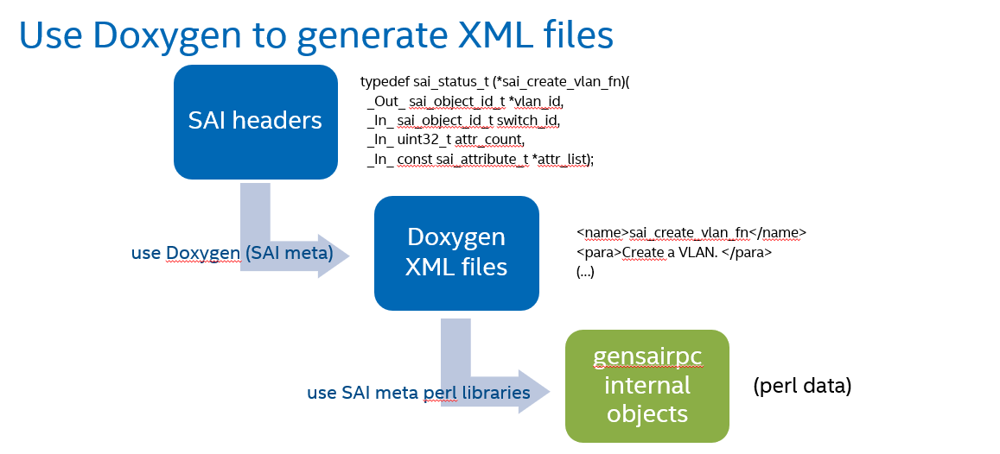
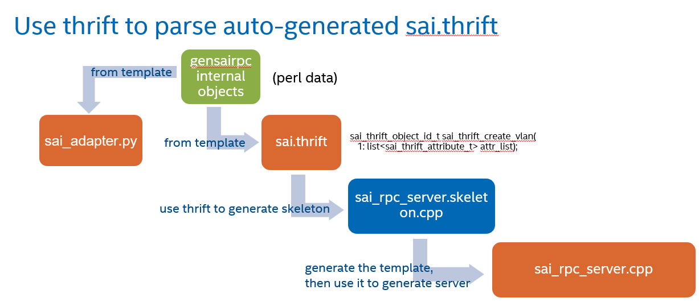

# SAI PTF

| Title       | SAI PTF         |
| ----------- | --------------- |
| Authors     | Intel           |
| Status      | In review       |
| Type        | Standards track |
| Created     | 10/13/2021      |
| SAI-Version | 1.9             |

## Overview

SAI PTF (Packet Testing Framework) is an auto-generated Python based dataplane testing framework. It is using thrift wrapper functions to call C-based SAI functions in Python scripts. The main goal of the framework is to reduce the time spent on writing wrapper functions for SAI which can instead be generated based on SAI headers.

The contribution consists of two parts:
1. Auto-generation framework using existing SAI meta infrastructure
2. New PTF tests using this new framework

## Curent state of testing

Currently there are three main directories in which tests are stored:
- basic_router (contains simple test to illustrate L3 route setup)
- sai_ut (contains C++ unit tests for L2/L3 objects using google-test)
- saithrift (contains PTF based functional tests for L2, L3, tunnel, mirror, ~125 test cases)
First two haven't been updated for almost 3 years, third is updated very rarely.

In order to add a new test it is necessary to:
1. Add an entry in [switch_sai.thrift](https://github.com/opencomputeproject/SAI/blob/b2487f0ef018435a036c0b6a8238e7ae737eb3a2/test/saithrift/src/switch_sai.thrift).
2. Add RPC server method for new entry in [switch_sai_rpc_server.cpp](https://github.com/opencomputeproject/SAI/blob/b2487f0ef018435a036c0b6a8238e7ae737eb3a2/test/saithrift/src/switch_sai_rpc_server.cpp).
3. Add a python wrapper in [switch.py](https://github.com/opencomputeproject/SAI/blob/b2487f0ef018435a036c0b6a8238e7ae737eb3a2/test/saithrift/tests/switch.py) (if applicable).
4. Write a new test

The main goal of autogeneration framework is to generate first three steps based on SAI headers to facilitate the process of writing new tests.

## Autogeneration


__Figure 1: Anatomy of a PTF test__

Autogeneration part, written in Perl, is using SAI headers to create necessary code to test SAI functionality.

The files that are created during autogeneration are:

- **sai.thrift** - containing thrift interface definitions
- **sai_rpc_server.cpp** - functions called via thrift from sai_adapter, which later call SAI functions
- **sai_adapter.py** - python wrappers for calling SAI functions

These files should be generated once, per every SAI version that needs to be tested.

| Input files                                                  | Output files                                                 |
| ------------------------------------------------------------ | ------------------------------------------------------------ |
| **Templates** <br /> - *sai.thrift.tt* <br /><br />**SAI headers** <br /> - *SAI meta* generates XML files with *Doxygen* | **sai.thrit** <br /> - thrift RPC "header" <br /> - generated from scratch <br /> - needed by thrift to generate *sai_rcp_server.skeleton.cpp* <br /> - skeleton is used to generate *sai_rpc_server.cpp.tt* template |
| **Templates** <br /> - *sai_rpc_server_functions.tt* <br /> - *sai_rpc_server_helper_functions.tt* <br /><br />**Auto-generated templates** <br /> - *sai_rpc_server.cpp.tt* (by Thrift from *sai.thrift*) <br /><br />**SAI headers** <br /> - *SAI meta* generates XML files with *Doxygen* | **sai_rpc_server.cpp** <br /> - thrift server <br /> - need *sai.thrift* and *Thrift* itself for generation |
| **Templates** <br /> - *sai_adapter.py.tt* <br /> - *sai_adapter_utils.tt* <br /><br />**SAI headers** <br /> - *SAI meta* generates XML files with *Doxygen* | **sai_adapter.py** <br /> - thrift client and main SAI PTF test library <br /> - generated from scratch |


All of this can be generated with gensairpc.pl script.


__Figure 2: Autogeneration - parsing__


__Figure 3: Autogeneration - parsing__

Autogeneration when upgrading SAI:

```
cd <root>/meta
make
./gensairpc.pl --clean
make clean - C <root>/meta
```

Script gensairpc provides --help option.

## Test execution

Test files written in Python call functions from sai_adapter.py. When running such test auto-generated Python functions are talking with C-based RPC server to run C functions. These functions are used to create/remove SAI object and get/set their attributes. There are also functions allowing to read object statistics and bulk functions. Then it is running internal SAI implementation adopting common SAI interface to test the implementation.

Tests use SAI to configure underlay switch. Using PTF we send and verify packets that are testing switch configuration.

## Tests structure

The tests themselves are based on python unittest framework (https://docs.python.org/3/library/unittest.html). They consist of three main functions:

- setUp() - creating necessary objects
- runTest() - running proper test
- tearDown() - removing all created objects

Tests have to inherit from one of two base classes - SaiHelper or SaiHelperBase. SaiHelperBase is the base class that runs initial configuration for all tests. 

SaiHelperBase initializes switch, gets several switch attributes and stores them into class attributes that are later to be used in tests. The attributes that are stored are:
- default_vlan_id
- default_vrf
- default_1q_bridge
- acl_stage_ingress
- acl_stage_egress
- number_of_active_ports
- port numbers stored into variables portX, where X is the number of port

SaiHelper inherits from SaiHelperBase but provides additional configuration.
The base configuration created by SaiHelper looks like this:

| Port         | LAG          | member      | Bridge port  | VLAN         | member      | RIF          |
| ------------ | ------------ | ------------ | ------------ | ------------ | ------------ | ------------ |
| port0 <br />port1 |         |              | port0_bp <br/>port1_bp | vlan10 | member0 U <br />member1 T | |
| port2 <br />port3 |         |              | port2_bp <br/>port3_bp | vlan20 | member0 U <br />member1 T | |
| port4 <br />port5 <br />port6 | lag1 | member4 <br />member5 <br />member6 | lag1_bp | vlan10 | member2 U | |
| port7 <br />port8 <br />port9 | lag2 | member7 <br />member8 <br />member9 | lag2_bp | vlan20 | member2 T | |
| port10       |              |              |               |             |              | port10_rif |
| port11       |              |              |               |             |              | port11_rif |
| port12       |              |              |               |             |              | port12_rif |
| port13       |              |              |               |             |              | port13_rif |
| port14 <br />port15 <br />port16 | lag3 | member14 <br />member15 <br />member16 | | | | lag3_rif |
| port17 <br />port18 <br />port19 | lag4 | member17 <br />member18 <br />member19 | | | | lag4_rif |
| port20 <br />port21 | | | port20_bp <br/>port21_bp | vlan30 | member0 U <br />member1 T | vlan30_rif |
| port22 <br />port23 | lag1 | member22 <br />member23 | lag5_bp | vlan30 | member2 T | |
| port24 <br />port25 <br />port26 <br />port27 <br />port28 <br />port29 <br />port30 <br />port31 |  |  |  | |  | |


Ports 24-31 can be used by every test to create additional objects.

Both SaiHelper and SaiHelperBase classes are defined in sai_base_test.py file.

If tests intend to have more complicated setUp() then the one that is created in the base class they need to implement setUp() method but remember to call the setUp() from the base class first.

## Example API

Example API for SAI_OBJECT_TYPE_ROUTE_ENTRY.

**sai_adapter.py**

```python
def sai_thrift_create_route_entry(client,
                                  route_entry,
                                  packet_action=None,
                                  user_trap_id=None,
                                  next_hop_id=None,
                                  meta_data=None,
                                  counter_id=None):
    """
    sai_create_route_entry() - RPC client function implementation.

    Args:
        client (Client): SAI RPC client
        route_entry(sai_thrift_route_entry_t): route_entry IN argument

        For the other parameters, see documentation of route_entry CREATE attributes.

    Returns:
        status: the error code

    Raises:
        sai_thrift_exception: If an error occured
                              and sai_adapter.CATCH_EXCEPTIONS is False.
    """
    attr_list = []

    if packet_action is not None:
        attribute_value = sai_thrift_attribute_value_t(s32=packet_action)
        attribute = sai_thrift_attribute_t(id=SAI_ROUTE_ENTRY_ATTR_PACKET_ACTION,
                                           value=attribute_value)
        attr_list.append(attribute)

    if user_trap_id is not None:
        attribute_value = sai_thrift_attribute_value_t(oid=user_trap_id)
        attribute = sai_thrift_attribute_t(id=SAI_ROUTE_ENTRY_ATTR_USER_TRAP_ID,
                                           value=attribute_value)
        attr_list.append(attribute)

    if next_hop_id is not None:
        attribute_value = sai_thrift_attribute_value_t(oid=next_hop_id)
        attribute = sai_thrift_attribute_t(id=SAI_ROUTE_ENTRY_ATTR_NEXT_HOP_ID,
                                           value=attribute_value)
        attr_list.append(attribute)

    if meta_data is not None:
        attribute_value = sai_thrift_attribute_value_t(u32=meta_data)
        attribute = sai_thrift_attribute_t(id=SAI_ROUTE_ENTRY_ATTR_META_DATA,
                                           value=attribute_value)
        attr_list.append(attribute)

    if counter_id is not None:
        attribute_value = sai_thrift_attribute_value_t(oid=counter_id)
        attribute = sai_thrift_attribute_t(id=SAI_ROUTE_ENTRY_ATTR_COUNTER_ID,
                                           value=attribute_value)
        attr_list.append(attribute)

    global status
    status = SAI_STATUS_SUCCESS

    try:
        client.sai_thrift_create_route_entry(route_entry, attr_list)
    except sai_thrift_exception as e:
        status = e.status
        if CATCH_EXCEPTIONS:
            pass
        else:
            raise e

    return status
```

```python
def sai_thrift_remove_route_entry(client,
                                  route_entry):
    """
    sai_remove_route_entry() - RPC client function implementation.

    Args:
        client (Client): SAI RPC client
        route_entry(sai_thrift_route_entry_t): route_entry IN argument

    Returns:
        status: the error code

    Raises:
        sai_thrift_exception: If an error occured
                              and sai_adapter.CATCH_EXCEPTIONS is False.
    """

    global status
    status = SAI_STATUS_SUCCESS

    try:
        client.sai_thrift_remove_route_entry(route_entry)
    except sai_thrift_exception as e:
        status = e.status
        if CATCH_EXCEPTIONS:
            return status
        else:
            raise e

    return status
```

```python
def sai_thrift_set_route_entry_attribute(client,
                                         route_entry,
                                         packet_action=None,
                                         user_trap_id=None,
                                         next_hop_id=None,
                                         meta_data=None,
                                         counter_id=None):
    """
    sai_set_route_entry_attribute() - RPC client function implementation.

    Note, that only one attribute can be set at once.

    Args:
        client (Client): SAI RPC client
        route_entry(sai_thrift_route_entry_t): route_entry IN argument

        For the other parameters, see documentation of route_entry SET attributes.

    Returns:
        status: the error code

    Raises:
        sai_thrift_exception: If an error occured
                              and sai_adapter.CATCH_EXCEPTIONS is False.
    """

    attr = None
    global status
    status = SAI_STATUS_SUCCESS

    try:
        if packet_action is not None:
            attr_value = sai_thrift_attribute_value_t(s32=packet_action)
            attr = sai_thrift_attribute_t(id=SAI_ROUTE_ENTRY_ATTR_PACKET_ACTION,
                                          value=attr_value)
            client.sai_thrift_set_route_entry_attribute(route_entry, attr)

        if user_trap_id is not None:
            attr_value = sai_thrift_attribute_value_t(oid=user_trap_id)
            attr = sai_thrift_attribute_t(id=SAI_ROUTE_ENTRY_ATTR_USER_TRAP_ID,
                                          value=attr_value)
            client.sai_thrift_set_route_entry_attribute(route_entry, attr)

        if next_hop_id is not None:
            attr_value = sai_thrift_attribute_value_t(oid=next_hop_id)
            attr = sai_thrift_attribute_t(id=SAI_ROUTE_ENTRY_ATTR_NEXT_HOP_ID,
                                          value=attr_value)
            client.sai_thrift_set_route_entry_attribute(route_entry, attr)

        if meta_data is not None:
            attr_value = sai_thrift_attribute_value_t(u32=meta_data)
            attr = sai_thrift_attribute_t(id=SAI_ROUTE_ENTRY_ATTR_META_DATA,
                                          value=attr_value)
            client.sai_thrift_set_route_entry_attribute(route_entry, attr)

        if counter_id is not None:
            attr_value = sai_thrift_attribute_value_t(oid=counter_id)
            attr = sai_thrift_attribute_t(id=SAI_ROUTE_ENTRY_ATTR_COUNTER_ID,
                                          value=attr_value)
            client.sai_thrift_set_route_entry_attribute(route_entry, attr)

    except sai_thrift_exception as e:
        status = e.status
        if CATCH_EXCEPTIONS:
            return status
        else:
            raise e

    return status
```

```python
def sai_thrift_get_route_entry_attribute(client,
                                         route_entry,
                                         packet_action=None,
                                         user_trap_id=None,
                                         next_hop_id=None,
                                         meta_data=None,
                                         ip_addr_family=None,
                                         counter_id=None):
    """
    sai_get_route_entry_attribute() - 'get attribute' RPC client function implementation.

    To get a specified attribute, set the argument to 'True'.
    If getting attribute requires specified input (like
    number of list elements), then set the correct value (e.g.
    empty list of specified number of elements) instead.

    Args:
        client (Client): SAI RPC client
        route_entry(sai_thrift_route_entry_t): route_entry IN argument

        For the other parameters, see documentation of route_entry GET attributes.

    Returns:
        Dict[str, sai_thrift_attribute_t]: attrs

    Raises:
        sai_thrift_exception: If an error occured
                              and sai_adapter.CATCH_EXCEPTIONS is False.
    """

    attr_list = []

    if packet_action is not None:
        attribute = sai_thrift_attribute_t(id=SAI_ROUTE_ENTRY_ATTR_PACKET_ACTION)
        attr_list.append(attribute)

    if user_trap_id is not None:
        attribute = sai_thrift_attribute_t(id=SAI_ROUTE_ENTRY_ATTR_USER_TRAP_ID)
        attr_list.append(attribute)

    if next_hop_id is not None:
        attribute = sai_thrift_attribute_t(id=SAI_ROUTE_ENTRY_ATTR_NEXT_HOP_ID)
        attr_list.append(attribute)

    if meta_data is not None:
        attribute = sai_thrift_attribute_t(id=SAI_ROUTE_ENTRY_ATTR_META_DATA)
        attr_list.append(attribute)

    if ip_addr_family is not None:
        attribute = sai_thrift_attribute_t(id=SAI_ROUTE_ENTRY_ATTR_IP_ADDR_FAMILY)
        attr_list.append(attribute)

    if counter_id is not None:
        attribute = sai_thrift_attribute_t(id=SAI_ROUTE_ENTRY_ATTR_COUNTER_ID)
        attr_list.append(attribute)

    attr_list = sai_thrift_attribute_list_t(attr_list=attr_list)
    global status
    status = SAI_STATUS_SUCCESS

    try:
        attr_list = client.sai_thrift_get_route_entry_attribute(route_entry, attr_list)
    except sai_thrift_exception as e:
        status = e.status
        if CATCH_EXCEPTIONS:
            return None
        else:
            raise e

    attrs = dict()

    for attr in attr_list.attr_list:
        if attr.id == SAI_ROUTE_ENTRY_ATTR_PACKET_ACTION:
            attrs["SAI_ROUTE_ENTRY_ATTR_PACKET_ACTION"] = attr.value.s32
            attrs["packet_action"] = attr.value.s32

        if attr.id == SAI_ROUTE_ENTRY_ATTR_USER_TRAP_ID:
            attrs["SAI_ROUTE_ENTRY_ATTR_USER_TRAP_ID"] = attr.value.oid
            attrs["user_trap_id"] = attr.value.oid

        if attr.id == SAI_ROUTE_ENTRY_ATTR_NEXT_HOP_ID:
            attrs["SAI_ROUTE_ENTRY_ATTR_NEXT_HOP_ID"] = attr.value.oid
            attrs["next_hop_id"] = attr.value.oid

        if attr.id == SAI_ROUTE_ENTRY_ATTR_META_DATA:
            attrs["SAI_ROUTE_ENTRY_ATTR_META_DATA"] = attr.value.u32
            attrs["meta_data"] = attr.value.u32

        if attr.id == SAI_ROUTE_ENTRY_ATTR_IP_ADDR_FAMILY:
            attrs["SAI_ROUTE_ENTRY_ATTR_IP_ADDR_FAMILY"] = attr.value.s32
            attrs["ip_addr_family"] = attr.value.s32

        if attr.id == SAI_ROUTE_ENTRY_ATTR_COUNTER_ID:
            attrs["SAI_ROUTE_ENTRY_ATTR_COUNTER_ID"] = attr.value.oid
            attrs["counter_id"] = attr.value.oid

    return attrs
```

**sai.thrift**

```c
// route API structures
struct sai_thrift_route_entry_t {
    1: sai_thrift_object_id_t switch_id;
    2: sai_thrift_object_id_t vr_id;
    3: sai_thrift_ip_prefix_t destination;
}
```

**sai_rpc_server.cpp**

```c++
void sai_thrift_create_route_entry(
        const sai_thrift_route_entry_t &route_entry,
        const std::vector<sai_thrift_attribute_t> &attr_list) {
    sai_status_t status = SAI_STATUS_SUCCESS;
    sai_route_entry_t sai_route_entry;
    sai_route_api_t *route_api;

    status = sai_api_query(SAI_API_ROUTE, (void **)&route_api);
    if (status != SAI_STATUS_SUCCESS) {
        sai_thrift_exception e;
        e.status = status;
        throw e;
    }

    sai_thrift_parse_route_entry(route_entry, &sai_route_entry);

    sai_attribute_t *sai_attr_list = NULL;
    uint32_t attr_count = attr_list.size();

    if (attr_count != 0) {
        sai_attr_list =
            (sai_attribute_t *)malloc(sizeof(sai_attribute_t) * attr_count);
    }
    sai_thrift_parse_route_entry_attributes(attr_list, sai_attr_list);

    status = route_api->create_route_entry(
        &sai_route_entry, attr_count, sai_attr_list);
    if (status != SAI_STATUS_SUCCESS) {
        sai_thrift_exception e;
        e.status = status;
        throw e;
    }

    free(sai_attr_list);
    return;
}
```

```c++
void sai_thrift_remove_route_entry(
        const sai_thrift_route_entry_t &route_entry) {
    sai_status_t status = SAI_STATUS_SUCCESS;
    sai_route_entry_t sai_route_entry;
    sai_route_api_t *route_api;

    status = sai_api_query(SAI_API_ROUTE, (void **)&route_api);
    if (status != SAI_STATUS_SUCCESS) {
        sai_thrift_exception e;
        e.status = status;
        throw e;
    }

    sai_thrift_parse_route_entry(route_entry, &sai_route_entry);

    status = route_api->remove_route_entry(&sai_route_entry);
    if (status != SAI_STATUS_SUCCESS) {
        sai_thrift_exception e;
        e.status = status;
        throw e;
    }

    return;
}
```

```c++
void sai_thrift_set_route_entry_attribute(
        const sai_thrift_route_entry_t &route_entry,
        const sai_thrift_attribute_t &attr) {
    sai_status_t status = SAI_STATUS_SUCCESS;
    sai_route_entry_t sai_route_entry;
    sai_attribute_t sai_attr;
    sai_route_api_t *route_api;

    status = sai_api_query(SAI_API_ROUTE, (void **)&route_api);
    if (status != SAI_STATUS_SUCCESS) {
        sai_thrift_exception e;
        e.status = status;
        throw e;
    }

    sai_thrift_parse_route_entry(route_entry, &sai_route_entry);

    std::vector<sai_thrift_attribute_t> attr_vec;
    attr_vec.push_back(attr);

    sai_thrift_parse_route_entry_attributes(attr_vec, &sai_attr);

    status = route_api->set_route_entry_attribute(&sai_route_entry, &sai_attr);
    if (status != SAI_STATUS_SUCCESS) {
        sai_thrift_exception e;
        e.status = status;
        throw e;
    }

    return;
}
```

```c++
void sai_thrift_get_route_entry_attribute(
        sai_thrift_attribute_list_t &attr_list_out,
        const sai_thrift_route_entry_t &route_entry,
        const sai_thrift_attribute_list_t &attr_list) {
    sai_status_t status = SAI_STATUS_SUCCESS;
    sai_route_entry_t sai_route_entry;
    sai_route_api_t *route_api;

    status = sai_api_query(SAI_API_ROUTE, (void **)&route_api);
    if (status != SAI_STATUS_SUCCESS) {
        sai_thrift_exception e;
        e.status = status;
        throw e;
    }

    sai_thrift_parse_route_entry(route_entry, &sai_route_entry);

    sai_attribute_t *sai_attr_list = NULL;
    uint32_t attr_count = attr_list.attr_list.size();

    if (attr_count != 0) {
        sai_attr_list =
            (sai_attribute_t *)malloc(sizeof(sai_attribute_t) * attr_count);
    } else {
        return;
    }

    const std::vector<sai_thrift_attribute_t> &attr_list_vec =
        attr_list.attr_list;

    sai_thrift_parse_route_entry_attributes(attr_list_vec, sai_attr_list);

    status = route_api->get_route_entry_attribute(
        &sai_route_entry, attr_count, sai_attr_list);
    if (status != SAI_STATUS_SUCCESS) {
        sai_thrift_exception e;
        e.status = status;
        throw e;
    }

    sai_thrift_deparse_route_entry_attributes(
        sai_attr_list, attr_count, attr_list_out.attr_list);
    free(sai_attr_list);
    return;
}
```


**Example object handling**

```python
attr = sai_thrift_get_switch_attribute(self.client, default_virtual_router_id=True)
default_vrf = attr['default_virtual_router_id']
self.assertTrue(default_vrf != 0)
            
port10_rif = sai_thrift_create_router_interface(
                self.client,
                type=SAI_ROUTER_INTERFACE_TYPE_PORT,
                virtual_router_id=self.default_vrf,
                port_id=self.port10)
self.assertTrue(port10_rif != 0)

nhop = sai_thrift_create_next_hop(
                self.client,
                ip=sai_ipaddress('10.10.10.2'),
                router_interface_id=port10_rif,
                type=SAI_NEXT_HOP_TYPE_IP)
self.assertTrue(nhop != 0)

route_entry = sai_thrift_route_entry_t(
                vr_id=self.default_vrf,
                destination=sai_ipprefix('10.10.10.1/32'))
sai_thrift_create_route_entry(self.client, route_entry, next_hop_id=nhop)
self.assertTrue(route_entry != 0)

sai_thrift_set_route_entry_attribute(self.client, route_entry, packet_action=SAI_PACKET_ACTION_DROP)

sai_thrift_remove_route_entry(self.client, self.route_entry)
```

## Implemented tests

Tests are divided into per-feature files such as saivlan.py, saifdb.py etc (~900 test cases). Following features are being tested:

- acl
- bridgeport
- buffer
- debug counter
- dtel
- fdb
- hash
- hostif
- lag
- mirror
- mpls
- nat
- neighbor
- nexthop
- nexthop group
- policer
- port
- qosmap
- queue
- rif
- route
- scheduler
- schedulergroup
- srv6
- switch
- vlan
- vrf
- wred

Additionally saitest.py file contains basic test to verify if framework is working correctly.
