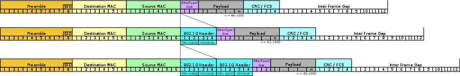
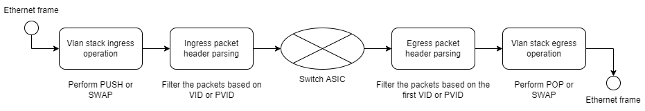
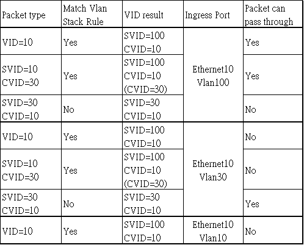
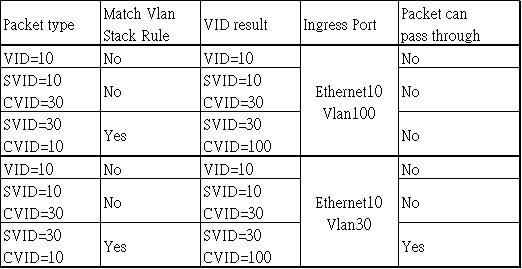
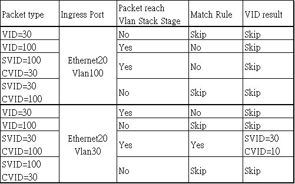
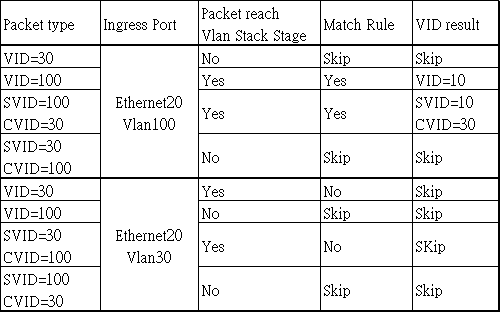
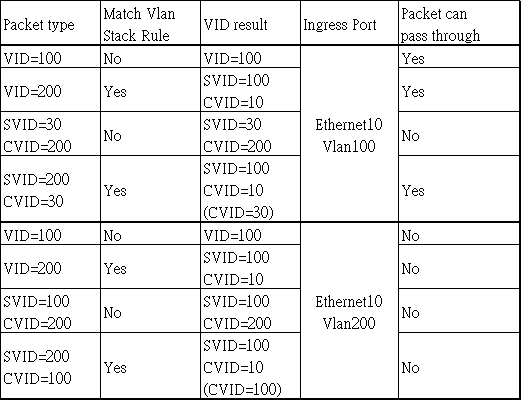

Add support for Vlan Stack
-------------------------------------------------------------------------------

 Title       | Vlan Stack
-------------|-----------------------------------------------------------------
 Authors     | Edge-Core
 Status      | In review
 Type        | Standards track
 Created     | 25/02/2022
 Updated     | -
 SAI-Version | 1.9.1

-------------------------------------------------------------------------------

## Overview ##

The Vlan Stack feature includes two functions, vlan translation and QinQ.


__Figure 1: QinQ usage scenario__


__Figure 2: Vlan Translation usage scenario__

## Packet Format ##

Untagged packet, Single tagged packet and Double tagged packet


__Figure 3: Packet format__

## SAI Pipeline

The packet processing pipeline is below:

__Figure 4: Vlan Stack SAI Pipeline__

## SAI Attribute

| SAI Component | SAI attribute                                  | Description                     |
| ------------- | ---------------------------------------------- | ------------------------------- |
| VLAN Stacking | SAI_VLAN_STACK_ATTR_STAGE                      | At which packet flow direction the action should take effect. Ingress or Egress    |
|               | SAI_VLAN_STACK_ATTR_ACTION                     | Include SWAP, PUSH and POP operation    |
|               | SAI_VLAN_STACK_ATTR_VLAN_APPLIED_PRI           | The "priority" of the new VLAN tag. Default value is 0xFF which will inherit the original vlan tag priority.   |
|               | SAI_VLAN_STACK_ATTR_ORIGINAL_VLAN_ID_INNER     | Used to match the processing packet inner dot1q header.    |
|               | SAI_VLAN_STACK_ATTR_ORIGINAL_VLAN_ID_OUTER     | Used to match the processing packet outer dot1q header. At least one of SAI_VLAN_STACK_ATTR_ORIGINAL_VLAN_ID_INNER and SAI_VLAN_STACK_ATTR_ORIGINAL_VLAN_ID_OUTER attribute should be set. The vlan stacking rule only take effect if packets' dot1q header VLAN_ID match this combination.   |
|               | SAI_VLAN_STACK_ATTR_PORT                       | Target port ID at which the vlan stacking will take effect   |
|               | SAI_VLAN_STACK_ATTR_APPLIED_VLAN_ID_INNER      | New inner vlan ID for the vlan stacking. If the ACTION is POP, this attribute will not take effect.    |
|               | SAI_VLAN_STACK_ATTR_APPLIED_VLAN_ID_OUTER      | New outer vlan ID for the vlan stacking. If the ACTION is POP, this attribute will not take effect. Else, one of SAI_VLAN_STACK_ATTR_APPLIED_VLAN_ID_INNER and SAI_VLAN_STACK_ATTR_APPLIED_VLAN_ID_OUTER attribute should be set    |


## Use cases

### Ingress/Add outer tag based on outer tag
Add an outer dot1q header with VID=100 for those packets with outer VID=10 at Ethernet10

#### Usage

```
sai_object_id_t vlan_stacking_oid;
sai_attribute_t attr;
vector<sai_attribute_t> vlan_stacking_entry_attrs;

attr.id = SAI_VLAN_STACK_ATTR_STAGE;
attr.value.s32 = SAI_VLAN_STACK_STAGE_INGRESS;
vlan_stacking_entry_attrs.push(attr);

attr.id = SAI_VLAN_STACK_ATTR_ACTION;
attr.value.s32 = SAI_VLAN_STACK_ACTION_PUSH;
vlan_stacking_entry_attrs.push(attr);

attr.id = SAI_VLAN_STACK_ATTR_ORIGINAL_VLAN_ID_OUTER;
attr.value.u16 = 10;
vlan_stacking_entry_attrs.push(attr);

attr.id = SAI_VLAN_STACK_ATTR_PORT;
attr.value.oid = 10;
vlan_stacking_entry_attrs.push(attr);

attr.id = SAI_VLAN_STACK_ATTR_APPLIED_VLAN_ID_OUTER;
attr.value.u16 = 100;
vlan_stacking_entry_attrs.push(attr);

attr.id = SAI_VLAN_STACK_ATTR_VLAN_APPLIED_PRI;
attr.value.u8 = 0;
vlan_stacking_entry_attrs.push(attr);

sai_vlan_stack_api->create_vlan_stack(&vlan_stacking_oid, gSwitchId, (uint32_t)vlan_stacking_entry_attrs.size(), vlan_stacking_entry_attrs.data());
```

#### Behavior


__Table 1: Vlan Stack Ingress Push Outer__

### Ingress/Add outer tag based on inner tag
Add an outer dot1q header with VID=100 for those packets with inner dot1q VID=10 at Ethernet10

#### Usage

```
sai_object_id_t vlan_stacking_oid;
sai_attribute_t attr;
vector<sai_attribute_t> vlan_stacking_entry_attrs;

attr.id = SAI_VLAN_STACK_ATTR_STAGE;
attr.value.s32 = SAI_VLAN_STACK_STAGE_INGRESS;
vlan_stacking_entry_attrs.push(attr);

attr.id = SAI_VLAN_STACK_ATTR_ACTION;
attr.value.s32 = SAI_VLAN_STACK_ACTION_PUSH;
vlan_stacking_entry_attrs.push(attr);

attr.id = SAI_VLAN_STACK_ATTR_ORIGINAL_VLAN_ID_INNER;
attr.value.u16 = 10;
vlan_stacking_entry_attrs.push(attr);

attr.id = SAI_VLAN_STACK_ATTR_PORT;
attr.value.oid = 10;
vlan_stacking_entry_attrs.push(attr);

attr.id = SAI_VLAN_STACK_ATTR_APPLIED_VLAN_ID_OUTER;
attr.value.u16 = 100;
vlan_stacking_entry_attrs.push(attr);

attr.id = SAI_VLAN_STACK_ATTR_VLAN_APPLIED_PRI;
attr.value.u8 = 0;
vlan_stacking_entry_attrs.push(attr);

sai_vlan_stack_api->create_vlan_stack(&vlan_stacking_oid, gSwitchId, (uint32_t)vlan_stacking_entry_attrs.size(), vlan_stacking_entry_attrs.data());
```

#### Behavior


__Table 2: Vlan Stack Ingress Push Inner__

### Egress/Remove outer tag based on outer tag
Remove outer dot1q header for those packets with original outer dot1q header VID=100 at Ethernet20

#### Usage

```
sai_object_id_t vlan_stacking_oid;
sai_attribute_t attr;
vector<sai_attribute_t> vlan_stacking_entry_attrs;

attr.id = SAI_VLAN_STACK_ATTR_STAGE;
attr.value.s32 = SAI_VLAN_STACK_STAGE_EGRESS;
vlan_stacking_entry_attrs.push(attr);

attr.id = SAI_VLAN_STACK_ATTR_ACTION;
attr.value.s32 = SAI_VLAN_STACK_ACTION_POP;
vlan_stacking_entry_attrs.push(attr);

attr.id = SAI_VLAN_STACK_ATTR_ORIGINAL_VLAN_ID_OUTER;
attr.value.u16 = 100;
vlan_stacking_entry_attrs.push(attr);

attr.id = SAI_VLAN_STACK_ATTR_PORT;
attr.value.oid = 20;
vlan_stacking_entry_attrs.push(attr);

attr.id = SAI_VLAN_STACK_ATTR_VLAN_APPLIED_PRI;
attr.value.u8 = 0;
vlan_stacking_entry_attrs.push(attr);

sai_vlan_stack_api->create_vlan_stack(&vlan_stacking_oid, gSwitchId, (uint32_t)vlan_stacking_entry_attrs.size(), vlan_stacking_entry_attrs.data());
```

#### Behavior


__Table 3: Vlan Stack Egress Pop Outer__

### Ingress/Swap inner tag based on inner tag
Change inner dot1q header to VID=100 for those packets with original inner dot1q header VID=10 when they flow into Ethernet10

#### Usage

```
sai_object_id_t vlan_stacking_oid;
sai_attribute_t attr;
vector<sai_attribute_t> vlan_stacking_entry_attrs;

attr.id = SAI_VLAN_STACK_ATTR_STAGE;
attr.value.s32 = SAI_VLAN_STACK_STAGE_INGRESS;
vlan_stacking_entry_attrs.push(attr);

attr.id = SAI_VLAN_STACK_ATTR_ACTION;
attr.value.s32 = SAI_VLAN_STACK_ACTION_SWAP;
vlan_stacking_entry_attrs.push(attr);

attr.id = SAI_VLAN_STACK_ATTR_ORIGINAL_VLAN_ID_INNER;
attr.value.u16 = 10;
vlan_stacking_entry_attrs.push(attr);

attr.id = SAI_VLAN_STACK_ATTR_PORT;
attr.value.oid = 10;
vlan_stacking_entry_attrs.push(attr);

attr.id = SAI_VLAN_STACK_ATTR_APPLIED_VLAN_ID_INNER;
attr.value.u16 = 100;
vlan_stacking_entry_attrs.push(attr);

attr.id = SAI_VLAN_STACK_ATTR_VLAN_APPLIED_PRI;
attr.value.u8 = 0;
vlan_stacking_entry_attrs.push(attr);

sai_vlan_stack_api->create_vlan_stack(&vlan_stacking_oid, gSwitchId, (uint32_t)vlan_stacking_entry_attrs.size(), vlan_stacking_entry_attrs.data());
```

#### Behavior


__Table 4: Vlan Stack Ingress Swap Inner__

### Ingress/Swap outer tag based on outer tag
Change outer dot1q header to VID=100 for those packets with original outer dot1q header VID=10 when they flow into Ethernet10

#### Usage

```
sai_object_id_t vlan_stacking_oid;
sai_attribute_t attr;
vector<sai_attribute_t> vlan_stacking_entry_attrs;

attr.id = SAI_VLAN_STACK_ATTR_STAGE;
attr.value.s32 = SAI_VLAN_STACK_STAGE_INGRESS;
vlan_stacking_entry_attrs.push(attr);

attr.id = SAI_VLAN_STACK_ATTR_ACTION;
attr.value.s32 = SAI_VLAN_STACK_ACTION_SWAP;
vlan_stacking_entry_attrs.push(attr);

attr.id = SAI_VLAN_STACK_ATTR_ORIGINAL_VLAN_ID_OUTER;
attr.value.u16 = 10;
vlan_stacking_entry_attrs.push(attr);

attr.id = SAI_VLAN_STACK_ATTR_PORT;
attr.value.oid = 10;
vlan_stacking_entry_attrs.push(attr);

attr.id = SAI_VLAN_STACK_ATTR_APPLIED_VLAN_ID_OUTER;
attr.value.u16 = 100;
vlan_stacking_entry_attrs.push(attr);

attr.id = SAI_VLAN_STACK_ATTR_VLAN_APPLIED_PRI;
attr.value.u8 = 0;
vlan_stacking_entry_attrs.push(attr);

sai_vlan_stack_api->create_vlan_stack(&vlan_stacking_oid, gSwitchId, (uint32_t)vlan_stacking_entry_attrs.size(), vlan_stacking_entry_attrs.data());
```

#### Behavior


__Table 5: Vlan Stack Ingress Swap Outer__

### Egress/Swap inner tag based on inner tag
Change inner dot1q header to VID=10 for those packets with original inner dot1q header VID=100 when they flow away from Ethernet20

#### Usage

```
sai_object_id_t vlan_stacking_oid;
sai_attribute_t attr;
vector<sai_attribute_t> vlan_stacking_entry_attrs;

attr.id = SAI_VLAN_STACK_ATTR_STAGE;
attr.value.s32 = SAI_VLAN_STACK_STAGE_EGRESS;
vlan_stacking_entry_attrs.push(attr);

attr.id = SAI_VLAN_STACK_ATTR_ACTION;
attr.value.s32 = SAI_VLAN_STACK_ACTION_SWAP;
vlan_stacking_entry_attrs.push(attr);

attr.id = SAI_VLAN_STACK_ATTR_ORIGINAL_VLAN_ID_INNER;
attr.value.u16 = 100;
vlan_stacking_entry_attrs.push(attr);

attr.id = SAI_VLAN_STACK_ATTR_PORT;
attr.value.oid = 20;
vlan_stacking_entry_attrs.push(attr);

attr.id = SAI_VLAN_STACK_ATTR_APPLIED_VLAN_ID_INNER;
attr.value.u16 = 10;
vlan_stacking_entry_attrs.push(attr);

attr.id = SAI_VLAN_STACK_ATTR_VLAN_APPLIED_PRI;
attr.value.u8 = 0;
vlan_stacking_entry_attrs.push(attr);

sai_vlan_stack_api->create_vlan_stack(&vlan_stacking_oid, gSwitchId, (uint32_t)vlan_stacking_entry_attrs.size(), vlan_stacking_entry_attrs.data());
```

#### Behavior


__Table 6: Vlan Stack Egress Swap Inner__

### Egress/Swap outer tag based on outer tag
Change outer dot1q header to VID=10 for those packets with original outer dot1q header VID=100 when they flow away from Ethernet20

#### Usage

```
sai_object_id_t vlan_stacking_oid;
sai_attribute_t attr;
vector<sai_attribute_t> vlan_stacking_entry_attrs;

attr.id = SAI_VLAN_STACK_ATTR_STAGE;
attr.value.s32 = SAI_VLAN_STACK_STAGE_EGRESS;
vlan_stacking_entry_attrs.push(attr);

attr.id = SAI_VLAN_STACK_ATTR_ACTION;
attr.value.s32 = SAI_VLAN_STACK_ACTION_SWAP;
vlan_stacking_entry_attrs.push(attr);

attr.id = SAI_VLAN_STACK_ATTR_ORIGINAL_VLAN_ID_OUTER;
attr.value.u16 = 100;
vlan_stacking_entry_attrs.push(attr);

attr.id = SAI_VLAN_STACK_ATTR_PORT;
attr.value.oid = 20;
vlan_stacking_entry_attrs.push(attr);

attr.id = SAI_VLAN_STACK_ATTR_APPLIED_VLAN_ID_OUTER;
attr.value.u16 = 10;
vlan_stacking_entry_attrs.push(attr);

attr.id = SAI_VLAN_STACK_ATTR_VLAN_APPLIED_PRI;
attr.value.u8 = 0;
vlan_stacking_entry_attrs.push(attr);

sai_vlan_stack_api->create_vlan_stack(&vlan_stacking_oid, gSwitchId, (uint32_t)vlan_stacking_entry_attrs.size(), vlan_stacking_entry_attrs.data());
```

#### Behavior


__Table 7: Vlan Stack Egress Swap Outer__

### Ingress/Swap on double tag from single tag
Change the incoming packet with outer dot1q header VID=200 to a double tag packet with outer VID=100 and inner VID=10 at port Ethernet10

#### Usage

```
sai_object_id_t vlan_stacking_oid;
sai_attribute_t attr;
vector<sai_attribute_t> vlan_stacking_entry_attrs;

attr.id = SAI_VLAN_STACK_ATTR_STAGE;
attr.value.s32 = SAI_VLAN_STACK_STAGE_INGRESS;
vlan_stacking_entry_attrs.push(attr);

attr.id = SAI_VLAN_STACK_ATTR_ACTION;
attr.value.s32 = SAI_VLAN_STACK_ACTION_SWAP;
vlan_stacking_entry_attrs.push(attr);

attr.id = SAI_VLAN_STACK_ATTR_ORIGINAL_VLAN_ID_OUTER;
attr.value.u16 = 200;
vlan_stacking_entry_attrs.push(attr);

attr.id = SAI_VLAN_STACK_ATTR_PORT;
attr.value.oid = 10;
vlan_stacking_entry_attrs.push(attr);

attr.id = SAI_VLAN_STACK_ATTR_APPLIED_VLAN_ID_INNER;
attr.value.u16 = 10;
vlan_stacking_entry_attrs.push(attr);

attr.id = SAI_VLAN_STACK_ATTR_APPLIED_VLAN_ID_OUTER;
attr.value.u16 = 100;
vlan_stacking_entry_attrs.push(attr);

attr.id = SAI_VLAN_STACK_ATTR_VLAN_APPLIED_PRI;
attr.value.u8 = 0;
vlan_stacking_entry_attrs.push(attr);

sai_vlan_stack_api->create_vlan_stack(&vlan_stacking_oid, gSwitchId, (uint32_t)vlan_stacking_entry_attrs.size(), vlan_stacking_entry_attrs.data());
```

#### Behavior


__Table 8: Vlan Stack Ingress Swap Single to Double__

### Egress/Swap on single tag from double tag
Change the outgoing double tag packet with outer VID=100 and inner VID=10 to a single tag packet with VID=200 at port Ethernet20

#### Usage

```
sai_object_id_t vlan_stacking_oid;
sai_attribute_t attr;
vector<sai_attribute_t> vlan_stacking_entry_attrs;

attr.id = SAI_VLAN_STACK_ATTR_STAGE;
attr.value.s32 = SAI_VLAN_STACK_STAGE_EGRESS;
vlan_stacking_entry_attrs.push(attr);

attr.id = SAI_VLAN_STACK_ATTR_ACTION;
attr.value.s32 = SAI_VLAN_STACK_ACTION_SWAP;
vlan_stacking_entry_attrs.push(attr);

attr.id = SAI_VLAN_STACK_ATTR_ORIGINAL_VLAN_ID_INNER;
attr.value.u16 = 10;
vlan_stacking_entry_attrs.push(attr);

attr.id = SAI_VLAN_STACK_ATTR_ORIGINAL_VLAN_ID_OUTER;
attr.value.u16 = 100;
vlan_stacking_entry_attrs.push(attr);

attr.id = SAI_VLAN_STACK_ATTR_PORT;
attr.value.oid = 20;
vlan_stacking_entry_attrs.push(attr);

attr.id = SAI_VLAN_STACK_ATTR_APPLIED_VLAN_ID_OUTER;
attr.value.u16 = 200;
vlan_stacking_entry_attrs.push(attr);

attr.id = SAI_VLAN_STACK_ATTR_VLAN_APPLIED_PRI;
attr.value.u8 = 0;
vlan_stacking_entry_attrs.push(attr);

sai_vlan_stack_api->create_vlan_stack(&vlan_stacking_oid, gSwitchId, (uint32_t)vlan_stacking_entry_attrs.size(), vlan_stacking_entry_attrs.data());
```

#### Behavior


__Table 9: Vlan Stack Ingress Swap Double to Single__