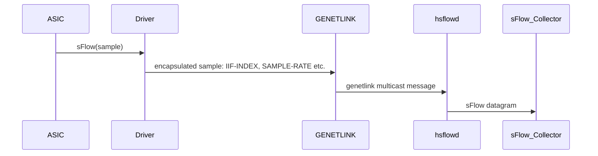

# SAI sFlow enhancements to support truncation of sample packets to Local host 
-------------------------------------------------------------------------------
 Title       | Support truncation of sample packets sent to Local host
-------------|-----------------------------------------------------------------
 Authors     | Ravindranath C K (__Marvell__)
 Status      | In review
 Type        | Standards track
 Created     | 2024-08-8 - Initial Draft
 SAI-Version | 1.15
-------------------------------------------------------------------------------

##  Use case and problem statement


SAI supports sending sample packets to both the local host (`SAI_SAMPLEPACKET_TYPE_SLOW_PATH`) and remote ports (`SAI_SAMPLEPACKET_TYPE_MIRROR_SESSION`). A common application of sFlow is _Flow Monitoring_, i.e., to track the IP flow (5-tuple) information of active flows within the switch. In such cases, the application only requires data up to the L4 header of each sampled packet. By truncating the packets sent to the CPU, this requirement is met while significantly reducing CPU bandwidth usage. This is particularly beneficial when monitoring flows with jumbo packets.

Currently, SAI does not provide an option for users to configure truncation for sample packets directed to the CPU (`SAI_SAMPLEPACKET_TYPE_SLOW_PATH`).

**Note:** For packets that are sampled to an external collector using `SAI_SAMPLEPACKET_TYPE_MIRROR_SESSION`, truncation can be configured using `SAI_MIRROR_SESSION_ATTR_TRUNCATE_SIZE`. However, this is not applicable for `SAI_SAMPLEPACKET_TYPE_SLOW_PATH`.

---

## SAI API model for sFlow to local collector


### API model

The below explains the API sequence for configuring `SAI_SAMPLEPACKET_TYPE_SLOW_PATH`.


#### Create Hostif Trap

```c
sai_attribute_t attr_list[4];

attr_list[0].id = SAI_HOSTIF_TRAP_ATTR_TRAP_TYPE;
attr_list[0].value.s32 = SAI_HOSTIF_TRAP_TYPE_SAMPLEPACKET;

attr_list[1].id = SAI_HOSTIF_TRAP_ATTR_TRAP_GROUP;
attr_list[1].value.oid = <trap_group_oid>;

attr_list[2].id = SAI_HOSTIF_TRAP_ATTR_PACKET_ACTION;
attr_list[2].value.s32 = SAI_PACKET_ACTION_TRAP;

attr_list[3].id = SAI_HOSTIF_TRAP_ATTR_TRAP_PRIORITY;
attr_list[3].value.u32 = 1;

sai_object_id_t hostif_trap_id;
sai_create_hostif_trap(&hostif_trap_id, switch_id, 4, attr_list);
```

#### Create Sample Packet

```c
sai_attribute_t attr[2];

attr[i].id = SAI_SAMPLEPACKET_ATTR_TYPE;
attr[i++].value.s32 = SAI_SAMPLEPACKET_TYPE_SLOW_PATH;

attr[i].id = SAI_SAMPLEPACKET_ATTR_SAMPLE_RATE;
attr[i++].value.u32 = 100000;


sai_object_id_t samplepacket_id;
sai_create_samplepacket(&samplepacket_id, switch_id, i, &attr);
```

#### Enable Sample Packet on Port

```c
sai_attribute_t attr;

attr.id = SAI_PORT_ATTR_INGRESS_SAMPLEPACKET_ENABLE;
attr.value.oid = samplepacket_id;

sai_set_port_attribute(port_oid, &attr);
```


### Data flow

The below diagram explains the sample packet data flow using SONiC as an example.




## SAI Enhancements to support truncation


```c
@@ -114,6 +114,26 @@ typedef enum _sai_samplepacket_attr_t
      */
     SAI_SAMPLEPACKET_ATTR_MODE,

+    /**
+     * @brief Enable truncation of sampled packets
+     *
+     * @type bool
+     * @flags CREATE_AND_SET
+     * @default false
+     */
+    SAI_SAMPLEPACKET_ATTR_TRUNCATE_ENABLE,
+
+    /**
+     * @brief Truncate size. Truncate sampled packets to this size to reduce traffic bandwidth
+     *
+     * This value takes effect when SAI_SAMPLEPACKET_ATTR_TRUNCATE_ENABLE is True.
+     *
+     * @type sai_uint32_t
+     * @flags CREATE_AND_SET
+     * @default internal
+     */
+    SAI_SAMPLEPACKET_ATTR_TRUNCATE_SIZE,
+
```

Notes:  
- We do not add the metadata `@validonly SAI_SAMPLEPACKET_ATTR_TRUNCATE_ENABLE==true` for SAI_SAMPLEPACKET_ATTR_TRUNCATE_SIZE. This is to allow the user to first configure the truncation size, and then enable truncation.
- The default value of SAI_SAMPLEPACKET_ATTR_TRUNCATE_SIZE depends on the hardware and can be retrieved using the get attribute. Further, this attribute may not be configurable in some platforms. The examples show how an application can use capability query APIs to handle these hardware differences.

---
## API Example


#### Example 1: Sample Packet with Truncation to user configured size

A simple example to enable truncation.

```c
sai_attribute_t attr[MAX];
sai_object_id_t samplepacket_id;
int i=0;

attr[i].id = SAI_SAMPLEPACKET_ATTR_TYPE;
attr[i++].value.s32 = SAI_SAMPLEPACKET_TYPE_SLOW_PATH;

attr[i].id = SAI_SAMPLEPACKET_ATTR_SAMPLE_RATE;
attr[i++].value.u32 = 100000;

attr[i].id = SAI_SAMPLEPACKET_ATTR_TRUNCATE_SIZE;
attr[i++].value.u32 = 128;

attr[i].id = SAI_SAMPLEPACKET_ATTR_TRUNCATE_ENABLE;
attr[i++].value.booldata = true;


sai_create_samplepacket(&samplepacket_id, switch_id, i, attr);
```


---

#### Example 2: Sample Packet Truncation to Hardware Supported Size

Let us look at a more complex example on how the NOS can handle platform differences. On some platforms, the truncation size is not user configurable (e.g., limited to the cell size). The application can use the capability query API to identify whether:
1. Truncation is supported.
2. Truncation is user configurable.

Further, the new attribute can be used to read the hardware's default truncation size.

```c
sai_status_t status = SAI_STATUS_SUCCESS;
sai_attr_capability_t truncate_capability={0}; 
sai_attr_capability_t truncate_size_capability={0}; 
bool is_truncate_size_configurable = false; // Flag to check if truncation size is configurable
uint16_t truncate_size = 128; // Default truncation size

// Query if truncation is supported
status = sai_query_attribute_capability(gSwitchId, SAI_OBJECT_TYPE_SAMPLEPACKET, 
    SAI_SAMPLEPACKET_ATTR_TRUNCATE_ENABLE, &truncate_capability);
if (status == SAI_STATUS_SUCCESS && tuncate_capability.create_implemented) {
    // If supported, set the truncation enable attribute
    attr[i].id = SAI_SAMPLEPACKET_ATTR_TRUNCATE_ENABLE;
    attr[i++].value.booldata = true;

    // Query if truncation size attribute is supported
    status = sai_query_attribute_capability(gSwitchId, SAI_OBJECT_TYPE_SAMPLEPACKET, 
        SAI_SAMPLEPACKET_ATTR_TRUNCATE_SIZE, &truncate_size_capability);
    if (status == SAI_STATUS_SUCCESS && truncate_size_capability.create_implemented) {
        // If supported, set the truncation size attribute
        attr[i].id = SAI_SAMPLEPACKET_ATTR_TRUNCATE_SIZE;
        attr[i++].value.u32 = truncate_size;
        is_truncate_size_configurable = true; // Mark truncation size is configurable
    }
}

// Create the sample packet with the specified attributes
sai_create_samplepacket(&samplepacket_id, switch_id, i, &attr);

if (!is_truncate_size_configurable && truncate_size_capability.read_implemented) {
    // If truncation size is not configurable, read the default truncation size from hardware
    attr.id = SAI_SAMPLEPACKET_ATTR_TRUNCATE_SIZE;
    sai_get_samplepacket(samplepacket_id, switch_id, 1, &attr);      
    truncate_size = attr.value.u32; // Update the truncation size with the hardware default
}
```
