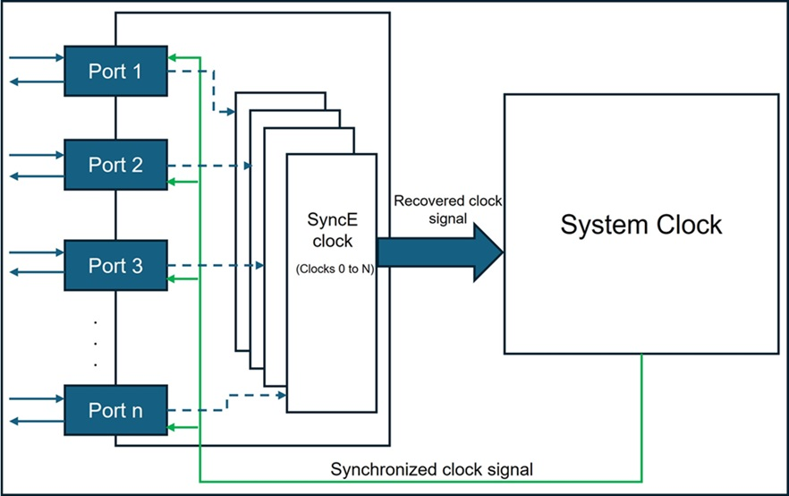
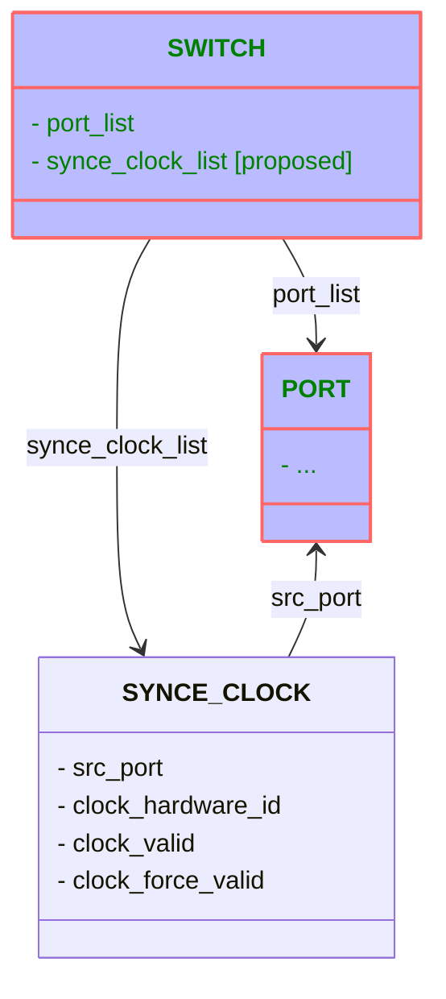

# [SAI] Synchronous Ethernet
-------------------------------------------------------------------------------
 Title       | Synchronous Ethernet
-------------|-----------------------------------------------------------------
 Authors     | Rajesh Perumal, Dhruvkumar Patel, Ravindranath C K (Marvell)
 Status      | In review
 Type        | Standards track
 Created     | 2025-02-20
 SAI-Version | 1.16
-------------------------------------------------------------------------------

## 1.0  Introduction

The aim of the Synchronous Ethernet(SyncE) is to transfer timing(frequency) over the Ethernet physical layer across a network.
SyncE synchronizes the system clock(which drives the tx frequency) at the Switch device. The switch NPU can have one or more
SyncE clocks. The SyncE clocks recover the frequency from any port of the switch and inputs it to the system clock.
                                SyncE relies on Ethernet port, System clock, the recovered clock signal from SyncE clock and
the quality of recovered clock signal. SyncE clock programming (recovery of the clock signal to the System clock) and 
the SSM for SyncE(quality signalling) are focused in this proposal.

## 2.0  Behavior

### SyncE clock object



SyncE clock and an Ethernet port needs to be associated to setup the the clock source for the associated SyncE clock object.
The recovered clock signal will be fed to the System clock. System clock drives the Ethernet Tx(frequency) with the help of 
these SyncE clock sources. SyncE clock has the following attributes : clock-status, clock-hardware-id and clock-src-port.




### SSM over ESMC for SyncE
SyncE relies on quality of recovered clock which needs to be communicated through synchronization status message(SSM) over the
Ethernet synchronization messaging channel(ESMC). To trap the SSM PDUs, new Hostif trap is added.

## 3.0 SAI Enhancement

### 1. New object type for SyncE clock

```c
      SAI_OBJECT_TYPE_SYNCE_CLOCK                    = 114,
```


```c
/**
 * @brief Enum defining SyncE attributes.
 */
typedef enum _sai_synce_clock_attr_t
{
    /**
     * @brief Start of attributes
     */
    SAI_SYNCE_CLOCK_ATTR_START = 0x00000000,
    /**
     * @brief Synchronous ethernet(SyncE) clock source port
     *
     * Sets the Port to be the source for SyncE
     *
     * @type sai_object_id_t
     * @objects SAI_OBJECT_TYPE_PORT
     * @allownull true
     * @flags CREATE_AND_SET
     * @default SAI_NULL_OBJECT_ID
     */
    SAI_SYNCE_CLOCK_ATTR_SRC_PORT = SAI_SYNCE_CLOCK_ATTR_START,

    /**
     * @brief Synchronous ethernet (SyncE) clock status
     *
     * Gets recovered clock signal with respect to hardware
     * (valid only after attaching the clock to a clock source port)
     *
     * @type bool
     * @flags READ_ONLY
     */
    SAI_SYNCE_CLOCK_ATTR_CLOCK_VALID,

    /**
     * @brief Hardware clock-id
     *
     * Returns the hardware clock-id associated
     *
     * @type sai_uint64_t
     * @flags READ_ONLY
     */
    SAI_SYNCE_CLOCK_ATTR_CLOCK_HARDWARE_ID,

    /**
     * @brief Synchronous ethernet (SYNCE) clock status
     *
     * Force set the recovered clock signal state (for debugging)
     *
     * @type sai_synce_recovered_clock_state_t
     * @flags CREATE_AND_SET
     * @default SAI_SYNCE_RECOVERED_CLOCK_STATE_FORCE_VALID_DISABLE
     */
    SAI_SYNCE_CLOCK_ATTR_DEBUG_FORCE_SYNCE_RECOVERED_CLOCK_STATE,

    /**
     * @brief End of attributes
     */
    SAI_SYNCE_CLOCK_ATTR_END,
    /** Custom range base value */
    SAI_SYNCE_CLOCK_ATTR_CUSTOM_RANGE_START = 0x10000000,

    /** End of custom range base */
    SAI_SYNCE_CLOCK_ATTR_CUSTOM_RANGE_END

} sai_synce_clock_attr_t;

/**
 * @brief Attribute data for #SAI_SYNCE_CLOCK_ATTR_DEBUG_FORCE_SYNCE_RECOVERED_CLOCK_STATE
 */
typedef enum _sai_synce_recovered_clock_state_t
{
    /** Valid signal set as per device fault status */
    SAI_SYNCE_RECOVERED_CLOCK_STATE_FORCE_VALID_DISABLE,

    /** Valid signal forced to valid */
    SAI_SYNCE_RECOVERED_CLOCK_STATE_FORCE_ENABLE_VALID,

    /** Valid signal forced to invalid */
    SAI_SYNCE_RECOVERED_CLOCK_STATE_FORCE_ENABLE_INVALID,

} sai_synce_recovered_clock_state_t;


/**
 * @brief Create SyncE clock
 *
 * @param[out] synce_id SyncE clock id
 * @param[in] switch_id The Switch id
 * @param[in] attr_count Number of attributes
 * @param[in] attr_list Array of attributes
 *
 * @return #SAI_STATUS_SUCCESS on success, failure status code on error
 */
typedef sai_status_t (*sai_create_synce_clock_fn)(
        _Out_ sai_object_id_t *synce_clock_id,
        _In_ sai_object_id_t switch_id,
        _In_ uint32_t attr_count,
        _In_ const sai_attribute_t *attr_list);

/**
 * @brief Remove SyncE clock
 *
 * @param[in] synce_id SyncE clock id
 *
 * @return #SAI_STATUS_SUCCESS on success, failure status code on error
 */
typedef sai_status_t (*sai_remove_synce_clock_fn)(
        _In_ sai_object_id_t synce_clock_id);

/**
 * @brief Set SyncE clock Attribute
 *
 * @param[in] synce_id SyncE clock id
 * @param[in] attr Attribute to set
 *
 * @return #SAI_STATUS_SUCCESS on success, failure status code on error
 */
typedef sai_status_t (*sai_set_synce_clock_attribute_fn)(
        _In_ sai_object_id_t synce_clock_id,
        _In_ const sai_attribute_t *attr);

/**
 * @brief Get SyncE clock attribute
 *
 * @param[in] synce_id SyncE clock id
 * @param[in] attr_count Number of attributes
 * @param[inout] attr_list Array of attributes
 *
 * @return #SAI_STATUS_SUCCESS on success, failure status code on error
 */
typedef sai_status_t (*sai_get_synce_clock_attribute_fn)(
        _In_ sai_object_id_t synce_clock_id,
        _In_ uint32_t attr_count,
        _Inout_ sai_attribute_t *attr_list);
```

### 2. New hostif trap for SSM over ESMC PDUs

```c
    /**
     * @brief ITU-T G.8264/Y.1364 Ethernet synchronization messaging channel (ESMC) protocol
     * (Dst Mac = 01-80-C2-00-00-02 EtherType = 0x8809 Slow Protocol Subtype = 0xA)
     * (default packet action is drop)
     */
    SAI_HOSTIF_TRAP_TYPE_ESMC = 0x00000014,
```

### 3. Switch attributes for SyncE clock
```c
    /**
     * @brief Maximum number of SyncE clocks supported
     *
     * @type sai_uint32_t
     * @flags READ_ONLY
     */
    SAI_SWITCH_ATTR_MAX_SYNCE_CLOCK_COUNT,

    /**
     *
     *@brief List of SyncE clock objects on the Switch
     *
     *@type sai_object_list_t
     *@flags READ_ONLY
     *@objects SAI_OBJECT_TYPE_SYNCE_CLOCK
     *@default internal
     */
    SAI_SWITCH_ATTR_SYNCE_CLOCK_LIST,
```

## 4.0 API Example

The API workflow is as given below,
1. Get the maximum number of available SyncE clocks from the switch
2. Get the list of available SyncE clocks from the switch
3. Update the clock source by associating an Ethernet port to the SyncE clock object
4. Update the clock source by updating the port at SyncE clock object​
5. Remove the clock source by setting NULL oid to SyncE clock object
6. Get and set SyncE clock object
7. Remove the SyncE clock object

### 1. Get the maximum SyncE-clock objects present at the switch​

```c
attr_count = 0;​
attr_list[attr_count++].id = SAI_SWITCH_ATTR_MAX_SYNCE_CLOCK_COUNT;​
sai_get_switch_attribute_fn(switch_id, attr_count, attr_list) ;​
synce_clocks_count = attr_list[0].value.u32;
```
### 2. Get the list of SyncE-clock objects present at the switch​
```c
attr_count = 0;​
attr_clock_list[attr_count].id = SAI_SWITCH_ATTR_SYNCE_CLOCK_LIST;​
attr_clock_list[attr_count].value.objlist.count = synce_clocks_count;
attr_clock_list[attr_count++].value.objlist.list  = malloc(synce_clocks_count * sizeof(sai_object_id_t))
sai_get_switch_attribute_fn(switch_id, attr_count, attr_clock_list) ;​
```
### 3. Associate a port to the SyncE-clock object to make it a clock source​
```c
attr_count = 0;​
attr_list[attr_count].id = SAI_SYNCE_CLOCK_ATTR_SRC_PORT ;​
attr_list[attr_count++].value.oid = port_oid;​

sai_object_t synce_clock0_oid = attr_clock_list[0].value.oid;​

sai_set_synce_clock_attribute_fn(synce_clock0_oid, switch_oid, attr_count, attr_list) ;
```

### 4. Update the clock source by updating the port at SyncE clock object​

```c
synce_attr.id = SAI_SYNCE_CLOCK_ATTR_SRC_PORT;​
synce_attr.value.oid = new_port_oid;​
sai_set_synce_clock_attribute_fn (synce_clock0_oid, synce_attr);
```

### 5. Remove a port from clock source by setting NULL oid to SyncE object​

```c
synce_attr.id = SAI_SYNCE_CLOCK_ATTR_SRC_PORT;​
synce_attr.value.oid = SAI_NULL_OBJECT_ID;​
sai_set_synce_clock_attribute_fn (synce_clock0_oid, synce_attr) ;​
```

### 6.    Getting/Setting SyncE-clock attributes
```c
/** Get Synce-clock */​

attr_count = 0;​

attr_list[attr_count++].id = SAI_SYNCE_CLOCK_ATTR_CLOCK_VALID;​
attr_list[attr_count++].id = SAI_SYNCE_CLOCK_ATTR_CLOCK_HARDWARE_ID;​
sai_get_synce_clock_attribute_fn (synce_clock0_oid, attr_count, attr_list);​


/** Set Synce-clock state by force */​
synce_clock_attr.id = SAI_SYNCE_CLOCK_ATTR_DEBUG_FORCE_CLOCK_STATE;​
synce_clock_attr.value.u32 = SAI_SYNCE_CLOCK_FORCE_ENABLE_VALID;​

sai_set_synce_clock_attribute_fn (synce_clock0_oid, synce_clock_attr);​
```
### 7. Removing a SyncE clock object

```c
/** Remove SyncE-clock*/
sai_remove_synce_clock_fn (synce_clock0_oid) ;​
```
