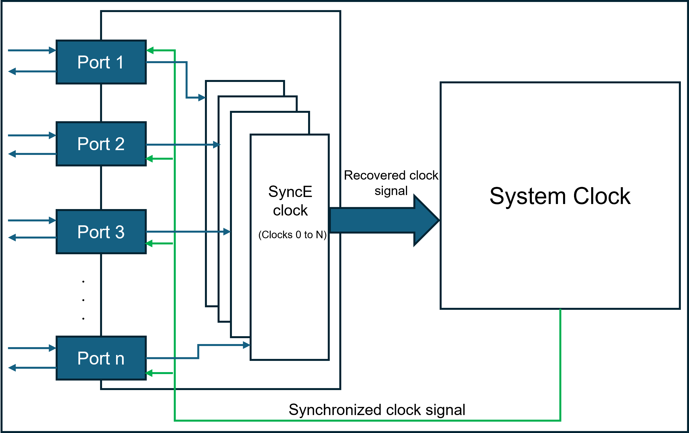
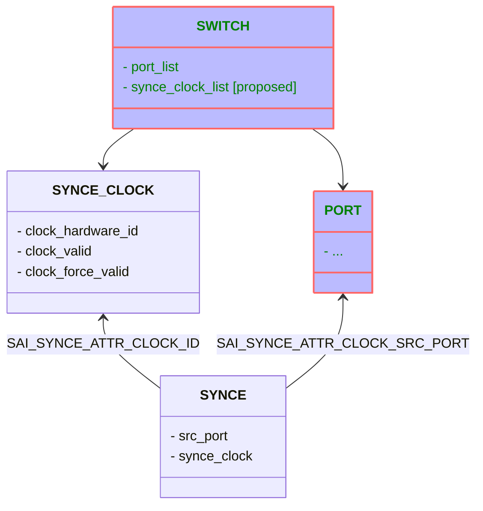

# [SAI] Synchronous Ethernet
-------------------------------------------------------------------------------
 Title       | Synchronous Ethernet
-------------|-----------------------------------------------------------------
 Authors     | Rajesh Perumal, Ravindranath C K (Marvell)
 Status      | In review
 Type        | Standards track
 Created     | 2025-02-20
 SAI-Version | 1.16
-------------------------------------------------------------------------------

## 1.0  Introduction

The aim of the Synchronous Ethernet(SyncE) is to transfer timing(frequency) over the Ethernet physical layer across a network.
SyncE synchronizes the system clock(which drives the tx frequency) at the Switch device. The switch NPU can have one or more
SyncE clocks. The SyncE clocks recover the frequency from any port of the switch and inputs it to system clock.
                                SyncE relies on Ethernet port, System clock, the recovered clock signal from SyncE clock and
the quality of recovered clock signal. As the Ethernet port programming can be done through an already available SAI_OBJECT_TYPE_PORT object,
the SyncE clock programming and the SSM for SyncE is focused in this proposal.

## 2.0  Behavior

### SyncE clock object
SyncE clock object inputs recovered clock signal to the System clock. This has the properties such as clock-status and clock-hardware-id.


### SyncE object
SyncE object associates a SyncE clock object with an Ethernet port. This association sets the Ethernet port as the clock source for
the associated SyncE clock object.


```mermaid
classDiagram
    class SYNCE_CLOCK {
        - clock_hardware_id
        - clock_valid
        - clock_force_valid
    }

    class PORT {
        - ...
    }

    class SWITCH {
        - port_list
        - synce_clock_list [proposed]
    }

    class SYNCE {
        - src_port
        - synce_clock
    }

    %% Relationships
    SWITCH --> SYNCE_CLOCK
    SWITCH --> PORT
    SYNCE_CLOCK <-- SYNCE : SAI_SYNCE_ATTR_CLOCK_ID
    PORT <-- SYNCE : SAI_SYNCE_ATTR_CLOCK_SRC_PORT

style PORT fill:#bbf,stroke:#f66,stroke-width:2px,color:green;
style SWITCH fill:#bbf,stroke:#f66,stroke-width:2px,color:green;

```

### SSM over ESMC for SyncE
SyncE relies on quality of recovered clock which needs to be communicated through synchronization status message(SSM) over the
Ethernet synchronization messaging channel(ESMC). To trap the SSM PDUs, new Hostif trap is added.

## 3.0 SAI Enhancement

### 1. New object types for SyncE clock and SyncE object

```c
      SAI_OBJECT_TYPE_SYNCE                    = 114,
      SAI_OBJECT_TYPE_SYNCE_CLOCK              = 115,
```

### 2. New object of type SyncE clock

```c
/**
 * @brief Enum defining SyncE attributes.
 */
typedef enum _sai_synce_clock_attr_t
{
    /**
     * @brief Start of attributes
     */
    SAI_SYNCE_CLOCK_ATTR_START = 0x00000000,

    /**
     * @brief Synchronous ethernet (SyncE) clock status
     *
     * Gets recovered clock signal with respect to hardware
     * (Works only after attaching this to an SyncE instance)
     *
     * @type bool
     * @flags READ_ONLY
     */
    SAI_SYNCE_CLOCK_ATTR_CLOCK_VALID = SAI_SYNCE_CLOCK_ATTR_START,

    /**
     * @brief Hardware clock-id
     *
     * Returns the hardware clock-id associated with this sync-E
     * object
     *
     * @type sai_uint32_t
     * @flags READ_ONLY
     */
    SAI_SYNCE_CLOCK_ATTR_CLOCK_HARDWARE_ID,

    /**
     * @brief Synchronous ethernet (SyncE) clock status
     *
     * Force set the recovered clock signal state for debugging
     *
     * @type sai_synce_recovered_clock_state_t
     * @flags CREATE_AND_SET
     * @default SAI_SYNCE_RECOVERED_CLOCK_STATE_FORCE_VALID_DISABLE
     */
    SAI_SYNCE_CLOCK_ATTR_DEBUG_FORCE_SYNCE_RECOVERED_CLOCK_STATE,

    /**
     * @brief End of attributes
     */
    SAI_SYNCE_CLOCK_ATTR_END,
    /** Custom range base value */
    SAI_SYNCE_CLOCK_ATTR_CUSTOM_RANGE_START = 0x10000000,

    /** End of custom range base */
    SAI_SYNCE_CLOCK_ATTR_CUSTOM_RANGE_END

} sai_synce_clock_attr_t;

/**
 * @brief Attribute data for #SAI_SYNCE_CLOCK_ATTR_DEBUG_FORCE_CLOCK_VALID
 */
typedef enum _sai_synce_recovered_clock_state_t
{
    /** Valid signal set as per device fault status */
    SAI_SYNCE_RECOVERED_CLOCK_STATE_FORCE_VALID_DISABLE,

    /** Valid signal forced to valid */
    SAI_SYNCE_RECOVERED_CLOCK_STATE_FORCE_ENABLE_VALID,

    /** Valid signal forced to invalid */
    SAI_SYNCE_RECOVERED_CLOCK_STATE_FORCE_ENABLE_INVALID,

} sai_synce_recovered_clock_state_t;

/**
 * @brief Create SyncE clock
 *
 * @param[out] synce_id SyncE clock id
 * @param[in] switch_id The Switch id
 * @param[in] attr_count Number of attributes
 * @param[in] attr_list Array of attributes
 *
 * @return #SAI_STATUS_SUCCESS on success, failure status code on error
 */
typedef sai_status_t (*sai_create_synce_clock_fn)(
        _Out_ sai_object_id_t *synce_clock_id,
        _In_ sai_object_id_t switch_id,
        _In_ uint32_t attr_count,
        _In_ const sai_attribute_t *attr_list);

/**
 * @brief Remove SyncE clock
 *
 * @param[in] synce_id SyncE clock id
 *
 * @return #SAI_STATUS_SUCCESS on success, failure status code on error
 */
typedef sai_status_t (*sai_remove_synce_clock_fn)(
        _In_ sai_object_id_t synce_clock_id);

/**
 * @brief Set SyncE clock Attribute
 *
 * @param[in] synce_id SyncE clock id
 * @param[in] attr Attribute to set
 *
 * @return #SAI_STATUS_SUCCESS on success, failure status code on error
 */
typedef sai_status_t (*sai_set_synce_clock_attribute_fn)(
        _In_ sai_object_id_t synce_clock_id,
        _In_ const sai_attribute_t *attr);

/**
 * @brief Get SyncE clock attribute
 *
 * @param[in] synce_id SyncE clock id
 * @param[in] attr_count Number of attributes
 * @param[inout] attr_list Array of attributes
 *
 * @return #SAI_STATUS_SUCCESS on success, failure status code on error
 */
typedef sai_status_t (*sai_get_synce_clock_attribute_fn)(
        _In_ sai_object_id_t synce_clock_id,
        _In_ uint32_t attr_count,
        _Inout_ sai_attribute_t *attr_list);
```
### 3. New object of type SyncE

 ```c
/**
 * @brief Enum defining SyncE attributes.
 */
typedef enum _sai_synce_attr_t
{
    /**
     * @brief Start of attributes
     */
    SAI_SYNCE_ATTR_START = 0x00000000,

   /**
     * @brief Synchronous ethernet(SyncE) clock source configuration
     *
     * Sets the SyncE clock source
     *
     * @type sai_object_id_t
     * @objects SAI_OBJECT_TYPE_SYNCE_CLOCK
     * @allownull false
     * @flags CREATE_ONLY | MANDATORY_ON_CREATE
     */
    SAI_SYNCE_ATTR_CLOCK_ID = SAI_SYNCE_ATTR_START,

    /**
     * @brief Synchronous ethernet(SyncE) clock source port
     *
     * Sets the Port to be the source for SyncE
     *
     * @type sai_object_id_t
     * @objects SAI_OBJECT_TYPE_PORT
     * @allownull true
     * @flags CREATE_AND_SET | MANDATORY_ON_CREATE
     */
    SAI_SYNCE_ATTR_CLOCK_SRC_PORT,

    /**
     * @brief End of attributes
     */
    SAI_SYNCE_ATTR_END,

    /** Custom range base value */
    SAI_SYNCE_ATTR_CUSTOM_RANGE_START = 0x10000000,

    /** End of custom range base */
    SAI_SYNCE_ATTR_CUSTOM_RANGE_END

} sai_synce_attr_t;

/**
 * @brief Create SyncE
 *
 * @param[out] synce_id SyncE id
 * @param[in] switch_id The Switch id
 * @param[in] attr_count Number of attributes
 * @param[in] attr_list Array of attributes
 *
 * @return #SAI_STATUS_SUCCESS on success, failure status code on error
 */
typedef sai_status_t (*sai_create_synce_fn)(
        _Out_ sai_object_id_t *synce_id,
        _In_ sai_object_id_t switch_id,
        _In_ uint32_t attr_count,
        _In_ const sai_attribute_t *attr_list);

/**
 * @brief Remove SyncE
 *
 * @param[in] synce_id SyncE id
 *
 * @return #SAI_STATUS_SUCCESS on success, failure status code on error
 */
typedef sai_status_t (*sai_remove_synce_fn)(
        _In_ sai_object_id_t synce_id);

/**
 * @brief Set SyncE Attribute
 *
 * @param[in] synce_id SyncE id
 * @param[in] attr Attribute to set
 *
 * @return #SAI_STATUS_SUCCESS on success, failure status code on error
 */
typedef sai_status_t (*sai_set_synce_attribute_fn)(
        _In_ sai_object_id_t synce_id,
        _In_ const sai_attribute_t *attr);

/**
 * @brief Get SyncE attribute
 *
 * @param[in] synce_id SyncE id
 * @param[in] attr_count Number of attributes
 * @param[inout] attr_list Array of attributes
 *
 * @return #SAI_STATUS_SUCCESS on success, failure status code on error
 */
typedef sai_status_t (*sai_get_synce_attribute_fn)(
        _In_ sai_object_id_t synce_id,
        _In_ uint32_t attr_count,
        _Inout_ sai_attribute_t *attr_list);
```

### 4. New hostif trap for SSM over ESMC PDUs

```c
    /**
     * @brief ITU-T G.8264/Y.1364 Ethernet synchronization messaging channel (ESMC) protocol
     * (Dst Mac = 01-80-C2-00-00-02 EtherType = 0x8809 Slow Protocol Subtype = 0xA)
     * (default packet action is drop)
     */
    SAI_HOSTIF_TRAP_TYPE_ESMC = 0x00008003,
```

### 5. Switch attributes for SyncE clock
```c
    /**
     * @brief Maximum number of SyncE clocks supported
     *
     * @type sai_uint32_t
     * @flags READ_ONLY
     */
    SAI_SWITCH_ATTR_MAX_SYNCE_CLOCK_COUNT,

    /**
     *
     *@brief List of SyncE clock objects on the Switch
     *
     *@type sai_object_list_t
     *@flags READ_ONLY
     *@objects SAI_OBJECT_TYPE_SYNCE_CLOCK
     *@default internal
     */
    SAI_SWITCH_ATTR_SYNCE_CLOCK_LIST,
```

## 4.0 API Example

The API workflow is as given below,
1. Get the maximum number of available SyncE clocks from the switch
2. Get the list of available SyncE clocks from the switch
3. Create a SyncE object to associate a port with a SyncE clock
4. Update the clock source by changing the source port at SyncE object
5. Remove the clock source by setting NULL oid to SyncE object
6. Delete a SyncE object
7. Get and set SyncE clock object

### 1. Get the maximum SyncE-clocks present at the switch​

```c
attr_count = 0;​
attr_list[attr_count++].id = SAI_SWITCH_ATTR_MAX_SYNCE_CLOCK_COUNT;​
sai_get_switch_attribute_fn(switch_id, attr_count, attr_list) ;​
synce_clocks_count = attr_list[0].value.u32;
```
### 2. Get the list of SyncE-clocks present at the switch​
```c
attr_count = 0;​
attr_clock_list[attr_count].id = SAI_SWITCH_ATTR_SYNCE_CLOCK_LIST;​
attr_clock_list[attr_count].value.objlist.count = synce_clocks_count;
attr_clock_list[attr_count++].value.objlist.list  = malloc(synce_clocks_count * sizeof(sai_object_id_t))
sai_get_switch_attribute_fn(switch_id, attr_count, attr_clock_list) ;​
```
### 3. Assign a SyncE-clock to a port thru SyncE object to make it a clock source​
```c
attr_count = 0;​
attr_list[attr_count].id = SAI_SYNCE_ATTR_CLOCK_SRC_PORT ;​
attr_list[attr_count++].value.oid = port_oid;​

sai_object_t clock0_oid = attr_clock_list[0].value.oid;​

attr_list[attr_count].id = SAI_SYNCE_ATTR_CLOCK_ID ;​
attr_list[attr_count++].value.oid = clock0_oid;​
sai_create_synce_fn(&synce_oid, switch_oid, attr_count, attr_list) ;
```

### 4. Update the clock source by updating the port at SyncE object​

```c
synce_attr.id = SAI_SYNCE_ATTR_CLOCK_SRC_PORT​;​
synce_attr.value.oid = new_port_oid;​
sai_set_synce_fn (synce_oid, synce_attr) ;
```

### 5. Remove a port from clock source by setting NULL oid to SyncE object​

```c
synce_attr.id = SAI_SYNCE_ATTR_PORT_ID ;​
synce_attr.value.oid = SAI_NULL_OBJECT_ID;​
sai_set_synce_fn (synce_oid, synce_attr) ;​
```

### 6. Deleting a SyncE object
```c
sai_remove_synce_fn (synce_oid) ;
```

### 7.    Getting/Setting syncE-clock attributes
```c
/** Get Synce-clock */​

attr_count = 0;​

attr_list[attr_count++].id = SAI_SYNCE_CLOCK_ATTR_CLOCK_VALID;​
attr_list[attr_count++].id = SAI_SYNCE_CLOCK_ATTR_CLOCK_HARDWARE_ID;​
sai_get_synce_clock_fn (synce_clock_oid, attr_count, attr_list) ;​


/** Set Synce-clock state by force */​
synce_clock_attr.id = SAI_SYNCE_CLOCK_ATTR_DEBUG_FORCE_SYNCE_RECOVERED_CLOCK_STATE;​
synce_clock_attr.value.u32 = SAI_SYNCE_RECOVERED_CLOCK_STATE_FORCE_ENABLE_VALID;​

sai_set_synce_clock_fn (synce_clock_oid, synce_clock_attr) ;​
```
