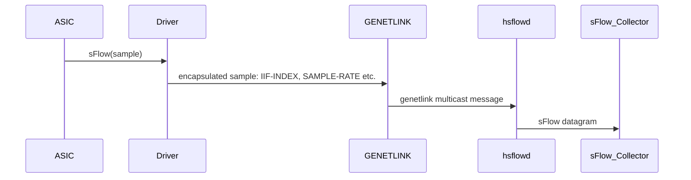
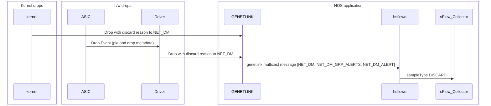

# SAI TAM Enhancements to support MOD to Local host via Generic Netlink
-------------------------------------------------------------------------------
 Title       | Send Mirror-on-Drop packets to Local host via Generic Netlink
-------------|-----------------------------------------------------------------
 Authors     | Ravindranath C K, Pooja Panara (Marvell)
 Status      | In review
 Type        | Standards track
 Created     | 2024-03-28 - Initial Draft
 SAI-Version | 1.14
-------------------------------------------------------------------------------

## 1.0  Introduction

**Mirror-On-Drop (MOD)** is one of the monitoring events supported by the existing SAI TAM 2.0 API. This proposal introduces additional attributes and enums to configure the hardware to send MOD packets to localhost via GENETLINK.

## 2.0  Use case

Using GENETLINK is a popular mechanism to hand off packets/events to user agents in the local host. The GENETLINK mechanism is supported in SAI for sFlow samples. The below example describes the usage of GENETLINK for sFlow in SONiC/SAI today.




sFlow standard supports exporting drop events apart from packet samples. sFlow agents (eg. hsflowd used in SONiC) support drop event exporting as well.



## 3.0 Missing attributes

To configure MOD with local collector over GENETLINK using SAI TAM API model, the attributes for the following functionality are missing:

- Specifying that the export format/transport is GENETLINK
- During collector creation, specifying the GENETLINK  Family and MC Group
- Selecting the CPU Queue to send the GENETLINK packets
- Rate-limiting the number of MOD packets sent to CPU


## 4.0 SAI Enhancements

### Associating a Hostif User Defined Trap (UDT) to a TAM Collector
The main enhancement is to let the SAI user bind a User Defined Trap to a SAI TAM collector. This allows the SAI user to leverage the existing SAI hostif APIs to select the CPU queue, rate limit MOD packets and specify the hostif channel. This avoids the need to add these attributes (CPU queue, rate limit etc.) to the TAM Collector.

**Note**: _This new collector attribute can be applied to any collector on the local host and is not specific to GENETLINK. In an API example later in this document, we demonstrate how to utilize this attribute to steer MOD packets to a hostif of type GENETLINK, leveraging the existing SAI hostif APIs._

```c

typedef enum _sai_hostif_user_defined_trap_type_t {
    ...
    ...

     /** FDB traps */
     SAI_HOSTIF_USER_DEFINED_TRAP_TYPE_FDB,

     /** In Segment Entry traps */
     SAI_HOSTIF_USER_DEFINED_TRAP_TYPE_INSEG_ENTRY,

+    /** Traps to be associated with TAM collector */
+    SAI_HOSTIF_USER_DEFINED_TRAP_TYPE_TAM,
+
     /** Custom range base */
     SAI_HOSTIF_USER_DEFINED_TRAP_TYPE_CUSTOM_RANGE_BASE = 0x00001000,

     /**
      * @brief End of user defined trap types
      */
     SAI_HOSTIF_USER_DEFINED_TRAP_TYPE_END,

 } sai_hostif_user_defined_trap_type_t;

```

```c
typedef enum _sai_tam_collector_attr_t {
    ...
    ...
     SAI_TAM_COLLECTOR_ATTR_TRANSPORT,

     /**
      * @brief DSCP value
      *
      * @type sai_uint8_t
      * @flags MANDATORY_ON_CREATE | CREATE_AND_SET
      */
     SAI_TAM_COLLECTOR_ATTR_DSCP_VALUE,

+    /**
+     * @brief Hostif User Defined Trap object used to reach local host via GENETLINK
+     *
+     * @type sai_object_id_t
+     * @flags CREATE_AND_SET
+     * @objects SAI_OBJECT_TYPE_HOSTIF_USER_DEFINED_TRAP
+     * @allownull true
+     * @default SAI_NULL_OBJECT_ID
+     * @validonly SAI_TAM_COLLECTOR_ATTR_LOCALHOST == true
+     */
+    SAI_TAM_COLLECTOR_ATTR_HOSTIF_TRAP,
+
     /**
      * @brief End of Attributes
      */
     SAI_TAM_COLLECTOR_ATTR_END,

}  sai_tam_collector_attr_t;
```

### New Report type for GENETLINK

* The report object is a mandatory attribute to create a TAM Event Action. And to create a report object, the report type is a mandatory attribute. The currently supported report types (see below) are not relevant for GENETLINK. So, a new report type is added for GENETLINK.

* The enum for vendor specific report type (SAI_TAM_REPORT_TYPE_VENDOR_EXTN) does not start after an offset from the standard report types. This can cause new report types to overlap with vendor specific report types. In order to fix this:
    * Introducing a custom range base that should be used when there is a need for multiple vendor specific extensions.


```c
typedef enum _sai_tam_report_type_t{

    /**
     * @brief Report using SFLOW
     */
    SAI_TAM_REPORT_TYPE_SFLOW,

    /**
     * @brief Report using IPFIX
     */
    SAI_TAM_REPORT_TYPE_IPFIX,

    /**
     * @brief Report using GPB
     */
    SAI_TAM_REPORT_TYPE_PROTO,

    /**
     * @brief Report using THRIFT
     */
    SAI_TAM_REPORT_TYPE_THRIFT,

    /**
     * @brief Report using JSON
     */
    SAI_TAM_REPORT_TYPE_JSON,

    /**
     * @brief Report using P4 format
     */
     SAI_TAM_REPORT_TYPE_P4_EXTN,

     /**
      * @brief Report using Histogram
      */
     SAI_TAM_REPORT_TYPE_HISTOGRAM,

     /**
      * @brief Report using vendor extensions
      */
     SAI_TAM_REPORT_TYPE_VENDOR_EXTN,
+
+    /**
+     * @brief Report using GENETLINK
+     */
+    SAI_TAM_REPORT_TYPE_GENETLINK,
+
+    /**
+     * @brief Custom range base value
+     */
+    SAI_TAM_REPORT_TYPE_CUSTOM_RANGE_BASE = 0x10000000,
 } sai_tam_report_type_t;
```

## 5.0  API Example


###  Create TAM Report

```c
sai_attr_list[0].id = SAI_TAM_REPORT_ATTR_TYPE;
sai_attr_list[0].value.s32 = SAI_TAM_REPORT_TYPE_GENETLINK; //new

attr_count = 1;

sai_create_tam_report_fn(
   &sai_tam_report_obj,
   switch_id,
   attr_count,
   sai_attr_list);
```

### Create TAM Event Action

```c
sai_attr_list[0].id = SAI_TAM_EVENT_ACTION_ATTR_REPORT_TYPE
sai_attr_list[0].value.oid = sai_tam_report_obj;

attr_count = 1;

sai_create_tam_event_action_fn(
   &sai_tam_event_action_obj,
   switch_id,
   attr_count,
   sai_attr_list);
```

### Craete TAM Transport

 ```c
sai_attr_list[0].id = SAI_TAM_TRANSPORT_ATTR_TRANSPORT_TYPE;
sai_attr_list[0].value.s32 =  SAI_TAM_TRANSPORT_TYPE_NONE;

attr_count = 1;

sai_create_tam_transport_fn(
   &sai_tam_transport_obj,
   switch_id,
   attr_count,
   sai_attr_list);
```

### Create Hostif

 ```c
sai_attr_list[0].id = SAI_HOSTIF_ATTR_TYPE;
sai_attr_list[0].value.s32 =  SAI_HOSTIF_TYPE_GENETLINK;

sai_attr_list[1].id = SAI_HOSTIF_ATTR_NAME; //GENETLINK family name
strncpy(sai_attr_list[1].value.chardata, "NET_DM", 31);
sai_attr_list[1].value.chardata[31] = '\0';

sai_attr_list[2].id = SAI_HOSTIF_ATTR_GENETLINK_MCGRP_NAME;
strncpy(sai_attr_list[2].value.chardata, "events", 31);
sai_attr_list[2].value.chardata[31] = '\0';

attr_count = 3;

sai_create_hostif_fn(
   &sai_hostif_obj,
   switch_id,
   attr_count,
   sai_attr_list);
```

### Create Policer
 ```c
sai_attr_list[0].id = SAI_POLICER_ATTR_METER_TYPE;
sai_attr_list[0].value.s32 = SAI_METER_TYPE_PACKETS;

sai_attr_list[1].id = SAI_POLICER_ATTR_MODE;
sai_attr_list[1].value.s32 =  SAI_POLICER_MODE_SR_TCM;

sai_attr_list[2].id = SAI_POLICER_ATTR_CBS;
sai_attr_list[2].value.s32 = 2000;

sai_attr_list[3].id = SAI_POLICER_ATTR_CIR;
sai_attr_list[3].value.s32 = 1000; //rate limit MOD packets to CPU


attr_count = 4;

sai_create_policer_fn(
   &sai_policer_obj,
   switch_id,
   attr_count,
   sai_attr_list);
```


### Create Hostif Trap Group
 ```c
sai_attr_list[0].id = SAI_HOSTIF_TRAP_GROUP_ATTR_QUEUE;
sai_attr_list[0].value.s32 = 7;

sai_attr_list[1].id = SAI_HOSTIF_TRAP_GROUP_ATTR_POLICER;
sai_attr_list[1].value.oid =  sai_policer_obj;

attr_count = 2;

sai_create_hostif_trap_group_fn(
   &sai_hostif_trap_group_obj,
   switch_id,
   attr_count,
   sai_attr_list);
```


### Create Hostif User Defined Trap
 ```c
sai_attr_list[0].id = SAI_HOSTIF_USER_DEFINED_TRAP_ATTR_TYPE;
sai_attr_list[0].value.s32 =  SAI_HOSTIF_USER_DEFINED_TRAP_TYPE_TAM; //new

sai_attr_list[1].id = SAI_HOSTIF_USER_DEFINED_TRAP_ATTR_TRAP_GROUP;
sai_attr_list[1].value.oid =  trap_group_obj;

attr_count = 2;

sai_create_hostif_user_defined_trap_fn(
   &sai_hostif_udt_obj,
   switch_id,
   attr_count,
   sai_attr_list);
```


### Create Hostif Table Entry

 ```c
sai_attr_list[0].id = SAI_HOSTIF_TABLE_ENTRY_ATTR_TYPE;
sai_attr_list[0].value.s32 =  SAI_HOSTIF_TABLE_ENTRY_TYPE_TRAP_ID;

sai_attr_list[1].id = SAI_HOSTIF_TABLE_ENTRY_ATTR_TRAP_ID;
sai_attr_list[1].value.oid =  sai_hostif_udt_obj;

sai_attr_list[2].id = SAI_HOSTIF_TABLE_ENTRY_ATTR_CHANNEL_TYPE;
sai_attr_list[2].value.s32 = SAI_HOSTIF_TABLE_ENTRY_CHANNEL_TYPE_GENETLINK;

sai_attr_list[3].id = SAI_HOSTIF_TABLE_ENTRY_ATTR_HOST_IF;
sai_attr_list[3].value.oid = sai_hostif_obj;


attr_count = 4;

sai_create_hostif_table_entry_fn(
   &sai_hostif_table_entry_obj,
   switch_id,
   attr_count,
   sai_attr_list);
```

### Create TAM Collector

```c
sai_attr_list[0].id = SAI_TAM_COLLECTOR_ATTR_LOCAL_HOST;
sai_attr_list[0].value.bool =  True;

sai_attr_list[1].id = SAI_TAM_COLLECTOR_ATTR_HOSTIF_TRAP; //new
sai_attr_list[1].value.oid =  sai_hostif_udt_obj;

attr_count = 2;

sai_create_tam_collector_fn(
   &sai_tam_collector_obj,
   switch_id,
   attr_count,
   sai_attr_list);
```


### Create TAM Event

```c
sai_attr_list[0].id = SAI_TAM_EVENT_ATTR_TYPE;
sai_attr_list[0].value.s32 =  SAI_TAM_EVENT_TYPE_PACKET_DROP;

sai_object_id_t action_list[1];
action_list[0] = sai_tam_event_action_obj;
sai_attr_list[1].id = SAI_TAM_EVENT_ATTR_ACTION_LIST;
sai_attr_list[1].value.oidlist = action_list;
sai_attr_list[1].value.count = 1;

sai_object_id_t collector_list[1];
collector_list[0] = sai_tam_collector_obj;
sai_attr_list[2].id = SAI_TAM_EVENT_ATTR_COLLECTOR_LIST;
sai_attr_list[2].value.oidlist = collector_list;
sai_attr_list[2].value.count = 1;

attr_count = 3;

sai_create_tam_event_fn(
   &sai_tam_event_obj,
   switch_id,
   attr_count,
   sai_attr_list);
```

### Create TAM

```c
sai_object_id_t event_list[1];
event_list[0] = sai_tam_event_event_obj;
sai_attr_list[0].id = SAI_TAM_ATTR_EVENT_OBJECTS_LIST;
sai_attr_list[0].value.oidlist = event_list;
sai_attr_list[0].value.count = 1;

sai_tam_bind_point_type_t bind_point_type_list[] = {SAI_TAM_BIND_POINT_TYPE_SWITCH};
sai_attr_list[1].id =  SAI_TAM_ATTR_TAM_BIND_POINT_TYPE_LIST;
sai_attr_list[1].value.s32list = bind_point_type_list;
sai_attr_list[1].value.count = 1;

attr_count = 2;

sai_create_tam_fn(
   &sai_tam_obj,
   switch_id,
   attr_count,
   sai_attr_list);
```


### Bind TAM to Switch

```c
sai_object_id_t tam_list[1];
tam_list[0] = sai_tam_obj;
sai_attr.id = SAI_SWITCH_ATTR_TAM_OBJECT_ID;
sai_attr.value.oidlist = tam_list;
sai_attr.value.count = 1;

sai_set_switch_attribute_fn(switch_id, sai_attr)
```
