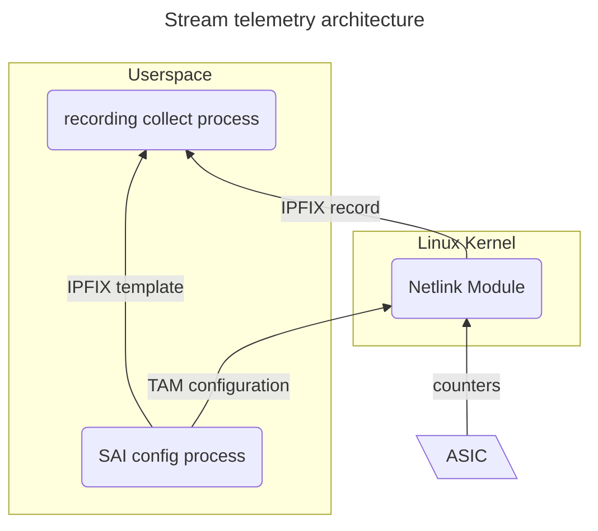
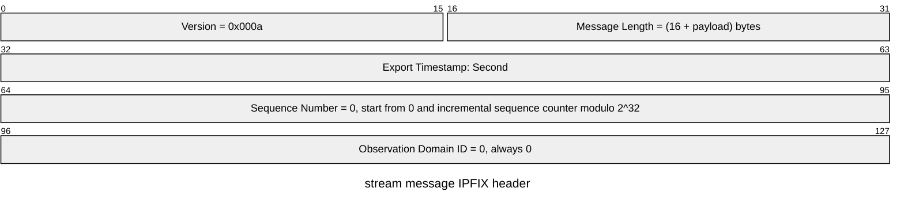
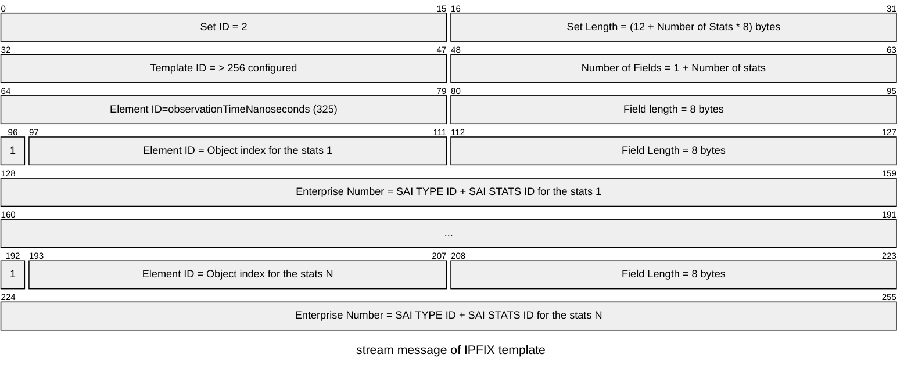
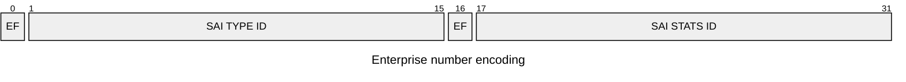
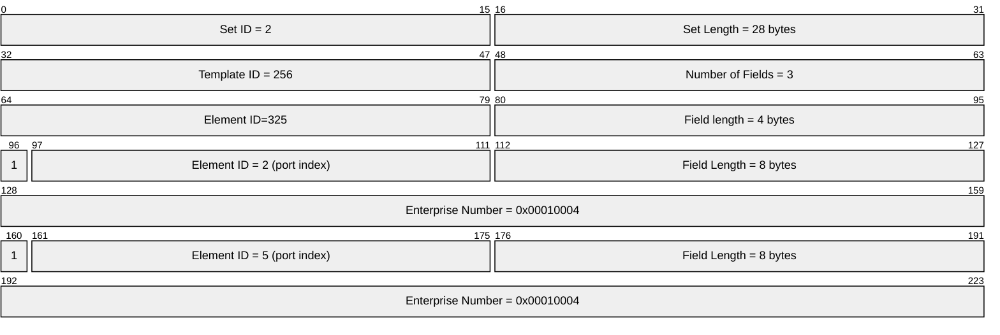
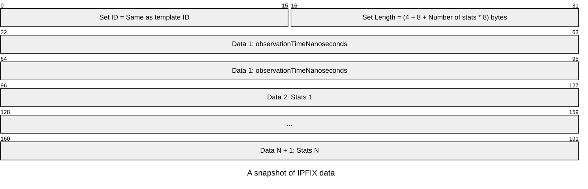
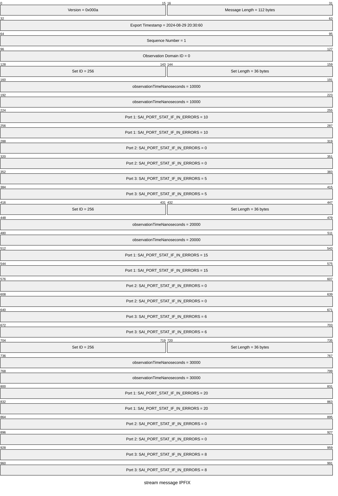
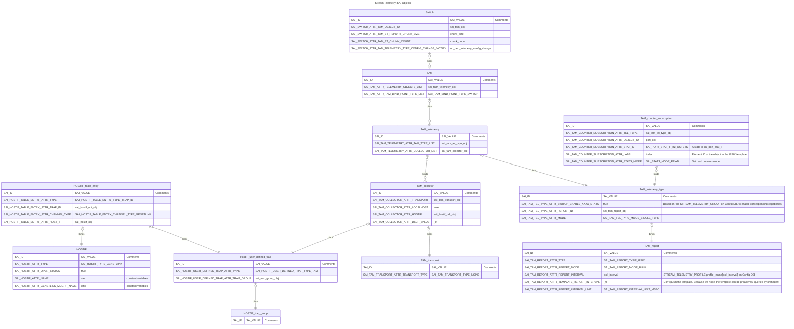
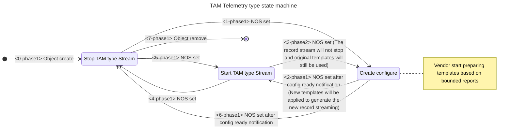

# SAI Proposal TAM stream telemetry <!-- omit in toc -->

## Table of Content <!-- omit in toc -->

- [Revision](#revision)
- [Scope](#scope)
- [Definitions/Abbreviations](#definitionsabbreviations)
- [Overview](#overview)
- [Requirements / Constraints](#requirements--constraints)
  - [Phase 1](#phase-1)
  - [Phase 2](#phase-2)
- [Architecture Design](#architecture-design)
- [High-Level Design](#high-level-design)
  - [Modules](#modules)
    - [recording collect process](#recording-collect-process)
    - [Netlink Module](#netlink-module)
  - [Data format](#data-format)
    - [IPFIX header](#ipfix-header)
    - [IPFIX template](#ipfix-template)
    - [IPFIX data](#ipfix-data)
    - [Netlink message](#netlink-message)
  - [Bandwidth Estimation](#bandwidth-estimation)
  - [SAI API](#sai-api)
    - [Initialize TAM global configuration for Switch](#initialize-tam-global-configuration-for-switch)
    - [Creating HOSTIF object](#creating-hostif-object)
    - [Creating HOSTIF trap group](#creating-hostif-trap-group)
    - [Creating HOSTIF user defined trap](#creating-hostif-user-defined-trap)
    - [Creating Hostif table entry](#creating-hostif-table-entry)
    - [Creating TAM transport object](#creating-tam-transport-object)
    - [Creating TAM collector object](#creating-tam-collector-object)
    - [Creating TAM telemetry object](#creating-tam-telemetry-object)
    - [Creating TAM report object](#creating-tam-report-object)
    - [Creating TAM telemetry type object](#creating-tam-telemetry-type-object)
      - [TAM Telemetry type state machine](#tam-telemetry-type-state-machine)
    - [Generating TAM telemetry type configuration](#generating-tam-telemetry-type-configuration)
    - [Creating TAM counter subscription objects](#creating-tam-counter-subscription-objects)
    - [Creating TAM object](#creating-tam-object)
    - [Query IPFIX template](#query-ipfix-template)
    - [Bound telemetry stream](#bound-telemetry-stream)
    - [Query stream telemetry capability](#query-stream-telemetry-capability)
    - [Query telemetry type capability](#query-telemetry-type-capability)

## Revision

| Rev | Date       | Author | Change Description |
| --- | ---------- | ------ | ------------------ |
| 0.1 | 09/06/2024 | Ze Gan | Initial version    |

## Scope

This document outlines the high-level design of stream telemetry, focusing primarily on the internal aspects of device rather than external telemetry systems.

## Definitions/Abbreviations

| Abbreviation | Description                               |
| ------------ | ----------------------------------------- |
| SAI          | The Switch Abstraction Interface          |
| IPFIX        | Internet Protocol Flow Information Export |
| TAM          | Telemetry and Monitoring                  |
| BW           | Bandwidth                                 |

## Overview

The existing telemetry solution relies on a process to proactively query stats and counters via the SAI API. This approach causes the process to spend excessive time on SAI communication. The stream telemetry described in this document aims to provide a more efficient method for collecting object stats. The main idea is that selected stats will be proactively pushed from the vendor's driver to the collector via netlink.

## Requirements / Constraints

### Phase 1

- The number of SAI object types should not exceed 32,768 ($2^{15}$). This means the value of SAI_OBJECT_TYPE_MAX should be less than 32,768.
- The number of SAI object extension types should not exceed 32,768.
- The number of stats types for a single SAI object type should not exceed 32,768.
- The number of extension stats types for a single SAI object type should not exceed 32,768.
- The number of SAI objects of the same type should not exceed 32,768.
- The vendor SDK should support publishing stats in IPFIX format and its IPFIX template.
- If a polling frequency for stats cannot be supported, the vendor's SDK should return this error.
- The vendor SDK should support querying the minimal polling interval for each counter.
- When reconfiguring any stream settings, whether it is the polling interval or the stats list, the existing stream will be interrupted and regenerated.
- If any of monitored objects is deleted, the existing stream will be interrupted and regenerated.
- The collector is designed to handle single-cycle counter rollovers; however, vendors must ensure that the data does not roll over twice between two collection intervals.

### Phase 2

- Supports updating configuration without interrupting the telemetry stream
- Support stats of tam telemetry for debugging purpose

## Architecture Design



## High-Level Design

### Modules

#### recording collect process

The primary responsibility of `CounterSyncd`,a.k.a `recording collect process`, is to receive counter messages via netlink and convert them into telemetry messages for an external collector. It subscribes to a socket of a specific family and multicast group of generic netlink.

#### Netlink Module

These module needs to be provided by vendors. This document proposes a ring buffer communication model to support all expected TAM configurations as follows.


### Data format

We will use IPFIX as the report format, with all numbers in the IPFIX message in network-order (Big-endian).

For more information on IPFIX, refer to the following resources:

- [Specification of the IP Flow Information Export (IPFIX) Protocol for the Exchange of Flow Information](https://datatracker.ietf.org/doc/html/rfc7011)
- [IP Flow Information Export (IPFIX) Entities](https://www.iana.org/assignments/ipfix/ipfix.xhtml)

#### IPFIX header

The `Version` and `Observation Domain ID` fields of the IPFIX header are identical for each IPFIX message.



#### IPFIX template



- For high-frequency counters, the native IPFIX timestamp unit of seconds is insufficient. Therefore, we introduce an additional element, `observationTimeNanoseconds`, for each record to meet our requirements.
- The element ID of IPFIX is derived from the object index. For example, for `Ethernet5`, the element ID will be `0x5 | 0x8000 = 0x8005`, where `0x8000` indicates that the enterprise bit is set to 1.
- The enterprise number is derived from the combination of the [SAI_OBJECT_TYPE](https://github.com/opencomputeproject/SAI/blob/master/inc/saitypes.h) and its corresponding stats ID. The high bits are used to indicate the SAI extension flag. For example, for `SAI_QUEUE_STAT_WRED_ECN_MARKED_PACKETS=0x00000022` of `SAI_OBJECT_TYPE_QUEUE=0x00000015`, the enterprise number will be `0x00000022 << 16 | 0x00000015 = 0x00220015`.



**EF is the extension flag: If this type or stat is an SAI extension, it should be set to 1.**

For example, if the switch has 8 ports, but we only want to get the `SAI_PORT_STAT_IF_IN_ERRORS = 0x00000004` of `SAI_OBJECT_TYPE_PORT = 0x00000001` on Ethernet2 and Ethernet5, the template will look like this:



#### IPFIX data

An IPFIX data message consists of snapshots that is a binary block that can be interpreted using the IPFIX template mentioned above.



- The snapshot structure is derived from the IPFIX template, which is based on the stats we want to record.

Below is an example of an IPFIX message with 3 snapshots for the same stats record as the IPFIX template example:



- If the number of stats in a group is small, multiple snapshots may be encoded into a single IPFIX message.
- If the number of stats in a group exceeds 8K, the group must be split across multiple IPFIX messages.

The IPFIX template should be provided by vendors. This document does not restrict how to split or concatenate snapshots, but each separated snapshot must include its own `observationTimeNanoseconds`.

#### Netlink message

We expect all control messages and out-of-band information to be transmitted by the SAI. Therefore, it is unnecessary to read the attribute header of netlink and the message header of Genetlink from the socket. Instead, we can insert a bulk of IPFIX recordings as the payload of the netlink message. The sample code for building the message from the kernel side is as follows:

``` c

struct genl_multicast_group stel_mcgrps[] = {
    { .name = "ipfix" },
};

// Family definition
static struct genl_family stel_family = {
    .name = "sonic_stel",
    .version = 1,
    // ...
    .mcgrps = stel_mcgrps,
    .n_mcgrps = ARRAY_SIZE(stel_mcgrps),
};


void send_msgs_to_user(/* ... */)
{
    struct sk_buff *skb_out = nlmsg_new(ipfix_msg_len, GFP_KERNEL);

    for (size_t i = 0; i < bulk_count; i++)
    {
        struct ipfix *msg = ring_buffer.pop();
        if (msg == NULL)
        {
            break;
        }
        nla_append(skb_out, msg->data, msg->len);
    }

    genlmsg_multicast(&stel_family, skb_out, 0, 0/* group_id to ipfix group */, GFP_KERNEL);
}

```

### Bandwidth Estimation

We estimate the bandwidth based only on the effective data size, not the actual data size. The extra information in a message, such as the IPFIX header (16 bytes), data prefix (4 bytes), and observation time milliseconds (8 bytes), is negligible. For example, a IPFIX message could include $The Maximal Number Of Counters In One Message = \frac{0xFFFF_{Max Length Bytes} - 16_{Header Bytes} - 4_{DataPrefix Bytes} - 8_{Observation Time Milliseconds Bytes}}{8_{bytes}} \approx 8188$, So $The Percentage Of Effective Data = \frac{0xFFFF_{Max Length Bytes} - 16_{Header Bytes} - 4_{DataPrefix Bytes} - 8_{Observation Time Milliseconds Bytes}} {0xFFFF_{Max LengthBytes}} \approx 99.9\%$ .

The following table is an example of telemetry bandwidth of one cluster

| # of stats per port | # of ports per switch | # of switch | frequency (us) | Total BW per switch(Mbps) | Total BW(Mbps) |
| ------------------- | --------------------- | ----------- | -------------- | ------------------------- | -------------- |
| 30                  | 64                    | 10,000      | 10             | 12,288                    | 122,880,000    |

- ${Total BW Per Switch} = \frac{{\verb|#| Of Stats Per Port} \times 8_{bytes} \times {\verb|#| Of Ports Per Switch} \times {Frequency} \times 1,000 \times 8}{1,000,000}$
- ${Total BM} = {Total BW Per Switch} \times {\verb|#| Of Switch}$

### SAI API

The SAI logic for stream telemetry follows the existing SAI documentation: [Granular-Counter-Subscription.md](./Granular-Counter-Subscription.md).



| Object Type              | Scope                                 |
| ------------------------ | ------------------------------------- |
| HOSTIF                   | Global                                |
| HOSTIF_trap_group        | Global                                |
| HostIF_user_defined_trap | Global                                |
| HOSTIF_table_entry       | Global                                |
| TAM_transport            | Global                                |
| TAM_collector            | Global                                |
| TAM                      | Global                                |
| TAM_telemetry            | per profile                           |
| TAM_telemetry_type       | per profile / per type of one profile |
| TAM_report               | per profile / per type of one profile |
| TAM_counter_subscription | per stats of object                   |

#### Initialize TAM global configuration for Switch

``` c++
/**
 * @brief Attribute Id in sai_set_switch_attribute() and
 * sai_get_switch_attribute() calls.
 */
typedef enum _sai_switch_attr_t
{
    // ...

    /**
     * @brief Tam telemetry reporting byte size of chunk under the stream telemetry
     *
     * Defines the maximum number of bytes in a single report.
     * The total number of bytes in a report should be as close as possible to this value.
     * We can increase this value to reduce the number of sys calls.
     * If the type of message is IPFIX, this value should not be less than 65535.
     * Because we don't expect the IPFIX record to be fragmented.
     *
     * @type sai_uint32_t
     * @flags CREATE_ONLY
     * @default 65535
     */
    SAI_SWITCH_ATTR_TAM_ST_REPORT_CHUNK_SIZE,
    /**
     * @brief Tam telemetry chunk count under the stream telemetry
     *
     * This value indicates how many chunks of reports that can be restored in the buffer.
     * If the data structure is a ring buffer, the byte size of ring buffer is chunk count * chunk size.
     * The default value, 0, means that this value was determined by the vendor.
     * If the buffer is full, new incoming data will be dropped.
     *
     * @type sai_uint32_t
     * @flags CREATE_ONLY
     * @default 0
     */
    SAI_SWITCH_ATTR_TAM_ST_CHUNK_COUNT,

    /**
     * @brief Set TAM telemetry type config change event notification callback function passed to the adapter.
     *
     * Use sai_tam_tel_type_config_change_notification_fn as notification function.
     *
     * @type sai_pointer_t sai_tam_tel_type_config_change_notification_fn
     * @flags CREATE_AND_SET
     * @default NULL
     */
    SAI_SWITCH_ATTR_TAM_TEL_TYPE_CONFIG_CHANGE_NOTIFY,

    // ...
} sai_switch_attr_t;

sai_attr_list[0].id = SAI_SWITCH_ATTR_TAM_ST_CHUNK_COUNT;
sai_attr_list[0].value.u32 = chunk_count;

sai_attr_list[1].id = SAI_SWITCH_ATTR_TAM_ST_REPORT_CHUNK_SIZE;
sai_attr_list[1].value.u32 = chunk_size;

sai_attr_list[2].id = SAI_SWITCH_ATTR_TAM_TELEMETRY_TYPE_CONFIG_CHANGE_NOTIFY;
sai_attr_list[2].value.u32 = on_tam_telemetry_config_change;

// ...

create_switch(&gSwitchId, (uint32_t)sai_attr_list.size(), sai_attr_list.data());

```

#### Creating HOSTIF object

``` c++

sai_attr_list[0].id = SAI_HOSTIF_ATTR_TYPE;
sai_attr_list[0].value.s32 = SAI_HOSTIF_TYPE_GENETLINK;

sai_attr_list[1].id = SAI_HOSTIF_ATTR_OPER_STATUS;
sai_attr_list[1].value.boolean = true;

// Set genetlink family
sai_attr_list[2].id = SAI_HOSTIF_ATTR_NAME;
strncpy(sai_attr_list[2].value.chardata, "stel", strlen("stel") + 1);

// Set genetlink group
sai_attr_list[3].id = SAI_HOSTIF_ATTR_GENETLINK_MCGRP_NAME;
strncpy(sai_attr_list[3].value.chardata, "ipfix", strlen("ipfix") + 1);

attr_count = 4;
create_hostif(sai_hostif_obj, switch_id, attr_count, sai_attr_list);

```

#### Creating HOSTIF trap group

``` c++

create_hostif_trap_group(sai_trap_group_obj, switch_id, 0, NULL);

```

#### Creating HOSTIF user defined trap

``` c++

sai_attr_list[0].id = SAI_HOSTIF_USER_DEFINED_TRAP_ATTR_TYPE;
sai_attr_list[0].value.s32 = SAI_HOSTIF_USER_DEFINED_TRAP_TYPE_TAM;

sai_attr_list[1].id = SAI_HOSTIF_USER_DEFINED_TRAP_ATTR_TRAP_GROUP;
sai_attr_list[1].value.oid = sai_trap_group_obj;

attr_count = 2;
create_hostif_user_defined_trap(&sai_hostif_udt_obj, switch_id, attr_count, sai_attr_list);

```

#### Creating Hostif table entry

``` c++

sai_attr_list[0].id = SAI_HOSTIF_TABLE_ENTRY_ATTR_TYPE;
sai_attr_list[0].value.s32 = SAI_HOSTIF_TABLE_ENTRY_TYPE_TRAP_ID;

sai_attr_list[1].id = SAI_HOSTIF_TABLE_ENTRY_ATTR_TRAP_ID;
sai_attr_list[1].value.oid = sai_hostif_udt_obj;

sai_attr_list[2].id = SAI_HOSTIF_TABLE_ENTRY_ATTR_CHANNEL_TYPE;
sai_attr_list[2].value.s32 = SAI_HOSTIF_TABLE_ENTRY_CHANNEL_TYPE_GENETLINK;

sai_attr_list[3].id = SAI_HOSTIF_TABLE_ENTRY_ATTR_HOST_IF;
sai_attr_list[3].value.oid = sai_hostif_obj;

attr_count = 4;
create_hostif_table_entry(&sai_hostif_table_entry_obj, switch_id, attr_count, sai_attr_list);

```

#### Creating TAM transport object

``` c++

sai_attr_list[0].id = SAI_TAM_TRANSPORT_ATTR_TRANSPORT_TYPE;
sai_attr_list[0].value.s32 = SAI_TAM_TRANSPORT_TYPE_NONE;
attr_count = 1;
create_tam_transport(&sai_tam_transport_obj, switch_id, attr_count, sai_attr_list);

```

#### Creating TAM collector object

``` c++

sai_attr_list[0].id = SAI_TAM_COLLECTOR_ATTR_TRANSPORT;
sai_attr_list[0].value.oid = sai_tam_transport_obj;

sai_attr_list[1].id = SAI_TAM_COLLECTOR_ATTR_LOCALHOST;
sai_attr_list[1].value.booldata = true;

sai_attr_list[2].id = SAI_TAM_COLLECTOR_ATTR_HOSTIF_TRAP;
sai_attr_list[2].value.oid = sai_hostif_udt_obj;

sai_attr_list[3].id = SAI_TAM_COLLECTOR_ATTR_DSCP_VALUE;
sai_attr_list[3].value.u8 = 0;

attr_count = 4;
create_tam_collector(&sai_tam_collector_obj, switch_id, attr_count, sai_attr_list);

```

#### Creating TAM telemetry object

``` c++

sai_attr_list[1].id = SAI_TAM_TELEMETRY_ATTR_COLLECTOR_LIST;
sai_attr_list[1].value.objlist.count = 1;
sai_attr_list[1].value.objlist.list[0] = sai_tam_collector_obj;

attr_count = 4;

create_tam_telemetry(&sai_tam_telemetry_obj, switch_id, attr_count, sai_attr_list);

```

#### Creating TAM report object

``` c++

sai_attr_list[0].id = SAI_TAM_REPORT_ATTR_TYPE;
sai_attr_list[0].value.s32 = SAI_TAM_REPORT_TYPE_IPFIX;

sai_attr_list[1].id = SAI_TAM_REPORT_ATTR_REPORT_MODE;
sai_attr_list[1].value.s32 = SAI_TAM_REPORT_MODE_BULK;

sai_attr_list[2].id = SAI_TAM_REPORT_ATTR_REPORT_INTERVAL;
sai_attr_list[2].value.u32 = poll_interval; // STREAM_TELEMETRY_PROFILE:profile_name[poll_interval] on Config DB

// sai_attr_list[].id = SAI_TAM_REPORT_ATTR_ENTERPRISE_NUMBER; Ignore this value

sai_attr_list[3].id = SAI_TAM_REPORT_ATTR_TEMPLATE_REPORT_INTERVAL;
sai_attr_list[3].value.s32 = 0; // Don't push the template, Because we hope the template can be proactively queried by orchagent

sai_attr_list[4].id = SAI_TAM_REPORT_ATTR_REPORT_INTERVAL_UNIT;
sai_attr_list[4].value.s32 = SAI_TAM_REPORT_INTERVAL_UNIT_USEC;

attr_count = 5;
create_tam_report(&sai_tam_report_obj, switch_id, attr_count, sai_attr_list);

sai_attr_list[0].id = SAI_TAM_TELEMETRY_ATTR_TAM_TYPE_LIST;
sai_attr_list[0].value.objlist.count = 1;
sai_attr_list[0].value.objlist.list[0] =  sai_tam_tel_type_obj;
// If the tam_tel_type is SINGLE TYPE mode, multiple tam_tel_type objects will be bounded to one tam telemetry object
// If the tam_tel_type is MIXED TYPE mode, one tam_tel_type in one tam telemetry is enough.

set_tam_telemetry_attribute(sai_tam_telemetry_obj, &sai_attr_list[0]);

```

#### Creating TAM telemetry type object

##### TAM Telemetry type state machine



``` c++

/**
 * @brief TAM telemetry type state of state machine
 */
typedef enum _sai_tam_tel_type_state_t
{
    /**
     * @brief Telemetry type is stopped
     *
     * In this stage, the recording stream should be stopped,
     * and the configuration should be cleared.
     */
    SAI_TAM_TEL_TYPE_STATE_STOP_STREAM,

    /**
     * @brief Telemetry type is started
     *
     * In this stage, the recording stream should be started,
     * and the latest configuration should be applied.
     */
    SAI_TAM_TEL_TYPE_STATE_START_STREAM,

    /**
     * @brief Telemetry type configuration is prepared,
     *
     * We expect the configuration to be generated in the feature,
     * And notify the user by sai_tam_tel_type_config_change_notification_fn
     */
    SAI_TAM_TEL_TYPE_STATE_CREATE_CONFIG,

} sai_tam_tel_type_state_t;

/**
 * @brief Attributes for TAM report
 */
typedef enum _sai_tam_tel_type_attr_t
{

    // ...

    /**
     * @brief The mode of TAM telemetry type
     *
     * @type sai_tam_tel_type_mode_t
     * @flags CREATE_ONLY
     * @default 
     * @validonly SAI_TAM_TEL_TYPE_ATTR_TAM_TELEMETRY_TYPE == SAI_TAM_TELEMETRY_TYPE_COUNTER_SUBSCRIPTION
     */
    SAI_TAM_TEL_TYPE_ATTR_MODE,

    /**
     * @brief TAM telemetry type state
     *
     * @type sai_tam_tel_type_state_t
     * @flags CREATE_AND_SET
     * @default SAI_TAM_TEL_TYPE_STATE_STOP_STREAM
     */
    SAI_TAM_TEL_TYPE_ATTR_STATE,

    /**
     * @brief Query IPFIX template
     * SAI adapter will return error if COUNTER_SUBSCRIPTION_LIST and REPORT_ID is not configured.
     * Return the IPFIX template for this telemetry type object 
     *
     * @type sai_u8_list_t
     * @flags READ_ONLY
     */
    SAI_TAM_TEL_TYPE_ATTR_IPFIX_TEMPLATES,

    // ...

} sai_tam_tel_type_attr_t;


/**
 * @brief TAM telemetry state change callback
 *
 * @param[in] tam_tel_id Create Telemetry Object ID
 */
typedef void (*sai_tam_tel_type_config_change_notification_fn)(
        _In_ sai_object_id_t tam_tel_id);

```

``` c++

sai_attr_list[0].id = SAI_TAM_TEL_TYPE_ATTR_TAM_TELEMETRY_TYPE;
sai_attr_list[0].value.s32 = SAI_TAM_TELEMETRY_TYPE_COUNTER_SUBSCRIPTION;

// Based on the STREAM_TELEMETRY_GROUP on Config DB, to enable corresponding capabilities.
sai_attr_list[1].id = SAI_TAM_TEL_TYPE_ATTR_SWITCH_ENABLE_PORT_STATS ;
sai_attr_list[1].value.boolean = true;

// sai_attr_list[2].id = SAI_TAM_TEL_TYPE_ATTR_SWITCH_ENABLE_MMU_STATS ;
// sai_attr_list[2].value.boolean = true;

sai_attr_list[2].id = SAI_TAM_TEL_TYPE_ATTR_MODE ;
sai_attr_list[2].value.boolean = tel_type_mode[0]; // SAI_TAM_TEL_TYPE_MODE_SINGLE_TYPE or SAI_TAM_TEL_TYPE_MODE_MIXED_TYPE

// ...

sai_attr_list[3].id = SAI_TAM_TEL_TYPE_ATTR_REPORT_ID;
sai_attr_list[3].value.oid = sai_tam_report_obj;

attr_count = 4;
create_tam_tel_type(&sai_tam_tel_type_obj, switch_id, attr_count, sai_attr_list);

```

#### Generating TAM telemetry type configuration

``` c++

sai_attr.id = SAI_TAM_TEL_TYPE_ATTR_STATE;
sai_attr.value.s32 = SAI_TAM_TEL_TYPE_STATE_CREATE_CONFIG;

set_tam_tel_type_attribute(&sai_tam_tel_type_obj, &sai_attr);

```

#### Creating TAM counter subscription objects

Based on the STREAM_TELEMETRY_GROUP on Config DB, to create corresponding counter subscription objects.

``` c++

/**
 * @brief Counter Subscription attributes
 */
typedef enum _sai_tam_counter_subscription_attr_t
{

// ...

    /**
     * @brief Telemetry label
     *
     * Label to identify this counter in telemetry reports.
     * If the report type is IPFIX, this label will be used as the element ID in the IPFIX template.
     *
     * @type sai_uint64_t
     * @flags CREATE_ONLY
     * @default 0
     */
    SAI_TAM_COUNTER_SUBSCRIPTION_ATTR_LABEL,

    /**
     * @brief Setting of read-clear or read-only for statistics read.
     *
     * @type sai_stats_mode_t
     * @flags CREATE_ONLY
     * @default SAI_STATS_MODE_READ
     */
    SAI_TAM_COUNTER_SUBSCRIPTION_ATTR_STATS_MODE,

// ...

} sai_tam_counter_subscription_attr_t;


// Create counter subscription list

sai_attr_list[0].id = SAI_TAM_COUNTER_SUBSCRIPTION_ATTR_TEL_TYPE;
sai_attr_list[0].value.oid = sai_tam_tel_type_obj;

sai_attr_list[1].id = SAI_TAM_COUNTER_SUBSCRIPTION_ATTR_OBJECT_ID;
sai_attr_list[1].value.oid = port_obj;

sai_attr_list[2].id = SAI_TAM_COUNTER_SUBSCRIPTION_ATTR_STAT_ID;
sai_attr_list[2].value.oid = SAI_PORT_STAT_IF_IN_OCTETS;

sai_attr_list[3].id = SAI_TAM_COUNTER_SUBSCRIPTION_ATTR_LABEL;
sai_attr_list[3].value.oid = index; // Element ID of the object in the IPFIX template

sai_attr_list[4].id =SAI_TAM_COUNTER_SUBSCRIPTION_ATTR_STATS_MODE;
sai_attr_list[4].value.s32 = SAI_STATS_MODE_READ;
// sai_attr_list[4].value.s32 = SAI_STATS_MODE_READ_AND_CLEAR; // It could be read and clear for queue watermark

attr_count = 5;

create_tam_counter_subscription(&sai_tam_counter_subscription_obj, switch_id, attr_count, sai_attr_lis);
// If this stats of object cannot support this poll frequency, this API should return SAI_STATUS_NOT_SUPPORTED.

// Recommend to use bulk APIs to create/remove the object of tam counter subscription.

```

#### Creating TAM object

``` c++

vector<sai_object_id_t> telemetry_objs;
telemetry_objs.push_back(sai_tam_telemetry_obj);
// telemetry_objs.push_back(telemetry_obj_2);
// telemetry_objs.push_back(telemetry_obj_3);
// ...

sai_attr_list[0].id = SAI_TAM_ATTR_TELEMETRY_OBJECTS_LIST;
sai_attr_list[0].value.objlist.count = telemetry_objs.size();
sai_attr_list[0].value.objlist.list = telemetry_objs.data();

sai_attr_list[1].id = SAI_TAM_ATTR_TAM_BIND_POINT_TYPE_LIST;
sai_attr_list[1].value.objlist.count = 1;
sai_attr_list[1].value.objlist.list[0] = SAI_TAM_BIND_POINT_TYPE_SWITCH;

attr_count = 2;
create_tam(&sai_tam_obj, switch_id, attr_count, sai_attr_list);

```

#### Query IPFIX template

``` c++

std::vector<uint8_t> template_buffer(64*1024*10, 0);

sai_attribute_t sai_attr_list;

sai_attr_list[0].id = SAI_TAM_TELEMETRY_ATTR_IPFIX_TEMPLATES;
sai_attr_list[0].value.u8list.list = template_buffer.data();
sai_attr_list[0].value.u8list.count = template_buffer.size();

get_tam_tel_type_attribute(&sai_tam_report_obj, 1, &sai_attr_list);

```

#### Bound telemetry stream

``` c++

sai_object_id_t obj_list[100] = { 0 };
sai_attr.value.count = 0;

sai_attribute_t sai_attr;
sai_attr.id = SAI_SWITCH_ATTR_TAM_OBJECT_ID;
sai_attr.value.oidlist = obj_list;
sai_attr.value.count = 0;

get_switch_attribute(switch_id, 1, &sai_attr);

// Enable telemetry stream

sai_attr.value.oidlist[sai_attr.value.count] = sai_tam_obj;
sai_attr.value.count++;

set_switch_attribute(switch_id, sai_attr)

```

#### Query stream telemetry capability

``` c++

/**
 * @brief Query statistics capability for statistics bound at object level under the stream telemetry mode
 *
 * @param[in] switch_id SAI Switch object id
 * @param[in] object_type SAI object type
 * @param[inout] stats_capability List of implemented enum values, the statistics modes (bit mask) supported and minimal polling interval per value
 *
 * @return #SAI_STATUS_SUCCESS on success, #SAI_STATUS_BUFFER_OVERFLOW if lists size insufficient, failure status code on error
 */
sai_status_t sai_query_stats_st_capability(
        _In_ sai_object_id_t switch_id,
        _In_ sai_object_type_t object_type,
        _Inout_ sai_stat_st_capability_list_t *stats_capability);

/**
 * @brief Stat capability under the stream telemetry mode
 */
typedef struct _sai_stat_st_capability_t
{
    /**
     * @brief Typical stat capability
     */
    sai_stat_capability_t capability;

    /**
     * @brief Minimal polling interval in nanoseconds
     *
     * If polling interval is less than this value, it will be unacceptable.
     */
    uint64_t minimal_polling_interval;

/**
     * @brief Maximal polling interval in nanoseconds
     *
     * If polling interval is more than this value, it will be unacceptable.
     */
    uint64_t maximal_polling_interval;

} sai_stat_st_capability_t;

typedef struct _sai_stat_st_capability_list_t
{
    uint32_t count;
    sai_stat_st_capability_t *list;

} sai_stat_st_capability_list_t;

```

#### Query telemetry type capability

```c++

typedef enum _sai_tam_tel_type_mode_t
{
    /**
     * @brief This TAM telemetry type supports to bound only one counter type
     */
    SAI_TAM_TEL_TYPE_MODE_SINGLE_TYPE,

    /**
     * @brief This TAM telemetry type supports to bound multiple counter types
     */
    SAI_TAM_TEL_TYPE_MODE_MIXED_TYPE,

} sai_tam_tel_type_mode_t;


// Check the capability of telemetry type mode
sai_s32_list_t tel_type_mode[2] = {-1, -1};

sai_query_attribute_enum_values_capability(switch_id, SAI_OBJECT_TYPE_TAM_TEL_TYPE, SAI_TAM_TEL_TYPE_ATTR_MODE, tel_type_mode)

```

#### Stats for TAM telemetry

```c++

/**
 * @brief TAM telemetry counter IDs in sai_get_tam_telemetry_stats_ext() call
 *
 * @flags ranges
 */
typedef enum _sai_tam_telemetry_stat_t
{
    /** Tam telemetry stat range start */
    SAI_TAM_TELEMETRY_STAT_START,

    /**
     * @brief Total number of telemetry records successfully ingested
     *
     * Indicates the cumulative count of telemetry messages received and accepted
     * into the telemetry system.
     * Unit: Count [uint64_t]
     */
    SAI_TAM_TELEMETRY_STAT_INGESTED_RECORDS = SAI_TAM_TELEMETRY_STAT_START,

    /**
     * @brief Number of telemetry records pending read or processing
     *
     * Represents current backlog or pending messages awaiting processing.
     * This is a gauge-type value rather than a monotonically increasing counter.
     * Unit: Count [uint64_t]
     */
    SAI_TAM_TELEMETRY_STAT_PENDING_READ_RECORDS,

    /**
     * @brief Total number of telemetry records successfully consumed
     *
     * Indicates the cumulative count of telemetry records that have been processed
     * by the consumer.
     * Unit: Count [uint64_t]
     */
    SAI_TAM_TELEMETRY_STAT_CONSUMED_RECORDS,

    /**
     * @brief Total number of telemetry records dropped
     *
     * Represents the cumulative number of telemetry messages discarded due to
     * buffer overflow, timeout, or internal error.
     * Unit: Count [uint64_t]
     */
    SAI_TAM_TELEMETRY_STAT_DROPPED_RECORDS,

    /** Tam telemetry stat range end */
    SAI_TAM_TELEMETRY_STAT_END,

    SAI_TAM_TELEMETRY_STAT_CUSTOM_RANGE_BASE = 0x10000000,

} sai_tam_telemetry_stat_t;

```
