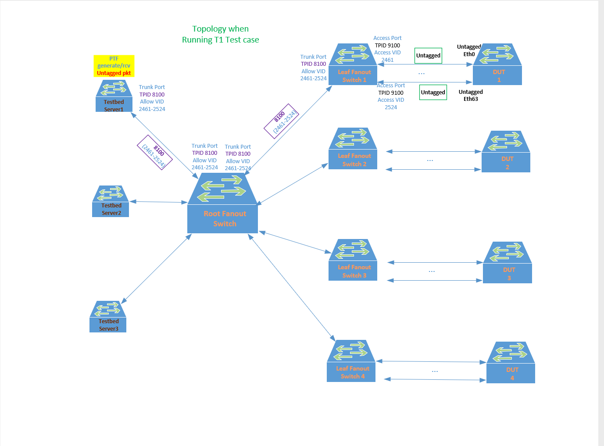
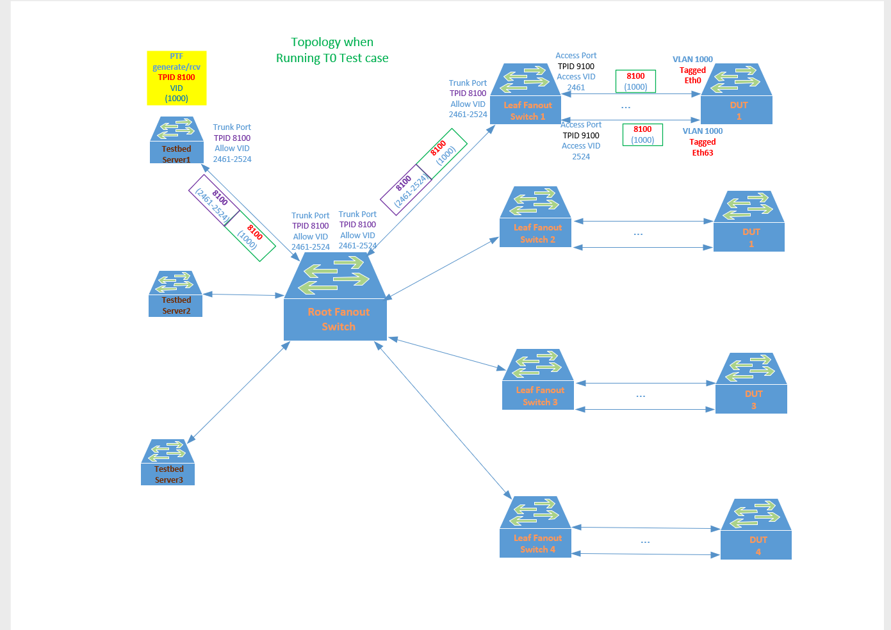
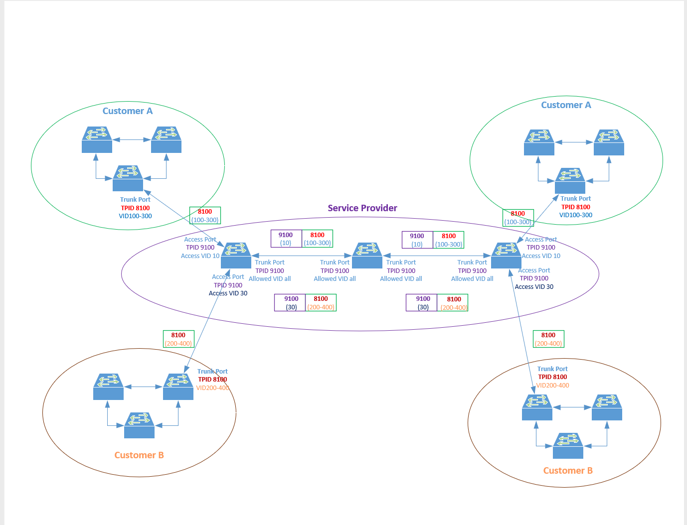

Interface TPID Setting Change Proposal
=====================

Title    | Interface TPID Setting Proposal Overview
-------- | ---
Authors  | Microsoft
Status   | In review
Type     | Standards track
Created  | 05/11/2020
SAI-Version | v4.2
----------

**Problem:**
============
 
PTF \<===\> SONiC Fanout \<===\> SONiC DUT

 
SONiC fanout switch put PTF and SONiC DUT together by placing them in
the same VLAN on the Fanout fabric.
SONiC default TPID (**T**ag **P**rotocol **Id**entifier) is default to
0x8100. Currently there is no SAI API to change it.

 
Depending on the Test being run, the DUT may be running as **T1** or **T0**
router. If running as **T1**, the DUT ports connecting to the SONiC fanout 
ports are configured as untagged and packets out of the DUT towards SONiC 
Fanout are Untagged. When DUT is configured as **T0** the DUT ports 
connecting to the fanout switch are configured as tagged member of a VLAN. 
Packets out of the DUT towards SONiC Fanout will be Tagged in this case. 
Since the configuration on the SONiC Fanout switch is to remain UNCHANGED 
during both tests, it becomes difficult for SONiC Fanout switch to handle 
this test requirement. If the SONiC fanout switch port is set to Access 
mode(untagged), it will drop all tagged packets received. If it is set to
Trunk mode to accept the Tagged packets, then by the time PTF receives
the packet sent from DUT, the VLAN Tag is stripped by the receiving
testbed server and it is not able to validate the expected VLAN Tag
received from the packet for validation.

**Proposed Solution:**
-------------

The ideal behavior is to make the SONiC Fanout switch to behave as a
direct wire connecting PTF and DUT without making any decision on the
packet passing through it. One way to achieve this is to use the 
"one sided" 802.1Q tunneling feature. The 802.1Q Tunneling feature can be
achieved by allowing the SONiC fanout switch ports facing the DUT to be
configured with a TPID value that is different from the received
packet's TPID value. Please note that the TPID configuration support needs
to be configurable at port level and NOT at system level as it will not be 
able to solve our current issue. The port's configured TPID value is used 
during ingress packet parsing to determine if the packet received contains
a valid 802.1Q VLAN tag. If the TPID of the received packet matches that of
the configured port TPID, then the packet is "Tagged". If TPID missmatches,
then the HW shall treat the received packet as an "untagged packet".  
There are no pipeline processing changes required with this proposal. The TPID
is merely used on ingress packet parsing logic to determine whether the packet 
is "tagged" or "untagged". If the port is confgiured as an ACCESS port (to 
accept untagged packets), it shall treat the received mismatched TPID packet
as a valid "untagged" packet and forward it accordingly. If the port is 
configured as a TRUNK port, the configured Port TPID value will be used during
ingress packet parsing so that the VLAN_ID of the received packet is meaningful
only if the packet's TPID matches that of the port's confgiured TPID value.
On egress, if the outgoing packet needs to be "tagged" such as going out of a 
TRUNK port, the HW shall use the configured port TPID value to generate the 
802.1Q VLAN Tag for the outgoing packet.

Figure . Tagged/Untagged Frame Format

With TPID setting supported on the interface, it allows the SONiC fanout 
switch configuration to remain unchanged during both **T1** and **T0** test 
runs. The following test topology diagrams depict how the packet is traversed 
through the fanout fabric switches between PTF and DUT during different test modes.

Figure . **T1** Testing Topology


Figure . **T0** Testing Topology

With SONiC/SAI able to handle TPID configuration, it has the additional
benefit of allowing the user to achieve full "802.1Q Tunneling" feature.
An ISP provider using SONiC as its customer Edge Switch will allow
separating its customers' VLAN traffic through L2 tunneling feature
without restricting/assigning different VLAN ranges to its customers.


Figure . 802.1Q Tunneling Topology

 **Proposed SAI changes:**
=========================

**New Port/LAG Attribute:**
---------------------------

Add new TPID attribute under Port attribute and LAG attribute.

Under inc/saiport.h:
```
/**
 * @brief Attribute Id in sai_set_port_attribute() and
 * sai_get_port_attribute() calls
 */
typedef enum _sai_port_attr_t
{
    …
    /**
     * @brief TPID
     *
     * @type sai_uint16_t
     * @flags CREATE_AND_SET
     * @default 0x8100
     */
    SAI_PORT_ATTR_TPID,
    …
} sai_port_attr_t;
```
Under inc/sailag.h
```
/**
 * @brief LAG attribute: List of attributes for LAG object
 */
typedef enum _sai_lag_attr_t
{
    …
    /**
     * @brief TPID
     *
     * @type sai_uint16_t
     * @flags CREATE_AND_SET
     * @default 0x8100
     */
    SAI_LAG_ATTR_TPID,
    …
} sai_lag_attr_t;
```

**Default Port/LAG TPID:**
--------------------------

By default, when a Port/LAG is first created, SAI implementation shall
set the Port/LAG default TPID value of 0x8100 if TPID attribute is not
explicitly specified during the port/LAG create operation:
```
/**
 * @brief Create port
 *
 * @param[out] port_id Port id
 * @param[in] switch_id Switch id
 * @param[in] attr_count Number of attributes
 * @param[in] attr_list Array of attributes
 *
 * @return #SAI_STATUS_SUCCESS on success, failure status code on error
 */
typedef sai_status_t (*sai_create_port_fn)(
        _Out_ sai_object_id_t *port_id,
        _In_ sai_object_id_t switch_id,
        _In_ uint32_t attr_count,
        _In_ const sai_attribute_t *attr_list);
 
**
 * @brief Create LAG
 *
 * @param[out] lag_id LAG id
 * @param[in] switch_id Switch object id
 * @param[in] attr_count Number of attributes
 * @param[in] attr_list Array of attributes
 *
 * @return #SAI_STATUS_SUCCESS on success, failure status code on error
 */ typedef sai_status_t (*sai_create_lag_fn)(
        _Out_ sai_object_id_t *lag_id,
        _In_ sai_object_id_t switch_id,
        _In_ uint32_t attr_count,
        _In_ const sai_attribute_t *attr_list);
```

**Dynamic TPID setting:**
-------------------------

At run time, the TPID attribute of a port/LAG is allowed to be
configured to one of the 4 commonly used TPIDs (0x8100, 0x9100, 0x9200,
and 0x88A8) that the user specified. Although ideally any TPID values
can be used but to simplify the management of TPID resource tracking by
SONiC, SAI can claim TPID attribute is supported when it allows setting
of any of the above commonly used TPID values on any given port/LAG
interface. SAI implementation can optionally support more TPID values
beyond these 4 commonly used TPIDs for VLAN Tagging purpose.

The dynamic setting of the TPID value on a port/LAG shall use the
existing port/LAG set SAI attribute API with the new TPID port/LAG
attribute specified.

The TPID attribute value shall use the following
sai\_attribute\_value\_t:
```
/** @validonly meta->attrvaluetype == SAI_ATTR_VALUE_TYPE_UINT16 */
sai_uint16_t u16;
```

Setting Port TPID shall call the following existing SAI API with
sai\_attr\_id\_t set to SAI\_PORT\_ATTR\_TPID:
```
/**
 * @brief Set port attribute value.
 *
 * @param[in] port_id Port id
 * @param[in] attr Attribute
 *
 * @return #SAI_STATUS_SUCCESS on success, failure status code on error
 */
typedef sai_status_t (*sai_set_port_attribute_fn)(
        _In_ sai_object_id_t port_id,
        _In_ const sai_attribute_t *attr);
```

Setting LAG TPID shall call the following existing SAI API with
sai\_attr\_id\_t set to SAI\_LAG\_ATTR\_TPID:
```
/**
 * @brief Set LAG Attribute
 *
 * @param[in] lag_id LAG id
 * @param[in] attr Structure containing ID and value to be set
 *
 * @return #SAI_STATUS_SUCCESS on success, failure status code on error
 */
typedef sai_status_t (*sai_set_lag_attribute_fn)(
        _In_ sai_object_id_t lag_id,
        _In_ const sai_attribute_t *attr);
```

**SAI TPID HW Resource Capability Query Support:**
--------------------------------------------------

For some hardware SKU there may be a HW limitation on supporting TPID
configuration over the physical interface. This limitation shall be made 
known to the SONiC application so that a configuration precheck can be 
performed as part of any user TPID config validation. The application will
utilize the existing SAI API "sai_query_attribute_capability()"
to query for the support of the new Port/LAG attribute "SAI_PORT_ATTR_TPID"/
"SAI_LAG_ATTR_TPID".  If these new TPID attributes are supported, SAI shall
respond with "create_implemented = 1, set_implemented = 1, and 
get_implemented = 1" when responding from the "sai_query_attribute_capability()"
API call.
```
/**
 * @brief Query attribute capability
 *
 * @param[in] switch_id SAI Switch object id
 * @param[in] object_type SAI object type
 * @param[in] attr_id SAI attribute ID
 * @param[out] attr_capability Capability per operation
 *
 * @return #SAI_STATUS_SUCCESS on success, failure status code on error
 */
sai_status_t sai_query_attribute_capability(
        _In_ sai_object_id_t switch_id,
        _In_ sai_object_type_t object_type,
        _In_ sai_attr_id_t attr_id,
        _Out_ sai_attr_capability_t *attr_capability);
```
The definition of "sai_attr_capability_t" is posted here for reference sake.
```
/**
 * @brief Structure for attribute capabilities per operation
 */
typedef struct _sai_attr_capability_t
{
    /**
     * @brief Create is implemented
     */
    bool create_implemented;

    /**
     * @brief Set is implemented
     */
    bool set_implemented;

    /**
     * @brief Get is implemented
     */
    bool get_implemented;
} sai_attr_capability_t;
```

**LAG Member TPID Behavior:**
-----------------------------

It is expected that once the LAG interface TPID is configured, SAI is
responsible to apply this configured TPID setting to all of its current
and future LAG members. When a LAG member is deleted from the LAG
interface, it is SAI's responsibility to restore the deleted LAG member
TPID back to port default TPID value (0x8100). LAG member link bounce
should not affect its TPID setting.
