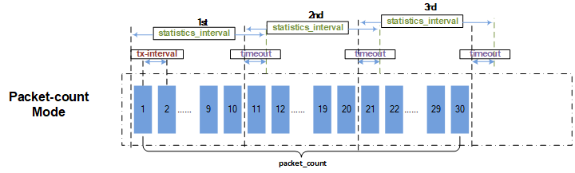
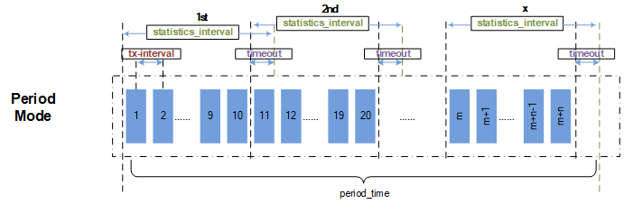
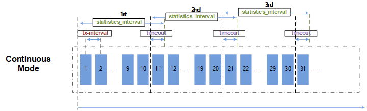

SAI TWAMP Light API Proposal
-------------------------------------------------------------------------------
 Title       | TWAMP Light
-------------|-----------------------------------------------------------------
 Authors     | CENTEC
 Status      | In review
 Type        | Standards track
 Created     | 03/01/2023
 Updated     | 07/17/2023
 SAI-Version | 1.12

-------------------------------------------------------------------------------

# Scope #

This document defines the technical specifications for the API used to support RFC-5357 TWAMP Light in Open Compute Project Switch Abstraction Interface (SAI). It supports to configure the TWAMP Light in hardware. The software solution of TWAMP Light is outside the scope of this document.

# Overview #

TWAMP Light is a standard performance measurement protocol applied to IP networks as described in RFC-5357, which is defined by the IP Performance Measurement (IPPM) working group. It provides a unified measurement model and unified test packet format for interoperability among devices of different vendors. TWAMP Light uses the client-server model. It generates and maintains the performance measurement data only on the client.  As an IP link detection technology, It can monitor network quality, including latency, jitter, and packet loss.

Unlike the TWAMP, TWAMP Light is a simplified version of TWAMP where the full TWAMP protocol is not necessary. The main differences between TWAMP and TWAMP Light are that TWAMP Light does not include complex authentication mechanisms, and does not require a control connection to be established before test packets can be sent.  So TWAMP Light is a lightweight protocol which is easy to deploy and use.

## TWAMP Light Solution ##
TWAMP Light does not require a control connection to set up and manage the measurement sessions. Instead, it uses a simple message exchange process between two endpoints to initiate and terminate the measurements. In hence, the roles of Control-Client, Server and Session-Sender are implemented in one host referred to as the controller, and the role of Session-Reflector is implemented in another host referred to as the responder as described in RFC-5357.  TWAMP Light is a Two-way measurement witch is common in IP networks, primarily because synchronization between local and remote clocks is unnecessary for round-trip delay, and measurement support at the remote end may be limited to a simple echo function.

To calculate the latency, jitter, and packet loss rate of network, the following steps are typically followed:

- Session-Sender as the active endpoint of the TWAMP Light sends a Test-request packet with a tx timestamp as t0.
- Session-Reflector receives the Test-request packet and captures a rx timestamp as t1.
- Prior to the transmission of the Test-response packet, Session-Reflector captures a tx timestamp as t2.
- Session-Reflector encodes t1 and t2 into the Test-response packet, then sends it out.
- Session-Sender receives the Test-response packet and captures a rx timestamp as t3.

The algorithm is:

- Latency = (t3-t0) – (t2-t1)
- Jitter = | Latency1 – Latency0 |
- Packet loss rate = (txPkt – rxPkt) / tx

## TWAMP Light offloading in ASIC ##
Since TWAMP Light is a simple and lightweight protocol, it is easy for vendors to implement TWAMP Light in their ASIC, which can improve performance and reduce CPU overload on network devices. TWAMP Light offloading in ASIC should work for sending and receiving TWAMP Light packets, collecting measurement data such as latency, jitter and packet loss. And also, RFC-5357 TWAMP Light should be followed. For TWAMP Light hardware solution, the main requirements are as follows:
* Can be deployed as one sender
  * Construct Test-request packets based on configuration including IP header, UDP port, etc.
  * Transmit Test-request packets to a reflector with tx timestamps which are captured in ASIC.
  * Receive Test-response packets from a reflector and capture rx timestamps in ASIC.
* Can be deployed as one reflector
  * Receive Test-request packets from a sender and capture rx timestamps in ASIC.
  * Construct Test-response packets based on configuration including IP header, UDP port, etc.
  * Encode rx timestamps of Test-request packets into Test-response packets.
  * Reflect Test-response packets back to a sender with tx timestamps which are captured in ASIC.
* Can collect measurement results
  * Collect measurement data and calculate point-to-point latency/jitter/packet loss rate
  * Report the latency/jitter/packet loss rate to software

## TWAMP Light SAI components ##
TWAMP Light can be broken down into following components for configuring twamp Light in ASIC.
* Global Information
  * Resource of TWAMP Light in ASIC
  * Notification function of state and statistics
* TWAMP Light session
  * Session mode
  * Session role
  * Session state
  * Authentication mode
  * Virtual Router
  * Packet encapsulation type
  * Packet forwarding mode
* TWAMP Light test packets
  * IP source address
  * IP destination address
  * IP TTL
  * IP DSCP
  * UDP source port
  * UDP destination port
  * Format of timestamp
* TWAMP Light measurement controlling
  * Packets measurement mode
  * Starting and stopping to transmit packets
  * Interval of transmitting packets
  * Interval of getting measurement data
  * Timeout of receiving packets
* TWAMP Light measurement data
  * Rx packets count
  * Rx packets bytes
  * Tx packets count
  * Tx packets bytes
  * Drop packets count
  * Maximum latency
  * Minimum latency
  * Average latency
  * Maximum jitter
  * Minimum jitter
  * Average jitter

## Measurement mode ##

Following diagram introduces the measurement mode of TWAMP Light Session-Sender.

## How to get measurement data ##
It provides two methods to get measurement data for application.
* Define the SAI interface for application obtaining measurement data actively from ASIC.
~~~cpp
/**
 * @brief Get Two-Way Active Measurement Protocol session statistics counters.
 *
 * @param[in] twamp_session_id Two-Way Active Measurement Protocol session id
 * @param[in] number_of_counters Number of counters in the array
 * @param[in] counter_ids Specifies the array of counter ids
 * @param[out] counters Array of resulting counter values.
 *
 * @return #SAI_STATUS_SUCCESS on success, failure status code on error
 */
typedef sai_status_t (*sai_get_twamp_session_stats_fn)(
        _In_ sai_object_id_t twamp_session_id,
        _In_ uint32_t number_of_counters,
        _In_ const sai_stat_id_t *counter_ids,
        _Out_ uint64_t *counters);

/**
 * @brief Get Two-Way Active Measurement Protocol session statistics counters extended.
 *
 * @param[in] twamp_session_id Two-Way Active Measurement Protocol session id
 * @param[in] number_of_counters Number of counters in the array
 * @param[in] counter_ids Specifies the array of counter ids
 * @param[in] mode Statistics mode
 * @param[out] counters Array of resulting counter values.
 *
 * @return #SAI_STATUS_SUCCESS on success, failure status code on error
 */
typedef sai_status_t (*sai_get_twamp_session_stats_ext_fn)(
        _In_ sai_object_id_t twamp_session_id,
        _In_ uint32_t number_of_counters,
        _In_ const sai_stat_id_t *counter_ids,
        _In_ sai_stats_mode_t mode,
        _Out_ uint64_t *counters);
~~~

* Define the notification function for ASIC reporting measurement data periodically to application
~~~cpp
/**
 * @brief TWAMP session notification
 *
 * @count data[count]
 *
 * @param[in] count Number of notifications
 * @param[in] data Pointer to TWAMP session notification data array
 */
typedef void (*sai_twamp_session_event_notification_fn)(
        _In_ uint32_t count,
        _In_ const sai_twamp_session_event_notification_data_t *data);
~~~

# Specification #
This section describes the TWAMP Light API proposal.

## New header file saitwamp.h ##
SAI TWAMP Light interface is defined as follows:

### Data Structures and Enumerations ###
~~~cpp
/**
 * @brief SAI Two-Way Active Measurement Protocol session authentication mode,
 * there are three modes: unauthenticated, authenticated, and encrypted.
 */
typedef enum _sai_twamp_session_auth_mode_t
{
    /** Session session unauthenticated mode */
    SAI_TWAMP_SESSION_AUTH_MODE_UNAUTHENTICATED = 0,

    /** Session session authenticated mode */
    SAI_TWAMP_SESSION_AUTH_MODE_AUTHENTICATED,

    /** Session session encrypted mode */
    SAI_TWAMP_SESSION_AUTH_MODE_ENCRYPTED

} sai_twamp_session_auth_mode_t;

/**
 * @brief SAI Two-Way Active Measurement Protocol role
 */
typedef enum _sai_twamp_session_role_t
{
    /** Session-sender sends test request packets */
    SAI_TWAMP_SESSION_ROLE_SENDER = 0,

    /** Session-reflector reflects test response packets */
    SAI_TWAMP_SESSION_ROLE_REFLECTOR

} sai_twamp_session_role_t;

/**
 * @brief SAI Two-Way Active Measurement Protocol mode
 */
typedef enum _sai_twamp_mode_t
{
    /**
     * @brief Means TWAMP protocol when enabling Two-Way Active Measurement Protocol full mode
     */
    SAI_TWAMP_MODE_FULL = 0,

    /**
     * @brief Means TWAMP Light protocol when enabling Two-Way Active Measurement Protocol light mode
     */
    SAI_TWAMP_MODE_LIGHT

} sai_twamp_mode_t;

/**
 * @brief SAI Two-Way Active Measurement transmitting mode
 */
typedef enum _sai_twamp_pkt_tx_mode_t
{
    /**@brief Continue to send Two-Way Active Measurement Protocol test packet */
    SAI_TWAMP_PKT_TX_MODE_CONTINUOUS = 0,

    /**@brief Only send Two-Way Active Measurement Protocol test packets with assigned number */
    SAI_TWAMP_PKT_TX_MODE_PACKET_COUNT,

    /**@brief Send Two-Way Active Measurement Protocol test packets during period time */
    SAI_TWAMP_PKT_TX_MODE_PERIOD

} sai_twamp_pkt_tx_mode_t;

/**
 * @brief SAI Two-Way Active Measurement format of timestamp
 */
typedef enum _sai_twamp_timestamp_format_t
{
    /**
     * @brief Packet timestamp format is Network Time Protocol format, 32 bit second and 32 bit fractional part of second
     */
    SAI_TWAMP_TIMESTAMP_FORMAT_NTP = 0,

    /**
     * @brief Packet timestamp format is PTP format, 32 bit second and 32 bit nanosecond
     */
    SAI_TWAMP_TIMESTAMP_FORMAT_PTP

} sai_twamp_timestamp_format_t;

/**
 * @brief SAI Two-Way Active Measurement Protocol type of encapsulation
 */
typedef enum _sai_twamp_encapsulation_type_t
{
    /**
     * @brief IP Encapsulation, L2 header | IP(v4/v6) header | UDP header | Two-Way Active Measurement Protocol test packet
     */
    SAI_TWAMP_ENCAPSULATION_TYPE_IP = 0,

    /**
     * @brief L2 Virtual Private Network Encapsulation, L2 header | MPLS Label List | L2 header | IP(v4/v6) header | UDP header | Two-Way Active Measurement Protocol test packet
     */
    SAI_TWAMP_ENCAPSULATION_TYPE_MPLS_L2VPN,

    /**
     * @brief L3 Virtual Private Network Encapsulation, L2 header | MPLS Label List | IP(v4/v6) header | UDP header | Two-Way Active Measurement Protocol test packet
     */
    SAI_TWAMP_ENCAPSULATION_TYPE_MPLS_L3VPN,

    /**
     * @brief VXLAN Network Encapsulation, L2 header | IP(v4/v6) header | UDP header | VXLAN header | L2 header | IP(v4/v6) header | UDP header | Two-Way Active Measurement Protocol test packet
     */
    SAI_TWAMP_ENCAPSULATION_TYPE_VXLAN

} sai_twamp_encapsulation_type_t;

/**
 * @brief SAI attributes for Two-Way Active Measurement Protocol session
 */
typedef enum _sai_twamp_session_attr_t
{
    /**
     * @brief Start of attributes
     */
    SAI_TWAMP_SESSION_ATTR_START,

    /**
     * @brief Two-Way Active Measurement Protocol mode: light mode and full mode
     *
     * @type sai_twamp_mode_t
     * @flags MANDATORY_ON_CREATE | CREATE_ONLY
     */
    SAI_TWAMP_SESSION_ATTR_TWAMP_MODE = SAI_TWAMP_SESSION_ATTR_START,

    /**
     * @brief Two-Way Active Measurement Protocol session role of sender or reflector.
     *
     * @type sai_twamp_session_role_t
     * @flags MANDATORY_ON_CREATE | CREATE_ONLY
     */
    SAI_TWAMP_SESSION_ATTR_SESSION_ROLE,

    /**
     * @brief Two-Way Active Measurement Protocol Session mode: unauthenticated, authenticated, and encrypted.
     *
     * @type sai_twamp_session_auth_mode_t
     * @flags CREATE_ONLY
     * @default SAI_TWAMP_SESSION_AUTH_MODE_UNAUTHENTICATED
     */
    SAI_TWAMP_SESSION_ATTR_AUTH_MODE,

    /**
     * @brief Hardware lookup valid
     *
     * @type bool
     * @flags CREATE_ONLY
     * @default true
     */
    SAI_TWAMP_SESSION_ATTR_HW_LOOKUP_VALID,

    /**
     * @brief Virtual router object
     *
     * @type sai_object_id_t
     * @flags CREATE_AND_SET
     * @objects SAI_OBJECT_TYPE_VIRTUAL_ROUTER
     * @allownull true
     * @default SAI_NULL_OBJECT_ID
     * @validonly SAI_TWAMP_SESSION_ATTR_HW_LOOKUP_VALID == true
     */
    SAI_TWAMP_SESSION_ATTR_VIRTUAL_ROUTER,

    /**
     * @brief L2 source MAC address
     *
     * @type sai_mac_t
     * @flags MANDATORY_ON_CREATE | CREATE_AND_SET
     * @condition SAI_TWAMP_SESSION_ATTR_HW_LOOKUP_VALID == false
     */
    SAI_TWAMP_SESSION_ATTR_SRC_MAC,

    /**
     * @brief L2 destination MAC address
     *
     * @type sai_mac_t
     * @flags MANDATORY_ON_CREATE | CREATE_AND_SET
     * @condition SAI_TWAMP_SESSION_ATTR_HW_LOOKUP_VALID == false
     */
    SAI_TWAMP_SESSION_ATTR_DST_MAC,

    /**
     * @brief L2 header VLAN Id.
     *
     * @type sai_uint16_t
     * @flags MANDATORY_ON_CREATE | CREATE_ONLY
     * @isvlan true
     * @condition SAI_TWAMP_SESSION_ATTR_VLAN_HEADER_VALID == true
     */
    SAI_TWAMP_SESSION_ATTR_VLAN_ID,

    /**
     * @brief L2 header packet priority (3 bits).
     *
     * @type sai_uint8_t
     * @flags CREATE_AND_SET
     * @default 0
     * @validonly SAI_TWAMP_SESSION_ATTR_VLAN_HEADER_VALID == true
     */
    SAI_TWAMP_SESSION_ATTR_VLAN_PRI,

    /**
     * @brief L2 header Vlan CFI (1 bit).
     *
     * @type sai_uint8_t
     * @flags CREATE_AND_SET
     * @default 0
     * @validonly SAI_TWAMP_SESSION_ATTR_VLAN_HEADER_VALID == true
     */
    SAI_TWAMP_SESSION_ATTR_VLAN_CFI,

    /**
     * @brief Vlan header valid
     *
     * @type bool
     * @flags CREATE_ONLY
     * @default false
     * @validonly SAI_TWAMP_SESSION_ATTR_HW_LOOKUP_VALID == false
     */
    SAI_TWAMP_SESSION_ATTR_VLAN_HEADER_VALID,

    /**
     * @brief Local source IP address
     *
     * @type sai_ip_address_t
     * @flags MANDATORY_ON_CREATE | CREATE_ONLY
     */
    SAI_TWAMP_SESSION_ATTR_SRC_IP,

    /**
     * @brief Remote Destination IP address
     *
     * @type sai_ip_address_t
     * @flags MANDATORY_ON_CREATE | CREATE_ONLY
     */
    SAI_TWAMP_SESSION_ATTR_DST_IP,

    /**
     * @brief UDP Source port
     *
     * @type sai_uint32_t
     * @flags MANDATORY_ON_CREATE | CREATE_ONLY
     */
    SAI_TWAMP_SESSION_ATTR_UDP_SRC_PORT,

    /**
     * @brief UDP Destination port
     *
     * @type sai_uint32_t
     * @flags MANDATORY_ON_CREATE | CREATE_ONLY
     */
    SAI_TWAMP_SESSION_ATTR_UDP_DST_PORT,

    /**
     * @brief DSCP of IP header
     *
     * @type sai_uint8_t
     * @flags CREATE_AND_SET
     * @default 0
     */
    SAI_TWAMP_SESSION_ATTR_DSCP,

    /**
     * @brief TTL of IP header
     *
     * @type sai_uint8_t
     * @flags CREATE_AND_SET
     * @default 255
     */
    SAI_TWAMP_SESSION_ATTR_TTL,

    /**
     * @brief MPLS L2 Virtual Private Network, MPLS L3 Virtual Private Network or VXLAN tunnel L2 header Src MAC Address, when hardware lookup is disable
     *
     * @type sai_mac_t
     * @flags CREATE_ONLY
     * @default vendor
     * @validonly SAI_TWAMP_SESSION_ATTR_TWAMP_ENCAPSULATION_TYPE == SAI_TWAMP_ENCAPSULATION_TYPE_MPLS_L2VPN or SAI_TWAMP_SESSION_ATTR_TWAMP_ENCAPSULATION_TYPE == SAI_TWAMP_ENCAPSULATION_TYPE_MPLS_L3VPN or SAI_TWAMP_SESSION_ATTR_TWAMP_ENCAPSULATION_TYPE == SAI_TWAMP_ENCAPSULATION_TYPE_VXLAN
     */
    SAI_TWAMP_SESSION_ATTR_TUNNEL_SRC_MAC,

    /**
     * @brief MPLS L2 Virtual Private Network, MPLS L3 Virtual Private Network or VXLAN tunnel L2 header Dst MAC Address, when hardware lookup is disable
     *
     * @type sai_mac_t
     * @flags CREATE_ONLY
     * @default vendor
     * @validonly SAI_TWAMP_SESSION_ATTR_TWAMP_ENCAPSULATION_TYPE == SAI_TWAMP_ENCAPSULATION_TYPE_MPLS_L2VPN or SAI_TWAMP_SESSION_ATTR_TWAMP_ENCAPSULATION_TYPE == SAI_TWAMP_ENCAPSULATION_TYPE_MPLS_L3VPN or SAI_TWAMP_SESSION_ATTR_TWAMP_ENCAPSULATION_TYPE == SAI_TWAMP_ENCAPSULATION_TYPE_VXLAN
     */
    SAI_TWAMP_SESSION_ATTR_TUNNEL_DST_MAC,

    /**
     * @brief MPLS L2 Virtual Private Network, MPLS L3 Virtual Private Network or VXLAN tunnel L2 header outer VLAN Id, when hardware lookup is disable
     *
     * @type sai_uint16_t
     * @flags CREATE_ONLY
     * @isvlan true
     * @default 0
     * @validonly SAI_TWAMP_SESSION_ATTR_TUNNEL_OUTER_VLAN_HEADER_VALID == true
     */
    SAI_TWAMP_SESSION_ATTR_TUNNEL_OUTER_VLAN_ID,

    /**
     * @brief MPLS L2 Virtual Private Network, MPLS L3 Virtual Private Network or VXLAN tunnel L2 header outer Vlan priority (3 bits), when hardware lookup is disable
     *
     * @type sai_uint8_t
     * @flags CREATE_ONLY
     * @default 0
     * @validonly SAI_TWAMP_SESSION_ATTR_TUNNEL_OUTER_VLAN_HEADER_VALID == true
     */
    SAI_TWAMP_SESSION_ATTR_TUNNEL_OUTER_VLAN_PRI,

    /**
     * @brief MPLS L2 Virtual Private Network, MPLS L3 Virtual Private Network or VXLAN tunnel L2 header outer Vlan CFI (1 bit), when hardware lookup is disable
     *
     * @type sai_uint8_t
     * @flags CREATE_ONLY
     * @default 0
     * @validonly SAI_TWAMP_SESSION_ATTR_TUNNEL_OUTER_VLAN_HEADER_VALID == true
     */
    SAI_TWAMP_SESSION_ATTR_TUNNEL_OUTER_VLAN_CFI,

    /**
     * @brief Tunnel outer vlan header valid
     *
     * @type bool
     * @flags CREATE_ONLY
     * @default false
     * @validonly SAI_TWAMP_SESSION_ATTR_TWAMP_ENCAPSULATION_TYPE == SAI_TWAMP_ENCAPSULATION_TYPE_MPLS_L2VPN or SAI_TWAMP_SESSION_ATTR_TWAMP_ENCAPSULATION_TYPE == SAI_TWAMP_ENCAPSULATION_TYPE_MPLS_L3VPN or SAI_TWAMP_SESSION_ATTR_TWAMP_ENCAPSULATION_TYPE == SAI_TWAMP_ENCAPSULATION_TYPE_VXLAN
     */
    SAI_TWAMP_SESSION_ATTR_TUNNEL_OUTER_VLAN_HEADER_VALID,

    /**
     * @brief MPLS L2 Virtual Private Network, MPLS L3 Virtual Private Network tunnel push label, when hardware lookup is disable
     *
     * @type sai_u32_list_t
     * @flags CREATE_ONLY
     * @default empty
     * @validonly SAI_TWAMP_SESSION_ATTR_TWAMP_ENCAPSULATION_TYPE == SAI_TWAMP_ENCAPSULATION_TYPE_MPLS_L2VPN or SAI_TWAMP_SESSION_ATTR_TWAMP_ENCAPSULATION_TYPE == SAI_TWAMP_ENCAPSULATION_TYPE_MPLS_L3VPN
     */
    SAI_TWAMP_SESSION_ATTR_TUNNEL_LABELSTACK,

    /**
     * @brief VXLAN tunnel L3 header Src IPv4 Address, when hardware lookup is disable
     *
     * @type sai_ip_address_t
     * @flags CREATE_ONLY
     * @default 0.0.0.0
     * @validonly SAI_TWAMP_SESSION_ATTR_TWAMP_ENCAPSULATION_TYPE == SAI_TWAMP_ENCAPSULATION_TYPE_VXLAN
     */
    SAI_TWAMP_SESSION_ATTR_TUNNEL_SRC_IP,

    /**
     * @brief VXLAN tunnel L3 header Dst IPv4 Address, when hardware lookup is disable
     *
     * @type sai_ip_address_t
     * @flags CREATE_ONLY
     * @default 0.0.0.0
     * @validonly SAI_TWAMP_SESSION_ATTR_TWAMP_ENCAPSULATION_TYPE == SAI_TWAMP_ENCAPSULATION_TYPE_VXLAN
     */
    SAI_TWAMP_SESSION_ATTR_TUNNEL_DST_IP,

    /**
     * @brief VXLAN tunnel VNI, when hardware lookup is disable
     *
     * @type sai_uint32_t
     * @flags CREATE_ONLY
     * @default 0
     * @validonly SAI_TWAMP_SESSION_ATTR_TWAMP_ENCAPSULATION_TYPE == SAI_TWAMP_ENCAPSULATION_TYPE_VXLAN
     */
    SAI_TWAMP_SESSION_ATTR_TUNNEL_VNI,

    /**
     * @brief VXLAN tunnel L4 header UDP Source port, when hardware lookup is disable
     *
     * @type sai_uint32_t
     * @flags CREATE_ONLY
     * @default 0
     * @validonly SAI_TWAMP_SESSION_ATTR_TWAMP_ENCAPSULATION_TYPE == SAI_TWAMP_ENCAPSULATION_TYPE_VXLAN
     */
    SAI_TWAMP_SESSION_ATTR_TUNNEL_UDP_SRC_PORT,

    /**
     * @brief VXLAN tunnel L4 header UDP Destination port, when hardware lookup is disable
     *
     * @type sai_uint32_t
     * @flags CREATE_ONLY
     * @default 0
     * @validonly SAI_TWAMP_SESSION_ATTR_TWAMP_ENCAPSULATION_TYPE == SAI_TWAMP_ENCAPSULATION_TYPE_VXLAN
     */
    SAI_TWAMP_SESSION_ATTR_TUNNEL_UDP_DST_PORT,

    /**
     * @brief Encapsulation type
     *
     * @type sai_twamp_encapsulation_type_t
     * @flags CREATE_ONLY
     * @default SAI_TWAMP_ENCAPSULATION_TYPE_IP
     */
    SAI_TWAMP_SESSION_ATTR_TWAMP_ENCAPSULATION_TYPE,

    /**
     * @brief The format of timestamp in test packets.
     *
     * @type sai_twamp_timestamp_format_t
     * @flags CREATE_ONLY
     * @default SAI_TWAMP_TIMESTAMP_FORMAT_NTP
     */
    SAI_TWAMP_SESSION_ATTR_TWAMP_TIMESTAMP_FORMAT,

    /**
     * @brief To enable Two-Way Active Measurement Protocol session transmitting packets
     *
     * @type bool
     * @flags CREATE_AND_SET
     * @default false
     * @validonly SAI_TWAMP_SESSION_ATTR_SESSION_ROLE == SAI_TWAMP_SESSION_ROLE_SENDER
     */
    SAI_TWAMP_SESSION_ATTR_SESSION_ENABLE_TRANSMIT,

    /**
     * @brief Two-Way Active Measurement Protocol packet length
     *
     * @type sai_uint32_t
     * @flags CREATE_ONLY
     * @default 256
     */
    SAI_TWAMP_SESSION_ATTR_PACKET_LENGTH,

    /**
     * @brief Two-Way Active Measurement Protocol test port
     *
     * @type sai_object_id_t
     * @flags CREATE_ONLY
     * @objects SAI_OBJECT_TYPE_PORT
     * @allownull true
     * @default SAI_NULL_OBJECT_ID
     */
    SAI_TWAMP_SESSION_ATTR_PORT,

    /**
     * @brief Two-Way Active Measurement Protocol egress port
     *
     * @type sai_object_id_t
     * @flags MANDATORY_ON_CREATE | CREATE_AND_SET
     * @objects SAI_OBJECT_TYPE_PORT
     * @allownull true
     * @condition SAI_TWAMP_SESSION_ATTR_HW_LOOKUP_VALID == false
     */
    SAI_TWAMP_SESSION_ATTR_TRANSMIT_PORT,

    /**
     * @brief Receiving port of Two-Way Active Measurement Protocol sender and reflector, enable ACL lookup on this port for match test packets to Two-Way Active Measurement Protocol engine.
     *
     * @type sai_object_list_t
     * @flags CREATE_AND_SET
     * @objects SAI_OBJECT_TYPE_PORT
     * @default empty
     */
    SAI_TWAMP_SESSION_ATTR_RECEIVE_PORT,

    /**
     * @brief Two-Way Active Measurement Protocol packets transmitting mode: CONTINUOUS, PACKET_COUNT, PERIOD
     *
     * @type sai_twamp_pkt_tx_mode_t
     * @flags CREATE_ONLY
     * @default SAI_TWAMP_PKT_TX_MODE_CONTINUOUS
     * @validonly SAI_TWAMP_SESSION_ATTR_SESSION_ROLE == SAI_TWAMP_SESSION_ROLE_SENDER
     */
    SAI_TWAMP_SESSION_ATTR_TWAMP_PKT_TX_MODE,

    /**
     * @brief Packet count of transmitting test packets
     *
     * @type sai_uint32_t
     * @flags CREATE_ONLY
     * @default 0
     * @validonly SAI_TWAMP_SESSION_ATTR_SESSION_ROLE == SAI_TWAMP_SESSION_ROLE_SENDER and SAI_TWAMP_SESSION_ATTR_TWAMP_PKT_TX_MODE == SAI_TWAMP_PKT_TX_MODE_PACKET_COUNT
     */
    SAI_TWAMP_SESSION_ATTR_TX_PKT_CNT,

    /**
     * @brief Period duration of transmitting test packets
     *
     * @type sai_uint32_t
     * @flags CREATE_ONLY
     * @default 0
     * @validonly SAI_TWAMP_SESSION_ATTR_SESSION_ROLE == SAI_TWAMP_SESSION_ROLE_SENDER and SAI_TWAMP_SESSION_ATTR_TWAMP_PKT_TX_MODE == SAI_TWAMP_PKT_TX_MODE_PERIOD
     */
    SAI_TWAMP_SESSION_ATTR_TX_PKT_PERIOD,

    /**
     * @brief Interval of transmitting test packets
     *
     * @type sai_uint32_t
     * @flags CREATE_ONLY
     * @default 1000
     * @validonly SAI_TWAMP_SESSION_ATTR_SESSION_ROLE == SAI_TWAMP_SESSION_ROLE_SENDER
     */
    SAI_TWAMP_SESSION_ATTR_TX_INTERVAL,

    /**
     * @brief Timeout of receiving test packets
     *
     * @type sai_uint32_t
     * @flags CREATE_ONLY
     * @default 3
     * @validonly SAI_TWAMP_SESSION_ATTR_SESSION_ROLE == SAI_TWAMP_SESSION_ROLE_SENDER
     */
    SAI_TWAMP_SESSION_ATTR_TIMEOUT,

    /**
     * @brief Interval of getting statistics and measurement data
     *
     * @type sai_uint32_t
     * @flags CREATE_ONLY
     * @default 10000
     * @validonly SAI_TWAMP_SESSION_ATTR_SESSION_ROLE == SAI_TWAMP_SESSION_ROLE_SENDER
     */
    SAI_TWAMP_SESSION_ATTR_STATISTICS_INTERVAL,

    /**
     * @brief End of attributes
     */
    SAI_TWAMP_SESSION_ATTR_END,

    /** Custom range base value */
    SAI_TWAMP_SESSION_ATTR_CUSTOM_RANGE_START = 0x10000000,

    /** End of custom range base */
    SAI_TWAMP_SESSION_ATTR_CUSTOM_RANGE_END

} sai_twamp_session_attr_t;

/**
 * @brief Two-Way Active Measurement Protocol Session counter IDs in sai_get_twamp_session_stats() call
 */
typedef enum _sai_twamp_session_stat_t
{
    /** Rx packet stat */
    SAI_TWAMP_SESSION_STAT_RX_PACKETS,

    /** Rx byte stat */
    SAI_TWAMP_SESSION_STAT_RX_BYTE,

    /** Tx packet stat */
    SAI_TWAMP_SESSION_STAT_TX_PACKETS,

    /** Tx byte stat */
    SAI_TWAMP_SESSION_STAT_TX_BYTE,

    /** Drop packet stat */
    SAI_TWAMP_SESSION_STAT_DROP_PACKETS,

    /** Packet max latency */
    SAI_TWAMP_SESSION_STAT_MAX_LATENCY,

    /** Packet min latency */
    SAI_TWAMP_SESSION_STAT_MIN_LATENCY,

    /** Packet avg latency */
    SAI_TWAMP_SESSION_STAT_AVG_LATENCY,

    /** Packet max jitters */
    SAI_TWAMP_SESSION_STAT_MAX_JITTER,

    /** Packet min jitters */
    SAI_TWAMP_SESSION_STAT_MIN_JITTER,

    /** Packet avg jitters */
    SAI_TWAMP_SESSION_STAT_AVG_JITTER,

    /** Session first timestamp */
    SAI_TWAMP_SESSION_STAT_FIRST_TS,

    /** Session last timestamp */
    SAI_TWAMP_SESSION_STAT_LAST_TS,

    /** Session duration timestamp */
    SAI_TWAMP_SESSION_STAT_DURATION_TS

} sai_twamp_session_stat_t;

/**
 * @brief SAI TWAMP session state
 */
typedef enum _sai_twamp_session_state_t
{
    /** TWAMP Session is inactive */
    SAI_TWAMP_SESSION_STATE_INACTIVE,

    /** TWAMP Session is active */
    SAI_TWAMP_SESSION_STATE_ACTIVE

} sai_twamp_session_state_t;

/**
 * @brief Notification data format received from SAI TWAMP callback
 *
 * @count counters_ids[number_of_counters]
 * @count counters[number_of_counters]
 */
typedef struct _sai_twamp_session_stat_data_t
{
    /** TWAMP session statistics index */
    uint32_t index;

    /** Counters number */
    uint32_t number_of_counters;

    /** Specifies the TWAMP session statistics counters ids */
    sai_twamp_session_stat_t *counters_ids;

    /** Specifies the TWAMP session statistics counters */
    uint64_t *counters;

} sai_twamp_session_stat_data_t;

/**
 * @brief Defines the operational status of the TWAMP session
 */
typedef struct _sai_twamp_session_event_notification_data_t
{
    /**
     * @brief TWAMP session id
     *
     * @objects SAI_OBJECT_TYPE_TWAMP_SESSION
     */
    sai_object_id_t twamp_session_id;

    /** TWAMP session state */
    sai_twamp_session_state_t session_state;

    /** TWAMP session stat data */
    sai_twamp_session_stat_data_t session_stats;

} sai_twamp_session_event_notification_data_t;
~~~

### SAI API
~~~cpp
/**
 * @brief Create Two-Way Active Measurement Protocol session.
 *
 * @param[out] twamp_session_id Two-Way Active Measurement Protocol session id
 * @param[in] switch_id Switch id
 * @param[in] attr_count Number of attributes
 * @param[in] attr_list Value of attributes
 *
 * @return #SAI_STATUS_SUCCESS if operation is successful otherwise a different
 * error code is returned.
 */
typedef sai_status_t (*sai_create_twamp_session_fn)(
        _Out_ sai_object_id_t *twamp_session_id,
        _In_ sai_object_id_t switch_id,
        _In_ uint32_t attr_count,
        _In_ const sai_attribute_t *attr_list);

/**
 * @brief Remove Two-Way Active Measurement Protocol session.
 *
 * @param[in] twamp_session_id Two-Way Active Measurement Protocol session id
 *
 * @return #SAI_STATUS_SUCCESS if operation is successful otherwise a different
 * error code is returned.
 */
typedef sai_status_t (*sai_remove_twamp_session_fn)(
        _In_ sai_object_id_t twamp_session_id);

/**
 * @brief Set Two-Way Active Measurement Protocol session attributes.
 *
 * @param[in] twamp_session_id Two-Way Active Measurement Protocol session id
 * @param[in] attr Value of attribute
 *
 * @return #SAI_STATUS_SUCCESS if operation is successful otherwise a different
 * error code is returned.
 */
typedef sai_status_t (*sai_set_twamp_session_attribute_fn)(
        _In_ sai_object_id_t twamp_session_id,
        _In_ const sai_attribute_t *attr);

/**
 * @brief Get Two-Way Active Measurement Protocol session attributes.
 *
 * @param[in] twamp_session_id Two-Way Active Measurement Protocol session id
 * @param[in] attr_count Number of attributes
 * @param[inout] attr_list Value of attribute
 *
 * @return #SAI_STATUS_SUCCESS if operation is successful otherwise a different
 * error code is returned.
 */
typedef sai_status_t (*sai_get_twamp_session_attribute_fn)(
        _In_ sai_object_id_t twamp_session_id,
        _In_ uint32_t attr_count,
        _Inout_ sai_attribute_t *attr_list);

/**
 * @brief Get Two-Way Active Measurement Protocol session statistics counters.
 *
 * @param[in] twamp_session_id Two-Way Active Measurement Protocol session id
 * @param[in] number_of_counters Number of counters in the array
 * @param[in] counter_ids Specifies the array of counter ids
 * @param[out] counters Array of resulting counter values.
 *
 * @return #SAI_STATUS_SUCCESS on success, failure status code on error
 */
typedef sai_status_t (*sai_get_twamp_session_stats_fn)(
        _In_ sai_object_id_t twamp_session_id,
        _In_ uint32_t number_of_counters,
        _In_ const sai_stat_id_t *counter_ids,
        _Out_ uint64_t *counters);

/**
 * @brief Get Two-Way Active Measurement Protocol session statistics counters extended.
 *
 * @param[in] twamp_session_id Two-Way Active Measurement Protocol session id
 * @param[in] number_of_counters Number of counters in the array
 * @param[in] counter_ids Specifies the array of counter ids
 * @param[in] mode Statistics mode
 * @param[out] counters Array of resulting counter values.
 *
 * @return #SAI_STATUS_SUCCESS on success, failure status code on error
 */
typedef sai_status_t (*sai_get_twamp_session_stats_ext_fn)(
        _In_ sai_object_id_t twamp_session_id,
        _In_ uint32_t number_of_counters,
        _In_ const sai_stat_id_t *counter_ids,
        _In_ sai_stats_mode_t mode,
        _Out_ uint64_t *counters);

/**
 * @brief Clear Two-Way Active Measurement Protocol session statistics counters.
 *
 * @param[in] twamp_session_id Two-Way Active Measurement Protocol session id
 * @param[in] number_of_counters Number of counters in the array
 * @param[in] counter_ids Specifies the array of counter ids
 *
 * @return #SAI_STATUS_SUCCESS on success, failure status code on error
 */
typedef sai_status_t (*sai_clear_twamp_session_stats_fn)(
        _In_ sai_object_id_t twamp_session_id,
        _In_ uint32_t number_of_counters,
        _In_ const sai_stat_id_t *counter_ids);

/**
 * @brief TWAMP session notification
 *
 * @count data[count]
 *
 * @param[in] count Number of notifications
 * @param[in] data Pointer to TWAMP session notification data array
 */
typedef void (*sai_twamp_session_event_notification_fn)(
        _In_ uint32_t count,
        _In_ const sai_twamp_session_event_notification_data_t *data);

/**
 * @brief Two-Way Active Measurement Protocol method table retrieved with sai_api_query()
 */
typedef struct _sai_twamp_api_t
{
    sai_create_twamp_session_fn            create_twamp_session;
    sai_remove_twamp_session_fn            remove_twamp_session;
    sai_set_twamp_session_attribute_fn     set_twamp_session_attribute;
    sai_get_twamp_session_attribute_fn     get_twamp_session_attribute;
    sai_get_twamp_session_stats_fn         get_twamp_session_stats;
    sai_get_twamp_session_stats_ext_fn     get_twamp_session_stats_ext;
    sai_clear_twamp_session_stats_fn       clear_twamp_session_stats;

} sai_twamp_api_t;
~~~

## Changes to saiswitch.h for TWAMP Light attributes
~~~cpp
/**
 * @brief Attribute Id in sai_set_switch_attribute() and
 * sai_get_switch_attribute() calls.
 */
typedef enum _sai_switch_attr_t
{
.
.
    /**
     * @brief TWAMP session event notification callback function passed to the adapter.
     *
     * Use sai_twamp_session_event_notification_fn as notification function.
     *
     * @type sai_pointer_t sai_twamp_session_event_notification_fn
     * @flags CREATE_AND_SET
     * @default NULL
     */
    SAI_SWITCH_ATTR_TWAMP_SESSION_EVENT_NOTIFY,

    /**
     * @brief Max number of Two-Way Active Measurement Protocol session supports
     *
     * @type sai_uint32_t
     * @flags READ_ONLY
     */
    SAI_SWITCH_ATTR_MAX_TWAMP_SESSION,
.
.
} sai_switch_attr_t;
~~~

# Configuration workflow #
This section talks about creating a twamp session and starting the twamp session to transmit twamp test packets.

## Example of configuring the TWAMP session of sender in ASIC ##
~~~cpp
// Sender creates TWAMP Light session
sai_attribute_t twamp_session_attr[16];
sai_object_id_t twamp_session_id;

twamp_session_attr[0].id = SAI_TWAMP_SESSION_ATTR_TWAMP_MODE;
twamp_session_attr[0].value.s32  = SAI_TWAMP_MODE_LIGHT;

twamp_session_attr[1].id = SAI_TWAMP_SESSION_ATTR_SESSION_ROLE;
twamp_session_attr[1].value.s32  = SAI_TWAMP_SESSION_ROLE_SENDER;

twamp_session_attr[2].id = SAI_TWAMP_SESSION_ATTR_HW_LOOKUP_VALID;
twamp_session_attr[2].value.booldata = true;

twamp_session_attr[3].id = SAI_TWAMP_SESSION_ATTR_AUTH_MODE;
twamp_session_attr[3].value.s32 = SAI_TWAMP_SESSION_AUTH_MODE_UNAUTHENTICATED;

twamp_session_attr[4].id = SAI_TWAMP_SESSION_ATTR_VPN_VIRTUAL_ROUTER;
twamp_session_attr[4].value.oid = 0x3000000000002;

twamp_session_attr[5].id = SAI_TWAMP_SESSION_ATTR_TWAMP_ENCAPSULATION_TYPE;
twamp_session_attr[5].value.s32 = SAI_TWAMP_ENCAPSULATION_TYPE_IP;

twamp_session_attr[6].id = SAI_TWAMP_SESSION_ATTR_TIMESTAMP_FORMAT;
twamp_session_attr[6].value.s32 = SAI_TWAMP_TIMESTAMP_FORMAT_NTP;

sai_ip4_t src_ip = 0xc0a80c65; // 192.168.12.101
twamp_session_attr[7].id = SAI_TWAMP_SESSION_ATTR_SRC_IP;
twamp_session_attr[7].value.ipaddr = src_ip;

sai_ip4_t dst_ip = 0xc0a80c66; // 192.168.12.102
twamp_session_attr[8].id = SAI_TWAMP_SESSION_ATTR_DST_IP;
twamp_session_attr[8].value.ipaddr = dst_ip;

twamp_session_attr[9].id = SAI_TWAMP_SESSION_ATTR_UDP_SRC_PORT;
twamp_session_attr[9].value.u32 = 20000;

twamp_session_attr[10].id = SAI_TWAMP_SESSION_ATTR_UDP_DST_PORT;
twamp_session_attr[10].value.u32 = 20001;

twamp_session_attr[11].id = SAI_TWAMP_SESSION_ATTR_TTL;
twamp_session_attr[11].value.u8 = 255;

twamp_session_attr[13].id = SAI_TWAMP_SESSION_ATTR_TX_INTERVAL;
twamp_session_attr[13].value.u32 = 1000;

twamp_session_attr[14].id = SAI_TWAMP_SESSION_ATTR_TWAMP_PKT_TX_MODE;
twamp_session_attr[14].value.s32 = SAI_TWAMP_PKT_TX_MODE_PACKET_COUNT;

twamp_session_attr[15].id = SAI_TWAMP_SESSION_ATTR_TX_PKT_CNT;
twamp_session_attr[15].value.u32 = 100;

status = sai_twamp_api->create_twamp_session(&twamp_session_id, gSwitchId, (uint32_t)twamp_session_attr.size(), twamp_session_attr.data());
~~~

## Example of starting the TWAMP session of sender to transmit test packets ##
~~~cpp
sai_attribute_t twamp_session_attr;

twamp_session_attr.id = SAI_TWAMP_SESSION_ATTR_SESSION_ENABLE_TRANSMIT;
twamp_session_attr.value.booldata = true;

status = sai_twamp_api->set_twamp_session_attribute(twamp_session_id, &twamp_session_attr);
~~~

## Example of configuring the TWAMP session of reflector in ASIC ##
~~~cpp
// Reflector creates TWAMP Light session
sai_attribute_t twamp_session_attr[13];
sai_object_id_t twamp_session_id;

twamp_session_attr[0].id = SAI_TWAMP_SESSION_ATTR_TWAMP_MODE;
twamp_session_attr[0].value.s32  = SAI_TWAMP_MODE_LIGHT;

twamp_session_attr[1].id = SAI_TWAMP_SESSION_ATTR_SESSION_ROLE;
twamp_session_attr[1].value.s32  = SAI_TWAMP_SESSION_ROLE_REFLECTOR;

twamp_session_attr[2].id = SAI_TWAMP_SESSION_ATTR_HW_LOOKUP_VALID;
twamp_session_attr[2].value.booldata = true;

twamp_session_attr[3].id = SAI_TWAMP_SESSION_ATTR_AUTH_MODE;
twamp_session_attr[3].value.s32 = SAI_TWAMP_SESSION_AUTH_MODE_UNAUTHENTICATED;

twamp_session_attr[4].id = SAI_TWAMP_SESSION_ATTR_VPN_VIRTUAL_ROUTER;
twamp_session_attr[4].value.oid = 0x3000000000002;

twamp_session_attr[5].id = SAI_TWAMP_SESSION_ATTR_TWAMP_ENCAPSULATION_TYPE;
twamp_session_attr[5].value.s32 = SAI_TWAMP_ENCAPSULATION_TYPE_IP;

twamp_session_attr[6].id = SAI_TWAMP_SESSION_ATTR_TIMESTAMP_FORMAT;
twamp_session_attr[6].value.s32 = SAI_TWAMP_TIMESTAMP_FORMAT_NTP;

sai_ip4_t src_ip = 0xc0a80c66; // 192.168.12.102
twamp_session_attr[7].id = SAI_TWAMP_SESSION_ATTR_SRC_IP;
twamp_session_attr[7].value.ipaddr = src_ip;

sai_ip4_t dst_ip = 0xc0a80c65; // 192.168.12.101
twamp_session_attr[8].id = SAI_TWAMP_SESSION_ATTR_DST_IP;
twamp_session_attr[8].value.ipaddr = dst_ip;

twamp_session_attr[9].id = SAI_TWAMP_SESSION_ATTR_UDP_SRC_PORT;
twamp_session_attr[9].value.u32 = 20000;

twamp_session_attr[10].id = SAI_TWAMP_SESSION_ATTR_UDP_DST_PORT;
twamp_session_attr[10].value.u32 = 20001;

status = sai_twamp_api->create_twamp_session(&twamp_session_id, gSwitchId, (uint32_t)twamp_session_attr.size(), twamp_session_attr.data());
~~~
