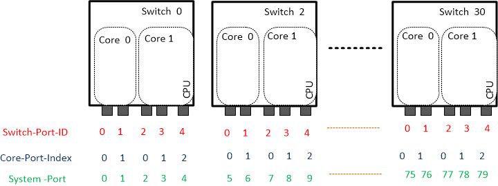
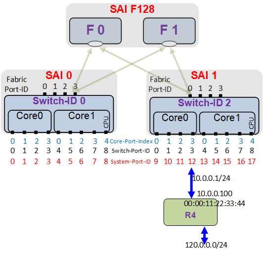
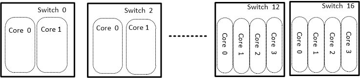

# SAI VoQ Switch Proposal


 Title       | SAI VoQ Switch
-------------|-----------------------------------------------------------------
 Authors     | Israel Meilik, Broadcom Inc.
 .           | Gabi Brach, Broadcom Inc.
 .           | Darryl Satterwhite, Broadcom Inc.
 .           | Michael Li, Broadcom Inc.
 Status      | In Review
 Type        | Standards track
 Created     | 01/16/2020
 Updated     | 05/21/2020
 SAI-Version | 1.6


# List of Changes

| Version | Changes                            | Name              | Date       |
| ------- | ---------------------------------- | ------------------| ---------- |
| 0.5     | Initial draft                      | Gabi Bracha       | 01/16/2020 |
| 0.6     | Made changes to SAI spec sections  | Darryl Satterwhite<br>Michael Li | 2/06/2020 |
| 0.7     | Update fabric port reachability attribute after SAI metadata checks | Michael Li | 3/11/2020 |
| 0.8     | Replaced SYSTEM_INDEX with SWITCH_ID | Israel Meilik<br>Gabi Brach | 3/12/2020 |
| 0.9     | Removed fabric_port_config attribute and "base_voq_index" in system_port_config attribute data structure | Michael Li<br>Darryl Satterwhite | 4/30/2020 |
| 1.0     | Updated fabric port error type as a list and updated fabric port queue stats | Michael Li | 5/6/2020 |
| 1.1     | Add recommendation on Switch and System Port numbering | Gabi Bracha | 5/10/2020 |
| 1.2     | Updated Neighbor, LAG and System Port Object sections. | Darryl Satterwhite | 5/20/2020 |
| 1.3     | Added new RIF and Neighbor attributes. Renamed REMOTE_OUTLIF_INDEX to ENCAP_INDEX. Also added sections for enhanced ACL and Mirror attributes. | Darryl Satterwhite | 5/21/2020 |


# 1. Integrated VOQ Switch

An Integrated VOQ Switch is a system consisting of several Line cards populated with Switch devices and Fabric Cards populated with Fabric devices. The Line Cards switches are connected to network ports on one side and to the Fabric devices on the other side. The Fabric device provides full connectivity between all switch devices. A Clos network is a typical example.

Lets refer to the totality of all network ports in all the switches on the line card as the chassis&#39; System-Ports. The chassis operates as a single integrated switch between all system ports. Thus, they provide switches with very high radix ( 100-1000s) that are typically used in higher levels of Data center networks.

There is also a simplified chassis where 2-3 switch devices are connected in a mesh directly with the fabric ports without an intermediate fabric switch.

The concepts and APIs presented in this document also apply to a switch consisting of a single device.

Typically, the fabric device is a different and simpler type of device than the line card switch. However, in some implementations a "regular" switching device may be used.

## 1.1 Packet Flow in VoQ Switch

Packet arrives at the network port of a switch device. At the device ingress, the packet is forwarded according to their header, and is allocated a Traffic Class (TC) and a System Port in some switch device (which may be on a remote device or the same device). The packet is placed in a Virtual Output Queue (VoQ) at the ingress that holds only packets directed to that specific VoQ and the packet&#39;s TC. Thus, if a system have 20 Line Cards, with 2 devices in each Line Card, each device supports 72 100G ports and a CPU ports, and 8 TCs are supported, then the each switch device ingress must include at least (72+1)*2*20*8 = 23360 VOQs, organized in bundle of 8 VOQs per System-Ports. The packet waits in the VoQs until it is granted fabric access. The agent that grants the fabric access is typically a scheduler at the egress device, that matches the rate of data it summons to the egress to the fabric bandwidth and System-Ports rate. The granting is typically done by sending through the fabric a special control cell (data units) called Credit that allows sending a certain quantity of data, e.g., 2KB. The scheduler has a QOS policy that decides how to allocate bandwidth between the competing TCs. If the port is congested, VoQs with lower priority will not receive fabric transmission grants, their level will rise until they start dropping packet according to a resources management policies (e.g. Tail-Drop, or WRED), or they will be marked according to a Congestion Avoidance protocol (e.g. ECN).

Packets are dequeued from the VOQ and are load balanced across all fabric ports to adjacent Fabric devices. Typically that process involves fragmenting the packets into cells, to ensure efficient load balancing. However, in some chassis implementation entire packets may be sent. The cells take multiple routes through several fabric devices. Typically the fabric devices do not require standard protocols, as they only determine across which ports to send the cells, and they employ proprietary protocol to learn the connectivity between Fabric-Ports and switches devices, and as such require no additional configuration. The cells converge in the switch device egress where they are re-assembled and their order is re-established, then they are placed at (shallow) queue per each network port and TC. Typically each TC has one queue per Unicast traffic and one per Multicast traffic. Each port has a scheduler that arbitrates between competing Egress Queue by QoS policy, typically assigning strict priority or Weighted Fair Queue (WFQ) between the TCs. That policy is essentially the same policy that allocates transmission grants to the VoQs.


**Figure 1 VoQ Switch structure and packet walkthrough**


## 1.2 Multi cores devices issues

High bandwidth devices are usually multi-core devices. Each core is associated with a subset of Network ports. Each core has its own data path and control path, as well as a scheduler for its own network ports. The cores share the fabric ports. For example, in a two core device, each VoQ is implemented as two distinct VoQs, one in each core. Thus, when we are performing statistics on a VoQ, we want to hide that internal VoQ partitioning and show the cumulative numbers.

Each port also has two local IDs according to the reference scheme. A port has a switch level ID, and a core level ID. For example a two-cores switch has 64 ports. (Switch) Port 35 is also Port 3 on Core 1

Also System-Port location needs to be more specific, rather than identifying it as {Device-ID, Device-Port-Index} , we identify it as {Device-ID, Core-Index, Core-Port-Index }.

## 1.3 Switch Fabric Modeling

The fabric switch consists of a list of fabric ports. Each port is associated with one to three fabric queues where cells may accumulate. There are counters per device and ports, and per queues. The fabric queue level is encoded to 4 values that indicate congestion level at the fabric queue.

## 1.4 SAI Extension proposal

- Introduce SAI switch attributes to pass chassis specific information to provide a system identifier, the number of total cores in the chassis information.
- Introduce a new Port object subtype "Fabric-Port" for fabric facing ports of the Switch and the ports of the Fabric device.
- Introduce a new SAI object "System-Ports",representing network or CPU ports in the switch . Note, each localport of the Switch device also has a System-Port instance (though with different IDs).
- A switch has 3 separate lists of ports: Local Network ports, System-Ports, and Fabric-Ports. Note all switches have the same System-Ports list consisting of all Network ports in the entire chassis, including its own ports, and all CPU ports.
- In a VoQ Switch, the SAI_QUEUE_TYPE_UNICAST object refers to the Egress Queues. While the ingress VoQs use the sub-type SAI_QUEUE_TYPE_UNICAST_VOQ.
- A System-Port comprises the identification of its location in the chassis – Device-ID, Core-Index, and Local-Core-Port-ID, and a list of VoQs, corresponding to the Traffic Classes.
- Each VoQ is associated with a WRED-Profile. Typically Drop and Color statistics are applied to the VoQs (rather than the Egress Queues)
- Fabric port is associated with one to three TX- Fabric-Queues,whose IDs are the object handles for statistics collection.

Following figure shows a VOQ based system comprising of 16 switches, 2 cores, 2 network ports per each core and a CPU ports and the 3 ID reference systems: Port index in the switch, ports index in the core and the global System Port ID


**Figure 2: VoQ system example**

## 1.5 IP Routing in a VOQ system

A VOQ based system splits the packet processing between Ingress device and Egress device, while functioning as a single hop node in the network. This functional split requires some level of data-plane coordination between the ingress and egress devices.
 It is the responsibility of the layer above SAI, be it some NOS (Network Operating System), or other SDN (Software Defined Network) orchestration software, to coordinate the devices constructing the VOQ system.

Although it is not mandated in any way, a VOQ system is expected to be composed of multiple devices (VOQ switches), where each device, or few devices, will be running its own SAI, which is the case in a typical chassis router.
 The case where all the devices in the system are controlled by a single SAI is also a valid case, but is less common and presents no SAI complexities or challenges as in the distributed system case. Therefore, we focus on the case of a system with multiple SAI instances (SAI per device, or per few devices).

In this section we elaborate the "add route" procedure, and show how the Ingress/Egress functional split affects the SAI calls, and the required higher layer orchestration. Overall, the proposed changes to the "non-VOQ/single-switch" "add route" SAI calls are minor.



The system drawn in the figure above is used as an example. A SAI image is managing each VOQ switch device, while the two Fabric devices are managed by a single SAI image.
 The "add route" process sequence will refer to that example system.

"Add route" procedure involves four SAI calls: create_router_interface, create_neighbor entry, create_next_hop, and finally, create_route_entry. Each step will be examined and, where needed, a change proposal will be explained.

### 1.5.1 Router Interface

The SAI creat_ router_interface main parameters are: (VRF, Port, MAC-Address, [VLAN]). The function returns a SAI object.
 For example, if we want to create a port level Router-Interface (RIF) on Switch-2, local port 3 (which is system-port 12), we call create_router_interface with (VRF=\&lt;e.g.-Default-VRF\&gt;, Port=3, MAC=00:00:12:34:56:78).
 In a VOQ system we propose to change the Port parameter in the call to be System-Port instead of Port, which will enable to set the same Router-Interfaces on all the of the system devices (and SAI instances), so that all the SAI instances will "see" the exact same set of Router-Interfaces, which covers all the Router Interfaces across the entire system.
 An implication of this change is that a given SAI image will have Router-Interfaces which are physically located on other devices in the system. This may seem awkward to some, hence, an optional "assistance" attribute: ROUTER-INTERFACE-IS-LOCAL is proposed to help avoiding any confusions, or misuse. The default value of the optional attribute: ROUTER-INTERFACE-IS-LOCAL is TRUE, keeping backward compatibility with existing SAI router interface.

To sum it up, the proposal for VOQ devices is to replace the Port parameter with the System-Port parameter in the create_router_interface call.

Note that although the "legacy" call with the Port parameter is a valid option, the suggested practice for a VOQ system is always to use System-Port for router interface creation, regardless if this router interface is associated with the local device, or with a remote device.

### 1.5.2 Neighbor

The SAI create_neighbor main parameters are: (IP-Address, MAC-Address, Router-Interface).
 The function does not return a SAI object.

In a VOQ system where the packet is typically processed on both the Ingress (forwarding) and Egress (packet editing) devices, the SAI create neighbor call has different "interpretation" on the Ingress SAI image and the Egress SAI image. Each device is applying different "actions" as a result of the neighbor_create call.
 Note that an architecture that is doing the entire processing on the Ingress device is also a valid option, though it will probably be less efficient, especially for a large distributed system (e.g., in a chassis system).

The Ingress device is responsible for the forwarding related neighbor functionality, whereas the Egress device is responsible for the editing, or more precisely the encapsulation related neighbor functionality. To facilitate this partition, a packet traversing the VOQ node passes an index from the Ingress device to the Egress device, the NEIGHBOR-ENCAP-INDEX. This index is used on the Egress device to retrieve all the neighbor encapsulation information.

The exact call sequence in the VOQ system (i.e., between different SAI instances), and the NEIGHBOR-ENCAP-INDEX allocation method, are out of the scope of this document. Synchronizing the NEIGHBOR-ENCAP-INDEX between the (Egress) device/s to which the neighbor is connected and all the other devices in the system is not part of SAI. This functionality is assumed to be the responsibility of the layer above SAI.

We propose three additional SAI neighbor attributes:

- NEIGHBOR-ENCAP-INDEX
 Index pointing to the neighbor encapsulation information on the device that is connected to the neighbor
- NEIGHBOR-ENCAP-IMPOSE-INDEX
 Indicating to the SAI layer at the egress device whether to allocate NEIGHBOR-ENCAP-INDEX, or to get its value (i.e., impose) from the layer above SAI.
 When creating a neighbor with set NEIGHBOR-ENCAP-IMPOSE-INDEX, the NEIGHBOR-ENCAP-INDEX is passed to SAI as part of the create parameters.
 When creating a neighbor with unset NEIGHBOR-ENCAP-IMPOSE-INDEX, the NEIGHBOR-ENCAP-INDEX is allocated by SAI as part of the neighbor create process, and it can be retrieved later via a "get" call.
- NEIGHBOR-IS-LOCAL
 Indicating if the neighbor is connected to this device

A usage example for neighbor_create in the above drawn system is:

- Call create_neighbor on SAI1 with the attributes (NEIGHBOR-ENCAP-IMPOSE-INDEX=False, NEIGHBOR-IS-LOCAL=True), and the parameters (IP-Addr=10.0.0.100, MAC-Address=00:00:11:22:33:44, Router-Interface=RIF-SAI1-Sys-Port-12)
- SAI will allocate NEIGHBOR-ENCAP-INDEX
- Get NEIGHBOR-ENCAP-INDEX for the above neighbor (NEIGHBOR-ENCAP-INDEX-SP12)
- Call create_neighbor on SAI0 with the attributes (NEIGHBOR-ENCAP-INDEX-SP12, NEIGHBOR-ENCAP-IMPOSE-INDEX=True, NEIGHBOR-IS-LOCAL=False),
 and the parameters (IP-Addr=10.0.0.100, MAC-Address=00:00:11:22:33:44, Router-Interface=RIF-SAI1-Sys-Port-12)
- SAI will impose NEIGHBOR-ENCAP-INDEX-SP12 upon creation

Other usage models are possible as well.

The suggested practice is to let SAI allocate the NEIGHBOR-ENCAP-INDEX for SAI instances that are connected directly to the neighbor (i.e. when NEIGHBOR-IS-LOCAL=True), and then use this index for creating that neighbor on all other SAI images in the system. In some cases where the neighbor may relocate its adjacent device over time, or when the neighbor may be reached by multiple devices (e.g. port VLAN Router Interface, or over LAG interface), it is suggested to impose NEIGHBOR-ENCAP-INDEX.

### 1.5.3 Next Hop

The SAI create_next_hop main parameters are: (IP-Address, RIF). The function returns a SAI object.
 There are no SAI changes required for a VOQ system.

It is assumed that the layer above SAI will create the same next hop on all SAI instances in the system.

### 1.5.4 Route entry

The SAI creat_ route_entry main parameters are: (VRF, Prefix, Next Hop).
 There are no SAI changes required for a VOQ system.

It is assumed that the layer above SAI will create the same route entry on all SAI instances in the system.

## 1.6 Guideline for numbering switches

A switch consumes a number of consecutive ID according to the number of its cores. So if we have a 4 cores device, it would have a Base-ID = N, and consumes IDs N, N+1,N+2,N+3, that no other device core can share. The next device ID should be at least N+4. The allocation of the Base-ID typically follows the structure of the switch. For example, in a 8 slot system with two 4-core devices line card per, the devices in slot S will be allocated Base-ID Sx* and Sx8+4.



## 1.7 Guideline for numbering system ports

The system ports are unique with the system. Some good practices are:

- For similarly configured devices, that is, same device with same combination of network interfaces, retain the numbering based on a device offset
- Reserve in each device space some system ports IDs for traffic targets that are not network ports, these would be the CPU host interface, internal CPUs, internal engines, like an OAM processor, and a recycling interface.
- If you can have a breakout card beyond some large bandwidth interfaces, that will split its bandwidth. For example a card that split 400G to 16x25G interface, and you want traffic to be scheduled at the 25G interface level, then you will have to define 16 System-Ports.

## 1.8 Guideline for numbering fabric device

The fabric devices IDs may share or not share the same space as the switch ID. However, if they do share the same ID space they must be in separate range.

# 2. SAI Specification

## 2.1 Switch Configuration Info

### 2.1.1 SAI_SWITCH_ATTR_TYPE

A new switch type enum is introduced for VOQ based switch devices and fabric switch devices (ie Ramon).

```c
/*** 
 * @brief Attribute data for #SAI_SWITCH_ATTR_TYPE
 */
 typedef enum _sai_switch_type_t
 {
    ...

    /** Switch type is VOQ based NPU */
    SAI_SWITCH_TYPE_VOQ,

    /** Switch type is Fabric switch device */
    SAI_SWITCH_TYPE_FABRIC,

} sai_switch_type_t;
```

### 2.1.2 SAI_SWITCH_ATTR_SWITCH_ID

This switch id represents the switch device's first core. The external supervisor needs to be aware of the number of cores and skip indexes appropriately. The external supervisor has to have detailed knowledge of cores.

```c
/*** @brief Vendor specific switch id. Identifies switch chip
 *
 * Mandatory in VoQ Switch
 *
 * @type sai_uint32_t
 * @flags MANDATORY_ON_CREATE | CREATE_ONLY
 * @default empty
 */
 SAI_SWITCH_ATTR_SWITCH_ID
```

### 2.1.3 SAI_SWITCH_ATTR_MAX_SYSTEM_CORES

This defines the max number of cores in the VoQ Switch (a.k.a. Chassis). This can be used for calculation of internal resources.

```c
/*** @brief Maximum number of cores in the VoQ Switch (chassis)
 *
 * Mandatory in VoQ Switch
 *
 * @type sai_uint32_t
 * @flags MANDATORY_ON_CREATE | CREATE_ONLY
 * @default empty
 */
 SAI_SWITCH_ATTR_MAX_SYSTEM_CORES
```

### 2.1.4 SAI_SWITCH_ATTR_SYSTEM_PORT_CONFIG_LIST

This switch attribute structure defines a list of system port parameters passed to create_switch API. There is a system port for every port in the chassis. Ports include front panel ports, cpu port(s), and other internal ports (excluding Fabric Ports). Defined in "saitypes.h"

```c
typedef struct _sai_system_port_config_t 
{
    uint32_t port_id;
    uint32_t attached_switch_id;
    uint32_t attached_core_index;
    uint32_t attached_core_port_index;
    uint32_t speed;uint32_t num_voq;
} sai_system_port_config_t;

typedef struct _sai_system_port_config_list_t
{
    /** Number of entries in the list */
    uint32_t count;

    /** System port list */
    sai_system_port_config_t *list;
} sai_system_port_config_list_t;

/**
 * @brief System port configuration list.
 *
 * @type sai_system_port_config_list_t
 * @flags CREATE_ONLY
 * @default empty
 */
SAI_SWITCH_ATTR_SYSTEM_PORT_CONFIG_LIST
```

### 2.1.5 SAI_SWITCH_ATTR_SYSTEM_PORT_LIST

Used in sai_get_switch_attribute API to get the number of system ports and an array of system port objects. Note that system ports are objects separate from regular port objects.

```c
/**
 * @brief Number of system ports
 *
 * @type sai_uint32_t
 * @flags READ_ONLY
 */
SAI_SWITCH_ATTR_NUMBER_OF_SYSTEM_PORTS

/**
 * @brief Get the system port list
 *
 * @type sai_object_list_t
 * @flags READ_ONLY
 * @objects SAI_OBJECT_TYPE_SYSTEM_PORT
 * @default internal
 */
 SAI_SWITCH_ATTR_SYSTEM_PORT_LIST
```

### 2.1.6 SAI_SWITCH_ATTR_FABRIC_PORT_LIST

Used in sai_get_switch_attribute API to get the number of fabric ports and an array of fabric port objects. Similar to front panel port list, we can use the existing port attribute "SAI_PORT_ATTR_HW_LANE_LIST" to get a mapping of the fabric port object to the HW fabric port ID.

```c
/**
 * @brief Number of fabric ports on the switch
 *
 * @type sai_uint32_t
 * @flags READ_ONLY
 */
SAI_SWITCH_ATTR_NUMBER_OF_FABRIC_PORTS

/**
 * @brief Get the fabric port list
 *
 * @type sai_object_list_t
 * @flags READ_ONLY
 * @objects SAI_OBJECT_TYPE_PORT
 * @default internal
 */
SAI_SWITCH_ATTR_FABRIC_PORT_LIST
```

## 2.2 Switch Statistics

Global device statistics for switch and fabric device types (comments show which device type the counter applies to). Retrieve fabric stats using "get_switch_stats" SAI APIs.

```c
/**
 * @brief Switch counter IDs in sai_get_switch_stats() call
 *
 * @flags Contains flags
 */
 typedef enum _sai_switch_stat_t
 {
    /** Reachability discards [switch | fabric] */
    SAI_SWITCH_STAT_REACHABILITY_DROP,

    /** Congestion related high watermark [switch] */
    SAI_SWITCH_STAT_HIGHEST_QUEUE_CONGESTION_LEVEL,

    /** discards not counted in other switch stat type [fabric] */
    SAI_SWITCH_STAT_GLOBAL_DROP,

    /** Custom range base value */
    SAI_SWITCH_STAT_CUSTOM_RANGE_BASE = 0x10000000
    ...

} sai_switch_stat_t;
```

## 2.3 Port Attributes, Types, and APIs

### 2.3.1 New Port Types

```c
/**
 * @brief Port Type
 *
 * @type sai_port_type_t
 */
SAI_PORT_ATTR_TYPE = SAI_PORT_ATTR_START,

/**
 * @brief Attribute data for #SAI_PORT_ATTR_TYPE
 */
typedef enum _sai_port_type_t
{
    ...
    /** Fabric Port */
    SAI_PORT_TYPE_FABRIC

} sai_port_type_t;
```

### 2.3.2 System Port Object APIs and Attributes

System port creation can be accomplished by calling switch_create() with the list of system ports to be created using SAI_SWITCH_ATTR_SYSTEM_PORT_CONFIG_LIST or creating them individually using the create_system_port() function in the system port APIs. Although it is expected that all local ports be created in switch_create().

System port configuration can be retrieved by using the SAI_SYSTEM_PORT_ATTR_CONFIG_INFO attribute. There are also attributes to retrieve the mappings between system port objects and local port objects and retrieval of VoQs type object list associated with the system port.

```c
/**
 * @brief Attribute data for #SAI_SYSTEM_PORT_ATTR_TYPE
 */
typedef enum _sai_system_port_type_t
{
    /** Local to switch */
    SAI_SYSTEM_PORT_TYPE_LOCAL,

    /** Remote switch */
    SAI_SYSTEM_PORT_TYPE_REMOTE,

} sai_system_port_type_t;

/**
 * @brief Attribute Id in sai_set_system_port_attribute() and
 * sai_get_system_port_attribute() calls
 */
typedef enum _sai_system_port_attr_t
{
    /**
     * @brief Start of attributes
     */
    SAI_SYSTEM_PORT_ATTR_START,

    /* READ-ONLY */

    /**
     * @brief System Port Type
     *
     * @type sai_system_port_type_t
     * @flags READ_ONLY
     */
    SAI_SYSTEM_PORT_ATTR_TYPE = SAI_SYSTEM_PORT_ATTR_START,

    /**
     * @brief Number of Virtual output queues on port
     *
     * @type sai_uint32_t
     * @flags READ_ONLY
     */
    SAI_SYSTEM_PORT_ATTR_QOS_NUMBER_OF_VOQS,

    /**
     * @brief List of Virtual output Queues for the port
     *
     * @type sai_object_list_t
     * @flags READ_ONLY
     * @objects SAI_OBJECT_TYPE_QUEUE
     */
    SAI_SYSTEM_PORT_ATTR_QOS_VOQ_LIST,

    /**
     * @brief Local port for the system port
     *
     * Only valid for system ports which are mapped to local ports.
     *
     * @type sai_object_id_t
     * @flags READ_ONLY
     * @objects SAI_OBJECT_TYPE_PORT
     */
    SAI_SYSTEM_PORT_ATTR_PORT,

    /* READ-WRITE */

    /**
     * @brief Admin Mode
     *
     * @type bool
     * @flags CREATE_AND_SET
     * @default false
     */
    SAI_SYSTEM_PORT_ATTR_ADMIN_STATE,

    /**
     * @brief System Port Configuration Information
     *
     * @type sai_system_port_config_t
     * @flags MANDATORY_ON_CREATE | CREATE_ONLY
     */
    SAI_SYSTEM_PORT_ATTR_CONFIG_INFO,

    /**
     * @brief End of attributes
     */
    SAI_SYSTEM_PORT_ATTR_END,

    /** Custom range base value */
    SAI_SYSTEM_PORT_ATTR_CUSTOM_RANGE_START = 0x10000000,

    /** End of custom range base */
    SAI_SYSTEM_PORT_ATTR_CUSTOM_RANGE_END

} sai_system_port_attr_t;

/**
 * @brief Create system port
 *
 * @param[out] system_port_id System Port id
 * @param[in] switch_id Switch id
 * @param[in] attr_count Number of attributes
 * @param[in] attr_list Array of attributes
 *
 * @return #SAI_STATUS_SUCCESS on success, failure status code on error
 */
typedef sai_status_t (*sai_create_system_port_fn)(
        _Out_ sai_object_id_t *system_port_id,
        _In_ sai_object_id_t switch_id,
        _In_ uint32_t attr_count,
        _In_ const sai_attribute_t *attr_list);

/**
 * @brief Remove system port
 *
 * @param[in] system_port_id System Port id
 *
 * @return #SAI_STATUS_SUCCESS on success, failure status code on error
 */
typedef sai_status_t (*sai_remove_system_port_fn)(
        _In_ sai_object_id_t system_port_id);

/**
 * @brief Set system port attribute value.
 *
 * @param[in] system_port_id System Port id
 * @param[in] attr Attribute
 *
 * @return #SAI_STATUS_SUCCESS on success, failure status code on error
 */
typedef sai_status_t (*sai_set_system_port_attribute_fn)(
        _In_ sai_object_id_t system_port_id,
        _In_ const sai_attribute_t *attr);

/**
 * @brief Get system port attribute value.
 *
 * @param[in] system_port_id System Port id
 * @param[in] attr_count Number of attributes
 * @param[inout] attr_list Array of attributes
 *
 * @return #SAI_STATUS_SUCCESS on success, failure status code on error
 */
typedef sai_status_t (*sai_get_system_port_attribute_fn)(
        _In_ sai_object_id_t system_port_id,
        _In_ uint32_t attr_count,
        _Inout_ sai_attribute_t *attr_list);

/**
 * @brief Port methods table retrieved with sai_api_query()
 */
typedef struct _sai_system_port_api_t
{
    sai_create_system_port_fn                create_system_port;
    sai_remove_system_port_fn                remove_system_port;
    sai_set_system_port_attribute_fn         set_system_port_attribute;
    sai_get_system_port_attribute_fn         get_system_port_attribute;

} sai_system_port_api_t;
```

### 2.3.3 Port to System Port Mapping

New Port attribute is added to retrieve the associated system port object for a specific port object. Note that if the system port is not local, an error will be returned.

```c
/**
 * @brief System port for the port
 *
 * @type sai_object_id_t
 * @flags READ_ONLY
 * @objects SAI_OBJECT_TYPE_SYSTEM_PORT
 */
SAI_PORT_ATTR_SYSTEM_PORT
```

### 2.3.4 Fabric Port Connectivity

For Fabric ports, new read only attributes are added to retrieve the attached switch id and port index for each fabric port. These can be used to check connectivity.

```c
/**
 * @brief Fabric port attached
 *
 * Signifies if fabric port is attached
 *
 * @type sai_switch_type_t
 * @flags READ_ONLY
 */
SAI_PORT_ATTR_FABRIC_ATTACHED

/**
 * @brief Attached switch type.
 *
 * Signifies the attached switch type
 *
 * @type sai_switch_type_t
 * @flags READ_ONLY
 */
SAI_PORT_ATTR_FABRIC_ATTACHED_SWITCH_TYPE

/**
 * @brief Attached switch id.
 *
 * Signifies the attached switch id
 *
 * @type sai_uint32_t
 * @flags READ_ONLY
 */
SAI_PORT_ATTR_FABRIC_ATTACHED_SWITCH_ID


/**
 * @brief Attached Port Index.
 *
 * Signifies the attached port index
 *
 * @type sai_uint32_t
 * @flags READ_ONLY
 */
SAI_PORT_ATTR_FABRIC_ATTACHED_PORT_INDEX
```

### 2.3.5 Fabric Port Reachability

The port reachability attribute shows whether the remote switch ID provided can be reached through this fabric port. The reachability attribute can be queried on each fabric port retrieved from the fabric port list switch attribute.

```c
/**
 * @brief Fabric port reachability
 */
typedef struct _sai_fabric_port_reachability_t
{
    /** Remote switch ID (SAI_SWITCH_TYPE_NPU) */
    uint32_t switch_id;

    /** Remote switch ID is reachable through the fabric port */
    bool reachable;
} sai_fabric_port_reachability_t;

/**
  * @brief Fabric port reachability
  *
  * @type sai_fabric_port_reachability_t
  * @flags READ_ONLY
  */
SAI_PORT_ATTR_FABRIC_REACHABILITY,
```

### 2.3.6 Fabric Port Error Status Attributes

The following port error status attribute can give more info on errors occurred on port (returned as a list of errors).

```c
/**
 * @brief Port Down Error Status
 *
 * @type sai_port_err_status_list_t
 * @flags READ_ONLY
 */
SAI_PORT_ATTR_ERR_STATUS_LIST


/**
 * @brief Attribute data for #SAI_PORT_ATTR_ERR_STATUS_LIST
 */
typedef enum _sai_port_err_status_t
{
    /** Data Unit CRC Error */
    SAI_PORT_ERR_STATUS_DATA_UNIT_CRC_ERROR,

    /** Data Unit Size Error */
    SAI_PORT_ERR_STATUS_DATA_UNIT_SIZE,

    /** Data Unit Misalignment Error */
    SAI_PORT_ERR_STATUS_DATA_UNIT_MISALIGNMENT_ERROR,

    /** Uncorrectable RS-FEC code word error */
    SAI_PORT_ERR_STATUS_CODE_GROUP_ERROR,

    /** SerDes Signal is out of sync */
    SAI_PORT_ERR_STATUS_SIGNAL_LOCAL_ERROR,

    /** Port is not accepting reachability data units */
    SAI_PORT_ERR_STATUS_NO_RX_REACHABILITY,

    /** Rate of data units with CRC errors passed its threshold */
    SAI_PORT_ERR_STATUS_CRC_RATE  
 
    /** Error remote fault indication */
    SAI_PORT_ERR_STATUS_REMOTE_FAULT_STATUS 

} sai_port_err_status_t;
```

### 2.3.7 SAI_OBJECT_TYPE_LAG

The SAI_LAG_MEMBER_ATTR_PORT_ID has been enhanced to support SAI_OBJECT_TYPE_SYSTEM_PORT. So system port objects, whether local or remote, can be LAG member ports.

Even if one of the LAG members is local, while the other reside on different devices, SAI_OBJECT_TYPE_SYSTEM_PORT should be used so the LAG member creation call will be the same in all devices.

However if one designs a product family of VOQ systems spanning from multiple-devices chassis to single device line card, it is recommended that all systems will use SAI_OBJECT_TYPE_SYSTEM_PORT as LAG members.

```c
typedef enum _sai_lag_member_attr_t
{
    /**
     * @brief Start of attributes
     */
    SAI_LAG_MEMBER_ATTR_START,

    /**
     * @brief LAG ID
     *
     * @type sai_object_id_t
     * @flags MANDATORY_ON_CREATE | CREATE_ONLY
     * @objects SAI_OBJECT_TYPE_LAG
     */
    SAI_LAG_MEMBER_ATTR_LAG_ID = SAI_LAG_MEMBER_ATTR_START,

    /**
     * @brief Logical port ID
     *
     * @type sai_object_id_t
     * @flags MANDATORY_ON_CREATE | CREATE_ONLY
     * @objects SAI_OBJECT_TYPE_PORT, SAI_OBJECT_TYPE_SYSTEM_PORT
     */
    SAI_LAG_MEMBER_ATTR_PORT_ID,

    ...

} sai_lag_member_attr_t;
```

A new attribute called SAI_LAG_ATTR_SYSTEM_PORT_AGGREGATE_ID is introduced to allow applications to manage allocation of system port aggregate IDs for LAGs.
The system port aggregate ID associated with the LAG must be the same value across all other VOQ switches in the system. The system port aggregate ID range 
is from 1 to SAI_SWITCH_ATTR_NUMBER_OF_LAGS. A default value of 0 means this field is not used and SAI will allocate system port aggregate ID internally.

```c
typedef enum _sai_lag_attr_t
{
    ... 
    /**
     * @brief LAG system port ID
     *
     * The application must manage the allocation of the system port aggregate IDs
     * associated with the LAG for consistency across all switches in a VOQ based
     * system. The system port aggregate ID range is from 1 to SAI_SWITCH_ATTR_NUMBER_OF_LAGS.
     * The default value of 0 means this field is not used and SAI will allocate the system
     * port aggregate ID internally.
     * Valid only when SAI_SWITCH_ATTR_TYPE == SAI_SWITCH_TYPE_VOQ
     *
     * @type sai_uint32_t
     * @flags CREATE_ONLY
     * @default 0
     */
    SAI_LAG_ATTR_SYSTEM_PORT_AGGREGATE_ID,
    ...
} sai_lag_attr_t; 

```

### 2.3.8 New Ports Stats

New statistics for fabric ports on switch and fabric devices. Note that FEC statistics can also apply to other physical port types.

```c
/**
 * @brief Port counter IDs in sai_get_port_stats() call
 *
 * @flags Contains flags
 */
typedef enum _sai_port_stat_t
{
    SAI_PORT_STAT_IF_IN_OCTETS,
    ...
    SAI_PORT_STAT_IF_IN_ERRORS,
    ...
    SAI_PORT_STAT_IF_OUT_OCTETS,
    ...
    SAI_PORT_STAT_IF_IN_FEC_CORRECTABLE_FRAMES,
    SAI_PORT_STAT_IF_IN_FEC_UNCORRECTABLE_FRAMES,
    SAI_PORT_STAT_IF_IN_FEC_SYMBOL_ERRORS,
    ...
    /** SAI stats for fabric ports data units */        
    SAI_PORT_STAT_IF_IN_FABRIC_DATA_UNITS,
    SAI_PORT_STAT_IF_OUT_FABRIC_DATA_UNITS,
    ...
} sai_port_stat_t;
```

## 2.4 Queue Attributes, Types, and APIs

## 2.4.1 New Queue Types

```c
/**
 * @brief Enum defining Queue types.
 */
typedef enum _sai_queue_type_t
{
    /** H/w Queue for all types of traffic */
    SAI_QUEUE_TYPE_ALL = 0x00000000,

    /** H/w Egress Unicast Queue */
    SAI_QUEUE_TYPE_UNICAST = 0x00000001,

    /** H/w Multicast Egress (Broadcast, Unknown unicast, Multicast) Queue */
    SAI_QUEUE_TYPE_MULTICAST = 0x00000002,

    /** H/w Virtual Output Queue (VoQ). This queue is ingress unicast queue */
    SAI_QUEUE_TYPE_UNICAST_VOQ = 0x00000003,

    /** H/w Fabric Queue. */
    SAI_QUEUE_TYPE_FABRIC_TX = 0x00000004,

    /* Custom range base value */
    SAI_QUEUE_TYPE_CUSTOM_RANGE_BASE = 0x10000000

} sai_queue_type_t;
```

### 2.4.2 VoQ Attributes

Newly defined VOQ type (SAI_QUEUE_TYPE_UNICAST_VOQ)is meant to use existing Queue attributes and flows. VOQs are created during System Port creation. It uses the speed attribute passed during system port creation to set defaults for queue management. From that point on, existing methods are used to set queue thresholds (e.g. WRED Profile).

**Note**: Association to Scheduler is configured on the queues of the local Port, same as a non VOQ system.

### 2.4.3 Fabric Queue Attributes

Fabric queues (internal Tx FIFOs) are used for retrieving queue statistics for fabric port types (no distinct attributes).


### 2.4.4 Modification to queue stats

```c
/**
 * @brief Enum defining statistics for Queue.
 */
typedef enum _sai_queue_stat_t
{
    /** Get/set tx packets count [uint64_t] */
    /** [relevance for VOQ system] */
    SAI_QUEUE_STAT_PACKETS = 0x00000000, [VOQ |QUEUE]
    /** Get/set tx bytes count [uint64_t] */
    SAI_QUEUE_STAT_BYTES = 0x00000001, [VOQ |QUEUE]
    /** Get/set dropped packets count [uint64_t] */
    SAI_QUEUE_STAT_DROPPED_PACKETS = 0x00000002, [VOQ |QUEUE]
    /** Get/set dropped bytes count [uint64_t] */
    SAI_QUEUE_STAT_DROPPED_BYTES = 0x00000003, [VOQ |QUEUE]
    /** Get/set green color tx packets count [uint64_t] */
    SAI_QUEUE_STAT_GREEN_PACKETS = 0x00000004, [VOQ]
    /** Get/set green color tx bytes count [uint64_t] */
    SAI_QUEUE_STAT_GREEN_BYTES = 0x00000005, [VOQ]
    /** Get/set green color dropped packets count [uint64_t] */
    SAI_QUEUE_STAT_GREEN_DROPPED_PACKETS = 0x00000006, [VOQ]
    /** Get/set green color dropped packets count [uint64_t] */
    SAI_QUEUE_STAT_GREEN_DROPPED_BYTES = 0x00000007, [VOQ]
    /** Get/set yellow color tx packets count [uint64_t] */
    SAI_QUEUE_STAT_YELLOW_PACKETS = 0x00000008, [VOQ]
    /** Get/set yellow color tx bytes count [uint64_t] */
    SAI_QUEUE_STAT_YELLOW_BYTES = 0x00000009, [VOQ]
    /** Get/set yellow color drooped packets count [uint64_t] */
    SAI_QUEUE_STAT_YELLOW_DROPPED_PACKETS = 0x0000000a, [VOQ]
    /** Get/set yellow color dropped bytes count [uint64_t] */
    SAI_QUEUE_STAT_YELLOW_DROPPED_BYTES = 0x0000000b, [VOQ]
    /** Get/set red color tx packets count [uint64_t] */
    SAI_QUEUE_STAT_RED_PACKETS = 0x0000000c, [VOQ]
    /** Get/set red color tx bytes count [uint64_t] */
    SAI_QUEUE_STAT_RED_BYTES = 0x0000000d, [VOQ]
    /** Get/set red color dropped packets count [uint64_t] */
    SAI_QUEUE_STAT_RED_DROPPED_PACKETS = 0x0000000e, [VOQ]
    /** Get/set red color drooped bytes count [uint64_t] */
    SAI_QUEUE_STAT_RED_DROPPED_BYTES = 0x0000000f, [VOQ]
    /** Get/set WRED green color dropped packets count [uint64_t] */
    SAI_QUEUE_STAT_GREEN_WRED_DROPPED_PACKETS = 0x00000010, [VOQ]
    /** Get/set WRED green color dropped bytes count [uint64_t] */
    SAI_QUEUE_STAT_GREEN_WRED_DROPPED_BYTES = 0x00000011, [VOQ]
    /** Get/set WRED yellow color dropped packets count [uint64_t] */
    SAI_QUEUE_STAT_YELLOW_WRED_DROPPED_PACKETS = 0x00000012, [VOQ]
    /** Get/set WRED yellow color dropped bytes count [uint64_t] */
    SAI_QUEUE_STAT_YELLOW_WRED_DROPPED_BYTES = 0x00000013, [VOQ]
    /** Get/set WRED red color dropped packets count [uint64_t] */
    SAI_QUEUE_STAT_RED_WRED_DROPPED_PACKETS = 0x00000014, [VOQ]
    /** Get/set WRED red color dropped bytes count [uint64_t] */
    SAI_QUEUE_STAT_RED_WRED_DROPPED_BYTES = 0x00000015, [VOQ]
    /** Get/set WRED dropped packets count [uint64_t] */
    SAI_QUEUE_STAT_WRED_DROPPED_PACKETS = 0x00000016, [VOQ]
    /** Get/set WRED red dropped bytes count [uint64_t] */
    SAI_QUEUE_STAT_WRED_DROPPED_BYTES = 0x00000017, [VOQ]
    /** Get current queue occupancy in bytes [uint64_t] */
    SAI_QUEUE_STAT_CURR_OCCUPANCY_BYTES = 0x00000018, [VOQ | Fabric Queue]
    /** Get watermark queue occupancy in bytes [uint64_t] */
    SAI_QUEUE_STAT_WATERMARK_BYTES = 0x00000019, [VOQ]
    /** Get current queue shared occupancy in bytes [uint64_t] */
    SAI_QUEUE_STAT_SHARED_CURR_OCCUPANCY_BYTES = 0x0000001a,[N/A]
    /** Get watermark queue shared occupancy in bytes [uint64_t] */
    SAI_QUEUE_STAT_SHARED_WATERMARK_BYTES = 0x0000001b, [N/A]
    /** Get/set WRED green color marked packets count [uint64_t] */
    SAI_QUEUE_STAT_GREEN_WRED_ECN_MARKED_PACKETS = 0x0000001c, [N/A]
    /** Get/set WRED green color marked bytes count [uint64_t] */
    SAI_QUEUE_STAT_GREEN_WRED_ECN_MARKED_BYTES = 0x0000001d, [N/A]
    /** Get/set WRED yellow color marked packets count [uint64_t] */
    SAI_QUEUE_STAT_YELLOW_WRED_ECN_MARKED_PACKETS = 0x0000001e, [N/A]
    /** Get/set WRED yellow color marked bytes count [uint64_t] */
    SAI_QUEUE_STAT_YELLOW_WRED_ECN_MARKED_BYTES = 0x0000001f, [N/A]
    /** Get/set WRED red color marked packets count [uint64_t] */
    SAI_QUEUE_STAT_RED_WRED_ECN_MARKED_PACKETS = 0x00000020, [N/A]
    /** Get/set WRED red color marked bytes count [uint64_t] */
    SAI_QUEUE_STAT_RED_WRED_ECN_MARKED_BYTES = 0x00000021, [N/A]
    /** Get/set WRED marked packets count [uint64_t] */
    SAI_QUEUE_STAT_WRED_ECN_MARKED_PACKETS = 0x00000022, [QUEUE]
    /** Get/set WRED red marked bytes count [uint64_t] */
    SAI_QUEUE_STAT_WRED_ECN_MARKED_BYTES = 0x00000023, [QUEUE]
    /** Get current queue occupancy percentage [uint64_t] */
    SAI_QUEUE_STAT_CURR_OCCUPANCY_LEVEL = 0x00000024, [Fabric Queue]
    /** Get watermark queue occupancy percentage [uint64_t] */
    SAI_QUEUE_STAT_WATERMARK_LEVEL = 0x00000025, [Fabric Queue]
    /** Custom range base value */
    SAI_QUEUE_STAT_CUSTOM_RANGE_BASE = 0x10000000
} sai_queue_stat_t;
```

## 2.5. New Router Interface Attribute

A new router interface attribute was added to indicate if the router interface physically exists local to the line card. This provides additional protection against misconfiguration by explicitly tagging the RIF as local or remote.

```
/**
 * @brief Routing interface attribute IDs
 */
typedef enum _sai_router_interface_attr_t
{
    /**
     * @brief Start of attributes
     */
    SAI_ROUTER_INTERFACE_ATTR_START,
    ...

    /**
     * @brief To flag that this interface is present locally
     *
     * In VOQ systems it is possible that the interface is remote
     *
     * @type bool
     * @flags CREATE_ONLY
     * @default true
     */
    SAI_ROUTER_INTERFACE_ATTR_IS_LOCAL,
    ...
} sai_router_interface_attr_t;
```

## 2.6. New Neighbor Entry Attributes

In a VOQ system, data plane functionality is partitioned between Ingress Switch (where the packet enters, and Forwarding process is performed), and Egress Switch (where the packet is modified and transmitted). Egress device objects need to be synchronized with Ingress devices to provide a coherent end-to-end data plane.

For port-based routing, objects created at an Egress device will be referenced from all Ingress Switches. When a neighbor is discovered (ARP/NDP) on a remote Switch, the neighbor entry at the remote Switch must be created and referenced to the local Switch SAI. The remote Switch neighbor is realized as an Encap in its ASIC-DB, the remote Switch Encap index is provided using a new attribute (SAI_NEIGHBOR_ENTRY_ATTR_ENCAP_INDEX) for the neighbor entry. The newly created neighbor will use this attribute along with the RIF, to route traffic properly to the remote Switch and determine its processing at the Egress Switch.

For VLAN-based routing, encapsulation indexes need to be managed by the application (not SAI). The same encapsulation index must be used for the same neighbor which is created/cloned on all VOQ devices.

Two new attributes are used to pass the actual encapsulation index and to flag that the action is to impose it. The attribute SAI_NEIGHBOR_ENTRY_ATTR_ENCAP_IMPOSE_INDEX is used to protect against misconfiguration. Also for further protection against misconfiguration SAI_NEIGHBOR_ENTRY_ATTR_IS_LOCAL was added to explicitly state if the neighbor is local or remote.

```
/**
 * @brief Attribute Id for SAI neighbor object
 */
typedef enum _sai_neighbor_entry_attr_t
{
    ...
    /**       
     * @brief Encapsulation Index
     *
     * Defines the neighbor’s encapsulation index
     *
     * @type sai_uint32_t
     * @flags CREATE_AND_SET
     * @default 0
     */
    SAI_NEIGHBOR_ENTRY_ATTR_ENCAP_INDEX,

    /**
     * @brief Encapsulation index is imposed
     *
     * This is a flag which states that the encap index was imposed. On create and set
     * the SAI_NEIGHBOR_ENTRY_ATTR_ENCAP_INDEX must be present.
     *
     * @type bool
     * @flags CREATE_AND_SET
     * @default false
     */
    SAI_NEIGHBOR_ENTRY_ATTR_ENCAP_IMPOSE_INDEX,

    /**
     * @brief Is Neighbor Local
     *
     * This is a flag which states that the neighbor being created is local. This can
     * be used to sanity check the impose index flag. For example, in some implementations
     * imposing an encap index when the RIF is port-based and the neighbor is local
     * may not be allowed.
     *
     * @type bool
     * @flags CREATE_AND_SET
     * @default true
     */
    SAI_NEIGHBOR_ENTRY_ATTR_IS_LOCAL,

    ...
} sai_neighbor_entry_attr_t;
```

## 2.7. New ACL functionality

The SAI_ACL_ENTRY_ATTR_ACTION_REDIRECT ACL attribute was enhanced to accept a system port as a redirect port.

```c
/**
 * @brief Attribute Id for sai_acl_entry
 *
 * @flags Contains flags
 */
typedef enum _sai_acl_entry_attr_t
{
    ...
    /**
     * @brief Redirect Packet to a destination which can be a port, system port,
     * LAG, nexthop, nexthopgroup, bridge port, L2MC group,IPMC group
     *
     ...
     * @type sai_acl_action_data_t sai_object_id_t
     * @flags CREATE_AND_SET
     * @objects SAI_OBJECT_TYPE_PORT, SAI_OBJECT_TYPE_SYSTEM_PORT, SAI_OBJECT_TYPE_LAG,
     * SAI_OBJECT_TYPE_NEXT_HOP, SAI_OBJECT_TYPE_NEXT_HOP_GROUP,
     * SAI_OBJECT_TYPE_BRIDGE_PORT, SAI_OBJECT_TYPE_L2MC_GROUP, SAI_OBJECT_TYPE_IPMC_GROUP
     * @default disabled
     */
    SAI_ACL_ENTRY_ATTR_ACTION_REDIRECT = SAI_ACL_ENTRY_ATTR_ACTION_START,
    ...
} sai_acl_entry_attr_t;

```

## 2.8. New Mirror Functionality

The mirror attributes SAI_MIRROR_SESSION_ATTR_MONITOR_PORT and SAI_MIRROR_SESSION_ATTR_MONITOR_PORTLIST have been enhanced to also allow system port to be mirror monitor port.

```c
/**
 * @brief SAI attributes for mirror session
 */
typedef enum _sai_mirror_session_attr_t
{
    ...
    /**
     * @brief Destination/Analyzer/Monitor Port.
     *
     * @type sai_object_id_t
     * @flags MANDATORY_ON_CREATE | CREATE_AND_SET
     * @objects SAI_OBJECT_TYPE_PORT, SAI_OBJECT_TYPE_LAG, SAI_OBJECT_TYPE_SYSTEM_PORT
     * @condition SAI_MIRROR_SESSION_ATTR_MONITOR_PORTLIST_VALID == false
     */
    SAI_MIRROR_SESSION_ATTR_MONITOR_PORT,

    ...

    /**
     * @brief Destination/Analyzer/Monitor Port List.
     *
     * @type sai_object_list_t
     * @flags MANDATORY_ON_CREATE | CREATE_AND_SET
     * @objects SAI_OBJECT_TYPE_PORT, SAI_OBJECT_TYPE_LAG, SAI_OBJECT_TYPE_SYSTEM_PORT
     * @condition SAI_MIRROR_SESSION_ATTR_MONITOR_PORTLIST_VALID == true
     */
    SAI_MIRROR_SESSION_ATTR_MONITOR_PORTLIST,
    ...
} sai_mirror_session_attr_t;

```

# 3. SAI Usage Examples

This section is intended to show the usage of newly defined types, attributes, and APIs. it is not intended to show flows of existing attributes and APIs.

## 3.1 SAI Switch Create API

This is an existing API. Here is an example of how Ports and System-Ports config is passed to this API. This will allow all Port and System-Port information to be passed at one time during switch_create (before SDK init). This is a simpler implementation.

```c
sai_system_port_config_t sysport_config_list[] = {
{ 
  .sysport_id      = minigraph.sysport[0].sysport_id,
  .switch_id       = minigraph.sysport[0].switch_id, 
  .core_index      = minigraph.sysport[0].core_index,
  .core_port_index = minigraph.sysport[0].core_port_index,
  .speed           = minigraph.sysport[0].speed,
  .num_voq         = minigraph.sysport[0].num_voq,
},
…
{ 
  .sysport_id      = minigraph.sysport[31].sysport_id,
  .switch_id       = minigraph.sysport[31].switch_id,  
  .core_index      = minigraph.sysport[31].core_index,
  .core_port_index = minigraph.sysport[31].core_port_index,
  .speed           = minigraph.sysport[31].speed,
  .num_voq         = minigraph.sysport[31].num_voq,
}
}

sai_attribute_t attr[] = {
    ...
    { SAI_SWITCH_ATTR_SWITCH_ID,      .value.u32 = minigraph.switch_id }, 
    { SAI_SWITCH_ATTR_MAX_SYSTEM_CORES,  .value.u32 = minigraph.max_cores },
    { SAI_SWITCH_ATTR_SYSTEM_PORT_CONFIG_LIST, .value.sai_sysport_config_list_t = 
        { .count=minigraph.num_sysports, .list = sysport_config_list } },
    ...
}
rv = sai_switch_apis->create_switch(&switch_id, COUNTOF(attr), attr);
```

## 3.2 SAI Switch Get Attribute API

With front panel ports and fabric ports, mapping between SAI port objects and port indexes that the application is aware of can be done by getting the port objects&#39; associated HW_LANE_LIST. But with system ports the HW_LANE_LIST is not available so another method must be used. Below is an example of how the mapping could be done for system ports. The example also contains an alternate way for logical and fabric port mappings to be determined.

```c
sai_attribute_t attr;

attr.id = SAI_SWITCH_ATTR_NUMBER_OF_SYSTEM_PORTS;
rv = sai_switch_api->get_switch_attribute(gSwitchId, 1, &attr);
m_portCount = attr.value.u32;

attr.id = SAI_SWITCH_ATTR_SYSTEM_PORT_LIST;
attr.value.objlist.count = (uint32_t)sys_port_list.size();
attr.value.objlist.list = sys_port_list.data();

/* get list of system ports */
rv = sai_switch_apis->get_switch_attribute(switchid, COUNTOF(attr), &attr);
port_list = attr.value.objlist.list;

/* How to map system port object to system port */
for (i=0; i<m_portCount; i++) {
    attr.id = SAI_PORT_ATTR_CONFIG_INFO;
    rv = = sai_port_api->get_port_attribute(port_list[i], 1, &attr);
    /* Use returned System Port ID for mapping */
    obj_map[i].port_obj = port_list[i];
    obj_map[i].port_id = attr.value.port_config.config.system_port.sysport_id;
}

attr.id = SAI_SWITCH_ATTR_NUMBER_OF_ACTIVE_PORTS;
rv = sai_switch_api->get_switch_attribute(gSwitchId, 1, &attr);
m_portCount = attr.value.u32;

attr.id = SAI_SWITCH_ATTR_PORT_LIST;
attr.value.objlist.count = (uint32_t)port_list.size();
attr.value.objlist.list = port_list.data();

/* get list of logical ports */
rv = sai_switch_apis->get_switch_attribute(switchid, COUNTOF(attr), &attr);
port_list = attr.value.objlist.list;

/* How to map logical port object to logical port */
for (i=0; i<m_portCount; i++) {
    attr.id = SAI_PORT_ATTR_CONFIG_INFO;
    rv = = sai_port_api->get_port_attribute(port_list[i], 1, &attr);
    /* Use returned System Port ID for mapping */
    obj_map[i].port_obj = port_list[i];
    obj_map[i].port_id = attr.value.port_config.config.logical_port.port_id;
}

attr.id = SAI_SWITCH_ATTR_NUMBER_OF_FABRIC_PORTS;
rv = sai_switch_api->get_switch_attribute(gSwitchId, 1, &attr);
m_portCount = attr.value.u32;

attr.id = SAI_SWITCH_ATTR_FABRIC_PORT_LIST;
attr.value.objlist.count = (uint32_t)fab_port_list.size();
attr.value.objlist.list = fab_port_list.data();

/* get list of fabric ports */
rv = sai_switch_apis->get_switch_attribute(switchid, COUNTOF(attr), &attr);
port_list = attr.value.objlist.list;

/* How to map fabric port object to fabric port */
for (i=0; i<m_portCount; i++) {
    attr.id = SAI_PORT_ATTR_CONFIG_INFO;
    rv = = sai_port_api->get_port_attribute(port_list[i], 1, &attr);
    /* Use returned System Port ID for mapping */
    obj_map[i].port_obj = port_list[i];
    obj_map[i].port_id = attr.value.port_config.config.fabric_port.port_id;
}

```

## 3.3 SAI Port Create API

This is an existing port API that can be used to create local ports and system ports. Here is an example of how to create a single system port.

```c
sai_port_config_t port_config = {
  .system_port.sysport_id = mgraph.sysport[0].sysport_id,
  .system_port.attached_switch_id = mgraph.sysport[0].switch_id,
  .system_port.attached_core_index = mgraph.sysport[0].core_index,
  .system_port.attached_core_port_index = mgraph.sysport[0].core_port_index,
  .system_port.speed = mgraph.sysport[0].speed,
  .system_port.num_voq = mgraph.sysport[0].num_voq,
};
 
sai_attribute_t port_attr[] = {
  …
  { SAI_PORT_ATTR_TYPE, .value.s32 = SAI_PORT_TYPE_SYSTEM },
  { SAI_PORT_ATTR_CONFIG_INFO, {.value.port_config = port_config},
  ...
};
rv = sai_port_apis->create_port(&port_obj, 
   switchid, 
   COUNTOF(port_attr), 
   port_attr);
```

## 3.4 SAI Port Bulk Object Create API

This is a new port API. Here is an example of how to create multiple system ports with one API call.

```c
/**
 * @brief Port methods table retrieved with sai_api_query()        
 */      
typedef struct _sai_port_api_t       
{
    sai_create_port_fn                create_port;
    sai_remove_port_fn                remove_port;
    sai_set_port_attribute_fn         set_port_attribute;
    sai_get_port_attribute_fn         get_port_attribute;
...  
    sai_bulk_object_create_fn         create_ports;
    sai_bulk_object_remove_fn         remove_ports;
...                 
} sai_port_api_t;

sai_port_config_t port_config[] = {
  {
   .system_port.sysport_id               = mgraph.sysport[0].sysport_id,
   .system_port.attached_switch_id       = mgraph.sysport[0].switch_id,
   .system_port.attached_core_index      = mgraph.sysport[0].core_index,
   .system_port.attached_core_port_index = mgraph.sysport[0].core_port_index,
   .system_port.speed                    =  mgraph.sysport[0].speed,
   .system_port.num_voq                  = mgraph.sysport[0].num_voq,
  ...
  {
   .system_port.sysport_id               = mgraph.sysport[9].sysport_id,
   .system_port.attached_switch_id       = mgraph.sysport[9].switch_id,
   .system_port.attached_core_index      = mgraph.sysport[9].core_index,
   .system_port.attached_core_port_index = mgraph.sysport[9].core_port_index,
   .system_port.speed                    = mgraph.sysport[9].speed,
   .system_port.num_voq                  = mgraph.sysport[9].num_voq
};

sai_attribute_t sysport_list_attr[] = {
  …
  { SAI_PORT_ATTR_TYPE, .value.s32 = SAI_PORT_TYPE_SYSTEM },
  { SAI_PORT_ATTR_CONFIG_INFO, .value.port_config = port_config[0] },
  ...
  { SAI_PORT_ATTR_CONFIG_INFO, .value.port_config = port_config[9] },
  ...
};
rv = sai_port_apis->create_ports(switchid,
                                 minigraph.sysport_count,
                                 &num_sysport_attr,
                                 sysport_list_attr,
                                 SAI_BULK_OP_ERROR_MODE_IGNORE_ERROR,
                                 sysport_list_object_id,
                                 sysport_list_status);

```

# 4. Appendix

## 4.1 SAI_SWITCH_ATTR_PORT_CONFIG_LIST

This switch attribute structure defines a list of port parameters passed to the create_switch API. Used for front panel for lane mapping. Defined in "saitypes.h".

This switch attribute is out of scope from the VoQ switch proposal but is added here for completeness and consistency with the configuration of newly introduced port types (system and fabric ports).

```c
/**
 * @brief Maximum Number of Port Lanes
 */
#define SAI_MAX_PORT_LANES 8

typedef struct _sai_fp_port_config_t {
    int port_id;                        // logical port id
    int speed;                          // port speed
    int count;                          // actual lanes used
    uint32_t lanes[SAI_MAX_PORT_LANES]; // fixed max number of lanes that can be utilized
} sai_fp_port_config_t;

/**
 * @brief Port Configuration Attribute Value
 */
typedef union _sai_port_config_t
{
    /** Configuration of front panel port */
    sai_fp_port_config_t logical_port;

...

} sai_port_config_t;


typedef struct _sai_fp_port_config_list_t
{
    /** Number of entries in the list */
    uint32_t count;

    /** Port list */
    sai_fp_port_config_t *list;
} sai_fp_port_config_list_t;


/**
 * @brief Port config list.
 *
 * @type sai_fp_port_config_list_t
 * @flags CREATE_ONLY
 * @default empty
 */
SAI_SWITCH_ATTR_PORT_CONFIG_LIST
```

Example usage:

```c
sai_fp_port_config_t port_config_list[] = {
	{
	  .port_index = port.ini[0].index,
         .speed = port.ini[0].speed,
	  .lane_list.count = port.ini[0].lane_count,
	  .lane_list.list = &port.ini[0].lane_list
	},
	…
	{
	  .port_index = port.ini[24].index,
          .speed = port.ini[24].speed,
	  .lane_list.count = port.ini[24].lane_count,
	  .lane_list.list = &port.ini[24].lane_list
	}
}

sai_attribute_t attr[] = {
    ...
    { SAI_SWITCH_ATTR_PORT_CONFIG_LIST,  .value.sai_port_config_list =
 { .count=minigraph.num_ports,    .list = port_config_list } },
    ...
}
rv = sai_switch_apis->create_switch(&switch_id, COUNTOF(attr), attr);
```

## 4.2 SAI_SWITCH_ATTR_FABRIC_PORT_CONFIG_LIST

As a future enhancement (if necessary), a switch attribute structure can define a list of fabric port parameters passed to create_switch API. Used to pass fabric port info to SAI. Defined in "saitypes.h"

```c
#define SAI_MAX_PORT_LANES 8

typedef struct _sai_fabric_port_config_t {
    uint32_t port_id;                        // logical port id
    uint32_t speed;                          // port speed
    uint32_t count;                          // actual lanes used
    uint32_t lanes[SAI_MAX_PORT_LANES];      // fixed max number of lanes
} sai_fabric_port_config_t;

typedef struct _sai_fabric_port_config_list_t
{
    /** Number of entries in the list */
    uint32_t count;

    /** Fabric Port list */
    sai_fabric_port_config_t *list;
} sai_fabric_port_config_list_t;

/**
 * @brief Fabric Port config list.
 *
 * @type sai_fabric_port_config_list_t
 * @flags CREATE_ONLY
 * @default empty
 */
SAI_SWITCH_ATTR_FABRIC_PORT_CONFIG_LIST

```
