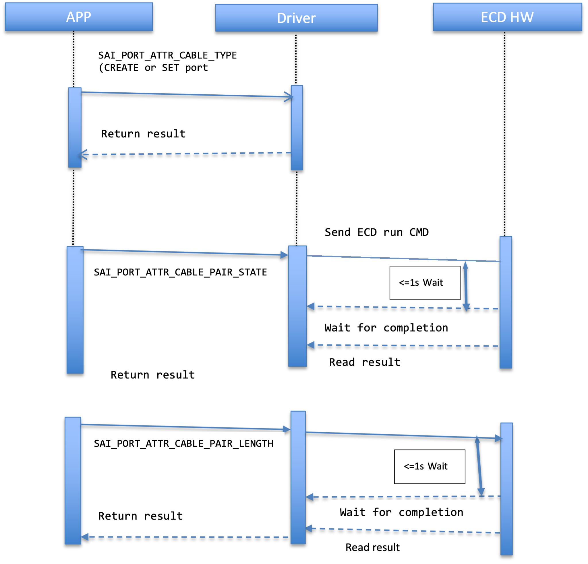

<table>
<colgroup>
<col style="width: 100%" />
</colgroup>
<tbody>
</tbody>
</table>

#Switch Abstraction Interface Change Proposal

<table>
<colgroup>
<col style="width: 16%" />
<col style="width: 83%" />
</colgroup>
<thead>
<tr class="header">
<th><strong>Title</strong></th>
<th><strong>Cable Diagnostics Proposal</strong></th>
</tr>
</thead>
<tbody>
<tr class="odd">
<td><strong>Authors</strong></td>
<td><strong>Broadcom Inc</strong></td>
</tr>
<tr class="even">
<td><strong>Status</strong></td>
<td><strong>In Review</strong></td>
</tr>
<tr class="odd">
<td><strong>Type</strong></td>
<td><strong>Standards Track</strong></td>
</tr>
<tr class="even">
<td><strong>Created</strong></td>
<td><strong>10/06/2023</strong></td>
</tr>
<tr class="odd">
<td><strong>SAI-Version</strong></td>
<td><strong>V0.0</strong></td>
</tr>
</tbody>
</table>

- [1 Overview](#Overview)

- [2 Cable diagnostics Use Case](#UseCase)

- [3 Attribute Specification](#AttrSpec)

- [3.1 Changes in file saiport.h](#Changes)

- [4 Examples](#Examples)

- [4.1 Cable Diagnostics Usage](#Usage)

## 1 Overview

When a link is up and operating normally with adequate bit error
performance, there is no need for any diagnostic either on the
digital/analog portion of the link or on the cable connecting the link.
However, the characteristics of the problems associated with a cable
become of paramount concern when a link cannot be established or is
performing poorly.

Enhanced Cable Diagnostics (ECD) provides with intelligent
pre-processing and post-processing algorithm inside HW that can be
initiated at any time by setting specific register bits and then reading
the results.

## 2 Cable diagnostics Use Case

SAI\_PORT\_ATTR\_CABLE\_TYPE need to be set with correct cable type for created port if it is not set it takes SAI\_PORT\_CABLE\_TYPE\_UNKNOWN, it is recommended to use correct cable type for better result. Once SAI\_PORT\_ATTR\_CABLE\_PAIR\_STATE is requested it runs ECD run command in HW and returns the result after command completion. It is upto the implementation if it wants to cache other cable diagnostics attribute like SAI\_PORT\_ATTR\_CABLE\_PAIR\_LENGTH in previous ECD run and read it latter without running ECD command again.

## 3 Attribute Specification

### 3.1 Changes in file saiport.h

/\* Data Types \*/

/\*\*

\* @brief Attribute data for \#SAI\_PORT\_ATTR\_CABLE\_PAIR\_STATE

\* Copper cable pair states

\*/

typedef enum \_sai\_port\_cable\_pair\_state\_t

{

/\*\* Cable pair state is good \*/

SAI\_PORT\_CABLE\_PAIR\_STATE\_OK,

/\*\* The MDI Cable pair state open \*/

SAI\_PORT\_CABLE\_PAIR\_STATE\_OPEN,

/\*\* The MDI Cable pair state short (intra-short) \*/

SAI\_PORT\_CABLE\_PAIR\_STATE\_SHORT,

/\*\* The MDI Cable pair state is shorted with another pair
(inter-short) cross talk \*/

SAI\_PORT\_CABLE\_PAIR\_STATE\_CROSSTALK,

/\*\* Cable state unknown \*/

SAI\_PORT\_CABLE\_PAIR\_STATE\_UNKNOWN

} sai\_port\_cable\_pair\_state\_t;

/\*\*

\* @brief Attribute data for \#SAI\_PORT\_ATTR\_CABLE\_TYPE

\* Copper cable types

\*/

typedef enum \_sai\_port\_cable\_type\_t

{

/\*\* Cable type Unknown \*/

SAI\_PORT\_CABLE\_TYPE\_UNKNOWN,

/\*\* Cable type CAT5 \*/

SAI\_PORT\_CABLE\_TYPE\_CAT5,

/\*\* Cable type CAT5E \*/

SAI\_PORT\_CABLE\_TYPE\_CAT5E,

/\*\* Cable type CAT6 \*/

SAI\_PORT\_CABLE\_TYPE\_CAT6,

/\*\* Cable type CAT6A \*/

SAI\_PORT\_CABLE\_TYPE\_CAT6A,

/\*\* Cable type CAT7 \*/

SAI\_PORT\_CABLE\_TYPE\_CAT7

} sai\_port\_cable\_type\_t;

/\* Port Attribute \*/

/\*\*

\* @brief Read ethernet copper cable pair status.

\*

\* Returns pair states sequentially from list index 0 to n (n = number
of pairs - 1)

\* value of n depends on number of pairs in twisted ethernet copper
cable

\* Cable diagnostics triggers ECD once cable pair states is requested,
it is synchronous call.

\*

\* @type sai\_s32\_list\_t sai\_port\_cable\_pair\_state\_t

\* @flags READ\_ONLY

\*/

SAI\_PORT\_ATTR\_CABLE\_PAIR\_STATE,

/\*\*

\* @brief Get ethernet copper cable pair length (unit meter)

\*

\* Returns ethernet cable pair length sequentially from list index 0 to
n (n = number of pairs - 1)

\* value of n depends on number of pairs in twisted ethernet copper
cable

\* Cable diagnostics runs once cable pair length is requested, it is
synchronous call.

\*

\* @type sai\_s32\_list\_t

\* @flags READ\_ONLY

\*/

SAI\_PORT\_ATTR\_CABLE\_PAIR\_LENGTH,

/\*\*

\* @brief Configure ethernet copper cable type to check the cable status

\*

\* @type sai\_port\_cable\_type\_t

\* @flags CREATE\_AND\_SET

\* @default SAI\_PORT\_CABLE\_TYPE\_UNKNOWN

\* @validonly SAI\_PORT\_ATTR\_MEDIA\_TYPE ==
SAI\_PORT\_MEDIA\_TYPE\_COPPER

\*/

SAI\_PORT\_ATTR\_CABLE\_TYPE,

## 4 Examples

### 4.1 Cable Diagnostics Usage

i)  Cable type can be set either during port create or latter using set
    port attribute. If cable type is not set it takes default value as
    SAI\_PORT\_CABLE\_TYPE\_UNKNOWN.

sai\_attr\_set\[0\].id = SAI\_PORT\_ATTR\_CABLE\_TYPE;

sai\_attr\_set\[0\].value.s32 = SAI\_PORT\_CABLE\_TYPE\_CAT6;

.

.

ret = create\_port(&port\_id\_0, switch\_id, 2, sai\_attr\_set);

**or**

Cable type can be set latter also using set port attribute function if
port is already created with port\_id\_0.

sai\_attr\_set.id = SAI\_PORT\_ATTR\_CABLE\_TYPE;  
sai\_attr\_set.value.s32 = SAI\_PORT\_CABLE\_TYPE\_CAT6;  
set\_port\_attribute(port\_id\_0, &sai\_attr\_set);

ii)  **Cable pair status and cable length is read only attribute, can be
    called anytime.**

sai\_attr\_get.id = SAI\_PORT\_ATTR\_CABLE\_PAIR\_STATE;

ret = get\_port\_attribute(port\_id\_0, 1, &sai\_attr\_get);

sai\_attr\_get.id = SAI\_PORT\_ATTR\_CABLE\_PAIR\_LENGTH;

ret = get\_port\_attribute(port\_id\_0, 1, &sai\_attr\_get);

**Note:** Please note that cable diagnostics is debug feature it puts
chip in debug mode user needs to re-configure the mode and
auto-negotiation after cable pair status and cable length attribute is
requested to work in normal mode.
