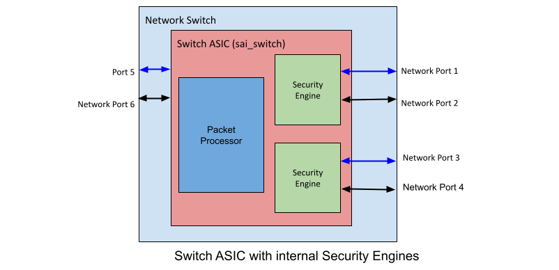

# MACSec and IPSec FIPS Compliance
-------------------------------------------------------------------------------
 Title       | MACSec and IPSec FIPS Compliance
-------------|-----------------------------------------------------------------
 Authors     | Jai Kumar (Broadcom Inc.)
 Status      | In review
 Type        | Standards track
 Created     | 2025-03-31
 SAI-Version | 1.17
-------------------------------------------------------------------------------

## 1.0  Introduction

This document describes the SAI API interaction and enhancements for triggering POST for FIPS 140-3 standard compliance to overall security level 1.


Networking Operating System (NOS) need to have cryptographic software components. "Library" which is a module providing cryptographic algorithms implies “FIPS inside” approach in the NOS. The “FIPS inside” is a way of designating one or more crypto modules with smaller boundaries, instead of one product-wise perimeter, which would encompass non-cryptographic components inside, all of them having code freeze caveat. 

This document proposes a SAI specification that will be at the MACSec/IPSec engine boundary where a single engine may be serving multiple MACSec/IPSec ports or there may be a one to one binding of the engine to the MACSec/IPSec port.

POST trigger is defined at the switch,  MACSEC, and, IPSEC engine level. This is done to support different hardware architectures where POST can be run during the switch init or it can be run during the MACSEC, IPSEC egnine init.

Existing SAI specification already supports the concept of MACSec and IPSec objects and MACSec/IPSec ports. It also supports the concept of one to one binding of engine to MACSec/IPSec port and/or engine servicing more than one ports, where engine is the MACSec/IPSec module and the port is the corresponding MACSec/IPSec port.

Bring up sequence of MACSec and IPSec engine without FIPS compliance at a object boundary is as follows

1. Switch create
2. MACSec/IPSec object create
3. MACSec/IPSec port object create
4. Once the ports are created and SA association and other attributes are set, the port is ready to rx/tx traffic.

This document introduces a trigger called as Pre-Operational Self-Test "POST" before the MACSec/IPSec engine enables the MACSec/IPSec port for forwarding traffic.

FIPS-103 compliance requires that POST is executed on each MACSec/IPSec port and only if POST completes with ‘success’, the MACSec/IPSec port must be enabled for admitting traffic.

There are two variations of MACSec/IPSec engine and ports
1. Each MACSec/IPSec serving ‘n’ number of ports (1:n)
2. Each port has its corresponding MACSec/IPSec engine (1:1)




## 2.0 Enhancements
SAI_OBJECT_TYPE_MACSEC and SAI_OBJECT_TYPE_ IPSEC already exists
SAI_MACSEC_ATTR_SUPPORTED_PORT_LIST and SAI_IPSEC_ATTR_SUPPORTED_PORT_LIST provides the list of MACSec/IPSec ports being service by an instance of MACSEC and IPSEC objects respectively. Each MACSec/IPSec port has a correspoding binding to the physical port SAI_MACSEC_PORT_ATTR_PORT_ID.
```
SAI_OBJECT_TYPE_SWITCH -> SAI_SWITCH_ATTR_MACSEC_OBJECT_LIST[x] -> SAI_MACSEC_ATTR_SUPPORTED_PORT_LIST[] -> SAI_MACSEC_PORT_ATTR_PORT_ID

SAI_OBJECT_TYPE_SWITCH -> SAI_SWITCH_ATTR_IPSEC_OBJECT_LIST[x] -> SAI_IPSEC_ATTR_SUPPORTED_PORT_LIST[] -> SAI_IPSEC_PORT_ATTR_PORT_ID
```

### 2.1 MACSec
Following sections describes the attributes for MACSec engine

#### 2.1.1 MACSec Engine
Each MACSec engine is represented by a MACSec SAI object id. Single MACSec object id can be serving one or more MACSec ports.

New attribute is introduced to trigger POST at the MACSec engine granularity.
Setting the attribute to true will start POST on all the MACSec ports associated with the MACSec engine id.

```
    /**
     * @brief Setting the value to true will start the post on all the ports serviced by this MACSEC engine
     *
     * @type bool
     * @flags CREATE_AND_SET
     * @default false
     */
    SAI_MACSEC_ATTR_ENABLE_POST,
```

Status of the POST can be queried using SAI_MACSEC_ATTR_POST_STATUS attribute.  Note that status reflects the aggregate status of all the ports services by this MACSec object id. Even if a single MACSec port fails the POST, status of the MACSec object will be returned as SAI_MACSEC_POST_STATUS_FAIL.
Subsequently NOS has to query individual MACSec ports serviced by the MACSec object id to figure out which MACSec port has failed the POST. This approach works for both, one engine to one port and one engine to many ports, kinds of MACSec engines.

```
    /**
     * @brief MACSEC POST status
     * Attribute to query the status of POST for a MACSEC engine
     *
     * @type sai_macsec_post_status_t
     * @flags READ_ONLY
     */
    SAI_MACSEC_ATTR_POST_STATUS,
```
Following POST status values are defined. SAI_MACSEC_POST_STATUS_IN_PROGRESS means that POST is still running and is not yet complete.
```
/**
 * @brief Attribute data for #SAI_MACSEC_ATTR_POST_STATUS,
 */
typedef enum _sai_macsec_post_status_t
{
    /** Unknown */
    SAI_MACSEC_POST_STATUS_UNKNOWN,

    /** Pass */
    SAI_MACSEC_POST_STATUS_PASS,

    /** In Progress */
    SAI_MACSEC_POST_STATUS_IN_PROGRESS,

    /** Fail */
    SAI_MACSEC_POST_STATUS_FAIL,
} sai_macsec_post_status_t;
```


#### 2.1.2 MACSec Port
New READ only attribute SAI_MACSEC_PORT_ATTR_POST_STATUS is introduced to read the status of POST for a given MACSec port.
This attribute can be read after the POST is completed for the MACSec object hosting this port.
```
/**
 * @brief Attribute data for #SAI_MACSEC_PORT_ATTR_POST_STATUS
 */
typedef enum _sai_macsec_port_post_status_t
{
    /** Unknown */
    SAI_MACSEC_PORT_POST_STATUS_UNKNOWN,

    /** Pass */
    SAI_MACSEC_PORT_POST_STATUS_PASS,

    /** Fail */
    SAI_MACSEC_PORT_POST_STATUS_FAIL,

} sai_macsec_port_post_status_t;

/**
 * @brief Attribute Id for sai_macsec_port
 */
typedef enum _sai_macsec_port_attr_t
{
    . . .

    /**
     * @brief MACSEC Port POST completion status
     *
     * Attribute to query the status of POST for a MACSEC port
     *
     * @type sai_macsec_port_post_status_t
     * @flags READ_ONLY
     */
    SAI_MACSEC_PORT_ATTR_POST_STATUS,
    
    . . .

} sai_macsec_port_attr_t;
```

#### 2.1.3 POST Completion Callback
Single aggregate callback function is provided to return the status of POST status for the entire MACSec engine. 

If the engine is servicing a single port then this callback essentially becomes a per port callback.

If the engine is servicing multiple ports then each port needs to be queried for its POST status using the READ only attribute of the port.
```
/**
 * @brief MACSEC post status notification
 *
 * @objects switch_id SAI_OBJECT_TYPE_MACSEC
 *
 * @param[in] macsec_id MACSEC Id
 * @param[in] macsec_post_status MACSEC post status
 */
typedef void (*sai_macsec_post_status_notification_fn)(
        _In_ sai_object_id_t macsec_id,
        _In_ sai_macsec_post_status_t macsec_post_status);

/**
 * @brief Attribute Id in sai_set_switch_attribute() and
 * sai_get_switch_attribute() calls.
 */
typedef enum _sai_switch_attr_t
{
    /**
     * @brief Callback for completion status of all the MACSEC ports serviced by this MACSEC engine
     *
     * Use sai_macsec_post_status_notification_fn as notification function.
     *
     * @type sai_pointer_t sai_macsec_post_status_notification_fn
     * @flags CREATE_AND_SET
     * @default NULL
     */
    SAI_SWITCH_ATTR_MACSEC_POST_STATUS_NOTIFY,

```

### 2.2 IPSec
Following sections describes the attributes for IPSec engine.
It is identical in the specification as MACSec.

#### 2.2.1 IPSec Engine
Each IPSec engine is represented by a IPSec SAI object id. Single IPSec object id can be serving one or more IPSec ports.

New attribute is introduced to trigger POST at the IPSec engine granularity.
Setting the attribute to true will start POST on all the IPSec ports associated with the IPSec engine id.
```
    /**
     * @brief Setting the value to true will start the post on all the ports serviced by this IPSEC engine
     *
     * @type bool
     * @flags CREATE_AND_SET
     * @default false
     */
    SAI_IPSEC_ATTR_ENABLE_POST,
```
Status of the POST can be queried using SAI_IPSEC_ATTR_POST_STATUS attribute.  Note that status reflects the aggregate status of all the ports services by this IPSec object id. Even if a single IPSec port fails the POST, status of the IPSec object will be returned as SAI_IPSEC_POST_STATUS_FAIL.
Subsequently NOS has to query individual IPSec ports serviced by the IPSec object id to figure out which IPSec port has failed the POST. This approach works for both, one engine to one port and one engine to many ports, kinds of IPSec engines.
```

    /**
     * @brief IPSEC POST status
     * Attribute to query the status of POST for an IPSEC engine
     *
     * @type sai_ipsec_post_status_t
     * @flags READ_ONLY
     */
    SAI_IPSEC_ATTR_POST_STATUS,
```
Following POST status values are defined. SAI_MACSEC_POST_STATUS_IN_PROGRESS means that POST is still running and is not yet complete.
```
/**
 * @brief Attribute data for #SAI_IPSEC_ATTR_POST_STATUS,
 */
typedef enum _sai_ipsec_post_status_t
{
    /** Unknown */
    SAI_IPSEC_POST_STATUS_UNKNOWN,

    /** Pass */
    SAI_IPSEC_POST_STATUS_PASS,

    /** In Progress */
    SAI_IPSEC_POST_STATUS_IN_PROGRESS,

    /** Fail */
    SAI_IPSEC_POST_STATUS_FAIL,
} sai_ipsec_post_status_t;
```

#### 2.2.2 IPSec Port
New READ only attribute SAI_IPSEC_PORT_ATTR_POST_STATUS is introduced to read the status of POST for a given IPSec port.
This attribute can be read after the POST is completed for the IPSec object hosting this port.
```
/**
 * @brief Attribute data for #SAI_IPSEC_PORT_ATTR_POST_STATUS
 */
typedef enum _sai_ipsec_port_post_status_t
{
    /** Unknown */
    SAI_IPSEC_PORT_POST_STATUS_UNKNOWN,

    /** Pass */
    SAI_IPSEC_PORT_POST_STATUS_PASS,

    /** Fail */
    SAI_IPSEC_PORT_POST_STATUS_FAIL,

} sai_ipsec_port_post_status_t;

/**
 * @brief Attribute Id for sai_ipsec_port
 */
typedef enum _sai_ipsec_port_attr_t
{ 
    . . .

    /**
     * @brief IPSEC Port POST completion status
     *
     * Attribute to query the status of POST for a IPSEC port
     *
     * @type sai_ipsec_port_post_status_t
     * @flags READ_ONLY
     */
    SAI_IPSEC_PORT_ATTR_POST_STATUS,
    . . .

} sai_ipsec_port_attr_t;

```
#### 2.2.3 Post Completion Callback

Single aggregate callback function is provided to return the status of POST status for the entire IPSec engine. 

If the engine is servicing a single port then this callback essentially becomes a per port callback.

If the engine is servicing multiple ports then each port needs to be queried for its POST status using the READ only attribute of the port.
```
/**
 * @brief IPSEC post status notification
 *
 * @objects switch_id SAI_OBJECT_TYPE_IPSEC
 *
 * @param[in] ipsec_id IPSEC Id
 * @param[in] ipsec_post_status IPSEC post status
 */
typedef void (*sai_ipsec_post_status_notification_fn)(
        _In_ sai_object_id_t ipsec_id,
        _In_ sai_ipsec_post_status_t ipsec_post_status);

/**
 * @brief Attribute Id in sai_set_switch_attribute() and
 * sai_get_switch_attribute() calls.
 */
typedef enum _sai_switch_attr_t
{
    /**
     * @brief Callback for completion status of all the IPSEC ports serviced by this IPSEC engine
     *
     * Use sai_ipsec_post_status_notification_fn as notification function.
     *
     * @type sai_pointer_t sai_ipsec_post_status_notification_fn
     * @flags CREATE_AND_SET
     * @default NULL
     */
    SAI_SWITCH_ATTR_IPSEC_POST_STATUS_NOTIFY,
```

### 2.3 Switch

POST can be trigerred at the switch level. This is done by setting the SAI_SWITCH_ATTR_MACSEC_ENABLE_POST for MACSec engine and SAI_SWITCH_ATTR_IPSEC_ENABLE_POST for IPSec engine. Setting this attribute to true will trigger POST for all the instance of MACSec/IPSec engine in hardware.

Completion status is reported by a callback as an aggregate status for the switch. Callback need to be registered for MACSec and IPSec POST status. 

New READ ONLY attributes SAI_SWITCH_ATTR_IPSEC_FIPS_COMPLIANT and SAI_SWITCH_ATTR_MACSEC_FIPS_COMPLIANT are introduced to determine if the system is FIPS compliant or not. NOS will read these attributes and if the read value is true, then will trigger the POST.

System can be queried using capability APIs to figure out if the systen support POST at the switch level or at the engine level.


```
    /**
     * @brief MACSEC POST status
     * Attribute to query the status of POST for all the MACSEC engines
     *
     * @type sai_switch_macsec_post_status_t
     * @flags READ_ONLY
     */
    SAI_SWITCH_ATTR_MACSEC_POST_STATUS,

    /**
     * @brief IPSEC POST status
     * Attribute to query the status of POST for all the IPSEC engines
     *
     * @type sai_switch_ipsec_post_status_t
     * @flags READ_ONLY
     */
    SAI_SWITCH_ATTR_IPSEC_POST_STATUS,

    /**
     * @brief Setting the value to true will start the post on all MACSEC engines
     *
     * @type bool
     * @flags CREATE_AND_SET
     * @default false
     */
    SAI_SWITCH_ATTR_MACSEC_ENABLE_POST,
    
    /**
     * @brief Setting the value to true will start the post on all IPSEC engines
     *
     * @type bool
     * @flags CREATE_AND_SET
     * @default false
     */
    SAI_SWITCH_ATTR_IPSEC_ENABLE_POST,

    /**
     * @brief This attribute will return true if the IPSEC system is FIPS compliant
     *
     * @type bool
     * @flags READ_ONLY
     */
    SAI_SWITCH_ATTR_IPSEC_FIPS_COMPLIANT,

    /**
     * @brief This attribute will return true if the MACSEC system is FIPS compliant
     *
     * @type bool
     * @flags READ_ONLY
     */
    SAI_SWITCH_ATTR_MACSEC_FIPS_COMPLIANT,

    /**
     * @brief Callback for completion status of all the MACSEC engines on the switch
     *
     * Use sai_switch_macsec_post_status_notification_fn as notification function.
     *
     * @type sai_pointer_t sai_switch_macsec_post_status_notification_fn
     * @flags CREATE_AND_SET
     * @default NULL
     */
    SAI_SWITCH_ATTR_SWITCH_MACSEC_POST_STATUS_NOTIFY,

    /**
     * @brief Callback for completion status of all the IPSEC engines on the switch
     *
     * Use sai_switch_ipsec_post_status_notification_fn as notification function.
     *
     * @type sai_pointer_t sai_switch_ipsec_post_status_notification_fn
     * @flags CREATE_AND_SET
     * @default NULL
     */
    SAI_SWITCH_ATTR_SWITCH_IPSEC_POST_STATUS_NOTIFY,
```
### 3.0 Capability Query
Switch can be queried to find out if the system is IPSec and/or MACSec compliant. This is done using simple GET APIs for attributes SAI_SWITCH_ATTR_IPSEC_FIPS_COMPLIANT and SAI_SWITCH_ATTR_MACSEC_FIPS_COMPLIANT.

Query API is used to determine if POST is supported at switch level or engine level granuarity.
```
    sai_status_t status = SAI_STATUS_SUCCESS;
    sai_attr_capability_t post_capability={0}; 

    // Query if MACSec POST is supported at Switch level
    status = sai_query_attribute_capability(gSwitchId, SAI_OBJECT_TYPE_SWITCH, 
    SAI_SWITCH_ATTR_MACSEC_ENABLE_POST, &post_capability);
    
    // Query if IPSec POST is supported at Switch level
    status = sai_query_attribute_capability(gSwitchId, SAI_OBJECT_TYPE_SWITCH, 
    SAI_SWITCH_ATTR_IPSEC_ENABLE_POST, &post_capability);
    
    // Query if MACSec POST is supported at engine level
    status = sai_query_attribute_capability(gSwitchId, SAI_OBJECT_TYPE_MACSEC, 
    SAI_MACSEC_ATTR_ENABLE_POST, &post_capability);
    
    // Query if IPSec POST is supported at engine level
    status = sai_query_attribute_capability(gSwitchId, SAI_OBJECT_TYPE_IPSEC, 
    SAI_IPSEC_ATTR_ENABLE_POST, &post_capability);
```
### 3.0 Example Workflow
Following steps are completed before enabling POST on the MACSec engine.

**Step 1:** 
Switch create is complete and POST completion callback registraton SAI_SWITCH_ATTR_MACSEC_POST_STATUS_NOTIFY is done.
GET API is called to find out if system is FIPS compliant.
Query API us called to find out if POST is supported at switch or engine level. Subsequent steps are for engine level POST.

**Step 2: **
MACSec Object creation is complete

**Step 3: ** 
Trigger POST by setting the attribute to true.

```
 attrs.clear();

 sai_object_id_t macsec_obj;

 attr.id = SAI_MACSEC_ATTR_ENABLE_POST;
 attr.value.bool = true;
 attrs.push_back(attr);

 sai_macsec_api->create_macsec(
     &macsec_obj,
     switch_id,
     attrs.size(),
     attrs.data());
```

**Step 4: ** 
Once the POST is completed on all the ports hosted by the MACSec engine, registered post macsec callback will be called by the SAI adapter.
If the status is SAI_MACSEC_POST_STATUS_FAIL, NOS MUST read the post status of all the ports hosted by the engine to find out which port POST has failed.
```
for all macsec_port_obj in macsec_obj->SAI_MACSEC_ATTR_SUPPORTED_PORT_LIST:
   read(macsec_port_obj->SAI_MACSEC_PORT_ATTR_POST_STATUS)
```
**Step 5: **
Set the POST enable flag in the macsec object to false. This is mainly for the hw where POST can be triggered runtime after the initialization.
```
 attrs.clear();

 sai_object_id_t macsec_obj;

 attr.id = SAI_MACSEC_ATTR_ENABLE_POST;
 attr.value.bool = false;
 attrs.push_back(attr);

 sai_macsec_api->create_macsec(
     &macsec_obj,
     switch_id,
     attrs.size(),
     attrs.data());
```
 