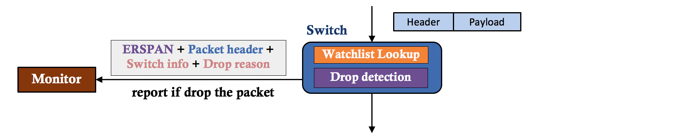

SAI Advanced Network Telemetry API Proposal
-------------------------------------------------------------------------------
 Title       | Advanced Network Telemetry API Proposal
-------------|-----------------------------------------------------------------
 Authors     | Barefoot Networks
 Status      | Draft
 Type        | Standards track
 Created     | 06/18/2017
 SAI-Version | XXX
 
-------------------------------------------------------------------------------

# Overview #

This draft describes the API proposal to enable advanced telemetry capabilities in a network device. The main goal of this advanced telemetry proposal is to achieve per-packet network visibility with low overhead. The network device should be able to inspect and take actions on each individual data packet.

## Telemetry data plane workflow ##

__Figure 1: Telemetry data plane workflow__

Figure 1 describes the telemetry data plane functionality. The telemetry module inspects every data packet without interfering with normal data forwarding pipeline. A telemetry watchlist table specifies the flows to monitor. It performs ternary match on the packet headers, and provides telemetry action parameters. Packets belonging to the specified flow spaces will be processed by the the event detection logic. If a triggering event is detected, the switch will generate a report message to the monitor. The report message includes packet header and switch metadata associated with the packet (e.g., timestamp, ingress/egress ports, queue latency).

## In-band Network Telemetry ##

__Figure 2: In-band Network Telemetry__

Figure 2 shows an example workflow of In-band Network Telemety (INT). Switches along the route path add switch metadata into the packet header, based on the “telemetry instructions” carried in the INT header.

Each switch may play the role of __endpoint__ or __transit__ for INT packets. INT endpoint acts both as __INT source__ and __INT sink__. As INT source it initiates INT operation by inserting INT header into a packet and thereby instructing other network devices along the routing path to add desired telemetry information into the packet. As INT sink device it extracts the INT information from the packet and exports it using a mirror session to the monitor.

An INT transit device is a device along the path of a packet from source to sink. INT transit device adds its own INT information to the packet as requested by an INT source.

## Packet Postcards ##

__Figure 3: Postcard Telemetry__

Figure 3 shows an example workflow of Packet Postcards, an alternative telemetry approach. Each switch makes its own decision and reports packets info (aka “postcards”) to the monitor. Unlike INT, a Postcard switch never modifies the original data packets. 

## Mirror on Drop ##

__Figure 4: Mirror on Drop__

Figure 4 depicts the mirror on drop capability. Switches mirror packets dropped by the ingress pipe, egress pipe or queueing buffer to the monitor for network diagnosis. The report messages include packet header, switch metadata, and drop reason.

# Specification #

This section describes the advanced telemetry API proposal. (Changes to saitypes.h are not included yet)

## New Header saitelemetry.h ##

### Data Structures and Enumerations ###

#### Telemetry Attribute ####
~~~cpp
/**
 * @brief Telemetry feature types
 * INT_EP, INT_TRANSIT, POSTCARD are mutually exclusive
 * MOD can coexit with any one of the three above
 */
typedef enum _sai_telemetry_type_t {
    /** INT source and sink */
    SAI_TELEMETRY_TYPE_INT_EP,
    /** INT transit */
    SAI_TELEMETRY_TYPE_INT_TRANSIT,
    /** Postcard */
    SAI_TELEMETRY_TYPE_POSTCARD,
    /** Mirror on Drop */
    SAI_TELEMETRY_TYPE_MOD,
} sai_telemetry_type_t;

/**
 * @brief Telemetry attributes
 */
typedef enum _sai_telemetry_attr_t {
    /** List of telemetry features to enable */
    SAI_TELEMETRY_ATTR_TYPE_LIST,
    /** Globally unique switch ID */
    SAI_TELEMETRY_ATTR_SWITCH_ID,
    /** List of ERSPAN mirror sessions for report sending*/
    SAI_TELEMETRY_ATTR_MIRROR_LIST,

    /** Reserved DSCP value for INT */
    SAI_TELEMETRY_ATTR_INT_DSCP,
    /** INT sink downstream ports */
    SAI_TELEMETRY_ATTR_INT_SINK_PORT_LIST,
} sai_telemetry_attr_t;
~~~

#### Telemetry Watchlist ####
~~~cpp
/** Telemetry watchlist match field enum */
typedef enum _sai_telemetry_watchlist_entry_attr_t {
    /** Telemetry type, each type has its own watchlist table */
    SAI_TWL_ENTRY_ATTR_TELEMETRY_TYPE,
    /** Entry priority, only compared within the same telemetry type */
    SAI_TWL_ENTRY_ATTR_PRIORITY,

    /** Ethernet type */
    SAI_TWL_ENTRY_ATTR_FIELD_ETHER_TYPE,
    /** IPv4 source address */
    SAI_TWL_ENTRY_ATTR_FIELD_IPV4_SRC,
    /** IPv4 destination address */
    SAI_TWL_ENTRY_ATTR_FIELD_IPV4_DST,
    /** IP protocol */
    SAI_TWL_ENTRY_ATTR_FIELD_IP_PROTO,
    /** L4 source port UDP/TCP */
    SAI_TWL_ENTRY_ATTR_FIELD_L4_PORT_SRC,
    /** L4 destination port UDP/TCP */
    SAI_TWL_ENTRY_ATTR_FIELD_L4_PORT_DST,
    /** Tunnel vni */
    SAI_TWL_ENTRY_ATTR_FIELD_TUNNEL_VNI,
    /** Ethernet type */
    SAI_TWL_ENTRY_ATTR_FIELD_INNER_ETHER_TYPE,
    /** inner IPv4 Source address */
    SAI_TWL_ENTRY_ATTR_FIELD_INNER_IPV4_SRC,
    /** inner IPv4 Destination address */
    SAI_TWL_ENTRY_ATTR_FIELD_INNER_IPV4_DST,
    /** inner IP Protocol */
    SAI_TWL_ENTRY_ATTR_FIELD_INNER_IP_PROTO,
    /** L4 source port UDP/TCP */
    SAI_TWL_ENTRY_ATTR_FIELD_INNER_L4_PORT_SRC,
    /** L4 destination port UDP/TCP */
    SAI_TWL_ENTRY_ATTR_FIELD_INNER_L4_PORT_DST,

    /** Watch or not */
    SAI_TWL_ENTRY_ATTR_ACTION_WATCH,
    /** Report every mached packet (no triggering event detection) */
    SAI_TWL_ENTRY_ATTR_ACTION_REPORT_ALL,
    /** INT config session ID */
    SAI_TWL_ENTRY_ATTR_ACTION_INT_CONFIG_SESSION_ID,
} sai_telemetry_watchlist_entry_attr_t;
~~~

#### Telemetry report triggering event detection ####
~~~cpp
/** Queue alert thresholds */
typedef struct _sai_telemetry_queue_alert_t {
    /** egress port */
    uint16_t port;
    /** queue id */
    uint16_t queue;
    uint32_t depth_threshold;
    uint32_t latency_threshold;
} sai_telemetry_queue_alert_t;

/** Report trigger attributes */
typedef enum _sai_telemetry_report_trigger_attr_t {
    /** Queue depth and latency threshold */
    SAI_TELEMETRY_TRIGGER_ATTR_QUEUE_ALERT,
    /** Flow state clear cycle */
    SAI_TELEMETRY_TRIGGER_ATTR_FLOW_STATE_CLEAR_CYCLE,
    /** Latency sensitivity for flow state change detection */
    SAI_TELEMETRY_TRIGGER_ATTR_LATENCY_SENSITIVITY,
} sai_telemetry_report_trigger_attr_t;
~~~

#### INT-specific attributues ####
~~~cpp
/** INT instructions */
typedef enum _sai_telemetry_int_instruction_t {
    /** Switch ID */
    SAI_TELEMETRY_INT_INST_SWITCH_ID,
    /** Ingress and egress ports */
    SAI_TELEMETRY_INT_INST_SWITCH_PORTS,
    /** Timestamp at ingress */
    SAI_TELEMETRY_INT_INST_INGRESS_TIMESTAMP,
    /** Timestamp at egress */
    SAI_TELEMETRY_INT_INST_EGRESS_TIMESTAMP,
    /** Queue ID and queue depth */
    SAI_TELEMETRY_INT_INST_QUEUE_INFO,
} sai_telemetry_int_instruction_t;

/** INT session for endpoint switch */
typedef enum _sai_telemetry_int_session_attr_t {
    /**< INT session ID */
    SAI_TELEMETRY_INT_CONFIG_SESSION_ATTR_SESSION_ID
    /** INT max hop count */
    SAI_TELEMETRY_INT_CONFIG_SESSION_ATTR_MAX_HOP_COUNT,
    /** INT instruction list*/
    SAI_TELEMETRY_INT_CONFIG_SESSION_ATTR_INT_INST_LIST,
} sai_telemetry_int_config_session_attr_t;
~~~

### SAI API ###
~~~cpp
typedef sai_status_t (*sai_telemetry_create_fn)(
        _Out_ sai_object_id_t *telemetry_obj,
        _In_  uint32_t attr_count,
        _In_  const sai_attribute_t *attr_list);

typedef sai_status_t (*sai_telemetry_remove_fn)(
        _In_ sai_object_id_t *telemetry_obj);

typedef sai_status_t (*sai_telemetry_attr_get_fn)(
        _In_    sai_object_id_t telemetry_obj,
        _In_    uint32_t attr_count,
        _Inout_ const sai_attribute_t *attr_list);

typedef sai_status_t (*sai_telemetry_attr_set_fn)(
        _In_  sai_object_id_t telemetry_obj,
        _In_  uint32_t attr_count,
        _In_  const sai_attribute_t *attr_list);

typedef sai_status_t (*sai_telemetry_watchlist_entry_create_fn)(
        _Out_ sai_object_id_t *telemetry_watchlist_entry_id,
        _In_  uint32_t attr_count,
        _In_  const sai_attribute_t *attr_list);

typedef sai_status_t (*sai_telemetry_watchlist_entry_remove_fn)(
        _In_ sai_object_id_t *telemetry_watchlist_entry_id);

typedef sai_status_t (*sai_telemetry_watchlist_entry_attr_get_fn)(
        _In_    sai_object_id_t telemetry_watchlist_entry_id,
        _In_    uint32_t attr_count,
        _Inout_ const sai_attribute_t *attr_list);

typedef sai_status_t (*sai_telemetry_watchlist_entry_attr_set_fn)(
        _In_  sai_object_id_t telemetry_watchlist_entry_id,
        _In_  uint32_t attr_count,
        _In_  const sai_attribute_t *attr_list);

typedef sai_status_t (*sai_telemetry_report_trigger_create_fn)(
        _Out_ sai_object_id_t *telemetry_report_trigger_id,
        _In_  uint32_t attr_count,
        _In_  const sai_attribute_t *attr_list);

typedef sai_status_t (*sai_telemetry_report_trigger_remove_fn)(
        _In_ sai_object_id_t *telemetry_report_trigger_id);

typedef sai_status_t (*sai_telemetry_report_trigger_attr_get_fn)(
        _In_    sai_object_id_t telemetry_report_trigger_id,
        _In_    uint32_t attr_count,
        _Inout_ const sai_attribute_t *attr_list);

typedef sai_status_t (*sai_telemetry_report_trigger_attr_set_fn)(
        _In_  sai_object_id_t telemetry_report_trigger_id,
        _In_  uint32_t attr_count,
        _In_  const sai_attribute_t *attr_list);

typedef sai_status_t (*sai_telemetry_int_session_create_fn)(
        _Out_ sai_object_id_t *telemetry_int_session_id,
        _In_  uint32_t attr_count,
        _In_  const sai_attribute_t *attr_list);

typedef sai_status_t (*sai_telemetry_int_session_remove_fn)(
        _In_ sai_object_id_t *telemetry_int_session_id);

typedef sai_status_t (*sai_telemetry_int_session_attr_get_fn)(
        _In_    sai_object_id_t telemetry_int_session_id,
        _In_    uint32_t attr_count,
        _Inout_ const sai_attribute_t *attr_list);

typedef sai_status_t (*sai_telemetry_int_session_attr_set_fn)(
        _In_  sai_object_id_t telemetry_int_session_id,
        _In_  uint32_t attr_count,
        _In_  const sai_attribute_t *attr_list);

typedef sai_status_t (*sai_telemetry_int_sink_port_create_fn)(
        _Out_ sai_object_id_t *telemetry_int_sink_port_id,
        _In_  uint32_t attr_count,
        _In_  const sai_attribute_t *attr_list);

typedef sai_status_t (*sai_telemetry_int_sink_port_remove_fn)(
        _In_ sai_object_id_t *telemetry_int_sink_port_id);

typedef struct _sai_telemetry_api_t {
    sai_telemetry_create_fn     telemetry_create;
    sai_telemetry_remove_fn     telemetry_remove;
    sai_telemetry_attr_get_fn   telemetry_attr_get;
    sai_telemetry_attr_set_fn   telemetry_attr_set;

    sai_telemetry_watchlist_entry_create_fn   telemetry_watchlist_entry_create;
    sai_telemetry_watchlist_entry_remove_fn   telemetry_watchlist_entry_remove;
    sai_telemetry_watchlist_entry_attr_get_fn telemetry_watchlist_entry_attr_get;
    sai_telemetry_watchlist_entry_attr_set_fn telemetry_watchlist_entry_attr_set;

    sai_telemetry_report_trigger_create_fn    telemetry_report_trigger_create;
    sai_telemetry_report_trigger_remove_fn    telemetry_report_trigger_remove;
    sai_telemetry_report_trigger_attr_get_fn  telemetry_report_trigger_attr_get;
    sai_telemetry_report_trigger_attr_set_fn  telemetry_report_trigger_attr_set;

    sai_telemetry_int_session_create_fn     telemetry_int_session_create;
    sai_telemetry_int_session_remove_fn     telemetry_int_session_remove;
    sai_telemetry_int_session_attr_get_fn   telemetry_int_session_attr_get;
    sai_telemetry_int_session_attr_set_fn   telemetry_int_session_attr_set;

    sai_telemetry_int_sink_port_create_fn   telemetry_int_sink_port_create;
    sai_telemetry_int_sink_port_remove_fn   telemetry_int_sink_port_remove;
} sai_telemetry_api_t;
~~~

## Example ##
Example of configuring __INT Endpoint__ and __Mirror on Drop__ on a switch

### Enable Telemetry Functionality
~~~cpp
sai_telemetry_query(SAI_API_TELEMETRY, &sai_telemetry_api);
sai_attribute_t telemetry_attr[5];
sai_object_id_t telemetry_obj;
sai_telemetry_type_t telemetry_type_list[2];

/** Enable INT and MoD */
telemetry_type_list[0] = SAI_TELEMETRY_TYPE_INT_EP;
telemetry_type_list[1] = SAI_TELEMETRY_TYPE_MOD;
telemetry_attr[0].id = SAI_TELEMETRY_ATTR_TYPE_LIST;
telemetry_attr[0].value.telemetry_list.type_count = 2;
telemetry_attr[0].value.telemetry_list.type_list = telemetry_type_list;

/** Configure switch ID */
telemetry_attr[1].id = SAI_TELEMETRY_ATTR_SWITCH_ID;
telemetry_attr[1].value.u32 = 0xfff222aa;

/** Add telemetry mirror session */
sai_telemetry_mirror_id_t telemetry_mirror_list[3];
telemetry_mirror_list[0] = 0;
telemetry_mirror_list[1] = 2;
telemetry_mirror_list[2] = 7;
telemetry_attr[2].id = SAI_TELEMETRY_ATTR_MIRROR_LIST;
telemetry_attr[2].value.telemetry_list.mirror_count = 3;
telemetry_attr[2].value.telemetry_list.mirror_list = telemetry_mirror_list;

/** Configure DSCP value for INT over L4 */
telemetry_attr[3].id = SAI_TELEMETRY_ATTR_INT_DSCP;
telemetry_attr[3].value.telemetry_int_dscp.value = 0x5c;
telemetry_attr[3].value.telemetry_int_dscp.mask = 0xfc;

/** Specify server-facing downstream ports for INT sink */
sai_telemetry_port_id_t telemetry_port_list[4];
telemetry_port_list[0] = 0;
telemetry_port_list[1] = 1;
telemetry_port_list[2] = 2;
telemetry_port_list[3] = 3;
telemetry_attr[4].id = SAI_TELEMETRY_ATTR_INT_SINK_PORT_LIST;
telemetry_attr[4].value.telemetry_int_list.sink_port_count = 3;
telemetry_attr[4].value.telemetry_int_list.sink_port_list = telemetry_port_list;

sai_telemetry_api->telemetry_create(&telemetry_obj, 5, telemetry_attr);
~~~

### Configure Report Trigger ###
~~~cpp
/** Configure flow-based report triggering */
sai_attribute_t telemetry_trigger_attr[2];
sai_object_id_t telemetry_stateful_trigger_obj;
telemetry_trigger_attr[0].id = SAI_TELEMETRY_TRIGGER_ATTR_FLOW_STATE_CLEAR_CYCLE;
telemetry_trigger_attr[0].value.u32 = 1;
telemetry_trigger_attr[1].id = SAI_TELEMETRY_TRIGGER_ATTR_LATENCY_SENSITIVITY;
telemetry_trigger_attr[1].value.u16 = 15;
sai_telemetry_api->telemetry_report_trigger_create(
          &telemetry_stateful_trigger_obj, 2, telemetry_trigger_attr);

/** Create a queue threshold report trigger */
sai_attribute_t telemetry_queue_attr[1];
sai_object_id_t telemetry_queue_trigger_id;
telemetry_queue_attr[0].id = SAI_TELEMETRY_TRIGGER_ATTR_QUEUE_ALERT;
telemetry_queue_attr[0].value.telemetry_queue_alert.port = 2;
telemetry_queue_attr[0].value.telemetry_queue_alert.queue = 1;
telemetry_queue_attr[0].value.telemetry_queue_alert.depth_threshold = 100;
telemetry_queue_attr[0].value.telemetry_queue_alert.latency_threshold = 1000;
sai_telemetry_api->telemetry_report_trigger_create(&telemetry_queue_trigger_id, 1, telemetry_queue_attr);
~~~

### Create INT Session ###
~~~cpp
/** Create INT confg session */
sai_attribute_t int_session_attr[3];
sai_object_id_t int_session_id;
sai_telemetry_int_instruction_t instructions[5];
instructions[0] = SAI_TELEMETRY_INT_INST_SWITCH_ID;
instructions[1] = SAI_TELEMETRY_INT_INST_SWITCH_PORTS;
instructions[2] = SAI_TELEMETRY_INT_INST_INGRESS_TIMESTAMP;
instructions[3] = SAI_TELEMETRY_INT_INST_EGRESS_TIMESTAMP;
instructions[4] = SAI_TELEMETRY_INT_INST_QUEUE_INFO;
int_session_attr[0].id = SAI_TELEMETRY_INT_CONFIG_SESSION_ATTR_INT_INST_LIST;
int_session_attr[0].value.telemetry_int_inst_list = instructions;
int_session_attr[1].id = SAI_TELEMETRY_INT_CONFIG_SESSION_ATTR_MAX_HOP_COUNT;
int_session_attr[1].value.u16 = 0x8;
int_session_attr[2].id = SAI_TELEMETRY_INT_CONFIG_SESSION_ATTR_SESSION_ID;
int_session_attr[2].value.u16 = 999;
sai_telemetry_api->telemetry_int_session_create(&int_session_id, 3, int_session_attr);
~~~

### Add Telemetry Watchlist Entry ###
~~~cpp
sai_attribute_t int_watchlist_attr[5];
sai_object_id_t int_watchlist_rule_id;
int_watchlist_attr[0].id = SAI_TWL_ENTRY_ATTR_TELEMETRY_TYPE;
int_watchlist_attr[0].value.u32 = SAI_TELEMETRY_TYPE_INT_EP;
int_watchlist_attr[1].id = SAI_TWL_ENTRY_ATTR_PRIORITY;
int_watchlist_attr[1].value.u16 = 100;
int_watchlist_attr[2].id = SAI_TWL_ENTRY_ATTR_FIELD_IP_PROTO;
int_watchlist_attr[2].value.twlfield.data.u8 = 6;
int_watchlist_attr[2].value.twlfield.mask.u8 = 0xFF;
int_watchlist_attr[3].id = SAI_TWL_ENTRY_ATTR_FIELD_L4_PORT_DST;
int_watchlist_attr[3].value.twlfield.data.u16 = 80;
int_watchlist_attr[3].value.twlfield.mask.u16 = 0xFFFF;
int_watchlist_attr[4].id = SAI_TWL_ENTRY_ATTR_ACTION_INT_CONFIG_SESSION_ID;
int_watchlist_attr[4].value.u16 = 999;
sai_telemetry_api->telemetry_watchlist_entry_create(&int_watchlist_rule_id, 5, int_watchlist_attr);

/** Add Mirror on Drop watchlist entry */
sai_attribute_t mod_watchlist_attr[3];
sai_object_id_t mod_watchlist_rule_id;
mod_watchlist_attr[0].id = SAI_TWL_ENTRY_ATTR_TELEMETRY_TYPE;
mod_watchlist_attr[0].value.u32 = SAI_TELEMETRY_TYPE_MOD;
mod_watchlist_attr[1].id = SAI_TWL_ENTRY_ATTR_PRIORITY;
mod_watchlist_attr[1].value.u16 = 100;
mod_watchlist_attr[2].id = SAI_TWL_ENTRY_ATTR_FIELD_IP_PROTO;
mod_watchlist_attr[2].value.twlfield.data.u8 = 6;
mod_watchlist_attr[2].value.twlfield.mask.u8 = 0xFF;
sai_telemetry_api->telemetry_watchlist_entry_create(&mod_watchlist_rule_id, 3, mod_watchlist_attr);
~~~