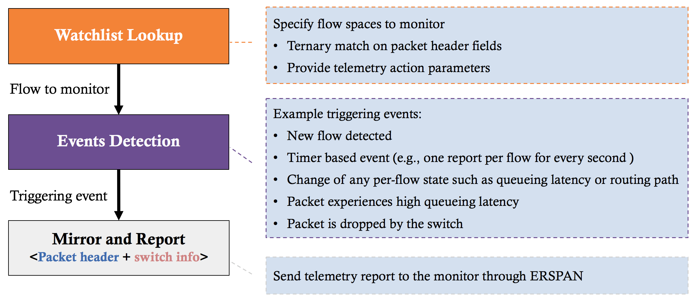
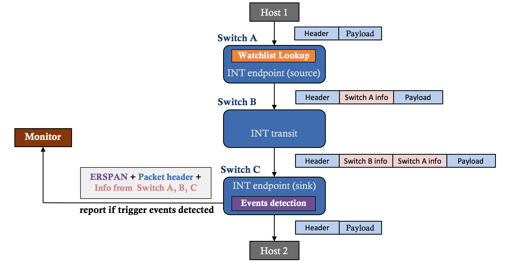
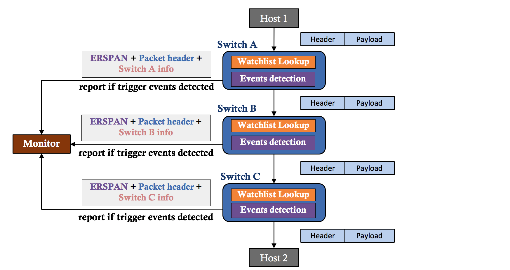
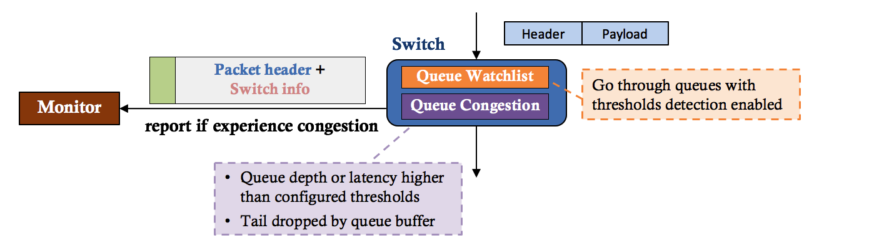

SAI Data Plane Telemetry API Proposal
-------------------------------------------------------------------------------
 Title       | Data Plane Telemetry (DTel)
-------------|-----------------------------------------------------------------
 Authors     | Barefoot Networks
 Status      | In review
 Type        | Standards track
 Created     | 06/18/2017
 Updated     | 10/10/2017
 SAI-Version | 1.x

-------------------------------------------------------------------------------

# Overview

This draft proposes an API to enable data plane telemetry (DTel) capabilities in a network device. The main goal of data-plane telemetry is to achieve per-packet network visibility with very low overheads. The network device should be able to inspect and take telemetry-actions on each individual data packet.

## Data plane telemetry workflow

__Figure 1: Data plane telemetry workflow__

Figure 1 describes the data plane telemetry (DTel) functionality at a high level. The DTel module inspects every data packet without interfering with other packet-processing logic in the switch data plane. Not all the components shown in the figure above may be located in each DTel-capable switch. For example, the watchlist component can be in one switch, and the event detection and telemetry report components can be located in another switch. A telemetry watchlist table specifies the flows to monitor. It performs ternary match on the packet headers and switch ports, and provides telemetry action parameters. Watchlist can be realized through SAI ACL, with a few new fields and actions added to ACL table and entry attributes. Packets that match the watchlist entries with telemetry actions will be processed by the event detection logic. If a triggering event is detected, the switch will generate a telemetry report to the monitor. The report message includes packet header and switch metadata associated with the packet (e.g., timestamp, ingress/egress ports, queue depth/latency).

As shown in Figure 1, data plane telemetry can track three classes of events: flow events, packet drop events, and queue congestion events. Sections below introduce data plane telemetry capabilities for different types of events monitoring: 

* __In-band Telemetry__ and __Packet Postcards__ to track flow events.
* __Drop Report__ to track packet drops.
* __Queue Report__ to track queue congestions.

## Flow Report
DTel tracks flow events through different data plane mechanisms, including In-band Telemetry (e.g., INT, iOAM) and Packet Postcard, which are described below.

### In-band Telemetry 

__Figure 2: In-band Telemetry (INT as an example)__

Figure 2 shows an example workflow of In-band Telemetry. Switches along the route path add switch metadata into the packet header based on the *telemetry instructions* carried in the telemetry header. Different In-band Telemetry mechanisms have been defined, such as [INT](http://p4.org/wp-content/uploads/fixed/INT/INT-current-spec.pdf) proposed by [P4.org](https://p4.org/p4/inband-network-telemetry/), and IETF [iOAM](https://github.com/CiscoDevNet/iOAM). INT and iOAM share the major SAI components, including ACL-based watchlist, event detection, telemetry report. This proposal focuses on INT, while can be easily extended to support iOAM.

Each switch may play the role of __endpoint__ or __transit__ for INT or iOAM enabled packets. Endpoint acts both as __source__ and __sink__. Source initiates INT or iOAM operations by inserting a telemetry header into a packet and thereby instructing down-stream network devices along the routing path to add desired telemetry information into the packet. Sink extracts the telemetry information from the incoming packets and sends telemetry reports to the monitor if triggering flow events are detected. Transit is a device along the path of a packet from a source to a sink. Transit device adds its own telemetry information to the packet as requested by the source.

### Packet Postcard

__Figure 3: Packet Postcard__

Figure 3 shows an example workflow of packet Postcards. Each switch makes its own decision and reports packets info (aka “postcards”) to the monitor individually. Triggering events are detected based on the switch local information such as ingress/egress ports and queueing latency for the monitored flow. Unlike In-band Telemetry, a Postcard switch never modifies the original data packets. In-band Telemetry and Packet Postcard achieve the same flow monitoring capabilities with different data plane approaches.

## Drop Report

__Figure 4: Drop Report__

Figure 4 depicts the Drop Report capability. Switches send packets that are dropped by the ingress pipe, the egress pipe or the switching fabric (e.g., shared buffer) to the monitor for network diagnosis. Each report message includes the original packet header, switch metadata, and a drop reason.

## Queue Report

__Figure 5: Queue Report__

Figure 5 shows the queue reports functionality. Switches can be configured to report packets that experience congestion or buffer tail drops at specified queues. Congestion is detected by queue depth or latency thresholds, which are configured separately for each individual queue. 

DTel Queue Report is complementary to TAM snapshot. While TAM snapshot reports queue statistics data in bulk on threshold breach, DTel Queue Report can send reports for every packet on congestion start, so that the network monitor can have per-packet full visibility on how the queue is built up.

# Specification

This section describes the data plane telemetry API proposal. 

## Changes to `saiswitch.h` for switch DTel attributes
~~~cpp
typedef enum _sai_switch_attr_t
{
    ......
    /**
     * @brief DTel INT endpoint
     *
     * @type bool
     * @flags CREATE_AND_SET
     * @default False
     */
    SAI_SWITCH_ATTR_DTEL_INT_ENDPOINT_ENABLE,

    /**
     * @brief DTel INT transit
     *
     * @type bool
     * @flags CREATE_AND_SET
     * @default False
     */
    SAI_SWITCH_ATTR_DTEL_INT_TRANSIT_ENABLE,
    
    /**
     * @brief Packet postcard
     *
     * @type bool
     * @flags CREATE_AND_SET
     * @default False
     */
    SAI_SWITCH_ATTR_DTEL_POSTCARD_ENABLE,

    /**
     * @brief Drop Report
     *
     * @type bool
     * @flags CREATE_AND_SET
     * @default False
     */
    SAI_SWITCH_ATTR_DTEL_DROP_REPORT_ENABLE,

    /**
     * @brief Queue Report
     *
     * @type bool
     * @flags CREATE_AND_SET
     * @default False
     */
    SAI_SWITCH_ATTR_DTEL_QUEUE_REPORT_ENABLE,

    /**
     * @brief Globally unique switch ID
     *
     * @type sai_uint32_t
     * @flags CREATE_AND_SET
     */
    SAI_SWITCH_ATTR_DTEL_SWITCH_ID,

    /**
     * @brief DTel flow state clear cycle
     *
     * @type sai_uint16_t
     * @flags CREATE_AND_SET
     * @default 0
     */
    SAI_SWITCH_ATTR_DTEL_FLOW_STATE_CLEAR_CYCLE,

    /**
     * @brief Latency sensitivity for flow state change detection
     *
     * @type sai_uint8_t
     * @flags CREATE_AND_SET
     */
    SAI_SWITCH_ATTR_DTEL_LATENCY_SENSITIVITY,

    /**
     * @brief DTel sink ports
     *
     * @type sai_object_list_t
     * @flags CREATE_AND_SET
     * @objects SAI_OBJECT_TYPE_PORT
     */
    SAI_SWITCH_ATTR_DTEL_SINK_PORT_LIST,

    /**
     * @brief Reserved DSCP value for INT over L4
     *
     * @type sai_ternary_field_t
     * @flags CREATE_AND_SET
     */
    SAI_SWITCH_ATTR_DTEL_INT_L4_DSCP,

} sai_switch_attr_t;
~~~

## Changes to `saiacl.h` for DTel flow and drop watchlists
~~~cpp
/**
 * @brief DTel flow operation
 */
typedef enum _sai_acl_dtel_flow_op_t
{
    /** No operation */
    SAI_ACL_DTEL_FLOW_OP_NOP,

    /** Packet Postcard */
    SAI_ACL_DTEL_FLOW_OP_POSTCARD,

    /** In-band Network Telemetry */
    SAI_ACL_DTEL_FLOW_OP_INT,

    /** In-band OAM */
    SAI_ACL_DTEL_FLOW_OP_IOAM,

} sai_acl_dtel_flow_op_t;

typedef enum _sai_acl_action_type_t
{
    ......
    /** DTel flow operation */
    SAI_ACL_ACTION_TYPE_DTEL_FLOW_OP,

    /** INT configuration session */
    SAI_ACL_ACTION_TYPE_DTEL_INT_SESSION,

    /** Enable drop report */
    SAI_ACL_ACTION_TYPE_DTEL_DROP_REPORT_ENABLE,

    /** Telemetry flow sample percent within matched flow space */
    SAI_ACL_ACTION_TYPE_DTEL_FLOW_SAMPLE_PERCENT,

    /** Report every packet for the matched flow */
    SAI_ACL_ACTION_TYPE_DTEL_REPORT_ALL_PACKETS,

} sai_acl_action_type_t;

typedef enum _sai_acl_table_attr_t
{
    ......
    /**
     * @brief Tunnel VNI
     *
     * @type bool
     * @flags CREATE_ONLY
     * @default false
     */
    SAI_ACL_TABLE_ATTR_FIELD_TUNNEL_VNI,

    /**
     * @brief Inner EtherType
     *
     * @type bool
     * @flags CREATE_ONLY
     * @default false
     */
    SAI_ACL_TABLE_ATTR_FIELD_INNER_ETHER_TYPE,

    /**
     * @brief Inner IP Protocol
     *
     * @type bool
     * @flags CREATE_ONLY
     * @default false
     */
    SAI_ACL_TABLE_ATTR_FIELD_INNER_IP_PROTOCOL,

    /**
     * @brief Inner L4 Src Port
     *
     * @type bool
     * @flags CREATE_ONLY
     * @default false
     */
    SAI_ACL_TABLE_ATTR_FIELD_INNER_L4_SRC_PORT,

    /**
     * @brief Inner L4 Dst Port
     *
     * @type bool
     * @flags CREATE_ONLY
     * @default false
     */
    SAI_ACL_TABLE_ATTR_FIELD_INNER_L4_DST_PORT,

} sai_acl_table_attr_t;

typedef enum _sai_acl_entry_attr_t
{
    ......
    /**
     * @brief Tunnel VNI
     *
     * @type sai_acl_field_data_t sai_uint32_t
     * @flags CREATE_AND_SET
     */
    SAI_ACL_ENTRY_ATTR_FIELD_TUNNEL_VNI,

    /**
     * @brief Inner EtherType
     *
     * @type sai_acl_field_data_t sai_uint16_t
     * @flags CREATE_AND_SET
     */
    SAI_ACL_ENTRY_ATTR_FIELD_INNER_ETHER_TYPE,

    /**
     * @brief Inner IP Protocol
     *
     * @type sai_acl_field_data_t sai_uint8_t
     * @flags CREATE_AND_SET
     */
    SAI_ACL_ENTRY_ATTR_FIELD_INNER_IP_PROTOCOL,

    /**
     * @brief Inner L4 Src Port
     *
     * @type sai_acl_field_data_t sai_uint16_t
     * @flags CREATE_AND_SET
     */
    SAI_ACL_ENTRY_ATTR_FIELD_INNER_L4_SRC_PORT,

    /**
     * @brief Inner L4 Dst Port
     *
     * @type sai_acl_field_data_t sai_uint16_t
     * @flags CREATE_AND_SET
     */
    SAI_ACL_ENTRY_ATTR_FIELD_INNER_L4_DST_PORT,

    /**
     * @brief DTel flow operation
     *
     * @type sai_acl_dtel_flow_op_t
     * @flags CREATE_AND_SET
     * @default SAI_ACL_DTEL_FLOW_OP_NOP
     */
    SAI_ACL_ENTRY_ATTR_ACTION_DTEL_FLOW_OP,

    /**
     * @brief INT session ID
     *
     * @type sai_object_id_t
     * @flags CREATE_AND_SET
     * @objects SAI_OBJECT_TYPE_DTEL_INT_SESSION
     */
    SAI_ACL_ENTRY_ATTR_ACTION_DTEL_INT_SESSION,

    /**
     * @brief Enable drop report
     *
     * @type bool
     * @flags CREATE_AND_SET
     * @default False
     */
    SAI_ACL_ENTRY_ATTR_ACTION_DTEL_DROP_REPORT_ENABLE,

    /**
     * @brief Telemetry flow sample percent within matched flow space
     *
     * @type sai_uint8_t
     * @flags CREATE_AND_SET
     * @default 100
     */
    SAI_ACL_ENTRY_ATTR_ACTION_DTEL_FLOW_SAMPLE_PERCENT,

    /**
     * @brief Report every packet for the matched flow
     *
     * @type bool
     * @flags CREATE_AND_SET
     * @default False
     */
    SAI_ACL_ENTRY_ATTR_ACTION_DTEL_REPORT_ALL_PACKETS,

} sai_acl_entry_attr_t;
~~~

## New Header `saidtel.h`

### Data Structures and Enumerations

~~~cpp
/**
 * @brief Queue report trigger attributes
 */
typedef enum _sai_dtel_queue_report_attr_t
{
    /**
     * @brief Queue object ID
     *
     * @type sai_object_id_t
     * @flags MANDATORY_ON_CREATE | CREATE_ONLY
     * @objects SAI_OBJECT_TYPE_QUEUE
     */
    SAI_DTEL_QUEUE_REPORT_ATTR_QUEUE_ID,

    /**
     * @brief Queue depth threshold in byte
     *
     * @type sai_uint32_t
     * @flags CREATE_AND_SET
     * @default UINT32_MAX
     */
    SAI_DTEL_QUEUE_REPORT_ATTR_DEPTH_THRESHOLD,

    /**
     * @brief Queue latency threshold in nanosecond
     *
     * @type sai_uint32_t
     * @flags CREATE_AND_SET
     * @default UINT32_MAX
     */
    SAI_DTEL_QUEUE_REPORT_ATTR_LATENCY_THRESHOLD,

    /**
     * @brief Maximum number of continuous reports after threshold breach
     *
     * @type sai_uint32_t
     * @flags CREATE_AND_SET
     * @default 1000
     */
    SAI_DTEL_QUEUE_REPORT_ATTR_BREACH_QUOTA,

    /**
     * @brief Send report for packets dropped by the queue
     *
     * @type bool
     * @flags CREATE_AND_SET
     * @default False
     */
    SAI_DTEL_QUEUE_REPORT_ATTR_TAIL_DROP,

} sai_dtel_queue_report_attr_t;

/**
 * @brief INT session attributes
 */
typedef enum _sai_dtel_int_session_attr_t
{
    /**
     * @brief INT max hop count
     *
     * The maximum number of hops that are allowed to
     * add their metadata to the packet
     *
     * @type sai_uint8_t
     * @flags CREATE_AND_SET
     * @default 8
     */
    SAI_DTEL_INT_SESSION_ATTR_MAX_HOP_COUNT,

    /**
     * @brief Collect switch ID
     *
     * @type bool
     * @flags CREATE_AND_SET
     * @default False
     */
    SAI_DTEL_INT_SESSION_ATTR_COLLECT_SWITCH_ID,

    /**
     * @brief Collect ingress and egress ports
     *
     * @type bool
     * @flags CREATE_AND_SET
     * @default False
     */
    SAI_DTEL_INT_SESSION_ATTR_COLLECT_SWITCH_PORTS,

    /**
     * @brief Collect ingress timestamp
     *
     * @type bool
     * @flags CREATE_AND_SET
     * @default False
     */
    SAI_DTEL_INT_SESSION_ATTR_COLLECT_INGRESS_TIMESTAMP,

    /**
     * @brief Collect egress timestamp
     *
     * @type bool
     * @flags CREATE_AND_SET
     * @default False
     */
    SAI_DTEL_INT_SESSION_ATTR_COLLECT_EGRESS_TIMESTAMP,

    /**
     * @brief Collect queue information
     *
     * @type bool
     * @flags CREATE_AND_SET
     * @default False
     */
    SAI_DTEL_INT_SESSION_ATTR_COLLECT_QUEUE_INFO

} sai_dtel_int_session_attr_t;

/**
 * @brief Telemetry report session attributes
 */
typedef enum _sai_dtel_report_session_attr_t
{
    /**
     * @brief Telemetry report source IP address
     *
     * @type sai_ip4_t
     * @flags CREATE_AND_SET
     */
    SAI_DTEL_REPORT_SESSION_ATTR_SRC_IP,

    /**
     * @brief Telemetry report destination IP addresses
     *
     * @type sai_ip4_list_t
     * @flags CREATE_AND_SET
     */
    SAI_DTEL_REPORT_SESSION_ATTR_DST_IP_LIST,

    /**
     * @brief Telemetry report virtual router ID
     *
     * @type sai_object_id_t
     * @flags CREATE_AND_SET
     * @objects SAI_OBJECT_TYPE_VIRTUAL_ROUTER
     */
    SAI_DTEL_REPORT_SESSION_ATTR_VIRTUAL_ROUTER_ID,

    /**
     * @brief Telemetry report truncate size
     *
     * @type sai_uint16_t
     * @flags CREATE_AND_SET
     */
    SAI_DTEL_REPORT_SESSION_ATTR_TRUNCATE_SIZE,

    /**
     * @brief Telemetry report UDP destination port
     *
     * @type sai_uint16_t
     * @flags CREATE_AND_SET
     */
    SAI_DTEL_REPORT_SESSION_ATTR_UDP_DST_PORT,

} sai_dtel_report_session_attr_t;

/**
 * @brief Enum defining DTel event types.
 */
typedef enum _sai_dtel_event_type_t
{
    /** Report triggered by new flow or flow state (e.g., path, latency) change */
    SAI_DTEL_EVENT_TYPE_FLOW_STATE,

    /** Report triggered by REPORT_ALL_PACKETS in watchlist entry action */
    SAI_DTEL_EVENT_TYPE_FLOW_REPORT_ALL_PACKETS,

    /** Report triggered by TCP FLAGS */
    SAI_DTEL_EVENT_TYPE_FLOW_TCPFLAG,    

    /** Report triggered by queue depth or latency threshold breach */
    SAI_DTEL_EVENT_TYPE_QUEUE_REPORT_THRESHOLD_BREACH,   

    /** Report triggered by queue tail drop */
    SAI_DTEL_EVENT_TYPE_QUEUE_REPORT_TAIL_DROP,         

    /** Report triggered by packet drop */
    SAI_DTEL_EVENT_TYPE_DROP_REPORT,

} sai_dtel_event_type_t;

/**
 * @brief DTel events attributes
 */
typedef enum _sai_dtel_event_attr_t
{
    /**
     * @brief DTel event type
     *
     * @type sai_dtel_event_type_t
     * @flags MANDATORY_ON_CREATE | CREATE_ONLY
     */
    SAI_DTEL_EVENT_ATTR_TYPE,

    /**
     * @brief DTel report session
     *
     * @type sai_object_id_t
     * @flags MANDATORY_ON_CREATE
     * @objects SAI_OBJECT_TYPE_DTEL_REPORT_SESSION
     */
    SAI_DTEL_EVENT_ATTR_REPORT_SESSION,

    /**
     * @brief DTel report dscp value
     *
     * @type sai_uint8_t
     * @flags MANDATORY_ON_CREATE
     */
    SAI_DTEL_EVENT_ATTR_DSCP_VALUE,

} sai_dtel_event_attr_t;
~~~

### SAI API
~~~cpp
typedef sai_status_t (*sai_create_dtel_queue_report_fn)(
        _Out_ sai_object_id_t *dtel_queue_report_id,
        _In_  uint32_t attr_count,
        _In_  const sai_attribute_t *attr_list);

typedef sai_status_t (*sai_remove_dtel_queue_report_fn)(
        _In_ sai_object_id_t dtel_queue_report_id);

typedef sai_status_t (*sai_get_dtel_queue_report_attribute_fn)(
        _In_    sai_object_id_t dtel_queue_report_id,
        _In_    uint32_t attr_count,
        _Inout_ sai_attribute_t *attr_list);

typedef sai_status_t (*sai_set_dtel_queue_report_attribute_fn)(
        _In_  sai_object_id_t dtel_queue_report_id,
        _In_  const sai_attribute_t *attr);

typedef sai_status_t (*sai_create_dtel_int_session_fn)(
        _Out_ sai_object_id_t *dtel_int_session_id,
        _In_  uint32_t attr_count,
        _In_  const sai_attribute_t *attr_list);

typedef sai_status_t (*sai_remove_dtel_int_session_fn)(
        _In_ sai_object_id_t dtel_int_session_id);

typedef sai_status_t (*sai_get_dtel_int_session_attribute_fn)(
        _In_    sai_object_id_t dtel_int_session_id,
        _In_    uint32_t attr_count,
        _Inout_ sai_attribute_t *attr_list);

typedef sai_status_t (*sai_set_dtel_int_session_attribute_fn)(
        _In_  sai_object_id_t dtel_int_session_id,
        _In_  const sai_attribute_t *attr);

typedef sai_status_t (*sai_create_dtel_report_session_fn)(
        _Out_ sai_object_id_t *dtel_report_session_id,
        _In_  uint32_t attr_count,
        _In_  const sai_attribute_t *attr_list);

typedef sai_status_t (*sai_remove_dtel_report_session_fn)(
        _In_ sai_object_id_t dtel_report_session_id);

typedef sai_status_t (*sai_get_dtel_report_session_attribute_fn)(
        _In_    sai_object_id_t dtel_report_session_id,
        _In_    uint32_t attr_count,
        _Inout_ sai_attribute_t *attr_list);

typedef sai_status_t (*sai_set_dtel_report_session_attribute_fn)(
        _In_  sai_object_id_t dtel_report_session_id,
        _In_  const sai_attribute_t *attr);

typedef sai_status_t (*sai_create_dtel_event_fn)(
        _Out_ sai_object_id_t *dtel_event_id,
        _In_  uint32_t attr_count,
        _In_  const sai_attribute_t *attr_list);

typedef sai_status_t (*sai_remove_dtel_event_fn)(
        _In_ sai_object_id_t dtel_event_id);

typedef sai_status_t (*sai_get_dtel_event_attribute_fn)(
        _In_    sai_object_id_t dtel_event_id,
        _In_    uint32_t attr_count,
        _Inout_ sai_attribute_t *attr_list);

typedef sai_status_t (*sai_set_dtel_event_attribute_fn)(
        _In_  sai_object_id_t dtel_event_id,
        _In_  const sai_attribute_t *attr);

typedef struct _sai_dtel_api_t
{
    sai_create_dtel_report_session_fn         create_dtel_report_session;
    sai_remove_dtel_report_session_fn         remove_dtel_report_session;
    sai_get_dtel_report_session_attribute_fn  get_dtel_report_session_attribute;
    sai_set_dtel_report_session_attribute_fn  set_dtel_report_session_attribute;

    sai_create_dtel_queue_report_fn           create_dtel_queue_report;
    sai_remove_dtel_queue_report_fn           remove_dtel_queue_report;
    sai_get_dtel_queue_report_attribute_fn    get_dtel_queue_report_attribute;
    sai_set_dtel_queue_report_attribute_fn    set_dtel_queue_report_attribute;

    sai_create_dtel_int_session_fn            create_dtel_int_session;
    sai_remove_dtel_int_session_fn            remove_dtel_int_session;
    sai_get_dtel_int_session_attribute_fn     get_dtel_int_session_attribute;
    sai_set_dtel_int_session_attribute_fn     set_dtel_int_session_attribute;

    sai_create_dtel_event_fn                  create_dtel_event;
    sai_remove_dtel_event_fn                  remove_dtel_event;
    sai_get_dtel_event_attribute_fn           get_dtel_event_attribute;
    sai_set_dtel_event_attribute_fn           set_dtel_event_attribute;

} sai_dtel_api_t;
~~~

## Example
Example of configuring __INT Endpoint__ on a switch

~~~cpp
sai_attribute_t attr
// Set globally unique switch ID
attr.id = SAI_SWITCH_ATTR_DTEL_SWITCH_ID;
attr.value.u32 = 0xfff222aa;
sai_switch_api-> set_switch_attribute(0, &attr);

// Enable DTel endpoint
attr.id = SAI_SWITCH_ATTR_DTEL_INT_ENDPOINT_ENABLE;
attr.value.booldata = true;
sai_switch_api-> set_switch_attribute(0, &attr);

// Set DSCP value for INT over L4
attr.id = SAI_SWITCH_ATTR_DTEL_INT_L4_DSCP;
attr.value.ternaryfield.value = 0x17;
attr.value.ternaryfield.mask = 0x3f;
sai_switch_api-> set_switch_attribute(0, &attr);

// Set DTel sink ports
attr.id = = SAI_SWITCH_ATTR_DTEL_SINK_PORT_LIST;
sai_object_id_t sink_port_list[4];
sink_port_list[0] = port1_oid;
sink_port_list[1] = port2_oid;
sink_port_list[2] = port3_oid;
sink_port_list[3] = port4_oid;
attr.value.objlist.count = 4;
attr.value.objlist.list = sink_port_list;
sai_switch_api-> set_switch_attribute(0, &attr);

// Set flow-based report trigger - sensitivity to latency change
attr.id = SAI_SWITCH_ATTR_DTEL_LATENCY_SENSITIVITY;
attr.value.u16 = 15;
sai_switch_api-> set_switch_attribute(0, &attr);

// Set flow-based report trigger - flow state clear cycle
attr.id = SAI_SWITCH_ATTR_DTEL_FLOW_STATE_CLEAR_CYCLE;
attr.value.u16 = 1;
sai_switch_api-> set_switch_attribute(0, &attr);

// Create a DTel report session
sai_attribute_t report_session_attr[5];
sai_object_id_t report_session_id;
report_session_attr[0].id = SAI_SWITCH_ATTR_DTEL_REPORT_SRC_IP;
report_session_attr[0].value.ip4 = 0xc0a8640b; // 192.168.100.11
report_session_attr[1].id = SAI_SWITCH_ATTR_DTEL_REPORT_DST_IP_LIST;
sai_ip4_t dtel_dst_ip_list[3]
dtel_dst_ip_list[0] = 0xc0a80c65; // 192.168.12.101
dtel_dst_ip_list[0] = 0xc0a80c66; // 192.168.12.102
dtel_dst_ip_list[0] = 0xc0a80c67; // 192.168.12.103
report_session_attr[1].value.ip4list.count = 3;
report_session_attr[1].value.ip4list.list = dtel_dst_ip_list;
report_session_attr[2].id = SAI_SWITCH_ATTR_DTEL_REPORT_VIRTUAL_ROUTER_ID;
report_session_attr[2].value.oid = default_vr_id;
report_session_attr[3].id = SAI_SWITCH_ATTR_DTEL_REPORT_TRUNCATE_SIZE;
report_session_attr[3].value.u16 = 128;
report_session_attr[4].id = SAI_SWITCH_ATTR_DTEL_REPORT_UDP_DST_PORT;
report_session_attr[4].value.u16 = 8890;
sai_switch_api->create_dtel_report_session(&report_session_id, 5, report_session_attr);

// Create DTel events
sai_attribute_t event_attr[3];
sai_object_id_t flow_state_event_id;
event_attr[0].id = SAI_DTEL_EVENT_ATTR_TYPE;
event_attr[0].value.s32 = SAI_DTEL_EVENT_TYPE_FLOW_STATE;
event_attr[1].id = SAI_DTEL_EVENT_ATTR_REPORT_SESSION;
event_attr[1].value.oid = report_session_id;
event_attr[2].id = SAI_DTEL_EVENT_ATTR_DSCP_VALUE;
event_attr[3].value.u8 = 1;
sai_switch_api->create_dtel_report(&flow_state_event_id, 3, event_attr);

sai_object_id_t queue_threshold_event_id;
event_attr[0].id = SAI_DTEL_EVENT_ATTR_TYPE;
event_attr[0].value.s32 = SAI_DTEL_EVENT_TYPE_QUEUE_REPORT_THRESHOLD_BREACH;
event_attr[1].id = SAI_DTEL_EVENT_ATTR_REPORT_SESSION;
event_attr[1].value.oid = report_session_id;
event_attr[2].id = SAI_DTEL_EVENT_ATTR_DSCP_VALUE;
event_attr[3].value.u8 = 2;
sai_switch_api->create_dtel_report(&queue_threshold_event_id, 3, event_attr);

sai_object_id_t drop_event_id;
event_attr[0].id = SAI_DTEL_EVENT_ATTR_TYPE;
event_attr[0].value.s32 = SAI_DTEL_EVENT_TYPE_DROP_REPORT;
event_attr[1].id = SAI_DTEL_EVENT_ATTR_REPORT_SESSION;
event_attr[1].value.oid = report_session_id;
event_attr[2].id = SAI_DTEL_EVENT_ATTR_DSCP_VALUE;
event_attr[3].value.u8 = 3;
sai_switch_api->create_dtel_report(&drop_event_id, 3, event_attr);

// Create a DTel queue report
sai_attribute_t queue_event_attr[3];
sai_object_id_t queue_report_id;
queue_event_attr[0].id = SAI_DTEL_QUEUE_REPORT_ATTR_QUEUE_ID;
queue_event_attr[0].value.oid = queue_oid;
queue_event_attr[1].id = SAI_DTEL_QUEUE_REPORT_ATTR_LATENCY_THRESHOLD;
queue_event_attr[1].value.u32 = 32000;
queue_event_attr[2].id = SAI_DTEL_QUEUE_REPORT_ATTR_TAIL_DROP;
queue_event_attr[2].value.booldata = true;
sai_dtel_api->create_dtel_queue_report(&queue_report_id, 3, queue_report_attr);

// Create an INT config session
sai_attribute_t int_session_attr[6];
sai_object_id_t int_session_id;
int_session_attr[0].id = SAI_DTEL_INT_SESSION_ATTR_MAX_HOP_COUNT;
int_session_attr[0].value.u16 = 8;
int_session_attr[1].id = SAI_DTEL_INT_SESSION_ATTR_COLLECT_SWITCH_ID;
int_session_attr[1].value.booldata = true;
int_session_attr[2].id = SAI_DTEL_INT_SESSION_ATTR_COLLECT_SWITCH_PORTS;
int_session_attr[2].value.booldata = true;
int_session_attr[3].id = SAI_DTEL_INT_SESSION_ATTR_COLLECT_INGRESS_TIMESTAMP;
int_session_attr[3].value.booldata = true;
int_session_attr[4].id = SAI_DTEL_INT_SESSION_ATTR_COLLECT_EGRESS_TIMESTAMP;
int_session_attr[4].value.booldata = true;
int_session_attr[5].id = SAI_DTEL_INT_SESSION_ATTR_COLLECT_QUEUE_INFO;
int_session_attr[5].value.booldata = true;
sai_dtel_api->create_dtel_int_session(&int_session_id, 6, int_session_attr);

// Create a flow watchlist table
sai_attribute_t acl_table_attr[12];
sai_object_id_t flow_watchlist_id;
acl_table_attr[0].id = SAI_ACL_TABLE_ATTR_ACL_STAGE;
acl_table_attr[0].value.s32 = SAI_ACL_STAGE_INGRESS;
acl_table_attr[1].id = SAI_ACL_TABLE_ATTR_ACL_ACTION_TYPE_LIST;
int32_t acl_action_list[4];
acl_action_list[0] = SAI_ACL_ENTRY_ATTR_ACTION_DTEL_FLOW_OP;
acl_action_list[1] = SAI_ACL_ACTION_TYPE_DTEL_INT_SESSION;
acl_action_list[2] = SAI_ACL_ACTION_TYPE_DTEL_REPORT_ALL_PACKETS;
acl_action_list[3] = SAI_ACL_ACTION_TYPE_DTEL_FLOW_SAMPLE_PERCENT;
acl_table_attr[1].value.s32list.count = 4;
acl_table_attr[1].value.s32list.list = acl_action_list;
acl_table_attr[2].id = SAI_ACL_TABLE_ATTR_FIELD_ETHER_TYPE;
acl_table_attr[2].value.booldata = true;
acl_table_attr[3].id = SAI_ACL_TABLE_ATTR_FIELD_SRC_IP;
acl_table_attr[3].value.booldata = true;
acl_table_attr[4].id = SAI_ACL_TABLE_ATTR_FIELD_DST_IP;
acl_table_attr[4].value.booldata = true;
acl_table_attr[5].id = SAI_ACL_TABLE_ATTR_FIELD_IP_PROTOCOL;
acl_table_attr[5].value.booldata = true;
acl_table_attr[6].id = SAI_ACL_TABLE_ATTR_FIELD_L4_SRC_PORT;
acl_table_attr[6].value.booldata = true;
acl_table_attr[7].id = SAI_ACL_TABLE_ATTR_FIELD_L4_DST_PORT;
acl_table_attr[7].value.booldata = true;
acl_table_attr[8].id = SAI_ACL_TABLE_ATTR_FIELD_TUNNEL_VNI;
acl_table_attr[8].value.booldata = true;
acl_table_attr[9].id = SAI_ACL_TABLE_ATTR_FIELD_INNER_ETHER_TYPE;
acl_table_attr[9].value.booldata = true;
acl_table_attr[10].id = SAI_ACL_TABLE_ATTR_FIELD_INNER_SRC_IP;
acl_table_attr[10].value.booldata = true;
acl_table_attr[11].id = SAI_ACL_TABLE_ATTR_FIELD_INNER_DST_IP;
acl_table_attr[11].value.booldata = true;
sai_acl_api-> create_acl_table(&flow_watchlist_id, 0, 12, acl_table_attr);

// Add an INT watchlist entry
sai_attribute_t acl_entry_attr[6];
sai_object_id_t int_watchlist_entry_id;
acl_entry_attr[0].id = SAI_ACL_ENTRY_ATTR_TABLE_ID;
acl_entry_attr[0].value.oid = flow_watchlist_id;
acl_entry_attr[1].id = SAI_ACL_ENTRY_ATTR_PRIORITY;
acl_entry_attr[1].value.u32 = 100;
acl_entry_attr[2].id = SAI_ACL_ENTRY_ATTR_FIELD_IP_PROTOCOL;
acl_entry_attr[2].value.aclfield.data.u8 = 6;
acl_entry_attr[2].value.aclfield.mask.u8 = 0xFF;
acl_entry_attr[3].id = SAI_ACL_ENTRY_ATTR_FIELD_L4_DST_PORT;
acl_entry_attr[3].value.aclfield.data.u16 = 80;
acl_entry_attr[3].value.aclfield.mask.u16 = 0xFFFF;
acl_entry_attr[4].id = SAI_ACL_ENTRY_ATTR_ACTION_DTEL_FLOW_OP;
acl_entry_attr[4].value.aclaction.parameter.s32 = SAI_ACL_DTEL_FLOW_OP_INT;
acl_entry_attr[5].id = SAI_ACL_ENTRY_ATTR_ACTION_DTEL_INT_SESSION;
acl_entry_attr[5].value.aclaction.parameter.oid = int_session_id;
sai_acl_api->create_acl_entry(&int_watchlist_entry_id, 0, 6, acl_entry_attr);

// Create a Drop Report watchlist table
sai_attribute_t acl_table_attr[8];
sai_object_id_t drop_watchlist_id;
acl_table_attr[0].id = SAI_ACL_TABLE_ATTR_ACL_STAGE;
acl_table_attr[0].value.s32 = SAI_ACL_STAGE_INGRESS;
acl_table_attr[1].id = SAI_ACL_TABLE_ATTR_ACL_ACTION_TYPE_LIST;
int32_t acl_action_list[1];
acl_action_list[0] = SAI_ACL_ACTION_TYPE_DTEL_DROP_REPORT_ENABLE;
acl_table_attr[1].value.s32list.count = 1;
acl_table_attr[1].value.s32list.list = acl_action_list;
acl_table_attr[2].id = SAI_ACL_TABLE_ATTR_FIELD_ETHER_TYPE;
acl_table_attr[2].value.booldata = true;
acl_table_attr[3].id = SAI_ACL_TABLE_ATTR_FIELD_SRC_IP;
acl_table_attr[3].value.booldata = true;
acl_table_attr[4].id = SAI_ACL_TABLE_ATTR_FIELD_DST_IP;
acl_table_attr[4].value.booldata = true;
acl_table_attr[5].id = SAI_ACL_TABLE_ATTR_FIELD_IP_PROTOCOL;
acl_table_attr[5].value.booldata = true;
acl_table_attr[6].id = SAI_ACL_TABLE_ATTR_FIELD_L4_SRC_PORT;
acl_table_attr[6].value.booldata = true;
acl_table_attr[7].id = SAI_ACL_TABLE_ATTR_FIELD_L4_DST_PORT;
acl_table_attr[7].value.booldata = true;
sai_acl_api-> create_acl_table(&drop_watchlist_id, 0, 8, acl_table_attr);

// Add a Drop Report watchlist entry
sai_attribute_t acl_entry_attr[4];
sai_object_id_t drop_watchlist_entry_id;
acl_entry_attr[0].id = SAI_ACL_ENTRY_ATTR_TABLE_ID;
acl_entry_attr[0].value.oid = drop_watchlist_id;
acl_entry_attr[1].id = SAI_ACL_ENTRY_ATTR_PRIORITY;
acl_entry_attr[1].value.u32 = 100;
acl_entry_attr[2].id = SAI_ACL_ENTRY_ATTR_FIELD_IP_PROTOCOL;
acl_entry_attr[2].value.aclfield.data.u8 = 6;
acl_entry_attr[2].value.aclfield.mask.u8 = 0xFF;
acl_entry_attr[3].id = SAI_ACL_ENTRY_ATTR_ACTION_DTEL_DROP_REPORT_ENABLE;
acl_entry_attr[3].value.aclaction.enable = true;
sai_acl_api->create_acl_entry(&mod_watchlist_entry_id, 0, 4, acl_entry_attr);
~~~
