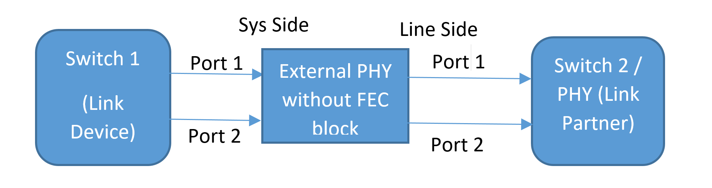

# External PHY Auto Negotiated FEC

# Proposal

| **Title** | **External PHY Abstraction Interface** |
| --- | --- |
| **Authors** | **Broadcom** |
| **Status** | **Draft** |
| **Type** |
| **Created** | **06/07/2021** |
| **SAI-Version** | **0.1** |

# **Contents**

[List of Changes ](#_Toc74125801)

[1 Overview ](#_Toc74125802)

[2 Configuration Example ](#_Toc74125803)

# List of Changes

| **Version** | **Changes** | **Name** | **Date** |
| --- | --- | --- | --- |
| 0.1 | Proposal for PHY Auto Negotiated FEC | | 06/07/2021 |

# Overview

The purpose of this document is to describe the need of getting negotiated FEC of a PHY. In general, there are PHYs which do not have FEC block but they have ability to resolve to a FEC that the link partner requests. Those PHY&#39;s require an attribute to get negotiated FEC value.

With the new proposed attribute &quot;SAI\_PORT\_ATTR\_AUTO\_NEG\_FEC\_MODE&quot; it is possible for a PHY to provide the negotiated FEC to a port/PCS block.Based on the negotiated FEC, port/PCS block can enable the negotiated FEC.

One of the use case is as follows,

In the above port configuration, Auto Negotiation (AN) is configured between the switch (Link Device) and the system side of external PHY (Link Partner).

**Case Example:**

1. In the above mentioned use case, user enables the AN between link device and system side of the external PHY which doesn&#39;t have a FEC block.

2. Link Partner (Switch2/PHY) polls for the AN completion state and resolved FEC status of the external PHY (System Side) using SAI\_PORT\_ATTR\_AUTO\_NEG\_FEC\_MODE.

3. Once AN reaches &quot;GOOD\_CHECK&quot; between switch1 and external PHY, Switch 2 acquires the resolved FEC status of the port using &quot;SAI\_PORT\_ATTR\_AUTO\_NEG\_FEC\_MODE&quot; and configures the port FEC with the resolved FEC.

# Configuration Example

Following example shows how to read the Auto Negotiated FEC

    for (port_index = 0; port_index < 1; port_index ++) {
        for (phy_index = 0; phy_index < PAI_MAX_PHY; phy_index ++) {
            attr_count = 1;
            memset(&port_attr_get, 0, sizeof(port_attr_get));
            port_attr_get[0].id = SAI_PORT_ATTR_AUTO_NEG_FEC_MODE;
            rv = pai_port_apis_ptr->get_port_attribute(line_port_id[phy_index][port_index], attr_count, port_attr_get);
            if (SAI_STATUS_SUCCESS != rv)  {
                printf("get Port Attribute failed return:%d\n", rv);
                return rv;
            }
            printf("PAI Port auto negotiated FEC mode attribute values port_attr_get[%d].id:%d\n", phy_index, port_attr_get[0].value.u32);
        }
    }
