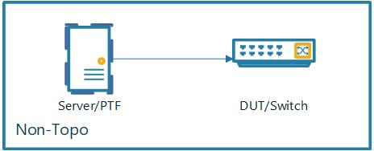
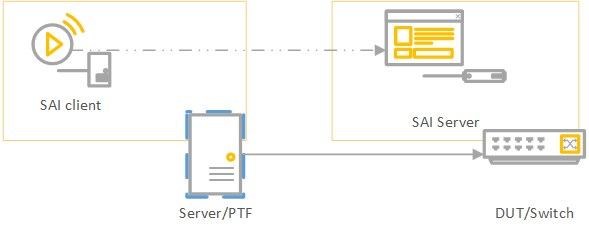

# SAI Vlan Test plan
- [SAI Vlan Test plan](#sai-vlan-test-plan)
  - [Overriew](#overriew)
    - [Test Topology](#test-topology)
    - [Testbed](#testbed)
  - [Scope](#scope)
  - [Basic Test data and SAI APIs](#basic-test-data-and-sai-apis)
    - [Create VLAN and VLAN member](#create-vlan-and-vlan-member)
    - [Packet example](#packet-example)
  - [Test Suites](#test-suites)
    - [Test suite #1 : Test Flooding and learn](#test-suite-1--test-flooding-and-learn)
      - [Testing Objective](#testing-objective)
        - [Trunk VLAN](#trunk-vlan)
        - [Access VLAN](#access-vlan)
    - [Test suite #2: Test Frame Filtering](#test-suite-2-test-frame-filtering)
      - [Testing Objective](#testing-objective-1)
    - [Test suite #3: Test ARP Flooding and learn](#test-suite-3-test-arp-flooding-and-learn)
      - [Testing Objective](#testing-objective-2)
    - [Test sutie #4: Test tagging and trunk/access](#test-sutie-4-test-tagging-and-trunkaccess)
      - [Testing Objective](#testing-objective-3)
    - [Test sutie #5: Test native vlan](#test-sutie-5-test-native-vlan)
      - [Testing Objective](#testing-objective-4)
    - [Test sutie #6: VLAN interface (RIF/SVI)](#test-sutie-6-vlan-interface-rifsvi)
      - [Testing Objective](#testing-objective-5)
  - [SAI APIs operations](#sai-apis-operations)
    - [Test suite #7: Test VLAN related counters.](#test-suite-7-test-vlan-related-counters)
      - [Testing Objective](#testing-objective-6)
    - [Test suite #8: Test VLAN related counters.](#test-suite-8-test-vlan-related-counters)
      - [Testing Objective](#testing-objective-7)
## Overriew
The purpose of this test plan is to test the VLAN function from SAI.

### Test Topology
For SAI-PTF, it will use a non-topology network structure for the sai testing. 


### Testbed
Those tests will be run on the testbed structure as below, the components are:
* PTF - running in a server that can connect to the target DUT
* SAI server - running on a dut
  


*p.s. cause the SAI testing will not depend on any sonic components, then there will be no specific topology(T0 T1 T2) for testing.*
## Scope
The test will include three parts
1. Vlan functionalities
   - Flooding
   - Forwarding
   - Trunk/Access
   - Tagging/Untagging(802.1Q)
   - VLAN interface (RIF/SVI) 
2. SAI APIs operations
   - Vlan Counters
   - Vlan and member list operations

## Basic Test data and SAI APIs
During testing, we need to use SAI APIs for testing. By using SAI-PTF structure, we can invoke the SAI with RPC APIs remotely, the sample code is below.
### Create VLAN and VLAN member
- Create Vlan 10
   ```Python
   sai_thrift_create_vlan(self.client, vlan_id=10)
   ```
- Create Native vlan
   ```python
   sai_thrift_set_port_attribute(self.client, port_id, port_vlan_id=10)
   ```
- Create Vlan member and VLAN member with different mode
   Untag mode and access port
   ```python
   sai_thrift_create_vlan_member(
                    self.client,
                    vlan_id=10,
                    bridge_port_id=port_bridge_port,
                    vlan_tagging_mode=SAI_VLAN_TAGGING_MODE_UNTAGGED)
   ```
   Tag mode and trunk port
   ```python
   sai_thrift_create_vlan_member(
                    self.client,
                    vlan_id=10,
                    bridge_port_id=port_bridge_port,
                    vlan_tagging_mode=SAI_VLAN_TAGGING_MODE_TAGGED)
   ```
- Add static FDB entry in the FDB table
   
   In the code below, we can create fdb entry, and bind the SMAC with a port with a static dfb entry.
   ```python
   sai_thrift_fdb_entry_t(switch_id=self.switch_id, mac_address=mac1, bv_id=self.vlan_oid)
   sai_thrift_create_fdb_entry(
                self.client,
                fdb_entry,
                type=SAI_FDB_ENTRY_TYPE_STATIC,
                bridge_port_id=port_bp,
                packet_action=SAI_PACKET_ACTION_FORWARD)
   ```
- Fdb operations
  Get Fdb entries
  ```python
  sai_thrift_get_switch_attribute(
            self.client,
            available_fdb_entry=True)
  ```
- Clear fdb entries
  Clear the learned fdb entries with the VLAN id object id
  ```python
  sai_thrift_flush_fdb_entries(
                    self.client,
                    bv_id=self.vlan_oid,
                    entry_type=SAI_FDB_ENTRY_TYPE_DYNAMIC)
  ```

### Packet example
- Tagged packet with VLAN id 

   When a packet sent to a access port or send out from a access port, we will get a packet with the VLAN id.
   ```python
    tagged_packet(eth_dst='00:11:11:11:11:11',
                eth_src='00:22:22:22:22:22',
                vlan_vid=10,
                ip_dst='172.16.0.1',
                ip_ttl=64)
   ```
- ARP request
  ```Python
  simple_arp_packet(
            eth_dst='FF:FF:FF:FF:FF:FF', # boardcast
            eth_src='00:11:11:11:11:11',
            arp_op=1,  # ARP request
            ip_tgt='10.10.10.2',
            ip_snd='10.10.10.1',
            hw_snd='00:11:11:11:11:11',
            hw_tgt="00:00:00:00:00:00")
  ```
- ARP response
  ```Python
  simple_arp_packet(
            eth_dst='00:11:11:11:11:11', 
            eth_src='00:22:22:22:22:22',
            arp_op=2,  # ARP response
            ip_tgt='10.10.10.1',
            ip_snd='10.10.10.2',
            hw_snd='00:22:22:22:22:22',
            hw_tgt="00:11:11:11:11:11")
  ```
- Untagged packet
  ```Python
    simple_tcp_packet(eth_dst='00:11:11:11:11:11',
                      eth_src='00:22:22:22:22:22',
                      ip_dst='172.16.0.1',
                      ip_ttl=64)
  ```

## Test Suites
*p.s. We can extend this test to each port with a loop, just take smaple amount of ports as example.*


### Test suite #1 : Test Flooding and learn

#### Testing Objective
Those tests will verifies flooding and learning for vlan. 

VLANs divide broadcast domains in a LAN environment. When flooding on a trunk port with match vlan, the boadcast should only happened within vlan.

After save the mac address to forwarding table, only unicast will happen with target mac.

ARP request and response will also be covered in this set.

##### Trunk VLAN
| Steps/Cases | Goal | Expect  |
|-|-|-|
| Create Vlan and add ports(port1, port2, port3) as VLAN members to the new created vlan. All VLAN members are set as ``Trunk`` | Create VLAN and its members| Vlan and members created|
| Send packet to VLAN port1 with ``tagged`` packet. Packet's src mac:mac1, target mac:mac2.| Flooding to VLAN port2 and port3. | flooding happen|
| Add a fdb entry which binding the mac2 and port2 together.|stimulate the mac learning.| fdb created.|
| Sent the packet again with packet's src mac:mac1, target mac:mac2, VLAN id, to port1.| Packet forwards to the target ``Trunk`` port with mac2.| Received ``tagged`` packet on port2.|
| Check the fdb entries | two new fdb entries added, with mac1 and mac2.| Learnt entries added.|
|Flush the fdb table for next port testing| FDB table cleared.|FDB entries added.|

##### Access VLAN
| Steps/Cases | Goal | Expect  |
|-|-|-|
| Create Vlan and add ports(port1:``Trunk``, port2:``Access``, port3:``Trunk``) as VLAN members to the new created vlan.| Create VLAN and its members| Vlan and members created|
| Send packet to VLAN port1 with ``tagged`` packet. Packet's src mac:mac1, target mac:mac2.| Flooding to vlan, port2 with untagged packet and port3 with tagged packet. | multicast happen with differnt mode|
| Add a fdb entry which binding the mac2 and port2 together.|stimulate the mac learning.| fdb created.|
| Sent the packet again with packet's src mac:mac1, target mac:mac2, VLAN id, to port1.| Packet forwards to the target ``Access`` port with mac2.| Received ``untagged`` packet on port2.|
| Check the fdb entries | ``Two`` new fdb entries added, with mac1 and mac2.| FDB entries added.|

### Test suite #2: Test Frame Filtering
#### Testing Objective
Switch will not forward packet when send packet to port, on which it have the same dest mac with the packet.

| Steps/Cases | Goal | Expect  |
|-|-|-|
| Create VLAN, add port1, port2, port3 as VLAN members to new created vlan. All VLAN members are set as ``Trunk`` | Create VLAN and its members| Vlan and members created|
| Add a fdb entry which binding the mac2 and port2 together.|stimulate the mac learning.| fdb created.|
|Add a new fdb with mac3 one port1, send packet with mac3 as target mac to port1.| Filtering frame | Drop the packet.|

### Test suite #3: Test ARP Flooding and learn

#### Testing Objective
Test ARP Flooding and learn

| Steps/Cases | Goal | Expect  |
|-|-|-|
| Create two VLANs, add port1 and port2 as to vlan1, port3, port4 to vlan2, all set as ports' native VLAN with tag mode(Testing purpose).| create VLAN and its members| Vlan and members created|
| Send ARP request packet to a port.| Flooding to all the other ports with mapped VLAN id. | flooding happen with vlan|
| Send a ``tagged`` ARP response packet with src:mac2, dest:mac1 to port2 and check the fdb entries.|Mac learnt.|Unicast happened.|
| Call API to check the FDB entries.|Check the mac entries in CAM.| fdb entry added.|


### Test sutie #4: Test tagging and trunk/access

*p.s. Do not take native VLAN in this scarinro(Will be in other test suite). Please make sure the native VLAN will not impact the result.*
#### Testing Objective
With Tagged packet or untagged packet, on trunk and access port, when ingress and egress happen, the behivor as below
| Port mode | packet tag mode | Direction | Action                                   |
| :---------|--------------- | :-------- | :--------------------------------------- |
| Access|Untag| Ingress   | Accept the packet.       |
|       |Untag | Egress    | Untag the packet. |
|       |Tag| Ingress   | Drop, if native id not match.|
|       |Tag | Egress    | Untag the packet. |
| Trunk |Untag| Ingress   | Drop, if native VLAN id not match.  |
|       |Untag| Egress    | Tag the packet. |
|       |Tag| Ingress   | Drop, if VLAN and native VLAN id not match. |
|       |Tag| Egress    | Tag the packet. |


Below is the test for checking this.

| Steps/Cases | Goal | Expect  |
|-|-|-|
| Create VLAN 10, add port1 and port3 as ``trunk``, add port2, port4 as ``access``| create VLAN and its members| Vlan and members created|
| Add FDB entries, each port with its own mac.|Simulate the mac learning.| Set up forwarding table|
| Send ``tagged`` packet with dest mac3 on port1. | Forwarding from trunk to trunk port.| ``tagged`` packet received on port3.|
| Send ``untagged`` packet with dest mac4 on port2. | Forwarding from access to access port.| ``Untagged`` packet received on port4.|
| Send ``tagged`` packet with dest mac4 on port1. | Forwarding from trunk to access port.| ``Untagged`` packet received on port4.|
| Send ``Untagged`` packet with dest mac3 on port2. | Forwarding from access to Trunk port.| ``tagged`` packet received on port3.|
|Create VLAN 20, add port5 as ``trunk``, add FDB entry for this new port with mac5.|Vlan member with differnt VLAN id added.|Vlan member and fdb created.|
| Sent the ``Untagged`` packet from port1 with target mac5.|Forwarding on native vlan.|Packet received on port5 with VLAN 20.|
| Sent the ``Tagged`` packet for VLAN 10 from port1 with target mac5.|Forwarding on vlan.|Packet received on port5 with VLAN 20.|
| Sent the ``Untagged`` packet from port2 with target mac5.|Forwarding to trunk.|Packet received on port5 with VLAN 20.|

### Test sutie #5: Test native vlan

#### Testing Objective
For Native vlan, only consider the ingress direction, the entry condition for VLAN and the behivor as below
| Port mode | packet tag mode |  Action                                   |
| :---------|--------------- | :--------------------------------------- |
| Access|Tag| Drop, if native id not match.       |
| Trunk |Untag| Drop, if native VLAN id not match..  |
|       |Tag|  Drop, if VLAN id not match and not meet native VLAN case. |

Below is the test for checking this.
| Steps/Cases | Goal | Expect  |
|-|-|-|
| Create VLAN 10, add port1 and port3 as ``trunk``, add port2, port4 as ``access``. Set VLAN 10 as ports' native vlan| create native VLAN and its members| Vlan and members created|
| Add FDB entries for each port with its own mac.|Simulate the mac learning.| Set up forwarding table|
| Send ``tagged`` packet with dest mac3 on port1. | Forwarding from trunk to trunk port on native vlan.| ``tagged`` packet received on port3.|
| Send ``tagged`` packet with dest mac4 on port1. | Forwarding from trunk to access port.| ``Untagged`` packet received on port4.|
| Send ``Untagged`` packet with dest mac3 on port1. | Forwarding from trunk to Trunk port.| ``tagged`` packet received on port3.|
| Send ``Untagged`` packet with dest mac4 on port1. | Forwarding from trunk to access port.| ``Untagged`` packet received on port3.|
| Send ``tagged`` packet with a not-exiting dest mac on port1. | Dropping incorrect VLAN packet on ``trunk``.| Drop packet.|

### Test sutie #6: VLAN interface (RIF/SVI) 
#### Testing Objective
Test the configuration as below

Need the APIs as below

- Create Router Interface for a vlan interface
  ```Python
  sai_thrift_create_router_interface(
            self.client,
            type=SAI_ROUTER_INTERFACE_TYPE_VLAN,
            virtual_router_id=self.default_vrf,
            vlan_id=self.vlan10)
  ```
- Create next hop to a IP address '10.10.0.1' and mac
  ```python
  sai_thrift_create_next_hop(
        self.client,
        ip=sai_ipaddress('10.10.0.1'),
        router_interface_id=self.vlan100_rif,
        type=SAI_NEXT_HOP_TYPE_IP)
  sai_thrift_create_neighbor_entry(
            self.client, self.neighbor_entry1, dst_mac_address=self.dmac1)
  sai_thrift_route_entry_t(
            vr_id=self.default_vrf, destination=sai_ipprefix('10.10.10.1/32'))
  ```

Below is the test for checking this.
| Steps/Cases | Goal | Expect  |
|-|-|-|
| Create VLAN 10, add port1 and port3 as ``trunk``, add port2, port4 as ``access``. Set VLAN 10 as ports' native vlan| create native VLAN and its members| Vlan and members created|
| Create route entry and next hop for vlan 10, with [IP1] and [mac5].| Create vlan interface. | Vlan interface created.|
| Add FDB entries for RIF. MAC is [mac5], and map it to Port5 in fdb entry. |Simulate the mac learning.| Set up forwarding table|
| Send ``tagged`` packet with dest mac3 on port1. | Forwarding from trunk to trunk port on native vlan.| ``tagged`` packet received on ``port5``.|
| Send ``tagged`` packet with dest mac4 on port1. | Forwarding from trunk to access port.| ``Untagged`` packet received on ``port5``.|
| Send ``Untagged`` packet with dest mac3 on port1. | Forwarding from trunk to Trunk port.| ``tagged`` packet received on ``port5``.|
| Send ``Untagged`` packet with dest mac4 on port1. | Forwarding from trunk to access port.| ``Untagged`` packet received on ``port5``.|
| Send ``tagged`` packet with a not-exiting dest mac on port1. | Dropping incorrect VLAN packet on ``trunk``.| Drop packet.|

## SAI APIs operations

### Test suite #7: Test VLAN related counters.
#### Testing Objective
For VLAN related counters, SAI should be able to get the counter and clear them.

Below are the sample API to operate those data

Check counters
```Python
        stats = sai_thrift_get_vlan_stats(self.client, self.vlan10)
        in_bytes = stats["SAI_VLAN_STAT_IN_OCTETS"]
        out_bytes = stats["SAI_VLAN_STAT_OUT_OCTETS"]
        in_packets = stats["SAI_VLAN_STAT_IN_PACKETS"]
        in_ucast_packets = stats["SAI_VLAN_STAT_IN_UCAST_PKTS"]
        out_packets = stats["SAI_VLAN_STAT_OUT_PACKETS"]
        out_ucast_packets = stats["SAI_VLAN_STAT_OUT_UCAST_PKTS"]

```
Clear counters
```Python
sai_thrift_clear_vlan_stats(self.client, self.vlan10)
```

| Steps/Cases | Goal | Expect  |
|-|-|-|
| Create VLAN 10, add port1 and port3 as ``trunk``| create VLAN and its members| Vlan and members created|
| Add FDB entries, each port with its own mac.|Simulate the mac learning.| Set up forwarding table|
| Use the SAI API to check the counters | Related counter should be changed | Counter changed.|
| Use the SAI API to clear the counters.| Related counter is reset to zero. | Counter reset.|


### Test suite #8: Test VLAN related counters.
#### Testing Objective
Test Vlan and member list operations

Sample APIs

Get VLAN member list
```Python
 vlan_member_list = sai_thrift_object_list_t(count=100)
        mbr_list = sai_thrift_get_vlan_attribute(
            self.client, self.vlan10, member_list=vlan_member_list)
```

nagtive test
```python
    vlan_attr = sai_thrift_get_vlan_attribute(
        self.client, vlan_oid=11, learn_disable=True)

    incorrect_member = sai_thrift_create_vlan_member(
        self.client,
        vlan_id=11,
        bridge_port_id=self.port27_bp,
        vlan_tagging_mode=SAI_VLAN_TAGGING_MODE_TAGGED)
```
| Steps/Cases | Goal | Expect  |
|-|-|-|
| Create VLAN 10, add port1 and port3 as ``trunk``| create VLAN and its members| Vlan and members created|
| Use the SAI API to check VLAN member | VLAN member list and member count is right. | Vlan member list.|
| Remove the VLAN member from VLAN 10 and remove vlan. | VLAN and its member removed.| VLAN and its member removed.|
| Use the SAI API to check VLAN member | return 0. | Vlan member is 0.|
| Use the SAI API to create a VLAN member on VLAN 10 | return 0. | Vlan attribute is 0.|
