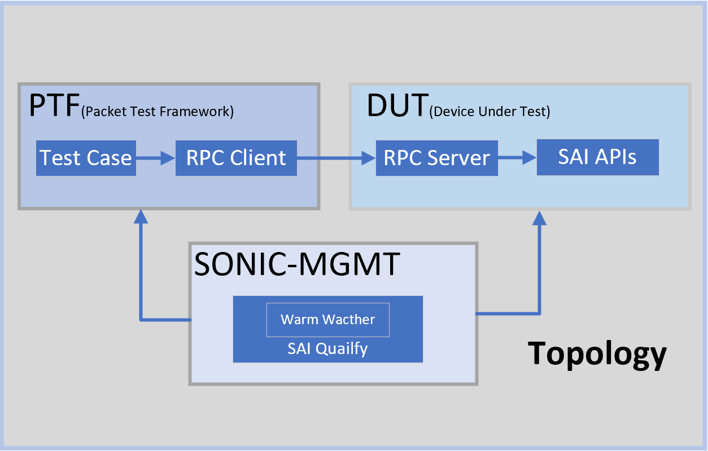
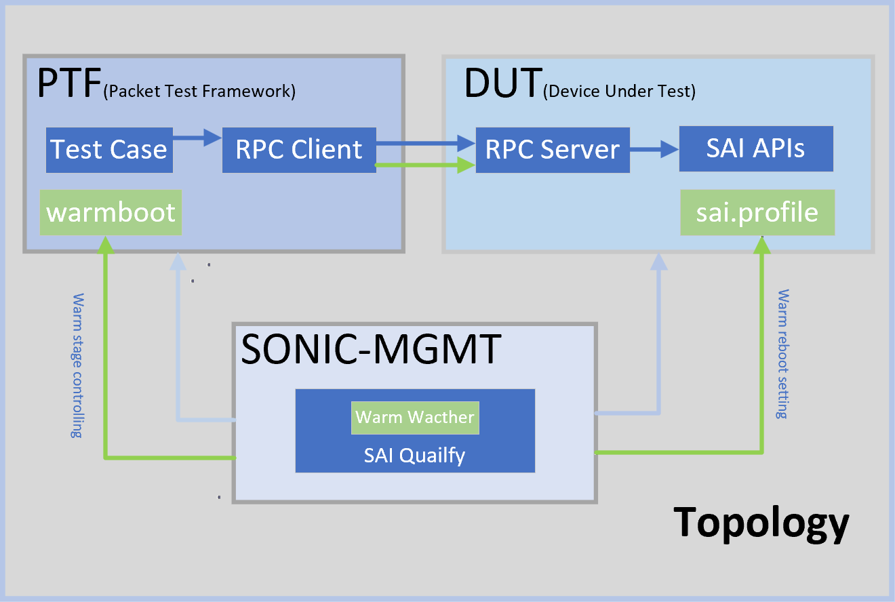
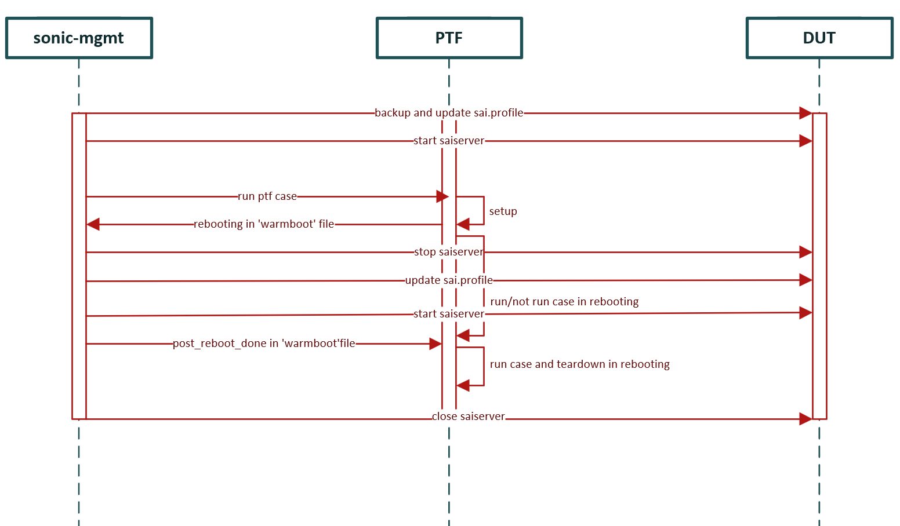

# SAI-PTF for Warm reboot

| **Title** | **SAI-PTF for Warm reboot** |
| --- | --- |
| **Authors** | **Richard Yu, Junyi Xiao** |
| **Status** | **In review** |
| **Created** | **22/03/2022** |
| **Modified** | **22/03/2022** |
| **SAI-Version** | **V1.7** |

- [SAI-PTF for Warm reboot](#sai-ptf-for-warm-reboot)
  - [SAI-PTF for Warm reboot](#sai-ptf-for-warm-reboot-1)
  - [Warm reboot test structure](#warm-reboot-test-structure)
    - [SAI PTF v2](#sai-ptf-v2)
      - [PTF](#ptf)
      - [DUT](#dut)
    - [sonic mgmt](#sonic-mgmt)
  - [system architecture](#system-architecture)
    - [dut-ptf](#dut-ptf)
    - [mgmt-dut](#mgmt-dut)
    - [mgmt-ptf](#mgmt-ptf)
  - [sample code \& example](#sample-code--example)
    - [dut-ptf](#dut-ptf-1)
    - [dut-mgmt](#dut-mgmt)
      - [Mounting of sai.profile](#mounting-of-saiprofile)
      - [Mounting of sai-warmboot.bin](#mounting-of-sai-warmbootbin)
      - [Prepare for first start](#prepare-for-first-start)
      - [Prepare for second start](#prepare-for-second-start)
      - [Restore after warmboot test](#restore-after-warmboot-test)
    - [ptf-mgmt](#ptf-mgmt)
  - [test result](#test-result)


## SAI-PTF for Warm reboot
In order to use the SAI-PTF structure to verify the functionality in a warm reboot scenario, we need to add the following feature to the SAI-PTF structure
1. Lightweight docker which can expose the SAI interface to invoke the SAI interface remotely
1. PTF test case can support different DUT running statuses with its different processes - setUp, runTest, and tearDown
1. By interacting with sonic-mgmt，One test case can run once can verify whether as expected in different DUT running status - before the restart, starting, and started
1. Reuse already existing functional test cases and re-organize them into a warm reboot structure

## Warm reboot test structure
Warm reboot test structure is based on SAI PTF v2. And realize the verification of warmreboot without affecting other functions


### SAI PTF v2

  
In the chart above the components are:
* PTF container - run test cases, and use an RPC client to invoke the SAI interfaces on DUT
* SAI Server container - run inside DUT/switch, which exposes the SAI SDK APIs from the libsai
#### PTF
PTF has two parts
- collection of test cases which is based on unittest. The code structure is as follows:
  ```python
  def setUp(self): # make settings
  def runTest(self): # run test
  def tearDown(self): # remove the setting and clear the test environment
  ```
- as RPC client, invoke the SAI interfaces to configure switch on DUT.

 Update for warm-reboot  
 1. we need to add wrapper to the runTest function. The warpper contains the process of warm-reboot.
more detail see [ptf-mgmt](#ptf-mgmt)
    ```python
    def setUp(self): # make settings before reboot
    @warm_test(is_test_rebooting=True) # does test run at rebooting
    def runTest(self): # run test 
    def tearDown(self): # remove the setting and clear the test environment
    ```
 2. create file `/tmp/warm_reboot` as shared memory to communicate with `sonic-mgmt`
#### DUT
DUT also has two parts
- SAI: The Switch Abstraction Interface (SAI) defines the API to provide a vendor-independent way of controlling forwarding elements, such as a switching ASIC, an NPU or a software switch in a uniform manner.  
- saiserver: We create `saiserver` containter as rpc server so that we can call sai api through rpc in ptf.

Update for warm-reboot  
  1. sai-warmboot.bin: Save the configuration of dut to sai-warmboot.bin
  2. sai.profile: Decide how to start `saiserver`
 
### sonic mgmt
[sonic-mgmt](https://github.com/sonic-net/sonic-mgmt) is for SONiC testbed deployment and setup, SONiC testing, test report processing.
Ansible is the main tool powering all the tasks for SONiC testing. The tasks include:
* Deploy and setup testbed
* Interact with various devices in testbed in ansible playbooks and in pytest scripts.

We can use sonic-mgmt to automate the construction of the SAI warmreboot environment and the verification of use cases. [sai-qualify](https://github.com/sonic-net/sonic-mgmt/tree/master/tests/sai_qualify) is a submodule of sonic-mgmt.It mainly has the following functions

1. SONiC testbed deployment and setup
1. pull `SAI` to the ptf ， the script about `saiserver` is pulled to dut
1. start `saiserver` contatiner
1. check whether can connect rpc server in `saiserver`
1. prf test running
1. stop `saiserver` container
1. organize and upload result
1. teardown
Each SAI test case will repeat 3-6 steps. Wait until all the cases in the caselist are executed, and then go to the 7th step.

Update for warm-reboot
1. creat Warmboot-Watcher daemon: Responsible for the communication between sonic-mgmt and ptf, the warm-reboot of saiserver  

Of course, we can also manually modify the status file and control the startup and shutdown of `saiserver`.
## system architecture
The entire automated system for testing SAI in the warmboot scenario includes three parts(PTF,DUT,sonic-mgmt), and they are closely related. Next I will introduce the communication between the modules.  
The overview of the architecture is as follows

The sequence graph among dut,ptf and sonic-mgmt is as follows

### dut-ptf
 Warm shut down `saiserver` automatically after the setUp method.
 In order not to affect the previous test, add a wrapper to handle the rebooing stage
### mgmt-dut
Mgmt modify the `\etc\sai.d\sai.profile` and control the startup and shutdown of `saiserver` by ansible.
1. Before starting `saiserver` for the first time, we will update `sai.profile`, save the configuration of dut in the setup function of the case, for the next warmreboot of saiserver.
2. Start `saiserver` container
3. After receiving the signal of closing container from dut, close `saiserver`
4. Before starting  `saiserver` for the second time, update `sai.profile` to set the startup mode to warm boot, and read the configuration from warmreboot.bin
5. Start `saiserver` container
6. when case is finished, close `saiserver` and  we will restore the settings of `sai.profile` to prepare for the next test.

When we create the `saiserver` container, we will mount the directory where the `sai.profile` and `sai-warmboot.bin` of dut are located to the `saiserver` container. Because `saiserver` will start according to `sai.profile`. So if we mount `sai.profile`, we can modify the configuration file before starting `saiserver` to prepare for startup.

For more about how `sai.profile` and `sai-warmboot.bin` mount, and how sonic-mgmt modifies sai.profile at different stages, we can see [mgmt-dut](#mgmt-dut)
### mgmt-ptf

Mgmt can remotely control ptf through anisble and execute shell commands. So we create a file `/tmp/warm_reboot` in ptf as shared memory for communication between mgmt and ptf.
`sonic-mgmt` finishes the following process in `start_warm_reboot_watcher`, `ptf` finishes the following process in wrapper `@warm_test(is_test_rebooting=True)`.
   
   1. ptf writes 'rebooting' to `/tmp/warmboot` to notify sonic-mgmt after setup and warm shutdown down
   2. ptf checkes if warmreboot is down in 1 mins
      1. if not, do something in rebooting stage
      2. if done, continue running the case in post-reboot stage
      3. if timeout, raise error
   3. sonic-mgmt restart `saiserver` once reading rebooting in `/tmp/warmboot`
   4. ptf writes 'post_reboot_done' to `/tmp/warmboot` to notify ptf that warmreboot is done.


## sample code & example

### dut-ptf
Before dut notifies mgmt to close saiserver for the first time，Warm shut down automatically.  
The code for making the warm shutdown is

   ```python
  print("shutdown the swich in warm mode")
  sai_thrift_set_switch_attribute(self.client, restart_warm=True)
  sai_thrift_set_switch_attribute(self.client, pre_shutdown=True)
  sai_thrift_remove_switch(self.client)
  sai_thrift_api_uninitialize(self.client)
   ```
  
### dut-mgmt

#### Mounting of sai.profile
Path on the `saiserver`: `/etc/sai.d/sai.profile`  
Path on the dut host varies with different PLATFORMs and HWSKUs: it can be obtained through shell commands

```shell
# Obtain our platform as we will mount directories with these names in each dockers
PLATFORM=${PLATFORM:-`$SONIC_CFGGEN -H -v DEVICE_METADATA.localhost.platform`}
# Obtain our HWSKU as we will mount directories with these names in each docker
HWSKU=${HWSKU:-`$SONIC_CFGGEN -d -v 'DEVICE_METADATA["localhost"]["hwsku"]'`}
# The path to store sai.porfile
profile_path=/usr/share/sonic/device/$PLATFORM/$HWSKU
```

#### Mounting of sai-warmboot.bin
Path on the `saiserver`:`/var/warmboot`  
Path on the dut host:`/host/warmboot`

#### Prepare for first start
1.Save the initial `sai.profile` to `sai.profile.bak`，which is for restoring files after warm reboot.

```shell
profile='sai.profile'
cp $profile $profile.bak
-------------------------------
#Sample profile in brcm s6000
cat /etc/sai.d/sai.profile
SAI_INIT_CONFIG_FILE=/usr/share/sonic/hwsku/td2-s6000-32x40G.config.bcm
```

2.add the `WARM_REBOOT_WRITE_FILE` and `SAI_WARM_BOOT_READ_FILE` in the profile。

```shell
echo "SAI_WARM_BOOT_WRITE_FILE=/var/warmboot/sai-warmboot.bin" >> $profile
echo "SAI_WARM_BOOT_READ_FILE=/var/warmboot/sai-warmboot.bin" >> $profile
-------------------------------
#Sample profile in brcm s6000
cat /etc/sai.d/sai.profile
SAI_INIT_CONFIG_FILE=/usr/share/sonic/hwsku/td2-s6000-32x40G.config.bcm
SAI_NUM_ECMP_MEMBERS=32
SAI_WARM_BOOT_WRITE_FILE=/var/warmboot/sai-warmboot.bin
SAI_WARM_BOOT_READ_FILE=/var/warmboot/sai-warmboot.bin
```

`SAI_WARM_BOOT_WRITE_FILE` and `SAI_WARM_BOOT_READ_FILE` are used to define where SAI will save and load the data backup file.
The configuration data of dut in setup will be backed up to /var/warmboot/sai-warmboot.bin. So even after closing the saiserver container, the backup data will be saved in dut.
#### Prepare for second start
Enable the warm start
```shell
echo "SAI_BOOT_TYPE=1" >> $profile
-------------------------------
# Sample in a brcm s6000
cat /etc/sai.d/sai.profile
SAI_INIT_CONFIG_FILE=/usr/share/sonic/hwsku/td2-s6000-32x40G.config.bcm
SAI_NUM_ECMP_MEMBERS=32
SAI_WARM_BOOT_WRITE_FILE=/var/warmboot/sai-warmboot.bin
SAI_WARM_BOOT_READ_FILE=/var/warmboot/sai-warmboot.bin
SAI_BOOT_TYPE=1
```
#### Restore after warmboot test
```shell
cp $profile.bak $profile
-------------------------------
#Sample profile in brcm s6000
cat /etc/sai.d/sai.profile
SAI_INIT_CONFIG_FILE=/usr/share/sonic/hwsku/td2-s6000-32x40G.config.bcm
SAI_NUM_ECMP_MEMBERS=32
```
### ptf-mgmt

## test result