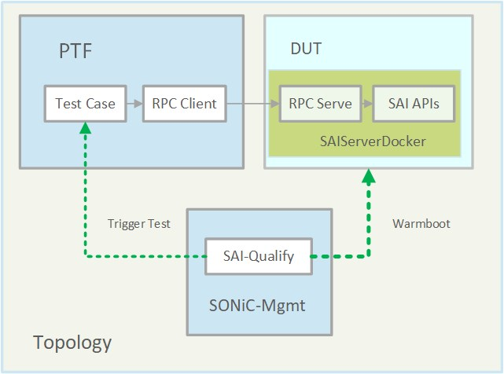

# SAI-PTF for Warm reboot

| **Title** | **SAI-PTF for Warm reboot** |
| --- | --- |
| **Authors** | **Richard Yu** |
| **Status** | **In review** |
| **Created** | **22/03/2022** |
| **Modified** | **22/03/2022** |
| **SAI-Version** | **V1.7** |

- [SAI-PTF for Warm reboot](#sai-ptf-for-warm-reboot)
  - [Overview](#overview)
    - [SAI-PTF for Warm reboot](#sai-ptf-for-warm-reboot-1)
  - [Saiserver container and test structure](#saiserver-container-and-test-structure)
    - [Test Topology](#test-topology)
    - [Testbed](#testbed)
    - [Test Structure](#test-structure)
  - [Upgrade SAI-PTF for different warm reboot stages with](#upgrade-sai-ptf-for-different-warm-reboot-stages-with)
    - [DUT settings during warm reboot](#dut-settings-during-warm-reboot)
    - [Extend the PTF test method for a warm reboot](#extend-the-ptf-test-method-for-a-warm-reboot)
    - [Code for extending the method in SAI-PTF](#code-for-extending-the-method-in-sai-ptf)
  - [Support DUT different running stages during warm reboot](#support-dut-different-running-stages-during-warm-reboot)
    - [Setup the warm reboot - Before the warm reboot](#setup-the-warm-reboot---before-the-warm-reboot)
    - [Starting DUT - During warm reboot](#starting-dut---during-warm-reboot)
    - [Post warmboot - After warm reboot](#post-warmboot---after-warm-reboot)
  - [Example of re-organizing the case into a warm reboot](#example-of-re-organizing-the-case-into-a-warm-reboot)
    - [Context](#context)
    - [Test case detail](#test-case-detail)
  - [Conclusion - Test scenarios and goals for Warm reboot](#conclusion---test-scenarios-and-goals-for-warm-reboot)
      - [reuse existing test cases](#reuse-existing-test-cases)
      - [Cross test cases in one stage](#cross-test-cases-in-one-stage)
      - [Upgrade existing one with new steps](#upgrade-existing-one-with-new-steps)
    - [Validate network device functionalities and configurations](#validate-network-device-functionalities-and-configurations)

## Overview

### SAI-PTF for Warm reboot
In order to use the SAI-PTF structure to verify the functionality in a warm reboot scenario, we need to add the following feature to the SAI-PTF structure
1. Lightweight docker which can expose the SAI interface to invoke the SAI interface remotely
1. PTF test case can support different DUT running statuses with its different processes - setUp, runTest, and tearDown
1. One test case can run in different DUT running status - before the restart, starting, and started
1. Reuse already existing functional test cases and re-organize them into a warm reboot structure

## Saiserver container and test structure
In order to test SAI interfaces, we need a lightweight docker container that can help expose the SAI interfaces for a remote invocation.
Testbed structure as below.

### Test Topology
For SAI-PTF, it will use a non-topology network structure for the sai testing. 


### Testbed
Those tests will be run on the testbed structure as below, the components are:
* PTF - running in a server that can connect to the target DUT
* SAI server - running on a dut
   
*p.s. cause the SAI testing will not depend on any sonic components, then there will be no specific topology(T0 T1 T2) for testing.*

### Test Structure

---


Test structure in the chart above, components are:
* PTF container - run test cases, and use an RPC client to invoke the SAI interfaces on DUT
* SAI Server container - run inside DUT/switch, which exposes the SAI SDK APIs from the libsai
* SAI-Qualify - Test controller, which is used to deploy and control the test running, meanwhile, manipulate the DUT on warm reboot.

*For how to start a saiserver container please check the doc at
[PTF-SAIv2 testing guide](https://github.com/Azure/sonic-mgmt/blob/master/docs/testbed/sai_quality/PTF-SAIv2TestingGuide.md) and 
[Example: Start SaiServer Docker In DUT](https://github.com/Azure/sonic-mgmt/blob/master/docs/testbed/sai_quality/ExampleStartSaiServerDockerInDUT.md)*


## Upgrade SAI-PTF for different warm reboot stages with  
For PTF-SAI structure, it uses three different methods for three different steps in a test
- setUp, make settings
- runTest, run test
- tearDown, remove the setting and clear the test environment

During a warm reboot, we need to split those three method in PTF-Test into three different stage
- Before start, three methods
  - setUp, runTest, tearDown 
- Starting, three methods
  - setUp_starting, test_starting, tearDown_starting
- After Starting, three methods
  - setUp_post_start, test_post_start, tearDown_post_start

### DUT settings during warm reboot
For each stage, there are some different settings for different stages, the details as below:
- Before starting, in this stage, we will make some configurations or benchmark on the DUT, and use those setting to check the DUT functionality during a warm reboot. All the preparation for the warm reboot will be finished.
- Starting, in this stage, DUT will run a warm-reboot command and not start any other docker services and SAI-SDK will not start. We expect all the traffic will behave as normal.
- After Starting, in this stage, SAI-SDK will start, and data will be restored from the backup file. We expect there should be no change on the route and all the traffic will behave as normal. Meanwhile, if needed we can check the switch status from some SAI interfaces, as in this stage, the SAI switch has been initialized and RPC APIs have been ready.

### Extend the PTF test method for a warm reboot
For extending the existing PTF-SAI structure,  all the three methods, setUp, runTest, and tearDown, are extended by tags as below:
```
@warm_setup
@warm_test
@warm_teardown
```
there is the sample code
- Setup methods
   ```python
    @warm_setup
    def setUp(self):
        print("setUp WarmL2SanityTest")
        L2SanityTest.setUp(self)


    def setUp_starting(self):
        print("setUp_starting WarmL2SanityTest")
        SaiHelperBase.setUp(self)
        super().param_init()


    def setUp_post_start(self):
        print("setUp_post_start WarmL2SanityTest")
        SaiHelperBase.setUp(self)
        super().param_init()
   ```
- runTest methods
   ```python
    @warm_test
    def runTest(self):
        print("Run test WarmL2SanityTest")
        super().runTest()


    def test_starting(self):
        print("test_starting WarmL2SanityTest")
        super().runTest()


    def test_post_start(self):
        print("test_post_start WarmL2SanityTest")
        super().runTest()   
   ```
- tearDown Methods
   ```python
    @warm_teardown
    def tearDown(self):
        print("tearDown WarmL2SanityTest")
        print("Skip the teardown and make a warm shut down for warm boot testing")
        self.warm_shutdown()


    def tearDown_starting(self):
        print("tearDown_starting WarmL2SanityTest")
        print("Skip the teardown for warm boot testing")


    def tearDown_post_start(self):
        print("tearDown_post_start WarmL2SanityTest")
        print("Skip the teardown after warm boot testing")
 ```

### Code for extending the method in SAI-PTF
There is the code logic for splitting the runTest method
```python
def warm_test(f):
    """
    Method decorator for the method of warm testing.
    
    Depends on parameters [test_reboot_mode] and [test_reboot_stage].
    Runs different method, test_starting, setUp_post_start and runTest
    """
    def test_director(inst, *args):
        if inst.test_reboot_stage == 'starting':
            return inst.test_starting()
        if inst.test_reboot_stage == 'post':
            return inst.setUp_post_start()
        return f(inst)
    return test_director
```

## Support DUT different running stages during warm reboot
In the above section, there are introductions about what are the different stages in the warm reboot, and how to make them into a test.

Besides the test code, there are some configurations to make the DUT run into different warm reboot stages.

Then during our testing, we need to control the DUT from our test. Below are the details.

### Setup the warm reboot - Before the warm reboot
Before starting the test for the warm reboot, we need the following steps
1. remove all the services which can start from the reboot
For remove all the sevices we can use the scipt in [all_service.sh](../../ptf/scripts/all_service.sh)
   ```shell
   #stop all the services
   all_service.sh -o stop
   #backup and remove all the services
   all_serivce.sh -o remove
   ```
2. start the saiserver and add the WARM_REBOOT_WRITE_FILE and SAI_WARM_BOOT_READ_FILE in the profile 
   ```shell
   #Sample profile in brcm s6000
   cat /etc/sai.d/sai.profile
   SAI_INIT_CONFIG_FILE=/usr/share/sonic/hwsku/td2-s6000-32x40G.config.bcm
   SAI_NUM_ECMP_MEMBERS=32
   SAI_WARM_BOOT_WRITE_FILE=/var/warmboot/sai-warmboot.bin
   SAI_WARM_BOOT_READ_FILE=/var/warmboot/sai-warmboot.bin
   ```
   *SAI_WARM_BOOT_WRITE_FILE and SAI_WARM_BOOT_READ_FILE are used to define where SAI will save and load the data backup file.*

3. start the test 
In order to start the PTF tests, we need to copy the test cases into PTF (refer [PTF-SAIv2 testing guide](https://github.com/Azure/sonic-mgmt/blob/master/docs/testbed/sai_quality/PTF-SAIv2TestingGuide.md)) and add the warm boot parameters
   ```shell
   ptf --test-dir /tmp/test/SAI/ptf/warm_boot warm_saiswitch.WarmAvailableIPv4RouteEntryTest --interface '0-0@eth0' ... '0-31@eth31' --relax "--test-params=thrift_server='Ip_address';test_reboot_mode='warm';test_reboot_stage='setup'"
   ```
   *p.s. Need to add the parameters test_reboot_mode='warm';test_reboot_stage='setup'*

4. trigger the warm shut down automatically after the runTest method with @warm_test
The code for making the warm shutdown is
   ```python
    def warm_shutdown(self):
        """
        Shut down switch in warm boot mode
        """
        print("shutdown the swich in warm mode")
        sai_thrift_set_switch_attribute(self.client, restart_warm=True)
        sai_thrift_set_switch_attribute(self.client, pre_shutdown=True)
        sai_thrift_remove_switch(self.client)
        sai_thrift_api_uninitialize(self.client)
   ```
*p.s. we don't need to call this method manually.*

### Starting DUT - During warm reboot
1. warm-reboot the DUT
   we can use the shell [sai_warmboot.sh](../../ptf/scripts/sai_warmboot.sh)
   ```shell
   sai_warmboot.sh
   ```
1. change the profile, enable the warm start
   ```shell
   # Sample in a dell s6000
   cat /etc/sai.d/sai.profile
   SAI_INIT_CONFIG_FILE=/usr/share/sonic/hwsku/td2-s6000-32x40G.config.bcm
   SAI_NUM_ECMP_MEMBERS=32
   SAI_WARM_BOOT_WRITE_FILE=/var/warmboot/sai-warmboot.bin
   SAI_WARM_BOOT_READ_FILE=/var/warmboot/sai-warmboot.bin
   SAI_BOOT_TYPE=1
   ```

1. trigger the test in starting mode
   ```shell
   ptf --test-dir /tmp/test/SAI/ptf/warm_boot warm_saiswitch.WarmAvailableIPv4RouteEntryTest --interface '0-0@eth0' ... '0-31@eth31' --relax "--test-params=thrift_server='Ip_address';test_reboot_mode='warm';test_reboot_stage='starting'"
   ```
   *p.s. Need to add the parameters test_reboot_mode='warm';test_reboot_stage='starting'*

### Post warmboot - After warm reboot
1. start saiserver and trigger the test in post mode
   ```shell
   ptf --test-dir /tmp/test/SAI/ptf/warm_boot warm_saiswitch.WarmAvailableIPv4RouteEntryTest --interface '0-0@eth0' ... '0-31@eth31' --relax "--test-params=thrift_server='Ip_address';test_reboot_mode='warm';test_reboot_stage='post'"
   ```
   *p.s. Need to add the parameters test_reboot_mode='warm';test_reboot_stage='post'*

## Example of re-organizing the case into a warm reboot
### Context
For warm reboot test cases, we can always make it in two ways:
1. Reuse the test logic in existing code, in this way we need to:
     - wrap the code in the existing method for warm reboot usage, and
     - place the new method in the warm reboot method
2. Write a brand new warm reboot test cases

In order to reuse the existing test cases in a warm reboot, we need to re-organize the existing test cases into the warm reboot structure.

### Test case detail
There is a test sample for the warm reboot test https://github.com/opencomputeproject/SAI/pull/1440


For this warm reboot test in the sample, we reuse the code in the [L2SanityTest](https://github.com/richardyu-ms/SAI/blob/v1.7/ptf/saisanity.py). In general, in this test case, we 
- Setup
  1. create VLANs for each port
  2. create MACs for ports (mapped with index)
  3. then create route rules by adding mac and port
  4. then send packets to on port by with different mac
- Check

  5. check we can get the port allocated with the mac as route rules

With that basic VLAN and FDB functionality, we expect in a warm reboot scenario, we can get the test case and expectations below
1. Pre-warm-reboot
    - Setup as a test in L2SanityTest
    - Check as a test in L2SanityTest
2. Starting
    - Check as a test in L2SanityTest

*In this stage, like a switch running in starting mode, sai switch is not getting started, we will only verify the packet transit*
    
3. Post-warm-reboot
    - APIs start the switch in warm mode
    - Check as a test in L2SanityTest

*In this stage, the switch gets started, and we can use warm reboot API to start the switch.*

## Conclusion - Test scenarios and goals for Warm reboot

From the above introduction, we can see in this warm reboot testing structure, we can run a complex warm reboot test in one single test, and manipulate the DUT with test cases for different warm stages.

The core concept is, isolating the logic for testing and configuration, keeping the environment during warm reboot, testing in different warm reboot stages, then validating the result in one stage or cross stages (cause one case have many stages).

For this new warm reboot structure, we can use it to make the warm reboot easier and satisfy the testing purpose for different scenarios.

#### reuse existing test cases
By engaging this warm reboot structure, we can reuse the existing test cases. After dividing them into different functions which will map to different warm reboot stages, then we can easily start the warm reboot tests.

#### Cross test cases in one stage
We can re-organize the new warm reboot test cases into the different groups for running them together in a target warm reboot stage.

Cause we have different test methods mapped to different warm reboot stages, we can select the target stage by input parameters. Then we can combine different cases together and run them in different stages (Should make sure they do not impact each other).

#### Upgrade existing one with new steps
Besides reusing the existing test cases, certainly, we can add more checkpoints in the test methods to map different test steps(setup, run test, or teardown), and within different warm reboot stages.

By doing this, we can upgrade the existing test cases with more validation in a warm reboot easily.

### Validate network device functionalities and configurations
We can validate network device functionalities and configurations for a warm reboot.

Cause we can *isolate the logic for testing and configuration, keeping the environment during warm reboot, testing in different warm reboot stages, then validating the result in one stage or cross stages (cause one case have many stages).*

Then reuse the existing test cases or add new checkpoints, we can compare both the functionalities and configurations among different warm reboot stages or different tests.