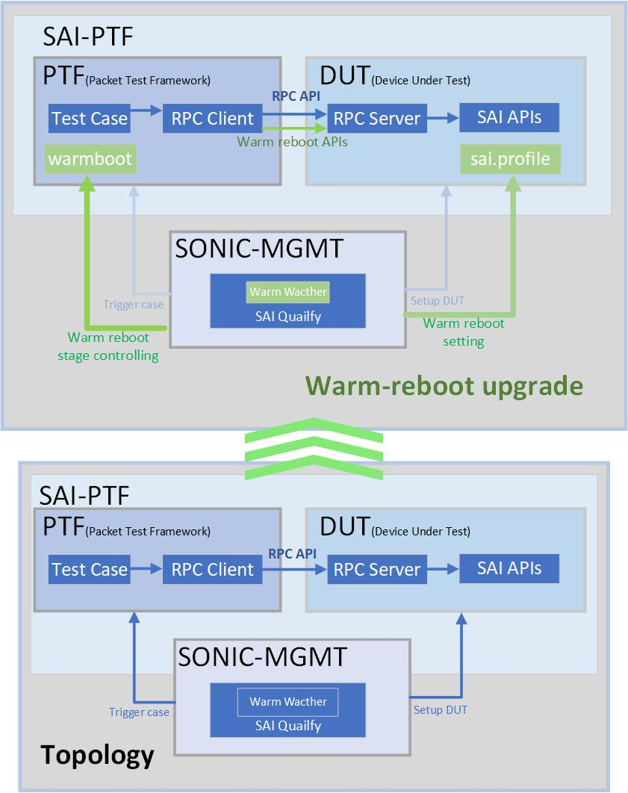
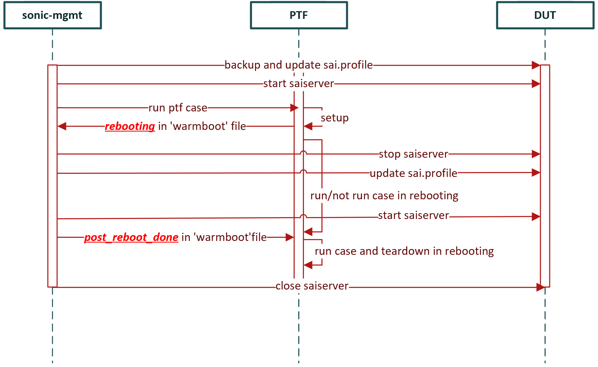
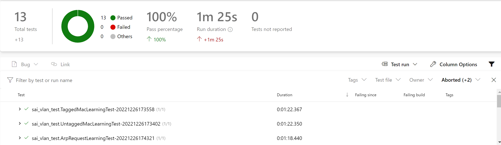

# SAI-PTF for Warm reboot

| **Title** | **SAI-PTF for Warm reboot** |
| --- | --- |
| **Authors** | **Richard Yu, Junyi Xiao** |
| **Status** | **In review** |
| **Created** | **22/03/2022** |
| **Modified** | **27/12/2022** |
| **SAI-Version** | **V1.7, V1.10, V1.11** |

- [SAI-PTF for Warm reboot](#sai-ptf-for-warm-reboot)
  - [Background for Warm reboot test](#background-for-warm-reboot-test)
  - [SAI warm reboot key features](#sai-warm-reboot-key-features)
  - [Warm reboot structure](#warm-reboot-structure)
    - [SAI PTF v2](#sai-ptf-v2)
      - [PTF](#ptf)
      - [DUT](#dut)
    - [SONiC-MGMT](#sonic-mgmt)
  - [Warm reboot workflow](#warm-reboot-workflow)
    - [PTF-DUT](#ptf-dut)
    - [MGMT-DUT](#mgmt-dut)
    - [MGMT-PTF](#mgmt-ptf)
  - [sample code](#sample-code)
    - [PTF-DUT](#ptf-dut-1)
    - [MGMT-DUT](#mgmt-dut-1)
      - [Mounting of sai.profile](#mounting-of-saiprofile)
      - [Mounting of sai-warmboot.bin](#mounting-of-sai-warmbootbin)
      - [Prepare for first start](#prepare-for-first-start)
      - [Prepare for the second start](#prepare-for-the-second-start)
      - [Restore after warmboot test](#restore-after-warmboot-test)
    - [PTF-MGMT](#ptf-mgmt)
  - [Example and test result](#example-and-test-result)
    - [Test case detail](#test-case-detail)
    - [Results](#results)


## Background for Warm reboot test
For the warm reboot test, we need to meet the following requirements
1. Setup DUT for testing purposes, like deployment test purpose dockers, and expose SAI API for testing
2. Preparing warm reboot configurations on DUT(device under test) 
3. Manipulating and monitoring DUT for different warm reboot stage
4. Controlling case running process on different DUT status(prepare reboot, rebooting or post reboot)
5. Ability to check the DUT function during warm reboot(Forward packet during reboot)
6. Nice to be able to automate the whole process
7. Nice to be able to reuse all the functional test cases

## SAI warm reboot key features
- **Containerized test environment**
  
  Lightweight docker which can be easily deployed in DUT to satisfy testing purposes

- **Expose SAI local API as RPC APIs**
  
   RPC server in the lightweight container which can expose the SAI API to remote accessible RPC(On Port 9092)

- **Interactive open interface for controlling test process (support manual or auto)**

  Human readable file to control the cases running stage, which can be used by automatic tools or manual test

- **One Step Upgrade to warm reboot from existing test cases - Tag @warm_test**
 
  Just need to add ``@warm_test`` to enable the warm reboot tests, then you can use the interactive interface to control the whole process for the warm reboot.

- **Automated whole process - integrated with SONiC-MGMT**

  SONiC-MGMT can control DUT side and control the whole Test process automatically, from test environment setup, warm reboot configurations, and warm reboot process. 

## Warm reboot structure

In this section, we will see the components that consist of the warm reboot structure.



As the diagram above, the warm reboot structure was upgraded from the existing SAI-PTF Automatic structure.

SAI-PTF Automatic structure contains two components, which are
 - SAI PTF v2
 - SONiC MGMT

For more details about the SAI-PTF Automatic structure, please refer to doc [SAI-PTFv2 Overview](https://github.com/opencomputeproject/SAI/blob/master/PTF/docs/SAI-PTFv2Overview.md). 

Based on the existing SAI-PTFv2 structure, we upgrade the whole system for a warm reboot test.

In the introduction below, we will go through each upgraded part in the warm reboot structure.

### SAI PTF v2
SAI-PTF v2 is the key component for SAI testing. The test is running in this part, by taking the benefit from the SAI-PTF v2 structure, we made following upgrade in the sub-component below for a warm upgrade.
#### PTF
PTF is the container to run the SAI test cases.

For Warm reboot, as shown in the diagram above, the upgrade points for PTF as below

 1. To make the test running process can be controlled outside, by tools or manually, create file `/tmp/warm_reboot` as an open interface to communicate with outside, like `SONiC-MGMT`
 2. To reuse existing cases, we need to add a tag to enable the wrapper for the runTest function. 
     - The wrapper ``@warm_test`` contains the process of warm-reboot.
For more detail see [PTF-MGMT](#ptf-mgmt)
    ```python
    def setUp(self): # make settings before reboot
    @warm_test(is_test_rebooting=True) # does test run at rebooting
    def runTest(self): # run test 
    def tearDown(self): # remove the setting and clear the test environment
    ```
  3. In order to trigger a warm reboot test, we use warm reboot API to make a warm reboot as [PTF-DUT](#ptf-dut)
  
#### DUT

In DUT, in order to support warm reboot, as shown in the diagram above,  we make the following changes
  1. sai-warmboot.bin: Save the configuration of DUT to sai-warmboot.bin
  2. sai.profile: Decide how to start `saiserver`
 
### SONiC-MGMT

The SONiC-MGMT component mainly has the following functions

1. SONiC testbed deployment and setup
2. pull `SAI` to the PTF， the script about `saiserver` is pulled to DUT
3. start `saiserver` contatiner
4. check whether can connect RPC server in `saiserver`
5. PTF test running
6. stop `saiserver` container
7. organize and upload the result
8. teardown
Each SAI test case will repeat 3-6 steps. Wait until all the cases in the case list are executed, and then go to the 7th step.

For warm-reboot, as shown in the diagram above, we made the following upgrade
1. Set warm reboot configurations: set up the files in [DUT Upgrade](#dut)
2. create Warm boot-Watcher daemon: check the Open Interface [PTF-Upgrade](#ptf)
3. Coordinate DUT and PTF: Monitor status DUT status in step1 and test status in step2

> Note, SONiC-MGMT is a coordinator between DUT and PTF, we can manually manipulate the status file and control the startup and shutdown of `saiserver` or use other automatic tools/script for that, we can also manually modify.

## Warm reboot workflow
The entire automated system for testing SAI in the warm boot scenario includes three parts(PTF, DUT, SONiC-MGMT), and they are closely related. 

In this section, I will introduce the workflow/process of warm reboot and the communication between the modules.  

The sequence diagram among `DUT`, `PTF` and `SONiC-MGMT` is as follows

### PTF-DUT
 Between PTF-DUT, PTF uses special APIs to warm shut down `saiserver`  after the warm reboot setUp 

 In PTF especially, for the test case part, in order to reuse the previous test, add a wrapper to handle the rebooting stage (Sample code: [PTF-DUT](#ptf-dut-1)).
### MGMT-DUT
Between MGMT and DUT, Mgmt modifies the `\etc\sai.d\sai.profile` in DUT and controls the startup and shutdown of `saiserver` deployed in DUT.

Before the ``Rebooting`` stage, as shown from the sequence diagram, MGMT will run DUT in ``pre-reboot`` stage, details as below:
1. Before starting `saiserver` for the first time, we will update `sai.profile`, and save the configuration of DUT in the setup function of the case, for the next warm reboot of saiserver. (Sample code: [Mounting of sai.profile](#mounting-of-saiprofile))
2. Start `saiserver` container
3. After detecting the signal of the ``rebooting`` in DUT, MGMT close `saiserver` container in DUT
4. Before starting  `saiserver` for the second time, update `sai.profile` to set the startup mode to warm boot, and read the configuration from warmreboot.bin (Sample code: [Prepare for first start](#prepare-for-first-start))
5. Start `saiserver` container
6. when the case is finished, close `saiserver` and we will restore the settings of `sai.profile` to prepare for the next test.

For ``Rebooting`` stage, as shown from the sequence diagram, MGMT will
1. When we create the `saiserver` container, we will mount the directory from DUT host,  where the `sai.profile` and `sai-warmboot.bin` are located in the `saiserver` container. (Sample code: [Mounting of sai-warmboot.bin](#mounting-of-sai-warmbootbin))
2. Because `saiserver` will use `sai.profile` when rebooting. So if we mount `sai.profile`, we can modify the configuration file before starting `saiserver` to prepare for a startup.

For more details about how `sai.profile` and `sai-warmboot.bin` mount, and how SONiC-MGMT modifies sai.profile at different stages, we can see (Sample code: [MGMT-DUT](#mgmt-dut-1))
### MGMT-PTF

Mgmt can remotely control PTF through anisble and execute shell commands. 

Then the test in PTF will create a file `/tmp/warm_reboot` in PTF as an interactive open interface for communication between MGMT and PTF, PTF test cases will pause/stop the test process based on this file.

Accordingly, in brief, after `SONiC-MGMT` detected the stage in `/tmp/warm_reboot` by `start_warm_reboot_watcher`, it finishes the following process, in the counterpart, `PTF` finishes the following process in wrapper `@warm_test(is_test_rebooting=True)`. as shown from the sequence diagram, the details as below
   
   1. PTF writes 'rebooting' to `/tmp/warmboot` to notify SONiC-MGMT after setup and warm shutdown down
   2. PTF checks if the warm reboot is done in 1 min
      1. if not, do something in rebooting stage
      2. if done, continue running the case in the post-reboot stage
      3. if timeout, raise an error
   3. SONiC-MGMT restart `saiserver` once reading rebooting in `/tmp/warmboot`
   4. PTF writes 'post_reboot_done' to `/tmp/warmboot` to notify PTF that the warm reboot is done.


## sample code

From the above two sections, we go over the structure and workflow of the warm reboot.

In this part, I will present some sample code, for a better understanding of the whole structure.

### PTF-DUT
Before DUT notifies MGMT to close saiserver for the first time(by setting ``rebooting`` state in the open interface file), the warm shut down automatically.  

The [code](https://github.com/ms-junyi/SAI/blob/junyi-warmboot/test/sai_test/sai_utils.py#L213) for making the warm shutdown is 

   ```python
  print("shutdown the switch in warm mode")
  sai_thrift_set_switch_attribute(self.client, restart_warm=True)
  sai_thrift_set_switch_attribute(self.client, pre_shutdown=True)
  sai_thrift_remove_switch(self.client)
  sai_thrift_api_uninitialize(self.client)
   ```
  
### MGMT-DUT
The related code is at [sai_warm_profile.sh](https://github.com/sonic-net/sonic-mgmt/blob/master/tests/scripts/sai_qualify/sai_warm_profile.sh)
#### Mounting of sai.profile
Path on the `saiserver`: `/etc/sai.d/sai.profile`  

A path on the DUT host varies with different PLATFORMs and HWSKUs: it can be obtained through shell commands

```shell
# Obtain our platform as we will mount directories with these names in each docker
PLATFORM=${PLATFORM:-`$SONIC_CFGGEN -H -v DEVICE_METADATA.localhost.platform`}
# Obtain our HWSKU as we will mount directories with these names in each docker
HWSKU=${HWSKU:-`$SONIC_CFGGEN -d -v 'DEVICE_METADATA["localhost"]["hwsku"]'`}
# The path to store sai.porfile
profile_path=/usr/share/sonic/device/$PLATFORM/$HWSKU
```

#### Mounting of sai-warmboot.bin
Path on the `saiserver`:`/var/warmboot`  

Path on the DUT host:`/host/warmboot`

#### Prepare for first start
1. Save the initial `sai.profile` to `sai.profile.bak`, which is for restoring files after a warm reboot.

```shell
profile='sai.profile'
cp $profile $profile.bak
-------------------------------
#Sample profile in brcm s6000
cat /etc/sai.d/sai.profile
SAI_INIT_CONFIG_FILE=/usr/share/sonic/hwsku/td2-s6000-32x40G.config.bcm
```

2. Add the `WARM_REBOOT_WRITE_FILE` and `SAI_WARM_BOOT_READ_FILE` in the profile。

```shell
echo "SAI_WARM_BOOT_WRITE_FILE=/var/warmboot/sai-warmboot.bin" >> $profile
echo "SAI_WARM_BOOT_READ_FILE=/var/warmboot/sai-warmboot.bin" >> $profile
-------------------------------
#Sample profile in brcm s6000
cat /etc/sai.d/sai.profile
SAI_INIT_CONFIG_FILE=/usr/share/sonic/hwsku/td2-s6000-32x40G.config.bcm
SAI_NUM_ECMP_MEMBERS=32
SAI_WARM_BOOT_WRITE_FILE=/var/warmboot/sai-warmboot.bin
SAI_WARM_BOOT_READ_FILE=/var/warmboot/sai-warmboot.bin
```

`SAI_WARM_BOOT_WRITE_FILE` and `SAI_WARM_BOOT_READ_FILE` are used to define where SAI will save and load the data backup file.

The configuration data of DUT in the setup will be backed up to /var/warmboot/sai-warmboot.bin. So even after closing the saiserver container, the backup data will be saved in DUT.
#### Prepare for the second start
Enable the warm start
```shell
echo "SAI_BOOT_TYPE=1" >> $profile
-------------------------------
# Sample in a brcm s6000
cat /etc/sai.d/sai.profile
SAI_INIT_CONFIG_FILE=/usr/share/sonic/hwsku/td2-s6000-32x40G.config.bcm
SAI_NUM_ECMP_MEMBERS=32
SAI_WARM_BOOT_WRITE_FILE=/var/warmboot/sai-warmboot.bin
SAI_WARM_BOOT_READ_FILE=/var/warmboot/sai-warmboot.bin
SAI_BOOT_TYPE=1
```
#### Restore after warmboot test
```shell
cp $profile.bak $profile
-------------------------------
#Sample profile in brcm s6000
cat /etc/sai.d/sai.profile
SAI_INIT_CONFIG_FILE=/usr/share/sonic/hwsku/td2-s6000-32x40G.config.bcm
SAI_NUM_ECMP_MEMBERS=32
```
### PTF-MGMT

MGMT code is at [sai_infra.py](https://github.com/sonic-net/sonic-mgmt/blob/master/tests/sai_qualify/sai_infra.py#L86-L137)  
1. Create a thread every second to check the status
  ```
    @pytest.fixture(scope="module")
    def start_warm_reboot_watcher(duthost, request, ptfhost):
      logger.info("create and clean up the shared file with ptf")
      ptfhost.shell("touch {}".format("/tmp/warm_reboot"))
      ptfhost.shell("echo  > {}".format("/tmp/warm_reboot"))

      logger.info("start warm reboot watcher")
      close_apschedule_log()
      scheduler = BackgroundScheduler(
          {'apscheduler.job_defaults.max_instances': 1}) 
      scheduler.add_job(warm_reboot_change_handler, "cron", [
                        duthost, request, ptfhost], second="*/1")
      scheduler.start()
  ```
 2. Loop to monitor whether the switch setup of the PTF test is completed.  
   If setup ends ('rebooting' is obtained from the file)
    1. Stop the saiserver container
    2. Update the script to start saiserver so that the next startup is a warm reboot,
        using the previous configuration
    3. Restart saiserver
    4. Write 'post_reboot_done' in the shared file to notify PTF that a warm reboot is done
```
def warm_reboot_change_handler(duthost, request, ptfhost):
    result = ptfhost.shell("cat {}".format("/tmp/warm_reboot"))
    if result["stdout_lines"] and result["stdout_lines"][0] == 'rebooting':
        duthost.shell(USR_BIN_DIR + "/saiserver.sh" + " stop")
        saiserver_warmboot_config(duthost, "start")
        result = ptfhost.shell(
            "echo rebooting_done > {}".format("/tmp/warm_reboot"))

        start_sai_test_conatiner_with_retry(
            duthost, get_sai_test_container_name(request))
        logger.info("saiserver start warm reboot")
        result = ptfhost.shell(
            "echo post_reboot_done > {}".format("/tmp/warm_reboot"))
```

sai code is at [sai_utils.py](https://github.com/ms-junyi/SAI/blob/junyi-warmboot/test/sai_test/sai_utils.py#L219-L249)
```
 # write content to reboot-requested
  print("write rebooting to file")
  warm_file = open('/tmp/warm_reboot','w+')
  warm_file.write(WARM_TEST_REBOOTING)
  warm_file.close()
  times = 0
  try:
      while 1:
          print("reading content in the warm_reboot")
          warm_file = open('/tmp/warm_reboot','r')
          txt = warm_file.readline()
          warm_file.close()                
          if 'post_reboot_done' in txt:
              print("warm reboot is done, next, we will run the case")
              break
          if is_test_rebooting:
              print("running in the rebooting stage, text is ", txt)
              f(inst)
          times = times + 1
          time.sleep(interval)
          print("alreay wait for ",times)
          if times > time_out:
              raise Exception("time out")
  except Exception as e:
      print(e)
  
  inst.createRpcClient()
  inst.test_reboot_stage  = WARM_TEST_POST_REBOOT
  t0_switch_config_helper(inst)
```
## Example and test result
In this section, I will provide an example of how to reuse the existing functional test cases for a warm reboot scenario.
### Test case detail
 We reuse the code in the [UntagAccessToAccessTest](https://github.com/opencomputeproject/SAI/blob/master/test/sai_test/sai_vlan_test.py#L31) as a warm reboot test sample. In general, in this test case, we 
- Setup
  1. create VLANs for each port
  2. create MACs for ports (mapped with index)
  3. create route rules by adding mac and port
  4. create ``Untagged`` packet with ``mac2`` as dest mac.
  5. then send a packet on Port1.
- Check
  1. Verify ``Untagged`` packet received port2.

With that basic VLAN and FDB functionality, we expect in a warm reboot scenario, we can get the test case and expectations below
1. Pre-warm-reboot
    - Setup as normal
    - `warm shut down`
2. Rebooting
    - Check test as normal continually

*In this stage, like a switch running in starting mode, SAI switch is not getting started, we will only verify the packet transit*
    
3. Post-warm-reboot
    - APIs start the switch in warm mode
    - Check test as normal

*In this stage, the switch gets started, and we can use warm reboot API to start the switch.*

In [TaggedFrameFilteringTest](https://github.com/opencomputeproject/SAI/blob/master/test/sai_test/sai_vlan_test.py#L195), we will not check the test in rebooting because RPC will be used.
1. Pre-warm-reboot
    - Setup as normal
    - `warm shut down`
2. Rebooting
    - wait until `saiserver` container reboots
3. Post-warm-reboot
    - APIs start the switch in warm mode
    - Check test as normal

### Results
This is the result of running the azure pipeline, which efficiently completed the VLAN test in a warm-reboot scenario.

