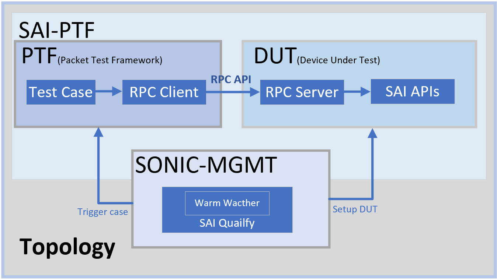
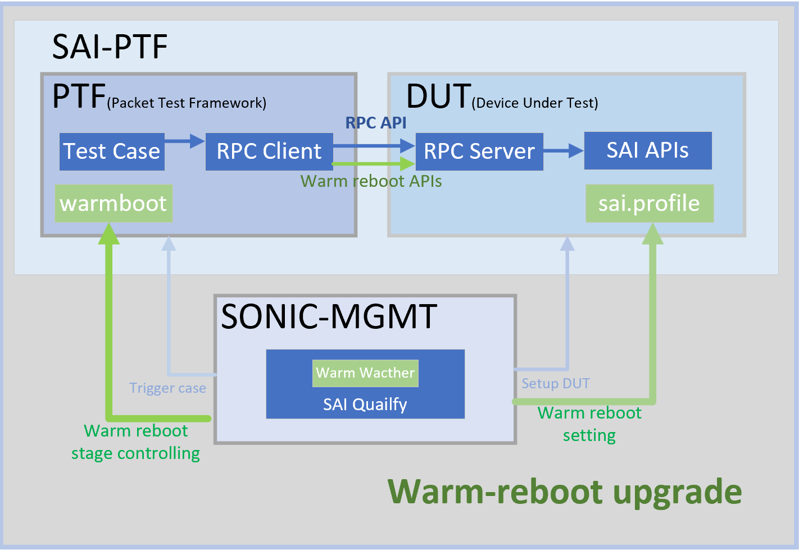

# SAI-PTF for Warm reboot

| **Title** | **SAI-PTF for Warm reboot** |
| --- | --- |
| **Authors** | **Richard Yu, Junyi Xiao** |
| **Status** | **In review** |
| **Created** | **22/03/2022** |
| **Modified** | **27/12/2022** |
| **SAI-Version** | **V1.7** |

- [SAI-PTF for Warm reboot](#sai-ptf-for-warm-reboot)
  - [Background for Warm reboot test](#background-for-warm-reboot-test)
  - [SAI warm reboot key features](#sai-warm-reboot-key-features)
  - [Warm reboot structure](#warm-reboot-structure)
    - [SAI PTF v2](#sai-ptf-v2)
      - [PTF](#ptf)
      - [DUT](#dut)
    - [SONiC-MGMT](#sonic-mgmt)
  - [Warm reboot workflow](#warm-reboot-workflow)
    - [ptf-dut](#ptf-dut)
    - [mgmt-dut](#mgmt-dut)
    - [mgmt-ptf](#mgmt-ptf)
  - [sample code](#sample-code)
    - [ptf-dut](#ptf-dut-1)
    - [mgmt-dut](#mgmt-dut-1)
      - [Mounting of sai.profile](#mounting-of-saiprofile)
      - [Mounting of sai-warmboot.bin](#mounting-of-sai-warmbootbin)
      - [Prepare for first start](#prepare-for-first-start)
      - [Prepare for second start](#prepare-for-second-start)
      - [Restore after warmboot test](#restore-after-warmboot-test)
    - [ptf-mgmt](#ptf-mgmt)
  - [Example and test result](#example-and-test-result)
    - [Test case detail](#test-case-detail)
    - [Results](#results)


## Background for Warm reboot test
For warm reboot test we need to meet following requirements
1. Preparing configurations on DUT(device under test) for warm reboot
2. Setup DUT for testing purpose, like deployment test purpose dockers, expose SAI API for testing
3. Controlling and monitoring DUT for different warm reboot stage
4. Controlling case running steps on different DUT status(prepare reboot, rebooting or post reboot)
5. Ability to check the DUT function during warm reboot(packat can forwarded)
6. Nice to be able to automate the whole process
7. Nice to be able to reuse all the functionality testcases

## SAI warm reboot key features
- **Containerized test environment**
  
  Lightweight docker which can be easily deployed in DUT to satisfy testing pexpose

- **Expose SAI local API as RPC APIs**
  
   Lightweight docker contains the RPC server which can expose the SAI interface to invoke the SAI interface remotely

- **Open interface for test stage control (support manual or auto)**

  Human readable file to control the cases running stage, which can be used by automaticatic tools or manual test

- **One tag only to Upgrade existing test cases - @warm_test**
 
  Just need add ``@warm_test`` to enable the warm reboot tests, then you can use the output file to control the whole process for warm reboot.

- **Automated whole process with SONiC-MGMT**

  SONiC-MGMT can control DUT side and control the whole Test process automatically, from test environment setup, warm reboot configurations, warm reboot process. 

## Warm reboot structure
SAI-PTF Automatic, we seperate the whole system into two components, they are
 - SAI PTF v2
 - SONiC MGMT




For more details please refer to doc [SAI-PTFv2 Overview](https://github.com/opencomputeproject/SAI/blob/master/ptf/docs/SAI-PTFv2Overview.md). 

Base on the existing SAI-PTFv2 structure, we upgrade the whole system for warm reboot test.
The new structure as below.


For each part, the details as below.

### SAI PTF v2

#### PTF

 1. To make the test running process can be controlled outside, by tools or manually, create file `/tmp/warm_reboot` as an open interface to communicate with outside, like `sonic-mgmt`
 2. To reuse existing cases, we need to add tag to enable the wrapper for the runTest function. 
     - The warpper ``@warm_test`` contains the process of warm-reboot.
more detail see [ptf-mgmt](#ptf-mgmt)
    ```python
    def setUp(self): # make settings before reboot
    @warm_test(is_test_rebooting=True) # does test run at rebooting
    def runTest(self): # run test 
    def tearDown(self): # remove the setting and clear the test environment
    ```
  3. In order to trigger a warm reboot test, we use warm reboot API to make a warm reboot
  
#### DUT

In DUT, in order to support warm reboot, we make the following changes
  1. sai-warmboot.bin: Save the configuration of dut to sai-warmboot.bin
  2. sai.profile: Decide how to start `saiserver`
 
### SONiC-MGMT

SONiC-MGMT component, It mainly has the following functions

1. SONiC testbed deployment and setup
2. pull `SAI` to the ptf ， the script about `saiserver` is pulled to dut
3. start `saiserver` contatiner
4. check whether can connect rpc server in `saiserver`
5. prf test running
6. stop `saiserver` container
7. organize and upload result
8. teardown
Each SAI test case will repeat 3-6 steps. Wait until all the cases in the caselist are executed, and then go to the 7th step.

For warm-reboot, we made following upgrade
1. Set warm reboot configurations: setup the files in [DUT Upgrade](#dut)
2. creat Warmboot-Watcher daemon: check the Open Interface [PTF-Upgrade](#ptf)
3. Coordinate DUT and PTF: Monitor status DUT status in step1 and test status in step2

> Note, SONiC-MGMT is a coordanitor between DUT and PTF, we can manually manipulate the status file and control the startup and shutdown of `saiserver` or use other automatic tools/script for that, we can also manually modify .

## Warm reboot workflow
The entire automated system for testing SAI in the warmboot scenario includes three parts(PTF,DUT,sonic-mgmt), and they are closely related. Next I will introduce the communication between the modules.  

The sequence graph among `dut`, `ptf` and `sonic-mgmt` is as follows

### ptf-dut
 Warm shut down `saiserver` automatically after the setUp method.
 In order not to affect the previous test, add a wrapper to handle the rebooing stage
### mgmt-dut
Mgmt modify the `\etc\sai.d\sai.profile` and control the startup and shutdown of `saiserver` by ansible.
1. Before starting `saiserver` for the first time, we will update `sai.profile`, save the configuration of dut in the setup function of the case, for the next warmreboot of saiserver.
2. Start `saiserver` container
3. After receiving the signal of closing container from dut, close `saiserver`
4. Before starting  `saiserver` for the second time, update `sai.profile` to set the startup mode to warm boot, and read the configuration from warmreboot.bin
5. Start `saiserver` container
6. when case is finished, close `saiserver` and  we will restore the settings of `sai.profile` to prepare for the next test.

When we create the `saiserver` container, we will mount the directory where the `sai.profile` and `sai-warmboot.bin` of dut are located to the `saiserver` container. Because `saiserver` will start according to `sai.profile`. So if we mount `sai.profile`, we can modify the configuration file before starting `saiserver` to prepare for startup.

For more about how `sai.profile` and `sai-warmboot.bin` mount, and how sonic-mgmt modifies sai.profile at different stages, we can see [mgmt-dut](#mgmt-dut)
### mgmt-ptf

Mgmt can remotely control ptf through anisble and execute shell commands. So we create a file `/tmp/warm_reboot` in ptf as shared memory for communication between mgmt and ptf.
`sonic-mgmt` finishes the following process in `start_warm_reboot_watcher`, `ptf` finishes the following process in wrapper `@warm_test(is_test_rebooting=True)`.
   
   1. ptf writes 'rebooting' to `/tmp/warmboot` to notify sonic-mgmt after setup and warm shutdown down
   2. ptf checkes if warmreboot is down in 1 mins
      1. if not, do something in rebooting stage
      2. if done, continue running the case in post-reboot stage
      3. if timeout, raise error
   3. sonic-mgmt restart `saiserver` once reading rebooting in `/tmp/warmboot`
   4. ptf writes 'post_reboot_done' to `/tmp/warmboot` to notify ptf that warmreboot is done.


## sample code

### ptf-dut
Before dut notifies mgmt to close saiserver for the first time，Warm shut down automatically.  
The [code](https://github.com/ms-junyi/SAI/blob/junyi-warmboot/test/sai_test/sai_utils.py#L213) for making the warm shutdown is 

   ```python
  print("shutdown the swich in warm mode")
  sai_thrift_set_switch_attribute(self.client, restart_warm=True)
  sai_thrift_set_switch_attribute(self.client, pre_shutdown=True)
  sai_thrift_remove_switch(self.client)
  sai_thrift_api_uninitialize(self.client)
   ```
  
### mgmt-dut
The related code is at [sai_warm_profile.sh](https://github.com/sonic-net/sonic-mgmt/blob/master/tests/scripts/sai_qualify/sai_warm_profile.sh)
#### Mounting of sai.profile
Path on the `saiserver`: `/etc/sai.d/sai.profile`  
Path on the dut host varies with different PLATFORMs and HWSKUs: it can be obtained through shell commands

```shell
# Obtain our platform as we will mount directories with these names in each dockers
PLATFORM=${PLATFORM:-`$SONIC_CFGGEN -H -v DEVICE_METADATA.localhost.platform`}
# Obtain our HWSKU as we will mount directories with these names in each docker
HWSKU=${HWSKU:-`$SONIC_CFGGEN -d -v 'DEVICE_METADATA["localhost"]["hwsku"]'`}
# The path to store sai.porfile
profile_path=/usr/share/sonic/device/$PLATFORM/$HWSKU
```

#### Mounting of sai-warmboot.bin
Path on the `saiserver`:`/var/warmboot`  
Path on the dut host:`/host/warmboot`

#### Prepare for first start
1.Save the initial `sai.profile` to `sai.profile.bak`，which is for restoring files after warm reboot.

```shell
profile='sai.profile'
cp $profile $profile.bak
-------------------------------
#Sample profile in brcm s6000
cat /etc/sai.d/sai.profile
SAI_INIT_CONFIG_FILE=/usr/share/sonic/hwsku/td2-s6000-32x40G.config.bcm
```

2.add the `WARM_REBOOT_WRITE_FILE` and `SAI_WARM_BOOT_READ_FILE` in the profile。

```shell
echo "SAI_WARM_BOOT_WRITE_FILE=/var/warmboot/sai-warmboot.bin" >> $profile
echo "SAI_WARM_BOOT_READ_FILE=/var/warmboot/sai-warmboot.bin" >> $profile
-------------------------------
#Sample profile in brcm s6000
cat /etc/sai.d/sai.profile
SAI_INIT_CONFIG_FILE=/usr/share/sonic/hwsku/td2-s6000-32x40G.config.bcm
SAI_NUM_ECMP_MEMBERS=32
SAI_WARM_BOOT_WRITE_FILE=/var/warmboot/sai-warmboot.bin
SAI_WARM_BOOT_READ_FILE=/var/warmboot/sai-warmboot.bin
```

`SAI_WARM_BOOT_WRITE_FILE` and `SAI_WARM_BOOT_READ_FILE` are used to define where SAI will save and load the data backup file.
The configuration data of dut in setup will be backed up to /var/warmboot/sai-warmboot.bin. So even after closing the saiserver container, the backup data will be saved in dut.
#### Prepare for second start
Enable the warm start
```shell
echo "SAI_BOOT_TYPE=1" >> $profile
-------------------------------
# Sample in a brcm s6000
cat /etc/sai.d/sai.profile
SAI_INIT_CONFIG_FILE=/usr/share/sonic/hwsku/td2-s6000-32x40G.config.bcm
SAI_NUM_ECMP_MEMBERS=32
SAI_WARM_BOOT_WRITE_FILE=/var/warmboot/sai-warmboot.bin
SAI_WARM_BOOT_READ_FILE=/var/warmboot/sai-warmboot.bin
SAI_BOOT_TYPE=1
```
#### Restore after warmboot test
```shell
cp $profile.bak $profile
-------------------------------
#Sample profile in brcm s6000
cat /etc/sai.d/sai.profile
SAI_INIT_CONFIG_FILE=/usr/share/sonic/hwsku/td2-s6000-32x40G.config.bcm
SAI_NUM_ECMP_MEMBERS=32
```
### ptf-mgmt

mgmt code is at [sai_infra.py](https://github.com/sonic-net/sonic-mgmt/blob/master/tests/sai_qualify/sai_infra.py#L86-L137)  
1. Create a thread every second to check status
  ```
    @pytest.fixture(scope="module")
    def start_warm_reboot_watcher(duthost, request, ptfhost):
      logger.info("create and clean up the shared file with ptf")
      ptfhost.shell("touch {}".format("/tmp/warm_reboot"))
      ptfhost.shell("echo  > {}".format("/tmp/warm_reboot"))

      logger.info("start warm reboot watcher")
      close_apschedule_log()
      scheduler = BackgroundScheduler(
          {'apscheduler.job_defaults.max_instances': 1}) 
      scheduler.add_job(warm_reboot_change_handler, "cron", [
                        duthost, request, ptfhost], second="*/1")
      scheduler.start()
  ```
 2. Loop to monitor whether the switch setup of the ptf test is completed.  
   If setup ends ('rebooting' is obtained from the file)
    1. Stop the saiserver container
    2. Update the script to start saiserver so that the next startup is a warm reboot,
        using the previous configuration
    3. Restart saiserver
    4. Write 'post_reboot_done' in the shared file to notify ptf that warm reboot is done
```
def warm_reboot_change_handler(duthost, request, ptfhost):
    result = ptfhost.shell("cat {}".format("/tmp/warm_reboot"))
    if result["stdout_lines"] and result["stdout_lines"][0] == 'rebooting':
        duthost.shell(USR_BIN_DIR + "/saiserver.sh" + " stop")
        saiserver_warmboot_config(duthost, "start")
        result = ptfhost.shell(
            "echo rebooting_done > {}".format("/tmp/warm_reboot"))

        start_sai_test_conatiner_with_retry(
            duthost, get_sai_test_container_name(request))
        logger.info("saiserver start warm reboot")
        result = ptfhost.shell(
            "echo post_reboot_done > {}".format("/tmp/warm_reboot"))
```

sai code is at [sai_utils.py](https://github.com/ms-junyi/SAI/blob/junyi-warmboot/test/sai_test/sai_utils.py#L219-L249)
```
 # write content to reboot-requested
  print("write rebooting to file")
  warm_file = open('/tmp/warm_reboot','w+')
  warm_file.write(WARM_TEST_REBOOTING)
  warm_file.close()
  times = 0
  try:
      while 1:
          print("reading content in the warm_reboot")
          warm_file = open('/tmp/warm_reboot','r')
          txt = warm_file.readline()
          warm_file.close()                
          if 'post_reboot_done' in txt:
              print("warm reboot is done, next, we will run the case")
              break
          if is_test_rebooting:
              print("running in the rebooting stage, text is ", txt)
              f(inst)
          times = times + 1
          time.sleep(interval)
          print("alreay wait for ",times)
          if times > time_out:
              raise Exception("time out")
  except Exception as e:
      print(e)
  
  inst.createRpcClient()
  inst.test_reboot_stage  = WARM_TEST_POST_REBOOT
  t0_switch_config_helper(inst)
```
## Example and test result
### Test case detail
 We reuse the code in the [UntagAccessToAccessTest](https://github.com/opencomputeproject/SAI/blob/master/test/sai_test/sai_vlan_test.py#L31) as warm reboot testsample. In general, in this test case, we 
- Setup
  1. create VLANs for each port
  2. create MACs for ports (mapped with index)
  3. create route rules by adding mac and port
  4. create ``Untagged`` packet with ``mac2`` as dest mac.
  5. then send packet on Port1.
- Check
  1. Verify ``Untagged`` packet received port2.

With that basic VLAN and FDB functionality, we expect in a warm reboot scenario, we can get the test case and expectations below
1. Pre-warm-reboot
    - Setup as normal
    - `warm shut down`
2. Rebooting
    - Check test as normal continually

*In this stage, like a switch running in starting mode, sai switch is not getting started, we will only verify the packet transit*
    
3. Post-warm-reboot
    - APIs start the switch in warm mode
    - Check test as normal

*In this stage, the switch gets started, and we can use warm reboot API to start the switch.*

In [TaggedFrameFilteringTest](https://github.com/opencomputeproject/SAI/blob/master/test/sai_test/sai_vlan_test.py#L195), we will not check test in rebooting because RPC will be used.
1. Pre-warm-reboot
    - Setup as normal
    - `warm shut down`
2. Rebooting
    - wait until `saiserver` container reboots
3. Post-warm-reboot
    - APIs start the switch in warm mode
    - Check test as normal

### Results
This is the result of running the azure pipeline, which efficiently completed the vlan test in warm-reboot scenario.

